# Linux容器配置：58：配置容器永久性存储 💾

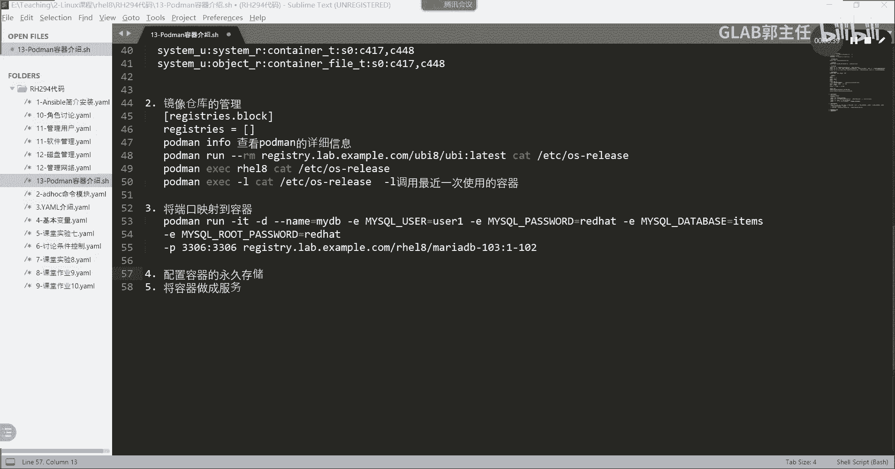

## 概述
在本节课中，我们将学习如何为容器配置永久性存储。这是容器技术中的一个核心概念，它解决了容器关闭后数据丢失的问题，尤其对于数据库这类需要持久化数据的应用至关重要。

## 为什么需要永久性存储？
上一节我们介绍了容器的基本操作，本节中我们来看看如何保存容器产生的数据。容器在关闭后，其内部的所有内容都会消失。例如，一个数据库容器在运行过程中会产生新数据，我们需要将这些数据永久保存下来。解决方案是建立主机目录与容器内部目录的映射关系，让容器将数据写入主机目录。这样，即使容器关闭，数据依然保留在主机上。

## 实验目标与步骤
我们将通过一个实验来验证永久性存储的配置。实验目标是：创建一个HTTPD（Apache）容器，将主机上的一个目录映射到容器内用于存放网页文件的目录。我们在主机目录中创建一个网页文件，然后通过容器访问它。接着，我们关闭旧版本容器，并启动一个新版本的容器，验证映射的目录和文件是否依然有效，从而证明数据被永久保存。

以下是实验的具体步骤：

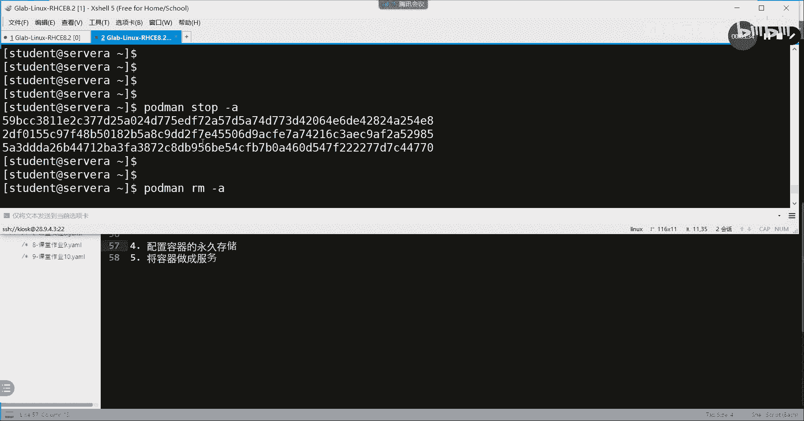

1.  使用普通用户登录实验环境。
2.  登录到镜像仓库，下载指定版本的HTTPD镜像。
3.  在主机上创建用于映射的目录和网页文件。
4.  运行容器，并使用 `-v` 参数配置目录映射，同时使用 `-p` 参数配置端口映射。
5.  测试容器服务，验证网页可以正常访问。
6.  停止并删除旧容器，验证主机上的文件依然存在。
7.  下载并运行新版本的HTTPD容器，使用相同的目录映射配置。
8.  再次测试，验证网页文件依然可以被新容器访问。

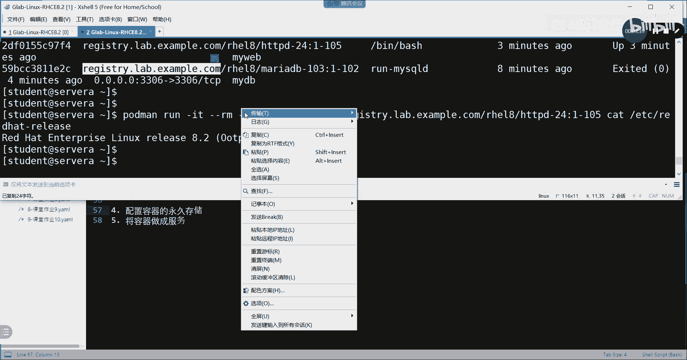

## 详细操作过程

### 1. 登录与准备
首先，我们以 `student` 用户登录到服务器，并登录到镜像仓库。

```bash
podman login registry.redhat.io
```
输入用户名和密码（例如 `admin` / `redhat321`）完成登录。

### 2. 创建主机目录与文件
接下来，在主机上创建用于存储网页内容的目录结构，并在其中创建首页文件。

```bash
mkdir -p ~/webcontent/html
echo "Hello World" > ~/webcontent/html/index.html
```
*   `mkdir -p`：递归创建目录，即使父目录不存在。
*   `echo “Hello World” > …`：创建 `index.html` 文件，内容为 “Hello World”。

### 3. 运行容器并配置映射
现在，我们运行一个HTTPD容器，并进行关键的两项配置：端口映射和目录映射。

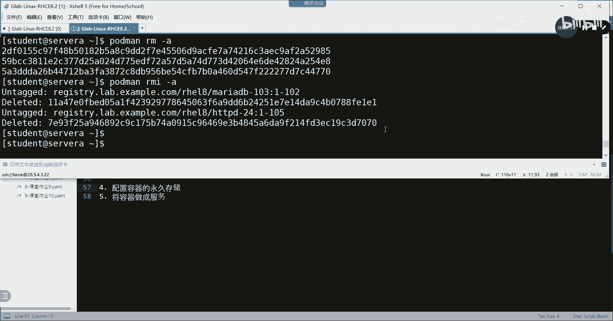

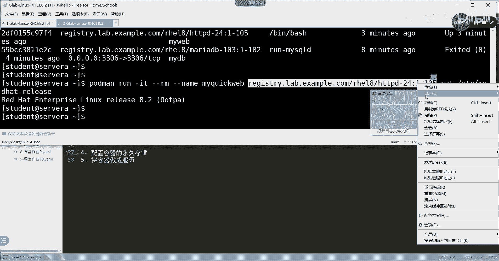

```bash
podman run -t -d --name myweb \
  -p 8080:8080 \
  -v ~/webcontent:/var/www/html:Z \
  registry.redhat.io/rhel8/httpd-24:1-98
```

以下是命令参数解析：
*   `-t -d`：分配一个伪终端并在后台运行容器。
*   `--name myweb`：为容器指定名称 `myweb`。
*   `-p 8080:8080`：端口映射。将主机的8080端口映射到容器的8080端口。
*   `-v ~/webcontent:/var/www/html:Z`：目录映射（永久存储的核心）。
    *   `~/webcontent`：主机上的源目录。
    *   `/var/www/html`：容器内的目标目录（HTTPD服务的默认网页根目录）。
    *   `:Z`：这是一个SELinux上下文标签选项。它确保主机目录的SELinux类型与容器内目标目录的类型一致，这对于服务能够正常访问映射目录内的文件至关重要。如果不加此选项，可能会因权限问题导致访问失败。

### 4. 测试服务
容器运行后，我们测试服务是否正常，并验证它提供的是我们主机上创建的文件。

```bash
curl http://localhost:8080
```
如果配置成功，此命令将返回 “Hello World”。这说明HTTPD服务（由容器提供）成功读取了主机目录 `~/webcontent/html/index.html` 下的文件。

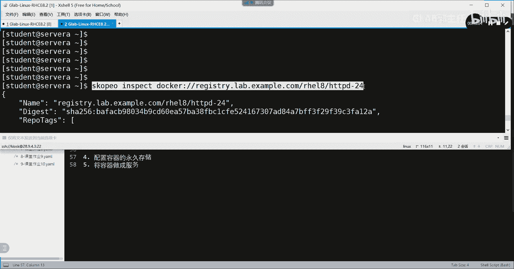

### 5. 验证永久存储：升级容器
为了证明数据是永久存储在主机上的，我们进行容器升级操作。

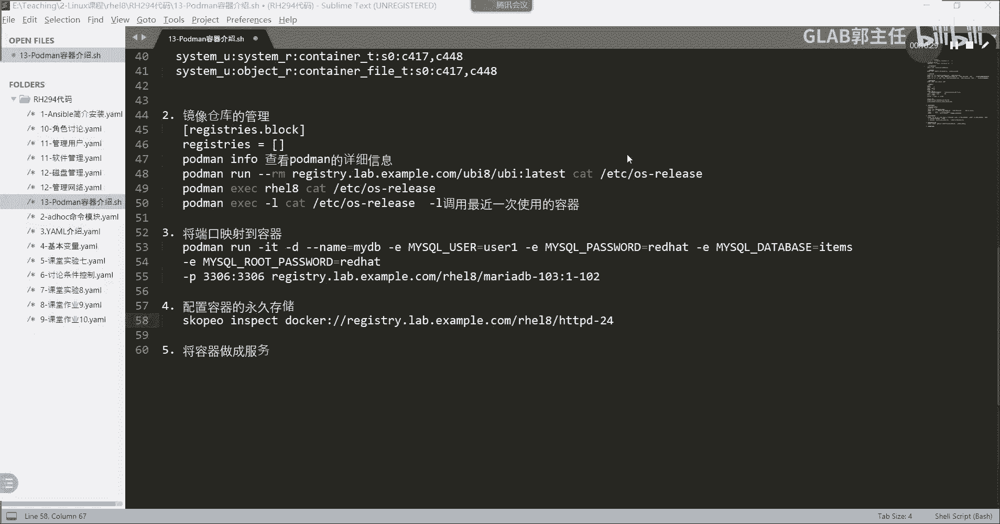

首先，停止并删除当前运行的容器：
```bash
podman stop myweb
podman rm myweb
```
删除容器后，检查主机上的文件是否依然存在：
```bash
cat ~/webcontent/html/index.html
```
文件内容 “Hello World” 应该仍然存在，这证明了数据独立于容器生命周期。

接下来，查看镜像仓库中可用的HTTPD版本：
```bash
skopeo inspect docker://registry.redhat.io/rhel8/httpd-24
```
此命令会列出所有可用标签（如 `1-98`, `1-105`, `latest`）。

最后，下载并运行新版本（例如 `latest` 标签）的容器，保持相同的映射配置：
```bash
podman run -t -d --name myweb \
  -p 8080:8080 \
  -v ~/webcontent:/var/www/html:Z \
  registry.redhat.io/rhel8/httpd-24:latest
```
再次使用 `curl http://localhost:8080` 测试，应该仍然能看到 “Hello World”。这表明新容器成功继承了之前永久存储的数据。

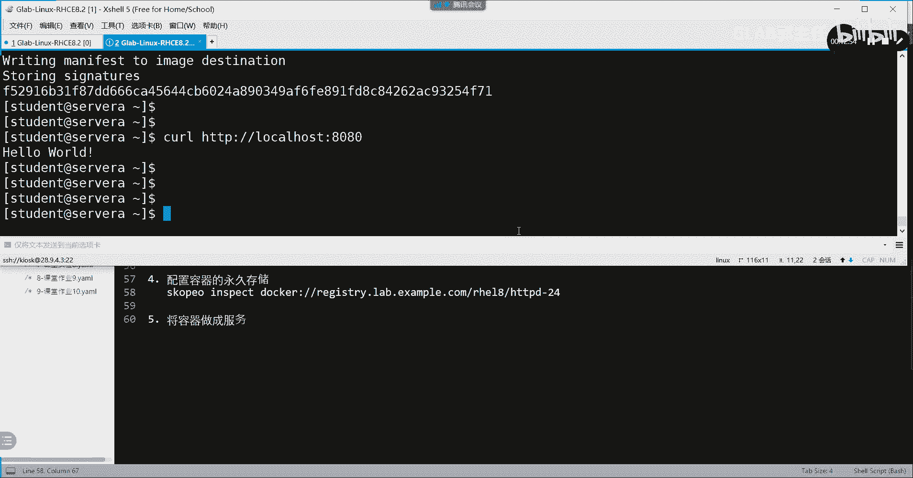

### 6. 清理实验环境
实验完成后，可以强制删除所有容器以清理环境。

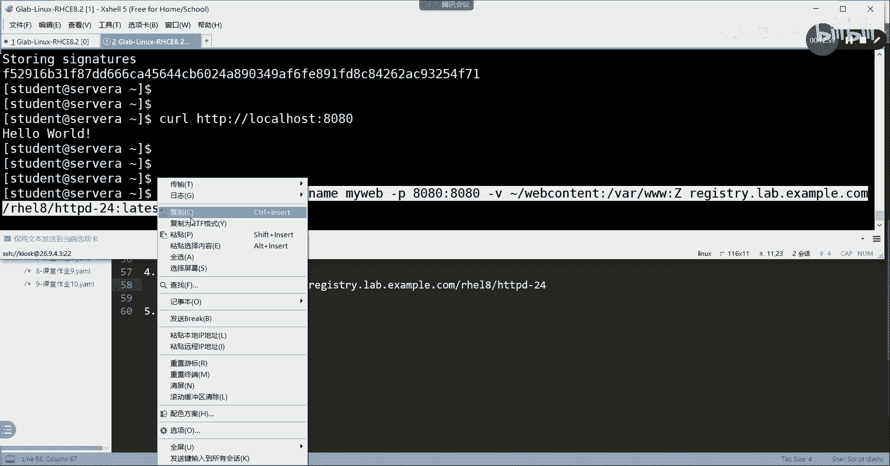

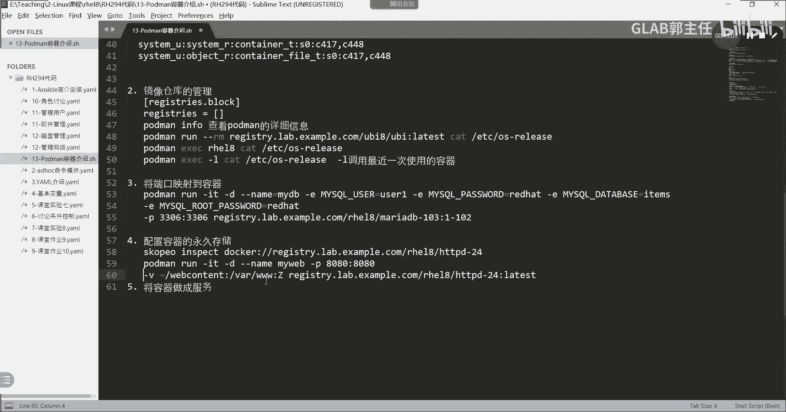

```bash
podman rm -fa
```
*   `-f`：强制删除，包括正在运行的容器。
*   `-a`：删除所有容器。

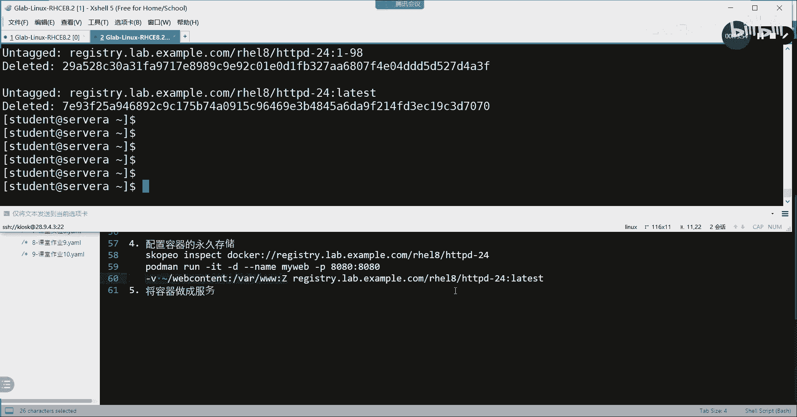

## 总结
本节课中我们一起学习了容器永久性存储的配置方法。核心是通过 `podman run` 命令的 `-v`（或 `--volume`）参数，将主机目录映射到容器内部目录。我们特别强调了 `:Z` 选项对于SELinux环境的重要性。通过端口映射和目录映射的结合，我们实现了服务的对外访问和数据持久化。这种机制使得容器可以无状态地运行和升级，而重要数据则安全地保留在主机上，这是生产环境中使用容器的关键实践之一。