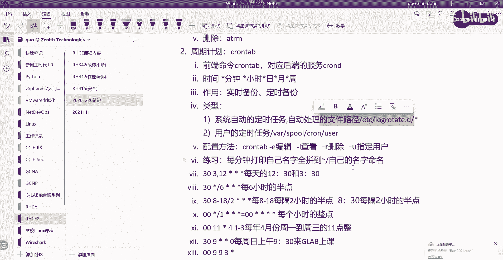
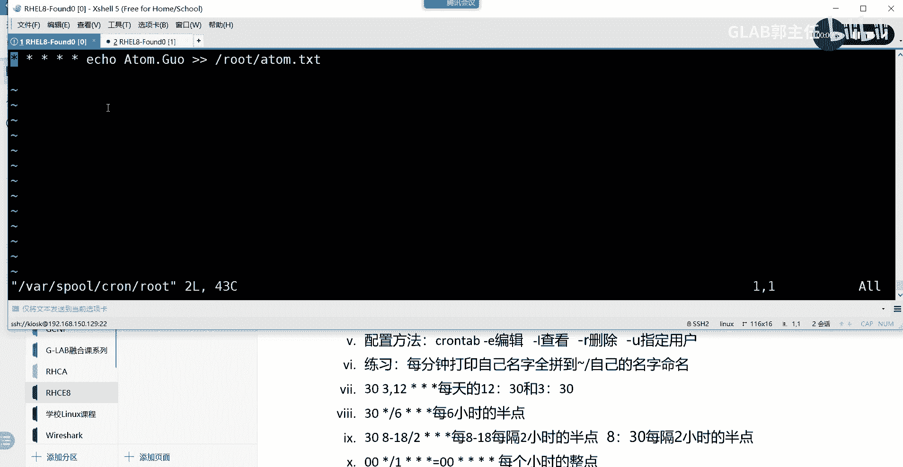
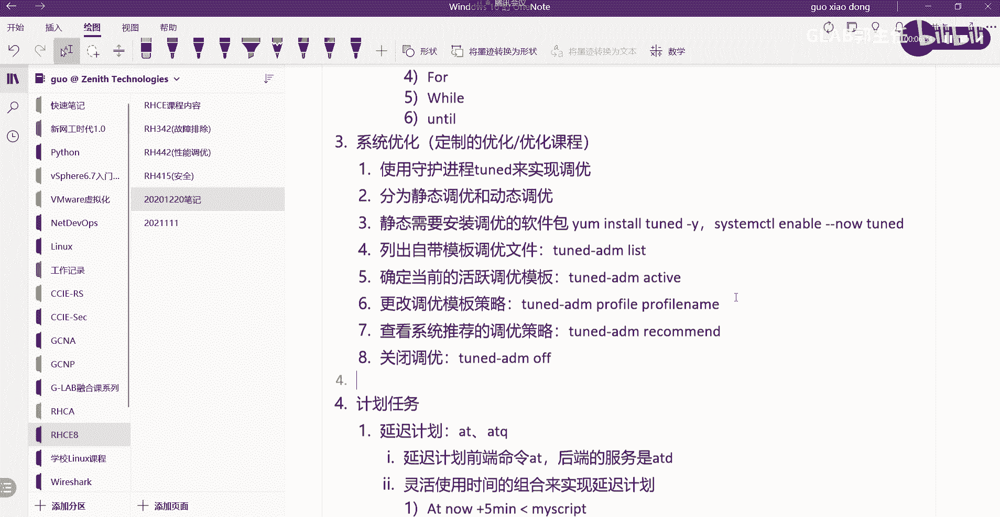
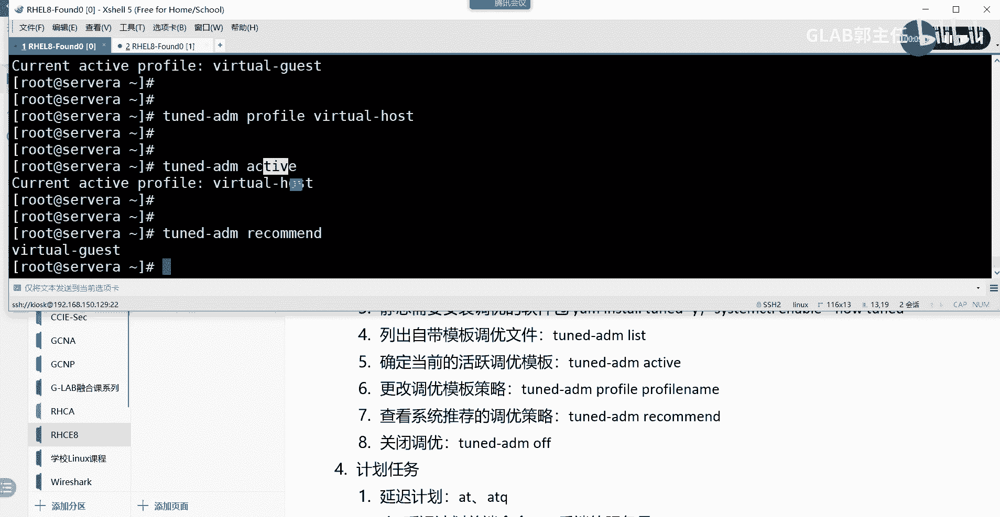
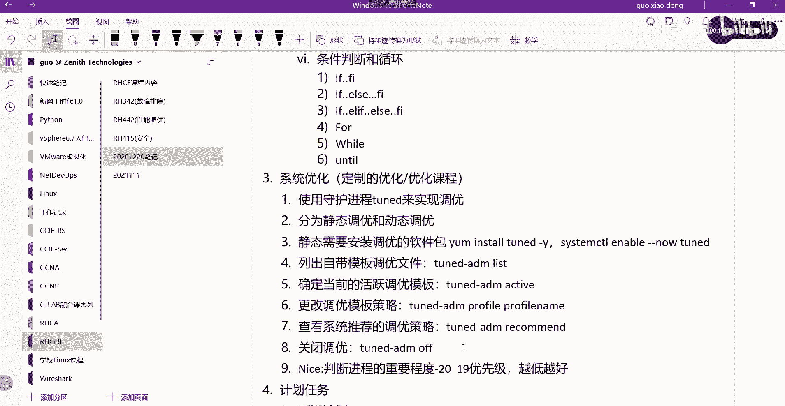
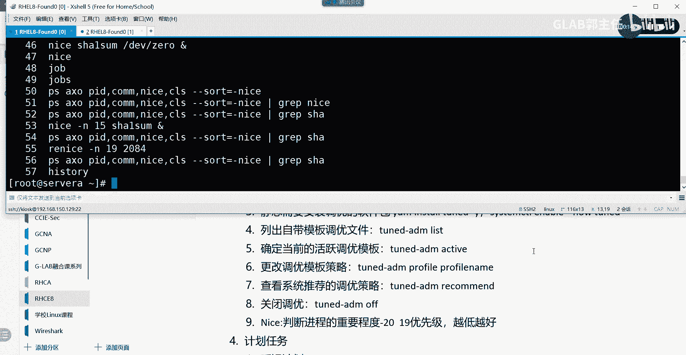

# Linux系统调优：25：系统调优与进程优先级管理

在本节课中，我们将要学习Linux系统中的调优基础以及如何管理进程的优先级。课程内容分为两部分：首先介绍如何使用系统自带的`tuned`服务进行静态调优，然后讲解如何使用`nice`和`renice`命令来调整进程的优先级。



## 概述



系统调优是优化Linux系统性能的重要手段。对于初学者，我们首先接触的是基于预定义模板的“静态调优”。此外，系统管理员还可以通过调整进程的“nice值”来影响CPU调度器对进程的优先级处理。本节将详细介绍这两个核心概念和操作方法。

## 系统调优 (tuned服务)

上一节我们介绍了自动化任务的管理，本节中我们来看看如何对系统进行基础的性能调优。Linux提供了一个名为`tuned`的守护进程，用于实现定制化的系统调优。

`tuned`服务提供两种主要的调优模式：
*   **静态调优**：直接应用预定义的优化模板。
*   **动态调优**：监控系统活动并动态调整参数（后续课程涉及）。

我们主要学习静态调优，它操作简单，是RHCSA考试中的常见考点。

### 安装与启用tuned服务

通常，`tuned`软件包在系统安装后默认存在。如果未安装，可以使用以下命令安装：
```bash
yum install tuned -y
```
安装后，需要确保`tuned`服务开机自启并运行：
```bash
systemctl enable --now tuned
```

### 核心管理命令

以下是使用`tuned-adm`命令进行静态调优的几个关键操作：

1.  **列出所有可用的调优模板**
    此命令用于查看系统预置的所有优化策略配置文件。
    ```bash
    tuned-adm list
    ```



2.  **查看当前活动的调优模板**
    此命令用于确认系统当前正在使用哪一个优化策略。
    ```bash
    tuned-adm active
    ```

3.  **切换调优模板**
    此命令用于将系统优化策略更改为指定的模板。你需要使用`list`命令查看到的模板名称。
    ```bash
    tuned-adm profile <profile_name>
    ```
    *例如：* `tuned-adm profile virtual-host`

4.  **查看系统推荐的调优模板**
    此命令会显示`tuned`服务根据当前系统环境（如虚拟机、桌面等）推荐的优化策略。
    ```bash
    tuned-adm recommend
    ```

5.  **关闭调优**
    此命令用于停止所有`tuned`优化，恢复系统默认设置。
    ```bash
    tuned-adm off
    ```

**操作流程示例**：如果考试要求你将系统调优改为“virtual-host”模板，你可以执行以下步骤：
1.  使用 `tuned-adm list` 确认该模板存在。
2.  使用 `tuned-adm active` 查看当前模板。
3.  使用 `tuned-adm profile virtual-host` 进行切换。
4.  再次使用 `tuned-adm active` 验证是否更改成功。

## 进程优先级管理 (nice值)



在了解了系统级别的调优后，我们来看看如何对单个进程进行优先级调整。这通过“nice值”来实现。

进程的nice值范围是 **-20 到 19**。**数值越低，优先级越高**（即-20优先级最高，19优先级最低）。系统会为进程分配一个默认的nice值（通常为0），管理员可以修改它。



### 查看进程nice值

我们可以使用`ps`命令查看进程及其当前的nice值。
```bash
ps axo pid,comm,nice --sort=-nice
```
这条命令会列出进程ID(PID)、命令名(comm)和nice值(nice)，并按照nice值从低到高（即优先级从高到低）排序。

### 调整进程nice值

调整nice值分为两种情况：启动新进程时指定，以及修改已运行进程的值。

1.  **启动新进程时指定nice值**
    使用`nice`命令可以直接以指定的优先级启动一个程序。
    ```bash
    nice -n 15 sha1sum /dev/zero &
    ```
    此命令以nice值15在后台启动`sha1sum`进程。如果不使用`-n`选项，新进程将继承默认的nice值（通常为0）。

2.  **修改已运行进程的nice值**
    使用`renice`命令可以更改一个已经存在的进程的优先级。
    ```bash
    renice 19 -p 2084
    ```
    此命令将PID为2084的进程的nice值改为19（即降低其优先级）。

## 总结

本节课中我们一起学习了Linux系统调优与进程优先级管理的基础知识。
*   我们首先介绍了如何使用`tuned`服务进行静态系统调优，包括查看、切换模板等核心命令。这是一个非常实用的系统优化工具。
*   接着，我们学习了进程优先级的概念，掌握了通过`nice`和`renice`命令来查看和修改进程nice值的方法，从而影响CPU对进程的调度顺序。



掌握这些内容，你已能够完成基础的性能调优和进程管理任务。