# Linux防火墙与SELinux端口管理：第35章：网络安全基础与配置 🔥

在本节课中，我们将要学习Linux系统中的网络安全核心组件：防火墙和SELinux的端口管理。我们将从基本概念入手，了解它们如何协同工作以控制系统网络流量，并掌握配置它们的基本命令。

## 操作系统防火墙基础

上一节我们介绍了课程概述，本节中我们来看看防火墙的基础概念。

操作系统安装完成后，防火墙默认是开启的。防火墙的主要功能是控制进出系统的网络流量。这个网络流量包括数据包、网络地址转换以及端口转换。因此，防火墙不仅能控制数据包，还能执行网络地址和端口的转换。

防火墙在数据包到达用户空间之前进行处理。这意味着所有进入系统的数据在到达用户空间前，都必须经过防火墙的规则检查和转发。

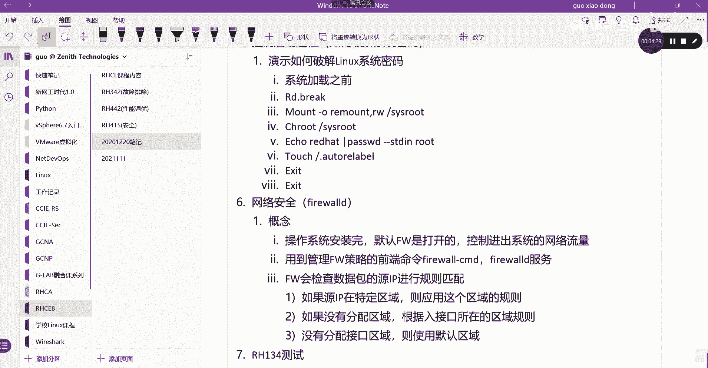

管理防火墙策略的前端命令是 `firewall-cmd`。而后端服务是 `firewalld` 服务。

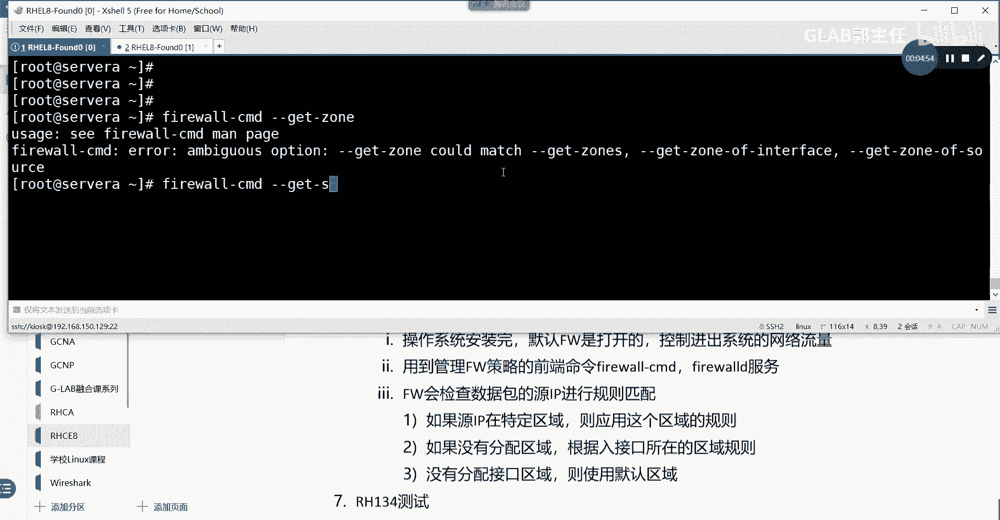

## 防火墙规则匹配机制

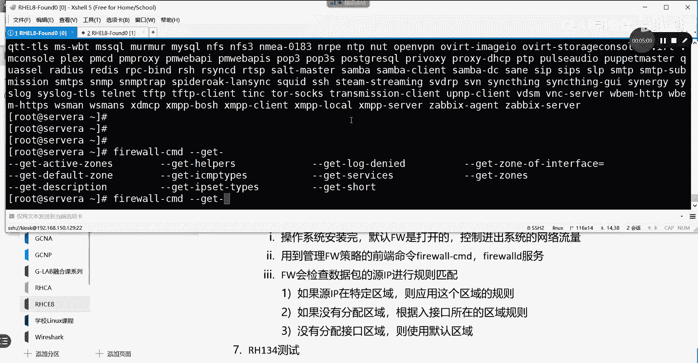

上一节我们了解了防火墙的基本功能，本节中我们来看看防火墙如何匹配规则。

`firewalld` 会检查每一个数据包的源IP地址，并据此进行规则匹配。其匹配逻辑基于“区域”概念。

如果数据包的源地址被分配给了某个特定的区域，则应用该区域的规则。如果源地址没有分配区域，则根据数据包进入的接口所在的区域规则进行匹配。如果接口也没有分配区域，则使用默认区域。

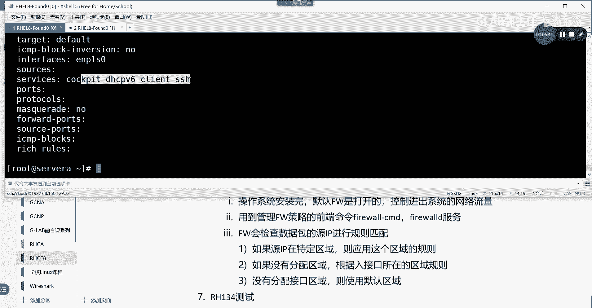

由此可见，防火墙查找规则是基于区域进行的。系统默认的区域可以通过命令查看。

```bash
firewall-cmd --get-default-zone
```

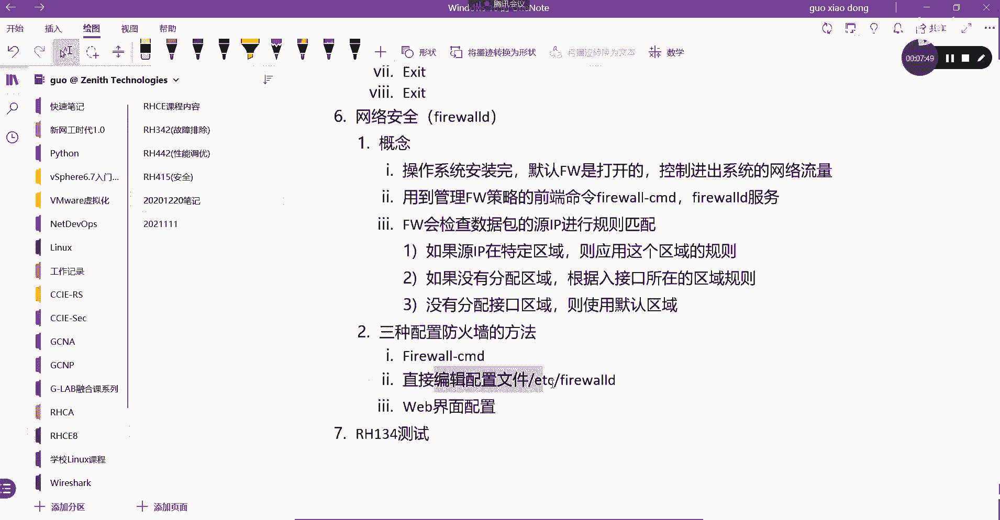

系统默认的区域通常是 `public`。我们可以查看 `public` 区域的详细规则。

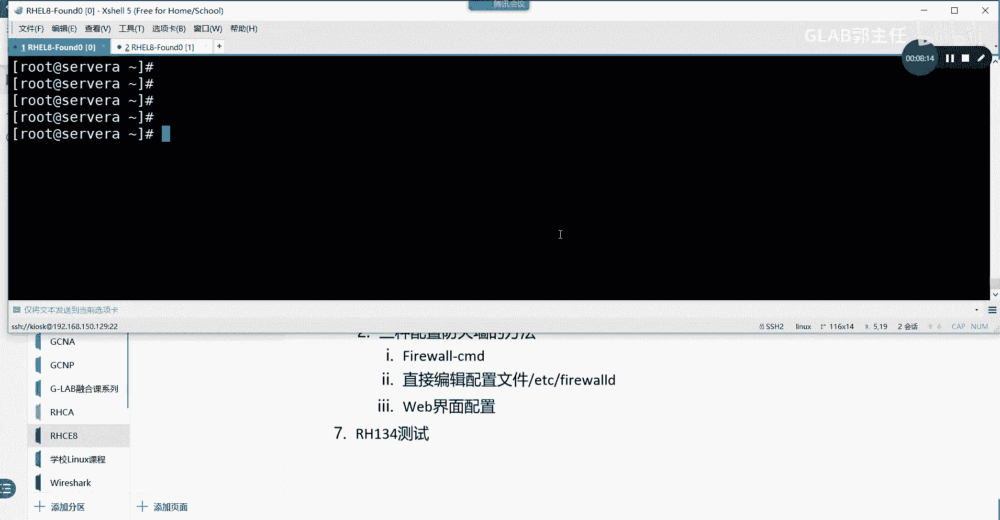

```bash
firewall-cmd --zone=public --list-all
```

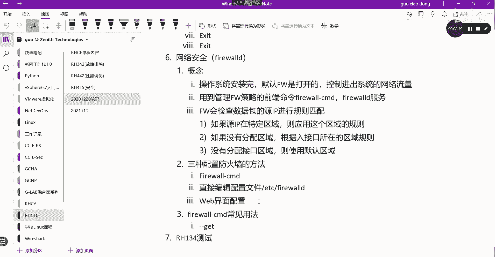

你会发现，默认情况下 `public` 区域开放了 SSH 端口。这就是为什么安装完系统后，通常可以通过 SSH 远程访问。如果后续需要开放其他服务（如 HTTP），则必须在该区域中添加相应规则。

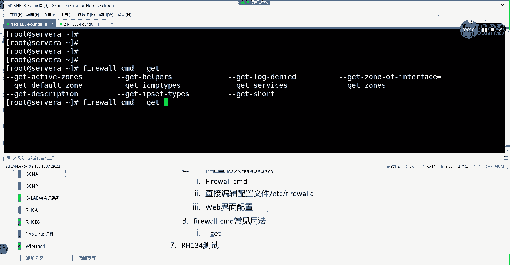

## 配置防火墙的三种方法

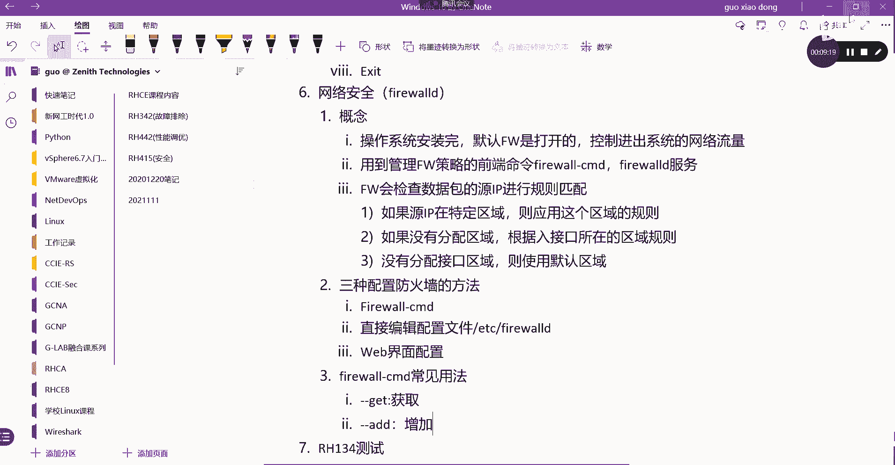

上一节我们探讨了规则匹配机制，本节中我们来看看配置防火墙的几种途径。

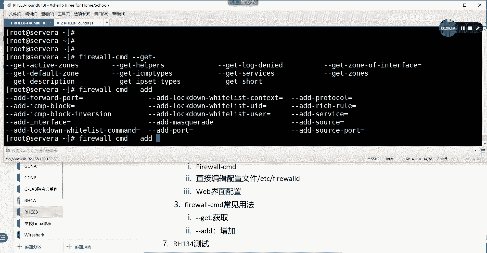

以下是三种配置防火墙的方法：

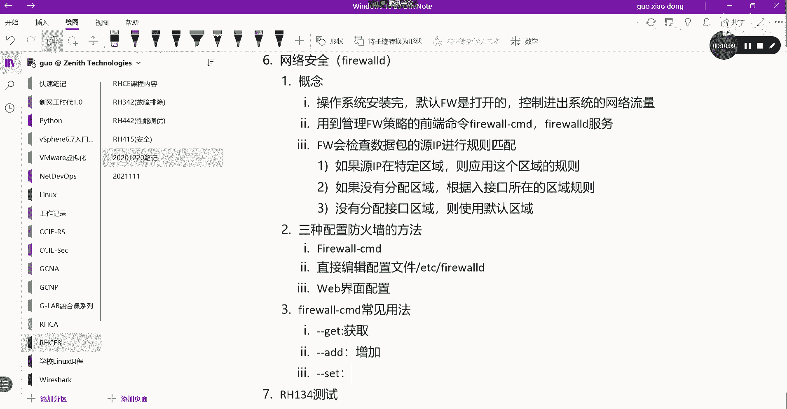

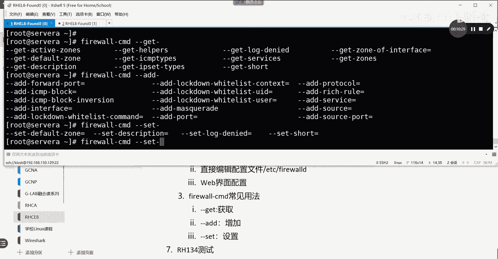

1.  **使用 `firewall-cmd` 命令**：这是最常用和推荐的方法，我们将在下一节详细讲解。
2.  **直接编辑配置文件**：配置文件位于 `/etc/firewalld/` 目录下，可以直接编辑其中的 XML 文件来修改规则。但这种方法不直观，容易出错。
3.  **通过 Web 界面配置**：在 RHEL 8 及更高版本中，可以通过安装并访问 `cockpit` 管理界面，在图形化界面中配置防火墙。

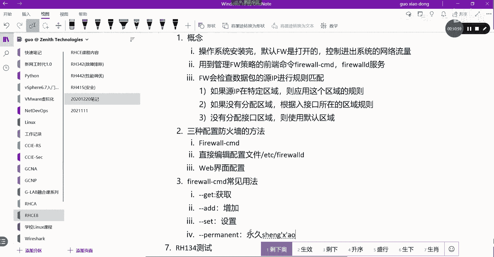

其中，使用 `firewall-cmd` 命令行工具是核心技能。

## firewall-cmd 命令详解

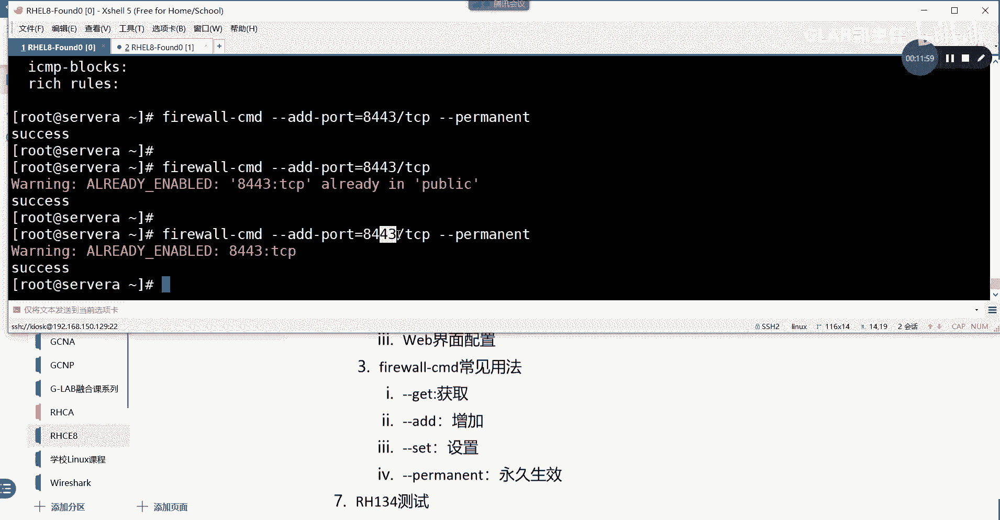

上一节我们列出了配置方法，本节中我们重点学习 `firewall-cmd` 的常见用法。

`firewall-cmd` 命令功能丰富，以下是一些核心操作：

*   **查询信息**：使用 `--get-*` 系列参数。
    ```bash
    firewall-cmd --get-default-zone    # 获取默认区域
    firewall-cmd --get-active-zones    # 获取活动区域
    firewall-cmd --get-zones           # 获取所有可用区域
    ```

*   **添加规则**：使用 `--add-*` 系列参数。
    ```bash
    firewall-cmd --zone=public --add-port=8443/tcp          # 在public区域开放8443/TCP端口
    firewall-cmd --zone=public --add-service=http           # 在public区域开放http服务
    firewall-cmd --zone=public --add-interface=eth1         # 将eth1接口加入public区域
    ```

*   **设置参数**：使用 `--set-*` 系列参数，例如设置默认区域。
    ```bash
    firewall-cmd --set-default-zone=home
    ```

*   **永久生效**：**这是关键点**。默认情况下，使用 `--add-*` 添加的规则是运行时规则，重启后会失效。必须加上 `--permanent` 参数才能永久保存。
    ```bash
    firewall-cmd --permanent --zone=public --add-port=8443/tcp
    ```
    添加永久规则后，需要重新加载防火墙配置或重启 `firewalld` 服务使其立即生效。
    ```bash
    firewall-cmd --reload   # 重新加载配置（推荐）
    # 或
    systemctl restart firewalld # 重启服务
    ```

## SELinux 端口标记管理

上一节我们掌握了防火墙的配置，本节中我们来看看系统最后一道安全防线——SELinux 对端口的控制。

SELinux 不仅对文件和进程进行安全上下文标记，以实现强制访问控制，还能对网络端口进行标记。这弥补了传统防火墙的不足。

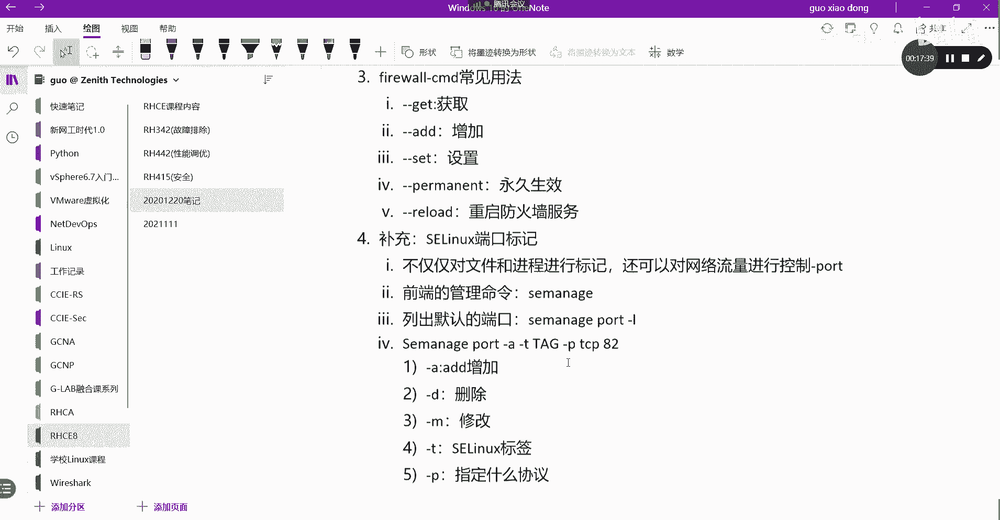

默认情况下，服务使用约定俗成的端口（如 HTTP 使用 80 端口）。SELinux 维护着一个端口标签列表。如果一个服务（如 HTTP）试图使用一个不在其标签列表中的端口（如 82），即使防火墙放行了该端口，SELinux 也会阻止访问。

管理 SELinux 端口标签的前端命令是 `semanage`。

以下是 `semanage port` 的常见用法：

*   **列出端口标签**：查看当前 SELinux 允许的端口及其标签。
    ```bash
    semanage port -l
    # 过滤查看HTTP相关端口
    semanage port -l | grep http
    ```

*   **添加端口标签**：允许服务使用新端口。
    ```bash
    semanage port -a -t http_port_t -p tcp 82
    ```
    *   `-a`: 添加 (Add)
    *   `-t http_port_t`: 指定标签类型，必须与服务匹配（如 `http_port_t`）
    *   `-p tcp`: 指定协议 (Protocol)
    *   `82`: 端口号

*   **删除端口标签**：
    ```bash
    semanage port -d -t http_port_t -p tcp 82
    ```
    *   `-d`: 删除 (Delete)

*   **修改端口标签**：
    ```bash
    semanage port -m -t new_port_label_t -p tcp 82
    ```
    *   `-m`: 修改 (Modify)

在实际工作中，如果遇到网络服务无法访问的问题，在检查了防火墙配置后，也需要考虑 SELinux 的影响。一个快速的排查方法是临时将 SELinux 设置为宽容模式或禁用（生产环境慎用）：
```bash
setenforce 0 # 临时设置为宽容模式
# 或编辑 /etc/selinux/config，将 SELINUX=enforcing 改为 SELINUX=disabled （需重启）
```

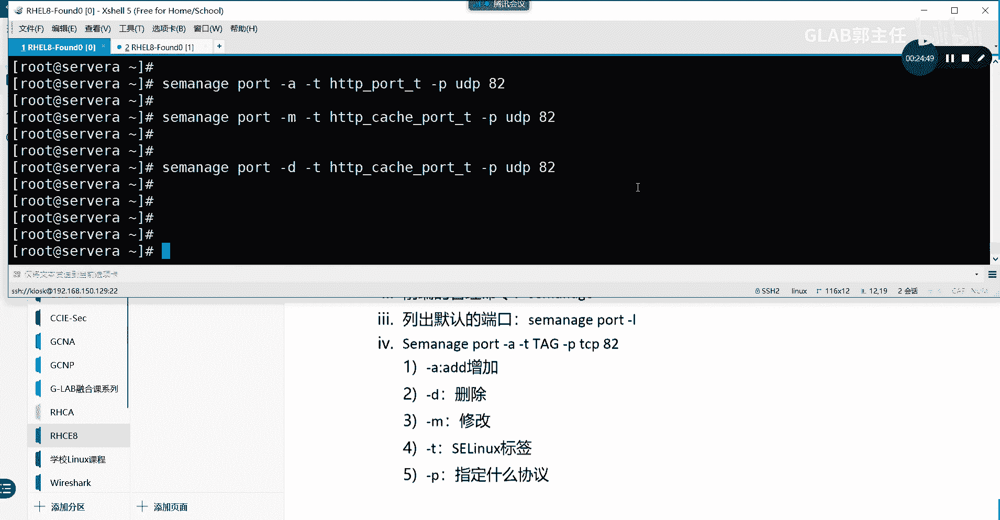

## 总结 🎯

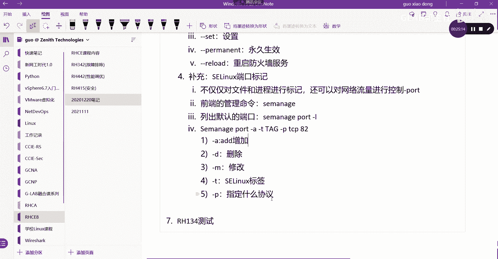

本节课中我们一起学习了 Linux 网络安全的两大基石：防火墙和 SELinux 端口管理。

我们了解到 `firewalld` 防火墙通过“区域”来管理规则，并使用 `firewall-cmd` 命令进行配置，特别要注意使用 `--permanent` 参数使规则永久生效。同时，我们认识到 SELinux 作为更深层的安全机制，通过端口标签控制网络访问，可以使用 `semanage port` 命令进行管理。

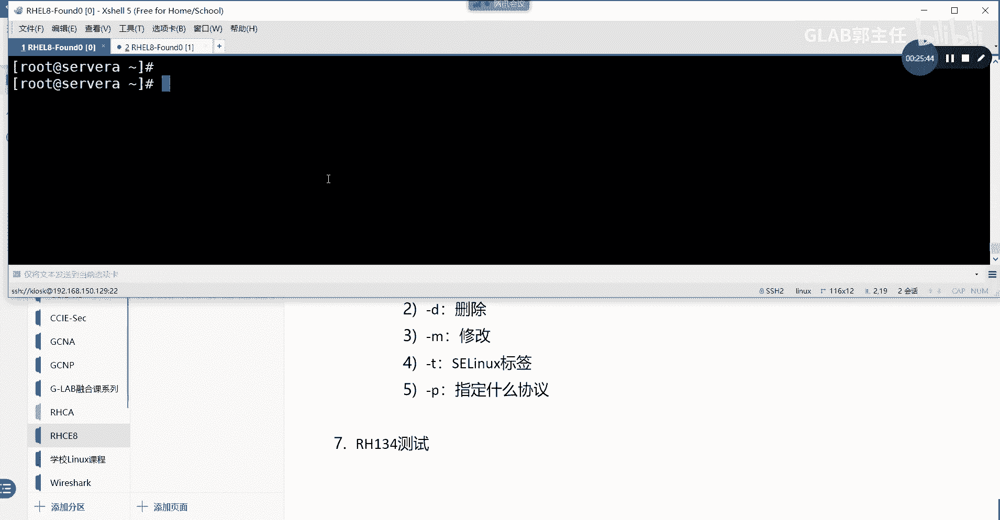

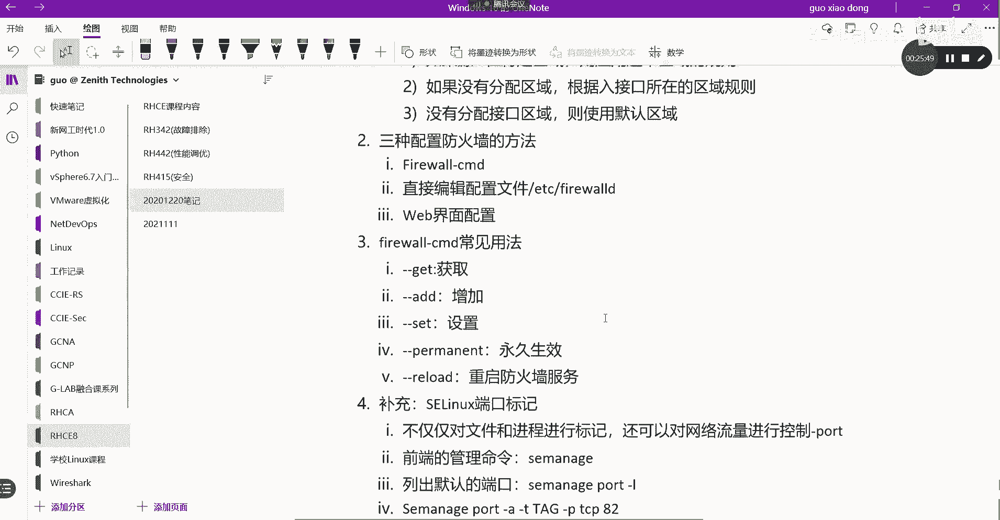

理解这两者的关系和工作原理，对于构建安全的 Linux 系统和排查网络问题至关重要。