# Linux网络存储：1：NFS网络文件系统概述与永久挂载 🗂️

在本节课中，我们将要学习NFS（网络文件系统）的基本概念，以及如何通过网络将远程服务器的存储空间挂载到本地系统。我们将从理解NFS的原理开始，并实践两种主要的挂载方式：永久挂载和按需挂载。

NFS是网络文件系统的缩写。它可以理解为在网络上实现的一个共享存储。为了便于理解，我们通过一个场景来描述：假设网络中有两台Linux服务器，Server A和Server B。Server B上有一个名为`public`的目录，它对应着Server B上的一块物理存储空间。我们的目标是让Server A能够通过网络，将Server B上的这块存储空间挂载到本地的一个目录（例如`/test`）下。这样，在Server A上访问本地的`/test`目录，实际上访问的就是Server B上`public`目录的内容。

实现这个目标涉及两个核心技术点：
1.  **挂载**：无论存储空间在本地还是网络远端，都需要将其关联到本地文件系统的某个目录下。这可以通过`mount`命令临时挂载，或通过修改`/etc/fstab`文件实现永久挂载。
2.  **共享协议**：本地存储直接通过系统总线访问，而网络存储则需要一个协议来实现通信和共享。这个协议就是**NFS**。

因此，要实现网络存储共享，我们需要同时解决“如何挂载”和“如何通过网络共享（即配置NFS）”这两个问题。本节课我们先学习第一种方式：永久挂载。

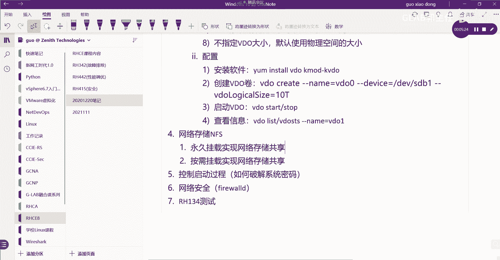

## 永久挂载NFS共享存储实践 🔧

上一节我们介绍了NFS的基本原理，本节中我们来看看如何通过永久挂载的方式实现网络存储。在实验环境中，NFS服务端（提供共享的服务器）的配置已经预先完成，我们的重点是在客户端（需要挂载共享的服务器）上进行挂载操作。

以下是实现永久挂载的步骤：

1.  **（可选）配置NFS客户端参数**
    此步骤用于调整客户端使用的NFS协议版本，属于优化和安全配置，非必需。命令如下：
    ```bash
    # 启用NFS守护进程，使用UDP协议，并禁用NFS版本2和3
    # 启用TCP协议，并启用NFS版本4及其子版本4.0、4.1、4.2
    # 注意：此命令为示例，具体参数需根据环境要求调整
    nfsconf --set nfsd udp n
    nfsconf --set nfsd vers2 n
    nfsconf --set nfsd vers3 n
    nfsconf --set nfsd tcp y
    nfsconf --set nfsd vers4 y
    nfsconf --set nfsd vers4.0 y
    nfsconf --set nfsd vers4.1 y
    nfsconf --set nfsd vers4.2 y
    ```

2.  **创建本地挂载点**
    在本地创建一个目录，作为远程共享的挂载入口。
    ```bash
    mkdir /public
    ```

3.  **测试NFS连通性与临时挂载**
    在配置永久挂载前，建议先用`mount`命令测试临时挂载，以验证NFS服务是否正常。
    ```bash
    # 将 server-b 主机上的 /shares/public 目录，通过NFS协议临时挂载到本地的 /public 目录
    mount -t nfs server-b.example.com:/shares/public /public
    ```
    执行后，使用`df -hT`命令查看挂载情况，并进入`/public`目录查看内容，确认访问的是远程服务器的文件。

4.  **配置永久挂载**
    临时挂载测试成功后，将其写入`/etc/fstab`文件以实现开机自动挂载。
    编辑`/etc/fstab`文件，添加如下一行：
    ```
    server-b.example.com:/shares/public  /public  nfs  rw,sync  0 0
    ```
    *   **第一部分**：远程NFS共享的路径，格式为`服务器地址或主机名:共享目录路径`。
    *   **第二部分**：本地挂载点路径。
    *   **第三部分**：文件系统类型，此处为`nfs`。
    *   **第四部分**：挂载选项。`rw`表示可读写，`sync`表示同步写入（数据变更立即生效）。
    *   **第五、六部分**：通常对NFS挂载设为`0 0`。

    保存文件后，执行`mount -a`命令重新加载所有`/etc/fstab`中的配置，若无报错即表示配置成功。重启系统后，挂载依然生效。

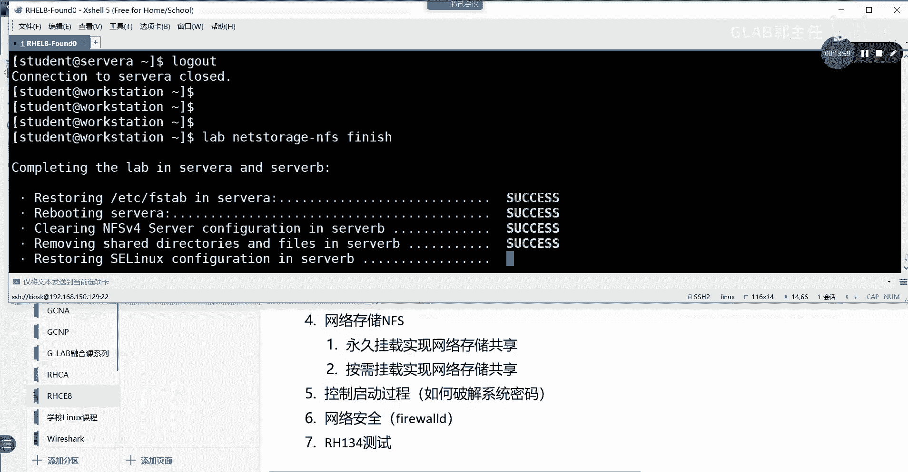

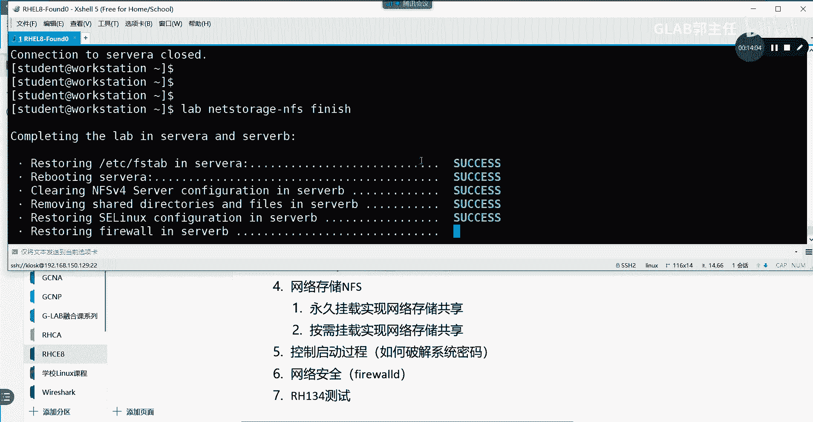

通过以上步骤，我们实现了NFS共享的永久挂载。可以看到，在NFS服务端已配置好的前提下，客户端的核心操作就是**挂载**，其关键在于理解`/etc/fstab`文件中NFS挂载条目的书写格式。

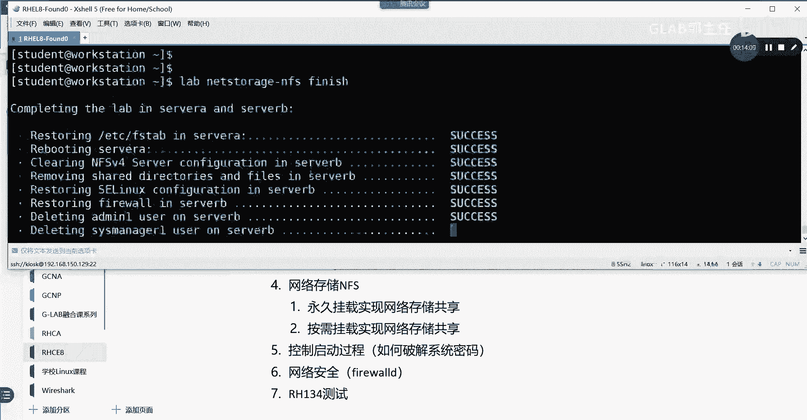

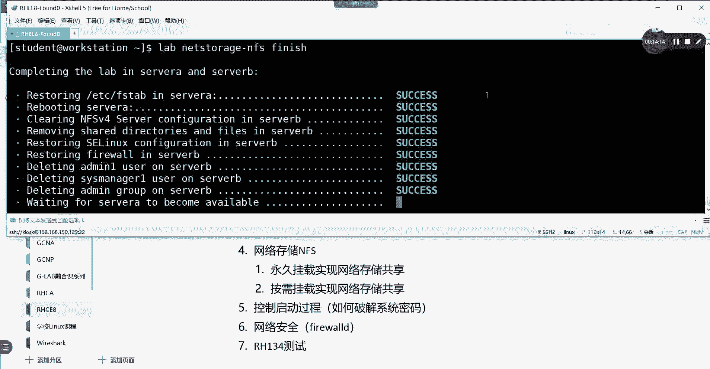

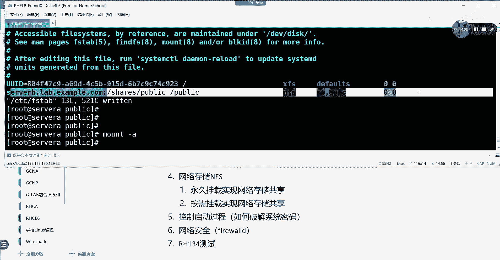

---

# Linux网络存储：2：NFS按需挂载（AutoFS）实践 ⚡

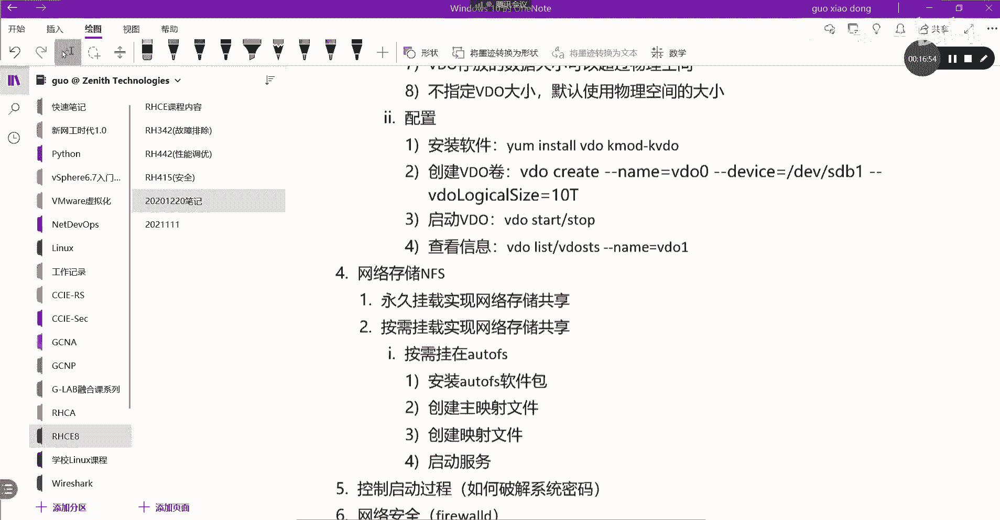

上一节我们介绍了如何通过永久挂载的方式使用NFS共享。本节中我们来看看另一种更灵活的挂载方式——按需挂载，它通过`autofs`服务实现。

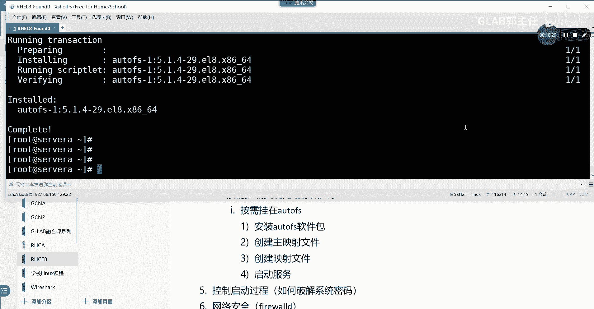

按需挂载的特点是：只有当用户真正访问挂载点目录时，系统才会自动执行挂载操作；在一段时间无访问后，系统又会自动卸载。这种方式节省资源，管理也更便捷。实现按需挂载主要依赖`autofs`这个软件包，它通过配置文件来定义挂载规则。


以下是配置AutoFS按需挂载的核心步骤：

1.  **安装autofs软件包**
    ```bash
    yum install -y autofs
    ```

2.  **创建主映射文件**
    `autofs`的主配置文件是`/etc/auto.master`，但我们通常在其子目录`/etc/auto.master.d/`下创建自定义的映射文件。例如，创建一个名为`nfs.autofs`的文件：
    ```bash
    vi /etc/auto.master.d/nfs.autofs
    ```
    在该文件中添加一行，定义挂载的“触发点”和对应的详细映射文件：
    ```
    /-  /etc/auto.direct
    ```
    *   `/-`：这是一个特殊的指示符，表示使用直接映射（direct map），即挂载点路径在详细映射文件中绝对定义。
    *   `/etc/auto.direct`：指定详细映射文件的路径。

3.  **创建详细映射文件**
    创建上一步中指定的详细映射文件`/etc/auto.direct`：
    ```bash
    vi /etc/auto.direct
    ```
    在该文件中，定义具体的挂载规则，每行一个。格式为：
    ```
    [本地挂载点] [挂载选项] [远程NFS共享路径]
    ```
    例如：
    ```
    /external  -rw,sync,fstype=nfs4  server-b.example.com:/shares/direct/external
    ```
    *   `/external`：本地绝对路径挂载点。当访问此目录时触发挂载。
    *   `-rw,sync,fstype=nfs4`：挂载选项。`rw`可读写，`sync`同步，`fstype=nfs4`指定使用NFSv4协议。
    *   `server-b.example.com:/shares/direct/external`：远程NFS共享路径。

4.  **启动并启用autofs服务**
    ```bash
    systemctl enable --now autofs
    systemctl restart autofs # 确保配置生效
    ```

5.  **测试按需挂载**
    配置完成后，无需手动执行`mount`命令。直接访问定义好的本地挂载点（如`/external`），`autofs`会自动将其挂载。
    ```bash
    ls /external
    ```
    首次访问时可能会有短暂延迟，之后即可看到远程共享的文件。使用`df -hT`或`mount`命令可以确认挂载已生效。一段时间不访问后，挂载会自动解除。

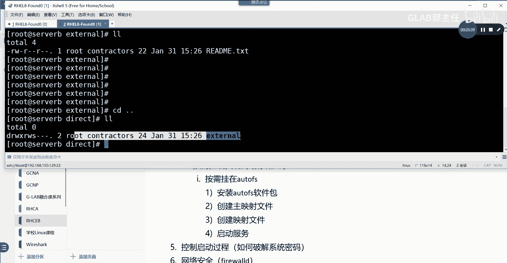

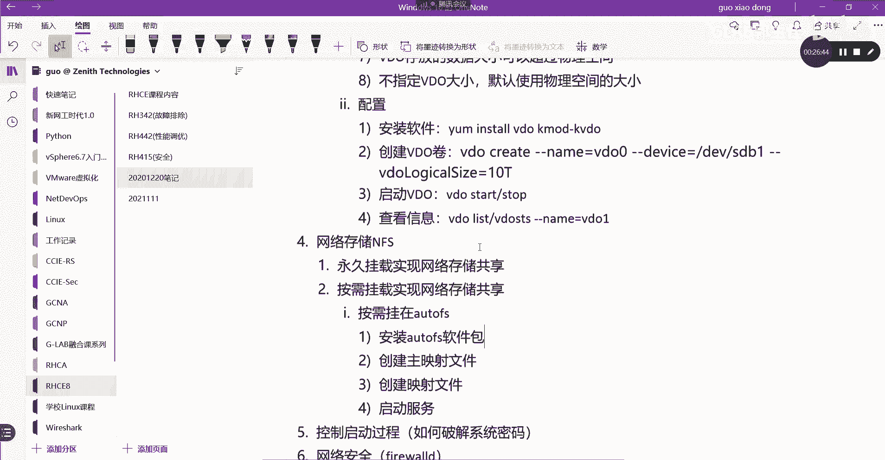

**重要提示**：通过NFS挂载的目录，其访问权限（哪个用户能读、能写）是由**NFS服务端**上共享目录本身的Linux文件权限和NFS导出选项共同决定的。客户端用户需要映射到服务端上相应的有效权限才能访问。

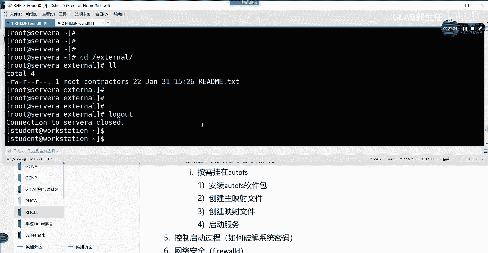

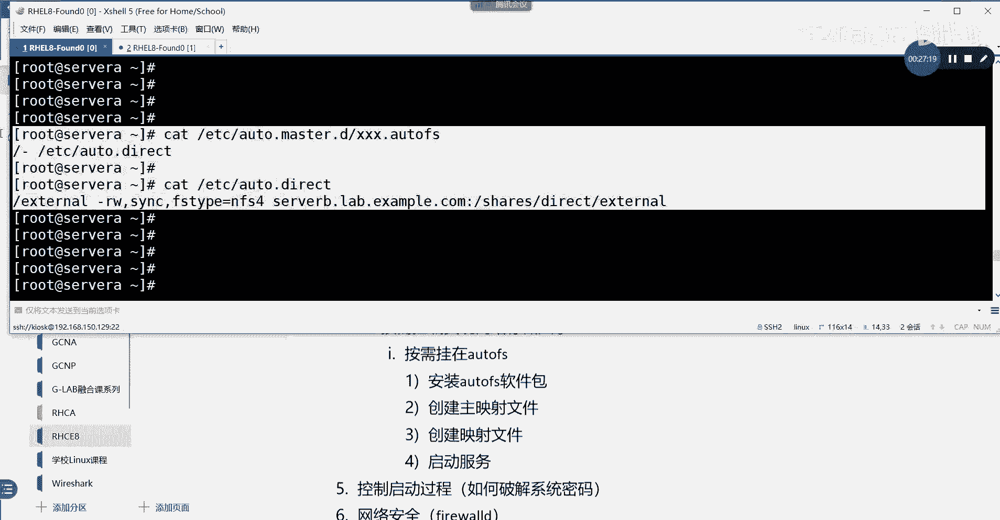

---

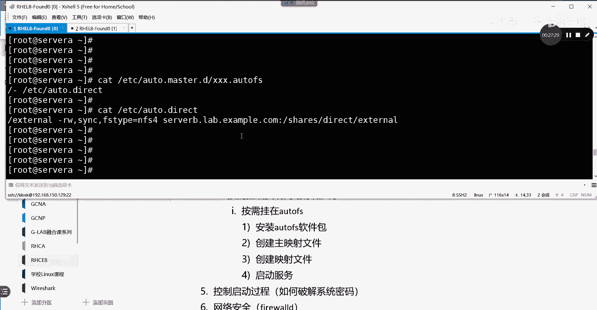

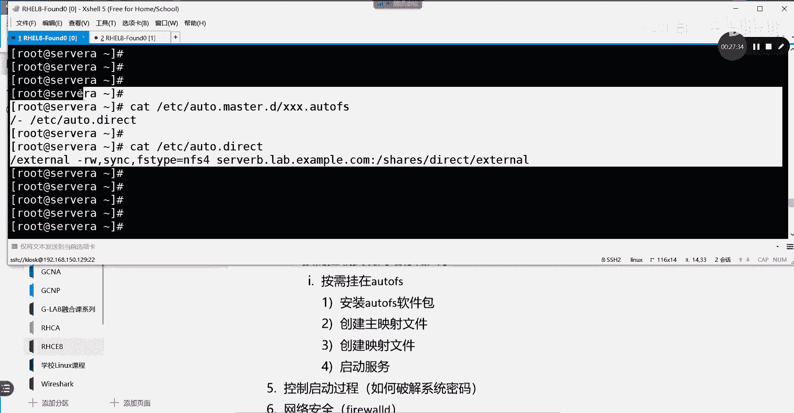

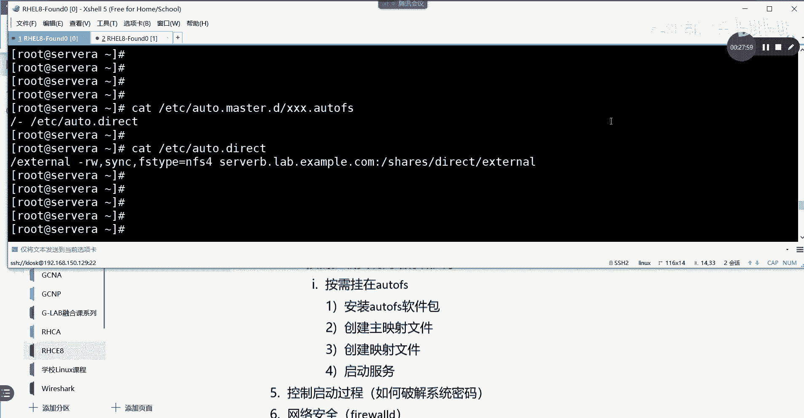

本节课中我们一起学习了NFS网络文件系统的两种客户端挂载方式。**永久挂载**通过修改`/etc/fstab`文件实现，简单直接；**按需挂载**通过配置`autofs`服务实现，更加灵活智能。两者的核心都是解决“如何挂载”的问题，而网络共享协议（NFS）在实验环境中已由服务端配置妥当。掌握这两种方法，你就能有效地在Linux系统中使用网络共享存储了。