# Linux运维与红帽认证：49：Ansible软件安装实战

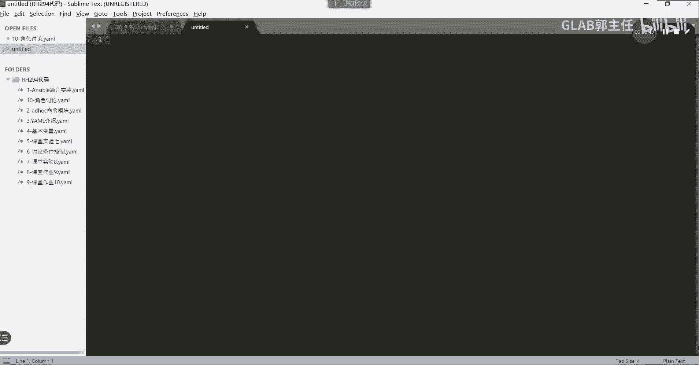

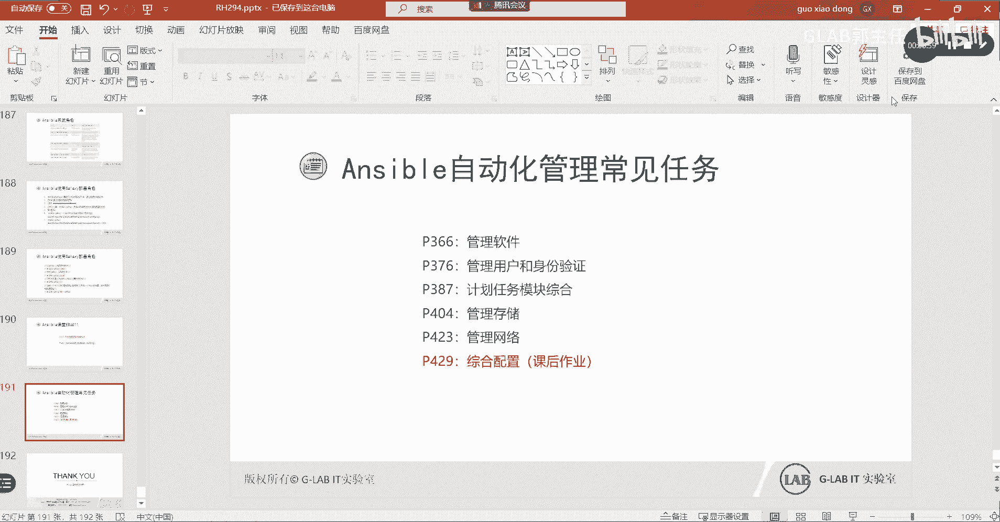

在本节课中，我们将通过一个具体的练习题，学习如何使用Ansible进行软件包管理。我们将从需求分析开始，逐步构建一个完整的Playbook，涵盖软件包信息获取、YUM仓库配置、RPM密钥管理以及软件包安装等核心操作。

## 概述

本节教程将引导你完成一个综合性的Ansible软件管理任务。我们将学习如何分析需求、规划任务结构，并使用`ansible-doc`查找模块的正确用法来编写Playbook。核心目标是掌握使用Ansible自动化软件部署的完整流程。

## 需求分析

首先，我们来看练习题的具体需求：
1.  获取指定软件包的事实变量，并显示其版本信息。
2.  在受控节点上配置指定的YUM仓库。
3.  管理该YUM仓库所需的RPM公钥。
4.  安装指定的软件包。
5.  安装完成后，再次获取该软件包的事实变量并显示信息。

通过分析，我们可以梳理出任务流程：先检查软件包是否存在，然后配置仓库和密钥，接着安装软件，最后验证安装结果。

## 构建Playbook框架

上一节我们分析了任务需求，本节中我们来看看如何构建Playbook的基本框架。我们将先定义变量和任务列表。

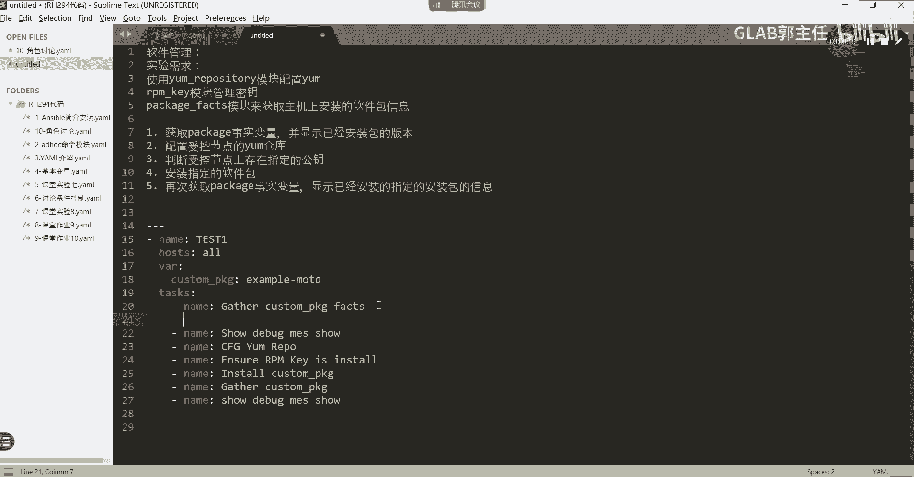

以下是Playbook的基本结构，我们定义了变量和所有需要执行的任务名称。

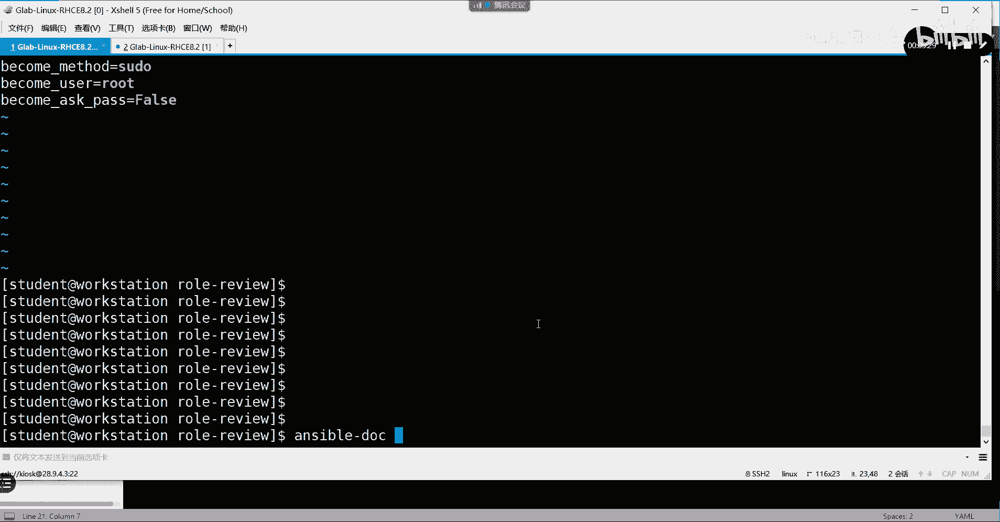

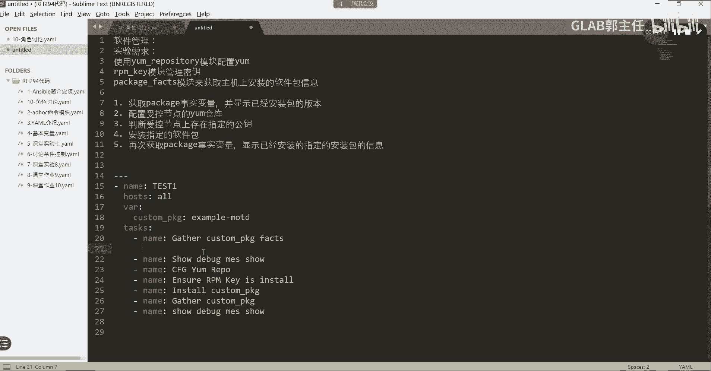

```yaml
---
- name: test1
  hosts: all
  vars:
    customer_pkg: "example-motd"
  tasks:
    - name: Gather facts for the package
    - name: Show package facts
    - name: Configure YUM repository
    - name: Ensure RPM key
    - name: Install the package
    - name: Gather facts again after installation
    - name: Show package facts again
```

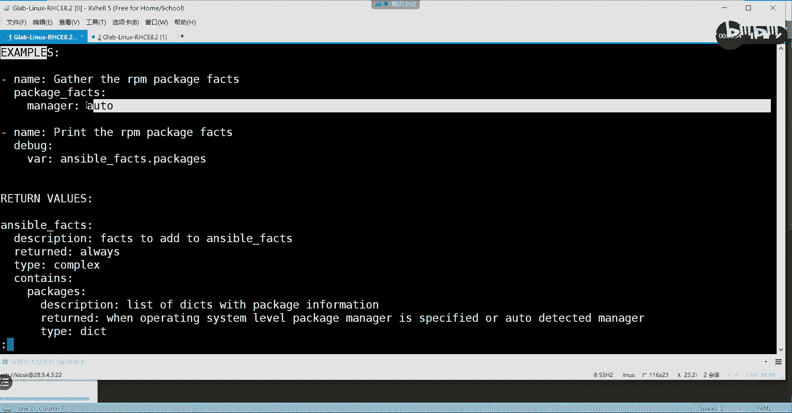

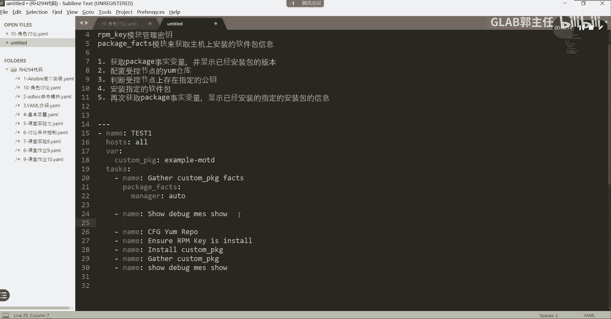

*   `name`: Playbook的名称。
*   `hosts`: 定义目标主机组，这里针对所有主机。
*   `vars`: 定义变量`customer_pkg`，其值为要管理的软件包名称`example-motd`。使用变量便于后续统一调用。
*   `tasks`: 列出了需要完成的七个任务，目前只有任务名称。

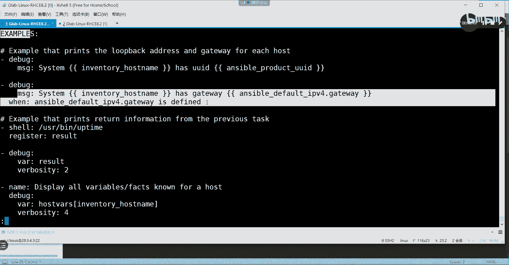

## 填充任务细节

框架搭建好后，接下来我们需要为每个任务填充具体的模块和参数。对于不熟悉的模块，我们可以使用`ansible-doc <模块名>`命令来查询用法。

以下是每个任务需要使用的核心模块：

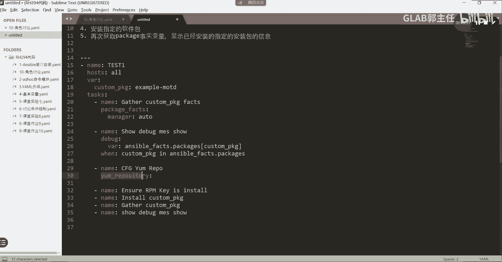

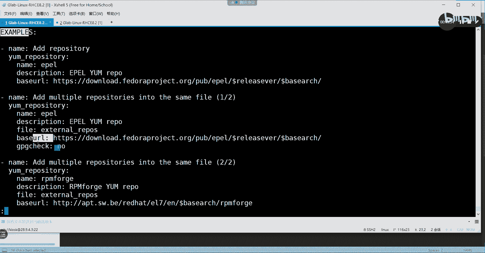

1.  **获取软件包事实变量**：使用 `package_facts` 模块。该模块用于收集软件包信息。
2.  **显示信息**：使用 `debug` 模块。配合 `when` 条件判断，仅在软件包存在时输出其信息。
3.  **配置YUM仓库**：使用 `yum_repository` 模块。用于在目标主机上添加YUM仓库源。
4.  **管理RPM密钥**：使用 `rpm_key` 模块。用于导入或验证RPM仓库的GPG公钥。
5.  **安装软件包**：使用 `yum` 模块（或 `package` 模块）。这里我们使用 `yum` 来安装变量 `customer_pkg` 指定的软件包。

## 编写完整Playbook

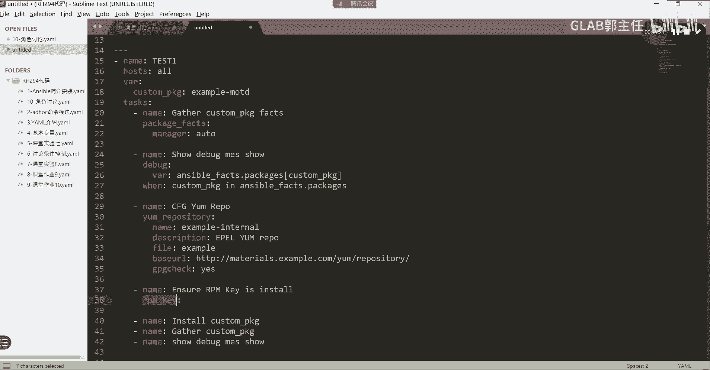

现在，我们将上述模块应用到每个任务中，编写出完整的Playbook。请注意代码的缩进格式。

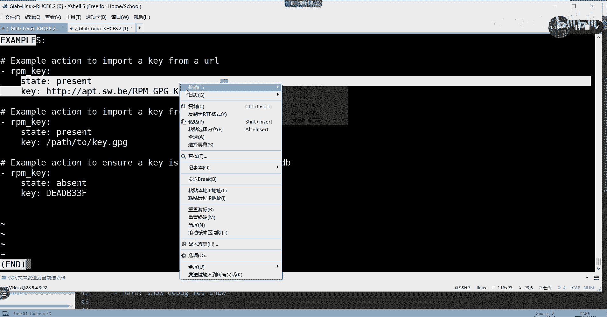

```yaml
---
- name: Manage software package example-motd
  hosts: all
  vars:
    customer_pkg: "example-motd"
  tasks:
    - name: Gather facts for the package
      package_facts:
        manager: auto

    - name: Show package facts if present
      debug:
        msg: "{{ ansible_facts.packages[customer_pkg] }}"
      when: customer_pkg in ansible_facts.packages

    - name: Configure example YUM repository
      yum_repository:
        name: example-internal
        description: Example Repository
        file: example
        baseurl: http://content.example.com/rhel9.2/x86_64/dvd/BaseOS
        gpgcheck: yes
        gpgkey: http://content.example.com/rhel9.2/x86_64/dvd/RPM-GPG-KEY-redhat-release

    - name: Ensure RPM key is present
      rpm_key:
        key: http://content.example.com/rhel9.2/x86_64/dvd/RPM-GPG-KEY-redhat-release
        state: present

    - name: Install the package
      yum:
        name: "{{ customer_pkg }}"
        state: present

    - name: Gather facts again after installation
      package_facts:
        manager: auto

    - name: Show package facts again
      debug:
        msg: "{{ ansible_facts.packages[customer_pkg] }}"
      when: customer_pkg in ansible_facts.packages
```

**代码关键点说明**：
*   `package_facts` 模块收集的信息存储在 `ansible_facts.packages` 字典中。
*   `debug` 任务中的 `when` 条件用于判断软件包是否在已收集的事实变量中，避免输出空值或错误。
*   `yum_repository` 模块的 `gpgcheck: yes` 和 `gpgkey` 参数启用了GPG校验并指定了密钥地址，这与 `rpm_key` 任务相呼应。
*   安装软件包时，通过 `"{{ customer_pkg }}"` 调用之前定义的变量。

## 验证与执行Playbook

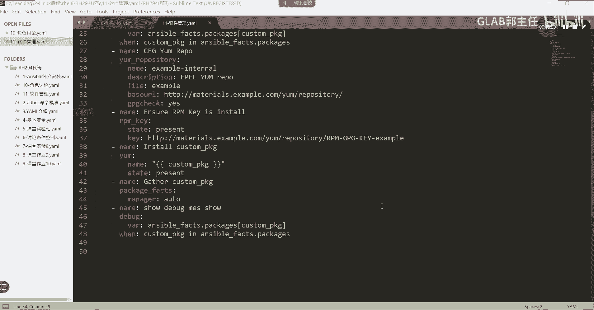

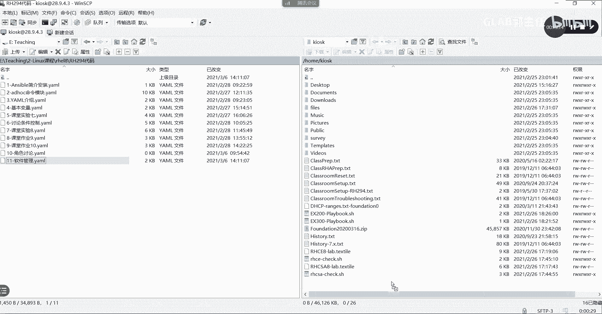

Playbook编写完成后，在运行前进行语法检查是一个好习惯。我们可以使用 `ansible-playbook` 命令的 `--syntax-check` 选项。

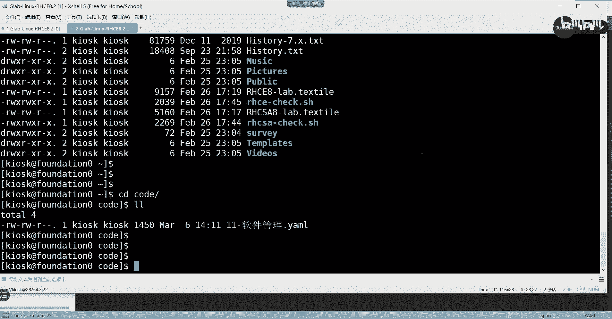

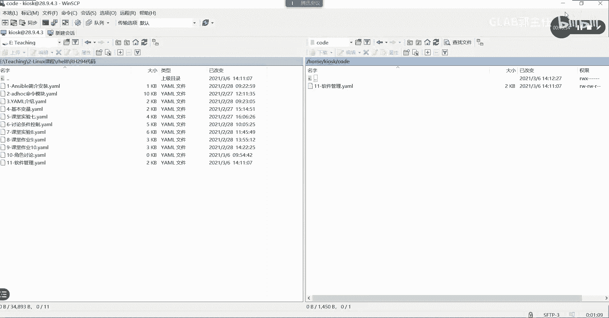

```bash
# 检查Playbook语法
ansible-playbook repo_playbook.yml --syntax-check

# 如果语法正确，执行Playbook
ansible-playbook repo_playbook.yml
```

执行后，Ansible会按顺序运行每个任务。你将看到输出结果，包括YUM仓库的配置、密钥的导入、软件包的安装过程，以及安装前后软件包信息的显示。

## 总结

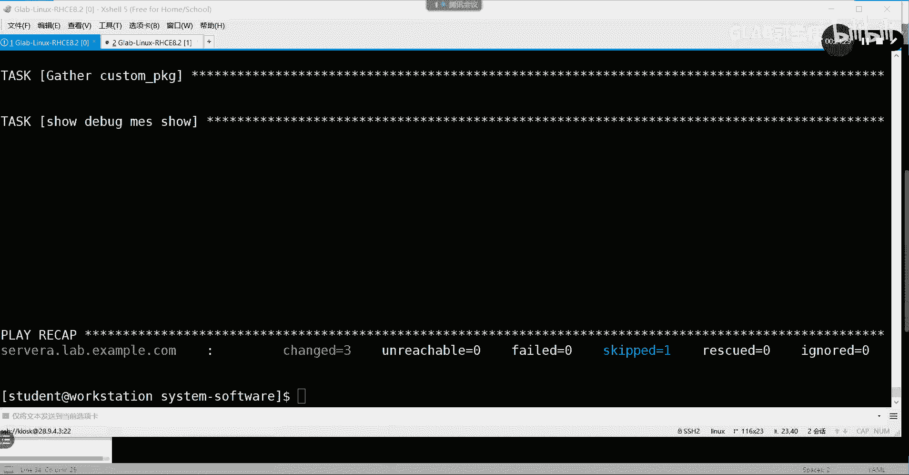

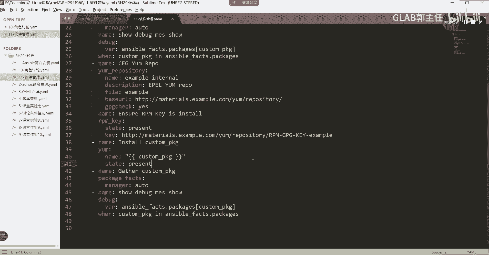

本节课中我们一起学习了如何完成一个综合性的Ansible软件管理任务。我们经历了从分析需求、规划任务、查找模块文档到编写完整Playbook的整个过程。关键点包括：使用 `package_facts` 收集包信息，利用 `debug` 和 `when` 进行条件输出，通过 `yum_repository` 和 `rpm_key` 配置仓库及其安全密钥，最后用 `yum` 模块完成安装。掌握这个流程，你就能使用Ansible高效、自动地管理多台服务器上的软件了。