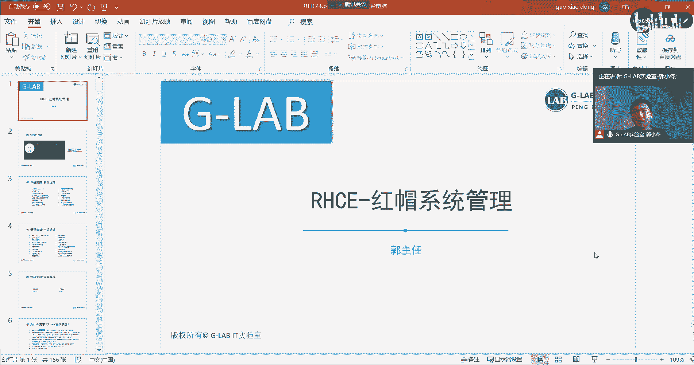
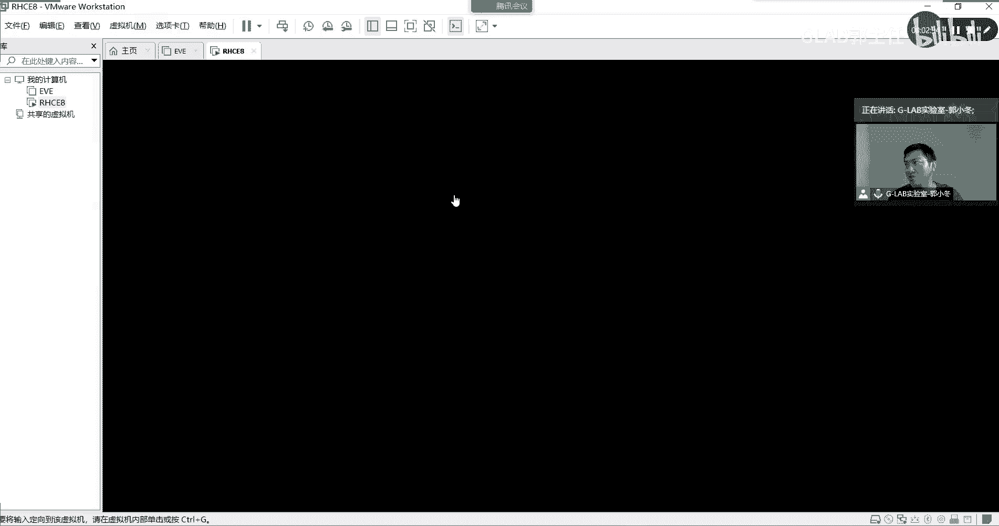
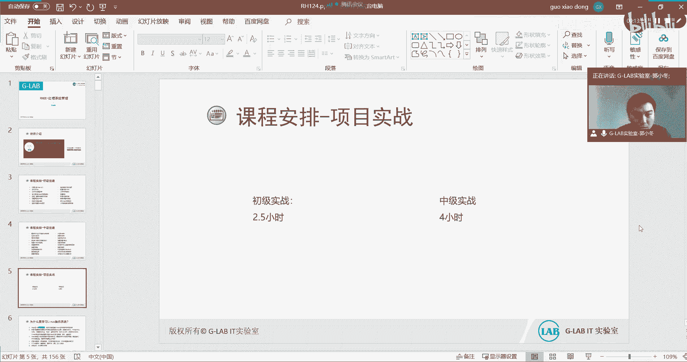

# Linux红帽认证课程：0：课程介绍与体系概览 🎯

在本节课中，我们将对红帽RHCE8认证课程进行整体介绍，了解课程体系、学习目标、环境准备以及时间安排，为后续的学习打下坚实基础。

## 课程背景与改版说明

上一节我们介绍了课程的整体框架，本节中我们来看看红帽认证体系的具体变化。红帽RHEL8课程已于今年7月底正式改版。目前许多企业正从RHEL7逐步向RHEL8过渡。作为RHCE考生，我们将学习RHEL8这套新课程。



此次改版带来了较大更新。以往的运维工作，尤其在RHCE层面，较少涉及自动化任务，最多使用Shell脚本和定时任务（如 `cron`）。而在RHEL8中，不仅保留了这些内容，还引入了新的自动化运维工具。



核心变化是加入了**Ansible**。Ansible是一个用Python编写的自动化运维平台，可用于集中管理服务器、网络设备等各类资源。其核心是通过编写**Playbook**（YAML格式的脚本）来定义自动化任务。例如，一个简单的Playbook片段如下：
```yaml
- name: Ensure nginx is installed
  yum:
    name: nginx
    state: present
```
Ansible被纳入RHCE8课程体系，使得新课程更加实战和实用。因此，我们需要认真学习这部分内容。

## 课程安排与学习要求

接下来，我们了解一下课程的具体安排和学习上的注意事项。

我们的课程每周最初安排两天面授，后续可能调整为一天，具体排课会另行通知。**强烈建议到现场听课**，因为线下学习效率更高，互动性更强，遇到问题可以及时获得解答。

上课时间为上午09:30至下午16:00或16:30，中午12:00至13:30为休息时间。

以下是关于学习资料与环境的几点重要说明：

*   **实验环境**：课程唯一的练习环境是一个约28GB的虚拟机打包文件。该环境包含了学习、练习乃至最终考试模拟所需的一切。已在群内通知下载，请务必尽快获取并学会使用。
*   **版权提醒**：该实验环境由红帽官方提供给授权合作伙伴（即本机构），仅限报名参加考试的学员内部使用。请勿外传，尊重知识产权。
*   **讲师介绍**：本人是“治疗白T实验室”联合创始人，拥有多项CCIE、HCIE及红帽认证，自2013年起从事IT培训。教学目标是让大家真正学以致用，而非单纯为了考证。

## 资料获取与课程大纲

最后，我们来看看如何获取学习资料以及完整的课程大纲结构。

我们提供了两个主要资源入口：
1.  **学习讨论群**：一个面向所有学员的大群，用于交流讨论。
2.  **课程资料下载**：通过关注我们的微信公众号，在底部菜单栏可获取包括系统、网络、虚拟化等在内的各类资料与百度网盘链接。

整个课程体系将分为以下几个阶段循序渐进地展开：

*   **RHCSA 初级运维（约3天）**：从零开始，涵盖Linux基础操作。
    *   Linux入门与命令行访问
    *   文件管理、编辑（vi编辑器）
    *   用户、组与权限控制
    *   进程监控与管理
    *   服务（守护进程）配置、SSH访问
    *   存储管理、日志查看、网络配置
    *   软件包管理（yum/rpm）、文件系统分析、获取帮助

*   **RHCE 中级运维 - 第一部分：系统管理（约3天）**：提升运维效率与系统管理深度。
    *   Shell脚本编写
    *   定时任务（cron）
    *   系统性能调优
    *   安全上下文与文件控制（SELinux）
    *   **核心存储技术**：基本存储、逻辑卷管理（LVM）、VDO（虚拟数据优化器）
    *   系统启动流程与故障恢复（如破解密码）
    *   网络安全管理

*   **RHCE 中级运维 - 第二部分：自动化运维（约4天）**：课程重点与难点，学习集中化运维。
    *   Ansible自动化平台详解
    *   管理清单（Inventory）、创建Playbook
    *   使用变量、控制任务执行
    *   文件管理、大型项目角色（Roles）编排
    *   故障排除
    *   实现Linux管理任务自动化

*   **项目实战与考前模拟（约2天）**：进行高仿真度的RHCE模拟考试练习。这部分内容仅对报名考试的学员开放，旨在帮助大家熟悉考试形式与节奏。

**考试形式说明**：RHCE8考试分两部分。上午考RHCSA内容（2.5小时），下午考RHCE的Ansible部分（4小时）。下午考试代码量大、时间紧，需高度重视平时的练习。



本节课中我们一起学习了红帽RHCE8课程的改版背景、核心工具Ansible、课程的具体安排、学习资源的获取方式以及从RHCSA到RHCE的完整知识体系大纲。请大家准备好实验环境，我们将从下一节课开始，正式踏入Linux的世界。