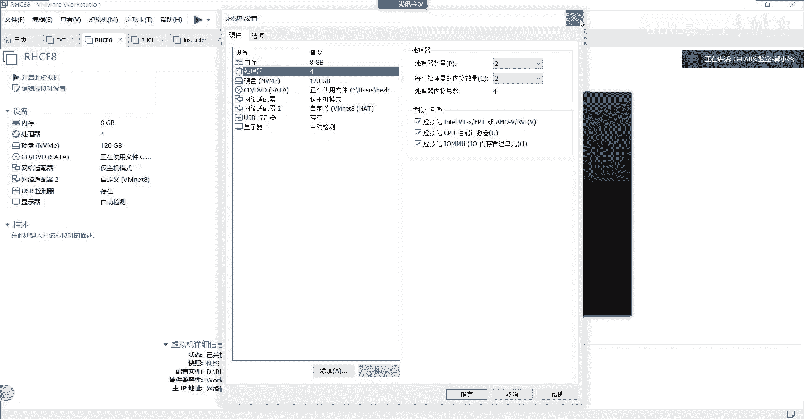
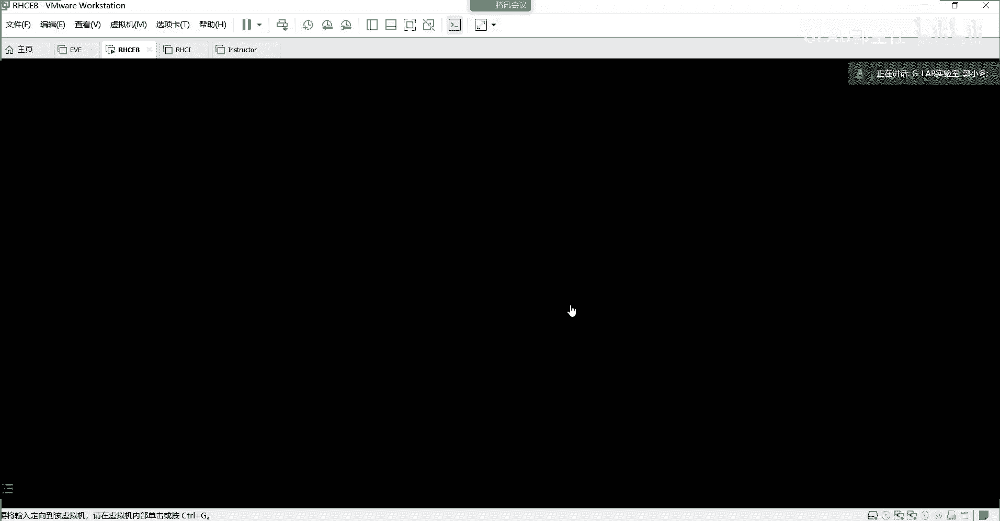
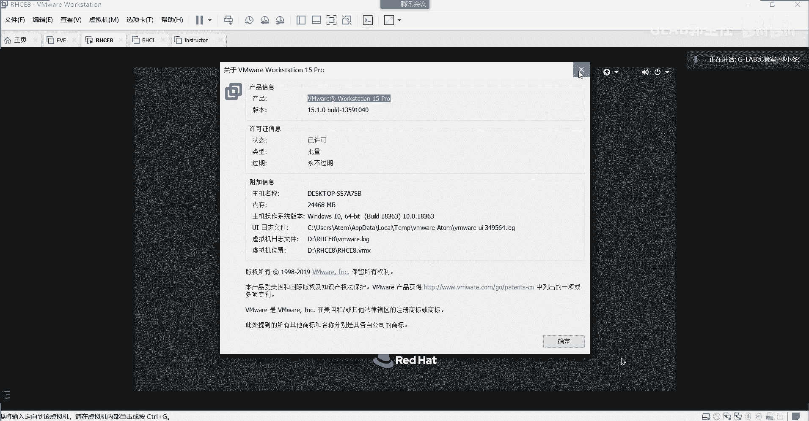
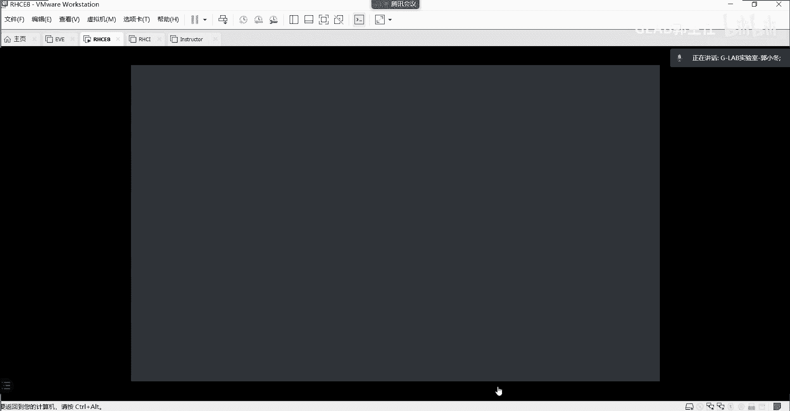
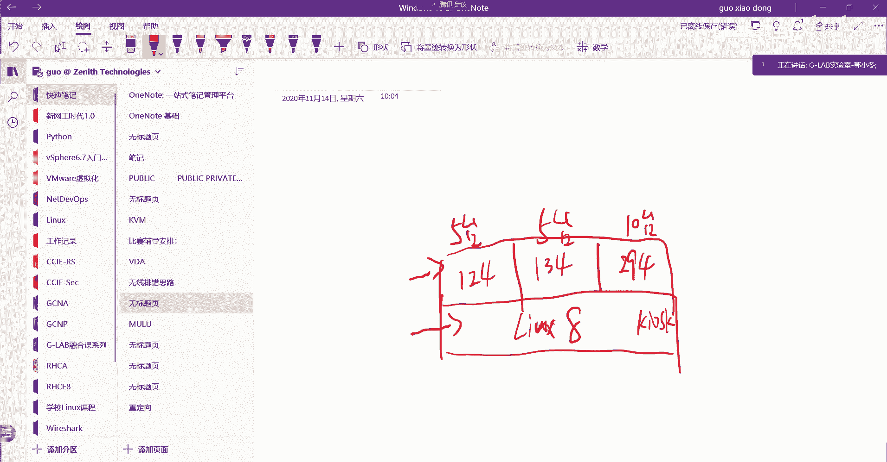
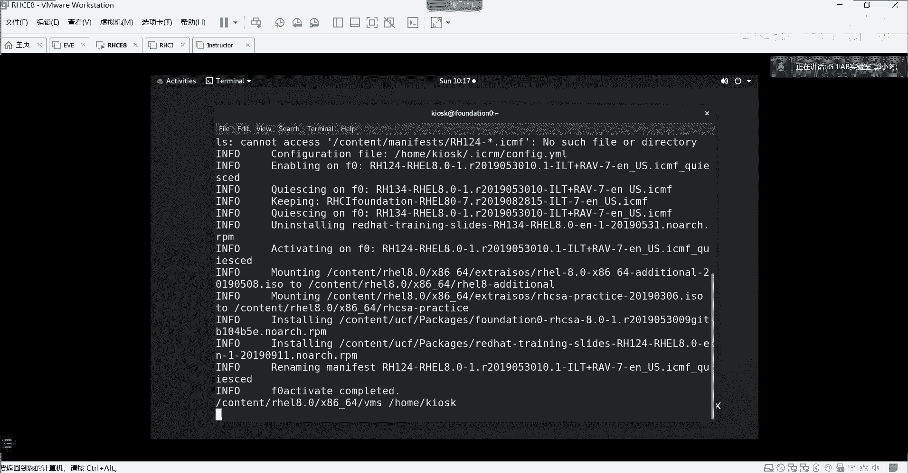
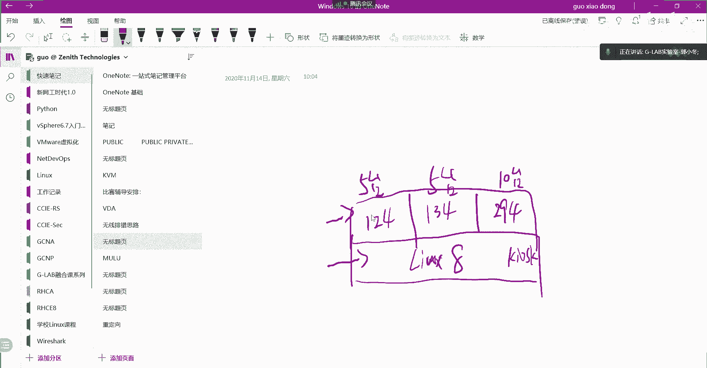
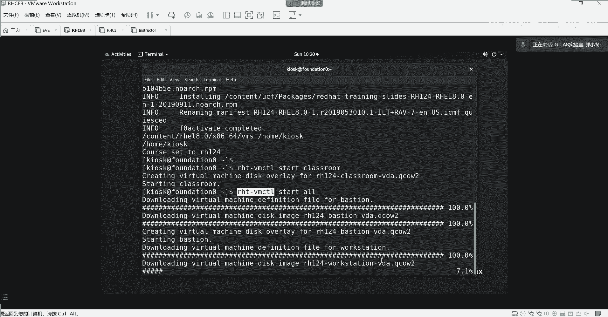
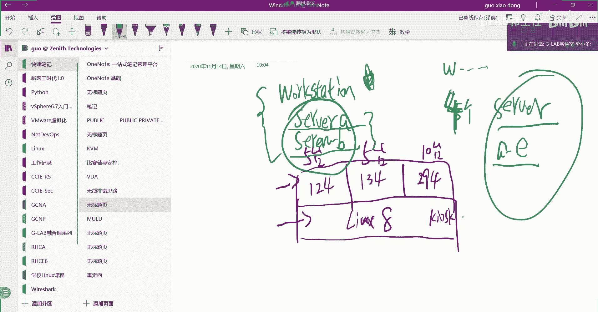
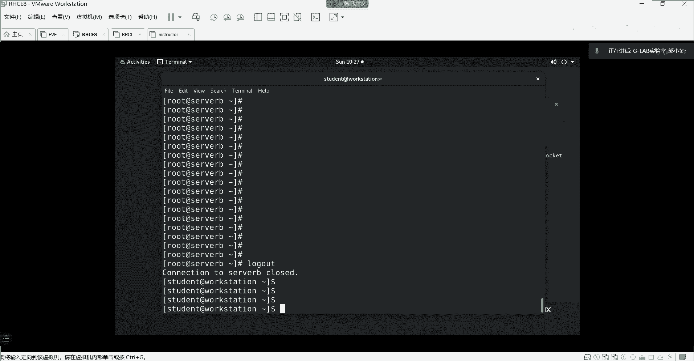

# Linux入门与红帽认证：1：课程要求与环境搭建概述

在本节课中，我们将学习课程的基本要求，并开始搭建后续学习所需的Linux练习环境。这是动手实践的第一步，请确保跟随步骤完成。

## 课程要求

上一节我们介绍了课程背景，本节中我们来看看上课的具体要求。以下是三点核心要求：

1.  **优先现场学习**：学习本身具有挑战性，现场学习效率更高，能减少干扰，便于师生交流与问题解答。
2.  **保证出勤与复习**：课程共12天，请尽量不要缺勤。如有特殊情况，需提前告知班主任。所有课程均有录播，缺勤后务必观看视频补课。
3.  **按时完成作业**：每天课程结束后均会布置作业。作业需在提供的虚拟机环境中完成。虽然不强制提交作业报告，但必须动手操作一遍。Linux红帽认证考试均为上机实操，动手练习是通过考试的关键。课程最后有模拟考试，会检验平时的练习成果。

## 练习环境搭建

介绍完课程要求，接下来我们进入实操环节，学习如何搭建练习环境。这就像学习网络前需要安装模拟器一样，是学习Linux的必要准备。

### 环境准备与启动

以下是搭建环境的具体步骤：

1.  **获取虚拟机文件**：从提供的网盘链接下载课程文件。在文件夹中找到后缀为 `.vmx` 的文件（例如 `RHCE.vmx`）。
2.  **打开虚拟机**：确保电脑已安装 VMware Workstation 软件。直接双击 `.vmx` 文件，该虚拟机将自动在 Workstation 中打开。
3.  **配置虚拟机处理器**：在虚拟机**关机状态**下，点击“编辑虚拟机设置”。在“处理器”选项中，确认已勾选所有虚拟化相关选项（如“虚拟化 Intel VT-x/EPT 或 AMD-V/RVI”）。
4.  **启动虚拟机**：启动虚拟机。首次启动时，软件会询问“我已复制该虚拟机”或“我已移动该虚拟机”，请务必选择 **“我已复制该虚拟机”**。

### 登录系统

启动后，将看到系统登录界面。请注意：

*   当前登录的是**外层系统**，且只有普通用户权限。
*   默认用户名是：`kiosk`
*   默认密码是：`redhat`

使用以上凭据登录即可进入系统。这个环境是我们后续所有练习和操作的基础。

## 总结

本节课中我们一起学习了课程的三点核心要求，并成功搭建了Linux练习环境。我们掌握了如何通过 `.vmx` 文件启动虚拟机，并进行必要的初始配置。记住，**动手实践**是学习Linux技术的唯一途径，请确保环境可用，为后续学习做好准备。