# Linux运维工程师的升职加薪宝典：56：镜像仓库管理 🗂️

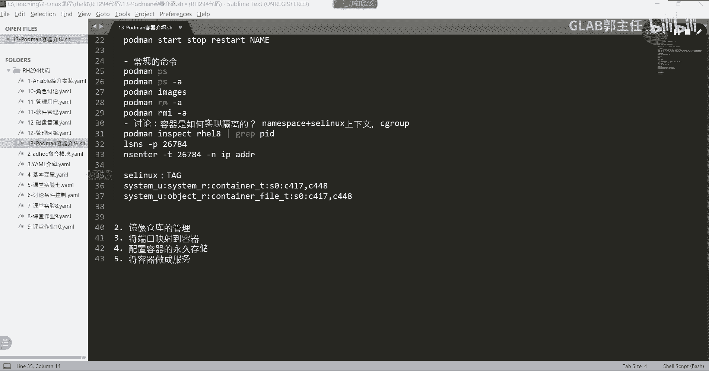

在本节课中，我们将要学习如何管理Podman的镜像仓库。我们将了解镜像仓库的配置文件位置、如何配置仓库搜索、SSL证书验证以及黑名单管理，并补充几个实用的Podman命令。

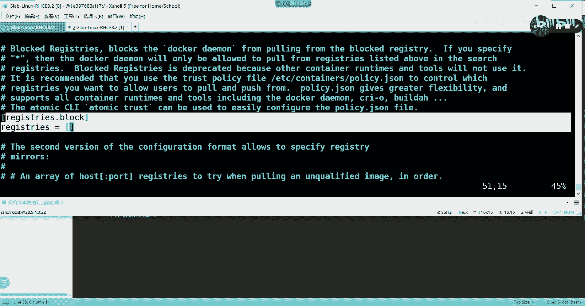

## 概述

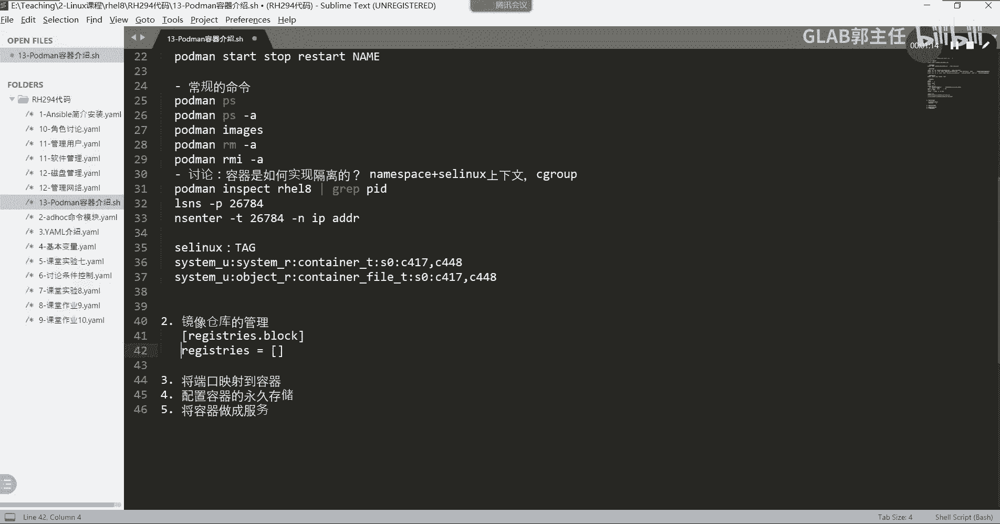

上一节我们介绍了容器的基础操作，本节中我们来看看如何管理镜像仓库。镜像仓库是存储和分发容器镜像的地方，Podman通过配置文件来管理从哪里拉取镜像以及相关的安全设置。

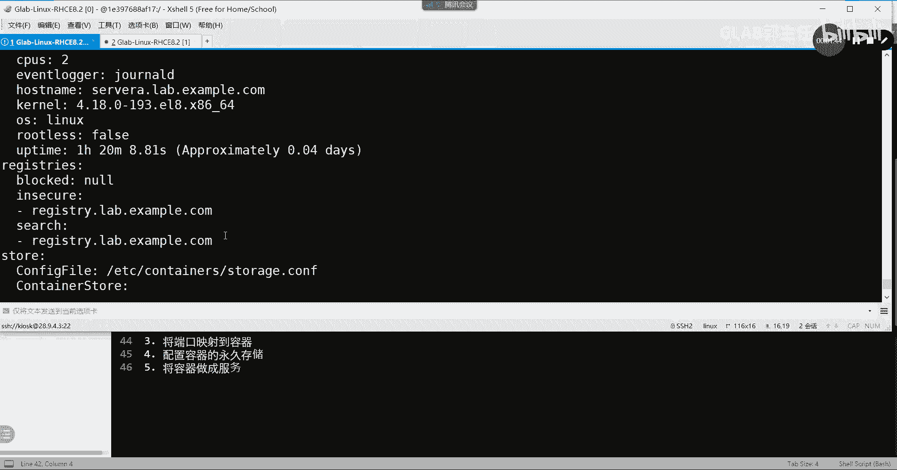

## 镜像仓库配置文件

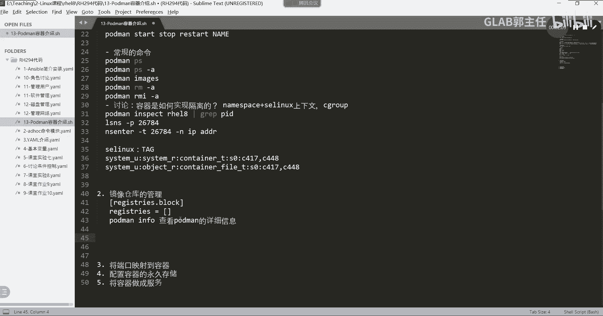

Podman的镜像仓库默认配置文件位于 `/etc/containers/registries.conf`。这个文件主要管理三块内容。

以下是该配置文件的核心部分：

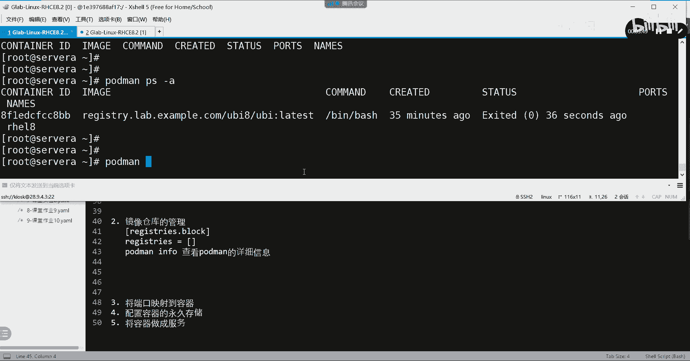

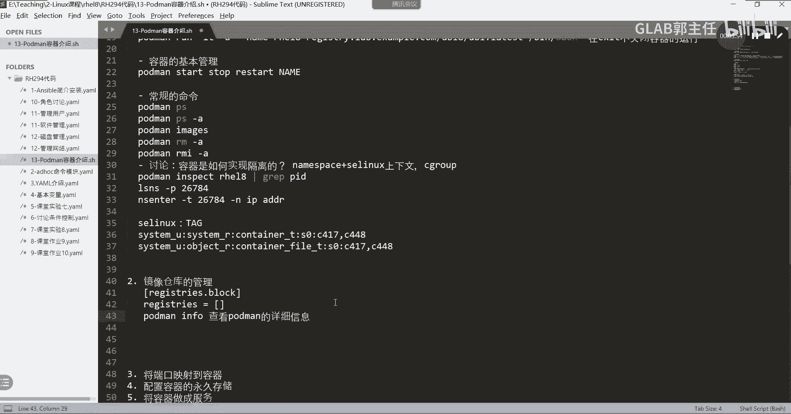

1.  **仓库搜索路径**：定义Podman默认从哪些仓库地址搜索和拉取镜像。
2.  **非安全仓库列表**：定义哪些仓库地址可以跳过SSL/TLS证书验证。默认列表为空，需要手动添加。
3.  **仓库黑名单**：定义禁止Podman搜索的镜像仓库地址。

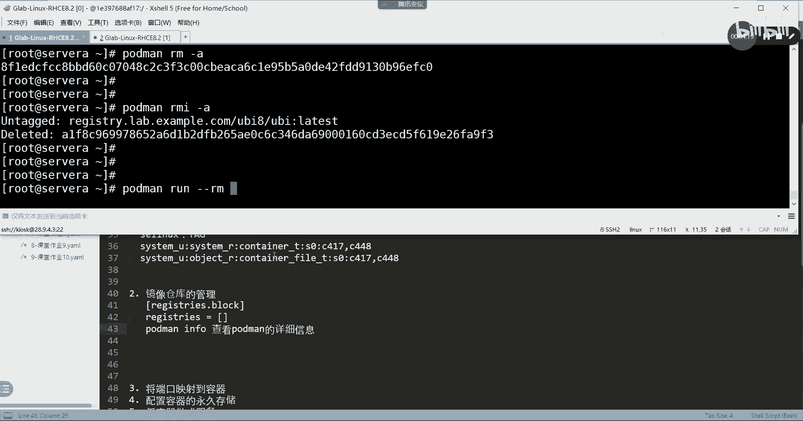

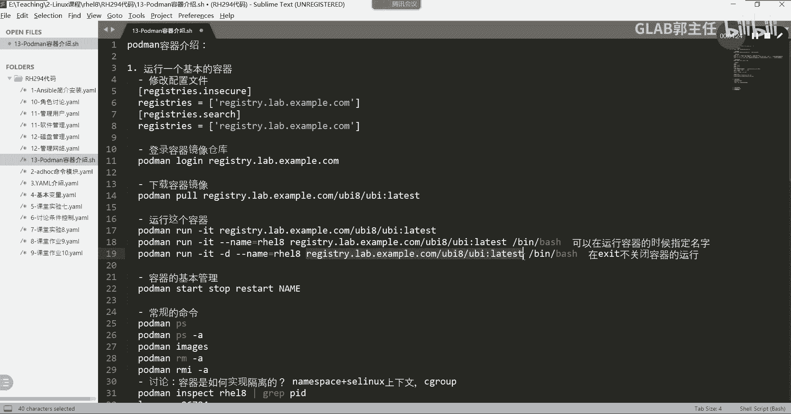

前两部分内容之前已经介绍过。这里我们补充一个操作：如何将仓库加入黑名单。

## 查看Podman配置信息

我们可以通过一个命令来查看当前Podman的详细配置信息。

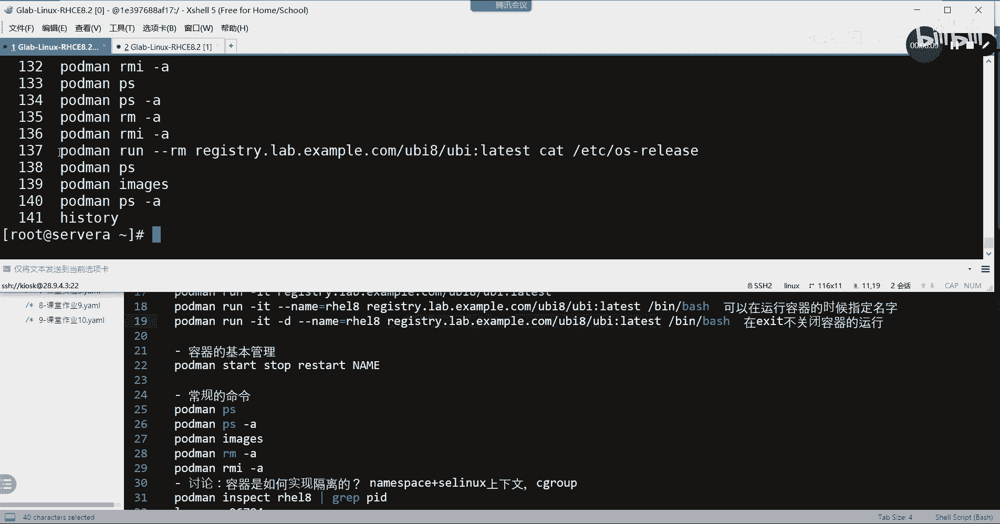

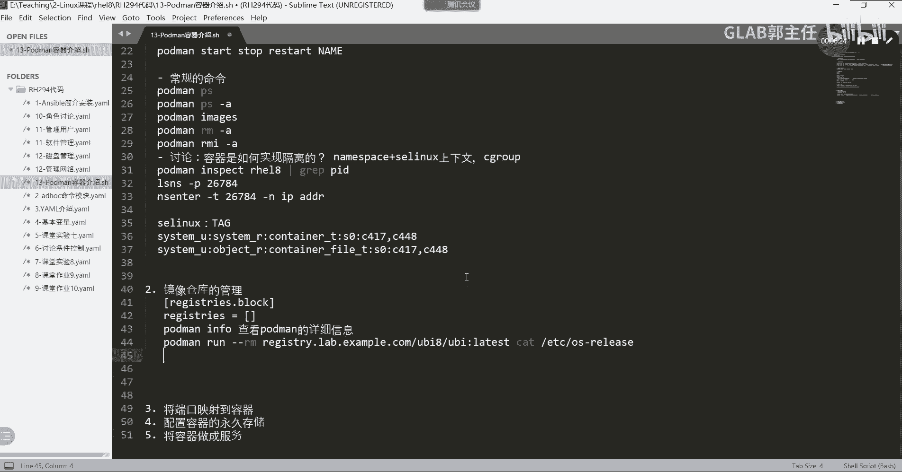

以下是查看Podman详细信息的命令：
```bash
podman info
```
执行此命令可以查看包括`registries`（仓库配置）和`insecure registries`（非安全仓库）在内的所有Podman配置信息，方便验证你的设置是否生效。

## 补充Podman实用命令

除了仓库管理，我们再补充两个在日常操作中非常实用的Podman命令。

以下是两个补充的Podman命令及其作用：

*   **`--rm` 参数**：在运行容器时使用 `podman run --rm <镜像名>`。这个参数的作用是，当容器运行结束后，自动删除该容器及其产生的所有数据（但不会删除镜像）。这适用于执行一次性任务的临时容器。
    *   **示例**：`podman run --rm registry.access.redhat.com/ubi8/ubi cat /etc/os-release`。这条命令会拉取镜像，运行容器执行`cat`命令显示系统信息，然后自动清理掉这个容器。

*   **`-l` 参数**：在使用 `podman exec` 命令时，可以用 `-l` 来指代“最近一次创建或使用的容器”，而无需输入具体的容器名称或ID。
    *   **示例**：假设你刚运行了一个名为`mycontainer`的容器，之后想进入其Shell，可以简写为 `podman exec -it -l bash`。这在你频繁操作同一个容器时非常方便，无需记住容器名称。

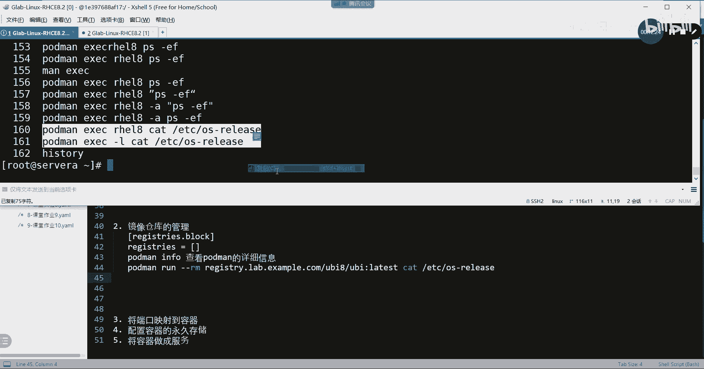

## 总结

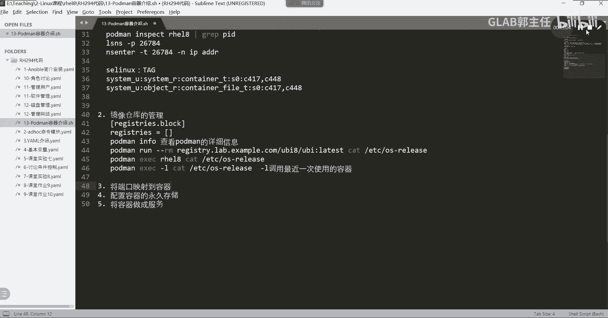

本节课中我们一起学习了Podman镜像仓库的管理。我们了解了配置文件`/etc/containers/registries.conf`的结构，它管理着仓库搜索源、安全验证和黑名单。我们还学会了使用`podman info`命令查看配置详情，并掌握了`--rm`（自动清理容器）和`-l`（指代最近使用的容器）这两个提高效率的实用参数。掌握这些内容，能帮助你更安全、更高效地管理容器镜像。