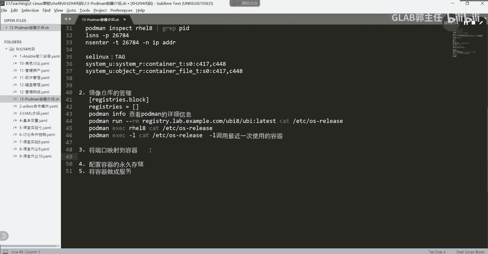
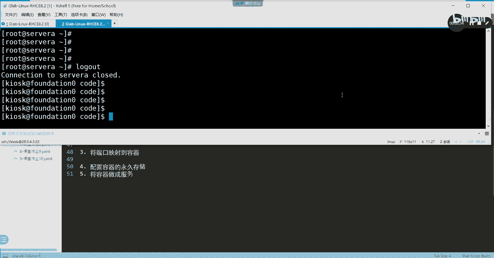
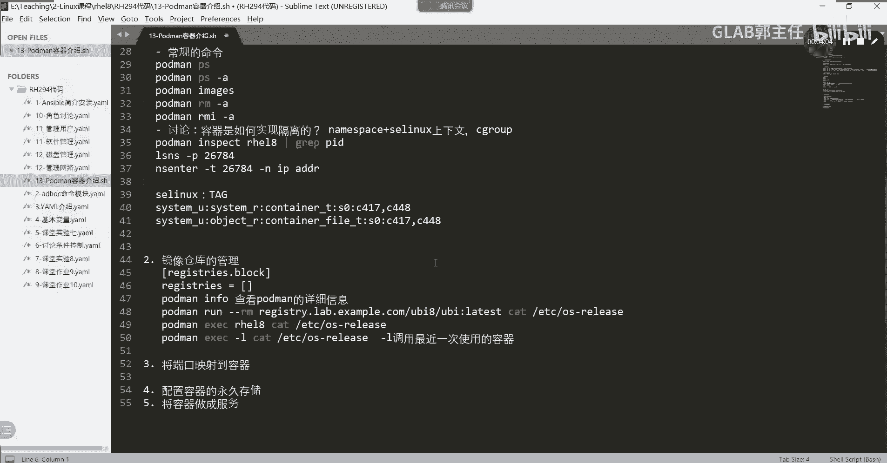
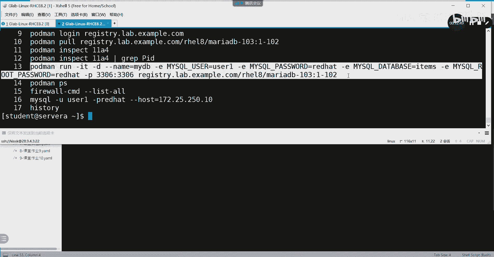
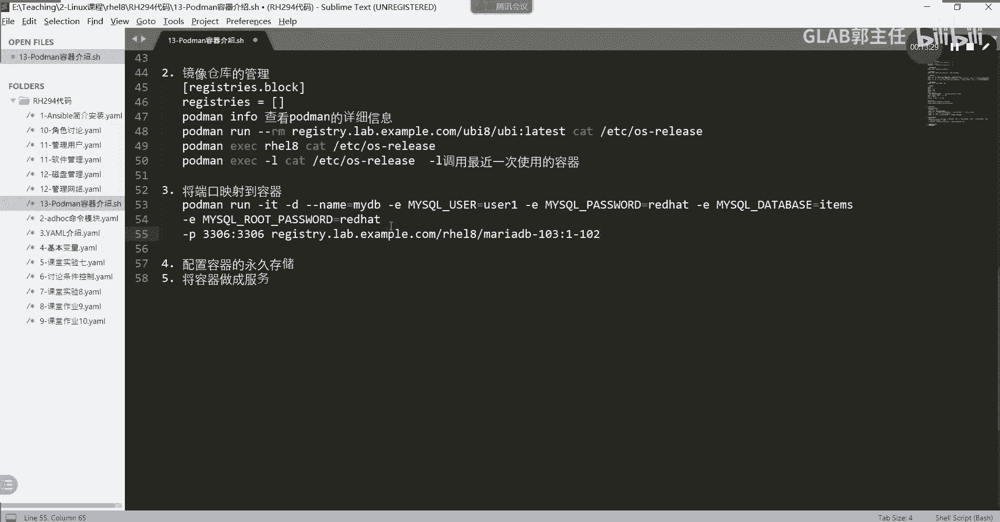
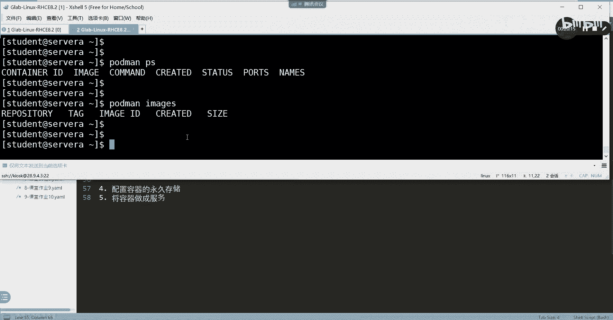
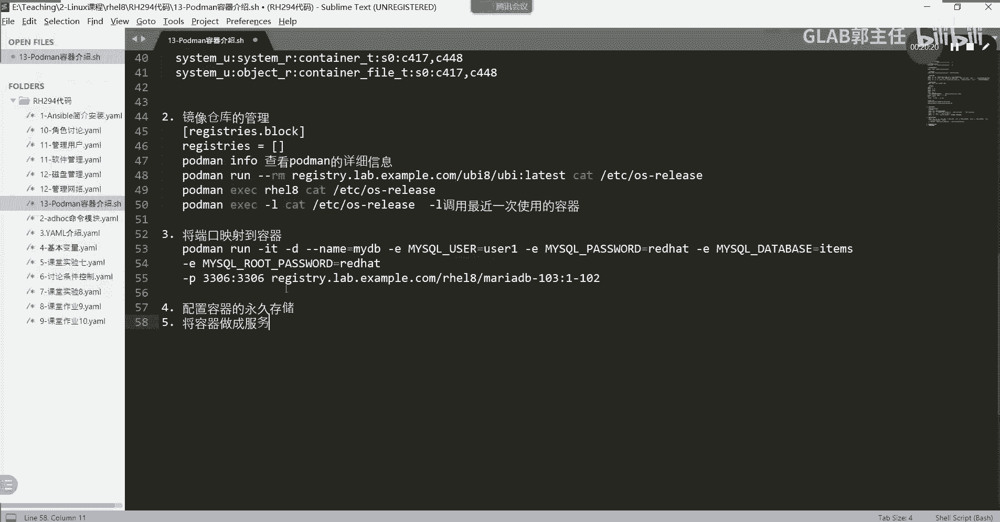

# Linux容器配置：第57章：容器端口映射配置 🚢



在本章中，我们将学习如何配置容器端口映射。这是让外部网络能够访问容器内部服务的关键技术。我们将通过下载MariaDB和HTTPD镜像，并运行容器的实践来掌握端口映射的配置方法。

---

## 概述

端口映射允许将主机上的一个网络端口转发到容器内部的特定端口。这使得外部客户端可以通过访问主机的IP地址和端口，间接访问容器中运行的服务。本节我们将通过配置MariaDB数据库容器的端口映射来具体学习。



上一节我们介绍了容器的基本操作，本节中我们来看看如何配置网络访问。

---

## 实验环境准备



首先，我们需要在实验环境中启动容器实验。在`workstation`主机上，通过SSH以`student`用户身份登录，并启动`containers`实验环境。

```bash
lab containers start
```

实验环境启动后，我们将进行后续操作。

---

## 核心概念：根容器与无根容器

在开始配置前，需要理解两种容器类型：

*   **无根容器**：由普通用户（非root用户）创建和运行的容器。其权限被限制在该普通用户范围内，安全性较高，是推荐的使用方式。
*   **根容器**：由`root`用户创建和运行的容器。拥有很高的系统权限，安全性较低，存在被攻击后危及主机系统的风险。

本实验及考试中均使用无根容器。**请务必使用`student`用户通过SSH直接登录操作，而非在root用户下使用`su`切换**，否则在将容器配置为服务时可能出错。

---

## 实践一：配置MariaDB容器端口映射

我们的第一个目标是运行一个MariaDB数据库容器，并将其服务端口（3306）映射到主机，以便外部访问。

以下是配置MariaDB容器端口映射的完整步骤：

1.  **登录容器镜像仓库**
    首先，需要登录到实验环境的私有镜像仓库以拉取镜像。
    ```bash
    podman login registry.lab.example.com
    ```
    输入用户名`admin`和密码`redhat321`完成登录。

2.  **拉取MariaDB镜像**
    从仓库拉取指定版本的MariaDB镜像。
    ```bash
    podman pull registry.lab.example.com/rhel8/mariadb-103:1-102
    ```

3.  **运行容器并配置端口映射**
    这是最关键的一步。我们使用`podman run`命令运行容器，并通过`-p`参数设置端口映射，通过`-e`参数设置容器内的环境变量。
    ```bash
    podman run -it -d \
      --name mydb \
      -e MYSQL_USER=user1 \
      -e MYSQL_PASSWORD=redhat \
      -e MYSQL_DATABASE=items \
      -e MYSQL_ROOT_PASSWORD=redhat \
      -p 3306:3306 \
      registry.lab.example.com/rhel8/mariadb-103:1-102
    ```
    **命令解析**：
    *   `-p 3306:3306`：将**主机**的3306端口映射到**容器内部**的3306端口。主机端口可以任意指定。
    *   `-e`：用于向容器内传递环境变量，这里设置了数据库的用户、密码和数据库名。

4.  **验证端口映射**
    容器运行后，可以在主机上使用MySQL客户端连接测试。此连接将通过主机端口跳转到容器内的MariaDB服务。
    ```bash
    mysql -u user1 -predhat --host=127.0.0.1
    ```
    连接成功后，执行`SHOW DATABASES;`，应能看到包含`items`数据库在内的列表，证明端口映射成功。



---



## 实践二：基于同一镜像运行多个容器

接下来，我们演示如何基于同一个镜像，以不同的方式运行多个容器，加深对容器灵活性的理解。

1.  **运行第一个HTTPD容器**
    我们基于HTTPD镜像运行一个名为`myweb`的容器，并执行`bash`命令进入交互模式。
    ```bash
    podman run -it -d --name myweb registry.lab.example.com/rhel8/httpd-24:1-105 /bin/bash
    ```

2.  **不进入容器执行命令**
    使用`podman exec`命令可以在不进入容器的情况下，在容器内执行命令。
    ```bash
    podman exec <容器ID> ps -ef
    podman exec <容器ID> uname -r
    podman exec <容器ID> uptime
    ```

3.  **基于同一镜像运行第二个容器**
    使用相同的HTTPD镜像，再运行一个名为`second_web`的容器，这次不指定启动命令。
    ```bash
    podman run -it -d --name second_web registry.lab.example.com/rhel8/httpd-24:1-105
    ```
    此时，系统内存在两个基于同一镜像的不同容器实例。

4.  **运行临时（快速）容器**
    使用`--rm`参数可以运行一个临时容器。容器在执行完指定命令后会自动删除，常用于执行一次性任务。
    ```bash
    podman run -it --rm --name quickweb registry.lab.example.com/rhel8/httpd-24:1-105 cat /etc/redhat-release
    ```
    命令执行后，容器`quickweb`将自动消失。

---

## 实验环境清理

完成所有操作后，可以进行清理。

1.  **停止所有容器**
    ```bash
    podman stop -a
    ```
2.  **删除所有容器**
    ```bash
    podman rm -a
    ```
3.  **删除所有镜像**
    ```bash
    podman rmi -a
    ```

---

## 总结





本节课中我们一起学习了容器端口映射的核心配置。关键点在于使用`podman run`命令的`-p`参数，其格式为`-p <主机端口>:<容器端口>`。我们还实践了基于同一镜像运行多个不同容器的方法，以及使用`--rm`参数运行一次性临时容器。端口映射是容器网络访问的基础，务必熟练掌握。