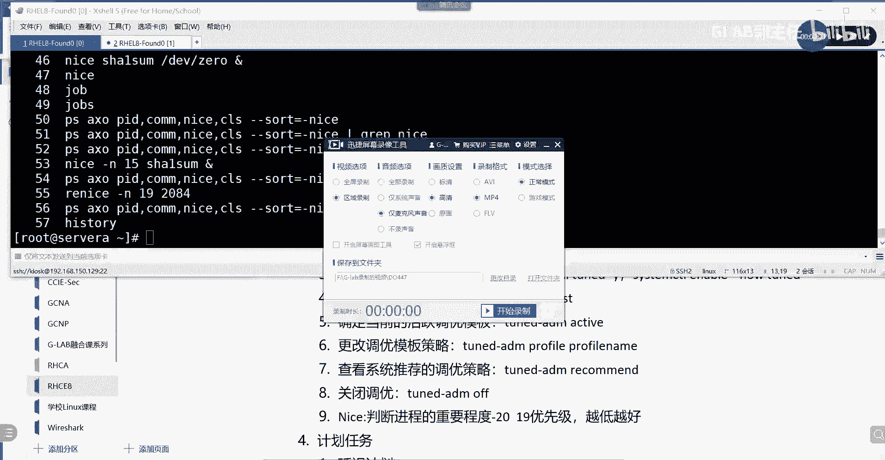
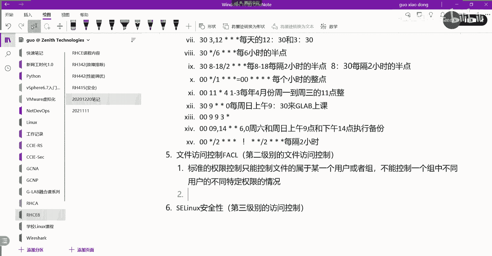
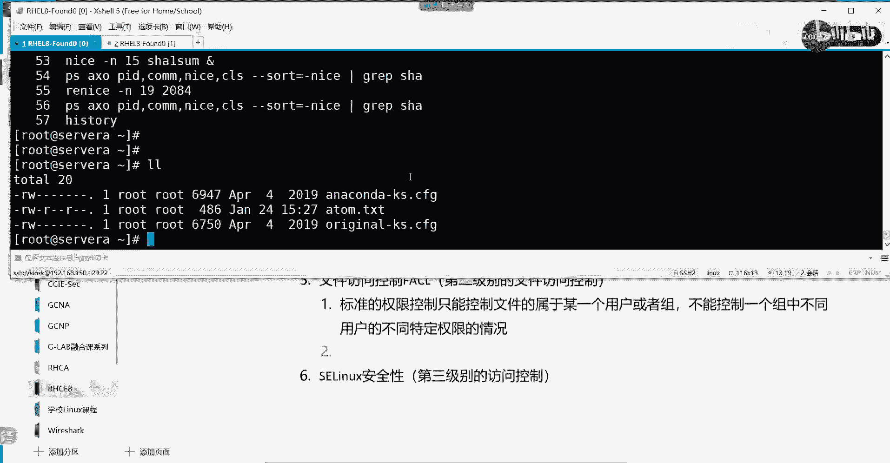
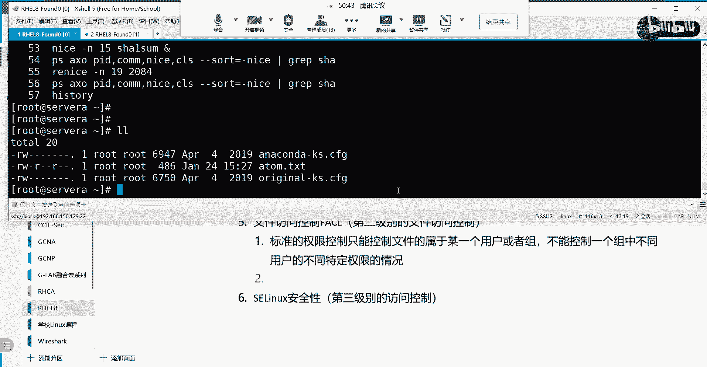
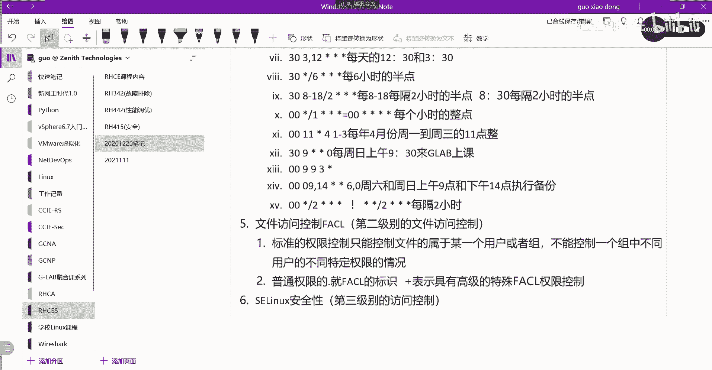
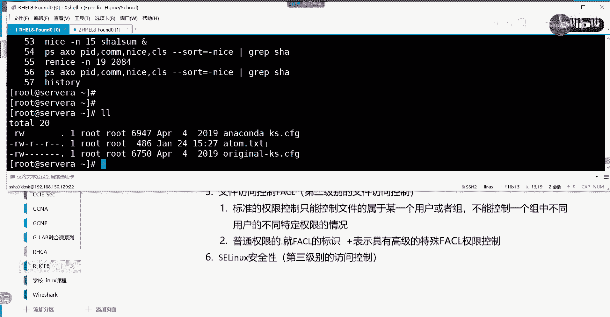
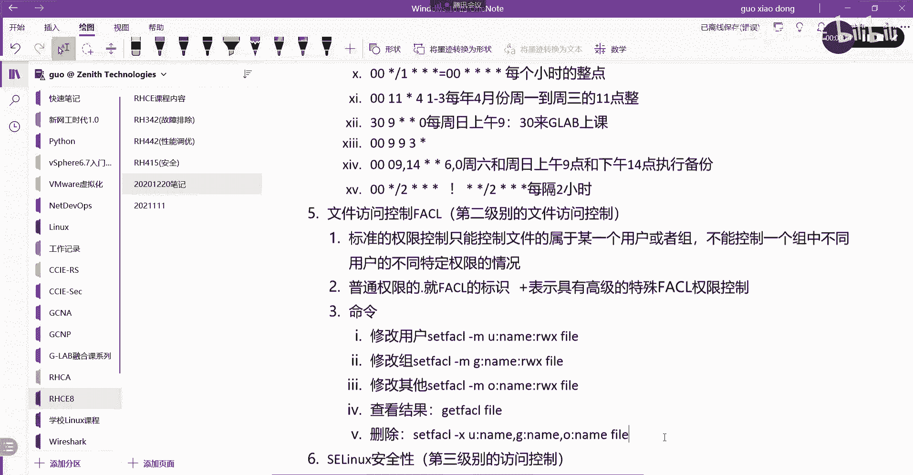
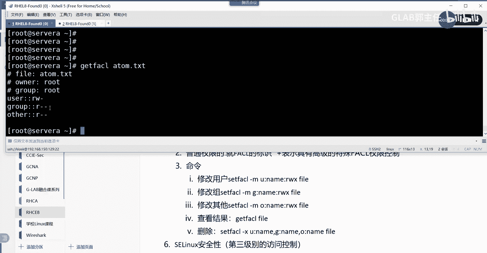
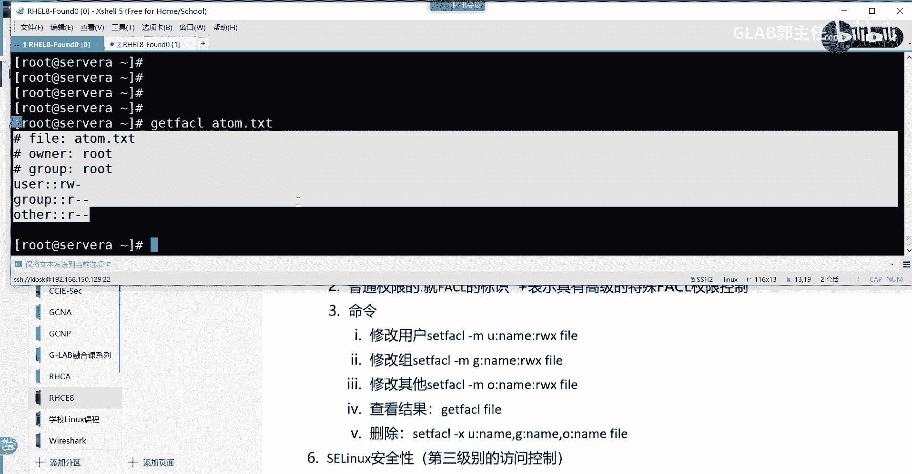
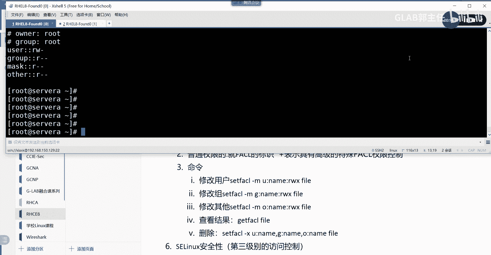

Linux文件权限管理：26：文件访问控制列表（FACL）详解 🔧

在本节课中，我们将要学习Linux中一个重要的高级权限管理工具——文件访问控制列表（FACL）。它能够突破传统权限“一刀切”的限制，实现对特定用户或组的精细化权限控制。

上一节我们介绍了标准的Linux文件权限，它通过用户、组和其他三类角色来控制访问。本节中我们来看看当标准权限无法满足复杂需求时，如何使用FACL进行更精确的权限分配。

### 标准权限的局限性

标准的权限控制只能控制文件属于某一个用户或者组。它不能控制多个特定指定用户的不同权限。具体来说，它不能控制一个组中不同用户的不同特定权限的情况。例如，当多个用户同属一个组时，标准权限无法区分其中某个用户能执行更多操作，而另一个用户只能执行较少操作。普通权限对所有组内成员一视同仁。

### FACL的引入与标识

为了实现对不同用户或组的精细化权限控制，我们需要使用扩展的、基于文件的访问控制列表（FACL）。

在Linux系统中，我们可以通过`ls -l`命令查看文件权限。输出结果中，普通权限后面的一个字符就是FACL的标识：
*   如果只是一个点（`.`），代表该文件仅使用普通权限控制。
*   如果这个点变成了加号（`+`），则代表这个文件具有高级的FACL权限控制。

### FACL核心命令操作

以下是FACL相关的核心命令，用于设置、查看和删除扩展权限。

#### 设置/修改FACL权限

设置或修改FACL权限使用`setfacl`命令，配合`-m`（modify）选项。

*   **修改指定用户的FACL权限**：
    `setfacl -m u:username:rwx file_name`
    这个命令为指定的`username`用户，对`file_name`文件赋予读（r）、写（w）、执行（x）的权限。

*   **修改指定组的FACL权限**：
    `setfacl -m g:groupname:rwx file_name`
    这个命令为指定的`groupname`组，对`file_name`文件赋予读、写、执行的权限。

*   **修改其他用户（other）的FACL权限**：
    `setfacl -m o::rwx file_name`
    这个命令为其他用户（other）对`file_name`文件赋予读、写、执行的权限。

**注意**：权限位`rwx`的含义与标准权限完全相同，代表可读、可写、可执行。上述命令可以合并执行，中间用逗号分隔。

#### 查看FACL权限

查看文件的FACL权限使用`getfacl`命令。
`getfacl file_name`
执行该命令会详细列出文件的所有者、所属组、其他用户的权限以及任何通过FACL设置的特定用户或组权限。

#### 删除FACL权限

删除已设置的FACL权限条目同样使用`setfacl`命令，但配合`-x`（remove）选项。
`setfacl -x u:username,g:groupname,o:: file_name`
这个命令会删除为`username`用户、`groupname`组以及其他用户设置的FACL权限。可以一次删除多个条目，用逗号隔开。

### 实践示例

让我们通过一个简单的例子来理解FACL的应用。

1.  **查看初始状态**：
    使用`ls -l`查看文件，权限末尾是点（`.`），表示没有FACL。使用`getfacl`查看，只显示标准的所有者、组和其他用户权限。

2.  **设置特定用户权限**：
    假设有两个用户`glab1`和`glab2`，他们默认都属于`other`类别，只有读权限。现在要求`glab1`对文件`atom.txt`有读写权限，`glab2`有读写执行权限。
    执行命令：`setfacl -m u:glab1:rw,u:glab2:rwx atom.txt`
    再次使用`getfacl atom.txt`查看，会发现输出中多了两行，分别对应`glab1`和`glab2`的特殊权限。此时`ls -l`查看该文件，权限末尾会变成加号（`+`）。

3.  **设置特定组权限**：
    我们也可以为特定的组设置FACL权限。例如，让`glab1_group`组对文件有读写权限：
    `setfacl -m g:glab1_group:rw atom.txt`

4.  **清理FACL权限**：
    要删除刚才为`glab1`、`glab2`用户和`glab1_group`组设置的所有FACL权限，可以执行：
    `setfacl -x u:glab1,u:glab2,g:glab1_group atom.txt`
    执行后，文件将恢复为仅使用标准权限控制的状态。

### 总结

本节课中我们一起学习了Linux的文件访问控制列表（FACL）。我们首先了解了标准文件权限在精细化管理上的不足，然后引入了FACL作为解决方案。我们学习了如何通过`setfacl -m`命令为特定用户或组设置扩展权限，如何使用`getfacl`命令查看详细的权限列表，以及如何用`setfacl -x`命令删除这些扩展设置。FACL功能强大，是Linux系统管理员实现复杂权限管控的重要工具。