# Linux运维与红帽认证：31：逻辑卷LVM管理

在本节课中，我们将要学习Linux系统中一个非常重要的高级存储管理技术——逻辑卷管理器。逻辑卷管理器可以让我们更灵活地管理磁盘空间，实现动态扩展、缩小和迁移，这是运维工作中必须掌握的核心技能。

## 逻辑卷概述

上一节我们介绍了传统的磁盘分区管理。本节中我们来看看逻辑卷管理器。

逻辑卷管理器全称为LVM。与基本分区相比，LVM可以更灵活地管理磁盘空间。在传统的分区过程中，如果分区空间不足，我们无法动态扩展；如果分区空间分配过多，也无法将多余空间回收给其他分区使用。在实际的系统运维中，存储空间的管理通常不会直接使用基本分区，而是在分区的基础上使用LVM。

LVM的核心特点如下：
*   可以**动态扩展**或**缩小**存储空间。
*   可以将逻辑卷上的数据**迁移**到其他物理磁盘。

## LVM核心概念与架构

要理解LVM的操作，首先需要了解其核心组件和层级关系。LVM的架构是分层管理的。

以下是LVM的四个核心组成部分：

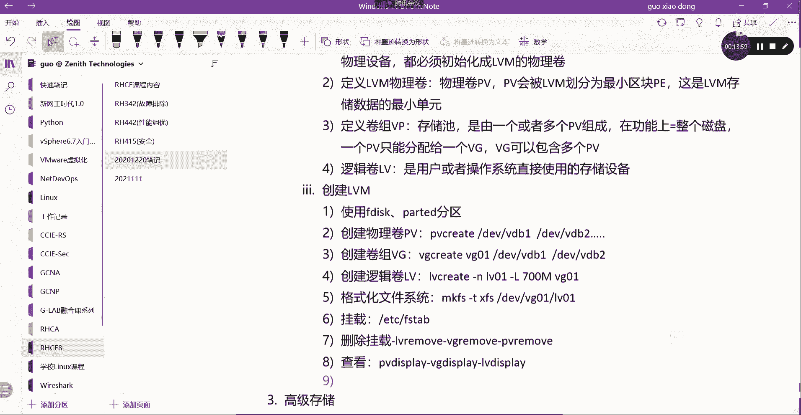

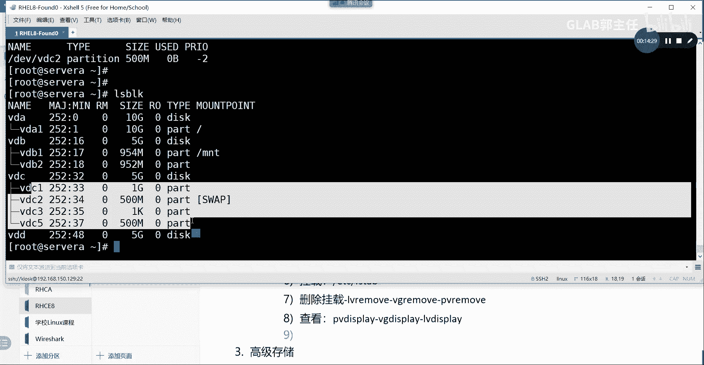

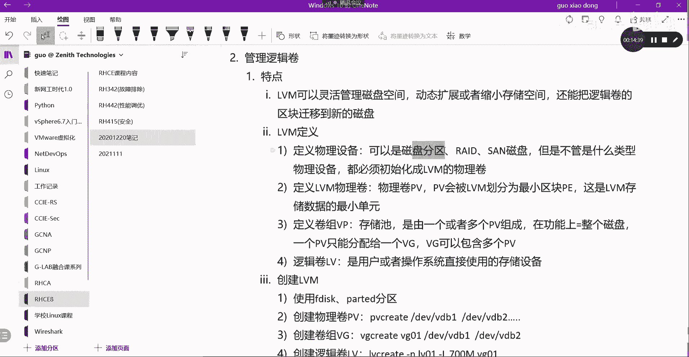

1.  **物理设备**
    这是LVM的底层基础。它可以是：
    *   磁盘分区（例如 `/dev/sdb1`）
    *   整个磁盘（例如 `/dev/sdd`）
    *   RAID阵列
    *   网络存储设备
    无论何种设备，都必须被初始化为LVM的物理卷才能使用。

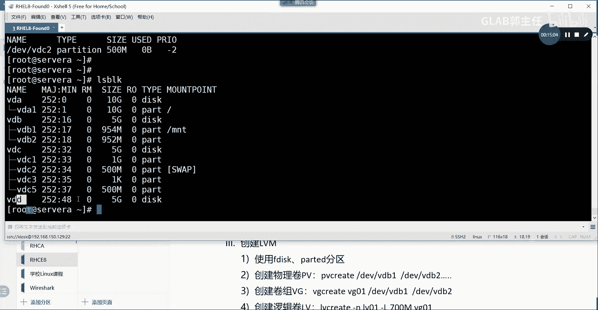

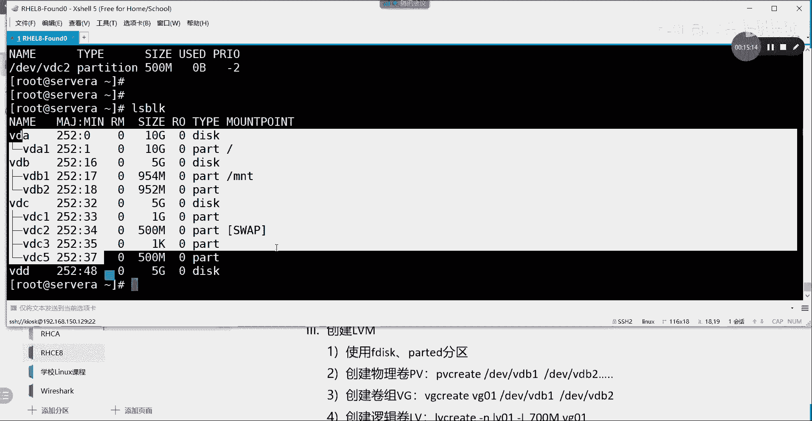

2.  **物理卷**
    物理卷是LVM管理的基本存储块。使用 `pvcreate` 命令将物理设备初始化为PV。LVM工具会将PV划分为最小的存储单元，称为**物理区块**，它是LVM存储数据的最小单元。

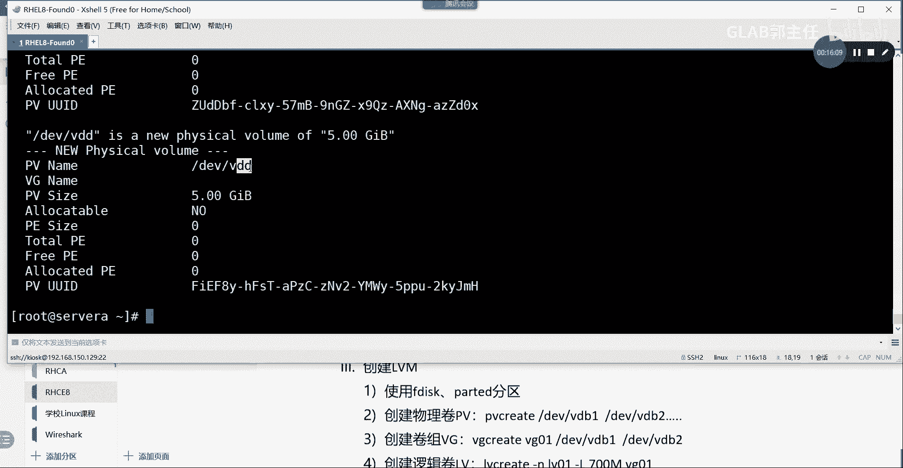

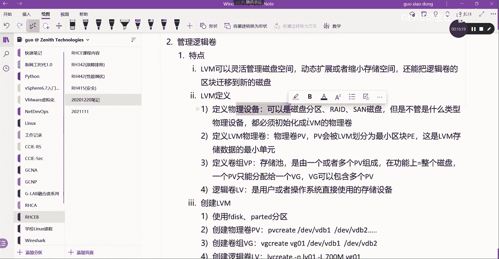

3.  **卷组**
    卷组由一个或多个PV组成，形成一个存储池。在功能上，一个卷组类似于一整块磁盘。需要注意的是，一个PV只能属于一个VG，但一个VG可以包含多个PV。

4.  **逻辑卷**
    逻辑卷是从卷组中划分出来的存储空间，是最终被操作系统和用户直接使用的存储设备。文件系统就创建在LV之上，然后将其挂载到目录使用。

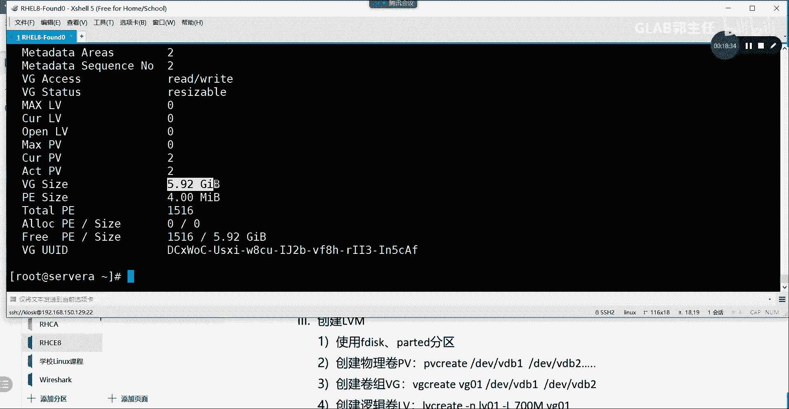

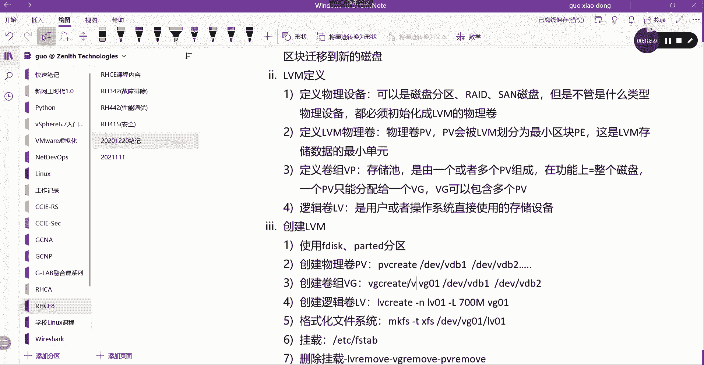

它们之间的关系可以概括为：**物理设备 -> 物理卷 -> 卷组 -> 逻辑卷**。

## 创建逻辑卷

理解了LVM的架构后，本节我们来看看如何一步步创建并使用逻辑卷。

创建逻辑卷是一个顺序过程，需要依次创建PV、VG和LV。

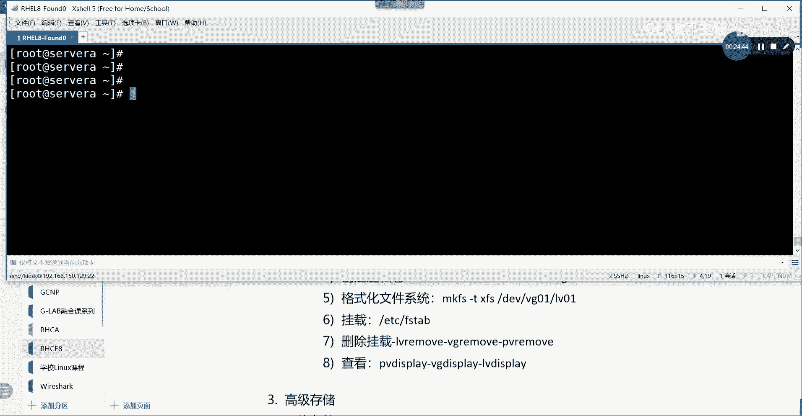

以下是创建逻辑卷的完整步骤：

1.  **准备物理设备**
    使用 `fdisk` 或 `parted` 工具创建分区，或将整块磁盘备用。分区类型设置为 `Linux LVM`。

2.  **创建物理卷**
    使用 `pvcreate` 命令将物理设备初始化为PV。
    ```bash
    pvcreate /dev/sdb1
    ```

3.  **创建卷组**
    使用 `vgcreate` 命令创建一个卷组，并将一个或多个PV加入其中。
    ```bash
    vgcreate vg01 /dev/sdb1
    ```

4.  **创建逻辑卷**
    使用 `lvcreate` 命令在卷组中划分逻辑卷。`-n` 指定名称，`-L` 指定大小。
    ```bash
    lvcreate -n lv01 -L 700M vg01
    ```

5.  **格式化逻辑卷**
    为创建好的逻辑卷创建文件系统，例如XFS。
    ```bash
    mkfs.xfs /dev/vg01/lv01
    ```

6.  **挂载逻辑卷**
    将逻辑卷挂载到系统目录，可以编辑 `/etc/fstab` 实现永久挂载。
    ```bash
    mount /dev/vg01/lv01 /mnt/data
    ```

## 查看与删除逻辑卷

创建逻辑卷后，我们需要知道如何查看其状态，以及在必要时如何安全删除。

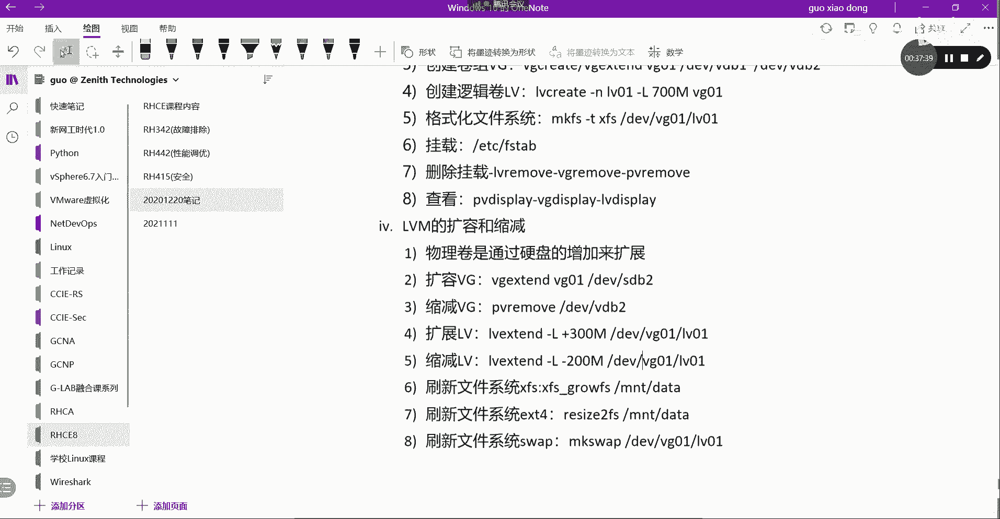

查看各层级信息的命令非常直观。

以下是常用的查看命令：

*   `pvdisplay`：查看物理卷详细信息。
*   `vgdisplay`：查看卷组详细信息。
*   `lvdisplay`：查看逻辑卷详细信息。
*   `lsblk`：以树形结构查看所有块设备，包括LVM。

删除逻辑卷的顺序与创建相反，需要从上层往下层逐级移除。

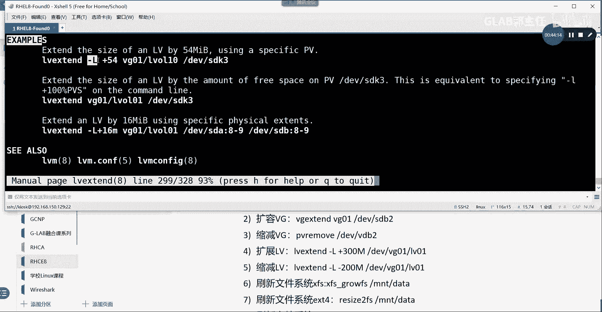

以下是删除逻辑卷的步骤：

1.  **卸载逻辑卷**
    ```bash
    umount /mnt/data
    ```
2.  **删除逻辑卷**
    ```bash
    lvremove /dev/vg01/lv01
    ```
3.  **删除卷组**
    ```bash
    vgremove vg01
    ```
4.  **删除物理卷**
    ```bash
    pvremove /dev/sdb1
    ```

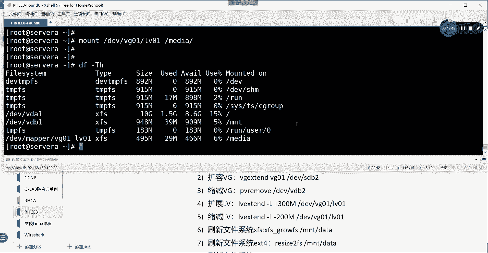

## 逻辑卷扩容

LVM最强大的功能之一是能够动态调整存储空间大小。本节中我们来看看如何对卷组和逻辑卷进行扩容。

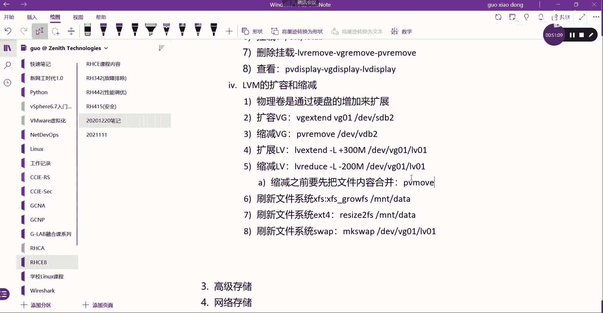

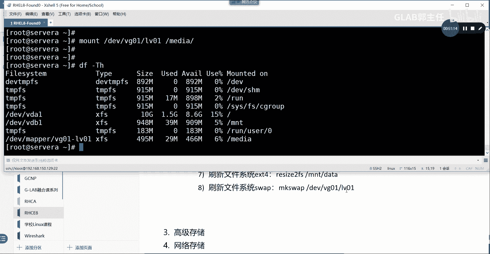

扩容主要涉及两个层面：扩大卷组的容量和扩大逻辑卷的容量。

**扩容卷组**
当VG的存储池空间不足时，可以向其中添加新的PV。
首先，将新磁盘或分区创建为PV。
```bash
pvcreate /dev/sdc1
```
然后，使用 `vgextend` 命令将其加入到现有卷组。
```bash
vgextend vg01 /dev/sdc1
```

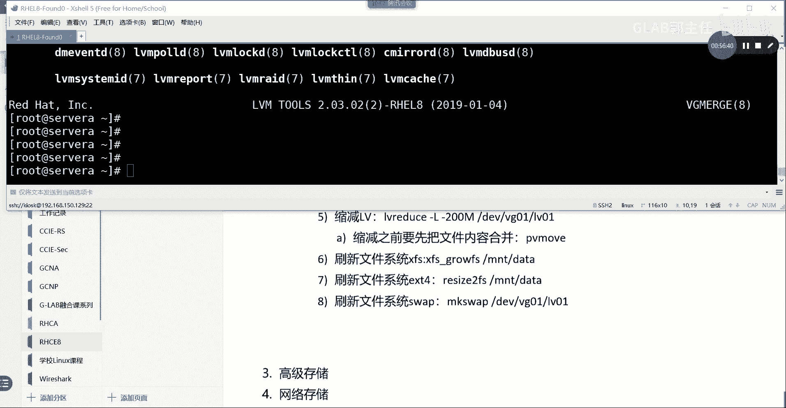

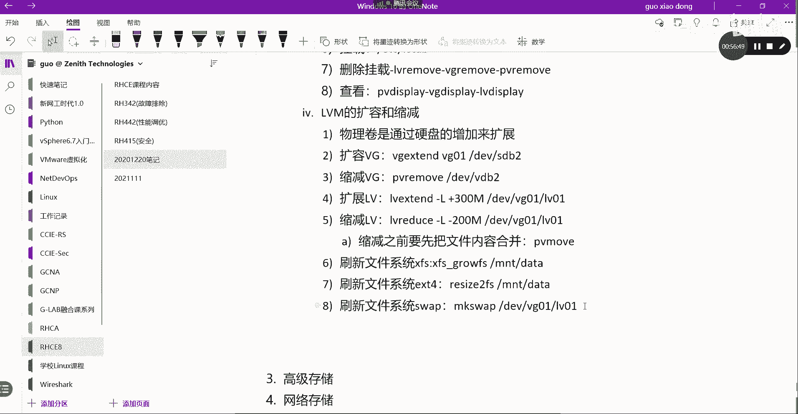

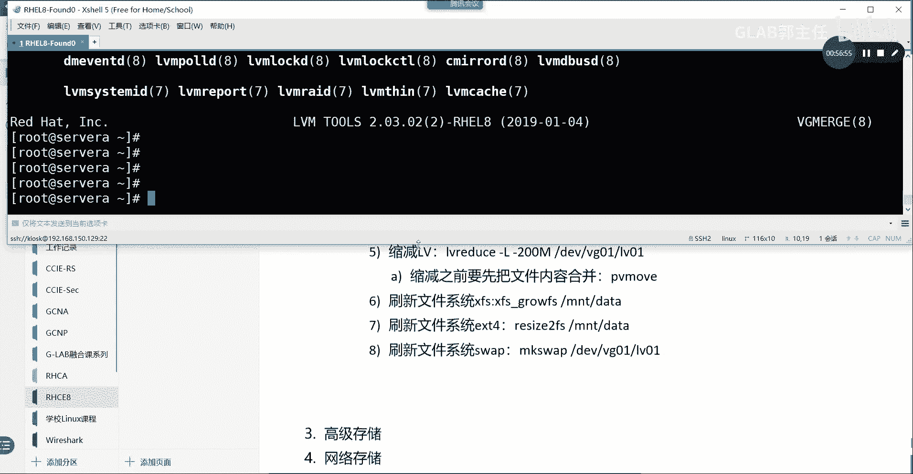

**扩容逻辑卷**
当LV的空间不足时，可以直接扩大其容量。
使用 `lvextend` 命令为LV增加空间。`-L +500M` 表示在原有基础上增加500MB。
```bash
lvextend -L +500M /dev/vg01/lv01
```
**重要**：扩容LV后，必须**刷新文件系统**，新增的空间才能被使用。刷新命令因文件系统类型而异。
*   对于 **XFS** 文件系统：
    ```bash
    xfs_growfs /mnt/data
    ```
*   对于 **EXT4** 文件系统：
    ```bash
    resize2fs /dev/vg01/lv01
    ```

## 逻辑卷缩减与数据迁移

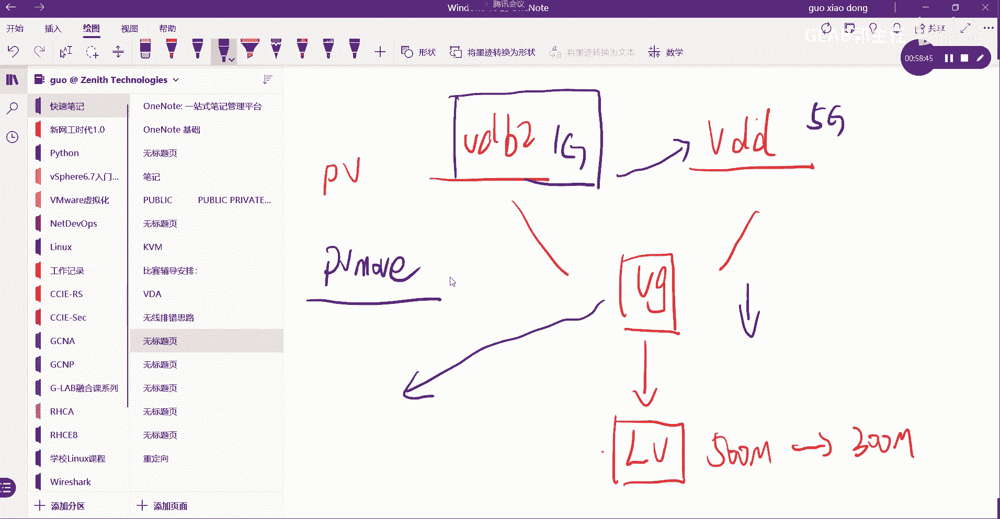

除了扩容，LVM也支持缩减，但这通常伴随着更高的风险。此外，我们还可以安全地迁移数据。

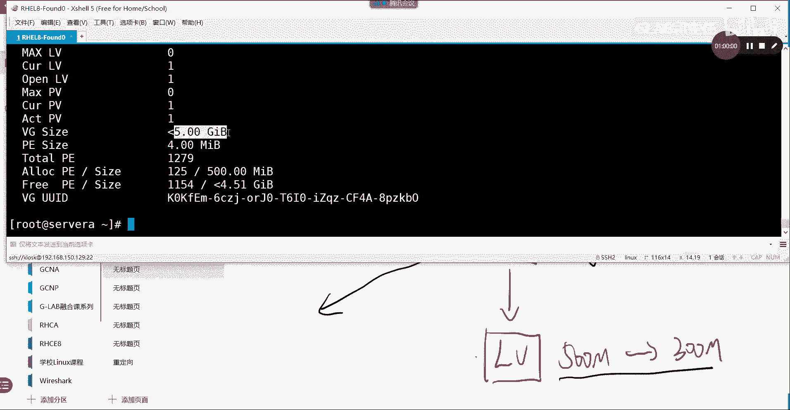

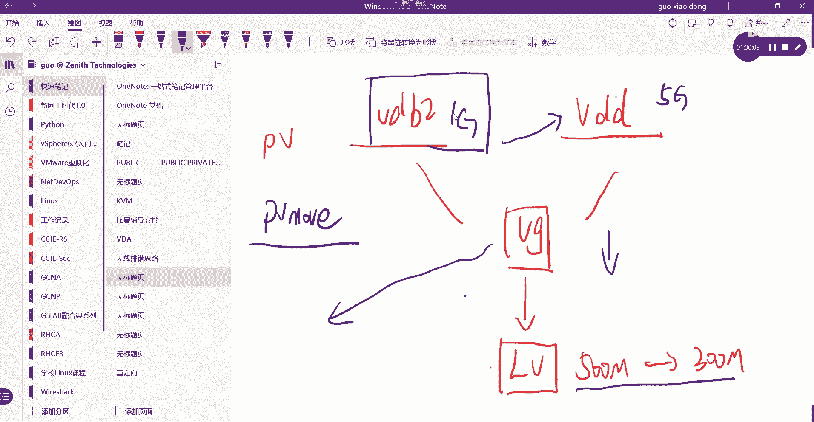

**缩减卷组**
如果希望从卷组中移除一块PV（例如更换旧硬盘），必须先将其上的数据迁移到其他PV。
1.  使用 `pvmove` 迁移数据。
    ```bash
    pvmove /dev/sdb1 /dev/sdc1
    ```
2.  使用 `vgreduce` 将已清空的PV从VG中移除。
    ```bash
    vgreduce vg01 /dev/sdb1
    ```
3.  最后，可以 `pvremove` 这个PV。

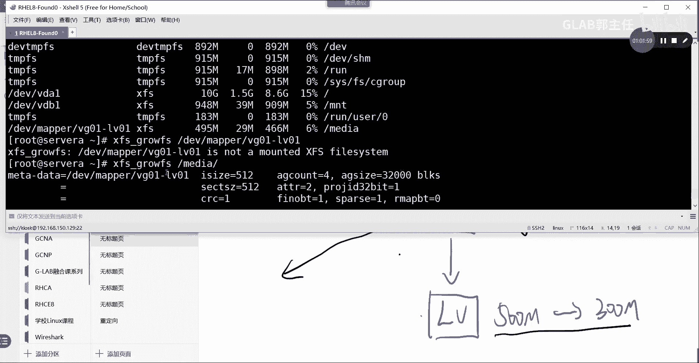

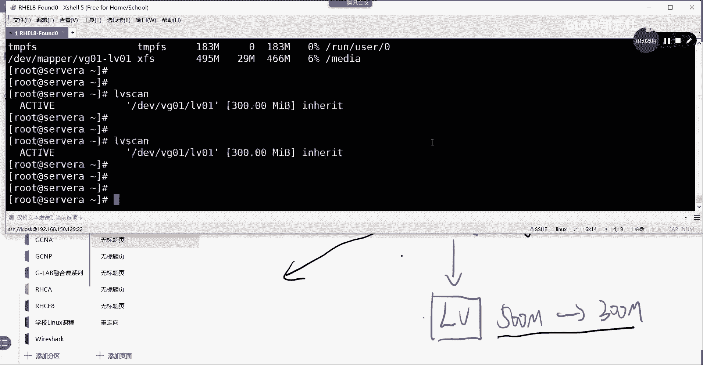

**缩减逻辑卷**
使用 `lvreduce` 命令可以缩减LV的大小。
```bash
lvreduce -L 300M /dev/vg01/lv01
```
**警告**：缩减逻辑卷可能导致数据丢失，因为系统会直接丢弃被缩减部分空间内的数据。在执行缩减前，必须确保该部分空间没有存储有效数据，并且最好先备份数据。因此，在生产环境中应谨慎使用缩减功能。

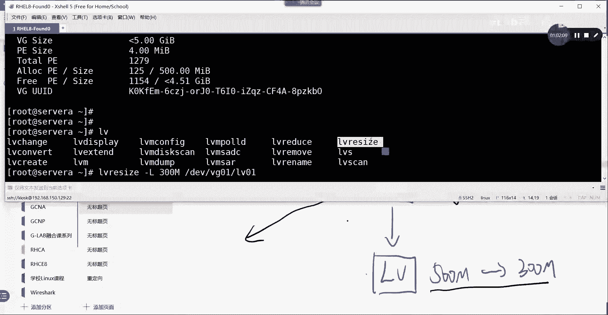

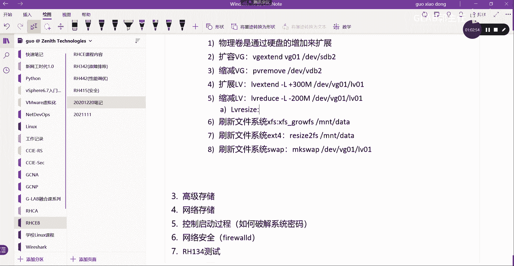

## 课程总结

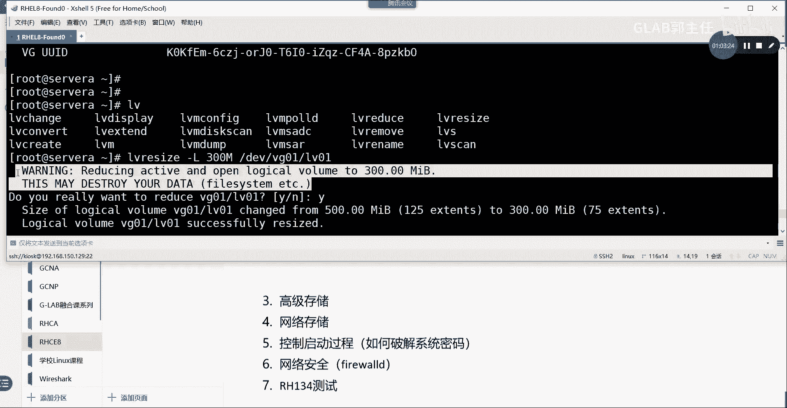

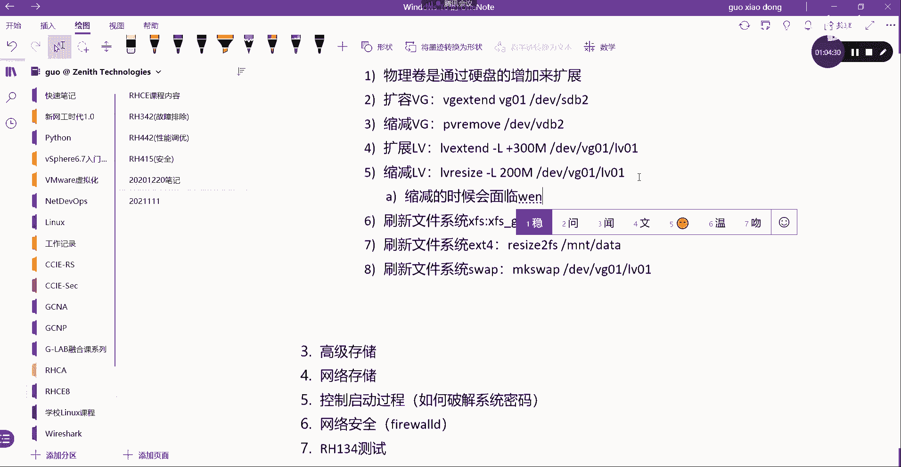

本节课中我们一起学习了Linux逻辑卷管理器从理论到实践的完整知识。

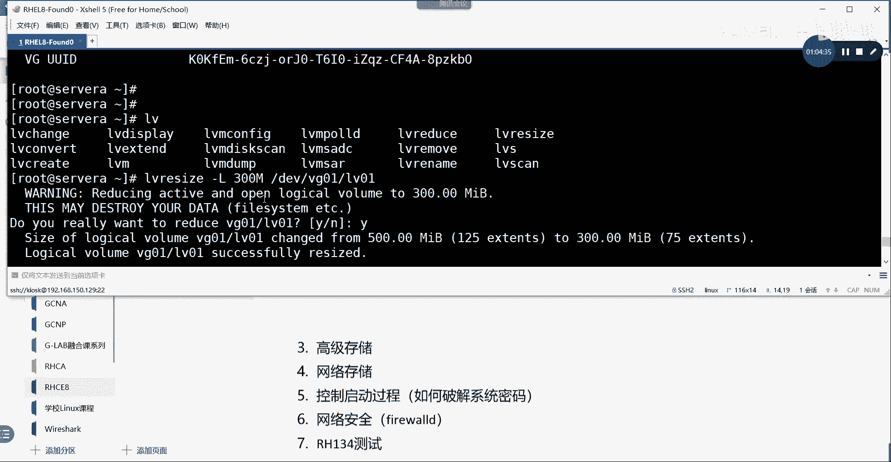

我们首先了解了LVM相比基本分区的优势在于**动态扩展**、**缩小**和**数据迁移**。然后，我们深入学习了LVM的四层架构：**物理设备、物理卷、卷组和逻辑卷**。接着，我们一步步实践了逻辑卷的**创建、查看、挂载和删除**流程。最后，我们重点掌握了LVM的核心操作：**卷组和逻辑卷的扩容**，并了解了**缩减和数据迁移**的方法及注意事项。

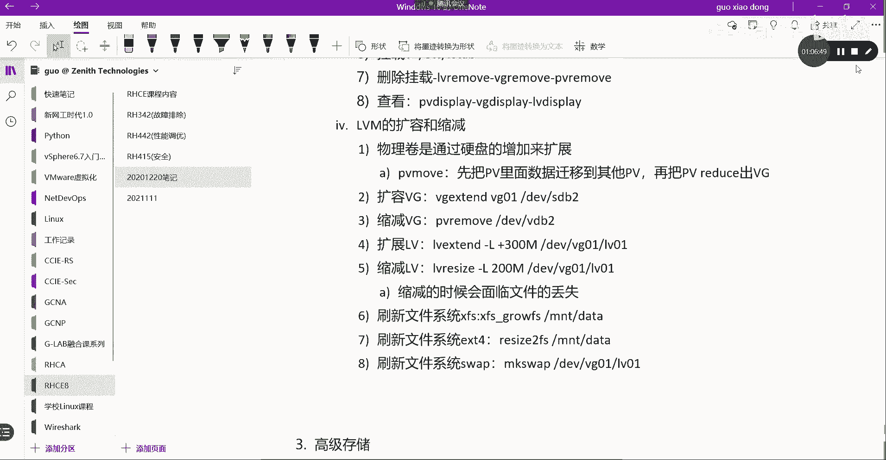

通过本课学习，你应该能够使用LVM灵活地管理服务器存储空间，这是成为一名合格Linux运维工程师的关键技能。