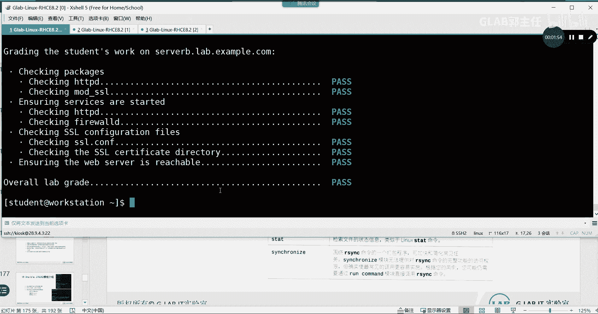
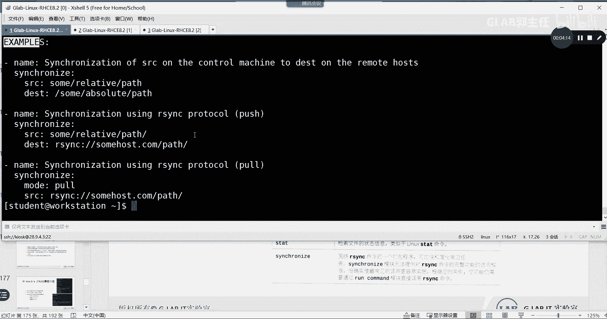
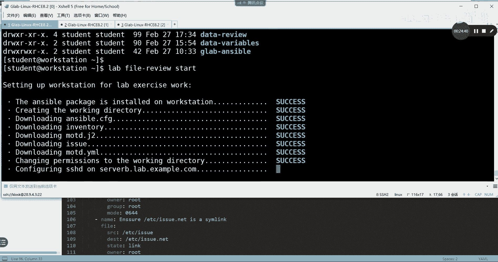

# 【Linux／RHCE／RHCSA】零基础入门Linux／红帽认证！Linux运维工程师的升职加薪宝典！44-Ansible JINJA2模板 - P1 - GLAB郭主任 - BV1Pu411F7ta

OK好我们继续好，下午第一个内容，我们先来讨论我们处理文件的时候有哪些方法，其实前面多多少少给大家讲了处理文件的模块，这里只是给大家做一个简单的总结对吧，大家自己看教材也行，自己写在笔记上也可以。

那么这些是我们处理文件的模块，我们一个来看找我们熟悉的第一个叫叫block fire，其实line in fire和block in fire，这两个可以对对比起来记忆。

block infire是针对行来改的对吧，它是能改的，然后block info是可以一段一段的，就是多行去对文件进行增加或者删除明白，所以block in fire和lin fire大家要注意一下。

然后copy模块也说过了，copy是处理可以复制文件，那么除了copy之外，fire也是可以处理文件的，所以这边写copy其实跟file类似，其实是类似的，copy和file类似的啊。

明白大家可以去对比一下，他的那个选项有哪些区别，我们在第一天的第二个笔记里头。

第一天的第二个笔记，就这个在这个笔记里头，我们给大家，把所有的常用的属性模块都列出来了，所以大家可以去把copy模块和file模块，自己去对比一下，明白吧，OK好。

然后就是d copy，然后copy和file一样啊，一起记，然后state这个我们今天讲过，这个是检索文件是不是存在的，就是解锁文件是不是存在，还记得今天用它模块，用这个模块来判断NGINX。

这个pad的文件是不是存在啊，如果NGPID在，就说明这个进程是启动了吗。

所以这个命令就相当于LINUX里面的命令，STIT对吧，就相当于这个命令，它用来查看文件的属性。

然后在模块，用这个模块就可以检索文件的状态信息，好OK然后接下来有两个没有讲的，一个叫FEH，这叫FETCH这个命令它跟copy一样，只不过反过来了，copy是从控制节点把文件送到数控节点，Fish。

是从受控节点把文件反过来拉到我的控制节点，明白吗，所以画个图应该就知道FETCH是吧，这个是控制节点controller，然后我有一堆的数控节点，有ABCD对吧，如果从控制节点把文件送过去。

这个用的是copy，如果反过来用的就是ABATCH看得懂吗，反过来都是copy处理文件，就是这里要写的好，最下面一个这个命令呢是RYRYRSYNC，在我们讲RH124后面处理文件，这是一个远程同步。

可以增量同步文件的备份文件的一个方法，那么在模块里头用的就是这个模块，明白意思吗，那就这个模块好嗯，我们可以SYNCHR。

我们来试一下啊，看一下它的用法XYNCHR没有是吧，没有的话，那就杠air通过grab去过滤一下SYNC，这么多就这个吧，那复制一下，记不得没关系，复制一下啊，就这么用的吧。

它是一个它也是一个copy文件的方式，只不过它支持增量，就是已经copy过来，他不会再copy，他只是把增加的部分copy过来，这是增量啊，OK所以处理文件的方法就这些了。

处理文件的方法就这些，为什么要先讲处理文件的方法呢，大家会看到，不管用什么样的模块处理文件，这个文件应该都是固定的吧，都是固定好的，你把你文件不管放在本地还是放在控制节点上。

数控节点上它都是一个静态的文件，好我们现在如果要实现特殊的需求呢，就是刚才讲的普通文件的复制方式，在所有的数控节点，主机上的复制的文件都是一样的，你把它copy到100台主机上。

这100台主机看到的都是同一个文件吗，但是呢如果我希望根据每一台服务器的性能，去定制服务器的启动进程，或者去定制属于特殊服务器的响应，爆头的特殊文件，如果要定义这样每一台服务器都是不一样的，文件的时候。

有人说你每一台去写呀，每一台去一个一个写，跟你创建300个用户不用循环有什么区别，是不是很复杂，对不对，有没有更简单的方法，能够让我们实现更简单的去实现，每一台服务器有属于自己定制的文件。

有这个方法就是这边讲的叫叫模板，我们模板只有一个，这就叫金家兔的模板，然后我把这个模板copy到100台机器上的时候，它可以根据这个模板自动生成，属于这100台各自的文件，听懂了吗。

所以这样的话我不需要写100个文件，我只需要管理这个模板就可以了吧，各位能听明白吗，所以这就是我们下午要讲的第一个东西，要善于去用模板来形成，各个服务器自己特殊的文件，而不是有别于我们之前讲的。

普通的文件复制方法啊，普通的文件复制方法，OK所以这个模板叫ginger to的模板好，所以接下来重点就要讲ginger to模板该如何做，君家兔的是基于Python的一个模板引擎。

所以它其实是一门语言，可以理解为就是编程的一个小语法啊，一会儿我们来看看它里面的语法，太简单了，非常简单嗯，是以go to为后缀的，看到go to就是就是一个新加特的模板。

然后它有三种定界符和两种逻辑控制，三种定界符和两种逻辑控制，先看三种定界符在下面列出来了，如果最外面都是花括号，两个花括号，花括号里面如果是井号，就代表他是一行注释，如果花括号里面是两个花括号。

就是大花号里面又有一个小花括号是吧，这代表的是变量的引用，如果是百分号代表的是逻辑的表达，好不明白，看右边右边就是它的语法看嗯，先看逻辑表达，逻辑表达有if和for，这边给大家列出来了两种逻辑表达。

这是三种定界符，这边列出来的是两种逻辑表达嗯，条件判断它是用百分号加if的方式来判断if，对吧，else if else and if跟那个那个那个希尔的脚本很像，只不过它的格式要比希尔脚本要复杂。

也就在前后都要加花，括号和百分号都要加他这种定界符能听懂吗，他是怎么判断自己就是一个增加T的模板，就是通过这种特殊的定界符判断出来的，这样写就代表它就是一个尖叫图模板，理解吗。

Python就能够自动识别到它，并且翻译成Python的语言，所以就一定要这样写，你的精雕铸模板一定是这样写的，各位听懂我意思吗，考试有一题就是让大家自己去写的，500自己写，就是写写，这好吧好。

那么下面举了个例子啊，看完如果定义了上面井号是注释，这行吗，这是一行注释，下面如果i DC is defined，那么就输出调用这个IDC，然后lc if没有定义，然后最后结束循环。

结束条件判断这个语法简单吧，这个很简单，一看就看得懂了，再看for for的话，for循环就这么个例子，for and for开始循环，结束循环，下面这个例子看一下for host in groups。

什么什么什么这什么意思啊，For host in，这个里面就代表的是for要到这里面去循环吗，然后呢把每一次循环的结果host都打印出来，调用这个host吧，然后最后结束循环，这看得懂吗，仔细看一下。

大家看一下啊，所以对于新加推的学习，大家只要看我这个PPT，一张PPT就够了，他没有其他再复杂的循环，再复杂的什么条件变量，乱七八糟的东西没有就这么多，所以这个模板啊。

它就是一个简单的一个一个一个一种小的，带有循环和条件的，一个小小的这样的一个编程语言吧，算是就这么小，很简单好吧，看下来我们看一个实际的例子，这是我们实际的一个例子，看一下，看到了吗，从哪开始啊。

这个cat config点进价就是我这个文件的名字吧，他把这个文件里面的内容给读出来了，好从上面到下面就这么多看啊，井号一看到井号，这是一个注释，对吧好，下面welcome hoston。

这调用的是什么变量，这个变量是什么变量，export下，刚刚host name事实变量嘛，对不对，然后os is inspo s family，这也是事实变量吗对吧，然后呢today is什么。

这也是实时变量，然后呢这也是实时变量，所以你会发现精加图模板调用事实变量，是他的常规操作吧，嗯为什么能够文件copy过去之后，能生成属于这个机器自己单独的一个文件，就是因为这个文件弄过去之后啊。

自动调用了自己主机上的实时变量，所以才能生成属于这个服务器，自己的一个新的文件出来吧，各位能听明白吗，所以正常的是调用事实变量会比较多，看下面if and sport process v。

CPU大于一的话，这是在判断我的处理器吧，下面呢如果M这是一个循环，For m in export，这什么帽子对吧，然后如果M在这个里头，并且M的帽子不等于斜杠的话，这个是排除掉了帽子。

下面我们我们看挂载，就是看本地磁盘挂载，对磁盘挂载它排除掉了斜杠代表是根对吧，除了根以外，然后它会输出啊，嗯挂载了mt，然后TSIZE是多少，可用的size是多少，这是一个什么结果是什么。

这一段其实在不停的去找本地的挂载盘，然后把每一块盘的空间列出来吧，理解为什么把每一把这个机器上的，每一个硬盘的可用空间对吧，用了多少，把它全部给列出来，就这样来做的。

就用它来做这个只要copy到目标主机，就会读jj to模板，听懂了吗，好所以这模板我们在控制节点上创建好了以后，就可以在ESPORT脚本里面调用这个模板，来看怎么调用的，就是调用它用到一个模块。

叫叫什么TEMPL，还记得吗，我们在第一天讲模块的时候，讲到template，直接用的是template啊，然后他要把这个模板指定这个圆在哪，目标在哪，其实本质上是把这个模板复制过去。

但是他用的不是copy模块，听懂我意思吗，他用的就是特特特殊的模块，他们通过template，把这个jj to的文件送到目标文件，目标的主机上去之后，自动执行了里边的东西，然后生成了新的文件。

所以你在目标主机看到的是一个CONFIG，点CONF的文件，这个文件里面会把你写的这些东西都自动生成，属于这个服务器的内容，说清楚吗，OK所以金刚兔模板最重要的理解它的语法，就这些，就这一页PPT。

理解一下它的三种定界符和两种逻辑运算，然后他的大部分的处理都是在调用事实变量，听明白吧，他大部分的情况都是在调用实时变量，那它能不能用我们之前学的变量，当然是可以的，也可以啊，明白吗啊，也可以，好。

那么来看205页。

205页嗯，我把205页的需求给大家，我帮大家把金家兔的那两个例子，包括调用的东西，我也给他贴进来，因为这个笔记回头我会给你们，今天结束之后，我把这两天的笔记给大家，这就是我前面讲的两种条件表达。

有例子啊，就我PPT上的一模一样的，这是一个实际的例子好，这个是调用用template调用原目标，这是一种老的写法吧，大家可以改成新的写法好，这个是205页的课堂实验的需求，大家看看会不会做。

先了解一下这东西干了些什么对吧，其实你看这本书太厚了，那么三本书加起来好几千页是吧，1000多页都不知，但其实我们要明白他的技术的每一个技术细节，实现了什么需求，帮我们解决了什么问题，这个要先搞清楚。

然后再去做来看，要大家创建一个新的inventory文件，然后要获取事实变量，来创建一个mo t d的进价two的模板，OK然后内容是什么呢，要获取受控主机的CPU和内存限制的信息。

这就是最终的要求创建一个模板，然后通过这个模板来对你的受控主机上，自动生成一个关于CPU和内存信息的一个文件，听懂我意思吗，OK好，然后呢创建playbook，要把这个JJ图的文件映射到这个上面去。

这个叫映射，其实就是copy它，但是你在目标主机是看不到模板的，看到的只有模板生成的这个文件，听懂了吗，所以他不能用copy，它本质上是copy先copy过去，然后执行了一下，生成了新的文件。

然后把copy过去的精加图模板删掉了，听懂了吗，OK验证受管主机的它是不是存在，要先判断这个文件在不在，如果在的话，就要把它删掉对吧，并且显示e DC mod这个文件的信息，还要显示它的信息。

copy把这个文件要复制到受管主机的etc下面去，这是另外一个文件，跟我们模板文件没有关系啊，把新的一个issue的文件copy过去，然后判断宿管主机上的某个文件是不是软链接。

所以其实单纯的考虑这里的模板其实很简单，就一个需求，他在此之外又加了3~4个小的需求，跟模板没有关系，听懂我意思吗啊，像什么去检查是不是软链接，用什么模块，去判断是不是软链接，用什么模块。

是用fire啊，然后copy模块把这个文件复制过去，之前面讲过吧，要判断一个文件是否存在，用什么呀，嗯前面有讲过，判断一个文件是否存在，我们才判断一个进程是否存在。

用的是什么STAT判断一个文件是否存在，我们也是可以用state的，明白意思不，OK所以啊这里头就是我们前面讲的东西，我们把它的每一个需求，一个一个的给大家列出来之后，其实比较简单，来我们看一下。

首先啊我们应该先写一个什么，我们应该先写这是这是脚本啊，在此之前，我们是不是应该要先写这个MOTD的，jj to的模板啊，OK那这个模板应该怎么写，模板明确告诉你要去获取什么，获取内存和和什么CPU吧。

对不对，内存和CPU的相关信息，所以你这时候应该去找的，应该是你的内存和CPU的事实变量。

该怎么该是什么样子的吧，OK不记得没关系来吧，我们看一下，不记得我们就用的用setup模块，用这个setup模块去找USB内存的话，应该是大家还记得是什么M1M是吧，是不是在毕业吗，这个应该怎么写。

叫MEMTUTMB，应该是这个吧，明白意思吧，应该是这个吧，好可以直接用它，可以直接用这个，可以直接用这个事实变量，还有呢还有一个叫叫什么PRO是吧，process吧。

应该是proceed CPU的count，就应该是这个是不是去判断CPU的有几盒啊，有几颗CPU，明白吗，所以应该是这个实时变量，你只要记得个，大概通过这种方法去搜索就知道了。

明白吗，好在这里再教大家，另外一种写这个调用事实变量的方法，我是这样写的，但是我刚才说的是直接调用那个也是对的啊，我是这样写的，有区别吗，就是我写的MTT的金家推的模板有没有区别。

你可以直接通过XBOARD加他这个连在一起，就是我们刚才查到的就是sport mebomb吧，这是查查内存，明白吗，然后呢也可以用这个叫ANSPORT下NFAT，它所有的前面都是用sport下fat。

然然后再去写后面的这个东西，听懂不一样的，其实是一样的，明白吗，这种方式就统一了，这样一看就知道是内置的什么事实变量吧，看到这个facts就知道是40变量，所以两种写法听明白了吗，都可以都可以啊。

明白这个是我这里用的是这种写法，我上面的例子就是直接调用的，直接调用的实时变量，看到了吗，没有写吧，如果把这个改成fast的话，你在这边就写写一个fast，然后把后面用中括号括起来。

就可以跟下面一样就行了，听明白了吗，OK好，这个是先把它写好，前面是叫system total memory是多少，system proceed count是多少，然后调用实时变量，这就是gt的模板。

就应该这样写，写完了以后，我们来看他的脚本应该怎么去去写好名字，不管host or remote user dv o p s，这句可以去掉，没有关系啊，因为我们在组的文件里头是不是有写诶。

这个是教学环境不一定有啊，就是你看如果主环境里头有写的话，这边就不用写，如果没写就要写，我是用DDDEVOP上去的，要不要提前要的，所以这两句话你可以在CFG文件里面去指定。

也可以在play里面单独指定，能听明白吗，OK然后到了下面task，接下来用template，把这个模板送到目标目录下面去，然后呢root root数组和数组还有权限。

ok template也是可以去指定这个文件的，数组和数组还有权限的嗯，然后check一下这个file是不是存在，我们提到过用state模块，然后去指定去看一下它是不存在，对不对。

然后把check的结果放在注册变量里面，用MOTD这个变量去接收，然后用debug信息把它输出出来，就这段是这一段是检查文件是不是存在，并且把它打印出来吧，把检查的结果给打印出来，听明白吗，OK好。

然后呢，接下来我们把issue的文件传过去啊，这个是用copy模块，接下来我们查看一下它的软链接，用的是file模块，没问题吧，啊没有吧，ok fire是用的这个这个这个东西，OK好。

那么这应该就可以了，因为你上面的模板倒过去，这边跑完了以后，其实etc下的MOTD应该就已经存在了，能听懂吗，所以这一步简单的只是去检查，我是不是成功的去创建了，通过模板。

成功的去创建了etc mtt的这个文件，理解吧，也就这一段可以完全去掉不错，但是不影响我们的结果需求，他有提到过，他说要去检查检查并显示啊，这个文件是不是存在看懂了吗，所以他的要求要求这样做。

所以我们才会有这么一段，否则没有这一段啊，然后呢医学文件也是的，然后copy过来检查link链接是不是存在，所以这一段应该不复杂吧，主要就是考大家如何调用模板，然后最后我们来检查一下。

我们把这个东西靠背上去，这个应该是第九个实验课堂作业九，课堂数学九好，相同的方法来吧，我们把它先把这个环境打开。

我们用的是student，好用lab嗯，这应该是什么，这个应该是lab lab file file review是吧，Fire review start。

好，等它开好，开好之后，我们把这个我们的脚本传上去。

因为课堂实验九，然后在这个地方应该就看到了对吧好，看到了之后，我们来把它倒过来，好吧对吧好，送到的目标目录就应该是file file review，这边多了一个目录CD的FIREVIEW，应该送到这来。

现在没有，送到这儿来，然后这里应该就有了对吧，那么它让我们创建的叫m o t d yo，所以复制过来叫MOTD点YML好，名字就改了，然后调整一下前面的这些都没有用啊。

30dd10 d d 10dd5 dd，10DD到了吗，5dd，好，这个应该是我们我们要编写的那个那个那个，金家兔模板对吧，我先复制出来，然后把它删掉删掉删掉删掉删掉删掉好。

这个就是我后面写的那一堆东西了，然后保存一下好，然后在这里我们要创建这个MTT的yo mo ttt，yo m o t d的样貌，然后MOTDJ加to没有，所以我们要编辑一下mo t d点go to。

然后把刚才那个贴进来，是不是这个这个一定要写清楚呢，保存一下好，来看一下模板，有了组的文件，有了好，然后呢，这个我们可以通过sport杠，playbook去检查一下yo的语法格式，有没有语法错误。

这个warning啊，哦他说inventory不存在，还忘记了，他需求里头，是不是要让我们创建一个inventory文件，所以我们还得你看啊，这里头检查一下还是有好处，让大家发现问题啊。

这里没有我们的EVENTURE文件，对不对，但是有这个ANSPORTCFG文件，我们可以看一下sport cfg，它告诉我们MAI就是当前目录下的mage吧，所以我们应该在这里去创建。

INVENTORY自己创建一个inventory文件，这个inventory文件，它有要求说让我们创建的叫service是吧，教材里面有啊，S e r v e r s servers。

然后呢只针对哪个服务器啊，server b server b点lob点，ex m p l e点com，这里一定要写没有version文件，它没办法去去找到目标主机，你的脚本写得再完善也没有用对吧。

所以再来跑一下，好没问题是吧，好没问题，我们来开始跑一下，好OK了。

OK你想看它中间有一段，这一段是显示我的这个文件里边的东西是吧。

显示文件啊，好那怎么去测呢。

我们可以大家想想，我们这整个过程在改的就是改MOTT，大家知道ETCOTT和excel文件是干嘛用的，这俩文件是干嘛用的，是不是远程登录上去的时候，所有的远程登录上去。

刚开始的提示信息啊，对不对，所以我们可以直接通过SSH来测，我们在workstation上通过SSHDEVOPS，直接server b直接到server b上去吗。

是不是出来了，原先是没有这一堆内容的。

能听懂吗，好这个内容大家会看啊，首先这两个内容应该是MOTD产生的吧，MTT是不是在对memory和内存和CPU，在做统计的一个提示啊，然后上面这部分内容应该是issue里面的东西。

理解吧，EQ里面的东西。

你刚才不是做了copy eq吗，来这里他不是让你把file里面有个一，里面不是有一个issue文件吗，对吧，然后呢我们去v r m file里面的issue文件，是不是就这个东西啊，啊是的吧。

刚刚登上去的东西啊，所以呢应该我刚才SSH上去，最上面的内容显示的是EU，这一部分内容是啊MOTD的，为什么两个同时显示，应该是这样子的，这上面的这一块的内容是，在你没有输密码的时候。

应该给你弹出来一个一，然后如果密码输了，通过了验证，他会给你输出MTT里面的内容吧，这里为什么两个同时显示了，是因为我现在是免密登录的，只要登上去，这个肯定会输出，但是又没有密码，所以就登录成功了。

只要成功了，MOTT就会跳出来了，所以它是连续输出的，明白吗，OK这要看得懂啊，好最后看到这个结果就是对了，下面这两个，下面这两个这个跟一和MTT没有关系，听懂了吗，这是一个提示，不管啊，提出来。

卡住了，什么玩意，好，这个是我们讲的JITO的模板。

关于JITO吧，他考平时用，也就是对这个模板的一个简单的配置，这个要要要会写其他的就直接调用，调用的话只需要记住一个template模板就可以了，其他没有难的，template的用法跟copy是一样的。

明白吗，OK好，那么考试里头呢，其实他要大家自己去写一个jj to的模板，那么也是类似让大家去统计内存，统计CPU，其他没了，但要比这个复杂。

