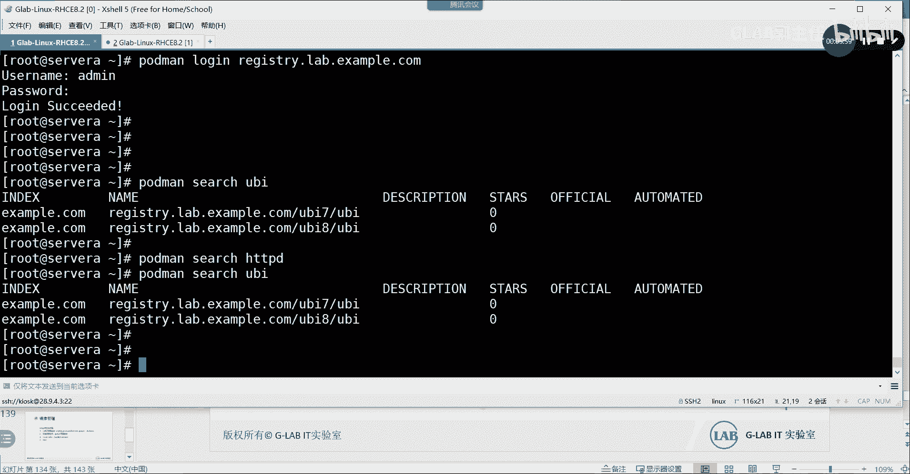

# 【Linux／RHCE／RHCSA】零基础入门Linux／红帽认证！Linux运维工程师的升职加薪宝典！RHCSA+RHCE55-Podman运行一个简单的容器 - P1 - GLAB郭主任 - BV1Ac41167nD

OK好来我们看一下啊，把这个装一下，装的话是用young module module install啊，把这个容器的所有的包都装好。

装好了以后，我们要做的第一件事情，就是来配置我们镜像仓库啊。

这个镜像仓库跟它的全局配置文件有关系，就是这个在etc的container上面的，一个叫register config，这里头属于全局配置。

那我们在这个配置下面，可能要去指定一下我们的镜像仓库在哪里，它默认给大家知道的镜像仓库是公网的，镜像仓库，我们来大概看一下公网镜像仓库啊。

这个就是啊比如说我们要下一个HTTPD，在网络上去搜索一下HTTP，HTTPT有阿帕奇的HTTP2点进去，Latest，他会告诉你latest红帽的标准的，官方的镜像容器的镜像仓库，它描述的很清楚。

他告诉你怎么用，然后呢怎么去部署，这些都有，另外另外如果呃他在这里有显示，就是它的风险系数大概是多少，但有多大对吧，都可以，大家自己自己都可以，这是最新的，如果你找一个很早以前的。

我们找一个很早以前的32，这个时候他就告诉你他有多少个漏洞，对不对，所以大家尽量要下最新的，为什么镜像要不停的去更新，因为他们在不停的呃发现镜像的漏洞，漏洞的这个这个这个这边的数量越多，你就不要用。

你尽量用它最新的，尽量用它最新的，明白意思吧，ok nice好，这个是红帽官方的一个镜像，那么再下一个这个这个这个叫QUAR，Q u a r d i o，这是一家公司，然后被红帽收购了。

我们在内部搭建的私有的镜像仓库，就是用它来搭建的嗯，他现在看到的这个应该是公网的，可能访问不了，要翻墙，要翻墙才能出去啊对吧，还有翻墙我就不打开了，然后在公网上打开的，它是公网提供的一个镜像仓库。

你可以下载他的一整套完整的包回来，自己搭建丝网的镜像仓库，红包就是用它搭建了自己的丝网镜像仓库，明白意思吗，好，然后还有一个docker，叫harbor docker点com，这个应该也要翻墙，不用吧。

出来了，这个不用，好这个不用这个也可以搜索一下，用APACHE阿帕奇，对吧也是一样的，HT TP d tomcat其实都可以，这也是一个镜像仓库，docker boss面向docker兼容啊，都可以。

镜像都是用的同一个镜像了，可以自己去下好吧，又要注册，要登录啊，这个就不显示显示了三个，我给大家演示了三个啊，一个在国外要翻墙才能上好这三个。

那么在我们这里头，我们不是用的它了吧，我们应该要改一改对吧，我们要把它的镜像仓库改成我们内部的嗯，你把它改一下，我们写一个就可以了，它叫它叫region registic lab。

点exam DK com，Example com，OK好，这是要改的第一个文件，这要改的第一个文件，接下来改完了以后，我们就可以来简单测一下到内部的仓库通不通。

我们可以通过hold me login去登录一下，登录刚才的这个register library com，要download镜像，必须要先登录上去，好通过命令行的这种方式登录上去。

用户名的密密码REDHAT321诶，有错吗，好这里会报一个错，这个错误的原因是因为还是那个文件的问题，这个文件这个文件里头啊，我们有还有一些参数，比如说这里这叫这叫register insecure。

就是登录这个镜像仓库的时候，会有一个自签名的证书，所以它会有一个报错，那么我们把这个网站，把它加到下面的这个配置里面来，我先加进来啊，贴过来好吧好，贴过来，我想想要不要加，应该要加的，加个引号，好吧好。

把它加进来，加进来之后，我们再来试一下，一会告诉你这个作用是什么，登录成功了吧，这个作用是啥呢，就是我把不需要通过证书验证的这个网站，把它加进来，就加在这的链接，网站是不需要经过SSL的专属链接的。

能理解吧，所以啊把这个加进来，把这个加进来，加进来了以后，接下来我们就登录成功了，那么登录成功了以后，我们可以来搜索一下，比如说我们可以通过pm search去搜索一下这个UBI，这个UBI是关键字啊。

关键字看看有没有跟UBI相关的，就是这个跟UBI相关的一些镜像对吧，我再测试一下有没有HTTP诶没有，只有UBI，只有UBI，OK这是他的目录吧，应该是好，所以我们能拉到仓库镜像里面的内容。

当然你也可以，你也可以怎么办。

你也可以登到这个仓库里面去，我们不是说它是它是这个机器吗。

这个机器是这个机器让我想象啊，这个机器这个机器应该能登上去的账号，我想想不登也行啊。

登上去就是看他的那个界面，就他的那个界面我忘记密码了。

可以看到一个图形化的界面，界面里头能看见这个仓库里面能很直观看到。

就跟我们刚才看公网私有介绍仓库。

官网的镜像仓库一样的，是一个这样的形式，方式体现的好吧，不看也可以啊，只要能看到就好，接下来，我们接下来要从容器中下一个镜像出来了，下迹象用的是pull啊，通过pl的方式到这个镜像里头。

到这儿来到这儿来到这，我们下UBI8，然后呢UBI8UBI，我们从这从这里来下一个镜像出来，poor啊，然后latest是这个加密，这是我今天没有人去管的行为，这就是代表到我的这个仓库镜像里头。

去下一个叫UBI的下载最新版本，明白好，下下来了，不代表容器就运行了，我们需要去运行一下这个容器，它才能够看到好，接下来我们先来看一下，它的镜像存放在什么位置，默认容器的存放路径在什么位置。

我们来看一下啊，现在看一下port main啊，port main杠PSPMP啊，没有任何容器在运行啊，坡度PS是看容器的运行状态，来看下载的镜像默认存放路径在哪里。

在VR下面的这个library上面的容器，content的storage的下面有一个叫overlay，刚好有这个就是我下载的镜像，这个就是我下载的镜像默认的镜像，我说的是镜像啊，这里要区分开来。

镜像和运行成运行程是在镜像上运行的，听懂我意思吗，镜像是镜像啊，镜像是镜像啊，所以镜像默认的存放路径在这里好，然后我们要看一下进本地有哪些镜像，可以通过pin imagine images。

是不是下载了一个镜像在本地images好不好，然后呢，接下来我们要开始运行容器了，容器的运行用port main run，这里介绍几个参数，第一个叫IT，IT就是可以跟容器里边的系统或者叫服务。

进行交互式的进行交互式的，我们通过T，来运行这个容器，来运行这个容器UBI对吧，这个运行把这个下载下来的东西，LATEST运行一下这个容器好，这个容器是不是交互式，是不是就进去了，各位发现变化了没有。

那现在这个状态就是在容器里边了，理解为什么这个就在容器里边了，好不好，这个在容器里边以后，我们可以通过它另外一个终端root，Sorry，我们可以通过PMP去看一下这个容器，是不是已经看到在运行啊。

状态是不是up状态啊，对不对好，那我们退出来退出了容器，然后再用PMP看一下有没有容器在运行了，没有了吧，说明容器只要退出来，它就自动关闭了，能明白我意思吗，啊各位好好对，我刚退出来了。

我再用PS看是不是没有容器在运行了，所以容器只要在退出来了，他就没有再运行了，那我想让他退出来，也能在后台默默运行，怎么办，我们可以在这里加一个参数，在这里加一个GD，我们可以加一个GD。

还有一个就是我们还可以给他指定这个容器，给它指定一个名字，杠杠name等于RHEL8，给他指定一个名字，各位能听懂吗，这时候再运行一次，再运行一次，我用好，这个时候我是不是没有进去啊，不用杠D了之后。

我是不是没有进入到这种交互式的界面，里面去啊，对不对，但是容器有没有在运行呢，PORTMANGPSPMP有吧，并且它的名字被改成了2H1288，听懂了吗，所以接下来我们就可以基于这个名字。

来对这个容器进行操作了，明白吗，好接下来的操作怎么做呢，啊好可以怎么做呢，容器一直在运行啊，现在那我要把它给关掉，我们可以通过port ma stop r h e l8，可不可以就关闭了对吧。

pd map没有了吧，对不对好，然后pod main杠A，要不不pod main pd map杠A，这个是把我曾经运行过的，所有的容器都给你列出来，你理解为什么好，这是运行过的所有的容器都列出来。

这杠A杠A要加一个杠A，那么其实现在是没有容器在运行的，没有任何容器吧，对不对好，我们可以通过port main start r h e r8，把曾经运行过的，他曾经运行过。

列表里面不是有这个RHER8吗，对吧，我可以用port main star，这个地方可以换stop start restart，听懂了吗，那这些都能用，都可以用，好明白好。

然后pd map看一下这是不是又起来了啊，听懂吗，又起来了啊，这时候又起来了，好这个是常用的方法，再来一个，我们把这个容器先关掉，Pd main stop r h e l8，好，PMP好，没有容器了啊。

我们再来一个，我们可以在运行容器的时候再在这啊，在后边加一个参数，我们在运行容器的时候，后面加一个B下面的bash，好在用吗，他说这个名字在用是吧，所以啊哎呀这个名字还挺烦的，改成RHEL8杠一。

这名字不能重复啊，名字重复的话，他会觉得他不能够判断到底是哪个是哪个，所以名字不能重复，Codm p s，现在已经有一个叫二圈八杠一，是吧啊，好然后呢，这个代表啥意思啊，这样运行代表什么意思。

这是啥意思啊，就是嗯嗯杠D应该是不加杠D啊，加杠D的话，加杠D就是后台运行了，对不对，我们要把杠D去掉，然后这样子啊又说再重复了，二对啊，这个时候呢就是我可以通过容器运行的时候，后边去指定一个命令。

他就能帮你在运行容器的时候，自动进到这个里面去吧，你可以把这后边换成读取某一个文件的名字吗，就是你后边可以加命令，那在用器运行的时候，它自动帮你去执行这个命令，听懂了吗，好退出来好，我们来看一下PMP。

现在有一个在运行，那我们来开始删除吧，大家想想啊，我现在有一个容器在运行，我把镜像删掉，对这个运行的容器有没有影响，嗯嗯我们把镜像删掉，镜像怎么删呢，RM i r m是删除，I是image吧。

我们把镜像杠A都删掉，being used by4个容器，他说什么不能删除是吧，嗯就是说不能删除啊，卡吗能看到吗，不卡吧，好好，看一下images，有一个镜像好，Pod main，我们要把镜像删掉。

Pod main，PMINRMI把这个镜像删掉，看一，他说他在用是吧，好运行程在用的时候，镜像不能删除对吧，运行正在用的时候，镜像是不能删除的，有没有看到是不能删除的对吧，OK来再试一下啊。

Pd main gui，然后我们把这个镜像通过这种方式三，直接杠A就是删除所有镜像啊，Stop，这个容器叫，现在正在运行的这个容器，也可以用这个AEF8AEF8，写一个前面就可以了。

No such container，哦应该是这个啊，9931，我们可以写容器前面那一串很复杂的那个名字，99319931也不对啊，看看啊，他不是有name i h l8，对对对，名字也可以。

然后container id也可以看看，复制过来，对就是这个id也可以，id也可以，然后名字也可以，名字的话更容易更容易管理，但是名字很容易重复啊，P杠A是不是有一大堆了是吧，来我们把所有的都删掉。

通过hold me嗯，叫什么GF嗯，叫RM杠A都删掉了，然后port map杠A没了吧，OK就这个啊，然后我们再把port ma r m i杠A，这样就把所有的镜像删掉，我们来看镜像还有吗。

Pd main images，images没有了吧，然后PMP没有了吧，PMP杠A可以了吧，全部删掉了，你这意思不，所以啊，在这里的简单的一些容器命令的管理，我简单的给大家列一下，我们来给他列一下吧。

好吧，嗯首先我们要做的是容器的注册，我们不发了，我在网上去找一些这个第一步吧。

第一个啊运行一个基本的容器，我们要做的第一步是，今天上我们都知道修改配置文件，这个配置文件修改也涉及到两个部分。

第一个是第一个是vim，在etc下的containers的register，点configure这个文件，这个文件里头有两个要点，第一个是他去指定我的镜像仓库的名字，是吧，第二个呢在下面了哦。

第一个第一个在上面。

第一个是他，这俩顺序你自己看吧，好吧，颠倒一下，好这两个要修改一下，这是要做的第一件事，第二件事情我们要去登录，我们要登录，容器的镜像仓库要去登录容器的镜像仓库，这个登录的镜像仓库呢。

我们用的是一个命令叫port port main login是吧。

我们用的是hot me login，H o s t history，Hs，My login，login在哪，这个是吧。

复制出来用的是PMIN用户名和密码，大家自己去记，第二步好了，第三步我们要干嘛，下载容器镜像。

这个下载容器镜像，我们就用的是port map是吧。

下载这个镜像，明白第四步我们要做的事情是运行这个容器。

要运行这个容器，我们讲了几个了，我都给他贴一下吧。

差不多三个吧，主要的就这三个，我们来看P，第一个PDM杠IT，IT是可以进入交互式界面的，然后指定名字杠D后台运行，后边也可以加指定容器，开启之后的运行命令对吧，然后呢容器的管理基本管理。

容器的基本管理好，这里头有pm什么star stop对吧，RESTAR对吧，加你的这个这个容器的名字可以OK好，然后呢这个是容器的一些基本运行啊，然后一些常规的一些命令，大陆导致精神他也不一定能。

常规的一些命令，比如说PMP啊，hold map杠A，然后hold me，image啊对吧，hold me RM杠A啊对吧，pd mrmi杠A1个是删除容器，一个是删除容器镜像，明白吗。

这两个A杠AS删除所有，你可以指定某一个好，可以指定后边指定某一个，OK好好听，明白了，差不多就这些，差不多就这些吧，好不好，那就好，那接下来我们要讨论一个重要的问题，就是这就是容器的常规操作。

接下来我们要讨论，我们讨论一个问题，就是容器是如何，容器是如何实现隔离的呢，这个问题我们刚刚有提到过，所以一定要讨论一下容器是如何实现隔离的，是吧。

好我们来运行一个容器给大家看一下，这笔记我都会拷给你们啊，你们自己先听听，明白了，到时候再记好来吧，我们起一个容器，我们刚才启动器的过程很麻烦，先扣下来，然后再run是吧，其实我现在本地应该是没有镜像。

没有image镜像，没有任何镜像啊，好我们可以直接去run run这个镜象，它就会自动帮你从远端登录下来，并且自动运行，所以两步可以当成一步来，我们那个破本不会去操作，直接run就可以了。

我们直接去run就可以了，我们用哪一个用这个吧，用哪一个就用那个26行，我们直接去run就可以了，复制一下啊，粘贴直接让它会自动去download，然后自动把容器运行起来，听懂了吗。

嗯所以run其实就是包含下载的意思了，他其实现在就在下载，因为本地没有镜像啊，是吧，我两班我总是跟我们之间是否有跟另外一个，好现在我们再看一下pod maps是镜像起来了对吧。

然后呢呃这个容器镜像已经起来了，他没有DOL下来，直接就运行了，先WL再运行用的run命令，好，我们来看一下它是如何实现隔离的。

它隔离的方法根据我们刚才的理解，是要经过三个组件对吧，c group组件，c group还有一个叫name space，还有叫SLINUX吧，好，c group组件可以理解为。

就是基于组的一个一个一个权限的一个管理，那个我们可以忽略它，最核心的应该是用的是name space和CLINUX，我们这边写好，用的是name s p s p AC e s p AC e。

用的是name space加SLINUX上下文来实现的对吧，然后外加一个cc group，好，我们一个月来看这个容器运行好了之后。

我们先来看name space，什么叫name space，就是内存当中属于自己的，每一个进程都属于自己的空间，每一个组件都有属于自己的空间，我们怎么看呢。

我们可以通过LSNS这个是看我的name space的命令，我们先看我们这个容器启动的进程大概是什么，要看这个容器的进程号的话，我们应该要用到一个命令叫叫PDMAN，他有一个叫inspect。

叫inspect，我们看这个容器叫RHEL8是吧，好这个是看容器的详细信息，再看一下这个命令叫port mainspect r h e l8，好在这里呢，我们简单的做个过滤，它有一个叫pad的。

有一个叫PID，我们把P大写PID好出来了，你会发现这个容器本质上，它其实是在作为一个什么进城吧，他作为一个进程跑在系统上，所以它是有进程号的，26784，它是一个进程能听懂吗。

他在系统上是以一个进程的方式呈现的，所以你把它理解为是一个应用，完全是没有任何问题的，应用跑在系统上不是也要占用进程号吗，对不对，所以应用就跑在这个容器里边啊，记住这个进程号叫26784。

然后我们通过BOS，通过ls SNS这个命令，通过杠P去看一下26784，好看这个进程所获取的所获取的一些name space，你看它有哪些组件有独立的name space，Name space。

就是我们所有的这个这个叫独立的，一个划分的一个空间，叫独立的空间，占用系统硬件资源的独立空间，就跟会议室一样，明白吗，OK它有哪些内容占用独立的name space，这是什么，是不是c group。

我们讲的c group组件就是主嘛user吧，这是什么，是独立的网络空间，独立的网络啊，独立的挂载mt就是临时临时文件的，对不对，能听懂吗，然后呢还有独立的IP，独立的pad，这些都属于独立的空间。

也就是说每一个容器，他们这里所看到的每一个东西它都是独立的嗯，能听懂吗，都是独立的，那么他们怎么做不到隔离啊，肯定能做到隔离啊，各自在各自的独立空间里面，它的网络跟另外一个容器的网络，不是独立的空间。

不在同一个空间都是独立的空间，那他们肯定互相互相之间不影响呀，理解了吗，这个是独立的name space，我们可以通过这个命令去看啊，首先确定容器它也是一个进程，一这个容器它也是一个进程。

所以进程的每一块，每一个独立的内容都有一个独立的空间。

好这是第一个，第二个我们可以单独的去看一下这个呃，N的NSENTT2，叫看这个独立的空间里面的内容，通过gt去指定这个进程号，进程号叫2678426784对吧，然后杠N去指定IP，我们来看一下好。

这个是看这个独立空间的独立网卡，就是这个容器的网卡，这个容器的网卡的名字就是这个样子啊，他们这个网络是相互独立的，这个代表就是我要去看，刚好就代表network就这个明白。

我看network这个进程下的network的独立的name space的内容。

这个进程下的name space的独立的内容是听明白了吗。

好这是name space，如何实现，他们如何实现他们每一个组件之间的独立，再看第二个，第二个叫S1LINUX，SLINUX检查吧，我们SLINUX实现的控制，其实就是进程和进程之间的控制吧。

就是这个容器的name space。

它有两个东西来控制，第一个是the space啊，叫SLINUX。

给你复制一下。

对同样的调都在后面做好。

这个是看它的进程id，这个是看他进程独立的name space，然后呢这个是看网络的name space。

第二个SLINUXS1LINUX，我们一直在强调它主要通过什么来实现控制，是不是tab。

对不对好，那我们来看我们现在这个容器所对应的tag，怎么看，我们可以CD到啊，容器所在的目录里面看这个容器吧，要看看的是什么运行层，而不是镜像吧，我们要看在镜像运行这个容器。

那镜像运行的容器默认在哪个目录下面，在外library下面的containers，下面的storage下面有一个叫overlaid，刚才也看到这个吧，好我们到这个目录下面来，在这里头有我们的这个目录。

在由我们的这个由我们这个运行成的容器id，这个id是什么，我要找一下，这里应该能看得到的，看一下这个id啊，这个就是刚才看到PID所对应的那个id，来看一下啊，就是我们再来pad诶，这里没有看到看到嗯。

我上下翻一下，过滤pd的时候加一个杠，到到C到C10行吗，搞这么多，四到C呃，还有个什么大C，中间的话是CDE，看前后的，看前后的十行怎么写的，grab大C，我都记不住，你们肯定记不住，我问一下REP。

我翻译一下妹妹手册啊，然后第二个小哥。

哥每次都说嗯a after b before c是中间对的呀。

应该是上的，应该是看前面的，那就是A了，这里来吧，杠大A前面的十行pad p AD，l a after是吧，不好意思，B应该是B，为什么如果是第二种，就嗯还是查不到，我要看他的id啊。

不管我们搜一下那个id，刘庄是第二名的高二志高，费劲啊，海底，pad有了common的id，我要看他的那个id哦，在这瞎我瞎了，8F1是吧，八F8FEEDC，8FEEDC8F名字好像不太一样啊。

稍等一下啊，肯定是一样的，我来找一下，主要看这个容器对应的一个独立的id，独立的id就是他在这还是这个8FEE，有个工具复制过来，还有一个不1DLS嗯，我们要看我们要看他们CD到要CD到这个里面。

这个没有吗，没有嗯，我找一下是不是这个，应该到CD到overlay的liar，等一下我再找找这个目标文件overlaid container吧，Overlaid container storage。

找一下嗯，095十警告多少，那太难找了，稍等啊，嗯CD到overlay container，我在这8FEE是吧，是这个啊，overlay的TAINER，然后呢LOS我们要看他的这个。

看他的这个这个tag tag怎么看呢，LS杠L大Z是吧，DD是看目录吗，我们输八好，这个就看到了他的tag是container的吧，就这一段就这一段这一段的TK是container的，看到了吧。

然后后边还有这是一个复杂的tag啊，然后不同的容器，它这里生成的生成的这个是不一样的，这个是不一样的，这个TK类型完全不一样的，包括我们普通的目录，大家可以看一下我们普通的目录，LS杠LL大VD。

你可以去看一下home这个目录，home这个目录这边的tag，跟上面这个是完全不一样的吧，对不对，我举个home的例子，其实不同的应用它对应的文件的目录或者文件，它的TT类型都是不一样的，听懂了吗。

好但是这部分的tag类型跟什么东西是一样的，是不是跟刚才的我要看到的进程id，刚是不是有进程id，我这个进程id也是有这个tag的，这个进程id叫什么来着，进程id，二六谁还记得226783是吧。

26784，他跟我的进程是进程id，也是这个P杠AUX大ZAUX大V，然后过滤一下叫26784，看一下26784，它对应的26784，呃有一个C0是吧，其他一样吗，看看，unconfined下横杠。

Object r container，这边不一样，Tainer war，Container war lab t s0，这个是这个是吧，那那个文件就是错误的。

稍等一下啊，我们肯定是要找到对应的这个一样的tag。

这个是我的进程的进程，是这个容器吧，26784，我再确认一下是不是这个，hold me inspect jp p d对26784，那对的啊，这个进程的26784对应的tag，这个是对的。

他后边有一个C多少C1023，这个是比较重要的，刚才这个应该不是，也就这个目录，我们找到它运营层的目录，找错了，应该不是他们要重新再找，不是他不是他，那应该是另外一个CD。

嗯container应该是liar，我记得是liar，嗯124杠一杠L大Z对吧，我们来看一下哦，Uber late43，我来搞搞想想啊，CD的OVERL，A4杠L大Z到ZD啊，我们来看一下它不是它。

也不是他诶在哪，Put main inspect，加RHEL8，id应该就是他，Pass，State image，这个是image image，没问题嗯，这个你看，这就是他的那个tag。

应该是要C417448417448，你再找找啊，One wrong，Let to the network，3books管8F，CD到，there is杠LD到Z，有一个叫，嗯在这在这个是对的对吧。

417418，但是我的进程好像是不是这个啊，我刚才看到的是这个system的，就是这个就是这个目录，但我来找一下啊。

现在是这个，这个是在我们里面看到的，但是跟这个也不太一样是吧。

这个也不太一样，没关系，然后我们再来找一下进程，CD点点PSAUX到Z，我们去看一下PSX大于X大于Z就，Gb2626784，在这在这在这上面那个不对啊，是这个看到没。

应该是这个，你看因为跟我们普通的那个不一样不一样，在什么地方呢，不一样，在主要是这个地方，主要是这个地方，这个C打头就是这是一个容器的一个标志，每一个容器它都会在tag后面会生成一个。

他在后面都会生成一个这样的一个标志，C417418也是这种，所以它是通过这种标记啊，它它是通过这种标记来实现，主要是看这个标记后面它有两个tag类型，417和418，不同的容器，它会生成不同的tag。

大家可以下来自己看这个tag是不一样的，不同的容器，所以嗯如果tag不一样，SLINUX这个tag不一样，是不是在一另外一个容器里边的，这个文件或者应用是不能够访问，其他容器里边的文件和应用。

因为它带的不一致嘛，就直接被堵堵在外边了对吧，这就是SLINUX起到保护作用的根本原因就在这，好不好好，所以这个第一个内容我们跟大家聊了如何，最后啊会会去如何去讨论如何实现隔离的。

大家要会看啊。