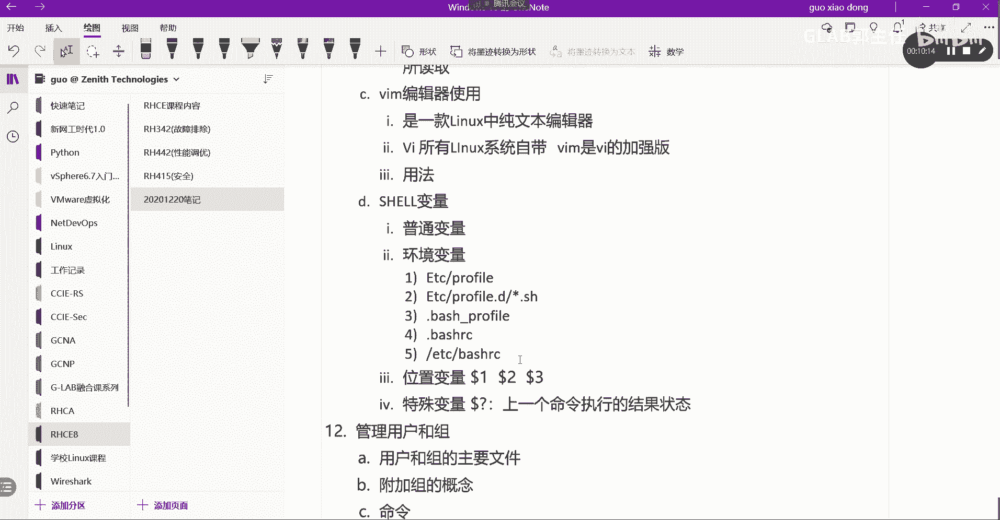

# 【Linux／RHCE／RHCSA】零基础入门Linux／红帽认证！Linux运维工程师的升职加薪宝典！RHCSA+RHCE／10-环境变量 - P1 - GLAB郭主任 - BV1eN4y1U76j

OK那么接下来我们来讲一下这个变量，这不一定是环境变量了，就是我们在LINUX中的s h e shell当中的一个变量啊，这个变量的话我们有几种变量呢，我们差不多给变量定义的话。

我们可能会涉及到普通变量和环境变量，两种变量叫普通变量和环境变量，OK这两个变量呢什么叫普通变量是自定义的，那比如说刚才我在我的环境当中。

是不是自己定义了一个变量啊，还记得吧，我在我的这个环境当中，是不是刚才定义了一个A等于GLAB啊对吧，然后我这里EQ一下，我刚才的变量还在吗，这的吧，所以这个变量就属于我们自己定义的一种，普通变量。

那么环境变量是什么呢，好我们可以通过DEV去看诶，叫ENV啊，不是DEVENV，看一下ENV是我当前的环境变量。

什么叫环境变量呢，举个例子，还记得我在第一节课给大家讲，我自己可以做一个命令吗，我自己是不是可以做一个属于自己的命令，但是有一个前提，那个命令一定要放在B下面吧。

这是不是在这个CD这个B下面一定要在这吧，我要把我的命令都要放在这儿，为什么一定要放在这个目录下面，才可以被系统执行呢，那是因为我的环境变量，也就是说你他系统当中在shell当中，所有执行的这个命令。

它都会自动到你配置的环境变量里面去找，能理解吗啊，也就是你所有的执行命令，都是在系统当中配置了一个变量，OK啊，它都会从变量里面去找，你所配置的执行的这些命令，所以你的这个命令要丢到这个环境变量里面。

还要丢到这个环境变量所指定的目录里面，OK好，那么我们来看系统的环境变量，ENV可以看一下，就这环境变量当中有一个叫past，我们也可以通过ECHO，通过dollar去调用它的环境变量PATH。

这样的话你能看得更清楚，pass环境变量就是我们所有可执行命令的路径，是不是有一个斜杠啊，这个ban是吧，然后呢USR的这些bean这些东西，US2S并都会从这里去找我的命令明白，那大家想想。

如果我不想把我的命令，加在这个环境变量的路径当中，我又想执行这个命令怎么办，对你把你的命令的所在的路径，加到这个环境变量里面来，是不是也可以执行，OK所以这就是环境变量的定义。

OK那接下来我们来看一下这个，这个环境变量环境变量有哪些，常见的环境变量在这里都能看到啊，pass啊share啊，让大家看到环境变量一般都是大写的，一般都是大写的，OK一般都是大写的。

那如果我想修改环境变量怎么改呢。

我们要修改环境变量，通过EXPORT叫export，然后我们改pass p a t h，等于大家看大家能不能看懂啊，等于两个引号，然后TMP冒号dollar p a t h能看懂吗，看不懂看不懂很简单。

我们一步一步看，export是配置环境变量对吧，这个是没有问题的，然后在这里我们重新定义了一个值，这个值付给了pass这个变量吧，也就是在给pass变量重新赋值，对不对。

OK那么把什么东西重新赋给pass呢，把dollar pass是不是又引用了pass的这个变量，pass原先的变量是不是这个值啊对吧，这个值中间是不是都用冒号分开的。

所以你把这个值把前面的这一段贴到这边来，然后把这一整个作为新的变量赋给pass，清楚了吗，这样说不清楚了，我们再看这个时候我们在echo pass，是不是多了一个TEMPL啊。

这一部分内容其实就是这一部分的内容，重新赋值，这里一定要用双引号，不能用单引号啊，讲过啊，OK所以这个就是修改环境变量的方法，我们可以通过export来修改环境变量，OK明白好，其他命令。

其他命令其他就可以，export是修改环境变量的主要命令，其他就有可能修改环境变量的文件了，明白我意思吧，这个重启不生效，所以要重启生效，我们需要修改环境变量的文件，好跟环境变量相关的文件有哪些呢。

来给大家看一下啊，你给他写一下吧，环境变量相关的文件啊，呃由这个叫都在ETC，在在etc的profile profile啊，这是第一个，还有呢大家把大写自动换成小写啊，etc下面的profile点D。

Prefer，点D斜杠下面所有星号就是不管名字叫什么，是以sh结尾的好，还有一个隐藏文件叫BH下横杠profile对吧，这是一个隐藏文件，还有呢再点bash r c这个文件里头，这也是一个隐藏文件。

好不好，还有在etc下的82C这些文件，大家都可以去看一下，很多的变量，环境变量都在做这个文件里面，都是在这些文件里面，不光是环境变量，普通变量也都在这些文件里面，OK好。

那这些文件我们的这个变量的定义，跟这些文件都有直接的关系啊，都有直接的关系，所以大家可以去看一下这些文件，在这里要提到的就是嗯这个这些不同的文件，一般是定义哪些这个这个这个这个变量的。

所有的profile类的，一般都是用来设定环境变量的，所有的profile里啊，一般都是设定环境变量的地方，OK啊所有的bash rc的一般都是设定文件类的，或者本地变量用的，OK这个大家记住啊。

profile类是类似于环境变量的一个一个对象，by12C是我们的本地用户变量的一个对象，OK好，那么我们来大概的看一看。

比如说我们现在vi etc下的profile，P r o f i prefer，这就是我们外部的环境变量，正常情况下，我们去改环境变量的可能性不大对吧，这些环境变量等到后边要用到的时候。

讲的时候再给大家讲啊，简单的在前面做一些简单的测试，做一些临时的变量的调整，就用刚才的EXPORT，通过export这种改变量重启就没有用了，就失效了，明白OK好，这个大家先记住啊，刚开始不要不。

不太适合给大家讲太多的环境变量好，那么我们还有一些其他的特殊的变量，比如说这个本地的变量，像刚才的那个A嘛，A等于GRAB那就是本地变量，明白我意思吧，还有一些位置变量，比如说dollar。

dollar1什么意思啊，多了1echo，多了一，多了一是空的DOTA，二空的DOA3空的多了问号，等于零，la多了，问号等于二七，好奇怪啊，这个好神奇啊，完全不懂是吧，OK好。

这个要说一下啊，嗯我们在后边写代码的时候啊，我们可以通过这尤其是shell脚本的时候，dollar1来代表位置，这叫未知变量，比如说我有两个参数，LS杠，L斜杠，这是三个吧，三个位置吧。

如果我用dollar1代表，我调用的就是第一个参数，LS我用dollar2代表就调用的第二个参数，这个能看到吗，所以现在告诉你的是，dollar加数字一往上的，这叫位置变量，这叫未知变量。

是我们变量当中的另外一种特殊的变量对吧。

除了环境变量变量给大家补充了一个位置，叫位置变量对不对，那么这个从常见的做法是多了一多了，1dollar，2dollar，3K好，还有一个叫特殊变量，特殊变量在这里体现的就到了问号。

到了问号需要给大家讲简单讲的，它表示的是上一个，上一个命令执行的结果状态，记住啊，结果状态和结果不一样啊，上一个命令执行的结果LS输出的结果是什么，那就是什么，对不对。

上一个命令执行结果的状态状态要么两种，要么是成功。

要么不成功，对不对，所以大家会看到刚才我我我给大家敲的时候，你看啊，刚才一口刀了，问号结果是零，就说明执行是成功的吧，然后我随便又敲了一个命令，然后这个命令本身就不存在，它执行结果肯定是不成功的。

所以再去看的话，它就是127看到了吧。

所以这个一般一般跟开发结合的关系比较大，开发需要判断系统有没有执行成功，他不是看结果的，不是看结果输出的，是看结果的状态，听懂了吗，他是看结果的状态，他要根据不同的结果状态来处理它的业务逻辑。

看的不是结果，而是结果的状态明白，所以我们一般通过dollar问号来拉到系统，处理某一些程序的结果状态，哦我听明白了吗，好所有的零都是代表正确执行的，所有的1~255都代表错误执行。

但是不同的错误分一到255种，这个就不给大家详细讲了，我们刚刚看到127，就是一个系统预留的执行错误啊，这给自己定义啊，因为写代码这些东西都可以自己定义啊，开发软件都可以自己定义，OK这个听明白了吗。

好这个明白了以后，我们的环境变量先说到这儿，我们来做一个练习。

翻到140页，这个我给大家演示一下，我们来看一下140页啊，好就是来更改share的环境。

来看看怎么做，我们在首先在哪里啊，在workstation上是吧，在这嗯，通过STUDNTWORK，STATIN到workstation上，我们用lab，Editor shred star。

把这个环境打开，打开完了以后，我们开始到server a上去，做到server a现在就在server，我们退出来，建议大家做，都是按照规范来做，server a不是用root上去的。

用普通用户student上去好，在这里上来了以后，我们开始根据他的要求来做了啊，首先呢我们去改一下环境的变量的一个文件，叫点BHRC，这个我说过吧，VMM加目录下的，它是一个隐藏文件。

是点BHRC编辑一下，它编辑完了之后用VRM编辑，就是用VM的那种方式去编辑它，我们想直接跳到最后一行，按住CTRLG而不是Ctrl shift g，你看shift g直接就把光标调到最后了。

然后再按一个O啊，他就直接帮你新增了一行，明白吧，就这些小技巧，大家在平时要要学会用啊，因为它节省你的这个操作时间，我们在最后一行增加一个塌腰的要求在哪里呢，我们就直接就在最后一行加吧，好不好嗯。

加一个叫，P1PS1等于等于什么单引号对吧，然后中括号中括号先别急着写反斜杠杠U，一会我给你解释这个是什么意思啊，小写的U啊，杠小写的u art，然后呢斜杠H然后空格斜杠T，然后空格斜杠W对吧。

然后中括号，然后再加一个多了，然后再加一个空格好了好，然后保存ESCWQ好，保存好了，保存好了以后，我们来根据他的要求先退出去，要退出去EXIT退出来，然后重新登看啊，有什么不一样，有什么不一样。

告诉我有什么不一样，啊看不到啊，有没有不一样，首先有看原来登进来是这个状态，对不对，原来是哪个用户，at加上我这个主机的主机名对吗，然后直接跟的是我的家目录是吧，一个波浪线啊，江木路就告诉你。

现在在家目录现在呢多了个时间，然后这个时间就是我刚刚写的这个内容，杠U是什么意思啊，user嘛，at杠H是host name嘛，这些是不是都没变呀，然后呢杠T咳咳是不是时间呀，对不对，好杠T是时间。

杠W就是你的家目录嘛啊OKOK好，其他没什么，然后中括号到了，是不是这么个意思啊，各位清楚吗，OK好这个就是改环境变量，它就会导致我这个用户登上来，跟前面看的看上去就不一样了，好登上来以后。

我们来看第二个，第二个要求，他让我干嘛，我们通过file啊，要定义一个本地变量是吧，叫TMP点ZDKZDKEI038083，好定义了一个变量，然后我们通过ECHO，通过dollar去调用这个file。

这个变量看到了吧，这个是本地变量，明白好，然后呢我们LS杠ADOLLAR这个变量，看这个变量本身，是不是看到这个变量本身的一些内容啊，OK没问题啊，然后我们把这个变量删掉。

RM dollar file删掉，然后再els fine没有了吧，OK就是其实在告诉你这个本地变量怎么创建，然后我可以把它删掉，我可以把它删掉，这个没什么问题，大家可以自己做一下。

然后接下来临时改它的环境变量好，ex用的是e x p o RT export对吗，然后EDITEDITOR，也就是editor，这是它环境变量当中的一个变量，这个变量是指定我默认的编辑器。

我默认的编辑器把它改成VIM好吧，然后e c h o dollar，我刚才的EDITOR看到是不是VIM，我可以通过ENV去看一下，看所有的变量，这个是看所有的变量是不是VM吗，你可以把它改成VI。

也可以把它改成VM，听懂我意思吗，好记住，这个是临时改哦，OK这个做完就退出来退出来，然后我们再这边finish finish这些命令，大家一边做一边想啊啊。

其实就是在把我们前面讲的东西做一个演练，所以这个习题当中大家是要练的，这个环境变量的练习是需要大家练的，首先改文件，我们刚刚讲过bash rc改的是用户的一些变量吧。

所以它影响到的只是student登进来看到的，这个登录界面，这个地方不一样的，没有改profile，profile是一个全局的环境变量，到后面会给大家讲好，第二块他还给大家做了一个本地变量。

然后呢本地变量做完以后可以去看，可以去删除，OK第三个他给大家临时修改了一下环境变量，临时修改的啊，环境变量，那么重启之后，这个环境变量就消失了，OK没问题吧。

