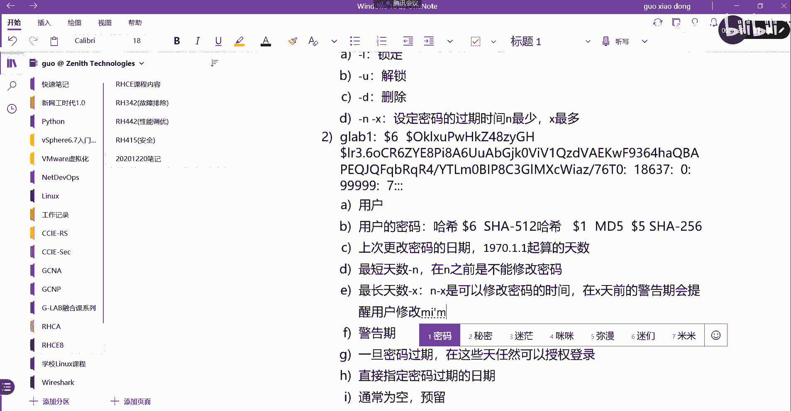

# 【Linux／RHCE／RHCSA】零基础入门Linux／红帽认证！Linux运维工程师的升职加薪宝典！RHCSA+RHCE／11-用户和组 - P1 - GLAB郭主任 - BV1Jz4y1w7xG

傻啥啥声点点点。啊。嗯嗯。OK第三天我们差不多6个内容，我们先向第一个第一个用户啊。呃，管理本地的组合用户操作系统，它是一个多用户的系统。也就是说你可以在操作系统上创建很多个用户啊。

而且也可以分很多个组，把用户放到组里面来设定每一个用户来登录操作系统呃的一些权限，对吧？那么这个大家应该都了解的。所以我们先把用户和组的一些概念，简单的了解一下，用户的账户是用于可以运行命令啊。

不同的人员程序之间提供安全的界限。就是呃你这个用户在电脑上所操作的东西跟另外一个用户在电脑上操作的东西。其实其实在逻辑上是安全隔离的。所以我们才会在操作系统上去创建不同的用户。

然后给不同的用户去分不同的权限。O所以用户在系统上应该是非常常见的一个技术，那么外部使用用户名区分，然后系统内部是用UID这个应该能理解的，给大家看一下啊。把我们环境打开。😊，说到这个环境。

大家在平时练习有问题的时候，恢复到快照啊，给大家的这个文件里头都是有快照的。右击快照有一个快照一，快照一就是原始快照。你你的环境起不来，出现各种各样的问题，你直接恢复到快照一，然后再去开。

应该就没就没有问题了。好吧，OK。

我们先往后看啊，第二句话意思就是其实用户名其实是在我们呃自己区分的。然后在系统内部区分，它其实不是通过用户名的。它是通过每一个用户都对应1个UID是吧？UID来区分，一会来给大家看一下这个UID啊。

一般都要分配密码的，对吧？那么用来验证合法用户的登录权限。O所以一般会被用户名和密码，然后系统中的每一个进程呢，都作为一个特定的用户去运行的进程也是被用户去所调用的对吧？

然后每一个文件都有一个特定用户作为所有者，所以第四句说明了用户在系统当中使用的一个方式啊，用户是以什么样的方式在系统当中去使用的。第一个进程它是按照用户来调用的，然后每一个文件也都有一个用户的所有者。

就这个意思。然后文件的所有控制啊，有助于实施安全的系统访问策略，这个应该一看就明白。第六个大家知道，用户可以分为三种类型，一种是超级用户，就是我们所说的系统管理员叫root。第二个叫系统用户。

系统用户一般不是用来登录的，它是用来给系统的某些进程之间相互通讯的。然后最后一个就是我们常见的普通用户，我来给大家看一眼。mh。

OK好，登上来了。这是我们放。然后我们通过ID就能够看到现在我是用什么样的用户登进来的ID是看我当前登上录上来的用户是什么用户啊。好，首先这个用户叫用户名，对吧？这个叫用户名。

然后系统区分这个用户是通过UID来区分的。UID我这个用户的UID就是1000。就是1000okK好，然后呢嗯这里所说用户分三种类型，一种叫超级用户、系统用户和普通用户。我们在哪里看呢？

我们可以通过ca ETC下的password去看一下这个系统当前的所有用户。这就是系统当前的所有用户。在这个当中啊呃像这种叫普通用户。root排在最上面的root就是超级管理员，超级管理员只有一个。

然后像这些用户啊，这些用户就是系统用户。OK叫系统用户。那么系统用户一般不是用来给我们的用户做登录的，所以他的所有的登录的叫no login。像这些叫系统用户，明白意思吗？它的作用是什么呢？

那么就是给某些进程和服务来使用的。不是用来对外部登录的。所以跟我们常接触到的用户就两种，一种就是管理员，一种就是普通用户。OK好，然后上面有说啊，我们的普通用户呃。

或者说系统管理员用户在调用读取一个文件的时候，他其实都是跟用户相关的。大家可以看。这个文件就属于这个用户，这个叫用户组。所以系统当中的任何一个文件能不能被访问，取决于这个文件有没有给这个用户分配权限。

或者给这个用户所在的组分配权限。明白，所以读取系统当中的任何文件资源都是跟用户对接的。好，就是上面所说的超级管理员用户啊，我们看一下超级管理员用户，他的UID是0。在这儿所以说这个。他UID是0啊。

超级管理员用户。然后呢，管理系统对系统有完全的访问权限啊，系统用户提供服务进程使用，相互隔离，不受影响啊，无法使用交互式的方式来进行登录。这个我刚刚讲的普通用户是对系统有有限的访问权限，记住是有限的。

有限的访问权限啊。OK好，后面会给大家详细讲权限。然后我们来看。😊，这跟大家看过了啊，这跟大家跟大家看过了，就是去看一个文件，它的这个所属的用户。然后我们也可以看进程啊，我们也可以看进程。

比如说PS。🤧个AU可以看到每一个进程上面都会有对应的用户，都会有对应的用户啊，对吧？这个用户这个用户，所以进程也作为一个系统资源，它也是被用户所关联的，也是被用户所关联的。OK好。

然后呢接下来我们来给大家来介绍一下password就用户对应的那几个字段。刚才还记得cat ETC的password。

有这么一串东西，这么一串东西它代表什么意思呢？OK第一个代表的是我的用户名。对吧我的用户名第二个冒号分隔开的。第二个，这个代表的应该是。用户的密码曾经呃是就是存储的密码，他这里不是存密码的地方。

他这里把密码当成X来存储的。所以第二个字段应该是密码，但是被它隐藏掉了。OK但是密码放在哪呢？密码放在另外一个文件里头叫ETC的shad。呃，shadow对吧？在这里在这里哦，他没有权限，对吧？

这个用户是没有权限去查看这个比较核心的文件的这个密码的OK所以我们登到我们开一个环境吧，我们开一个环境登到servA上去。

2HT杠。cleear cause把零清掉。好，RHT杠set。cos2H124。嗯。对，就是X。其实真正它体现的地方不是在这个地方存密码的，他会把用户的第二个字段，这个就这个第二个字段就永远打X。

它这个地方只是一个标记，只是一个X标记，但是密码会存在另外一个文件里面。二都是对对，都是固定的。OK稍等啊。🤧嗯。等一下啊。🤧有点慢啊。我们来看啊，它启动的有点慢，我们来看这个。给他贴出来好不好？

整理一下笔记。好，我们来把这个给大家整理一下啊。🤧嗯嗯。第一个字段我们把它叫做用户名，对吧？这叫用户名。第二个字段叫密码，叫密码。OK这个密码永远是X，因为存放密码的地方不在这个文件里面。

在另外一个文件在。另外一个文件里面，这个文件叫做ETC。EGC前面要写写这个完全路径啊。ETC下的shaow SHADOHADOW在这个文件里头OK好，第三个字段，大家看第三个字段，这个地方啊。

25、25、25这个字段是什么？第三个字段我们把它叫做用户的UID这就是系统识别不同用户的唯一标识。系统。识别。系统识别用户的。唯一标识。这个没问题吧。OK那么第四个呢，第四个这里也有一个也有1个25。

这个不叫UID这个叫GIDGID就是用户的主的唯一标识。😊，系统识别用户组的唯一标识。🤧这个应该大家能理解吧。okKO第五个呢。😊，第五个地方是用户的真实姓名。用户的。Zhenshi。😔，真实。啊。

真实姓名什么意思呢？其实就是描述。其实就是一个描述。一般我们在创建用户的时候啊，你要描述一下这个用户是什么，其实就是备注啊，对吧？其实就是备注，你可以把它理解为这个地方就是备注，但是就这个地方对吧？

如果不去写，那么这个地方的名字就等于你的用户名。明白我意思吗？这里要注记清记清楚啊，这个只是一个description。然后这个只是才是他的真实的名字，登录的时候用的是这个名字登录的。OK好。

只是一个描述。然后呢，后边where named啊，后面有一个叫w named，什么意思啊？这个应该是用户的。主目录或者叫用户的加目录。用户的将目录，也就是说，用户在登录系统的时候。登录系统的时候。

对吧？直接进到的目录。你只要通过验证，直接进入到了一个加目录，那么这个加目录就在这个地方体现。很明显，我们的这个用户，他的加目录不是像我们通常所理解的home下面，因为这个用户是一个系统用户。

明白是某一个进程的系统用户。所以你会发现这个其实没有加目录，他用的是word上面的一个目录。OK好，最后一个呢。最后一个，第七个是该用户默认的吸尔程序。是用户啊默认的SHELhe程序，对吧？

也就是说登进去以后啊，你能够调用系统用户用所用到的这个heear的类型。那我们常用的heear有白he尔。啊，后边大家如果有机会学到什么C系尔。对吧还有K西尔。也就是不管什么谢儿。

它都属于我们在第一天讲操作系统的时候，套在外边的一个壳儿。有这个谢尔存在，你才能够对系统的一些呃资源发出谢尔的指令来对他进行调用，能听懂吗？谢尔是人和操作系统的一个交互接口。上次讲过了吧。

所以不管是什么样的谢尔。它都属于你调用系统的唯一接口。所以有些用户啊在登录进来的时候，它是不具备任何交互式的希尔的。因为像这种就不具备，它不是具备交互式的希尔，因为它是系统用户，它不需要交互。

像我们普通用户给大家看一下，我们的普通用户应该开好了。看上面啊，有一个这个就是我们的普通用户。这个普通用户用到的就是并下的白鞋儿。听懂这意思吗？OK那么刚才看到的这个用户。

他就是不具备任何交互式的希尔界面，因为它是系统用户，好不好？来，我们把环境开一下啊，RHT。杠VMCT2。St。CLASSROM先把classroom打开，然后再把所有打开。好，等它开机。

我们继续往后看。这六这每一个字段是大家必须要了解的，能听明白，总共7个吧，12345677个字段分别代表什么意思？

好吧，OK好，那么接下来我们等系统开完了，我们来创建一些用户来给大家简单的操作一下。等他开好啊。命令演示啊。先给大家整理出来吧，命令的演示啊，这个创建用户我们用到的是user IDDD。

user IDDOK那么创建组呢很明显要。骨ru培DD。这一看就能看得懂他在他是在干嘛，能看懂吗？Uer IDD和group ADOK好，它有一些option的选项。

比如说我Uer IDD杠U的时候代表的是。指定UID。几个选项，重要的选项我给他整理出来啊。指定。Uidi。OK好，杠G呢。😊，要说吗？指定GID。对不对？OK好，杠C呢？😊，C这个叫指定注释。

注释就是刚才那个这个地方，是不是刚刚有说有description？对不对？所以注释这个叫直径注释啊。OK好，继续杠D呢。指定。佳目录。加目录默认不指定的话，创建的普通用户都在home下面。

那么怎么去指定这些普特殊的系统用户的加目录是通过杠D去指定特定的加目录的杠DOK好，杠S呢？指定。Xie。登录的登陆式的希尔明白意思吗？OKOK好，继续。那么呃。如果你创建的是一个特殊的用户。

那么你要用杠大M去指定他不去创建加目录。不创建。这行目录啊，因为这样的用户。这样的用户可能是系统。叫叫进程用户或者叫系统用户，就写系统用户吧。是某一个应用程序用的，你要创建一个属于某一个特殊的应用程序。

用的这样的一个用户，你要加一个杠大M。那么在创建这个用户的时候，他就不会去自动创建加目录。OK再通过杠D去指定这个用户所在的目录就可以了。好，我看有没有起来。

起来了起来之后，我们登到我们复制几个，我们登到serverA上啊。就用这个吧。SSH我们通过root用户啊登到。Sorry。

你好。

应该还在启动啊。然后怎么看他的这个系统正在启动呢？我们要进到他的ccil的话，只能登到这个这个里面来。我看啊。

在这儿给大家演示一下，因为到后面还是需要大家。要看这个系统起机状态的。嗯嗯。这里有1个RHT杠VMV这个命令，然后通过view这个命令去看server，这个时候它会跳出来一个cl界面的对话框，看到了吧？

这个是server A这个系统的cl界面，就跟你插个键盘显示器。

对吧看到的系统体积的完整构程就在这里。OK好，看先明显他现在没起来嘛。😊，正在启动他的网络管理的脚本。稍等一下。很明显没起来。因为这边没起来，所以我在外边是是进不去的。

所以我在这儿，你通过SSH，他告诉你进不去。好，明白。好，好了好，登进来了，登进来了，那就到这个界面了。😊。

我们把它去掉。把它关掉是吧。这个吗？view这个看一下啊。所以大家在练习的时候，你发现登不上去，不要着急，先看看你的里边机器是不是起来了。RT杠VM view啊，sorry。还有一个命令叫VR。

TVRT。VRT杠。嗯，对这个。VRIT杠manage这个命令打开之后，它会弹出一个所有的虚拟机啊，这个对话框。然后呢你可以点serv A，比如说servverA对吧？servA双击一下。

就出来了吗？

所以等大家最后做模拟练习的时候，我会做成跟考场差不多的。考场管理虚拟机不是这么管理的。上管理这个虚拟机不是通过vio去管理的。它在桌面有一个有一个图标，小红帽的图标应该在这个地方有一个图标。

那么打开这个图标就会弹出这个对话框，就是所有的虚拟机的管理界面。然后呢，你要管理那个什么虚拟机，都是图形化管理的，而不是命令管理的。所以大家先先跟大家说一下，我们最后的两天是做模拟练习。

是做模拟练习。这所有的课啊差不多10天左右，按照计划来上的话，应该是10天，10天上完上完之后呢，然后我们还有一个云平台在这里跟他家说一下我们学习过程啊。

所以大家从这个过程当中应该知道我们应该怎么去准备这个通过这个考试啊。说一下好不好？是这样子的，我们所有的课程计划分为三个阶段。第一个阶段就是我们现在给大家上课，差不多全天10天。然后大家做作业啊。

我给大家布置作业，大家回去一定要做。然后呢，我们在310天当中会有两呃三个半天。三个半天是用来现场考试的。这个考试虽然虽然是考试啊，但是答案都有，就是每个人都要全部全部按照答案敲一遍。

就是我们教材上的有一些重要的考试。我给大家整理一下，告诉他会花三个半天左右去考考试啊。好，都在10天里面。第二个阶段是我们的在云平台上。我们有一个云平台，我会把我们考题。

就是分RHCSA的考题和RHCE的考题。这两个考题，我会每一题详细的给大家讲好，把视频录好啊，这个就大家就不用来现场了。我会在下面下下来花时间录，把时间把所有的题都录好，放在云平台上，然后呢。

云平台上它是有一个有一个记录的，也有这个也有这个解锁模式的。就是你看完第一个视频，你才能看第二个视频。所以所有的人必须在云平台上在我规定的时间之内全部把视频，每一题都看一遍。明白，多看一遍。

那这个时间你就可以自由了，在家里抽时间看，因为手机也是可以看的。所以很方便，所以不需要大家来现场，但是一定要看，因为考试就考这40个题。总共40个RGCSA20个RGCE20个。对，差不多就是题库。

就是题目。呃，不要认为我把题都给到你，你就一定能过。不是的，这是一个操作的题。所以CSI还好，比较简单。有大家都是工作的工作的人其实来做这个事情。CSI应该都不会挂，因为比较简单，CE是比较难的。

CEport的题库如果不不好好敲，不好好整理的话，你时间可能都来不及。他考4个小时。4个小时第一遍都不一定来得及。不考CSA不能考CE。你想啥呢？所以一定要考CSS才能考CE好吧。

所以这一部分的内容是这个时间是多少，取决于你的基础，还有取决于你是不是认真在整理，再看在做。好吧，然后呢，也也会把练习环境都线下的考给你们。你们对照着我的题自己要练，自己要练。好。

第三个阶段就是考前模拟。这个模拟考试就跟我们考试是一样的。我会我我会跟把我的这个练习环境做的跟考场的环境是差不多的，应该是95%相似了。做成95%相似。这个模拟考试有两次。有两次都必须来现场。

因为我们这个考试本来就是要来现场考试的。对吧所以最后的两天，不管是谁远程的不行，一定要来现场。然后我用我的电脑，我这边不是有很多电脑吗？用我的电脑，我给你把环境不好。

然后你到这边来用我的电脑做做完了以后有一个批量的检查的命令。你只要交完了点提交，你就能看到结果了。明白，所以去检验大家平时第二阶段在家里练的过程是怎样子的啊，就两次考试，就两次模拟考。好吧。

然后最后参加考试，还有一天还有一天，最后一天是参加考试。所以按照三个结论下来，我希望应该通过率至少要95%以上吧。基本上现在CE红帽的考试啊，其实比以前难了，它的通过率要比之前要低啊。

我每次考下来还有很多要挂的，就是我把题都给你了，然后认为很简单，其实没那么简单。要花时间的好吧，所以呢大概就这三个阶段，明白了吗？各位我们大概会在几月几。应该要到年后了，因为这个课啊10天上完。

年前估计上到第六天还是第七天，第六天或者第七天，所以年后还有3天左右，三四天左右啊，应该到年后过来了。23月份吧，3月份左右3月份左右，3月份应该是可以的，到时候看好吧。还有啥问题？关于整个学习的过程。

线上的同学考试的同学，最后两天模拟考一定要来现场啊，因为呃就是用现场的机器考试的。好吧。好，说到这儿，那么我们就继续啊。继续。

好，登上来了。登上来了，我们先给大家创建一下啊。首先。我们看一下我们刚才的所分的那几个。说的那个catETC。ETC下的pasword这几个字段。那么普通用户啊这些都属于普通用户。像这个。

对吧来再过一遍，这个是用户是通过用户啊，这个是用户，这个是密码，所有的用户的密码都是X这个是UIDUID用什么选项，用杠U来改，对不对？那你可以不加杠U，它会默认帮你配1个UID明白我意思吗？

你可以用UID去指定这个是GID没问题，这个是描述，这个是描述，通过杠C来改杠C是不是杠C指定注示，然后这个是加目录，加目录默认不改，它会在home上面帮你自动创建一个跟用户名一样的目录作为它的加目录。

那可以通过杠D去修改它的加目录，然后这个地方是登录式的尔，这个是通过杠小S来改的，对不对？杠小S来指定它的这个登录的。我刚刚讲过有很多种白尔尔，对不对？那么这些尔都是可以通过杠S来指定的。

并且这种no log也是通过杠S来指定的。OK那么还有个大M不不怎么常用，就是创建系统用户的时候，我不让它自动创建加目录。好，来，我们开始创建user。AD假设说我们创建1个GABGla一好。

直接就这样创建可以吗？当然可以不加任何选项，直接创建用户是完全可以的。那么我们可以通过catETC下的password去看一下gla已经创建成功。

所以它是从1000开始帮你往后加来自动生成它的UID包括GID看懂了吧？然后呢，加目录也不是我创的，对不对？它自动会在home下面创建一个跟用户名一模一样的目录作为它的加目录，这个是自动创建的。

能理解我意思吗？OK然后这个也是的，默认不创建，它也会帮你分配一个用白希尔登录的一个交互式的希尔。OK那么密码还是X，那么注释因为没有做，它自动不会帮你创建，所以注释这边是空的。看懂吧。

就是这边是空的OK那接下来我们来通过创建啊。user ADDGla2，我们通过杠U去指定它的UID1234，对不对？OK我们通过杠G去指定它的GID1234可以吧？好，我们通过杠杠呃C去加一下它的注释。

他的注释我们写一个叫。this is test，我们通过杠C去指定它的注释。好，再通过杠D可以去指定它的加目录。去指定它的加目录。OK好，它的加目录呢我们可以在home下面啊。

我们就直接指定home下面或者指定一个其他的吧。我看能不能指定到其他的t下面。O。好，然后呢呃我通过杠S去指定它的登录式的he，我们用SB下面的no login。No， L， O， L O G。

 I M。哦，这个是哦GID没有存在，他没有创建啊，这个要呃GGID先不创建，我们先这样做。verniehome director already啊以刚才那句话敲上已经存在了CD。home下面。哎。

我创建的是什么？7220是吧。这俩班应该不存在呀。我看看啊。先把杠D去掉。哦。已经存在了ID。G来82，我们来看一下结果。刚才已经有了吧，对吧？已经创建成功了。

然后我艾caETC下的password再看一下。有了看啊密码UIDGID，这个是他的描述吧，这个是他的加木路吧探盼，是不是这个是我指定的no log应该已经创建成功了啊，刚才已经OK了，明白意思吗？

之前报的是看啊，这个我我第一次敲的是。是哪个我看看。第一次。诶。在这儿啊不是这个。哪个。这个是吧。第一次报的是这个这个他说的是主1234不存在。因为他的这个组组还没有做，因为你创建这个用户的时候。

它会自动生成一个跟用户名一样的组名。所以你在创建用户的时候，他其实没有组的，只有创建成功了，他才会有组。所以这个报错啊，应该是组的问题。所以到这儿应该是创建好了，后边的都都都都不用看。

这边应该是OK的啊。一般情况下，我们是不需要去指定组，因为你只要去改了它的UID它的主ID也是一样的，跟组是一样的，跟那个UID是一样的。OK所以这个这个可以去掉，这个可以不用不用写，好吧。

所以现在应该都创建好了，所以把几个选项都用上了。OK把几个选项应该都用上了，就这个。可以把GID去掉啊，可以把GID去掉。OK那么这个是在创建的时候，我们可以直接通过选项来改它。那么用户创建完了。

现在有密码吗？应该没有，对不对？所以我们接下来创建用户之外，我们还要给我们的用户去设定。

设定密码设定密码用什么呢？就要用password，然后给主设定密码，用Gpassword。主到后面还会给大家讲啊。好，那么这里也有几个选项，设定密码的时候啊，我们呃默认情况下是用户是没有配密码的。

需要用password去设定密码。所以默认。用户是没有密码的对吧？没有密码。需要需要用这个password的配置密码。password配置。密码OK那它有一些选项啊。它有一些选项，第一个选项杠L。

是什么意思啊？锁定。我可以锁定密码，然后呢。杠有。代表的是解锁。OK杠D我可以删除密码。好，OK还有呢杠N是密码设定密码的过期时间。ok密码。呃，密码的过期时间应该是杠N和杠X这两个。怎么说呢？

杠恩是设定它的最少的时间。最少，然后X是最多。就最少多少天最多多少天就不能用了，最少多少天就要提示你要要开始要要要要要改密码了。然后到了X天之后，那它就不能再用了，就是设定它密码的有效期范围OK。好。

那么我们来演示一下设定密码。

嗯。在这里呢我们的我们创建的g labb一应该是没有密码的。我们通过password。G21来设定密码，密码我们都用red hat redd hat。好了，现在有密码了吧。好，有了密码之后啊。

这个密码应该被放在哪里？刚才说了ETC的shadow吧，你看ETC shadowETC shadow也是我们需要就这一串这一串这一串里头需要我们把每一个字段也得搞清楚。

我把它复制过来。能把它复制过来。这里边也有一串东西啊。好，这一串东西大家。看有几个段啊，第一个段是吧？然后呢，这一串是这是第几个段，它是用do勒哆勒夫分的啊，第二个段。把它分开点。第一个段第二个段哦。

这不这是一个段，用冒号分的，不好意思，它是用的是冒号分的。第二个段在这儿第三个段。第四个段儿。第五段。第六个段挺多的，来，我们写一下啊。它的每一个段儿代表是什么？OK好。

我们来看密码密码的它每一个段代表的是什么？稍等啊。好，第一个我来看第一个，第一个是用户吧。对不对？第一个是用户，没什么问题啊。第二个呢是用户的密码。这个密码它是经过什么东西来加密的。

它是经过它是只经过加密的啊，经过加密的密码，它是加了密的。所以你看不到说我配的re hat，你是看不到read hat的。它是加密的。所以说你你这个是需要解密才能看到。好，接下来第三个第三个到哪儿了？

这加密很长啊，第三个到这儿了。到到这儿了，这一串数字代表啥意思啊？这一串数字代表上上次。他是以这个1970年的1月1号来算的这个天数。呃，叫上次更改。密码的。日期什么是以1970年的1月1号。

1970的1月1号起来算的天数。OK这啥意思啊？就上次更改密码的日期是以1970年开始往前算的，是多少天？1970年到现在。

因为这个uder password是不是我刚刚创建的这个user password，对吧？所以它会以1970年1月1号到我刚刚去改去改这个密码算是多少天。哎。

大家想想为什么要有1个1970天为参照的对象来算天数啊？在系统里面，其实有很多是以这个1970年1月1号来作为参照物的。来作为参照的时间点来来有一个具体的时间。你想啊它有一个具体的。

也就所有的它有很多的这个应用也好，或者说算密码。在这里你可以把它改密码当成一个应用。他作为他以1970年作为参照对象，就会有一个相对时间，对吧？就会有一个相相对时间。那么相对时间有了。

我们可以根据这个相对时间来做其他的进一步的操作。如果没有一个参照物的话，我们就很难去界定哪个时间在前，哪个时间在后。就每一个系统都有自己的时间，能听懂这意思吗？

OK所以他会以1970年的1月1号作为一个参照对象，然后会算出一个参照时间。然后根据参照时间来做进一步的后面的操作。比如说应用程序可能会根据这个相对时间来进行下一步的逻辑处理。好。

或者说进程会根据这个相对时间来做下一步的逻辑处理，都是根据相对时间来做的，都是根据这个时间来做参照物的。OK好，第四个呢。😊，第四个是哪个？是这个零代表是。是吧用户上次更改密码以来，对吧？

到可以再次更改之前必须进过的最短天数。就是最短天数。对吧最短天数0啊可以使用0天，最大呢999，这个就是最大天数了。在密码过期之前，它不进行密码更改，可以经过的最长天数，对吧？

所以我们刚才的参数里头杠N是改的这个杠X是改的这个。能看到吧？杠N是改的这个杠X是改的这个最大的天数和最小的天数。ok。好，然后然后呢后面有个七是什么意思啊？警告器。警告期限警告期代表的是7天。

就当用户啊在在这个截止日期之前登录达到的该天数的时候，会收到有关密码过期的告警。对吧7天会有一个告警期数啊，告警。好，然后呢，后边的789后边的789。后边的789后边的789代表的是它这里都是空的啊。

78。9应该这里是空的啊。嗯，几个冒号啊，我是不是落了三个冒号？123哦，对的，是啊，后边还有一个啊789，我们来看看。呃，在这里都是空的，那么7897代表的是什么？非活动器。就是。一旦密码。

Guoqi。一旦密码过期，在这些天仍可以授权登录。这个一般不做。过期了啊，他还能登录的一个授权天数。这是第第后边这个，然后第八个字段就是密码过期的日期可以直接指定。直接去指定。密码过期的日期。

是吧直接可以指定啊，然后参照对象还是1970年的1月1号来去指定他在哪一天直接过期。好吧，好，最后一个通常为空啊，预留给未来使用的。预留。好，就这么几个。这几个字段啊。😊，后边的几个大家可以不用了解。

那么这几个应该是需要知道的。好吧，这几个是需要知道的。O。明白。嗯，那么在。加密的这个部分，我们给大家简单的介绍一下。因为我们的有有一些有一些不一样的地方。比如说啊这里你有看到刀了6是吧？

多了6代表的是哈希，用的是SHA杠512。的哈希算法。用的是512的哈希呃，那么还有可能会出现哆了一。大家有可能会出现哆勒伊，哆勒一表示用的是MD5的哈西。OK那么五表示的是256的哈西。

还有可能会出现多了5。多罗5是表示用的是SHA杠256的哈西。256的哈希这个稍微区分一下，就这个地方不一样啊，后边是哈希，所以这个地方写加密是不对的。应该是哈西。所以哈希和加密还是有区别的。

是吧知道哈西和现在加密的区别是什么吗？嗯。准确一点讲，应该是哈希，不是加密啊。加密的话是你有加密就会一定会有解密，对不对？也就是它是可以逆的。你有加密，我拿着东西拿着钥匙去解密，就就出现密码了。

哈希不是的，哈希是不可逆推的，你是不可能拿着这个哈希值去逆推到你的密码是什么。能听懂吗？各位。所以这不一样的哈，这个安全里头一定要区分这两个很重要的概念。哈希和加密是不一样的。好。

那么这个是密码这一块的几个字段，需要大家了解的清楚了吗？各位。清楚了啊。好，清楚了之后，那么我们来给大家简单的修改一下密码。嗯嗯。

来。好，我们需要给G代一去修改它的密码。我们先先看一下啊，我们来登一个登一个。诉诉一会讲啊，切到。gla一用户啊切进来了，对不对？好，这个是数切过来切测试一下这个用户能不能登。

大家会发现Uroot用户登到gla一有没有让我输密码呀？没有，所以root用户切到任何用户下面是去是不需要输密码的。明白意思不？OK不需要输密码。呃，然后我们退出来，我们来改一下我们password。

杠L。锁定这个G21。是不是锁定了，对吧？锁定了之后，我再输进去去 level一是不是进不去，哎，锁定了。哦，这个用户。还能进来看啊locking password for user password。

那是因为什么？管理员是不需要任何密码就可以进的。所以你就算锁定了，他还是可以进到G量一里面去的。就这样测不对，我还再建一个。Uer AD。G录3。然后给他配一个密码password。

我们用另外一种方式来配密码eco。red hat还记得这个吗？对吧然后password。去改glib3对吧？杠杠STDIN。好，改完了，然后改完了以后，我们Glib已经被锁定了。

我们切到Glib三里面去。通过Gla3再切到Gla一里面去。这个时候。really hat。登进去，他会告诉你已经被锁定了。验证不通过，密码是输对的，能看懂吗？各位，所以锁定啊，它不是说登不上。

说不是说提示这个用户不存在。它锁定的概念就是你password输进去之后啊，它是不对的，它会提示你验证失败。听懂了吗？这叫锁定OK好，然后呢我们退出来退出来。退出来。

然后我们在这里通过password解锁，解锁用杠U。gla一给它解锁，解锁完了，我们再来测一下，登到glib3里面去，再登到glib一里面去。这个时候我们再输readd hat是不是进来了？

OK就就是这个概念，大家能看懂吗？看懂啊。好，退出是cttrorl D啊，快捷键，所以锁定和解锁，这跟我们管理用户是一样的。然后删除密码呢，我们删除密码。删除密码password杠D。Gle一。

删除密码了，对吧？然后呢，删除了密码，我们直接通过管理员账户切换到Gle一里面去，还是可以的。因为它本身就不需要任何密码，我们还得通过其他的另一个普通用户切到这个普通用户里面去。

这时候他会不需要密码就进来了。是吧不需要密码就进来，它删除密码不代表没有密，不代表不能登，它是没有密码就可以进，能听懂吗？OK这个要看清楚啊，这几个特点啊，不要认为删除密码它就登不上了啊。

只是删除了密码。好，那么接下来我们来改一下它的密码的最少有效期和最大有效期。好，我们来看一下gla3吧，怎么改呢？通过password对吧？去改glab3。好，在没改之前。

我们先看一眼密码是在ETZ下的shadow。下面我们过滤一下group up G3，这样看的少一点。是不是看啊。这个地方不用看密码这么一串也不用看，主要是这个地方，那是不是一个最大值和最小值啊，对不对？

那我们来改一下，通过password。G3杠N，我们把它改成10杠X，我们把它改成20。是吧好，然后再去看一眼。是不是四和20？是不是哎N和X改的就是这个这这个字段，就这三个是需要大家知道的啊。

就是在最少的有最少的密码，最少是10天，20天就要过期了。然后呢，在过期之前提前7天给你提醒。好，这个提前7天是在十的提前7天还是20的提前7天？应该是20的提前7天，明白意思吗？20的提前7天啊。

那这个十设的有什么用啊？你接设个20不就完了吗？

啊，知道吗？就是这个最短的天数和最长的天数是个啥意思啊？

嗯，最短的天数。和最长的天数。你知道吗？最短什么叫最短10天，最长10天，最长20天，7天提前告警。这个在时间。当然不是你设了密码，你肯定得有密码验证才能登啊。😊，对不对？O。

什么意思啊？再把我们其实这里再看，这里可以再详细的说一下最短天数和最长天数啊，我们可以把它写的再具体一点。他的最短和最长说的是什么意思？这个叫。

就是自用户啊上次更改密码以来到可以再次更改之前必须经过的天数。我再念一遍，大家是看一下啊。叫自用户上次更改密码以来到可以再次更改。之前必须经历的最短天数。清楚了吗？啊。

所以这个最短天数其实就是在这个N天啊，在N天之前是不能修改密码的。是不是啊？不是不需要密码，是不能修改密码，这个就是最短天数的一个。一个说明听懂了吧？OK然后最长天数就是到了这个X天。

你就一定要修改密码了。对不对？你在你在N天到X天。4、可以修改密码的日期。是可以修改密码的时间，明白吗？OK然后在。X天的钱在X天。前面的警告期。就是下面的一个字段。警告期。

对吧在X填的填前的这个警告器时间会提醒用户。修改密码。

能能把这三个时间搞清楚吗？各位可以了吧啊，就是这个时间天之前是不能改密码的。然后这个时间和这个时间段之间是可以改密码的。在这个时间前的7天是要提醒用户修改密码。清楚了，就这个意思OK所以其他没啥。

这个这个字段就就就这点东西啊，就这点东西。嗯。清楚了啊。

OK好，那么我们接着往下看创建用户修改密码，这些都说完了啊，创建用户修改密码这些都说完了。说完了以后，接下来我们来删除用户。删除用户我应该用。Useer delete。删除组。

Group delight。啊，这都是对对应起来记的啊，所以没什么好难的，我们删除用户和删除组，好吧？删除用户和删除组。好，来，我们给大家演示一下。

这个很简单。我们来在这里我们看你看一下有三个用户吧呃，cat ETC下的password，我们过滤一下。过滤一下。group up记 lab本，我们看一下有几个三个，对不对？

我现在通过user来看一眼啊。user delete删除GRAABE。删掉了，然后我们再来看一眼是不是基量边一删掉了。直接user delete删掉，某一个用户就删掉了，明白吗？但这时候会有一个问题。

什么问题呢？用户是删掉了，但是。我们到他原来的加目录下面去看一下。因为创建用户自动创建的加目录有没有被删掉？有没有被删掉？没有没有被删掉，这个没有被删掉。好，这个问题我先给你描述一下。

问题。在删除用户的时候。呃，焦木路。不会被。同时。删除。对吧那么会带来什么问题？大家想想会带来什么问题，这就是一个问题现，这就是现象。但是它会带来什么问题。

你想啊将目录不会被充时删除，也就这个目录它还存在。但是这个目录所所属的用户是不是被删掉了？那么这个时候这边应该原来是Gla一的，但是Gla一这个用户已经被我删掉了，他把这里改成了什么？

原来这里应该是G21，现在改成了10011001是什么？1001是什么？是不是原来用户的UID啊？对不对？原来用户的UID那如果我再创建一个叫RHCEE。他会系统会给他没有指定UID的时候啊。

系统会给他指定没有就是还有的这个UID他会指定1001。所以他就会认为这个文件。RHCEE是有权限访问的。因为他就默认1001，不管是什么，只要是1001UID系统区分用户是通过UID区分的吧。对不对？

他只会认为1001的user是有权限访问我原来的Gle1这个加目录的。听得懂吗？这个意思。

明白，所以这个问题我给你描述一下，就是它不会被把加目录同时删除，但是会有一个什么问题呢？加目录还是属于这个之前的。UID。就像我们这个例子当中就是1001，对吧？那再次创建用户的时候。

再次创建用户的时候啊，系统。可能。指定。1001给。给什么其他用户。那么。那么对吧其他用户这个指定的其他的用户啊，就对。这个目录具有。完全所有权。这个能看懂吗？

就会出现权限的错乱或者权限的这个这个就是不是管理员能控制的权限的错误。明白吧？所以怎么解决这个问题啊？😊，解决。解决这个问题有两种解决方法。第一种。就是在删除用户的时候，有没有一个选项，顺便。顺便把。

嘉目录。将目录也删掉，大家不要图爽。很多人这个参数不加的这第一个解决方案。第二个解决方案呢？在。创建。用户的时候。要有一个习惯，手动去。Z定。用户的UID。这样是不是不会错啊？

我每一个用户都有自己规划好的唯一的UID我我自己在创建的时候，我就从1001往后排嘛，我不让系统手动去指定，明白吗？OK所以我就一个一个往后排哒哒的，那肯定不会乱，明白不？好。

所以第一个解决方案用到的选项是杠R。我们可以通过杠R的选项来把。呃，姜目录直接删掉来，我们试一下。

我们这个地方还有谁有胶木录啊？好，G里边3有胶目录，我们可以来创建一下啊。呃，user delete及哎。鸡贷本。72边3加一个杠R。好，是不是删掉了？让我们看预知23是不是没了。对不对？

然后再看一下用户，用户肯定也也没了吧。看懂了吧？用户也没来，现在只有G282了，能听懂我意思吗？各位。😊，好，这就是删除用户，只要记一个选项。好，另外一种解决方案就是你在创建的时候啊。

user AD在创建的时候，比如说创建还创建gle3，你指定他的UID通过杠U去指定他的UID1235。啊，这样永远不会重重复。OK好，就这样来做。

好，这个叫删除用户。好，继续。创建有了修改密码，有了删除有了，还有什么？修改。我们修改已有的用户，我们如何通过这个方式来去修改已有的用户啊？我们可以通过。User。叫user mode。或者叫。

group mode是一个是修改用户，一个是修改组组还没讲啊。那我把命令都先给大家写上啊。好，这里头有一些选项，修改跟前面创建其实有很多选项是通的。比如说杠U是什么？修改UID吧，它既然可以指定。

它也可以修改，对不对？好，杠G。修改寄押地OK还有杠C。修改注释是吧，对不对？杠S修改谢尔，对不对？OK好，再修改它不光能修改用户的名用户名的一些东西，它还能修改我的密码相关的一些东西。

比如说我可以通过。杠呃杠E。去指定他的用户的过期时间。去用杠E去指定义这个过期时间杠大L去锁定这个用户。类似于禁用。OK好，杠大U是解锁，所以你会发现有些功能其实是一样的。

刚刚用password的这个禁用账户和解锁账户，就解锁定账户和解锁账户是用的小L2和小U吧。现在去修改这个用户用user mode的时候，用的是大L和大U。明白吧？OK就是无所谓了，这些大家看笔记。

后边要用看一下笔记就行了。好，就这几个选项能明白吗？啊，来我们给大家简单的演示一下啊。😊。

比如说这里的G lab2呃，我要修改它的UID我们可以通过user mode杠U。吉来本2杠U2345。改好了，来，我们看一下是不是变成2345了。好，GID也改成2345。😊，GID改成2345。

那再看一下啊，23哎没改完GID。哦，GID修改GID看有时候报个错误。杠G他没没改成功是吧？好。GID是用这个。是Uer。对吧GID用这个啊2345OK明显去操作group相关的。

就应该用group mode啊。2345OK没问题吧。好，然后呢继续我修改一下注释。user modeGla2杠C的哒哒哒的随便打。好，再看一眼。是吧改成三这么多Y了，对不对？好，继续。

然后这个嗯杠S我不演示了啊，杠E啊也不演示了，杠L杠大U我都不演示了。我在这里再给大家补充一个比较重要的，在这里有一个叫。

呃，叫杠。A大G。杠A大G这个叫为用户追加新的附加组。所以补充啊。追加新的。附加组OK好，在这里所以要给大家解释什么叫附加组啊，在我们的组还没讲，这个先放这儿。组还没讲，接下来就会讲主了。

我们刚才一直在讲用户嘛。好，还有一个。杠D。XiaM。好，杠D小M是指定新的项目炉。指定新的胶目录杠M呢，为什么要M啊？杠D是指定加目录，对不对？杠M是移动之前加目录的内容到新的加目录下。

指定新的胶目录，并且。并且会把。之前的。焦木路中的。内容。全部。移动到记清楚啊，这个叫移动啊。移动移动和复制不一样啊，全部移动到新的加目录像。这个能听懂吗？D是指定新的胶木录。

M是把原来的胶目录里边内容全部移过来，杠DM杠DM。清楚了吧？OK好。

呃，杠AG一会儿给大家讲啊杠AG一会儿给大家讲。好，来，我们做一个简单的示范测试一下。我们把DM给大家演示一下。呃，我们来重新创建一个用户鸡랄本。Yia。好，然后呢我们来看一下。Gla一Gla一有了。

然后LLGlib一也存在，然后我们CD到Glib一里面去，我们touch一个文件。え。对不对？好，然后呢呃我们来 touch一个AA这个文件CD点点移动到上级目录LL看一下好吧。好。

来我们CD到g一LL看一下啊，就一个文件啊AA好，那接下来我们来移动这个用户的交目录。通过。user mode对不对？Uer mode Gla1杠DM。好，移动到哪儿呢？home下面。呃。斜杠。

普布齐我看看啊。User mode。GDM。home下面。home下面的。第211。哎，他会有一个什么。我看一下啊。哦，要这样写。港D。这样写。M。Gangdi。Home。下面的gla11杠M。好。

这样写的来，我们试一下。好，看到了吗？好，有有区别啊。Y1。7来份11有了啊。看懂了吧？原来这个是G2一，明白吗？他这样写的啊，他这样写的，他这两个这两个选项不能连在一起写。啊。

杠D先指定指定完了再等会杠M把它切过来。所以你会发现原来Gla一所有的内容都被放到这个Gla11了。那么Gla一就没了吧，因为它是移动啊就切过来了。明白吗？全部切过来，切到这个文件里头来了。OK好。

指定新的加目录，通过杠M把原先的加目录里边内容全部移动到新的加目录里面去。这两个选项不要连在一起写，是分开写的。好吧，OK好，那么这个是用户了，这个是用户。呃，然后呢这个是修改用户啊。

那么我们来修改密码呢。

修改密码，我们可以通过password也可以去用另外的东西。这里做个补充啊，除了修改密码，用password以外，我们这里还可以用另外一个选项叫change。叫CHAGE补充一下，这个是后来补充的啊。

 change制它的选项的作用要比password要要要要多一些。你看password要么就锁定解锁删除，是不是就这几个啊。尤其在处理密码时间的时候，它其实不是很多。

那么 change制它可以处理的时间可能会更多一些，可以可能会更多一些。来吧，我们单独给大家补充CHAGE补充一下 change制相关的选项。比如说杠D杠D是什么呢？最近修最近一次修改时间修改啊。

最近的一次修改时间。最近一次。修改时间可以通过当地来修改。杠大E是用来大E啊，就是来配置过期时间。过期的时间。啊，这些选项大家都要记啊。杠A是设定非活动时间。OK然后杠M是设定最短的使用期限。

杠M其实就是跟刚才的杠N是一样的道理啊。杠M类似于这个这个password杠N。对吧好，这样写就可以了。OK然后呢，杠大M。类似于。password的杠M呃杠X。听个清楚了啊。好，然后杠大大W。

这个是用来修改警告时间，默认不改是不是7天呀？对吧修改警告时间默认是7天，然后杠W啊大WOK好，差不多就会就会可能会设置的会多一些。好，这个修改密码的一些时间啊。这两个跟pass word类似。

主要有一个杠W修改警告时间，这个是可以改的。好，上面三个。杠D其实就是修改那个1970年到现在统计的天数吧。然后呢，杠E配置过期时间什么时间可以这个过期了啊，直接指定啊，直接去指定这个位置。

刚才那个密码呢直接去指定这个位置，过期时间。这这里不是空的吗？后边几个选项是不是有空的？对不对？那直接可以指定过期时间，通过杠杠杠杠EOK。然后杠L是设定非活动时间，什么意思？这个啊用的不是太多。

大家只是记记录一下啊，非活动时间我还不如直接把它禁掉呢，对不对啊，所以杠L啊无所谓。刚要无所谓，做一个补充吧。如果你在工作当中有需要用到的话，你可能会用 change制，对吧？

因为pasword毕竟命令有限。参数选项有限啊。OK清楚了吗？😊，好，那么接下来我们来讲组组组的话作为一个内容的补充吧。其实大部分跟用户接触的会比较多。主的概念我们其实还好主。用户组。好。

先来讨论几个问题，用户主张。五是用户的集合。这一点明白吗？组是用户的集合，也就是我们用户是放在组里边的。对吧，然后呢，这是第一个这是第一句话啊。OK好，主可以向一组用户授予文件访问权限。

而非仅向一个用户，这个就是主式用户的集合啊。然后系统。区分主用的是什么？GID。对不对？好，这一点这是第二句话。OK第三句话，默认系统用这个ETC下的group文件来存储本地组相关的信息。

所以组应该存放在本地的哪个文件里面，组存放在。本地的。ETC下面的有一个叫。GROUP有一个叫group文件中。OK股入文件中。好，第四句话，组也是可以配密码的。组跟。用户一样。也是。可以配置密码。

一般不这么做。一般。不这么做。因为用户是可以配密码的，你给主配密码是啥意思呢？对不对？不需要给主配密码。OK那如果说给主配了密码，主的密码也是存放在一个单独的文件里头。

主存放密码的文件是ETC下的group下面的sow。就是另外一个文件，也是另外一个文件。但是一般这个文件我不给大家介绍，好吧，不要去不要去讨论这个问题。好，那么接下来我们来看组相关的内容，我们存放组。

他说放在哪儿啊？

放在ETZ下的。GROUP放在这儿。这是我们所有的组。它放在放在这个ETC下的group里面。好，明白。好了，那么这里头我们有一个要跟大家讲的这个。

其实我们默认没有创建组，其实默认组是可以生形成的。比如说像G量8一G腊82，这个组都是自动形成的吧。

所以组的形成有一个。有一个有一个叫叫默认的一个操作，就是。只要。创建了用户。对吧就会自动的创建。一个跟。用户名一样的组。这个能看到吗？只要创建用户，其实主不需要你关心。

它会自动创建一个跟用户名一模一样的。名字的组。所以你会发现组有一大堆啊。组其实是有一大堆O好，接下来一个概念需要跟大家强调的是。需要跟大家强调的是呃，我们组有两个两种类型的分类，一个叫普通组。

一个叫附加组。什么叫普通组？普通组也叫主要组。对吧是用户啊，有有用户第一加有第一时间加进的组，我们把它叫做主要组，或者叫普通组。明白吧？然后呢，附家主什么意思？就是。用户可以属于。对。额外的。

主我写的比较白话啊，大家能听懂。对吧你可以有更好的组织语言，你自己在你笔记上写好吧，接下来对于普通组和附加组，我们来总结几句话。第一句话是。一个用户。只能。属于一个。主要组。对吗？

主要组就是我这里所说的普通组。一个用户只能属于一个主要组，对不对？对的，OK明白。然后。一个。用户可以属于。可以属于。有零个一个或者多个负加族。对不对？我把可能性都写上了，零个一个或者多个附加组。对吗？

也就是说一个用户是可以没有附加族的。他可以有附加组，可以有一个附加组，可以有多个附加组，对不对？对，这句话也是对的。明白。好，第三句话。一个。主要组或者。一个附加族可以属于。多个用户。对不对？

一个主要组或者一个附加组，他可以属于多个用户。这肯定对呀，组就是用户的集合呀，对不对？这个要这个没问题吧。所以关于主要组，普通组附一要组，大家记住这三句话就可以了。听明白了？OK其他没什么复杂的，好吧？

好，那么后边讲权限的时候，还会讲到主要组和附加组。那大家现在想想权限跟我这里的主的关系是什么？😊，首先组是可以授权的，对不对？一堆具有相同权限的用户，我放在一个组里面，然后我对这个组进行授权。

就是这个组里面所有的人是具有相同权限。对吧那么如果加了附加组的话，那么这些这个用户他所拥有的权限是什么？是。主要组的权限和附加组的权限嘛，对不对？所以就是额外多了个标签嘛，多了一另另外一种组的权限嘛。

听懂吧？OK就这么个意思，其他的应该没有什么复杂的。OK好呃。😊，O我看看啊。好，那么这个说完了以后，我们来给大家补充一个，既然有了附加组的概念，肯定要补充一个选项喽，就是指定。

附加组杠G大G去指定用户的附加组。主要组不用指定，因为只要创建就会有主要组吧。OK什么来我们看一下指定这个用户的附加组用杠大G大G。

那我们这里有两个组Gle一和Gle2。那么我们来看一下我们现在的。看啊，我现在gle2所有所在的主要组肯定是自己，对不对？那么我想让他加一个附加组，把Gle一加为他的附加组。

我们是不是可以通过呃通过user什么？modode是改它吧，对不对？user mode Gla把glib2加一个杠大G啊，加一个Gla1。然后再看一眼。哎，不是这样看的，是IDG列82。看到了吗？

IDG282，首先这个是我的用户，这个是我的主要组，对吧？我的主要组是不是G料82啊，然后这个是我的呃附加组。哦，写错了，这个是GID不好意思，主在这儿啊，这个是我的主要组。

这个排在后边的就是我的附加组。UIDGID。主要组和附加组。清楚啊，就这么改的就这么改的。😊，这么改的啊，OK我要改这个用户，把它增加一个附加组。就加进来了。ok 。好，这个补充一下，算是补充。好。

那接下来这是我们用户合主了，这是我们用户合组。接下来要给大家讲的是呃。一个比较重要的东西嗯。先休息一下好吧，休息一下一个多小时了，休息一下。

