# 【Linux／RHCE／RHCSA】零基础入门Linux／红帽认证！Linux运维工程师的升职加薪宝典！RHCSA+RHCE／12-用户和组补充 - P1 - GLAB郭主任 - BV1JC4y1E7zm

再补充一下啊，啊不多了，应该都是基本上讲过了，好接下来给大家讲用户啊，组大家都会用了，我们接下来说一个呃常见的操作，就是用户之间的切换，用户之间的切换，刚才我已经演示过了，对不对，用了一个命令叫SU。

SU的全称叫叫switch user，全称叫switch switch，交换嘛，user就切换用户简称SU好，那么SU的话，这里要讲两个东西，我们在切换用户的时候有两种切法，一种叫SU，一种叫SU杠。

要区分这两个不一样的地方好不好，来看一下啊，什么叫SU，什么叫SU杠好，我们给我先把我先把结论写出来，大家先记一下，然后我来给你讲叫用户角色切换啊，嗯这个，只是用户的角色切换。

OK他呃不会改变这个环境变量，这是SU切换的时候看到的，让我们来看SU切换呢，这个就跟上面显然相反了，对不对，它是完全用户切换，完全用户切换，一会儿我给你演示啊，它还会改变，也会改变环境变量。

也会改变环境变量，所以这两者一定要一定要看清楚，来我先给你演示一下。

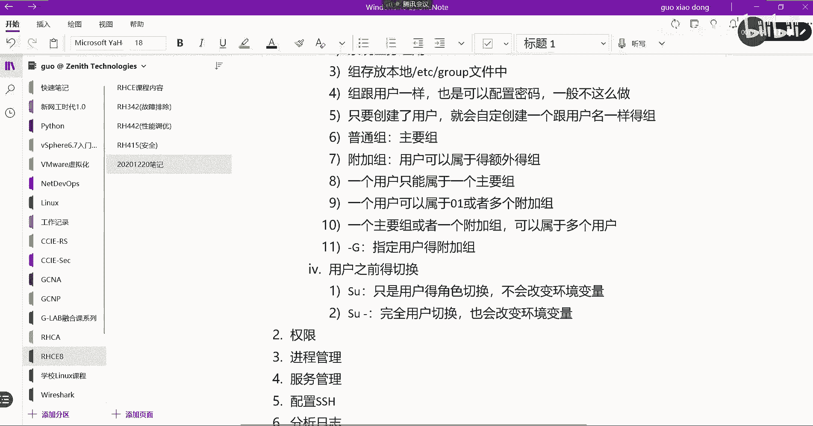

OK我们来看一下啊，现在我们是不是有两个用户，我记了一记本一，我再创建一个吧，user ADD俱乐部三，然后呢我们通过SU先切换SU切换到GLB3，GB1吧，我SU切换到GLB1哦，你看啊。

GLB1我是没有没有东西，老师病啊，进到办事里面去了，呃，退出来三，我给三给给一个密码，Equal reheart，password glb3杠杠，std i n好，然后我切到GLB3里面去，好看到没。

这个是我不加杠的情况，大家看明显有些不一样，你看我切到GLB3用户是变成了G230，对不对，但是后边是不是还有一个root啊，我是从root切过去的，看懂吗，我是从root切过去的。

那这个时候我们来看一下它的环境变量，环境变量怎么看呢，ENV上次有给大家讲，通过GRP看一下GLB的环境变量，我现在的环境变量是呃，看一下啊，Users gleb3，等一下啊，稍等一下。

User add，我再创建一个JB4，好我先到这个，我先退出来，登到GMP3里面去，好J23，然后我们看NV看一下现在的环境变量啊，是不是GLB3对吧，然后我不加杠切到GLB4里面去，这时候要输密码了。

Reheat ok，然后我再EV grape接待本，好，看到了吗，看看，还是GLEB3，还有GLB3对吧，说明我现在啊切到GLB4里面去的时候啊，它的环境变量还会保持我原先的这个呃。

GLB3的相应的一些环境变量，它不是完全切换到了GLB4的环境变量，明白这意思吗，他这个还在home glb3里面，所以这就是我这边总结的SU不加杠，不加杠的话，它其实是一个用户的切换。

但是还是会用上一个用户所在的环境变量，它不会用我现在这个用户里边可用的环境变量，这是这是它的一个区别，然后我再加杠来切换杠啊，前后都有空格啊，SUGGWP4再输入一下，然后现在啊明显你看有些不一样。

对不对，原来切过来的时候，这里还有一个GLB3，Glb 4server a glb3，现在就直接是GLB4server也什么都没有了吧，对不对，然后我们来看e n v grape。

GLB是不是都变成GLB4了。

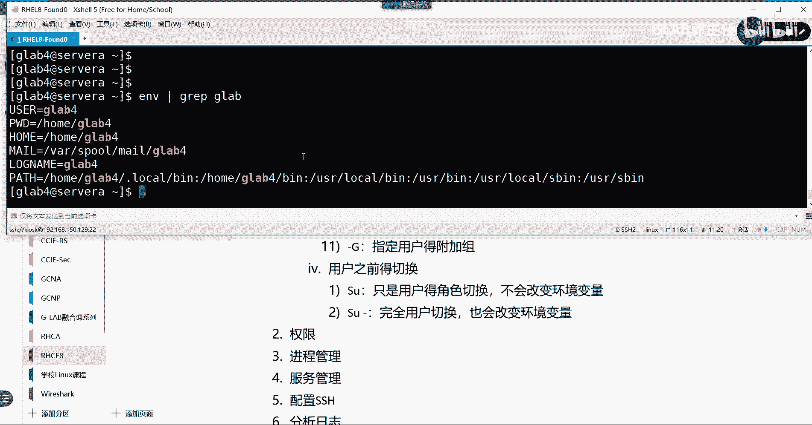

有没有GLB3相关的东西，没有吧。

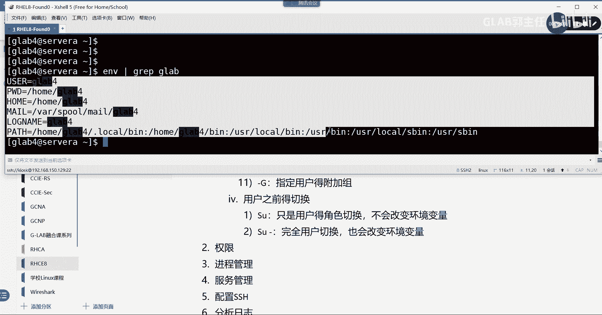

所以这是一个完全的切换用户的环境变量，完全的一个变更变化过来了，明白环境变量啊在我们的系统当中比较重要，在上一节课有给大家讲过环境变量啊，环境变量啊，它我们的命令能执行完全取决于pass，环境变量指。

指向着我们的这个命令所在的一些目录，所以这个是他的命令执行的环境变量。

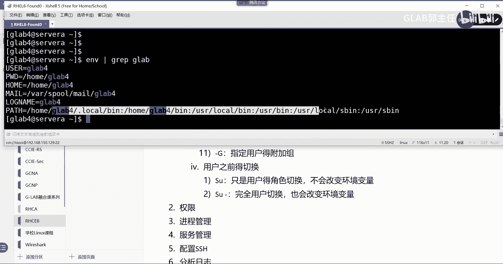

还有一些其他系统软件要执行的环境变量，也都是基于用户的。

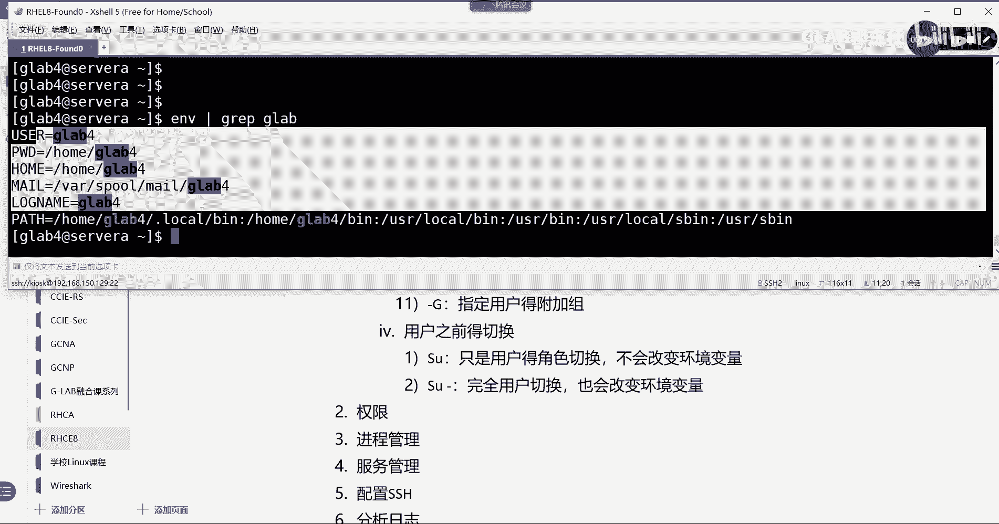

也都是基于用户的，所以大家明白切换用户SU，加杠和不加杠的区别吗，明白了吗，OK好，那么这是第一个要给大家讲的。

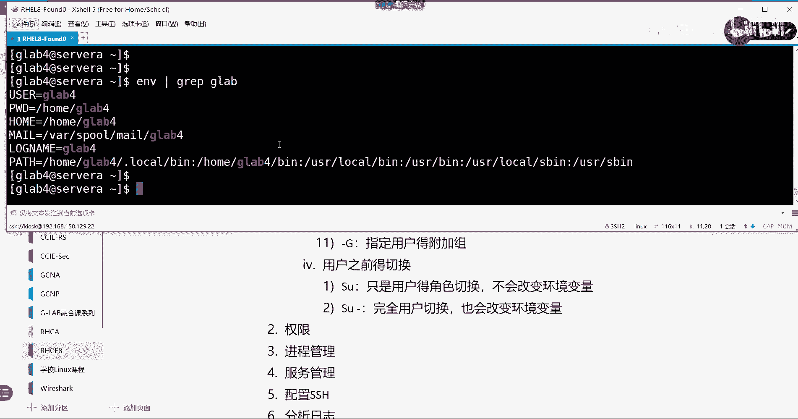

第二个会切换了，对不对，会切换了之后，我们来讨论第二个问题是普通用户啊，普通普通用户如何获取管理员权限，大家会发现普通用户其实权限是有限的，对不对，每个普通用户的权限是有限的，刚才我在casks那边。

那个用户里头需要读取一个etc的password。

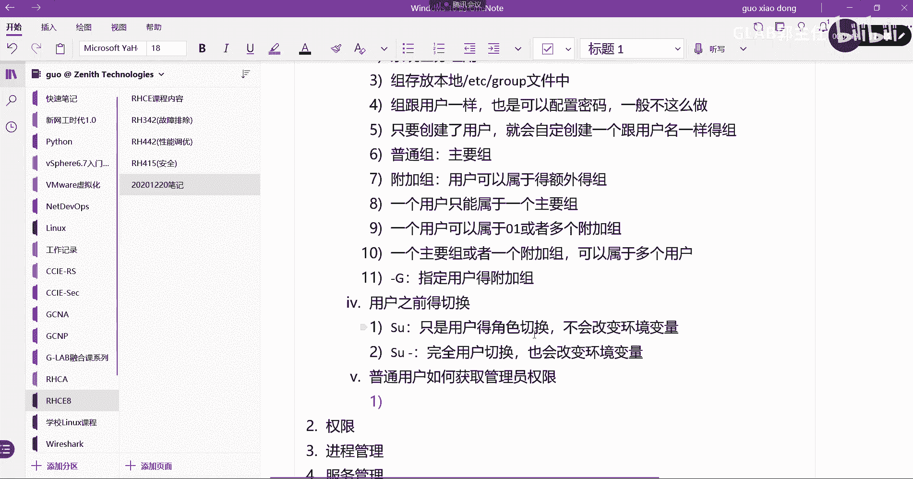

比如说这个我现在就是一个普通用户啊，我想去读etc下的shadow，它会提示我没有权限吗，普通用户其实真的能做的事情有限，非常有限，那么如何来让普通用户获取权限呢。

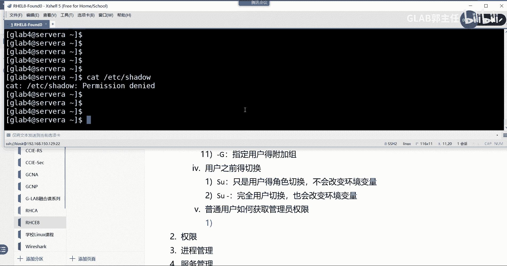

这是我们接下来讨论的问题，有两种方法，第一种方法我们可以通过SUGUSU刚讲过吧，我们通过SU杠直接切换成管理员，也就是我们通过普通用户通过SU切换到管理员，你不就有就有权限了吗。

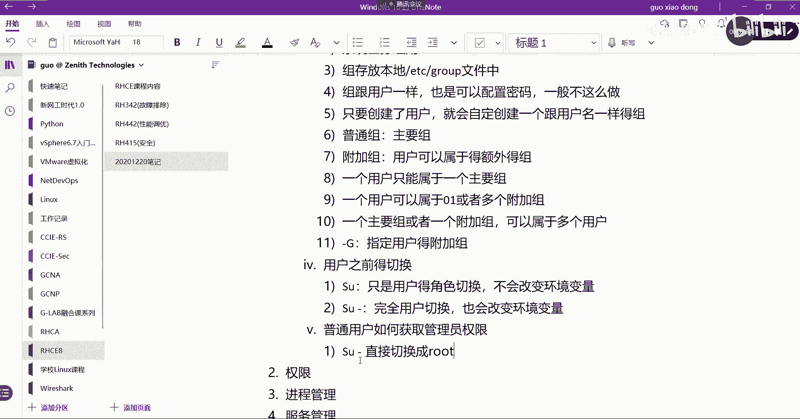

对不对好，所以在这里我们可以通过SU来切换SU杠，不加任何用户的话，他默认给你切换到超级管理员直接回车，这个时候要输入的是超级管理员的密码，所以如果你有管理员密码。

你就可以通过SU切换到管理员red hat，是不是切过去了，其实SU杠切就是一个切换用户，来提升自己权限，其实你就是知道管理员密码，或者就是知道管理员账号的人，对不对。

OK所以第一种方法我们可以通过SU去切换，这种方法有什么弊端呢。

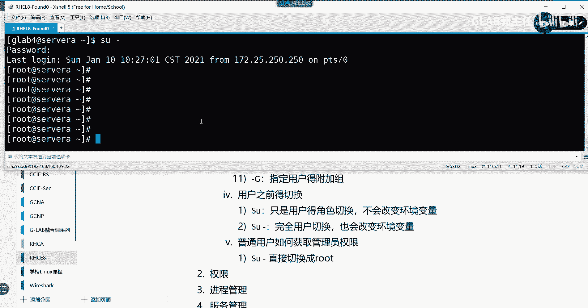

风险比较大，也就是你会把管理员账号告诉所有人，让新，接下来所有的普通用户都具有root管理员权限，那你还创建普通用户，创建个屁啊，直接所有人都用root账户不好吗，这不多此一举。

所以一般不会建议这种方式，听懂了吗，我会建议第二种方法叫速度，我们通过速度啊来提升普通用户的临时权限，速度来提升普通用户的临时权限，OK好，这才是我们解决方案，通过速度来解决问题。

那么速度有两种配置方法啊，速度来解释一下什么是速度啊，我们来什么叫速度啊啊，嗯速度，有两种配置方法，有第一种配置方法，我们可以在嗯，我来看应该是在改它的一个文件叫SODOSER。

直接修改这个速度的配置文件叫苏，so do ser啊，这个文件的目标目标位置在哪呢，它的本质上它的目标位置在etc下的，etc下的SEDERS，So doors，就这个文件我来给大家看一下这个怎么改啊。

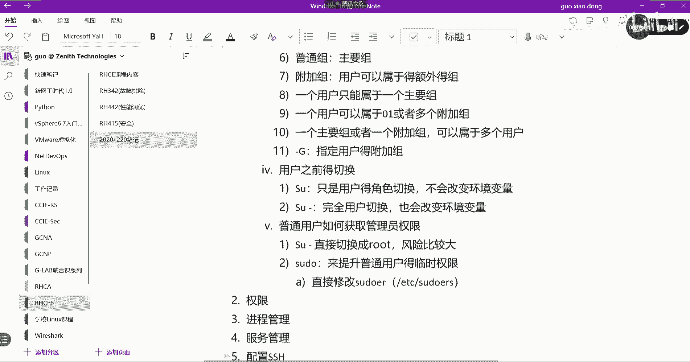

我们可以直接通过SUDOSER，我看看叫嗯，VM杠etc下载，v i v vi速度直接通过这个命令叫vi速度，能进来了，进来之后我们可以翻到这个文件的，有一个嗯WHELL，我们通过搜索，叫什么来着，W。

过了在上面，哦小写不好意思，应该是小写的WHEEL，在这这里头有一个叫allow people，用什么样的组，我们可以在这里去给它提升权限，怎么提升权限呢，呃我们可以VIP复制一行，好，复制一行。

复制一行了以后，我们可以把上面这一行给它注释掉，注释掉，加个井号注释掉，我们把下边这行给他来写，呃我们的用户叫叫这个是基于主啊，我们是GLB4是吧，对吧好，这个怎么解释呢，这个说的是啊。

我这个GDP4这个组对吧，他会会会让我的这个权限，会会用到所有用户赋予的所有命令的角色权限，所有是or的，这个就放的比较开了，就我所有的权限都可以借，我借谁的呢，我可以借管理员的。

我可以借所有用户的所有命令都可以用，OK就这里写的很清楚啊，对不对，好，这个是主啊，这个是主，明白这个是主，OK这个是主，然后这个代表我可以借谁建的一个角色，or就代表可以借所有角色。

一般我们是借管理员角色，管理员的命令理解吧，然后借管理员角色命令的所有的权限，所有的命令好，我们来看效果，我这边加了一行啊，好好了以后我们通过速度，我们通过速度去借这个借，我们去去查看吧。

速度cat etc下的shadow，看到了吧，有没有看到，是不是看到了，哎呦，日志管理员不好意思，要切过来，我说怎么没输密码，然后G24先切过来，然后在这里我们通过速度。

cat etc下的shadow好输密码，这个时候输的密码就是你自己用户的密码了吗，看清楚啊，看到了明白还是要有一个验证的，但是这个验证的密码这个就不是管理员密码了，能听懂吗，这个就是你普通用户的密码。

所以用速度的方式的话，你是不是可以让普通用户去借，管理员的命令的时候，并不需要知道管理员的密码，是不是起到一个安全的作用，明白吗，我只是给你演示一下，但是在这里我放的还是比较开的。

一般情况下我们这里不这么放，一般情况下这里应该写的更细一点，比如说我这里写root用户的对吧的所有权限，然后可以在后面加一些加他能用哪些命令，你不是所有，就是你想把管理员的哪些权限授予给这个组。

你就在这后面写，能明白我意思吗，各位啊，所以我这里放的比较开，放的比较开，你可以在这里写，比如说我只想让他的bean下面的什么RM的命令，给他用好，用逗号还是分号隔开，可能应该是封号吧。

然后bin下面的什么LS或者其他的命令，就类似于这样的，一直往后写，你要给他放什么样的命令，那你就给他放什么样的命令都在写，要写这个命令的全路径啊，要写命令的全路径好听，明白了吗，OK好就这样做的。

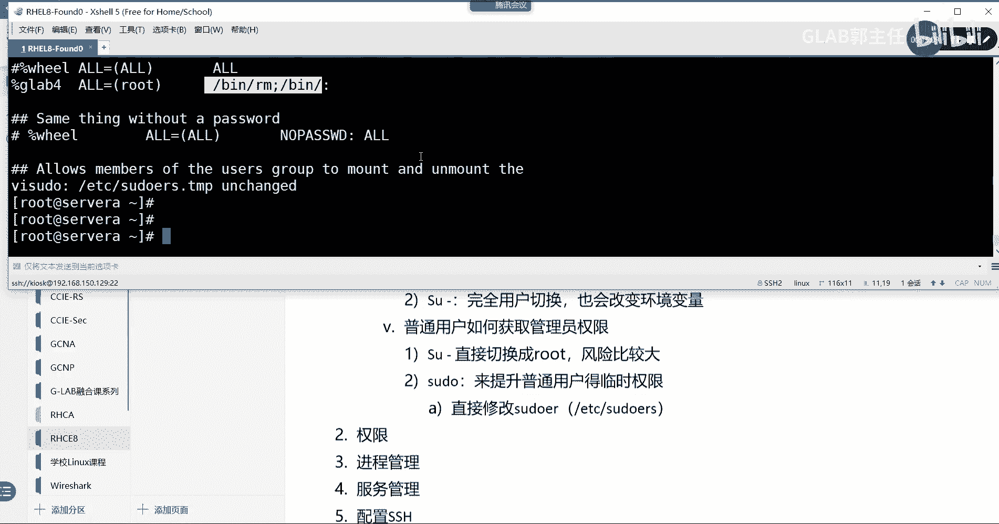

这是第一种方法，就是根据我们的so door的这个文件来编辑，来编辑它，来编辑它好，还有一种方法。

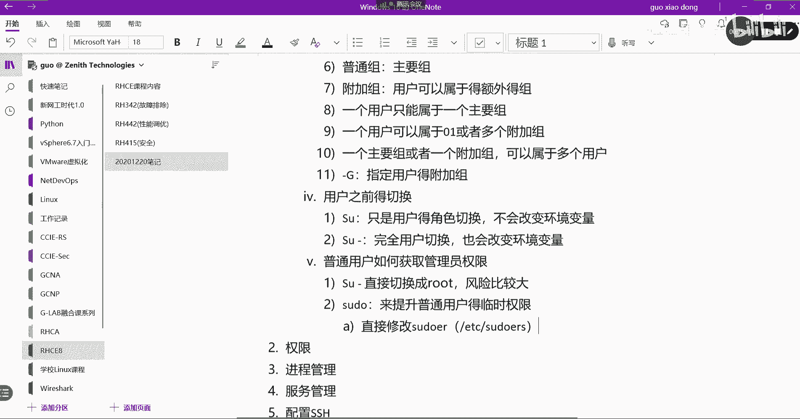

还有一种方法，这种方法跟第一种方法其实很像啊。

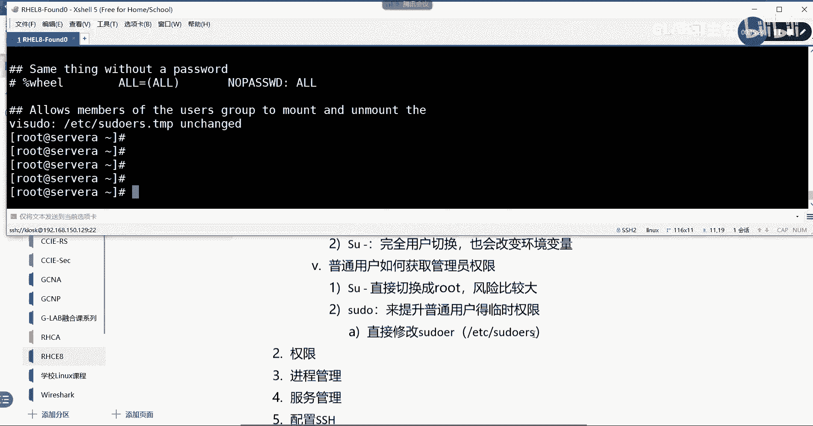

其实很像，他直接去编辑，原来是直接编辑这个主文件，对不对，现在呢他让你去编辑属于这个用户的单个文件，编辑属于这个用户的单个文件，我非常建议用第二种方法，第二种方法看起来逻辑性会强一点，在哪里做呢。

在etc下面有一个专门叫SUDOORS，So doors，点D斜杠，这个目录里面，你可以去创建你的这个基于这个用户的速度的，一些权限。

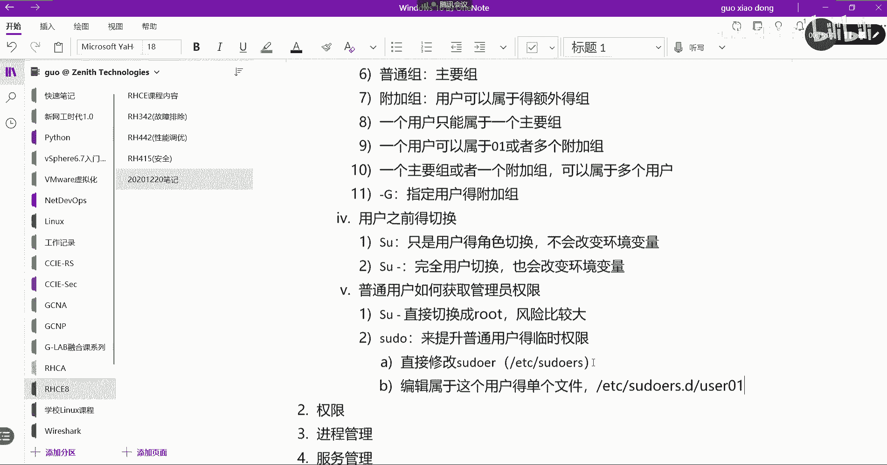

好来给大家看一眼，嗯CD到etc下的soda点D，这里头没有没有东西，我们可以在这里自己去编辑，通过VIM自己去编辑，比如说我想编辑GLB3，刚才几次GLB4吧，现在我想去编辑属于GLB3的一个文件。

在这里头我写什么呢，跟刚才写的命令一样的百分号嗯，GLB3对吧，然后呢or等于括号LOL是吧，等于括号呃，or然后or是不是跟刚才一样啊，然后保存，只不过比刚才是不是看起来更清楚一点是吧。

比刚才看的更清楚，然后你在这里写命令啊，也会很很清晰啊，也会很清晰，好GLB3有了啊，我们来测一下GLB3嗯，这个这个比较比较比较建议大家这样做，这样的话，你在这个目录里头能够看到。

你给哪些普通用户去授权了，管理员权限的文件都在这里都能看到，好吧，cut etc下的password，我们来看一下啊，Grab glb3，它的是登录的吗，OK是登录的啊。

然后我们通过呃速到GLB3上去看一眼，然后在这里我们通过速度cut，我们不加速度的时候去cat etc下的shadow，这肯定是不行的，我们加速度输密码，Reheat，看到了吧，能看明白吗。

各位所以这两种一个是GLB3，一个是GLB4，我分别用的是下面这两种方法，一个是改直接改大文件，外边的大文件叫有一个快捷命令叫vi do vi速度，叫vi速度，直接在这个没有权限啊，叫vi速度。

在这在这有一个WHEE2啊，在这里，那有人说在这里有很多组，你就在这里不停的加，你要给GLB4GB3，Glab5，就在这里一行一行一行往下加，能听懂吗，嗯然后有文件区分开来，就是更清晰一点了啊。

不在一个大文件里头，好处也就是如果是一个大文件损坏，所有的数都是权限不就坏了吗，都没了，然后分开会好一些，这两种方法明白了吗。

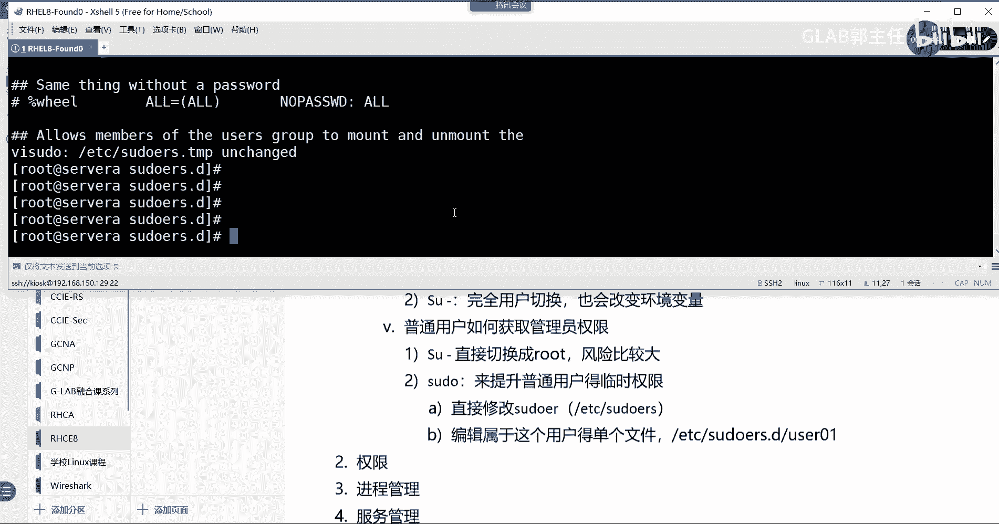

明白了懂了没懂了啊，这个是如何提升管理员的权限，作为一个补充啊，这两个好，接下来呢我们再单独的给大家整理一个，关于用户和组这个章节的，所有的内容的一个补充，所有内容的一个不同，第一个啊。

第一个我们在创建用户的时候啊，其实用户的系统用户有三种类型的用户，一个叫普通用户，系统用户和管理员是不是和超级管理员，那么，超级管理员的UID始终是零的，对不对，超级管理员UID是不是零啊，是吧对吧。

就是我们的root账户嘛，就是我们的root账户是的始终是零，还有系统用户呢，系统用户啊，我们给他创建的UID它也是有范围的，他是从一到200，这都是系统用户，所以你要创建系统用户。

记清楚指定UID一定是UID是210到200好，然后呢还有一个哦，哦不好意思，说错了，系统用户一它分两种类型的系统用户，系统用户A类，这个是红帽内红帽内部预留的预留的，这个你是不能分的，系统用户B类。

这个是你可以分的，他的UID是从两百二零一到999，这个是你可以根据你的需求啊，自己去创建的系统用户，OK可以自己按需创建，放需创建的系统用户好，第三个普通用户，普通用户的UID就很清晰了吧。

是不是从1000开始的呀，对不对，从1000往上加啊，加到多少自己去看，所以我们创建的普通用户，都是从1000 10011002往上加的好，这个是作为用户id的一个说明的补充，第二个第二大类。

我们在创建用户的时候，它默认会给这个用户创建的一些东西，也就是说一些用户创建的默认值，它会放在一个文件里面，创建用户的，创建用户时的一些默认值会被呃在在哪个文件，在etc下的，我给你写出来。

一会儿去看一下log，etc下的log点DEFS这个文件里面。

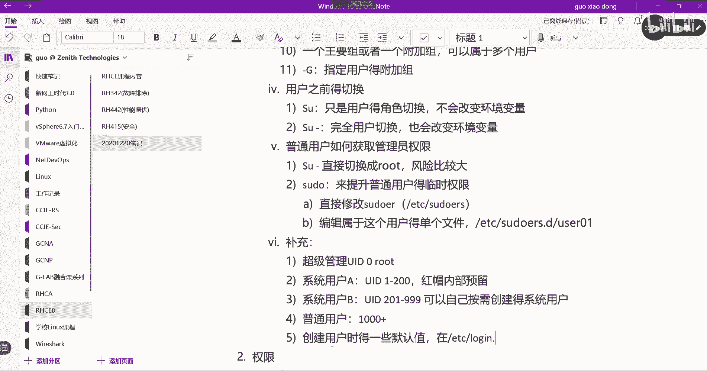

我给你看一下啊，这个文件里面有什么，我们CD到这里，我们VIMETC下的login dfs这个文件，这个文件有一些默认创建用户的默认值，看到了吧，为什么那里就是999995个九。

是因为这个文件指定了我们的用户，在不指定任何参数的时候，他就给这个用户赋予最大的过期时间值，就是这么多，告警时间就是七，最小的就是零，能听懂吗，各位啊，明白好，所以这个这就是它的默认值，默认你要改。

这个也就是你想改他的所有创建用户的默认值，就在这改，那为什么他的UID就是从1000开始，你可以把它改大改成2000，让他就从2000开始创建，自动啊自动创建，OK就是跟这个文件有关系。

就是跟这个文件有关系啊，都在这默认的参数都在这个文件里面，所以如果需要包括我们后面要讲的you mask，都是跟他有关系的，OK这是作为一个补充啊，创建用户的默认值的文件。

在etc下的device里面好，第三个第三个呃。

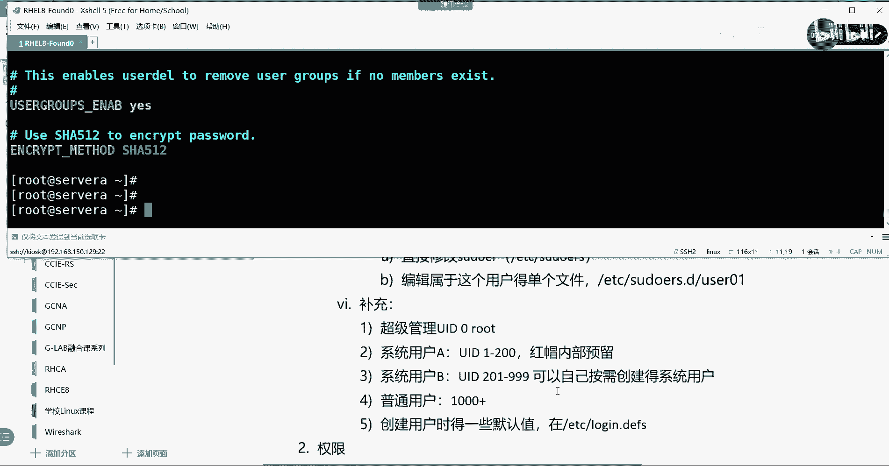

我们在创建组的时候啊，用的是group AD d对吗，Group d d，我们讲参数只讲了一个group d d gg，去指定group的GD对吧，那么在这里给大家讲一个杠N参数，作为一个补充。

那我来写这个命令，大家猜一猜杠N的作用是什么，如果是这样的一个命令，group ADD不叫DD了，group mode就是改不了，好请告诉我杠N的作用是什么，刚刚的作用是不是改主的名字。

是不是杠N就是改组的名字啊，改组名有时候我们需要把主的名字改一下啊，把组织名字改一下，我们通过杠这个就是把原来的主名字是GB2的，改成主名字是GLB22，各位能听明白吗，OK这个作为一个补充啊。

杠因为有时候大家可能需要改组名字啊，可能需要改组的名字好，那我看看还有没有其他补充了，好没有其他补充了，但是有一个练习需要大家练来吧，大家现在我给大家10分钟时间，赶紧练15分钟吧。

应该根据我刚刚讲的一些参数自己去做一下呃，我贴在哪儿呢，自己自己用一个自己用一个LINUX系统也可以，或者你像我一样在server上做也可以，看到了吗，来给大家10分钟时间，抓紧开始计时。

开机开开环境估计也得5分钟是吧，那么再给你们15分钟时间，抓紧，四十十五对的，在这在这快，谁帮我递一下这个电脑啊，自己搭建自己的用环境，用那个LINUX系统也可以，自己随便搞一个。

或者像我一样用一个server a也可以啊，15分钟快点啊，我们中午吃饭之前要把这几个题给大家做完，然后一起过掉的，或者，快点，都是今天讲的东西啊，线上同学一起做快，线上同学做完了，在这里扣个二。

让我了解一下，做完了啊，做完了赶紧扣个二，抓紧抓紧，这个这个练习题不是教材上的，不要翻教材，教材上没有答案，自己想，然后根据笔记自己记，自己试探试着做一做。

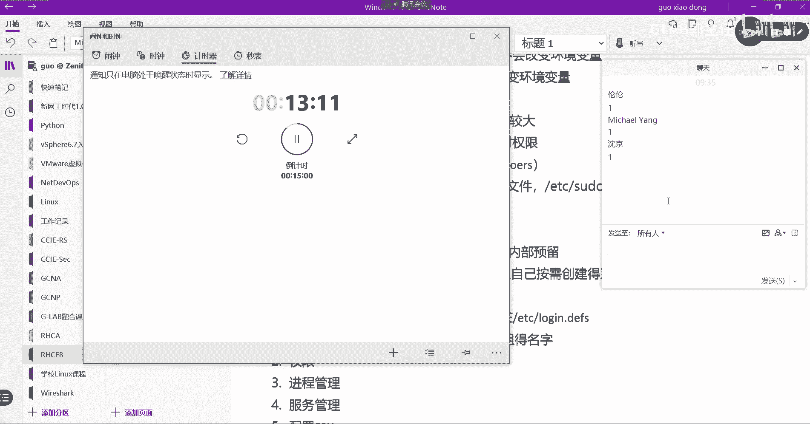

我等大家啊，变好吧，中午停下来，大家看我做一遍，中午没做出来的，请仔细再再做一遍，我们用server a来做创建一个用户啊，记得不是RHCEIDV2002啊，基本组为student，GD为3003。

也就在创建指定组的时候，还要指定它GID是3003，附加组是LINUX，所以这句话包含很多内容，你要提前先创建好，比如说第一个它是group d d，你要先把group创建好，比如说GG3003。

这个用户是a student是不是应该有啊，server上应该student应该就有是吧，OK好那么这第一个第二个故呃，group d d linux是不是D创建一个，因为它是它的附加组。

那接下来要创建我们的用户了，用户user ADD杠U它是已经指定了，说用2002来作为他的UID，然后GG去指定它的student，这杠G是指定它的主要组，明白意思吗。

杠大G是指定它的附加组LINUX干大GLINUX，然后呃GLBRGCE这个是用户啊，我们是给创建最终的用户，就是这个GL82HC能看到吗，创建这个用户啊，OK好那我们来看一下。

通过IDG代表RHCE去看一下用户的诶，断线了吗，卡了没，看见鼠标动吗，可以那就好，用户啊，这个是用户GLBHCE，并且UID是2002对吧，GID这个GID明显这是主要主嘛，然后这是附加组。

附加组没有指定他的GIT，所以没有关系，这是第一个需求，能看懂吗，好第二个需求创建一个用户叫atom，然后全名是atom，郭，3003GID是吧，哪一个这个是吧，哦基本组的student的GD是吧啊。

这个还有一个group mod gg是吧，Jd3003，然后呢这个是哪个student是这个吧，再看一下是吧，这才对啊，这才对，是因为他在这个server a上已经有了，所以刚刚在创建的时候。

他报了个错，你要额外再加一句来改一下他的GD，如果没有的话，刚才就已经OK了，好吧好，那么这个是第一个有需求，第二个需求创建阿童木user AD d啊，呃我们可以直接写创建一个阿童木杠C。

是不是要改它的注释啊，atom锅，这就是他的描述嘛，对不对，然后他说登录用的是bin下的BS是吧，B上的拜师吧，OK他说用的是冰箱的BS，那就这样，然后D阿童木看一下好有了。

那么这一系列的需求在ID是看不出来的，你要去cut一下etc下的password，对不对，通过grape去过滤一下我们创建的阿童木，是不是阿托木瓜有了吧，然后呢这个是兵败事上面来来做希尔登录的。

所以这是第二个需求，没问题吧，第三个需求修改GL82HC的id为4004啊，然后呢这个基本组要改它的基本组，基本组基本组现在是ARTM，我要把它的基本组改为LINUX，附加组为student和tom好。

这个怎么做啊，user是不是要改呀，User mode，首先改它的UID4004是吧，然后呢要去指定它的主要主要主变成了LINUX吧，然后再指定它的附加组对吗，附加组是这里附加组有几个啊。

S t u d n t student，这是第一个，第二个atom可以用逗号隔开，加多个附加组，然后再把这个计量表RHCE是要改它吧，好改完以后，我们IDGBRGC看一下是不是改成功了。

他的UID是变成4004了，主要组变成了LINUX，附加组变成了student和阿童木，没问题吧，就这个需求OK没什么问题啊，好下边给阿童木加个密码，设定其密码最短使用期限为两天，最长时50天。

这里有两种改法对吧，可以用change，也可以用password，因为这个都可以做啊，所以在这里我们用password给大家做password，杠N两天杠X多少，50是阿童木这个用户没问题吧。

好了怎么看呢，cat etc下的shadow吧啊，我们只想看阿童木相关的，其他的我都不看，是不是对吧，两天50默认的告警期没有改，就是七天吗，OK所以这个也很简单好，接下来将G代表LGC的默认线改为B。

下面的z share没有，我记得应该没有，但是命令大会的是不是用user mode杠S去改B下的，叫ZSHA，ZSHA这样写的，这个没有GBRHCZSHER，像是一个软件诶，有的你们改成功了吗。

改成功了，这个是一个软件要装的，可能server上已经装了这些，OK那么有那最好了，我们cat etc下的password过滤一下grape，GLBRHCE可以看到改成了z shell吧。

不管是白线还是Z线，它就是外边的一个壳，OK有各种不同的软件实现相同的功能啊，好这个是倒数第二个需求，最后一个需求应该我没怎么讲，创建一个系统用户啊，刚刚有讲系统用户的UID应该是在多少啊。

系统用户的UID，零肯定不是1~1到200是被保留的，那就是201~999是吧，系统用户，OK那么我们来创建在这里，我们通过一个关键的参数叫杠小R，这个刚才没讲杠小R，杠S杠小R就是创建系统用户啊。

好然后系统用户它是不需要登录的，所以我们在SB下面NO NO login，创建一个HADOOP，OK好，然后我们D1下HADOOP，是不是在两百二零一到9999之间，是不是啊，是的吧，所以用一个杠小R。

其实他就默认给你创建的系统用户系统用户啊，那有人说能不能加杠U去指定，能不能自己加杠杆，优质的指定创建系统用户可不可以啊，当然可以啊，为啥不行，可以用杠R更方便一点，它自动帮你分吗。

对这个UID和GID不一样，因为GID可能九零被封掉了，他反正系统自己给你分的，你自己去看一下好吧，当然也可以手动去指一样的，所以这个需求大家用杠R去创建系统，用户啊，高二去创建器。

它没有指定说到底是什么，UID和GID到底是什么，所以就这么点需求，我觉得23分钟应该能敲完的，很简单好不好，中午的时间把这几个赶紧复习一下，OK然后用户和用户组我们就说到这儿，然后这个有一个实验。

除了我这里的布置的练习之外，还有一个实验需要大家做的教材，翻到170，187页，开放性练习教材方187页，这个是需要大家做的，我就不给你演示了，187页是一个综合练习。

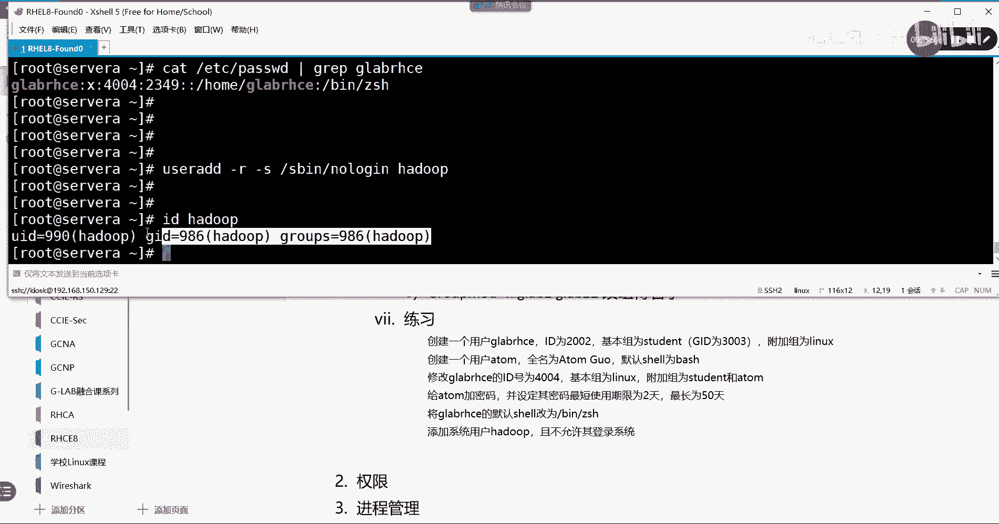