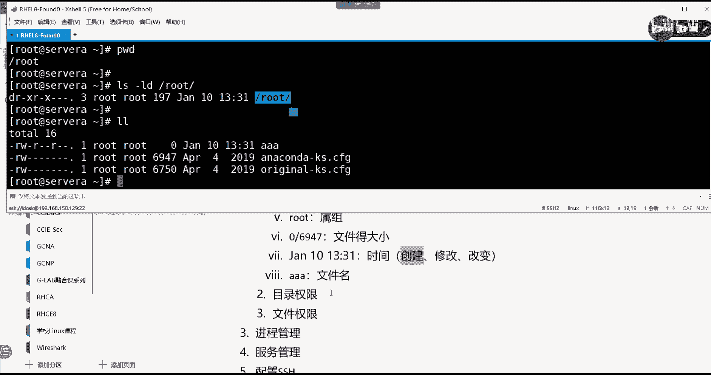
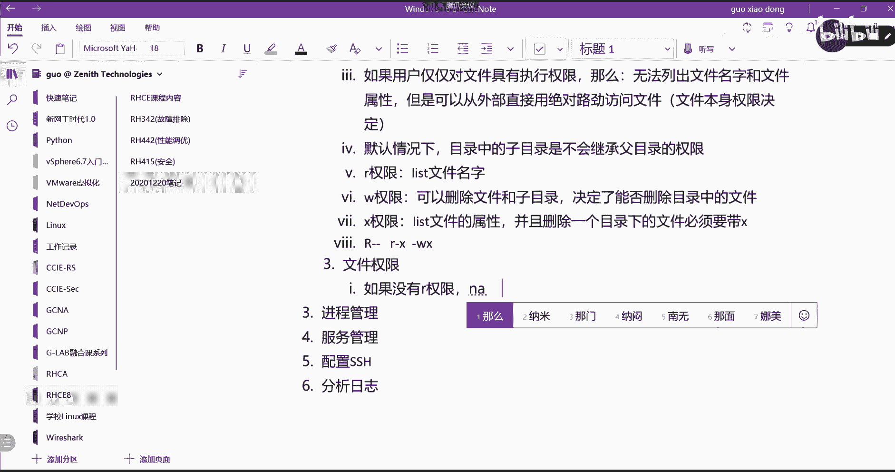
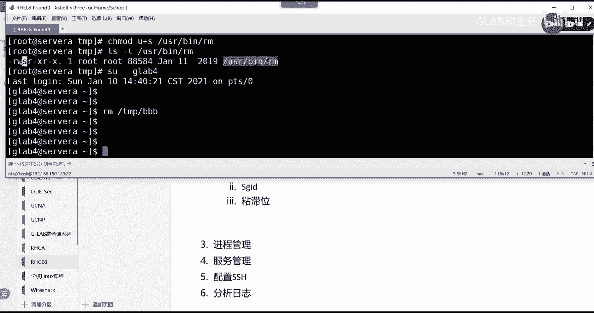

# 【Linux／RHCE／RHCSA】零基础入门Linux／红帽认证！Linux运维工程师的升职加薪宝典！RHCSA+RHCE／13-文件的权限 - P1 - GLAB郭主任 - BV1Be411D7oE

好下午，第一个内容权限终于说到我们这个权限权限呢。

它分两个阶段的权限，第一个现在就是我们讲的第一个阶段的权限，是基本权限，然后在后面还会给大家讲高级权限，还有还有一个权限是S1LINUX权限呃，总共在操作系统，LINUX操作系统当中跟权限有关的。

我们差不多会会分三个内容给大家讲，所以现在给大家说的应该是，最基本的权限的操作，好好，那么我们来看先看文件的权限系统大概有哪些，好几个概念吧，概念啊先从概念开始吧，第一个。

文件的权限控制是对文件的访问的一个控制啊，文件权限啊其实是权限啊，是对文件访问的一个控制对吧，所以这个概念啊，文件是归用户所有的，那么通常创建文件的用户，创创建这个文件的用户，对这个文件具有所有权来看。

比如说我现在在这里touch一个文件，touch aa这个文件LOL看一下这个时候创建，只要你是以什么用户创建的这个文件，那么这个文件就对这个用户具有所有权，就有多少就具有相关的一个所有权。

这个能听懂吗，K好，那么接下来既然看到这样的一个情况，那我们就需要把这个文件相应的，这些所有的字段给大家详细的讲一下，好吧，给这个文件的权限相应的讲一下啊，首先看这一部分，这一部分第一个字段。

这一部分这一部分大家数数有几个，有几个字段，十个是吧，不止十个吧，11个是吧。

应该是11个，所以我们先来看文件权限的这个字段，这个字段他有11个，他有11个啊，这11个我们把它分一下，第一个这个杠代表的是文件类型对吧，然后这个九个字段三个一组，这个代表的是权限，后边一个点。

后边点也算啊，后边有一个点对吧，后面这个点其实作用不是太大，大家可以忽略掉这个点啊，主要是前面的这个十个字段，主要是前面的十个字段好，那么前面的杠代表的是文件类型，杠代表的是文件类型对吧。

文件类型常见的有D代表的是目录是吧对吧，然后L呢代表的是链接文件对吗，还有吗，还有B代表的是快文件对吧，还有其他的S代表的是socket文件，都可以，这些常见的文件类型，然后呢杠代表的就是文件。

它不是目录第一个字段啊，所以大家可以自己记笔记啊，就不是杠了啊，就是这个地方，有这些相应的特殊的符号，好后面九个字段分为三组，分为三组，九个字段分为三组，第一个RW杠，这是第一组吧。

这个代表的是用户的权限位，好接下来R杠杠，这个代表的是用户组的权限位，能看到吗，好第三组R杠杠代表的是其他用户的权限位，好那么不管是哪个组，他都有三种特殊的权限，而代表的是只读W代表的是血对吧。

好X代表的是执行，这个能看懂吗，OK这些权限我相信大家应该都能听得懂啊，应该是什么意思，那么介绍完了以后，大家来告诉我，这三组权限是怎么来控制用户对文件访问的，是怎么来控制的，来举个例子。

看是怎么来控制用户对文件访问的。

比如说这里，就看这个文件，请问看这个文件说啊，请问啊看看这个文件，主要就看这个文件啊，请问root用户对这个文件具有什么权限，可读可写，对不对，OK没问题，然后呢，我们有一个GLB3的用户。

GLB3的用户对这个文件具有什么权限，具有什么权限读只只读的权限，对不对，能听懂我意思吧，具有只读的权限，OGLB4这个用户被我放在了root这个组里面，请问GLB4对这个文件具有什么权限。

你是不是只有读还是读写，读明白吗，所以要看啊，首先这个文件属于哪个用户，他是看前面这三位的权限，然后呢，如果在这个组里面的其他用户，同样在root组里面的其他用户，应该看这个权限为。

除了在组里的其他所有的用户叫other，他应该看这个权限位，能看懂吗，所以就这么简单，其实很简单，明白了吗，好那么这三个前面的11位啊，搞清楚之后，我们来看这个一是什么意思啊，就读这个文件。

它的这些属性，我们一个字一个字段来讲，这个是什么意思啊。

属性位的一。

啊就是这个字段有的时候是一，有的时候是什么234。

这个还记得我们之前讲链接吗，这之前讲过啊，对叫硬链接的个数，前面重点给大家讲了硬链接啊。

对不对，这是硬链接的个数，那回忆一下硬链接干嘛用的，硬链接是最重要文件进行保护的对吧，文件要删除硬链接，不要把所有的硬链接都删掉，文件最终才会被删除，明白好，这个地方显示的是文件硬链接的个数。

听明白了好，这个字段呢root，root是数组，叫属祖对吧，第二个root叫数组，它都叫数组，但是不一样啊，一个叫数组，一个叫数组。

看到吧，这是用户，其实就是主人，这个文件的主人，这是他的主，好，这个地方呢，后面一个字段代表的是大小，这里头有一个零或者什么，这里的是69476947啊。

我就举个例子啊，这个地方是文件的大小，对不对。

文件的大小好，这是文件大小啊，然后在后面，这是一个什么，后面这么长，这是时间对吗对吧，1月10号的01：31分创建的，这是时间对吧好，我们把它复制过来。

这个代表的是时间，什么时间，请告诉我什么时，时间我们对文件的处理文件会存在三种时间，第一时间是什么时间创建的，是不是有一个创建时间，第二个呢修改时间，还有一个时间叫改变时间，有人说改变和修改不一样的吗。

不一样对吧，修改是直接去改这个文件内容改变，就是你去读这个文件的时间，就不一定对它能进行改动吧，像比如说啊这个文件我就touch一下这个文件，这个文件内容改了吗，没改对不对，但是被系统读了一下，对不对。

所以这种时间我马上就叫改变时间，而如果我用echo向这个touch的文件里面输入一段话，这个文件内容改了吗，改了，那么它叫修改时间，听懂了吗，OK那请问，如果我依靠一段文字到AA这个文件里面去修改。

时间肯定变了，请问改变时间变了吗，变不变变了呀，当然变了，只要被处理了，它就是改变时间也会变，听得懂吗，OK好，这三个时间在哪看呢，哎叫这个通过TT去看这个文件的三个时间，看到了吧，那第一个叫创建时间。

我们把它叫CESS呃，对access时间，然后第二个叫修改，第三个叫改变，都是通过它来看的，通过通过这个state来看，能听懂我意思吗，O好通过这个命令来看这个文件的时间啊。

所以请问我们这里看到的AA的时间，到底是占了三个时间当中的哪一个时间。

创建时间对吧，这边是创建时间没问题，OK好。

最后呢。

最后这是什么文件名，KA文件名就是我的文件名，听明白了吗。

好所以我们在系统里看到这个文件的这些东西，这些东西我们把它叫做什么，叫做文件的属性，对不对，叫做文件的属性，是文件里面的内容吗，不是这个是文件的属性，好听明白了啊，各位好。

这个明白了之后，我们来讨论比较有意思的概念的东西，说清楚了，我们来讨论要开发发散各位的思维啊，我们要来讨论文件的权限啊，权限相关的权限，其实在系统里面有两种类型的权限，第一种类型的权限叫做目录的权限。

第二种类型的权限叫文件的权限，是这样的吧，OK什么叫目录的权限，什么叫文件的权限，非常有意思啊，我们来看嗯，这个怎么说啊，好我们来看啊。

举个例子，现在我看到的这一堆的权限是谁的权限，是文件的权限吗，是文件的权限，对不对，那我们来看这个目录的权限怎么看，杠A杠A1个点代表的是当前目录吧，两个点代表的是上级目录，对不对。

所以我想看A所在的这个目录的目录权限，是不是看他呀，这第一种看法就是你看所有也可以，还有一种看法是看什么，我BWD看一下我当前目录是不是就是root啊，我可以通过LS杠LD直接看这个目录。

是不是也是一样的啊，能听懂意思不，OK大家想个问题啊，好当前目录的权限，这个是目录的权限，好目录的权限有可读，它前面有个D嘛，有可读可执行，中间没有可写，目录的权限是控制什么的呀。

也就是说我能够在这个目录里面列出来，这些文件的属性，这个能够在这里直接列出来所有文件的属性，你觉得它的权限，它获取的这个权限是文件本身控制的，还是上级目录控制的，想一下这个问题，我现在看这个文件的属性。

这一堆文件的属性是文件的权限控制的，还是这个文件所在的上级目录控制的，啊举个例子啊，啊你想看到你要想看到超市里面能买，能卖哪些东西，对不对，像超市超市里面有哪些货，那么你能看到的是到底是能够看到它。

是因为是是那个那些货物的权限决定的，还是整个超市的管理决定，让你看到的是不是超市地方门开了，你才能进去，看得到啊，是不是这个道理，同样的，我们的目录必须得开权限，你才能看到目录下所有文件的权限吧。

所以文件的这一堆属性，其实跟我的文件本身没有关系，应该跟文件的上级目录有关系，听懂了吗，OK所以大家记住第一个结论啊。

目录的权限，目录的权限，第一个结论是用户能够看到能够看到呃，目录中文件的属性，我说的是属性，不是文件本身的内容啊，是文件的属性跟目录的权限有关，这个目录的权限有关系好有什么关系呢。

一定要具有可读可执行的权限才可以列出来，各位听懂我意思吗。

一定要有可读可执行，才能够在目录下面看到目录里边，文件的一些属性，所以你看看是不是具有可读可执行啊，看清楚了吗，OKOK好，那么我们来再跟着继续往下讨论啊，如果这个用户对这个目录，只具有读取的访问权限。

也就没有执行的访问权限会怎样。

啊，想一下，如果用户对啊，仅仅啊仅仅对这个目录具有读的权限，它没有可执行的权限，对不对，那么会怎样猜一下好。

我们来做这个实验，我们就不用我们用这个好像不太好，我们换一个目录，我们在这里mic dr2，建一个test1这个目录CD到test一下面去，touch一个RHCLL看一下，现在能够列出来这个这个东西。

其实跟我的LS杠LD，跟我创建的这个视角test吗，test1这个目录具有这个权限是不是有关系的，对不对，好现在我就是root用户嘛，所以你应该看的是第一个，是第一个对三个字段的这个权限位吧。

现在如果我把它的权限改成R杠杠，也就是具有只读权限会怎样好，在这里改改这个目录的权限，我们用的是change mode，改它的权限，OK好，那么大家先这个权限，我会后面会给大家给大家去改呀。

会告诉大家怎么改，有很多种改法，那么chang mod前面有一些理论性的东西啊，啊我先教大家改这个权限是怎么改，叫change mode，好change mode，我只是给他改RWW。

那就是我可以用这样子U减WX，这是一种改法啊，我把root下的test1的权限改掉，然后呢我再来看一下，改了没有改了啊，改了啊，OK好，大家猜猜会有什么反应啊，会有什么不一样，好来LOL，诶这是哪儿啊。

哦这是在test1里面是吧，有没有什么不一样啊，有没有什么不一样，呃用户对这个目录具有具有读取的访问权限，是读取吗，我看看改对了吗，Test1，一二，三哦还有也要改吧，后面也要改，把这些都改掉。

这个是用户，我现在是这个用户是吧，用户没有这个权限，但是组好像有这个权限，我先试一下啊，千g mod，我们把G减X去掉，然后把root test1再看一下，都没了啊，只有2W，其他的只有X权限。

然后我在这看一下管理员用户好像不能控制，我们应该用普通用户来控制啊，这样子啊，cat因为管理员他是具有所有权限的，他就是皇帝是吧，没办法对他进行控制，etc下的password，看有什么GB123。

Glb123，我们切换用户吧，哎在这里就可以嗯，LS好，继续在这啊，我们就在这里mic dr，我们建一个GLB4的这个test1吧，看啊test1好，然后呢在test一下面创建一个用户。

test一下面创建四个A的一个文件好，CD到test1看一下，有的啊，然后呢LS杠LD看一下home，就是当前目录下的test1都有是吧，我们还是把用户的权限去掉。

change mode user减XWX，当前目录下的test1的权限去掉，然后再看一眼，没了吧，没了之后我们再看看不到了是吧，看cannot open directory，不能够看到他来，我们退出来。

CD点点好，L s4，在test一下面，我们来看GL看到了吧，就这个现象刚才为什么不生效，因为不要去限制root root，你没办法限制root，它具有所有权限，明白吗，皇帝你是不能把他干掉的。

他什么都不能干，所以看到了看到了我再给大家看一眼啊，现在我这个权限，这个用户的权限具有只读的权限，看到的是一堆问号，说明这属性读不出来了吧。

对对就是这个原因，所以总结一下，那么那么什么啊，可以名称能不能列出来啊，可以列出文件的名称名称，AA不是看到了吗，各位啊，但是不能对吧，但是不能看到跟属性相关的信息，这些信息都是打问号的对吗。

说明要去获取文件的属性，一定要对文件具有X权限，听懂了吗，说明这个结论很重要，说明要去获取文件的属性，那么必须要具有X权限，这个清楚了吗，必须要有X权限，没有X权限就搞不定了，好这是第二个要讨论的问题。

第三个我们再来假设，如果用户仅仅对文件具有执行权限，只有执行权限，对不对，那么大家猜一下，刚才是不是只图权限。

对不对，现在只有执行权限，请问这个时候会怎样来，我们改一下啊，改一下呃，我们还是通过change mode，我们把U改成等于只有执行权限，那就是杠杠X对不对，然后再当前的家目录下的test1把它改掉。

好LL看一下哎我这个，哪里不对啊，是不是改错了，改成全部没有权限了是吧，加X来了啊对吧，有X了，好具有X权限，请问这个时候会怎样啊，我们还是去看IOS当前目录，test1杠L是不是啥都没有了，都看不到。

但是我能不能访问这个文件呢，我们cut test cut当前目录test一下的AA是不是A啊，我刚刚几个A啊，四个A1234是不是能cut好，我向里面写点东西，一口随便打点什么，我们从定向到test1。

下面的四个A是不是也写进去了，然后我看一下是不是看到了，但是我去LS看一下能不能看到，看不到吧，所以说他是告诉你没有权限。

看到了吗，好请总结一下这个现象，那么，那么，无法，列出文件名字和文件的属性，名字和属性是两个啊，对不对，名字和属性都列不出来，但是但是会怎样啊，可以从外部直接，可以从外部直接用绝对路径访问文件。

这个从外部直接用绝对路径访问文件，能够访问文件是文件本身的权限决定的吗，你去现在都在改文件了，能听懂吗，对不对，这个是文件本身的权限决定的啊，大家能不能听懂这地方权限有点绕有点绕，但是我觉得不难。

大家仔细仔细听我总结的这些好不好，这个是文件本身决定的啊，OKOK好，就是这个原因，所以目录的权限，所以目录的权限，它仅仅只是用来控制，你能在目录里看到哪些东西，对不对，能在目录里看到文件名啊。

还是文件对应的属性啊，就这些东西目录的权限听明白我意思吗，各位能听懂啊，Ok，好接下来目录的权限还有一个重要的特点啊，嗯就是我在我在我的这个目录里面创建了这个。

我在目录里面再创建一个子目录，创建的子目录会继承我的父目录的权限吗，会不会猜一下会吗，会不会不会对吧好。

这句话要记住啊，也就是默认情况下当然是可以改的，你可以要改它的这个特殊的年置位，才可以实现这个需求，但我们要加个前提，叫默认情况下对吧，这个目录中的目录中的子目录对吧，是不会继承父目录的权限。

你不要认为在下面父目录是什么子目录，就什么权限，不是这样子的，当然是可以做的，是可以做的所在，但是默认是不可能继承的啊，OK好嗯，能能听明白啊，好那么既然说的说了这么多，很多人其实对全限位的RW或者X。

其实是有一些疑问的，对不对，我们总结一下，大家认为权限位当中的R这个读，目录当中的R，它是什么作用，R权限总结一下前面那些特点都看到了，你觉得R权限的作用是啥呀，不要告诉我只是读对吧，我也知道read。

我知道是毒啊，所以权限位它的作用是可以能够叫list文件名字，目录的R是不是可以让你list文件名字啊，就总结啊，总结啊，能听明白，但是权限不是这个R决定的吧，刚才我给我的目录的权限设成R杠杠。

你LS看到的是不是只有文件名啊，没有文件属性啊，还记得那一堆问号吗，对不对，所以这里写清楚它list的仅仅只是文件名字，听懂了吗，好OK继续，这里好像跟W1毛钱关系没有是吧，W权限我们一直没讨论。

请问W权限在目录当中的作用是什么，W对来总结一下啊，它是可以删除文件和子目录，W是W是具有可写嘛，对不对，所以W的权限是可以删除，它是可以删除的，如果，W是可以删除文件和子目录，但是还要加个。

但是但是如果对目录同时设置了这个年制位呃，呃这后面会讲，您这位这个先不写，只是删除文件和子目录，可以删除文件和子目录，可以删除文件和子目录。

什么意思，这个要简单解释一下，前面一直没提到W这个概念啊，那我现在请问我现在基本四，这个用户能不能把test1这个目录删掉呢，或者说能不能把呃，能不能把test一下面的呃。

这个这个这个这个三个四个A给它删掉呢，可不可以删RM rf test一下面四个A能不能删，能不能删掉这个文件，想一下，根据我们现在整理的这个W的权限，你觉得能删吗，不行对不对，很明显不行。

因为什么有人说是因为没有权限，肯定是没有权限，我四个A是不是GLB4这个用户自己创建的，所以你单纯的去看这四个A的话，因为它属于我的这个诶，我前面四个A呢在哪，前面在这四个A。

我是不是对它具有具有可读可写的权限，但是看文件本身的权限是绝对可以删的，听懂了吗，但是真正删文件，跟文件本身的权限是没有关系的，跟文件的附目录的W权限是有关系的，听得懂吗，各位啊，这里没有W权限。

所以你是删不了的，那我们来把它改一下下，R c h change mode，我把U加rw test14个A哎，不是这个直接就做test1可以了吧，LS杠l d test1是不是RWX都有了。

这个时候我再去删可以吗，删掉了吧，所以这里再继续总结这个W啊。

这个W目录的W权限，是跟你删除目录里边文件是有关系的，他决定了能否删除目录中的文件，是不是能否删除目录中的文件啊，各位听懂了，好好好，那么这个就是WX呢，目录的X权限有什么特点，啊目录的X权限。

目录的X权限不自去执行这个目录是什么list，什么文件的属性，对不对，他会把这个文件一堆属性给你list出来，它是要有X权限的，它是要有X权限的，好听得懂吗，并且还要说一下，并且删除一个目录的时候。

必须要带X权限，好删除一个文件的时候，删除一个这个目录下的文件，必须要带X权限，听懂了吗啊明白了好，那么我们最后来总结一下几种情况，大家告诉我具有什么样的特点，总结一下啊。

如果你看到的这个目录的权限是R杠杠，请问它的特点是只有文件名，对不对，好R杠X，二杠X啊，只有属性看不到R杠X这个大家自己整理啊，R杠杠是只有文件名，然后前面有一堆问号。

R杠X是能看见文件名和文件的属性，对不对，但是不能对不对，但是不能删除，能看懂吗，各位OK好，然后呢，然后这个杠WX，看不到文件名，对不对，那么能不能通过绝对路径访问他，那能不能删三，可以吧。

是不是也可以，好，没问题啊，这个没问题，杠杠杠啥都不能干对吧，这个就不说了，肯定是不行的，对不对，好那么呃差不多就这些，然后RWX跟杠杠杠一样的，不去讨论了，一个啥都不能干，个啥都能干，听懂了吗。

是不是就这几个啊，我想到的就这几个好不好，清楚了吧，我们都讲过了啊，好继续嗯，这个是目录的权限来说，九九个字段嘛，331嘛对吧，然后第一个字段不是user权限吗，然后后面最后一个是他的user权限。

那就像你刚才用的G4去操作的话，我们看的是user user对user啊，这个文件是user创建的，就是呃你对这个文件操作。

你是一个相对的概念，比如说这个文件这个test1里边的三个四个A的，这个文件是我glb user4GLB四创建的对吗，GLBU14创建的话，如果我现在用GLB4去处理这个文件，那他读的就是前面三个。

因为属于属于这个属组嘛，嗯属于数组在对这个本来这个文件的数组，在对它进行操作嘛，所以看的就是第一个权限位，但是如果你用GLB3去操作，这个本来属于GLB4的文件，看的应该就是other权限。

看的就是这类，明白吗，但是如果你用了一个g lab2来操作，这个属于GLB4，刚好GB2又属于GLB4这个组，那么就是看中间这三位听清楚了吗，就看中间这上面，所以这是一个相对概念。

你要搞清楚这个文件本来是属于什么，属于哪个数组，属于哪个数组，然后是哪一个用户在操作这个文件，那刚好就对应了这三个字段，听明白了，我们拿了一个字段来跟大家分析，其实三个字段不是一样分析的嘛。

对吧一样的嘛，道理是一样的啊，道理是一样的。

你要区分到底是是不是这个文件的数组，还是属于这个文件的同一个组，还是other用户清楚了吗，接下来我们到文件的权限，目录的权限就说到这，接下来我们说文件权限好不好，好文件也一样的。

RWX3个权限它具有特殊的作用，它具有特殊的作用好那么大家猜啊，我们还是先总结理论啊，如果if，如果没有，如果文件啊，我现在讨论的是文件，如果没有R权限，那么你觉得，R权限。

那么怎样就一个文件没有R权限会怎样，我们先进到这个文件里面，来CD到test1里面啊，哎这个不是删掉了吗，哦对刚刚删掉了是吧，我们touch一个三个A吧，看一下啊，我现在就是GLB4。

并且它的数组是GLB4，所以我们看到的应该是这三位，看到了吗，好如果现在对这个文件没有R权限会怎样，好我来改一下好不好，来做个改动啊，mod u u等于没有R权限，那就是杠WX了，杠就是没有嘛。

来我们看哎，都改了，这个我好像U加加WX，先别急啊，一会我给大家讲一下，是不是只有只有WX没有R对吧，那请问这个文件，这个文件我我我我能够编辑它吗，能不能编辑它，oh我写点东西，写好了保存可以吗。

可以吗，他说啥不行呀，好WQ，加叹号强制保存退出，再cut一下，不是cat，再编辑一下A有东西吗，刚才我写的东西在里面吗，不在明白吗，好可以吗，不可以，但是我这样echo。

哒哒哒哒哒到追加到我这个目录下面去，可以吗，可以好，我cut诶，可以吗，不行，所以总结一下，请问我我现在刚刚举了三种情况，一种是直接vim编辑不行，第二种用echo输进去可以。

第三个用cat这个文件不可以好了，同志们，快拿出你们强大的总结功力，对啊应该是怎么说呃，不能够编辑，首先没有R权限，没有R权限不代表不能读啊，你写之前不先得读一下这个文件吗。

对这就是为什么我们VRM的时候是不可以的，VM不可以编辑，因为什么编辑之前得得有写的权限，得有写的权限啊，对得有读的权限，对不对，说错了啊，得有读的权限，这个能听懂吗，你打开一个文件，你不先读它。

对不对，那怎么打开啊，去编辑它的时候，所以这个没有任何问题好不好，但是为什么ECO又可以呢，echo是直接把文件从标准输入到标准，标准输出到标准输入，直接输进去的，他有打开这个文件吗，没有。

我是直接往里写，也就是echo在往里写东西的时候，是不需要读文件的，你能听懂我意思吗，各位好明白，然后cat是不可以，这绝对是能理解的，因为他本来就是去读嘛，对吧，cut直接读是肯定不行的。

直接读是没有权限的，好首先这个R权限听懂了吗，说明写之前也得有R好不好，接下来文件的这个X到W了，文件的权限如果没有W权限会怎样，一个文件如果没有W权限，文件没有W权限会怎样，肯定不能往里写东西。

这是肯定的，是不是不能写东西，也不能编辑啊，这肯定的啊，但是如果只有W权限，是不是也不能编辑啊，这不就上面那个结论吗，但是只有W也不能编辑，所以必须得R和W1起，对于文件来讲，RW是一起的目录不是啊。

目录W是可以没有的对吧，目录的话他常用的是R杠X吧，但是文件常用的是RWRW要连在一起用，听懂了吗，OK好，X权限如果没有X权限会怎样，X权限是干嘛的，这个就太简单了，我直接写了X权限是什么作用。

是执行是可执行的权限，OK可执行权限，但是有X权限，就一定代表这个文件是可以执行的吗，应该要写可执行得有两个前提，得有两个前提，哪两个，第一个是文件本身必须具有可执行，就是这里的X第二个第二个就是用户。

我们这里讲的用户啊，要要要说的精确一点，就是第二个要求就是普通用户，因为超级管理员用户你限制不住，对不对，他音量强调是普通用户必须对吧，具有R的权限，执行的时间也得先读啊，听得懂吗，各位。

所以执行权限光有X还不行，还得有R的权限，听明白了吗，各位OK，所以我们再来总结一下，对于文件而讲，文件来讲的话，如果我是杠WX什么特点，杠WX，干WX能不能读不能读不能写不能写，能不能执行。

不能执行对吧，X要有R才能执行，对不对，所以这就是废的废柴，啥都不能干好，所以把刚才说的几种可能性，RW杠可读可写，对不对，how r杠X可读可执行，明白这意思吗，OK然后杠杠杠不说了，RWX不说了。

听得懂吗，OK也是这三个明白了吗，OK明白了，我们来讨论一个问题，我们给大家来讨论一下啊，如果我们给给这个属于属于root这个用户的文件，对吧，我们把属于root这个用户的权限改成杠杠杠。

那么它具有什么样的结果，说白了就是把root用户的权限改成杠杠杠，那么会怎样对啊，这个刚才已经露馅了，控制不住是吧，完全控制不住，听懂了吧，那么那么那么那么那么那么那么那么，能不能帮我想个成语。

那么那么啥都不行是吧，控制不住啊，控制不住的这个程序不错，那么控制不住好吧，听懂了吗，各位你不能改root root权限，你就算改成杠杠杠也是没有用的，明显刚才刚才我给大家操作了一下，是不是没控制住啊。

所以root权限啊，你是控制不住的，不要去试图控制超级管理员，你控制不了，OK好，最后结论，我们把这个结论给大家总结一下，同时具备毒写执行权限，不能决定是否删除这个文件，所以我们这个结论在总结什么。

在总结如何删除一个文件，删除文件是什么决定的，如何删除一个文件，是谁决定的，删除一个文件，跟文件本身的权限没有一毛钱关系，这句话对吗，跟什么东西有关系啊，跟父目录的权限有关系，有什么关系，还要我讲吗。

不要讲了，就在上面目录的权限听得懂吗，各位OK，所以这个结论记住啊，删除文件本身跟文件的权限没有关系啊，好不好，跟父目录有关系，听明白了吗，听明白了，OK那么听明白了嗯。

那么我们来看看有没有什么要补充的了啊，应该没有了，那么接下来一些命令的操作啊，这几句话非常重要，大家希望把笔记好好整理一下啊，命令我们把命令说一下啊，刚才已经演示过了，对吧。

呃相关的命令我们用的是叫叫什么玩意儿来着，CHMOD叫change mode，这个是改它的权限，修改权限啊，我们用change mode修改权限算了，写在下面吧，CHMOD通过mod修改权限。

修改权限有两种修改方法，一种叫数字法，还有一种叫呃，还有一种叫什么法，什么法什么法，这叫，第二个叫叫叫字母法好吧，叫字母法，好吧，自己写的自己看啊，你们自己能方便怎么记怎么写，什么叫数字法呢。

我们把这个权限可以给大家简单写一下啊，我们分一组来看好不好，总共三组，对不对，三组你就把它理解为是三个二进制，三个二进制二进制，大家懂吗，懂的吧，三个V的二进制，那么这三个V的二进制只要有一个V。

如果是杠的话，那就是零啊，我这样写啊，如果是RWX当中的任意一个，那么它就是一，如果是杠的话，那它就是零，那如果我这样写啊，RW杠换成二进制，它等于什么，换成二进制，他先写成二进制，112。

2WX等于二吗，1+1=2是吧，三诶你可是CCIE多少啊，六是不是这个等于6R的，这个看懂了吗，如果是杠杠杠，那就等于000，那它就等于零，前面那三位是二进制，后边是十进制，听得懂吗，然后呢。

如果是RWX那它就等于111等于多少七，所以这个叫数字法，明白吗，好那么数字法其实很简单，其实很简单，那么如果我现在change mode，把它改成这个这个755G210。

G1000g mod755G一就说明在改这个文件，把它的权限改成755，G55等于R总共九个啊，七是RWX对不对，五呢杠杠R杠X5R杠X听懂了吗，所以数字法是这么换下来的。

755就等于这个用户具有RWX权限，用户的主具有R杠X权限，其他的用户就有R杠X权限，听明白了吗。

好再来我们来试一下啊，这太简单了，大家操作一下应该就都会了，来我们看一下LS杠L，我们现在把这个AA的权限把它改掉，改掉，改成755，change mode755AALLL看一下，对了吧，对了吧。

各位对了好。

这是第一种修改方法，数字法，第二种叫字母法，字母法的操作就比较多了，呃比如说我们用U来改这个用户的权限，来改用户的权限，然后用G来改数组的权限，来改组的权限，它是用字母来的，刚才我就是用的字母法。

然后用O来改other的其他权限，就是其他用户的权限，然后用A来代表来改所有所有的权限，所有角色的权限，这几个看得懂吗，OK然后呢我们可以用加减乘哦，不能用乘加减等于这些这些这些符号运算符啊。

来来来来衔接我们的这个权限位加减啊，加什么意思，加就是在原来基础上添加，减就在原来的基础上减少，等于就是直接赋予，直接赋予，听懂了吗，别急，再来一次，One more time，来再来一次好。

OK来看一下啊，我们现在来改它的权限，通过change mode，我们把刚才用等于不行是吧，我们换一个G等于2RWXAAALLRWX，不好吗，对不对，再来一次，牵着mod。

c h mod mod u等于，R杠杠AA看看行不行，R杠杠好了吧对吧，再来一次，我们U等于杠杠杠，刚才在做杠杠杠的时候好像有点问题，试一试啊，杠杠杠好了吧对吧，再来一次，U等于R就是U等于杠W杠。

这个不行对吧，这个不行，这个不行，可能，叫X卡不是bug，这个也不行，来再来一次，好这个好了，它不行的话，应该文件，因为我们刚刚总结的一些常见的这个权限。

应该也就那么几个吧，就是有些组合系统会帮你判断，肯定就没啥用，你配上去也是没有用的，所以它就自动就没办法去改生效，听懂我意思吗，所以正常常用的就这些，所以大家不用着急，改不成功，说明你这权限就有问题。

权限就有问题啊。

所以应该用的是这种方式啊，我们这里用了等于如果减呢，现在应该好了，减应该很简单了吧对吧，U减X再来减掉X那就只有2W了吧，在原来基础上减，所以这个我就不讲了，应该比较简单啊，OK没问题吧，好，OK好。

那么我们来看一下。

有一个权限就是改的时候有一个option选项啊，叫杠大r change mod，有一个杠大R这个选项的作用是什么呢，大R啊，修改目录及其内部文件的权限，修改目录及其内部文件的权限，大R1般是递归。

就是你在修改这个目录的时候，你想改目录下边的一堆所有的文件的权限，一起改了，一起改这个文件，那么我们可以用大R来做好不好好，然后再补充一个再补充一个，再补充一个命令叫修改文件的属组。

用什么修改文件的数组，我们就CHOWN叫牵制honor，这个是在改什么东西啊。

这个是在改这个地方改，这我们的用我们文件属于某一个，虽然是我GB4创建的，但是我可以改它的数组和数组，这地方我是可以改的，明白吗，OK但是需要有管理员权限，所以我可以把它呃，我们可以把它退出来。

我把它退出来，CD到G3里面再退出来，我要要我必须得管理员权限，管理员权限不是一定要通过root登上去啊，你可以用速度嘛，然后我们CD到后面的home下面的GLB4吧，我记得在这创建的，是不是这个。

我们把这个目录的数组改掉，我们把它改掉，怎么改呢，大家看一下啊，叫change honor c h o w NC h c h o w n好，这里头有这么改的，大家看看看能不能看懂嗯。

GLB3冒号root test，看得懂吗，看到了吧，我刚刚是这样写的，最后改成了这个说明，冒号风格前面的数组和数组可以一起改吧，明白吗，好这个清楚了之后，我再写一个，请问如果我这样写，说明什么。

啊这样改说明什么，改后面的了吧，明白不好，如果我这样改呢，这样改，改前面的看到了吧啊，改前面的你发现是不是都改了，都改了，为什么前面的都改了，看原来是原来是这个，我改前面的它就都变成了root，好。

再来are glb3，再来看一下是不是都改了，所以这样改你都是都改来，再来GLB4，可以不加冒号，看到了吧，有没有看到区别，看到了啊，各位所以千万不加冒号，听懂了吗，你加冒号就都改，后边也省掉了。

所以数组和数组都改不加冒号是直接改，你的用户没改吧，OK这个大家自己整理啊，这个大家自己整理，冒号加前面只改后边对，只改后边，冒号加前面只改后边啊，赶紧记一下啊，这个我不给你整理了好不好。

所以记住冒号就行了，其实我觉得这个命令是最最最最最最好用的。

当然还有一个命令，除了改文件的数组，除了这个之外，还有一个命令叫change group，看名字就知道了，C h g r p，就这个可以直接去改这个文件的数组，这个仅仅只是改数组啊。

改数组它不能改用户啊，不能改这个所属的用户啊，所以这个一般因为change Oner他能做所有的东西，我后边就这个命令，我就不建议大家在家搞了，change or是不是都能干，不能干，不能干。

大家就不用管了，好不好，好来了啊，没问题吧啊，没有问题啊，没问题好，最后再给大家补充一下，最后给大家补充一下，补充叫特殊的，特殊的权限位，给大家补充两个特殊的权限费，一个叫SGID，一个叫SUID。

我们先看SUID，全称叫S4，叫SUD啊，还有一个叫SGD哦，应该是三个，还有一个粘滞位，应该是这三个特殊的权限比我们一个来看，首先什么叫SGID啊啊什么叫SUID，我们先看SUID。

好我们系统默认会有一些默认会有一些的命令。

具有SUID，未来看是在哪，叫which password，在这在这个地方我把它复制一下，应该是这个password改密码，最终的命令是不是在这里，我们可以通过LLS杠L我们把它贴过来好。

有没有发现这玩意有点奇怪啊，不是少一个杠啊，是不是很奇怪，这个命令红的是吧，打红底的，它有一个特殊的位，一个小S看到了吗，小S是吧，这个S位在我们前面讲RWX，没有讲过这个特殊的S位吧。

而这个SUV在哪呢，是不是在用户的这个执行位上呢，用户这边应该是X它变成S了吧，对不对，好看到了这个特殊的位，这个就叫SUID，因为在user用户的特殊的X位上做了一个改变，所以我们把它叫做SUID。

听懂了吗，很明显，接下来SGID改变的应该是这个地方吧，是G下面G后边的X位会有一些特殊的变化，好我们来总结user u s u i d有什么作用啊。

SUID有什么作用，就是它可以让普通用户对吧，在执行，就比如说刚才的password命令的时候，拥有根这个命令跟这个跟这个命令呃，本身的属主，相同的权限，我说明白了吗，它是以大S或者小S来体现的。

反正是个S位，要么大S，要么小S，看清楚我这段话啊，就如果这个位被置位了以后，他会让普通用户在执行这个命令的时候，拥有跟这个命令本身数组相同的权限。

好我们来看看这个命令本身的数组是谁啊，root吧，因为理论上应该只有root可以执行这个password权限，这个password命令吗，是不是只有root可以执行对吗。

OK其他用户如果这个位置位了之后，他会让其他的用户也跟root一样，具有可以执行这个命令的权限，这就是为什么如果我把它到GLB4里面去哦，没有加杠，好到了GLB4里面去。

我可以用password来改自己的密码，Only root again，诶GLB4PSWD好，应该是password，你这样改，我可以改自己的密码，我把它改成red hat，123。

red hat是自己的密码，Red hat，Current，诶我看看啊，P s w d，我能不能改自己的密码呀，他说只有管理员可以改是吧，啊什么我看看啊，P a s s w d，改一下这个密码三诶。

这个应该是做了什么权限，我看看，US杠L在，W h i c h p s wd，在user bean下面的password l s l，在user bean下面的password应该是可以的吧。

我会让我这个普通用户具有跟管理员一样的，可以执行这个password的权限，可以执行这个password的权限，我可以在这password change password for啊，就是这样改的。

Current password，REDHAT好，New password，看到了吗，应该这样改的，123，他说啥，他说不符合字典的要求，有没有发现跟root改密码不一样啊，在系统里头root改密码。

你哪怕写的再简单，你都能改成功，但是普通用户要给自己改密码，一定要按照他的字典的要求，格式要有大小写，什么复杂的格式，听懂了吗，好，所以这个啊为什么可以用password来来做这个事情，当然有人说啊。

它本身也是具有other用户啊，other用户应该看这个位置，我是GLB4，对不对，要看这个命令能不能被执行，其实要看的是他吧，用other用户是不是也是可以执行的，看这个位明白吗啊，然后他又做了SV。

他又做了SV，所以我们这个是是是什么意思呢，来举个其他的例子吧，password本来就是他做好的，对不对，我来举个其他例子嗯，我看看有没有什么可以不可以做的事情，比如说RM。

RM我能不能删掉RM这个命令，w h w h i c h RM这个命令USRBRMLS杠L，在US2B下面的RM好，这个就没有，大家看一下啊，断了没有，我这边跳出来，有没有断没有吧，网络不稳定。

你们断了没，我靠哦，好了又好了是吧，有些有些有些不稳定啊，看啊这个是没有的，所以我在我在GLB4这边，我要把CD到test一下面LL看，麦麦关一下，好在这里，我们RMA它也可以执行。

哦因为这个是这个是我自己建的对吧，所以而且目录也是可以的，所以不应该这样看，我应该怎么看呢，我应该怎么看呢，稍等一下啊，嗯应该这样子，我们去删掉一个root用户具有的CD到root下面。

海滩还进不了root家目录，费劲这样子这样子我们在在在在CD到tap下面，大家应该都能进的，对不对，我们在这里touch一个文件BBB，这是通过root touch的是吧。

LS杠L你是不是有一个BBB对吧，这是root创建的好，然后我们到GLB4这个用户里面去，然后我们CD到tap看一下IOS，看是不是有BBB啊，好这个时候我通过RM去删除BBBRM杠，RF去删除BBB。

请问可以吗，不行，因为他是管理员创建的，听懂了吗，他管理员创建的，他只有管理员才能给他删掉，所以这个时候我们给RM这个命令赋予SUD，就让这个普通用户具有跟root，管理员一样的权限了以后。

他能不能把这个文件删掉，拥有了跟管理员一样权限之后，他能不能把它删掉，能那就可以了，听懂了吗，来我们要做的就是这件事情来要推到要修改它，一定要在root账户下修改，只有root可以改它的SUIT。

好在这怎么做呢，我们来改SUID啊，我们可以用刚才的字母法牵制mod u加，S在哪里呢，把usr bin下的RM看懂吗，ls s杠L我们把最后一个命令调用一下SUV，是不是自为了自卫了以后。

我们速到GLB4这个用户下去，再来RM tab bb删掉了吧，看得懂吗，各位，所以这个算不算我们获取管理员用户的一种。

另外一种方法，所以现在如果我问你如何获取管理员权限，如何获取管理员权限，就刚才给大家上午给大家讲的，普通用户如何获取管理员权限，除了这两种命令方法之外，是不是还有第三种方法设置SD，但是这个一定要慎重。

就相当于开了后门，明白吗，就完全开了一个后门，你要把某些命令要要要要开后门，你可以单个的命令也可以给他做SUID，这个是所有的普通用户都能干啊，不是某一个普通用户。

他是把所有的普通用户就开了root的后门，听懂我的意思吗，各位OK，所以三种方法获取管理员的权限，又加了一种啊，加了一种，哦没问题吧，没问题啊，所以这叫SUID，听懂了好继续，这是SUID啊。

这是SUID，那么我们来看SSGID，其实SUID还有一些总结，我帮大家总结一下吧，有一些必须要提的，比如说第一个这个呢是只能针对啊，类似于像RM这种命令，只能针对命令，来来来来来修改，不能针对文件。

你听得懂吗，就刚才2M它是命令啊，只能针对类似这样的命令，好啊好第二个是不是，如果用户权限位上有X，那么它的他的UID就会以大S显示，不好意思，写反了，如果有X那就以小S显示，如果没有X权限。

那么就是大S显示。

我说明白了吗，这个特点就是这个位置，这个地方如果原先是不是有小S，说明它是可以执行的，对不对，如果是小S啊，如果是小X，那么这里就是小S，如果原先他本来就没有X位。

那这里就是大S听懂了吗，就这点就这点区别，其他没什么区别啊，来看看还有什么不一样的啊，好这里一定要注意速和速度的区别，SUID为某个命令设置特殊的权限，速度控制用户能使用哪些命令，这个要区分过来啊。

这是一把双刃剑啊，慎用，一定要慎用，开后门啊，好啊，最后再补充一下呃，删除本来无权限删除的文件，可以用哪些方法思考，删除，现在要求你删除本来，没有权限的文件，尽可能多的方法，来吧。

现在啊你这个普通用户没有权限删这个文件，但是我现在让你想办法获取权限来删掉文件，记得滑板呀，啊，三总呢三总啊，好切换到管理员，Icu，切换到管理员，OK好速度速度速度加权是吧，好，改SUD好还有吗。

肯定还有，还有肯定还有GID不是解决这个问题的，没到呢，肯定是我们前面讲的，刚说的三种都可以啊，SU切换到管理员，因为获取提前了，肯定可以删速度啊，获取命令也是可以删的，然后呢刚讲的SUID就开后门。

也可以散打，还有一个刚刚讲过，快想，绝对路径名，绝对路径，绝对路径也不是对绝对路径，输入命令的绝对路径啊，输入命令的绝对路径也还是跟权限有关系对吧，你的你的权限，他直接调用的还是你的绝对路径吗。

好这个问题思考一下啊，留个悬念，还有一个还有一个我们来说SGID，SGID是干嘛的呢，很明显啊，SGID是在G位来进行来进行这个呃自卫的，是不是啊，OK啊。

S g i d，我们来看它，默认有一些SGD其实是已经的，我们来看一下啊，LS杠LD啊，这个目录啊，在USR下面的bean，下面的locate定位LCATE哦，这里这个不一定有有权限，我们退出来。

C a t e r，C a t e，看到了吧，就这个位这个位置位了，OK原来是这个位被自位了，对不对，现在这个位被自位了，他也是SV好吧，那么它的作用是什么呢，我来给大家写一下啊。

它的作用是它的作用是什么。

Sj d，它的作用，OK啊，首先啊一般是针对目录来做的，不要针对文件来做sg id，听得懂吗，刚才的SUD一般是针对文件来做的，不要针对目录来做，这是常见的操作啊，一般是针对目录来做的，它的作用是。

就是可以让用户在此目录下创建文件和目录哈，可以让用户在这个目录下面，下面创建的什么，创建的文件和文件和目录具有跟父目录，父目录一样的什么，就跟相同的父目录一样的用户组，听得懂吗，把这句话看一遍。

就是这个S位置，为了以后啊，你能够在这个目录下面创建文件和目录的时候，它自动去继承父目录的数组，听得懂吗。

你演示一下，它自动去继承父目录的数组，呃我们来还是用还是用什么，还是用还是用来改改来改改，还是用root用户来做啊，在这里我们有个test l s杠l d test1好，我们改一下它的数组吧。

CHOWN我们稍改一改，把它改成GLB，把它改成root，冒号GB4，GLEB4的test1好，这就改了啊，然后呢LD看一下数组改了吧，好接下来我们在没有之前，我们去到test一下面。

在这里如果我创建一个目录，Make a dr，这个是test123，请问这个时候我创建的目录，他的属主是谁谁啊，root吧，看得懂吗，好这个时候我退到上级目录，我来把这个目录的SGID自位。

就是把这个位置位这个自位置位怎么做的，用change mode通过G加S吧，然后呢把test1挂上，再看一下置位了吧，看懂了吗，OK好这个证明了是没有XV，它就是大S啊。

好这个时候我CD到test一下面去的时候，我再去make dr r mic，Dr test test，12345，请问这个时候创建的这个目录，它的数组是谁，看懂了吗，我现在是以root用户去创建的哟。

现在是数组式，只是影响数组啊，没有影响用户啊，各位能听明白好，我在touch一个文件，touch rhca文件的时候，这是一个文件，去看一下他的数组是不是还是GLB，就是这个作用听得懂吗，各位啊明白。

所以啊SGID自卫，它会让用户在这个目录下创建的所有的文件，或者目录数组，继承父目录的数组，OK没问题吧，这个问题应该不大，没什么问题，对各位来说小case，r h cs里面有一题就考SGIT自问。

好最后给大家讲年至未年字位啊，也是从作用开始讲起啊，作用系统里面默认有一些目录也是年制位的，嗯来看一下啊。

有一些比如说我们经常看到的tap l s杠LD，我们去看tap啊，它是这个颜色的，绿色的，那它就不是S了，T1般是TOK它变成T位，所以您自位应该是other way。

other way的最后一个X权限位，被自为了自卫了，它不是显示的S显示的T。

明白它的作用是什么呢，它是以T啊，您这位我这边要给他写写，很多人搞混大T和小T，SGID是大S和小S对吧，SUID也是大S和小S，大S和小S好区分开啊，作用，连这位的作用啊。

只有一般是把一个目录的权限都打开，然后来共享，也就是它一般是用来做共享的，一般是用来做共享目录的，一般是用来做共享的，比如说像tap tap这个目录啊，不管是哪个用户，他都能往里面放东西，听懂了吗。

都能往里放东西，都能往里放东西呃，但是会带来一些安全隐患，比如说一些误操作，你可能你就可能把这tap，里面的东西都可以删掉，就所有人都能往里放，不管这个文件是属于数组还或者不属于数组，不管是属于谁。

因为我们现在控制的是other way，other way的这个X权限的这个位，在在这个设的T位的这个特点呢，您这位的时候，这个目录就是用来做共享的，大家只要记住这一点就可以了。

所有人都能在这个文件里上传文件，下载文件，删除文件都可以做对吧，就是所有人都可以操作这个文件的所有内容，所有人都可以操作这个这个目录的所有内容，对吧，然后这个名字位可以设置目录，也可以设置文件。

也可以设置文件，没问题吧，文件啊也是一样的，作为共享，所有人都能干，都能对它进行编辑修改删除，作为目录，这个目录下面的所有的内容，所有人都能看对吧，都能写，都能删除，所以这个名字位大家了解一下。

听懂了吧，好那么权限位的总结应该不需要我去总结了吧，应该都OK了吧，OK没问题，好如果没有什么问题，那么我们这个就说到这儿，后面再给大家补充一个，这有补充吗，有啊，最后再补充一个，叫you mask。

叫u mask是全线的反掩码，全新的野马不是反野马，叫权限的野马，那大家有没有发现，我们在创建一个目录的时候啊。

我们不管是创建一个目录还是创建一个文件，它都自动帮你生成了一个权限吗，就是默认的权限是由谁控制的。

就是默认啊这啊所有的创建文件也好，或者创建目录也好对吧，它都有一个都有一个默认的权限值，权限值对吧，那么这是谁控制的，这是you mask来控制的，各位能听懂吗，好来我们看看默认的值是多少。

比如说我们现在在test一下面创建了目录，这个目录的默认目录，默认所有的目录是不是都长这个样子啊，权限帮我数一下默认目录的权限值是什么，用数字表示的话，755默认创建的文件，它的权限值是644。

对不对，这就是它默认值，默认目录是755对吧，默认的文件是644，为什么会有这样的一个默认值，就是由这个you mask，这个呃就就这个you mask影响到的好。

默认的you mask的目录是多少，我们怎么看呢，还记得刚才有一个在上午有讲说，默认创建用户的时候，有一个默认的文件在哪里呀，在etc下的叫什么来着，叫什么log。

记不得翻译一下啊。

login点login，login点DFS对吧，在这里我们搜索一下UMSK，有一个u mask在这儿吧，you mask叫077是吧，这个是u mask是077，当然我们还会在。

在这个是这个默认文件里头的啊，默认文件里头应该跟他没关系啊，跟他没关系，这个用mask跟我们讨论的这个没关系，文件记错了，不好意思，应该是另外一个文件，它应该跟环境变量有关系。

所以在etc下的by10RC里面，我们cat一下这个etc下的bash rc，这个里面我们过滤一下GRAP啊，我们搜索一下叫u m s k mask，然后杠N输出这个前后的输出。

它的这个number号在这了对吧，杠铃就显示它的number呃，前面的行号在70~77之间是有的，那这个时候我们可以用其他的命令，可以看到它前后的顺序，这个不用看了，没关系，好还是看一下。

因为不知道002是谁的，022是谁的对吧，好，还是看一下，我们通过seed这个另外一个三剑客的命令啊，seed看66~73诶，不是66，是70啊，70不好意思，70~77行的文件里头的。

etc下的bash rc前后的内容，看到没呃，if ud gt是什么大于是吧，199，并且什么什么什么什么什么，它就是002，如果不是的话，那么就是022，那么就是022。

说明你建的这个文件还跟你的UID有关系，明白我意思吗，OK所以我们常用的应该是022对吧，应该是022K应该是零二，那么通过掩码怎么解呢，它是通过777，如果是文件的话。

这里头算法不用，大家不用太较真啊，反正是通过777或者666减去掩码，最终算下来就等于这个默认的文件值。

听懂我意思吧，就这么个意思，它会根据掩码来减减下来，就是你的默认减下来，就是你的文件或者目录的默认值好不好，那么改这个u mask，我们也可以通过一个命令you mask，来看它的野马022吧。

第一个零忽略，那就是022，说明我们现在在用的野马就是022，它决定了目录和文件的默认权限值，懂了吧，那改这个权限值我们应该怎么改，直接通过you mask007，然后再用mask变成007了吧。

对不对，然后LOL看一下好，改完以后，他对你前面创建的文件有影响吗，没有有没有影响，没有吧，但是我再创建一个有影响吗，有没有影响明显不一样吗，是不是有影响，听懂了吗，好所以刚才改的这个u mask。

它只是临时有效，如果非要影响到他重启，还有生效的话，是不是要去BHRC里面，要去刚才这个文件里面去改，就是把这个地方改成07007，听明白了吗，OK所以一个临时有效啊，一个呃呃一个一个临时有效。

一个重启有效好，那么最后我们来分享一个呃，一个一个案例算是一个经典的，就是或者说一个实际当中的一个实战的，一个一个案例，就网网站啊，网站的服务器，用户为什么，什么什么要求防止木马通过这个用户入侵。

那么请给这个文件和目录的权限，设置安全的临界点，这句话就是系统当中啊，系统中你认为文件的安全权限的临界点，是什么，文件的安全临界点是什么，好了直接给答案不烦了啊，755和644就是它默认的不要改好吗啊。

就这样干，就这样好就行了啊，它默认是给你是有意义的对吧，他们不可能说给你一个不安全的，作为它的默认值，所以一般情况下，我们对文件或者目录的这个权限的默认的值，不会继续修改，除非特殊的权限，只要改就行了。

这是它默认的安全临界点，为什么，至于为什么大家下来自己思考好吧，至于为什么大家自己去思考一下好，那么这个就是我们权限的内容，那么需要大家完成的作业是217页的，217页。

