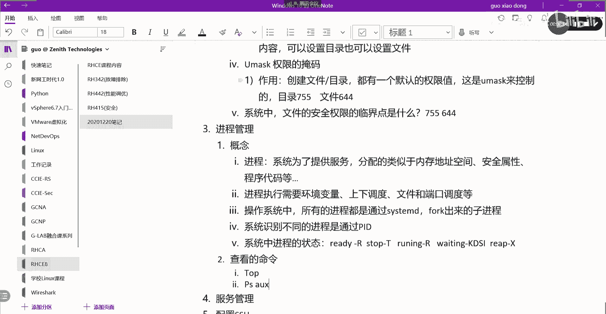

# 【Linux／RHCE／RHCSA】零基础入门Linux／红帽认证！Linux运维工程师的升职加薪宝典！RHCSA+RHCE／14-管理进程 - P1 - GLAB郭主任 - BV1Qw411p71R

好了吧，那我们来看进程管理，接下来跟大家聊一下进程管理，进程管理其实比较简单，我觉得这块内容大家了解一下啊，就是怎么去查看进程，怎么去了解进程，我估摸着这里的内容20分钟应该就够了，所以大家听听啊。

相对来说比较简单好，首先还是从概念的东西现在说起啊，好第一个我们讨论到进程管理，其实在系统里头如果不跑进程，这个操作系统几乎没啥用对吧，所以系统最终是为进程是为服务啊，来提供一个平台的对吧。

那么在系统上我们如何去管理进程和查看进程，这就是我们这一节需要关心的内容对吧，OK所以进程是个什么概念，我们先要理解进程是系统对吧，我们自己用自己的话写系统为对吧，服务也好，为呃系统为了提供服务。

提供系统，为了提供服务啊，呃系统为了提供服务，然后呢分配内存的地址空间，还有什么安全属性，分配的类似于内存的地址空间，还有什么地址空间对吧，还有什么安全属性，安全属性等写两个不能用，等是吧。

安全属性还有什么程序代码，程序代码，这现在写个等等对吧，完蛋了，这句话怎么把通起来，系统为了提供服务啊，像分配的这个内存安全代码等，那就等吧，好吧，然后继续，然后进程的话它需要什么，进程的话需要环境。

包括执行，需要一些环境变量啊，进程执行，进程执行需要环境变量的支持，喝完环境变量对吧，上下调度，上下调度啊，这些这个文件和端口调度，文件和端口调度等啊，这些一起一起协同工作，好下边一句话比较重要。

就是在我们的操作系统当中，操作系统当中，操作系统中所有的进程，所有的进程都是都是通过祖宗进程，都是通过一个主进程，这个主进程叫system m d s y s t m d都是通过他。

然后通过一个一个关键的操作叫fork f o r k，通过fork应该叫分支是吧，通过这个system d作为他的最最核心的一级进程，叫父进程，所有的进程都是通过他fork出来的，fork出来的子进程。

fork出来的子进程，那子进程OK都通过它来复刻出来的子进程，所以如果说LINUX操作系统上，第一个进程就是CSMD，对不对，对了吧，操作系统上LINUX上第一个进程就是system d。

其他所有的进程应用，都是通过这个system d fork出来的，像一棵树一样一级一级的分支出来的，这个能听明白吗，OK好下面还有一句话，就是每一个进程系统识别不同进程，是通过什么识别的。

系统识别不同的进程是通过什么，PDPID叫process id吧，PID来来来识别的，这个听得懂吗，这个是PID来执行的，好下边有一句话，好下面一句话，下面这句话是系统的，系统当中进程的状态包含什么。

系统中进程的状态啊，会有哪些呢，首先fork出来的进程之后，我们如果这个已经已经ready了R1REATY，如果是一个ready的进程，那么它就是大R这个几个特殊的标志啊。

如果他stop s t o p stop进程应该是这个大R哎，大儿好不好，好如果是stop stop，那么它就是T对吧，那么还有呢如果是running呢，running的，它是ROK好，下面还有啊。

还有VT，就是有些进程进程和进程之间它是有等待的，因为进程不是一个独立的，它是多个进程协同工作的，他可能会中间会有一些waiting的状态，这个waiting的状态就多了。

它有KDSI这些都属于在waiting的进程，明白意思吗，OKOK好，最后一个如果是一个这个停止的进程，我们就给它叫X进程，它叫它叫REAP配X进程嗯，就退出了一个进程，差不多就这些吧。

这是我们进程的状态好，然后呢，我们来在系统当中去查看进程的几个命令，我给大家简单解释一下，查看啊，查看的命令大家应该知道的，第一个叫top对吧，来我们看一下。

查看这个进程，当查看系统当中的进程，我们可以通过top看到了吧，top当中啊，其实大家要会用top是一个实时的进程的状态啊，那么能够在这里看到的这个4S就是state，就是我们刚才总结的一些状态。

对吧对吧，IMI可能就是在waiting的状态啊，有些进程在waiting的状态，那么这个地方可以看到很多的CPU的利用率，还有内存的利用率啊，这些都是我们看进程使用的状态，这个没什么问题吧。

好还有呢退出我们可以按Q就退出了，PSAUSPS也是一个命令，可以看到，那这个就是看它的静态的，它不是实时的，在这里看到的状态就更详细一点，会看到我们的所有的进程对吧，会看到我们所有的进程。

那么负最主要的进程就是它了，它是我们第一个进程，PID是一吧，就是system d看到了吧，system d所有其他的进程都是从他fork过来的啊，都是从那fork过来的。

所以看的也是CPU和内存的利用率，其实我们作为运维人员，主要看的就是系统的资源利用率，看这个有些进程是不是占很大的资源。

可能就需要去调整了，top p s a u x k好，那么在在这里的话。

刚才我们的这个输出当中，有一些要简单的介绍一下，第一个第一个是哪一个用户在用这个进程，就是哪一个用户在用的进程，第一个是user吧，第二个叫进程id，这个看得出来，第三个是CPU的使用率。

也就这个进程所占用的CPU的使用率，第四个是memory的内存分配情况，第五个是呃，就是TTY啊，这个是TTYTTY，这个是通过哪一个线程进来的，控制终端进来的，然后这个是他的状态，这是他的状态好吧。

简单了解一下啊，这些只是简单的了解，然后关于PS大家怎么去用它，它还有很多选项，我们可以通过map去看一下，然后EXAMPLE在我们这个命令，这个要大家经常用啊，很多命令大家不记得参数。

它里面自带了查找的example，在搜索main的这个搜索以后，直接在斜杠里头搜索example，他就给你列出来一些常用的选项，自己去看，好不好，再来一遍啊，Map，然后斜杠调出搜索栏。

大写的LEXAMPLE回车。

就能够看到一些常用的常用的举例啊，常用的例子好不好，没什么问题吧，好接下来这是常见的命令啊。

这是常见的命令，接下来在概念当中我们还继续往下说啊，再继续往下说，这个是说点啥，我看看应该是进程和我们控制终端之间的调度，举个例子啊，直接先举个例子吧，好不好。

比如说我现在在我的这个里边，我创建嗯，12341234，然后呢它有一个关键的符号，就这个符号，这个符号就代表的是，我创建了一个sleep的进程，再去处理它，是一秒钟输一次，一秒钟输一次。

然后后边这个符号代表的是，我让它在后台运行这个进程，好，怎么看后台运行的进程，我们用jobs可以看到后台正在运行一个进程，听懂了吗，其实我们操作系统上呃，某些应用。

它其实没有必要在我们的share的前端给大家展示，我们可以把很多开发好的代码，直接用这个这个特殊的符号把它放在后台运行，然后通过调用出来看看后台所有运行的进程，能理解我意思吗，各位好，然后呢。

看到以后我通过再来一个命令，叫FG杠百分号一好，这个时候我就要把后台的这个进程，这个是1%，就是这个进程把它调度到前端来显示，能听明白吧，FG送到前端来显示，所以还是一个进程，只是告诉你在后台显示。

在前台显示啊，查看进程就这三个命令，明白我意思吗，好，然后我想因为在前端显示你的希儿的这些命令，你就操作不了其他东西了吧，所以你要按CTRLZ，这样的话他就帮帮你停止了，直接在前端控制停止了这个进程。

我们再通过dB看一下DBSDBS，看一下他这个程序是不是stop啦，听了吧，好能明白我意思吗，好停止的这个进程，我们是不是可以用刚才的PSJ去看一下，有一个sleep的进程。

显示的是TT是不是waiting的一个T，是一个stop的状态，不是问题啊，stop是不是标志，是不是T啊，看了吗，所以这几个命令大家应该都比较简单，只是查看啊，只是去查看好。

那么如果我想让这个继续在后台运行，我用BG百分号一好，这个时候我再用DBS，看一下这个进程在后台又运行起来了，有没有问题啊，没有问题吧，好不好，然后再把它调到前台来运行，还用什么FG百分号一。

是不是又要用到前台来运行了，CTRLCCTRLC是什么结束进程，我再用jobs看一下还有没有进程，后台在运行了。

没有了吧，没有了吧，所以这几个命令啊大家自己去看啊，总结一下啊，首先我要用这个特殊的符号，这个特殊的符号是在后台，运行进程对吧，然后jobs呢查看进程对吧，然后FG呢FG是调用到前台来运行进程吗。

FG加百分号加一个N，这个N就是进程号，就就就前面的这个号，刚才看到的那个号啊，好然后呢这个是在前台运行，前台运行还有BG呢，百分号N，这个是在后台继续运行，就这么多吧，还有几个快捷键，CTRLZ暂停。

CTRLC终止进程，没问题吧，我觉得这个应该很简单的说。

啊都是job job，是看现在正在后台执行的进程，不包括前台，不就呃不包括前台，前台在运行的时候，你是没办法输命令的，跟希尔交互的时候，你是看不到的，当然如果你重新打开一个希尔的窗口，也是能看到的。

所以说前台后台job都能看到，他只是告诉你，这个现在正在处理的执行的进程有哪些，这个进程可以是在running的，也可以是stop，可以是在后台运行的，也可以是在前台运行的，呃，啥意思，没听懂。

突然没抖啊，好不重要不重要，听明白了啊，好好继续。

那么这些东西大家自己去看啊，然后我们如果说你开发了一个程序啊，你想在LINUX系统上进行跑，那要要看它的程序，那么你可以把它放在后台，然后去查看它的运行状态，去终止，去暂停，就这些就这些好不好好。

然后呢，接下来我们来看它的状态状态啊，嗯中断进程，我们通过cue中断进程，可以通过Q来中断进程。

那么进程的中断它也可以有一些相应的命令，叫KOGA，看一下这里头一大堆东西啊。

那这些前面是它的简介的代码，后面就是它的这个指令，你通过Q加这些指令，就可以对进程做一些相应的操作，在这里我们简单给大家讲一下，一叫什么SL，什么挂起，明白吗，二呢SIGINT这个叫键盘中断。

K3呢键盘QUIT是什么，退出吧，键盘退出18STITCONG是什么，继续吧，continue吧，这是continue的意思啊，很多大概能猜到个大概九，kill是什么，终止程序吧，终止程序好。

stop19停止吧，明白吗，好停止和中止的区别是什么，刚才有没有看到我停止一个程序之后，还可以继续让他running是吧，那只要终止一个程序，它就没办法继续running了，听懂了吗。

快捷键CTRLZCTRLZ是中指一样的呀，CTRLC是cure吗，CTRLC就是这个直接终止程序了，对对对没错，然后这个这个停止啊，停止是是是CTRLZCTRLC是cure，好吧，明白了吧好就这几个。

我们来简单举几个例子啊，中断，比如说啊我们来看一下，还用这个s l e p sleep1234，我们放在后台运行对吧，然后jobs看一下好，现在呢我们通过kill呃，如果如果我要让他停止的话。

我通过kill这个stop19吧，好NO NO NO NO，进程id q后面跟的是进程id，或者他还要他一定要指定我的进程id，我进程id p s杠AUX看一下进程id。

或者说PSJ看一下sleep他的进程id是多少，这个吧2758是吧，好Q是这个是个2758PID哦，3079，不好意思，3079啊，应该是3079，然后加先加信号代码十93079job，DBS19是啥。

停掉了是吧。

好直接停掉了，看没有了啊。

3079，他直接就终止了是吧，跟我刚才的好像有些区别对吧，那他stop和Q应该是一样的，直接就终止了，那我继续啊。

我看看能不能让他继续继续，是continue continue在几来着。

18是吧，OK来18，哦那就不能继续了是吧，不能继续了，然后再来看一下啊，看完了暂停应该有一个键的，那它就不是暂停，它就不是暂停，看看挂起是一，我试一下啊，KILLUPSJ看一下。

现在变成了新的进程号，3084kill18呃，一对吧。

30843084，然后ROS。

然后continue是18，NO不行，所以KER这个单里面他应该有挂起的。

不太记得了，好像一也不是挂起是吧，我找一下，忘记了，终止键盘，停止挂起。

直接全部终止掉了好了。

没关系，不重要，一会我找一下他肯定有的，Q里面应该肯定有挂起的，我们来把Q里这边的命令给大家写一下啊，我可以直接kill pad，这样的话就直接把进程它默认就是kill掉，杀死就直接关闭进程，OK好。

第二个我可以这几个命令差不多啊，我可以cure这个比如说信号的编辑代码，比如说十九十九就是stop对吧，然后再去加进程id就可以把它关掉了，好还可以呢。

kill这个后边的关键字就是string这个关键字，SIG什么什么什么什么大写的，SIG什么什么什么，对不对，然后加PID啊，这也是可以的，就第二个第三个一样的数字，不需要不需要加横杠啊。

还有一个q or Q2，就是加进程的名字。

Q2试一下能不能用s l e e sleep，1234加，放在后台运行，然后PSJ看一下啊，key l o诶，这个好像不能用SKRLLOQ2试一下，没有发现加进程的名字，进程的名字是，不对不对。

加进程的id31083108，我试一下这个名字，Q号这个命令上次我也没打出来，不知道是在哪打的，Q2是直接全部关掉，然后呢这个那就先不记吧。

这个好像我也没试出来，不管这个or就是把所有的进程都关掉，但下面一个是可以也是比较常用的，叫PQPQ杠U加用户，这个是比较常用的，就是结束这个用户下的所有进程，结束这个用户下的所有的进程。

OK来我们试一下啊。

结束这个用户下的所有的进程，我们可以送到哪里呢，送到俱乐，GLABGL4吧好吧，然后我们在这里开一个四，然后放在后台运行好，退出来，他肯定在后台运行吧，PS勾能够看到sleep是呃。

我们可以通过叫PSAUX吧，可以看到，你看啊是不是以GLB4在运行这个进程啊，对不对好，那么我们可以通过p tr对吧，加杠大U加GLB4，这样的话我们再来看一眼有没有sleep，GLA4了，明白了吧。

这个比较常用，结束某一个用户下边所有进程，你觉得这个用户很可疑。

你就把它禁掉，全部干掉对吧，全部干掉，就是这个P是小写，OK然后我们最后再给大家普及一个进程数的，PS去PSG啊。

看一下它，它是看它的所有进程数，P s t r e e p，呃看SYSTEMD查看进程数哦，在这能查吗，我看看，也补不全，想PSGPS不对呀，main p s去啊，没有没有这个命令算了没有。

这个命令可能是我记错了，PS去啊，没有没有就没有吧，就这几个啊，常见的管理操作就这几个好不好，就这几个，然后呢我们呃top再给大家详细说一下。

top其实很管用，top它是一个实时的，这里大家需要自己去操作一下，大家看实时监控图，我按个W，我按个W，W command a require，或者按P看看啊，这是怎么按的，按L。

退出来很多命令记不住啊。

我们make一下top，然后在下面会有一个他告诉你会有一些操作。

稍等。

哪来的，嗯我记得就在上面。

稍等一下啊。

这么多。

不管了，top啊，还是来看它有LT啊，看一下TT的话。

你会发现有些变化，有没有发现看一下T，然后呢再按一下MM它会帮你memory的形式啊，就是这里这里会看到有一些变化啊，就是你可以按一下快捷键，像L啊T啊。

MLTM他会summary出来它的load的一些，就是它的负载的一些平均值，T呢就来给你列出来CPU的一些平均值，m memory的一些info啊这些东西，然后呢好K呢，我们来看一下K。

我可以在这里直接K掉K掉某一个进程，看到了吗，我按一下界面的K他就出来了，他问你要K掉哪个PID对吧，是可以K掉某一个PID的好，然后呢也可以用R而是也可以去一样的，也是一样的，然后Q就是退出了。

我刚才讲过了，然后SD或者S用的会比较多，D看一下D不是推出来，d d d change delay for多长时间，就是你看它的刷新的时间，它默认是三秒，你可以把它改的快一点。

或者改的短一点或长一点都可以，所以其实top他给你输出的是一个实时的界面，我们可以在这个界面做很多事情。

备注一下，第一个啊叫LL是干嘛的，小写的LL是看负载的平均值，负载的平均值，然后呢还有TT是看它的CPU的状态，CPU的状态直接在界面键盘上打T啊，还有一个M是看内存的状态，OK这是第一个。

第二个我们可以直接K掉key，就是直接kill掉某一个进程，OK好，然后呢嗯DD就是显示刷新时间调整，调整显示的调整，这个刷新显示的刷新时间，这是我们的D好，最后Q直接就是退出top的实时界面。

退出退出这个top的实时的界面好，差不多就这些吧，差不多就这些top现在常用的应该就这些了，OK应该没有什么其他东西了，好吧好，那么关于这一部分的内容应该不难，主要就是大家熟悉像我一样啊。

去熟悉这些命令很多的这个调呃，因为我们我们用的最多的，应该就是直接KO掉某个进程，或者KO掉某一个用户的所有进程，这个是我们用的非常多的，然后P啊top啊，就只是看看，只是看看查一下。

但是有很多细节性的东西，在我们的练习题当中都有，所以这一部分的练习，请大家去做260页的开放性练习，他把我这边讲的所有的东西都在里面都有，他把我这边讲的都有啊，像这种内容不是太难。

而且平时用的也不是太多的，只有通过练习题来让大家加深印象，好吧，这个其实不是很难的，也没什么，我觉得没有前面权限重要。

