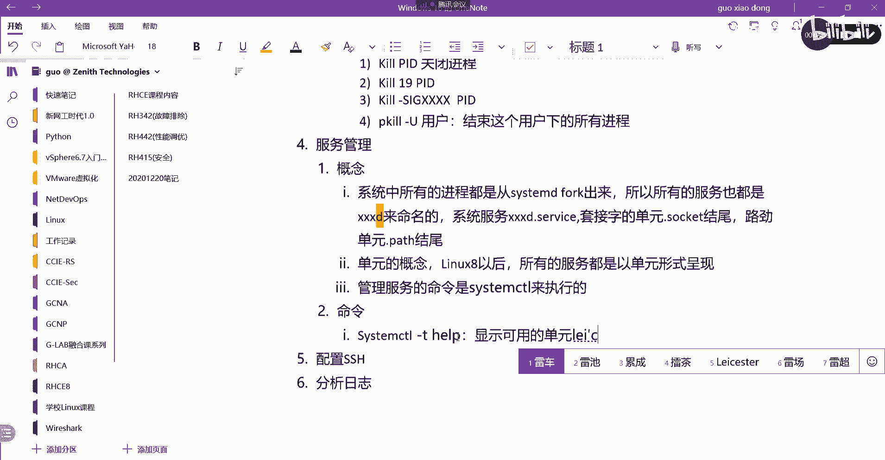
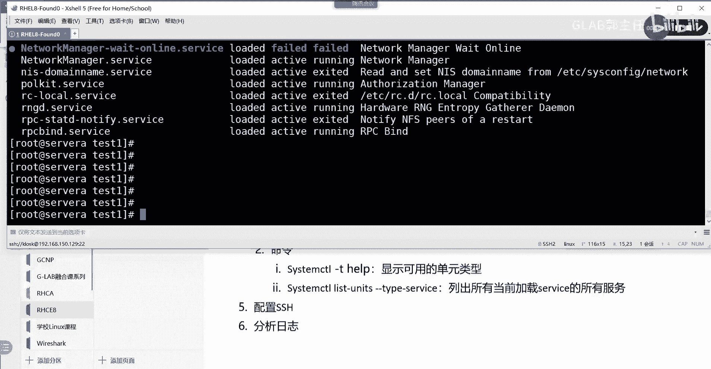
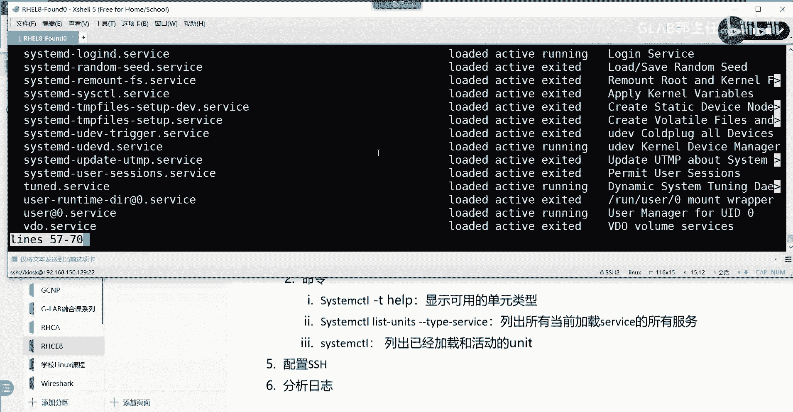
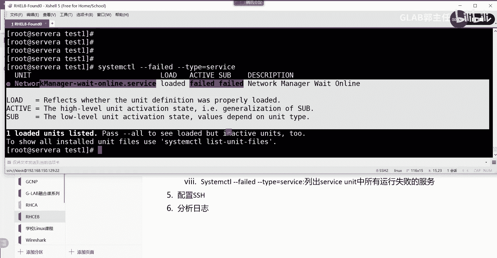

# 【Linux／RHCE／RHCSA】零基础入门Linux／红帽认证！Linux运维工程师的升职加薪宝典！RHCSA+RHCE／15-管理服务 - P1 - GLAB郭主任 - BV1Lg4y197Fx

好继续，接下来我们来跟大家聊一聊，聊一聊我们的服务，这个还是蛮重要的，我们系统当中的服务该如何去管理对吧啊，服务和守护进程，我们所有的进程都是通过system d啊，fork出来的对吧，所以概念。

系统当中的进程，最终会以服务的形式在系统当中进行对吧，所以所有的系统当中，所有的服务，怎么去写啊，还是用自己的话，系统中所有的进程，都是从s y s t m d fork出来的，所有的所以啊。

所以所有的服务也都是什么什么什么，什么D来命名的，所有的服务啊，比如说auto fs，它是什么auto f s d system这个服务system d对吧，包括HTTP服务叫HTTPD。

为什么后面都要加个D，是因为他所有的进程都是从他fork出来的，那么其他所有的进程都是从那过来的，所以服务的名字也都是以什么什么，什么D结尾的，所以大家千万不要忘了明白意思吗。

都是以什么什么点D来结尾的好，这叫系统服务，系统服务都是以什么点D来结尾的啊，所以系统服务都是都是什么什么什么什么什么，什么地点s EV i c e service来执行来结尾的，OK好。

那么接下来还会有一些套接字的单元，套接字单元是以socket结尾的，这边也写上吧，虽然用的不多，套接字的服务单元啊，都是以这个点socket socket结尾的，OK都是以这个单元来结尾的。

路径呢所有的路径路径单元都是以点pass结尾的，好，所以其实在服务里头它有一个非常重要的概念，叫单元的概念，在LINUX8或者叫七啊以后啊，尤其是八八以后，所有的服务所有的服务都是以单元的形式。

都是以单元的形式呈现的，unit对吧，都是以unit形式呈现的，这个是跟以前不太一样的，以前服务是单个的，现在是把服务做成单元的形式来做的，OK做成单元的形式来做，但是这不重要，没关系。

我们去开启一个服务或者是调整一个服务，我们区分这个服务是这个服务，一定是点service结尾的系统服务吧，设备是结尾的好，那么接下来给大家讲一下，监控这个管理的这些单元会有哪些东西，直接命令。

因为这个只能通过这个来看啊，哪些命令呢，看s y s t e m d system，它管理是用的system t2，这里要说一下啊，管理服务的命令是在，管理服务的命令。

是适用这个SOSTMCTL来执行的，管理服务是通过system c t2这个命令来执行的，它就可以管理所有的服务单元，就用这个命令来着，前端啊，就是在前端让我们对服务进行管理。

就是用system c t2，现在就是用它来执行的，能理解吧，所以我们所有的命令都是以system c t2开始的，OK好，第一个杠t help，这个是什么，显示可用的单元类型。

显示可用的单元类型，来我们演示一下。

SYSTEMCT2啊，杠THERP可以显示你所有可用的啊，我们服务就没有那么复杂了，他会把所有的服务分成unit，还放在unity里面，每一个服务都会放在unity。

你看这个service就是我们可以认为系统的服务socket，就我刚才讲的对吧，device的服务，Swap，内存交换分区的服务，pass的服务啊。

这些东西看到OK，所以现在的服务在最上层会清晰。

会非常清晰，因为它是都是以unity的形式出现的，这个命令是看所有这个系统可用的服务。

第二个S8STMT2，这个是叫list l s t list gunit u n i t s叫units，杠杠t y p e type等于VICE，请问这个是什么作用。

service是列出所有当前加载service的单元的服务，列出所有，当前加载service的所有服务。

OK看一下SYSSYSTMT2，list gun units对吧，然后我们指定要看哪个服务的单元，通过type类型等于SERVICE等于service，所以就看得很清楚，能看的很清楚吗。

各位在我目前service的这个unit里面起了哪些服务，大部分都是以点D结尾的，大部大部分都是以D点service结尾的，D点service。

我说的是大部分明白这意思吗，OK所以是以这个服务的单元。

显示这个service服务里面有哪些服务，在单元里面再去区分服务。

第二个第三个嗯，S y s t m ctrl，这个是列出已加载和活动的单元，列出已经加载和活动的单元，就是unit unit。

直接system t2SYSTMT2。

这个代表的是已经活动的啊，就是已经在在加载的，已经load的，并且active当前所有的好不好。

继续把这些命令都给大家列出来啊。

再来看看啊，继续啊，S y s t e m c t l，STATUSSSHD点SERVICE，这查看查看这个服务的当前状态，当前状态这个简单了吧。

看啊我想看SSHT这个服务有没有起来，SYSTEMCT2STTATUS呃，呃SSI去地点service，是吧，这个服务是不是active running的对吧，是这个是通过这个命令来看。

所以如果你的一个服务我们无法访问。

所以先看你的服务是不是状态是OK的。

主要看这里啊，能听懂吗，好继续，还有SYSTEMCT2，我们看一下is杠active，大家猜啊是什么意思，SSHD点service是什么意思啊，他说这个服务是不是active的，对不对。

Is active，然后呢is enable，Enabled，不好意思诶，D n a b l e s s h d，啊是enable的啊，不是enable好，请问active和enable区别是啥。

这里要写了二，Is is active，这个是什么意思啊，还有一个，Is，这俩区别是啥，is enable是开机，是否是开机自动启动，然后executive是不是现在是激活的，有区别吧，现在是激活的。

就代表开机是一定是自动启动的吗，不是吧，现在是好的，你系统重启了之后，如果没有设enable，那这个服务一样是起不来的，能听明白，所以这个问题大家很容易忘啊，在做后边的实验练习的时候，尤其到考试的时候。

很多人把服务现在是好的，为什么让所有人做完题一定要重启呢，重启重启之后发现不好了，大概90%以上，就是因为你的服务没有enable，是开机自动启动啊，好吧好，继续继续啊。

还有呢SOSTMCTLEFAILEDFIED，这说明是不是是不是挂了是吧，就不写了啊，然后最后一个SOSTEMCTR好杠杠，f AI l e d fire杠杠tape等于，VICE这个是什么意思啊。

列出，service单元中所有，运行失败的，服务，看到了吧。

最后一个我给大家演示一下，s system c t2杠杠f i l e d failed，杠杠tape对吧，type等于VICE，这个是列出所有的运行失败的服务啊，列出所有运行失败的服务。

好网络服务运行失败，所以这也是常见的查找错误的原因啊，你发现一个服务起不来，一个服务起不来，一个服务不能正常工作，他可能跟很多服务有关系，所以你要查看一下当前系统当中。

所有运行失败的服务，然后去找可能跟我关心的服务是哪些，听明白了吗，各位没问题吧。

好这个地方没有什么好讲的啊，直接就是因为控制服务的重启相关的东西。

就这些东西啊对吧哦，还有呢控制服务的重启是吧，还有呢来，system c t2啊，这里我就用用这个斜杠一起写了，STOP什么意思啊，停止吧，STRT什么意思啊，开开启吧，restart重启吧。

reload重启服务吧啊restart和reload的区别是什么，啊restore什么意思啊，restart是重启啊，他这个重启是需要从最初的最上面的阶段，去加载所有fork出来的进程。

这叫restart，明白意思吧，好reload仅仅只是去加载配置文件，就是你有可能有某些配置文件，仅仅只是某些配置文件更改了，你可以用让它重新加载，这个服务本身是不需要重新启动的，只是加载某些配置文件。

能听懂吗，各位好，这些东西我相信大家应该都会啊，应该都要会好，还有呢刚才讲的e n a b l e enable，开机自动启动，啊无所谓无所谓不重要好吧，挺重要的，这个少一个D完全完全打不上对吧。

第二个好不要较真，大家自己加上自己加上好不好，disabled就是关闭开机自动启动，能听懂我意思吗，OK就这些，然后加服务啊，加服务，OK好，在我们的最后给大家再补充一个服务的启动，的一个命令。

就是如果它有一个SYSTEMCT2，这个其实在有些时候也很重要，List depend d e p e n，DEPDENCISE叫depends，depends c r e s啊。

unit unit k大写UNIT这句话是什么意思，他要给你列出指定的单元所依赖的单元，列出指定的指定的单元所依赖的单元，这个能看懂吗，就有些单元的服务启动，是对其他的单元是有依赖的，对不对。

来我们试一下，叫SYSTMCT2，我们来看一下，让他list depends v i CES e r v i c e好，这个是没有的，来我们看pass看看有没有，指定单元需要的单元。

SHD点SRVICE好，就这样看的，这个是比较后面不是跟unit，是跟一个服务，他帮你列出来这个服务会跟哪些服务相关对吧。

这个跟服务啊，不是unit跟服务，OK听明白了吗。

这个也很重要啊。

好所以关于服务进程和服务也就这点东西啊，希望大家仔细看，把这些命令命令熟悉一下，服务练习是289页，就是熟悉system c t2相关的东西，没问题吧。

