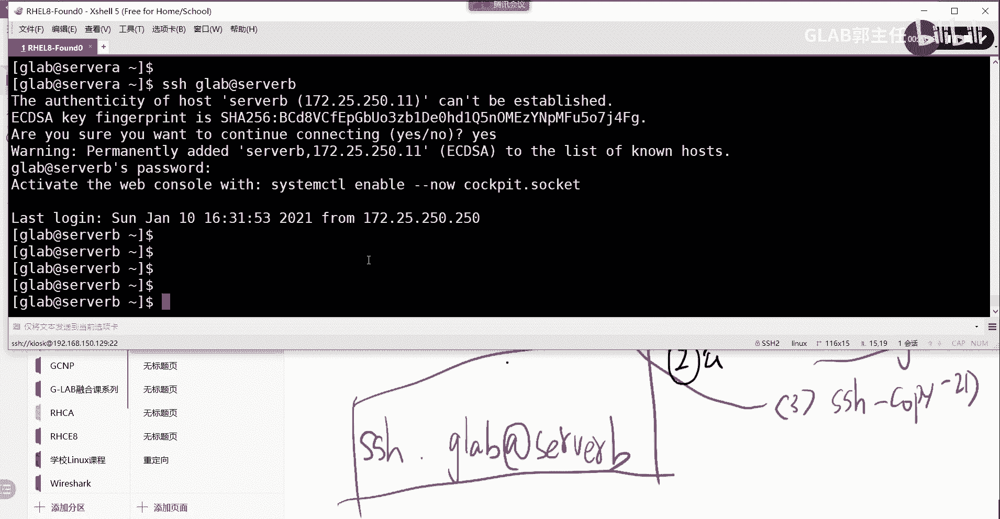
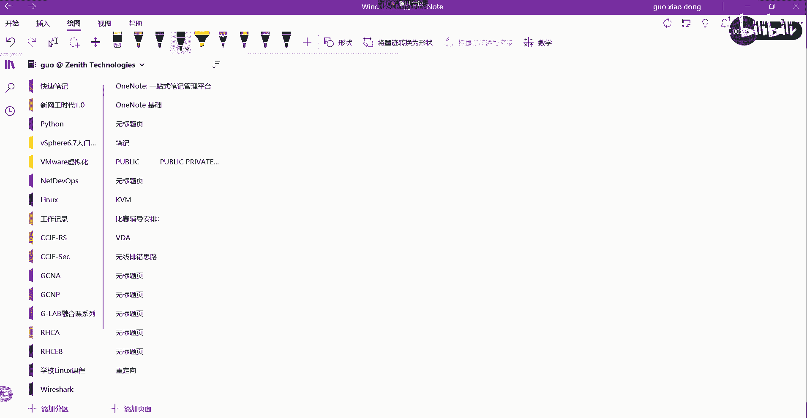
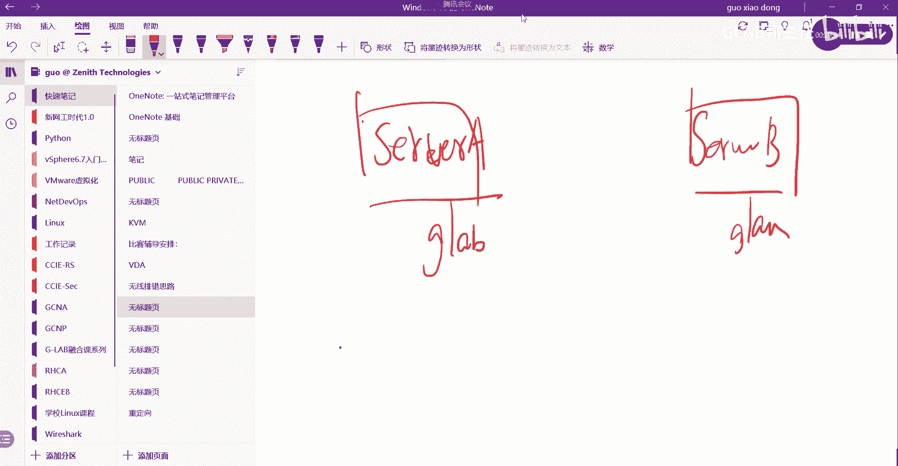

# 【Linux／RHCE／RHCSA】零基础入门Linux／红帽认证！Linux运维工程师的升职加薪宝典！RHCSA+RHCE／16-配置SSH - P1 - GLAB郭主任 - BV1jg4y1Q7LB

289页啊，这个是这个是管理服务这块东西，接下来我们要讲SSHSH这个后边会用到啊，会用的比较多啊，会用的比较多，那我们来简单的演示一下SSH。

这是呃我们退出来看，就这个其实默认情况下，LINUX操作系统SSH服务是开启的，我们刚刚是不是看到了吧，讲到了服务，我们可以通过system cd2去看一下TUS，去看看SSHD嘛，点service嘛。

对不对，默认是不是running的，我什么都没做，对不对，什么都没做，它默认是running的，OK好，那么嗯它默认就是running的，那么我们来把SSH的一些基本概念。

给大家总结一下，好第一个open SSH在红帽LINUX上实现SSH协议，所以在LINUX上的SSH用的是open SSH，LINUX上使用叫OP n open SSH来实现SSH的服务。

这一点没什么问题，第二个SS就可以实现远程登录管理，我相信在座所有人应该都知道S就干这事了，并且SH登录远程管理是加密传输的，听懂了吗，是加密传输的，也就是说SSH使用安全的加密方式。

实现了远程登录管理，这句话应该都能看到吧，既然存在加密，就一定会有加密算法，对不对，一定会有加密算法，那么有加密算法就一定会有所谓的公钥和私钥，对不对，好加密的公钥和私钥加密算法，既然提到加密算法。

就一定会有公钥和私钥，提到公钥和私钥，很明显加密算法用的是非对称加密，对不对，非对称加密啊，它一般用RSA非对称加密，SSA一般用RSA非对称加密好吧，所以这里要写一下啊，好那么既然提到公钥和私钥的话。

那我们就要去讨论了，SSH的客户端，它保存服务端的公钥，也就是说我要登录登录，你要成功登录你，我必须得要有你的公钥，能理解我的意思吗，各位OK，那么这个公钥客户端会保存在哪里呢。

好默认情况下客户端我就不写SH了，客户端保存SSH服务端的公钥，在哪个目录下面，在当前加目录下的点SHA小写点SSH，斜杠叫NOKNKNOWNKNOWN，下横杠就s st host中，来我们看一下呃。

现在现在我通过我通过哪里啊，我是不是通过这个foundation这台机器SSH到server a上去的，对吗，那么对于否定性来讲是client server，也是server，对不对，好。

也就是说他会把server a的公钥，保存在一个当前加目录的，它现在是加目录吗，对在这个家目录下面，要用A看所有文件有一个点SH有没有啊，啥玩意，有没有眼花了，看在这是吧，点SSH在这啊。

CD当前加目录，点SSH，点SHLL，是不是有一个有一个有一个NO nose host就在这，你能看懂吗，OK那么我们来cut一下这个文件。

cut k n nose host好，这一串就是我foundation保存的，在这啊，Sorry，应该是这段，这一段就是我server a保存，server a的一个一个一个公钥的内容。

就这一段能理解吧，如果把它删掉呢，v i am NO host好，我把它，删掉，然后，保存一下，然后再去cat一下，没有了吧，好没有了。

这个时候我再去SSH root这个server s e r v e r s a，会怎样会怎样，上得去吗，上不去上不去，那如果要上去怎么办，上交上去，让server a把公钥传过来，上去了吧。

是不是是不是上来了，上来了以后我再不上来了，好我退出来再看一下是不是多了，明白为什么会这样子啊，如果大家自己在做的时候，你会发现把这个钥匙清掉以后，你再登的时候。

它会提示你说server也给你推了一个公钥，要让你点yes，你才能登上去吧对吧，现在这里为什么不需要，因为我的环境啊，它就已经配了自动接收SSH的公钥，这个是做了配置的啊，明白如果没有做配置的。

两台系统互相登录的时候，有没有有没有印象，第一时间他会问你公钥推过来，你要不要好，你点yes，那就登上去了，它中间肯定有这个过程，只是我这里自动接收了，能听懂吗，很明显，如果没有对方的公钥。

肯定没有办法，SH听懂了吗，OK所以这个叫公钥所在的地方啊。

这个明白啊，好继续继续啊，相关的SSH的配置文件，服务端在哪里，就是服务器端的SSH的配置文件在哪里，我们来写一下服务端的SSH的配置文件在哪里呢，在etc下的SH下面的一个叫SH。

下面的一个c n f g configure和，还有一个在当前加目录下面有一个点SSH，这个目录下面有一个CONFIGCONFIG，这个是服务端的SSH的配置。

我们来看一眼，不在客户端啊，好登上来在哪呢，这里啊，CD当前目录下面点SSH里面有一个什么好，这里没有，还没有configure，哎，没关系，那么CD到ETC下面有没有这个SSH啊。

有的有没有SSH的configure呀，有的是不是这个啊，我们来看一下VIMSSH的configure，SSASHSH的CONFIG，在这这些命令是属于默认的配置啊，就是可以在这改。

可以在改一会儿我们会用到这个文件的，所以在服务端这两个文件，也就后边这个文件有可能有可能没有啊，你也可以去创建啊，没关系，最主要的文件就在etc下的这个CONFIG文件，听懂了吗，各位主要是这个文件啊。

应该是有的，应该是有的好不好，然后接下来服务端的公钥放在哪呢，服务端他最终要给这个客户推他的公钥。

对不对，服务端的公钥应该会放在什么地方，也要写一下，我们最好写在这吧，客户端的公钥放在哪儿，然后服务端的公钥放在哪儿，etc下面的SSH下面有一个叫点POB的对吧。

就刚才那个文件就在这这里头有一个P，所有的P都是公钥，看懂了吗，OK就是点PVP结尾的就是公钥，私钥，你是不能推给别人的，私钥推给别人就能对你进行解密了。

所以一般私钥都是隐藏的，你也看不到啊，系统里面好，这个是基本概念清楚了吗，好，接下来我们来讨论SSH身份验证的两种方式，SHSH孙粉燕验证的方式应该是两种，两种方式。

第一种最常见的我们是用密钥的身份验证，是有密码的身份验证啊，第一种应该叫基于密码的身份验证，对吧，我们通过密码的身份验证，密码的身份验证还要讲吗，太简单了，就LINUX装完它就自带了这个密码的身份验证。

就是我登进去之后让我输入用户名和密码吗，就这样啊，他会给你先给你推一个，用来实现通讯加密的公钥，你打yes好保存下来，接下来他会让你输入用户名，我用的用户名是root。

它会让你输入用root的密码是什么，听懂了吗，OK好这个就不去讲了，太简单了，第二种主要讲的是，第二种是基于密钥的身份验证，基于密钥的身份验证，这是另外一种验证，好这个密钥的身份验证的话是啥意思啊。

必要的什么原则来吧，我举个例子啊，我在这啊，我通过SSH到server a上，我再去SSH到server b上，我通过root上去server b哎，看到了吗，server b就提示这个好。

这个他让你是不是要接收，请问接收的是什么，谁的什么问你是不是要接受这个问题，要不要接受谁啊，server b的公钥没问题，Yes，好，这时候让你输密码，谁的密码，server b上root用户的密码。

所以这就是一个典型的基于密钥啊，基于这个身份密码的验证。

听懂了吗好，那在这个过程当中，请问啊，请问在这个过程当中有没有产生密钥，用密码验证有没有产生密啊，有没有产生密钥，其实是在问你有没有产生功效，有没有产生私钥，有没有有没有产生，你刚刚yes接收的是什么。

那就是了嘛，有没有产生产生了一对儿，是不是产生了产生了一对啊，产生了一对钥匙，我为什么要让要说这个，一会你就知道了，产生了一对钥匙，请问这堆钥匙用来干啥用的，加密加密SSH的管理流量吧，对不对。

加密SSH的管理流量听得懂吗，各位那么验证用的是什么，验证他的身份的合法性，用的是username加password，是不是这个意思好，接下来看基于密钥的身份验证好，基于密钥的身份验证跟密码的身份验证。

有一半应该是一样的，第一版上面一半应该是一样的，也就是说它一定有一个钥匙，一定是有一对钥匙是用来加密管理流量的，是不是来干嘛来加密加密SSH的管理流量，好验证就不是用密码了，他用的是另一对。

他用的是另一对的密钥，所以基于密钥的验证，它其实是有两把钥匙，两对密钥听得懂我意思吗，各位很多人搞混啊，他不是说有密钥吗，怎么你又得搞一搞一套密钥，他有两套密钥，一套是用来加密SSH管理流量。

一套是用来进行认证的，听得懂吗，好所以接下来我们就要开始做这个事情，我们来开始做这个事情啊。

他怎么做的，比如说现在我要我要在B上啊做这个事情，我要在B上做基于密钥的验证，但想想啊，如果做成功了以后，我通过HSHB的时候，还需要让我输密码吗，不需要了吧，怎么做啊，怎么来实现，接下来要做的第一步。

就是要在B上要产生生成一对新的密钥，它通过SSH key嗯，SSH kg kg是吧，生成一对密钥好，他认他问你呃，这啥这啥玩意，D回车回车，Enter the same，回车好生成了。

这时候我会生成一对新的密钥，能听懂我意思吗，好生成一对新的密钥之后，这对新的密钥，我是不是要把他的公钥要送给我的server a啊，对不对，是不是要把公钥送给我的，sorry啊。

所以我通过SSH杠copy d，在所有客户端上共享我的密钥诶，我看看啊，这个是咋做的，SSH copy id嗯，copy d要把我的公钥送过去，Root at server，好yes。

server redhat好，送过去了以后，我们这个时候server上应该就会就会有，我刚刚生成的那个送过来的，copy过来的新的一对密钥啊，那个公钥公钥还记得放在哪了吗。

CD etc下的SSH下面是不是有这个这个public pop key，都是都是那边送过来的对吧好，好，那么接下来我们要做的事情是，等会儿啊，送过来送过来了以后。

我们通过server h SSH root at server b，不对啊，这还是用的密码是吧，这个不对啊，我来看一下呃。

稍等一下啊。

来试一下，刚才是copy id过去了是吧，应该就可以了，但是我发现还是通过密码来登录的，所以我们应该在呃server a上重启一下服务，我们来重启一下服务，SSH的服务在这里。

S y s t e m c t2，我们reload s h d点service好，然后再退出来退出来，我们还是用root用户登录server b，REDHAT应该不对啊，还是用密码书就不对啊。

CTRLD我们把A上的服务也重启一下，TMCT2reload s h d点service，然后再来试一下，哪里不对，稍等我看看啊。

稍等一下啊，这个地方有点他有点烦，他这个实验，看一下应该是300，应该是这个第315页的这个实验，不是307的实验，我看315的实验，看customer用密钥，我网上看一下，稍等一下，307。

我看看咳咳产生了key，我看看我错在哪啊，我记得应该就这么多，这个用户好了，red heat没问题，然后送到啊，少一个东西，不少啊，哦指定S这个不对，这个不对，这个是另外的名字，这个是另外的名字。

然后又起了一个密码，copy d这个这个没什么问题，这个也没问题，299看一下，299，这个是干什么玩意儿来着，来我们把这个实验来，第二三百零七，我看一下啊，307，登录的用户啊，对。

我看看我的我的B是用的root拷过去的，考的是root，然后我在对啊，我在A上也是通过root登的呀对吧，所以这个应该是对的，通过root过去嘛，通过root来登，应该问题不大，应该问题不大。

好这样子啊，换一个好吧，其实应该没什么可能是root比较奇奇怪，我之前都是用的这个其他用户来试的，那这样子我们把B啊，我们登到B上，重新建一个用户user AD d对吧，我们就建一个GGLAB是吧。

然后呢给他一个给他一个呃，录一下再录吗，在录啊，然后给他一个密码，ECHOREDHATPSSWDGRAB杠杠，STTIN好好基于这个用户，基于这个用户来进行这个产生密钥，基于这个用户来产生密钥的话。

那么我们应该以这个用户登啊，输到GRAB这个用户上去，好在这里呢我们通过SSH叫key，才能产生一个SSHJOK，然后这个全模回车回车好产生了，产生了以后呢。

我们把这个钥匙通过SSH copy d送到哪里去呢，送到送到，我想想啊，我想想是在是在哪里送过来，应该是在是不是应该在server a上，应该在server a上。

所以是不是应该在root server server a上，应该在server a上通过SSH copy d，然后加GLAB加那个用户对吧，server b是在server b产生的。

但是我要把这个钥匙从server a登录下来，对的应该在客户端，应该在客户端，我们先来试一下好吧，诶哪儿不对，Server b，S h hope d，俱乐部server a哦，这样子是从服务器导过去哎。

REHT看一下啊，哎，是的，他不一定哦，他不一定有这个用户，是的嗯，那我再想想啊，嗯创建一个，创建一个用户，然后再退出来，稍等一下啊，b SSH copy id glb啊，好像还没密码是吧。

还忘记配密码了，A嗯，Password gler，reheart real hot好了，然后呢到B上来测一下SSH杠copy d嗯，把这个glb server a上，把这个copy过去，REDHAT好。

已经OK了，OK了，以后我们嗯退出来来试一下，通过不是root，通过普通用户GLB登到server b上去，哎对了对吧，就没有让我输密码是吧。

应该就这么简单，来我把这个过程给大家画一下，这个有时候容易搞乱啊，啊，花点时间来把它搞一下，server a和server b，在我们这个例子当中，server b是SSH的服务器。

后端server as我的客户端是吧，客户端O然后通过他去SHSH过来，现在怎么做呢，现在第一步，现在A和B上啊，如果要免密的话，也就是说如果要用证书来做来双方验证的时候。

他必须在两边都有属于G2边的普通用户吧，两边都得有一个普通用户叫GOAB，然后第二步是第一步啊，第一步两边都得有，第二步就是在服务端要通过SSH key基岩，生成一对新的RSA密钥吧。

形成一段新的rs m啊，第三步，通过SSH gucopy GUI d，把新的密钥的公钥啊送到啊，一定是GLB这个用户啊，新的密钥的公钥送到GLB这个用户的A上去，要送过去，明白这意思吗。

要送过来送过来了以后，接下来我就可以在server a上通过SSHGLAB，at s e r v e r b server b不需要输密码，通过密钥证书来进行认证，明白在整个过程当中，他应该有两套密钥。

第一套密钥，第一套密钥就是SSH本身的rs密钥，这个是用来加密的SSH的第一套公钥，第一个公钥明白吗，第二套公钥就是通过这里生成新的这套公钥，就是用来来进行验证的，这是用来进行验证的目标，没问题吧。

现在就是这样子的，所以应该有两套公钥，刚才就做这些事情，大家自己总结一下啊。

最终现象就是从A上通过一个用户登进去，不需要输密码到B了，那就对了，说明这是用证书来做验证的啊，卧槽看错了，大写的尴尬，来server a对吧，来再来一遍啊。

SSH g r a b at server b是吧，好这个这个没关系，这个是公钥接过来还是要密码呀，哪里不对。

我看看啊，这个过程应该是没有问题啊。

哪里不对，应该没问题啊。

暂停这个地方再更正一下，这个画画的真的是再说一遍，我忘记了，刚刚一直搞反了。

现在是对的吧，再帮我确认一下，没搞错吧，现在是对的啊，通过B去SH再测一下，通过B去s h server a没有任何密码提示，是不是密钥的好提出来，然后通过A去SSHB，那这肯定是密码的，这就对了是吧。

对了吧对了，再画一下，更正一下server server a server be，OK还是那句话，那server a上是一定要有这个用户了吧，GOAB要有这个用户吗，这个是不变的吧，因为从B上。

copy过去的，来吧，我把我再创建一个再来一个再来一个跳出来呃，user ADD glb1password俱乐部一，Red hat redhat，Ok，在B上创建一个GLB1A上，没有创建GLB1A啊。

A还是这个用户，但没有GWB1cut e t c下的password，是不是只有GW本，没有GW1好，然后我在B上通过SSH key产生一个，再产生一个新的key啊，我要切的切用户是吧。

切到记列表一下面去，我换了一个用户啊啊你能理解吧，SSH我现在在验证两边的key是不是都要有啊，两边的用户是不是都要一样好，不需要不需要不需要好。

产生了SSH copy id glb1at server a是吧，好，Yes，Reheart，OK那就对了，那就对了，对不对。

所以这个就不对是吧，所以这个还是要的两边都必须要有同一个用户，两边必须要有同一个用户，这第一步肯定是不变的，对不对，第二步呢SSH key产生，这个这个也是不变的吧对吧。

第三步呢SSH copy是不是也不变啊对吧，唯一变的就是测试，测试应该在这个地方测，应该在server，所以server是我的client，server b server a5的服务器。

这个这个能能能理解吗，Ok，好server，我是把客户端和服务器搞反了，应该就配置还是这三部啊，还是不变的，变还是不变，只是测试的方向搞反了，没问题吧，只是测试的方向搞反了。

OK好，那么既然做到这的话，我们再接着往下做啊，创建了一个GLB1，那么我们在这个地方也创建一个GLB1，创建一个user ADD g210好吧，然后呢我们也给他一个密码，因为也是需要的G210密码。

Red hat，Red hat，好好了吧，好现在呢我们重新产生一个密钥，S s h s h，专门给G代表应用的SSH杠key产生一个密钥，好回车好。

这里头他应该有一个名字的，我看一下啊，就是在产生一个新的密钥的时候，他的要求啊，包括业务，就这啊我产生哦。

他有一通过GF来产生指定名字的，应该这样写，也就默认不写，它会自动帮你取名字，我们通过key加一个杠F，指定这个文件的key的名字T2，对吧好，然后呢，我给这个密钥，我们可以给这个密钥配一个密码。

Red hat pass，再来一次，Really hot pass，我们也这样做好，这个时候我们CD到家目录下的点点SSHLL，看是不是有一个key啊，是不是有这个这个密钥，这个密钥是可以给他配密码的。

我刚刚给他起了个密码叫red hat pass，这个能听懂吗，好接下来我们用GLB1把这个公钥送到对方去，送到server a上去，SSHGUCOPYID好，通过杠I去指定我这个公钥的名字在哪里。

在SSH杠I啊，杠I杠I点SSA不能补全，杠SHKEYK2点PUBPUB对吧，然后送到哪去呢，GLB1at server a上去，这是GLB1啊，这个用户和GLB不一样啊，诶哪里不对，我是不是啊。

不是当前用户，我现在在的这个目录不对是吧，应该这样子才对，这样再打这一局就对了，能听懂吗，当前目录下的这个好，Red hat，送过去了，听懂了吗，就把这个公钥又又做了一把公钥。

针对某一个用户又做了一对公钥，把这个公钥就送过去了，好送过去以后，接下来我们可能在在这边，我们我们我们可能要要去指定了啊，我们在这里去指定SSH港I，因为你在公钥有特殊的名字。

你就要需要通过这个特殊的名字去指定key，这个就不是公钥了，这是私钥，明白的意思吗，我用本地的私钥协商去给对方通讯，就这个就这个，然后呢用g l b e at sover a，这个时候要输的密码。

就是你刚才对这一对密钥加密的密码，叫red hat pass，是不是上去了，听懂这意思吗，所以现在我演示的其实是两种，用两个用户用的是同一个密钥，同一种加密方式，但是不一样的是一个用户的密钥不带密码。

一个用户的这个公钥是带密码的，听懂了吗，啊啊明白吗，OKGLB1的这个一样是通过密钥加密的，但是它是带密码的，听懂了吗，OK还有一个是不带密码，那么这个做有什么好处呢，就是我们可以对密码啊。

可以对这对密钥来进行密码保护，但是你会发现密码是不是也要输啊。

密码也要输，是不是很麻烦，所以接下来他又做了一些改进，好来看啊，它有两种方式，两种呃，叫什么，可以对这个密钥进行密码的加密，是不是我刚才做的这个事情，可以对这对密钥进行密码的加密，我们在我们实验当中。

这个密码是用的really hate pass，这个密码来进行加密的，那么在进行验证的时候，在进行验证的时候就需要输入这个密码吧，是不是就需要输入这个密码，OK所以这是第二种，也可以不用密码。

但是我们如果用了密码，你就要先输入密码，OK那么有没有更进一步的改进，有叫SH的agent，就是我能不能在既对这个密钥进行密码加密，然后同时在经过验证的时候，不要让我输密码，不要让我输密码。

听懂这意思吗。

可以的，怎么做好在它叫SH的agent，它叫SH的agent，怎么做呢，是这么做的啊，叫叫叫叫他先这样做。

它叫先在这个地方通过SH杠I的这个命令，把点SH斜杠key two，SSH斜杠key two，哎，我现在A上不好意思要退出来啊，应该在B上啊，看懂吧，在B上通过SSHGUA。

在SH下面有一个key two好，这个时候他会让我啊，key to他说啥哦，他有他有一个要输入一个叫EVAL，要定义一个变量，要定义一个变量在上面，SSH杠I要先要先Z哎。

Not open connect auth，哪不对啊，我靠那个，应该是对的呃，EVALEVALS敲错了，哎呀不side啊，AGENT应该是agent对吧，这是一个变量，它内置的变量AGENT好。

这时候对了，然后呢，我们通过SSH杠ADD点SSH key two，这个时候会把密码保存进去，Red hat pass，这样子好，这个我先给你操作，然后告诉你这是什么原理啊，好把密码保存在里边了。

保存在里边了以后，我们再继续通过这个SSH杠I加这个俱乐部，一是不是就没有让我输密码啊，是不是就没让我说密码，这个能看懂吗，这是什么意思呢。

就是这个变量是它内置的变量叫SHAG啊，如果你这样打，就是调用这个内置的变量，然后开始通过SSHA去调用这个私钥，会让你输入这个密码，到这一步的时候，他就会让你把它，就会把你输的这个密码保存在内存当中。

然后接下来在登录的时候，他直接调用内存当中的密码就可以了，听懂这意思吗，所以就不需要再输了，只要这个电脑一直不重启，它这个密码就会被保存在这个变量里面，理解吗。

OK所以这样就做到了一个叫SH的agent。

给他整理一下，叫SH的做法是什么呢，它的实现原理就是把预先啊，预先把验证的密码保存在内存中对吧，然后在登录的时候直接调用内存当中的密码，所以不在需要输入什么密码，听懂了吗，就既做到了对密钥加密。

又做到了不需要输这个密码，所以这种方式本质上还是通过密钥验证的，还是通过这个密钥验证的，不是通过密码验证的，各位明白我意思吗，好没问题啊，这叫SH的，这个叫SSH的J好嗯，这个agent我就先说这么多。

然后后边还有一些改它的安全策略，最后给他做一些建议，SSH的配置建议啊，有几个，第一个啊，它的配置文件放在哪里，配置文件会放在etc下面的，SSH下面的这个不用说了，刚才说过了吧。

将SSH下横杠CONFIGCONFIG下面吧，配置文件在这儿啊，然后呢我一般会建议两个建议，第一个建议是禁用，禁用超级管理员root，使用SSH登录，超级管理员用户root使用SSH登录。

为啥禁用超级管理员root用户使用SSH登录，那么不能够SH登录，那么超级管理员，是不是只能通过线下到机房的方式去配置啊，对吧，所以你你你把远程登录，S远程登录的root权限禁掉，那其实是非常安全的。

就是很多黑客他是不能通过提到root权限，通过远程登录方式对系统进行破坏，听懂了吗。

OK那这个怎么做呢，这个在要改这个配置文件啊，我们要退出来改这个配置文件在B上啊，SU过来，REDHAT好，切到管理员，用户在etc下的SH下面的SSH configure。

这个文件里头它有一个叫permit p e r MIT，搜索一下哎，就这个叫permit，诶不对，permit root有吗，我看看诶，没有吗，我看一下啊，PERPERPERMITMTROT嗯，哪里呀。

Server b configure，赖在上面，pr root login有吗，再去D点可能有D3D加嗯，什么，SSHDSHD是吧，斜杠OOOT啊，在这啊，打错了SHD啊，对SHD在这啊。

差一个就有点区别啊，就这个默认就是你可以把这个permit root login，它默认是yes对吗，你把它改成NO，这个是可以这么做，可以把它改成NO啊，这样的话。

他就不能够通过远程登录的方式来进行操作。

对吧，这是第一个建议，第二个建议是什么，禁止禁止对SSH进行基于密码的身份验证，就是禁止，禁止对SSH进行基于密码的身份验证。

这个在哪呢，这个也在这啊，这个基于密码叫password验证的叫password验证，刚才是不是有找到啊，这个看到没，就这句话，把这个也改成NO password word验证，这个是基于密码的验证。

不用密码的验证，那就用什么验证证书吧对吧，证书是非常安全的，就是你必须要加载我的公有证书，你才能登登录我吧，那么让你加载公有是不是我给你分担，我要通过s h copy给你分公公钥的嘛，你才能才能登嘛。

对不对，所以证书是非常安全的，你只有封了的他才能登，没有分的，他登不了，而密码你只要知道密码就能登，密码还可以暴力破解是吧。

很多各种各样的方法安全，所以这两个建议啊，SH的一建议配置，那关于s h agent，就是要不要对密码密钥啊来进行密码的加密，再通过A键来做，这个大家自己看，我觉得挺烦的对吧，我觉得挺烦的。

大家大家自己看，OK好，那么关于SSH其实我们要说的就是这么多啊，大家在后面用的比较多的，即使其实是基于密钥的验证，密码的验证很烦烦在哪呢，同志们，反正你每次登录是不是都要输密码呀，后面讲的时候。

我们要不停的要登录到服务器上去刷它的配置，你每次登一次都要输密码，太烦了，所以到后面所有S架构都是基于密钥的验证，而不是基于密码的验证，这就减少交互界面直接在内部。

直接在直接在这个后台直接就把配置刷进去了，听懂了吗，各位SSH的实验我觉得都要做，除了299这一这个这个实验不用做，其他的我觉得都要做，307315321，那么如果实在没时间，你就把321做一下。

321是一个综合性的，它把前面的实验都综合在一起了，321啊，320一页做完好不好好。

今天果然还是落了一部分。