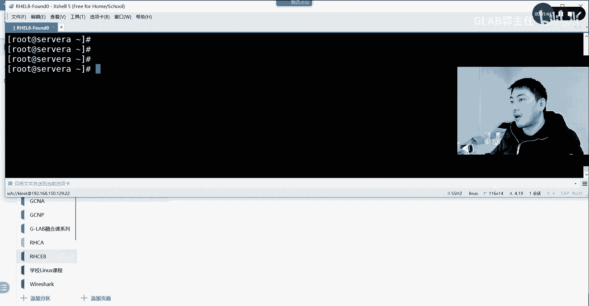
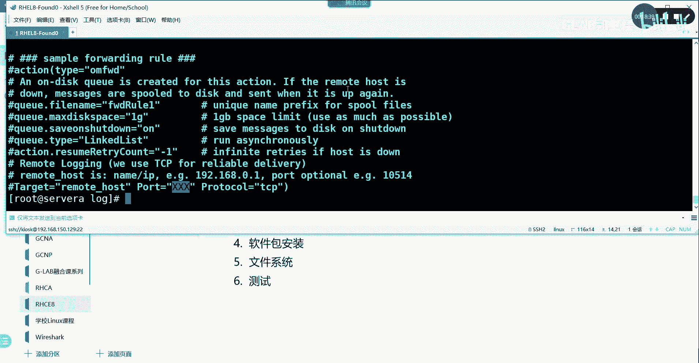
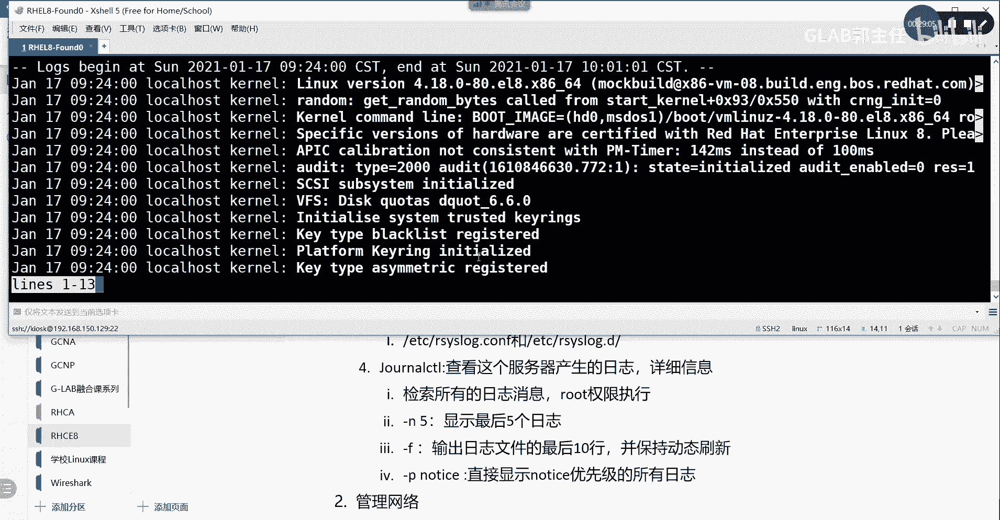
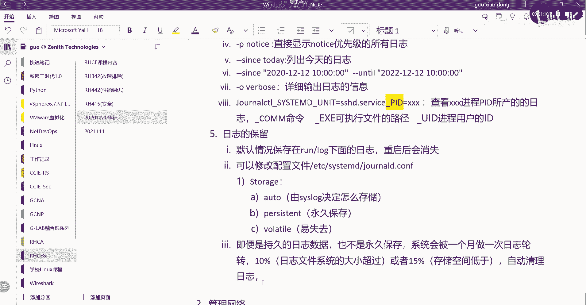

# 【Linux／RHCE／RHCSA】零基础入门Linux／红帽认证！Linux运维工程师的升职加薪宝典！RHCSA+RHCE／17-日志分析 - P1 - GLAB郭主任 - BV1Mc411X7ub

好的那我们就开始啊，日志分析，日志应该在我们上上节课会给大家讲，在说之前我们把课给大家说一下啊。

年前还有两节课，互联，今天我们上到我们上到1月底好吧，就是24号，31号两天二十四三十一，然后7号就不上课了，7号不上课了，本来7号排课的，有有一个同学从扬州来的票很难买，所以我想呢。

估摸着年前大家也没什么心思在上课，就上到6号，上到这个三十一三十一号，然后刚好六天，然后另外还有四天四天全部是s sport的内容，也就是四天的课全部讲294，第三本书的294。

第三本书刚好不要不要落了，到时候就全部放到年后一起讲，年前把前面两本书截掉，124和134，OK好，所以清楚了吧，我们课就上到31号啊，然后年后什么时候开课呢，应该在元宵节后边那周，大家自己看。

元宵节前面应该不上课，应该在元宵节后边那后边那一周。

好那我们开始。

先看第一个内容日志分析啊，你看我的环境起好了没有，server a嗯，好了好，那么日志分析这块主要在说啥呢，其实我们在运维操作系统的时候，更多遇到问题，看的是日志是吧。

所以呢我们现在需要呃，去知道怎么去管理我们LINUX系统当中的日志啊，而且我们需要知道我们的系统的日志，存放在系统的哪些目录当中，那么这些文件有什么样的特点，这就是我们这个小节要跟大家介绍的对吧。

OK所以我们要来看日志分析的第一个内容，就是它的一些概念吧，第一个日志分析适用于系统故障啊，或者审核的时候被叫叫被被查看的，所以我们会说操作系统发生的事件都会被日志，都会被记录成日志啊。

操作系统发生的对吧，操作系统发生的事件，OK操作系统发生的事件都会被记录成日志，用于什么，用于系统的，用于系统的审计或者叫审核，用于系统的审核或者排除排排错和故障排除，这就是我们刚刚讲的第一句话。

OK好，那么第二句话是，大多数的日志是以文本文件的形式来记录的，好大多数写的是大多数啊，大多数的日志是对吧，以文本文件的方式记录的，放在哪里呢，一般都会保存在我们的war下面，war下面有一个load。

保存在这个目录下面中。

这个要记住，我们不管什么样的系统日志，基本上都会放在这个里面，我们来看一眼，算了不要看我吧。

太烦了，挡老挡着我们那个是吧，其实我只是想讲的时候，顺便看一下自己，给自己提个神是吧。

好我们来看一下CD到VR上面的log，在这都会放在这个地方，看到没，这里头的日子有很多，比如说像起机用的bot就放在bot里面，另外还有我们呃，对系统所有的操作都会放在这个里面的，一些文件。

一会后面回来介绍啊啊好会放在这。

这是第二句话，第三句话，第三句话，红帽的LINUX是基于CSLOG协议的一个标准，日志记录的这个协议，要知道写的是红帽子LINUX，红帽子LINUX基于，当然其他的3S也是是基于。

是基于CSLOG协议来存储日志的，所以大家在起服务的时候，可能看到是c slog对吧，然后包含包含的有两个服务，一个叫CSLOG服务，还有一个叫system d的，后面有一个服务，有两个服务。

有两个子服务，对吧，这两个子服务分别是CSLOG和这个system d，下面有一个这个这个叫JOUR，J o u r n a l d，就这个服务包含这两个服务好，那后边这个服务主要是记录操作系统日志的。

一个核心服务，包含内核进程，还有守护进程相关的这个可以做个备注，这个服务主要记录主要记录的是内核，然后进程啊，然后守护进程这个进程主要是指守护进程啊，守护进程OK然后呃相关的一些日志啊。

然后呢这个进程这个服务啊，这个子服务主要是记这些日子，这些日子在run log上面，这些，这些日子一般保存在run run，我们知道的对吧，run就是系统开机的时候，所运行产生的一些系统日志。

保存在正在运行的操作系统，当一个load里面，OK但有一个注意点，这些日志重启之后就失效了，就重启之后就没有了，我们来看一下说的这些日志放在哪，就这个服务里面所存的这些系统的内核的日志。

都会放在run下面，我们CD到run，在这里应该有log log，有没有这CD的log下面去，在这好，就这个看到了吗，这个是专门的就这个服务啊，就这个服务我们来看一下。

这是我们系统运行运行产生的内核日志，一会儿会看这些文件啊，一会儿会看这些文件，这些文件当你操作系统重启之后就没有了，所以有些时候处理故障的时候，都会先问一句，你的系统重启过吗，重启过就很难找到。

原先上一次系统crash所产生的系统日志，因为它会消失明白吗，所以正常我们会把run下面的这些日子，做定期保存，它只是存在这里，不行的，重启之后就没有了啊，要定期把这些日子保存到另外一个地方去，明白吧。

是这样的一个安排，OK好，那么c slog服务服务呢，主要是对这个CSLOG的消息进行排序。

确定消息的优先级，这个要说一下，就这个服务，这个服务主要是来分这个消息的优先级的，消息的优先级，然后呢优先级一般分0~78个等级，说一个大家听到最常见的消息叫law，叫什么叫debug信息，记得吗。

debug这个就是我们消息分级当中，最上面的也是七级消息，这个数字越低，代表这个消息的这个严重程度越高，明白我意思吗，OK7级就代表debug debug的信息，他们有error的信息啊，对不对。

还有严重错误的信息啊，这些都在0~7这个等级里头，OK所以CSLOG它会对文件的，它会对所有的log进行进行这个等级的区分，而且进行排序进行优先级的列出来，明白好，这里进去了啊，0~7啊。

七个等级进行排列存储对吧，区分OK这个是我们的第三句话，第三句主要介绍了log是如何去呃存储的，有两个重要的服务啊，有两个重要的服务好，这第四句话会告诉大家呃，有一些特殊的情况，有一些，特殊的应用啊。

他们在存储这个自己日志的时候啊，他不是用的CSLOG管理他们的日志，不是使用这里的CSLOG来管理服务，来管理日志的对吧，他们是，但是呢他们的log也会被放在VLOGVLOG目录下面。

但是他们的日志也会被自动放在刚才的那个，wa log下面，好比如哪些服务呢，比如我们后面会给大家介绍到的，阿帕奇的web server服务，比如阿帕奇的，APCHE阿帕奇的web server的服务。

像这样的，这是一个比较，这是一个服务应用吧，算是一个包啊，服务web的一个包，这个包会包含很多东西，那它是一个大的服务，这种服务如果安装在我们LINUX操作系统上。

它产生的log不是通过CSLOG来管理他们，他们自己有自己的log记录记录的方式，但是他们不管怎么样去记录，它都会被自动放在VLOG这个目录下面，所以大家要查找日志就去找这个VLOG就可以了。

定期对VLOG和run log，下面的日志进行保存就可以了，听明白了，OK好，所以这是我们的日志好，那么我们给大家介绍这个概念啊，接下来我们来看呃，相关比较重要的一些日志文件，日志文件啊。

一个给大家介绍一下，首先第一个我们下面的log，下面呢有一个叫message m e s s a g e s好，这是第一个第一个目录，这个目录里边主要放的是呃系统日志，看清楚啊，给大家记录一下啊。

主要放的是系统日志，主要方式是系统日志，然后呢嗯接下来看第二个，第二个也有在VR下面的叫log，下面的有一个叫secure，大家看这个名字就知道是干嘛的，这个主要是放安全和身份验证相关的信息对吧。

安全的和身份验证，相关的log好，我们一起来看一下啊。

CDV下面的log，好CD的，它上面有一个message是吧，就这个就这个message。

我们可以去cut一下message，好这些里面所有的内容都是我们的系统日志，大多是我们系统的一些日志。

它记录了你起的什么服务，清空了什么样的嗯，嗯你看这就是不是清空掉了我临时文件夹呀，我们说tap目录是不会被临时清空的，明白我意思吗对吧，所以你所有的对系统的一些这些操作，都会被它记录下来啊。

你看啊他说开始清空临时文件，然后包括呃你你的一些其他的什么。

就更新什么东西啊，删除什么东西都会被它记录，能听懂我意思吗，这个叫message，第二个cat有一个叫etc，还有一个secrew s e c cs e c。

就这个这个信息，主要是记录了我们所有的登录的信息，你看是不是SSH的session建立了啊，我现在通过foundation来对它进行登录，他都会被这个这个这个文件所记录明白。

所以你可以通过它看到哪些人连上来了，哪些人disconnect了啊，是从哪个地址连上来的，端口号是多少，这个是原端口啊，都看得很清楚吧，所以这个是用来安全身份验证记录log的好，接下来第三个。

在VR上面的logo下面的有一个叫MELOG，这个一看就知道是干嘛的吧是吧，邮件服务器相关的，OK这个就不去说了，因为我这里没有邮件服务啊，好接下来第四个war下面的logo。

下面有一个叫rome chrome table，在我们下一天，就是接下来一周的一天会给大家讲到自动化，就是这个自动化呃，定时任务吧，我们可以去去去去按照我们的计划去部署，我们的操作系统相关的任务。

可以这叫这个叫定时任务，举个例子，就是我们可以在夜里选择去备份，我们某个目录下面的文件啊，夜里不需要你起来，你可以在我们的LINUX系统上写这个chrome，可以写定时任务，那他就在夜里给你去备份了。

所以这个目录所记录的这个日志文件，所记录的应该是跟调度相关的，chrome的一些日志信息记录调度对吧，这个调度指的就是我刚刚想讲的定时任务好，定时任务相关的日志信息，OK好，这个也比较重要啊。

这个也比较重要，现在还没有提到好，最后一个需要大家理解的，we上面的log，上面的一个叫bot点log，这个一看就知道这个是干嘛的，系统启动相关的系统，启动相关的，日志，OK好，那么系统怎么起的。

它是怎么启动的，都会被记录在这个bot log里面，大家可以看一下cut plog是不是OK的。

你看到没启动的过程。

它是怎么呃，去检测硬件的，启动所有的过程，检测的所有过程都会被记录在这个bot里面。

就记录在这里，明白吗，OK那么刚才说的run log，下面记录的是系统起好了以后，它的内存和进程调用的相关日志，听懂我意思吗，一个是启动好的。

一个是启动的一个过程，OK好。

那么这个是我们讲的第二个重要的日志文件，重要的一些日志文件，好吧好好，接下来我们来看第三个内容，第三个是我们要介绍这个日志文件的配置，重要的日志文件的重要的日志配置啊，叫什么，重要的日志配置文件。

OK好第一个刚刚说到CSLOG，把日志分成0~78个级别对吧，那么这八个级别是CSLOG这个服务来执行的，那么跟这个文件的log相对应的，这个等级配置文件在哪里呢，好这个重要的第一个重要配置文件在哪里。

在etc下面，我们说过etc下是不是都是放很多配置文件，对吧好，那么它的叫叫r s y s log，是通过这个点CONF，通过这个文件和这个目录中的嗯。

我们先来看这个文件吧，这个etc下载r slog configure，CD或者叫VIMETC下的soy log，点CONFIG这个文件就这个文件啊，这个文件里头有很多来我们看啊，它有一些定义啊对吧。

你看他用的是什么样的服务，在这里有定义，然后呢这个也是它的一种服务的一个定义，include什么文件，然后来看这里是不是有定义呀，看我把他怎么就知道，把系统相关的一些日子送到message里面去的。

他会在这里有写，他把所有点什么什么什么ml的，是不是这里会放一些mail相关的，会放一些这个验证，Chrono，就这些所有的文件后缀，都会被自动送到message里面去，所以就在这体现的。

所以这个配置文件决定了message，里面能统计哪些信息，包括SQL相关的，看到没，OK然后这个就是后边是他的一些级别啊，后边就是他的一些级别，然后呢mail rome这些都在里面能看懂吗，能看懂的吧。

就是我们刚刚所说的那几个重要的日志文件，是怎么存放日志的，在这个文件里都有最明确的体现，如果你想改，想改它默认规则，就改这个文件啊，就改这个文件好，其他的我看看没有了，这第一个重要的文件，第二个第二个。

还有一个文件在还是在etc下面，etc下面有一个r s y s log点D，这是一个目录。

在这个目录下面有一些可以自己去创建啊，可以自己去创建相应的这个文件看一下啊，CD etc RSS点D里边现在应该有一个就是这个，那么你可以在这里去创建属于自己的配置文件。

这种配置方法跟我们之前讲的有一个叫VISUDO，是不是很像啊，速度大家还记得吗，速度就是呃获取你可以去配置普通用户，获取管理员的一些命令对吧，我可以直接去改we so door的一个大文件。

也可以在搜DOA点D的一个目录下面，创建自己属于用户的单个文件吗，对这里的配置方法跟那边一样的，所以你有两种配置方法。

一种是可以直接改大文件，一种是可以诶，是断了吗，你们能看到吗，对啊又好了好，一个是直接在点击下面去创建，属于自己的单个的策略文件，就这两个都一样的，好吧好，那么这些配置文件默认都有一些规则。

都有些好的，给大家演示一下啊，举个简单的例子，现在我们可以手动产生一个日志，然后看到日志文件里面有没有相应的内容啊，我们怎么去手动产生呢，我们可以通过叫log杠P好，杠P杠P就指定我的这个文件啊。

local7点notice，Notice，就是我的这个等级0~7当中的某一个等级好，然后呢这个内容我给他随便写一个log log，log得得得得随便写，这个是随便写的，能听懂我意思吗。

好那这个日志文件就会被产生产生了，这个叫点notice结尾的，那这个notice的文件就会被放在默认去看，那个策略，你就会发现他应该会被放在我的war下面的，我们可以去tie tie tie。

是不是从后面开始看对吧，tr杠N1看，最后一行应该会在最后放在哪，放在log boot notice就会被放在boot里面，看到了吗，各位明白，所以你们可以通过这种方式去手动去产生，去验证这些文件。

log文件都会放在哪里，notice去看原来那个文件它应该会被放在bot里面。

OK好刚才那个策略啊，在哪个文件里面，只有这个文件里面的策略。

OK这个是日志文件，然后接下来我们来重点看一下，产生的这个日志文件，大家要会看看啊，他会给你这么一串一串当中，每一个字段大家应该知道什么意思，所以第一个知道什么意思吗，时间时间嘛。

就这个日志所产生的时间戳，对不对，所以日志在处理所有的日志服务之前，必须要先搞定的是什么，啊做日志之前大家做过日子服务吗，没有吗，日志肯定要的，这公司里头日志很重要的，在做日志服务器之前。

一定要做的是时间同步认同吗，对不对，我们要把全网的所有时间都要统一起来，否则你看日志要疯掉了，这个设备上看到的是昨天的时间，这个设备看到的就是今天的时间，你是很难把你的事件给关联起来，能听懂吗。

所以在做日志服务之前，一定要先搞定你全网的时间同步啊，这样看时间才会很方便好，这是时间戳，没问题吧，第二个，这是什么服务器，这叫主机吗，这个日志在哪一台主机上产生的，这一眼就能看出来这个。

那你猜一下是什么，执行执行这个也就是产生这个日志的用户对吗，OK后边呢这两个东西啊，一个是用户一眼就看出来了，这个来端口号，进程号PID是吧，这很典型是PID，就是去哪个进程产生了这个log日志。

这是一个进程号，好后边呢，后面明显是我自己瞎打的，对不对，所以这个应该叫实际产生的log消息，所以这四个字段总共四个字段，清楚了吧，这个看清楚应该就明白了，要看得懂啊，看得懂啊，好这个是系统日志。

那么这个就是没什么问题，比较简单好，接下来我们来重点看我们刚才说到的。

这个叫另外一个服务，叫JONAS，叫这个命令，这个单词怎么念啊，JJDOLD不管了，无所谓了，就勾打头的这个啊勾啊，这个服务它可以帮助我们他有一个专门的对，就是接口命令能够帮我们去调度。

看这个呃服务所产生的日志，可以详细的去看这个服务所产生的日志，他用到的一个命令叫JOCT2，JOURNALCTRL好，这个命令是查看，查看嗯这个服务啊，我就不写这个名字的服务了。

查看这个服务产生的日志详细信息，所以大家在系统里头应该自己总结一下，其实我们很多服务，其实它在后端的服务名字，和前端所调用的命令接口，其实很像理解吗，比如说我们去呃去去，接下来要讲那个重启防火墙。

还记得用的是什么system c t l吧，System c t2，这个前端的命令，就是为了去重启很多system d所产生的服务吧对吧，所以一个是前端用来跟大家去交互的命令。

还有一个是后端实际运行的服务名字要区分好，那么刚刚后端的服务就是这个名字，那前端就是用什么什么CT2，来直接调用这个服务吧，就这样来来来理解，能听懂吗，OK好，那么来看啊。

这个命令有第一个不加任何参数啊，我就不写前面名字了，不加命令，任何参数是可以解锁所有的日志消息，检索所有的日子消息，一定要用root权限去做，一定要用root权限来执行，后来我给你解释一下。

直接在前端通过这个T2就看到所有的日志，能听懂吗，OK所以这个服务可以直接帮你调度后面的日志。

你可以看的很清楚，OK这个日子包含所有的，就是用它调度出来的话，OK好这是第一个不加任何参数的，第二个我们还可以给它降加杠，五代表的是显示最后五个日志，没问题吧，杠N啊。

一般是显示最后5日子，那我们加一下啊，杠N5，看到OK能够看到最后五个日志啊。

最后五个日志好，那继续，接下来，第三个杠F大家猜猜是什么作用，GF这个参数我们之前有接触过吧，在哪一个命令里头用到杠F的，前面接触的杠F参数不多的，就比如说啊总结一下我们所有的命令，总结才能记得更对吧。

才能记得更具体哪一个删除RM杠F对，还有吗，杠F，递归的是R对，还有一个tr还记得吗，TTL看就看最后的几个人啊，看最后几行的时候加一个杠F，它会实时的去更新这个文件的，刷新这个文件的内容嘛对吧。

所以在这里，杠F是输出输出日志文件的最后十行，输出日志文件的最后十行，这个没问题，但是还保持动态刷新，并要保持动态的刷新嗯，这清楚吗，来我给大家看一下。

我们可以通过它啊加一个杠F啊。

不加任何参数，你会发现它光标一直留在下边，看到没，所以这个时候如果你有日子产生，它会动态刷新的，能够看到日志的动态刷新记录。

退出就是CTRLC就退出了，好吧。

这是一个前面有讲过这个参数，不去说了，好，下面杠P大家猜猜什么作用啊，杠P空格我不需用E，不用ERR用我们刚才讲的notice，这什么意思啊，这个就是GP，是直接指定0~7当中的日志优先级吧对吧。

后面加这个优先级名字，优先级名字叫notice嘛，所以这个命令叫显示，直接直接显示这个notice对吧，优先级的所有日志。

清楚吧，来试一下，看看有没有刚才的内容啊，杠P指定。

Notice，咳咳咳。

notice很多notice是吧，看能找到我刚刚写的那个notice，你做个过滤是吧，到头了，有的看到没，对不对，这是我刚刚写的是有的啊，OK所以杠P直接指定某个重要优先级的notice，没问题啊。

好接下来大家再猜啊，杠杠since，Today，这什么意思啊，since知道这个英文对吧，一看就明白，since就是从什么开始嘛，对不对，那么就列出今天的日子嘛，那么用同样的套路。

大家应该知道下一个是什么意思了，Since since，写一个时间，比如说2020十二十二对吧，10。0000好到后面，后面有sense就用until吧，对吧好，然后NTL2022杠12杠十二十。

0000，这个清楚吧，这个不要解释吧，就写你的这个时间range范围之内的，所有的日志信息，OK啊不去写了啊，清楚啊，OK好，第第七个杠大乌大O啊，不是小O大o verb，这个什么意思应该知道吗。

杠大OBON是详细输出信息，就更详细的输出啊，日志的信息来我们给大家看一下有多详细。

杠大OVVRBOSE。

诶，小欧吗，我写错了。

杠大O是吧，小欧。

啊不好意思，小欧不是大O记错了小欧啊。

杠小欧直接显示每一个日志信息的详细信息，这个就方便大家再再再更详细的去分析问题了，对吧，这个日志已经显示很详细了，这应该是日志里头显示信息最详细的一个参数，就用它来显示它好不好。

那么再来一个最后一个稍微复杂一点看一下啊，比如说我这样写，前面还是journal c t2啊，呃前面还不是这样写，应该叫JOURJOURNALCTL，没完下横杠。

它有一个叫s y s t e m d system d，这个一看就看得到吧，unity u n i t等于什么SHD点VICE，然后呢大写PID等于叉叉叉叉啊，这是什么意思，没了啊。

就这么多看一下这是什么意思啊，journal city system d unit等于什么什么什么。

大家可以看刚才的输出system d的有没有system的JAS，system did的unit，其实在过滤是不是在过滤这个字段呀对吧，详细的日志里头都应该有这种system unit的一个字段。

应该有的就是对这些字段来进行详细的过滤嗯，这里好像没有一个PID的字段，没有这些没有好。

那么这个大家能猜到是直接过滤详细信息，里面的一个叫system d的unit字段，然后过滤到这个服务，名字叫SSSSHDPID，等于什么什么什么什么的，这个能看懂吗。

所以这个这种显示日志的方式就是直接过滤掉，过滤掉某一个进程id所产生的日志，是不是这个意思啊，好查看叉叉叉进程PID啊，进程p id所产生的，的日志，这最后一个了，明白我意思吗，OKOK好。

然后这个地方呢可以有很多种变化，比如说这里的PID除了PID之外，它还有一些东西，比如说下横杠COMM，这个是去指定一定要大写啊，COMM这个是指定指定他的命令，就是可能会有什么样的命令来执行它命令。

还有什么下横杠EXE，这个是什么可执行文件的路径名，可执行文件的路径啊，叫可执行文件的路径，OK还有PID不用说了，就这里的指定某一个PID，还有还可以指定什么UIDUD，知道什么进程用户的id吧。

进程用户的id，这个我只是补充在这里，大家不用去，不用大家记，只是补充一下，告诉你我可以改变这里的后缀，去指定的相应的日志所对应的内容，好吧好，这就是我们日志的条目，好，这一块清楚了吗。

你那个叉叉后面那个冒号，这个不是这个冒号，就是告诉你要解释前面的这个是什么了哦，那直接投前面那条对，就是这一段。

然后给大家演示一下吧，看看JOURCT2没结束，加个什么SYSTEMDMD下unit等于什么，断了吗，SSH d s server v i c e c EV i c e是吧。

好然后向横杠它的PIDPID等于什么，PID等于什么，无所谓，1234先试一个，他应该没有这个PID，然后我们来看一下PSUX看看有没有SH。

我看SSH的USS区吗。

有一个这里是吧，我们看一下他的id号是115011，501134，11501134都没有，那就是他没有产生日志是吧，那就是他没有产生日志，没关系，那我们换一个，我们把它换成UIDUID。

我们看一下现在的id用的是root。

root的id号应该是零，那么我们就直接把pd换成UIDUID，这个应该有了吧，呃这个也没有啊，哦他没有SH这个服务指定的就是SSH，那我们换一个嗯。

system u u u n t u n i t system u n i t啊，这个还要去指定它的，我看看能查到啥，看我们刚才的那个能不能查到加杠P的啊，嗯嗯这个这个里头有一个。

我们刚刚自己产生了一个，这个是1212291229是吧，这个是进程号，进程号所产生的是notice嗯，怎么才能看到这个，我用这个复杂的命令来写，就这个啊啊还是比较复杂好看，写，看不到算了，不管了。

这个复杂的命令大家先不用去。

就这样啊，记住他的这个我这边总结的这些，然后到你的遇到问题的时候，可能需要更详细的去搜索这些日志，才会用到这个，其他一般情况下我们用过滤就可以找到了，直接用你知道他是一个什么样级别的日志。

然后用graph直接过滤掉你关心的这个字符串，我觉得比这个来的更快对吧，有更快的方法好，那么这个就说到这日志啊，这是日志的第四个内容，接下来第五个内容，我们主要关心的是日志的保留对吧。

日志的保留相关的它有哪些东西是怎么保留的，对不对，然后呢保留在什么地方，这些都是我们关心的东西啊，OK好，好我们来看啊，日志保留，第一个，默认情况下系统日志保存在run lock这个目录当中。

但是系统重启之后会被重启，就是我刚刚讲的run log里面的那个那个东西，明白我意思吧，会被重启，所以这个一定要记清楚，所以run就是默认情况下啊，默认情况下保存在，我们来总结几个保存日志的地方。

他这个日志是怎么保存的，保存在run log下面的日志重启后会消失，这就是我们刚刚讲的啊对吧，OK那么我们可以去修改一些配置文件，让这个日志能够保存起来，也可以让这个也可以定期的去。

对这个目录下的日子进行进行进行备份，对不对，所以我们如何来保存这样的日志文件，有两种方法，第一种就是我刚刚给大家建议的去备份嘛，第二种就是改它的配置文件，所以我们重点讲第二种可以修改配置文件对吧。

这个配置文件在哪里，在etc下面有一个叫s y s t e m d system，没有D啊，在etc system下面一个JOUR，JOURNNALD啊，点CONFIG文件。

这个文件来修改这个文件里面的东西，来保存他的日志，可以修改这个文件来看一下这个文件在哪。

VIMETC下面有一个system啊，下面有一个JOUR诶有吗，system system d少了个D有D啊，System d，然后JOUR对在这扫了个D，OK好在这个文件里头有一个模式，大家来看。

在storage，我们来搜索一下STORAGE有没有storage，诶，没有呃，STO诶，有的在这STRATE，就这个参数，这个参数默认是auto，虽然井号前面注释掉啊，它告诉你它的默认值就是auto。

那么auto的作用是什么，auto就是由CSLOG决定是不是要存储，但是c slog它默认的决定方式就是。

它会重启之后就消失了，能听懂我意思吧，所以这里头有几个模式啊，s t o r a g e storage这个参数它有几个，一个叫凹凸，如果改成auto模式的话，那么它是否存储。

它是由c slog来决定的，由CSLOG决定怎么存储，这能听懂吗，用c slog来决定怎么存储好，来第二个参数，第二个我们可以把它改成叫PRSSTN，这是什么意思啊，Perversident。

TNT这个代表的是永久保存，永久保存。

所以如果你把刚才这个参数改成president，就这个地方改成president，那它在重启之后日子就不会消失了，也不需要你去备份，理解吗，为什么要强调备份啊，备份跟这里的把这个参数改成永久保存。

两个概念不一样啊，你怎么能保证你重启机器能起得来啊，大哥对不对，如果重启机器起不来，你这里改成proceed有啥用啊，日子不还是没有了嘛，对不对，所以备份很重要啊，你可能这边设了proceed。

还是要做一些备份的，OK好。

那么这个是永久保存下来，第三个第三个参数叫valley，Valley，叫VOLIVOLATILE这个命令叫哪个，英文好的，帮我解释一下v o LT i l e valid，valid是什么，易失性能。

容易失去的OK容易失去的，也就你配了他的时候，他也是重启就没有了，也是重启就没有了，但是auto的话，它是由CSLOG去决定是否是自动存储的，对所以呢这个也是它默认是auto啊，默认应该是auto。

对刚刚说过了，虽然被剪掉，但它是值，应该就是他对，去掉对井号要去掉啊，来把井号去掉，然后把它改成一般是一般的改法，就直接把它改成永久性的对吧，P e r s i t n t，就这个SISTNT没问题吧。

OK来我们保存一下好，我们把server重启一下，我们去看一下run下面的这个log，对吧LL看一下，就这个嘛，就这个主要看这个在不在，我们主要看重启之后，我们通过JOURCT2杠P。

有没有这个notice了吧，嗯我看看里面有什么东西啊，主要看有没有这些东西，888839，主要看有没有这些东西啊，CD45好吧，8839cd45，我把我把这个输出保存一下，文件肯定是一直会有的。

重启之后，你的文件已经在了对吧，那么我把这个输出，我把这个内容输出保存到一个文件里头，怎么做啊，是不是这样子，送到root下面去吗，送到home下面去，root下面送到root下面去。

起一个名字叫test123，然后我们CD到这个root下面，是不是有个test123，cat一下，Test123，是不是有这个内容啊，所以一会重启之后，我再去看一下这个里边目录，run里面的目录有。

是不是这俩文件，如果是跟这个标是一模一样，那就说明他的目录是保存好了吧，是没有被没有消失掉的，听懂了吗，消失之后重新产生，这个肯定名字肯定不一样啊，Ok，重启reboot，把server重启一下。

好在它重启的过程当中，我们再继续往下整理笔记好，那么持久日志的优点是，系统重启之后立即使用的话，它会有历史数据，这个不用强调了，对不对，然后即便是持久数据也不是能够永久保存的，这个要注意一下。

即便四对吧，即便是持久的日志数据，那么也不是永久保存的，这一点要注意，所以还是要考虑备份，系统会自动默认每一个月发一次日日志的轮转，系统会每一个月都到默认的啊，然后做一次日志轮转，做一次日志轮转。

OK那么日志轮转会产生什么呢，就是他会去整理你的日志，那么呃日志大小文件，默认日志大小文件，如果是超过文件系统的10%，或者在存储空间低于15%的时候，它会自动清理，我把这两个数字再说一下。

第一个是10%，10%是什么概念，就是当你的这个日志文件的大小，超过文件系统的10%，日志文件系统的大小超过这个数值的时候对吧，还有另外一个叫或者这两者是或啊或的关系，或者有一个15%。

15%是存储空间低于15%，就日志的存储空间低于15%，那么它会干嘛，自动清理日志，明白吗，就算你把那改成永久的，它在满足这两个条件中的任何一个的情况下，它都会自动帮你清理日志，这个应该说的很清楚吧。

OK没问题吧，好那我看起来了没有啊，proceed漂洋STNTE。

好然后呢我们去到CD下面的run，下面的log下面我们CD到这里面去看一下，是不是一样的，88345吗，CD吗，应该是一样的吧，然后我把刚才开出来的内容就这个嘛，88345是不是BBD2。

CDBD2CD一模一样的。

我对我列出来给大家看。

先对第一个一样的吧，对吧，然后那个文件就改成了president，我们可以再看一下VI呃，那个文件在etc下的system d，system d下面有一个这个文件，是不是对吧，OK啊。

PRSISI什么我靠，少了一个S怎么还对了，我看看不对吧，PSTNTPPSTND是吧，哎奇了怪了，我把它改成auto试一下，稍等啊，不科学呀，我们把它改成那个改成叫叫valley validate。

就是意识性的VOLATTLE是吧，这个对了吧，VOLATILE意识性的来，我们再给他一下，这个没写错吧，咳咳VOLITLE，VOLTL对的。

然后现在改这个看看它会不会掉。

Ok，日志的保留啊，这是日志的保留，这两个条件是只要满足一个，它就会自动清理，那么清理的话应该怎么清理呢，他随机清理吗，肯定是在最上面的，会被先清理的对吧，看时间吧，这清理日志的规则应该都一样的。

就是排在最上面的日志优先会被清理掉，离我最近的会优先保存，看这个不写了。

大家应该知道的。

等一下啊，一会我们来验证这三个值啊，刚才我写错了，他还他还是没有消失，所以我们要验证这三个选项到底是不是OK的啊，理论上如果写错的话，他应该有问题啊，应该有问题好不重要，没关系，一会回过头来验验证啊。

关于日志的最后一个内容就是时间同步，刚才我一直在强调的，一定要保证时间同步，所以在LINUX系统当中的时间同步该怎么做，我们在这里一起给大家讲时间同步，大家记得吗，首先时间同步。

它用到的一个服务叫时间同步的服务对吧，时间同步的服务叫chrome叫crew服务，就这个OK这个服务默认有没有起呢。

我们可以看一眼，等到A我们蹲到server b吧，现在A还在启动，我们蹲到server b上，我们可以通过SYSTEMCT2这个命令，去STATUS去看一下STATUS，去看一下CHINYC。

这个命令的服务有没有起来，他说没有这个服务对不对，所以我们可能要装一下这个服务，是默认这个服务没有装啊，roll d是吧，看一下也不对，S t a t u，啊对默认开着的是吧。

少一个NYCCHRONYC，有的默认是开启的，那这个应该是守护进程。

还是我这个系统就装好了，我忘记了，应该是NTB是不是守护进程。

这个如果说没有装的话，就通过我的这个命令去看一下SOSTMCTRL，去看一下TATUS啊，这个命令CHRONYD，THRYYD这个命令去看，如果已经装了，那就已经OK了，如果没有装。

就让我install一下这个服务就可以了，是通过这个服务来同步的啊，好这是第一个，第二个我们用到的前端的命令，有好几个来改时间啊，前端的命令有好几个嗯，第一个就是time。

我们可以通过time dt2前端改改时间的命令，叫time bt2，这个位置用来显示我们当前的时间，显示当前的时间没问题吧，然后呢我们还能显示当前的时区，显示当前的时区，前面这个time DC t2。

还是这个那不一样的，就是有一个list后面或者写不一样的，他list time zone，这个是列出时区数据库。

时区啊，列出时区，OK那我们演示一下time bc t，Time date，time date是这个吧，Time date ctrl，看到没显示我当前的时间，显示我当前的时间。

这个要比我们的这个data显示的要详细一点对吧，Time dc t2，然后我还可以通过time DC t2，杠list呃，呃不是杠list，是list tz显示所有数据库当中的时区。

列出数据库当中的时区啊，数据库中所有的时区，因为有时候改时区的时候。

他你不知道这个属时区的这个名字是什么嘛，对不对，时区名字写的不对也不行啊，所以说我们要看这个时区的名字到底是什么好，这两个都是用来看，那改呢改怎么办呢，首先来看怎么去更新时区，怎么去更新时去叫。

Time date，Ctrl set time zone，然后再把区写在后面，死区的名字就是通过刚才的方式去找到，找到你所对应的时区，能听懂吗，那比如说我很难找这个命令，这个时序太多了。

我可以通过另外一个命令叫tz select，就是tz slate去识别我的时区好，它会让你一个选，你是亚洲，亚洲是第几个啊，四是吧，然后呢亚洲的亚洲哪里啊，找到china在哪啊，九九好。

然后他问你北京还是新疆对吧，一然后呢就直接就改成yes，把它改掉好，现在你再去通过time DC t2去看一下，哎，他本来就是这个是吧，本来就是这个就没改，你可以选择其他的，就变成其他时区了。

所以可以通过这个命令叫tz slate。

去改我的时区，T z s e l e t e c，this letter啊，修改时区当然也可以用另外一个命令叫time date，Ctrl set time zone。

Time set ctrl s i m z，然后后面加你的时区，这个能看到吗，这也是啊，更新时区，OK好，然后接下来我们要改时间怎么办，赶时间也简单，他DCTRL通过set。

time不是time zone了啊，Set time，比如说九点，这是什么，更改当前的系统时间。

更改系统时间，这种改法和我们之前讲的data加杠S去改一样的，DT加cos也是可以改时间的，你把时间写在里面，它就改掉了，听懂我意思吗，OK所以啊这是先把时间时区该怎么修改。

那么我们就应该这样去做好，接下来我们要去同步，这是改自己的时间，我们要设置同步设置NTP的同步，设置NTP的时间，同步设置NTP的时间同步，跟一个配置文件有关系，他应该在etc下面的叫CHRONYC吧。

这个加不加C加不加D我不太记得，我们来看一眼VM在etc下CCHRONYC啊，就这个文件看到没，在这里，这里头有一个server，这个就是去指定你的NTP的server，server就是关键字。

然后后边就是指你的NTP的server，后边一定要加eye brush。

这个为什么要一定要加呢，一定要加个NTB的时间，要去改，它的关键语法是server加你的X点X点XX点X，当然也可以是域名，后面一定要加一个叫approach i b u r s h，就这个OK好。

为什么要加最后一个IP，是因为它会从四个维度去帮你同步时间，当然是在建议用这个i brush的选项，因为在服务器启动之后，会在很短的时间之内执行四种测量，很短时间内去执行四种测量，获得更加精准的。

更加精准的时间同步，这就是为什么要加这个brush的原因，明白OK好好，那么，OK这个是我们的NTP的同步，那么NTP的同步需不需要网络呢，需不需要，肯定需要网络的，对不对。

所以NTP的时间同步是需要网络的，是需要网络的，但是如果没有网络的话，他也可以在硬件，本地的硬件里面去记录时间的偏移，这个就简单介绍一下，如果没有网络可用的话。

这个chrome d服务它会记录叫RTC的时钟漂移，然后呢记录在配置文件的一个叫defy中，这个简单了解一下，所以如果没有网络，他会记录偏偏移，等有网络之后再去更新时间，OK好。

那么这个是我们的这个这个这个时间的同步，没断吧，没有吧，好不好，别断啊，是需要网络的，其他的我看看这个也没什么好说的了，然后这个最后要说的是呃，配置NTP后要重启一下服务，重启NYD服务重启一下。

很多人配完之后发现诶怎么没有同步啊，我们要重启一下这个服务，它才能够触发去同步好不好，然后最后如何去检查是不是已经同步了呢，我们在二区CSA当中就有一题考时间同步，这个是考题啊，有一个考题。

然后让你去配时间同步，然后检查时间是否同步好，检查的方法，我们应该用哪个命令叫CHRONYC啊，没有D，然后有一个source s o u r CES，然后加一个杠V大V小V小V去看时间。

来看一下啊，我们这里应该是时间同步了，这边配好了以后退出来，CHRONYC我不需要重启了，因为时间应该已经同步了嗯，source加一个杠小V好，看到前面有尖括号星号的就说明已经同步了。

明白意思吗啊这个地方如果有问号就不对啊，问号就不对，一定是间号。

星号一定是星号好，没问题，所以时间同步就先说这么多，上面都是本机时间时区的相关操作，下面是NTP的同步的相关的说明，觉得这个应该比较简单好吧。

我们来看刚才server，把刚才的东西拿出来看一下server，看看有没有有没有丢失啊，CD到run下面的log。

没有还在诶，那他这个是CD的JOURCD2。

我们来看。

四都在我看看我的那个在不在啊。

杠p NO t i c notice，诶好像不在吗，加一个过滤，grab叫什么log是吧，哎没了是吧，没了吧，刚才刚才去搜这个notice。

里面还有我刚刚产生的log似的，现在是没了。

虽然哦目录文件可能是一致的，但是好像里边内容好像有修改，好像内容有修改，好这样子已经没有了，我重新再做一个log log log杠P，NO t i c e notice是吧，然后给他哎不对不对。

杠P指定一个名字，CAL7点local7NOTICE，然后给它一个名字叫GLAB，我写的RGCE啊，Rh ca，这样的话不可能系统有产生日志跟我重名，要不要搞什么log，其他的就是很容易解锁。

这个就很容易解锁了哦，也太多了，稍微少一点RHCE好吧好产生了，产生了之后用notice去搜索一下RHCE，有吧有吧，然后呢我们现在先来验证一下他现在的呃，etc下的SYSTMD里边的这个叫什么。

有一个叫什么文件来着，这个文件它的格式就是易失性的，所以我刚刚产生的log日志，如果说在重启的时候丢掉的话，再重启一遍啊，丢掉的话就说明那个模式改的是对的，明白吗，然后我再创建一个log日志。

把模式改成永久性的，然后再重启一下，如果还在，那就说明这边应该是对的，听懂语种，各位简单来测试一下logo的这个存储啊，再等个几分钟，好看一下，这个应该没了啊，刚才做的是临时的。

所以刚刚产生的日志就没了，然后我就先把模式改一下，然后我再重启一下，然后我把这个模式改成president，然后我重新产生了一个r h ca的这样一个logo，已经好了，现在我给他重启一下。

然后等他起来再看一眼啊。

这个重启完了好像还有问题，这个我留个问题，这里我中午研究一下好不好，看一下问题出在哪，现在就不浪费时间来搞这个了，我们先接着往后看，现在问题点就是啊是我们的log改成proceed，是无法永久保存的啊。

重启之后发现日志就全部丢了，还是没有对吧，就跟它默认的情况是一样的，所以我们要看一下这个是不是要做其他的调整，还是服务的问题，还是其他问题，这个到等我中午的时候抽时间看一眼，做的比较好吧，我们先往后看。

其他的没问题啊。

