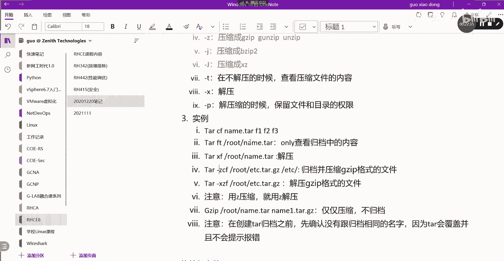
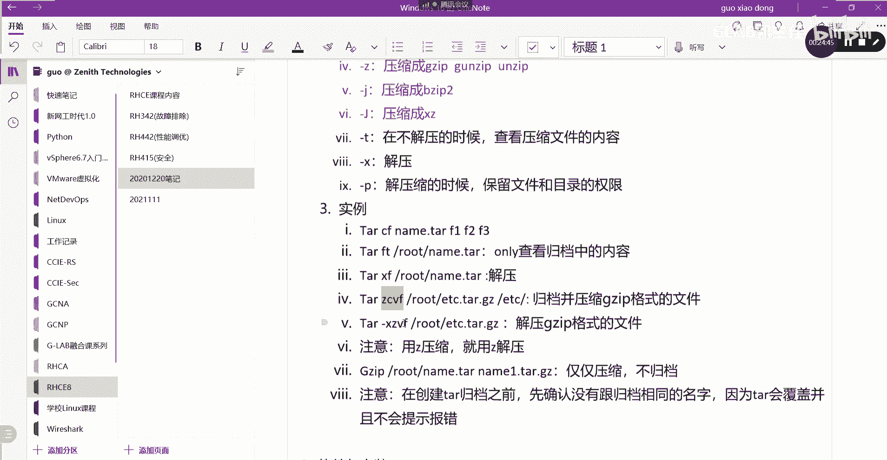

# 【Linux／RHCE／RHCSA】零基础入门Linux／红帽认证！Linux运维工程师的升职加薪宝典！RHCSA+RHCE／18-归档和压缩 - P1 - GLAB郭主任 - BV1Mw411T79T

OK那么我们接着看啊，接着往下看到了归档，归档这一块，其实在前面有讲过啊，我们把它叫做什么tr是吧，我们可以通过tar命令来进行归档，那在这里又讲两个概念，在系统里大家经常会看到呃，对某个文件进行归档。

一个是归档，一个是压缩，归档和压缩是一个概念吗，归档和压缩，不是一个概念，对不对，那么归档和压缩在压缩大家都知道的，他会把一个他会把一个很大的文件，压缩成更小的文件，做一个压缩的功能，压缩成更小的文件。

让呃它所占用的存储空间会变得更小，所以你通过压缩的手段，是能够存存放更多的东西的，对不对，归档它不具备这种工作，归档它不是说让你能够存放更多的东西，原来多多大还是多大，听懂了吗，所以我们在这里经常讲的。

在对系统进行归档，它其实是包含压缩的，我们说的是归档压缩，但是单纯的让你归档，它是没有压缩，也是可以单独做的，所以这两个概念要区分开来好吧，一定要区分开来嗯，归档其实总结下来一句话，就是会把多个文件。

多个文件啊汇集成一个文件，把多个文件汇集成一个文件，然后存起来，这叫归档，OK而我们这里的压缩呢，压缩的概念是什么意思，就是他会把很大的文件，我不管你是几个文件，一个还是多个文件。

它会把大文件压缩成小文件，一般的压缩，一般压缩都会腾出1/3的空间出来，大家有试过吧，一个G的文件压缩完有可能压缩的好一点的，三四百兆，可能剩下的那能超过一半，如果压缩不好的话。

也能帮你压缩成600多兆，六七百兆能省出三四百兆的空间对吧，所以压缩会把大文件压缩成小文件，然后让可以存储更多的空间，腾出腾出更多的存储空间，就这两个概念要搞清楚好不好，搞清楚之后。

我们再来看这个这个相关的命令就很清楚了，好他在系统当中，LINUX系统当中用来做归档的命令，我们把它叫做tr tr，Tr tr，OK然后呢我们对压缩来进行操作的命令，我们把它叫做zip，Gzip。

包括我们电脑上用的RNR是吧，什么GZ7Z什么，这些都是我们的压缩包，还有还有命令，B zip，b busy to啊，这也是我们的，还有什么呢，还有XZ，这三个都是属于压缩的方式，能理解不，OK好。

这是这两个东西啊，明白了概念吧，然后把它们放进去，第一部分还是概念，第二部分，第二部分，第二部分我们来讲这个相关的一些命令，命令参数了，好我们来看啊，两个概念搞清楚了之后，我们来看参数。

tr里面有一些参数，主要他这个命令主要就是讲tr，Tr，tr就是归档，然后如果要不要用压缩，取决于后面的option选项好来看第一个，第一个后边的选项叫杠C杠C代表的是C，代表create是创建呀。

创建归档C4，创建，OK好，然后呢杠F呢，F什么意思啊，创建一个文件对不对，也就是说创建指定创建的类型，类型是file文件好好，接下来呢杠V呢V代表的是verbs，代表的是显示详细信息。

这几个都是常用的，能听懂我意思吗，各位然后继续后边啊，杠Z呢前面三个都是跟归档相关的，接下来杠Z代表的是压缩，Z是压缩成，压缩成什么东西，压缩成zip，对不对，或者压缩成叫什么，Good good。

我靠，这个人还是一，还有一个un zip，这些都属于杠Z选项，能够帮你压缩成的用的这个压缩压缩方式啊，好不好好，然后呢，接下来杠勾这几个常用的杠杆代表的是压缩，它是压缩，不是归档，在归档的时候帮你压缩。

压缩成另外一种格式，叫be zip to，be zip to格式，这个能听懂我意思吗，各位好，杠大勾呢，他也是帮你压缩成另外一种格式，压缩成XZXZ也是一种压缩格式。

所以大家会发现上面几个选项是跟归档相关的，下面三个是跟压缩相关的，这个我说明白了吗，说明白了啊，好有压缩就有什么解压，对不对好，接下来说几个，第一个叫杠T杠T看名字就知道T等于list。

也就是说在不解压的时候，不解压，在不解压的时候查看压缩文件里面的内容，能听明白吗，我们其实在windows上也是可以的，不解压我能不能看到压缩文件里面的内容，可以吧。

现在LINUX就用杠T去看好杠X杠X就知道了，这就是解压，直接解解，把这个压缩包我不解压啊，直接把它解压掉，OK好，还有一个杠P，最后一个补充杠P啊，杠P也很重要，GP是什么意思。

就是在提取我们的这个压缩的，这个存档的时候嗯，保留文件和目录的权限写一下啊，提取文件的时候，也就是在解压的时候，解压缩的时候，保留这个文件或者目录的原来的权限，因为我们不管是谁对文件操作。

它都会对这个文件具有所有权，对不对，解压也不例外嘛，我们在讲权限的时候就讲过这个问题，但是你解压的东西，你的压缩包是从其他地方拿过来的，那么有可能需要保留这个文件的原来的权限。

所以就要加杠P保留它原来的权限，需要用到的时候留意一下啊，它是有一个杠P选项的，OK好，那么这几个选项说完了以后，接下来我们来给大家写几个，大家来看看它是怎么实现的命令啊，实力第一个大家看啊。

T2杠cf对吧好呃，我们起个名字叫name，点tar，F1F2F三，请问这句话什么意思啊，创建一个压缩，这个是这个是归档是吧，请问我创建创建一个压缩，而创建一个归档，归档的名字叫name点。

我把三个文件归档成一个文件了，对不对，请问我这个命令里头有压缩吗，有没有没有，因为没有跟Z啊，没有跟这几个相关的吧，没有跟这几个相关，它没有压缩，听懂了吗，所以我们在tr创建的时候，是一定需要有压缩吗。

不一定听明白吗，你自己自己去看啊，你可以直接做归档，也可以带压缩，都可以，没问题吧，OK第二个一会我给你实际演示一下啊，第二个tr杠F杠T，那我一起写啊，杠FT在root下面有一个name点tr好。

这什么意思，上面选项都在上面，请告诉我这是什么意思，tea什么意思啊，T不写在这吗，解在就仅仅只是查看对吧，所以是只是啊only啊对吧，只是查看压缩的内容，或者叫只是查看文档归档中的内容。

归档中的文件或者叫内容吧，不一定只是文件，也可能还有目录，那不解压对不对，只是查看啊，好接下来tr杠XF这个就知道什么意思了吧，简单是吧，解压，直接就解压了啊，没问题好继续再来一遍，再来一个啊。

Tar gz cf，root下面的etc对吧，然后点tr tr，点GZK然后把etc斜杠啊，etc下面的所有，这什么意思啊，好这里有了Z就看到了cf，我们知道创建并归档，但是有个Z就是不光创建。

还得给他压缩对吧，所以这个就应该写归档压缩，归档并且压缩成什么格式啊，Jip，zip格式的文件没问题吧，OK好，最后一个T杠XCF哎，没有XZFXZF，然后把后面的那一串斜过来。

root杠etc点塔点GZ，这什么意思啊，嗯xx z x z f这什么意思啊，解压是解压GZIP格式的文件好，这里要强调一下，我原来是用GZ本，也就是用Z来压缩的文件。

是不是在解压的时候一定要加Z这个option选项，我上面是不是用Z的，我这里可以把Z换成J吗，用你们的脑袋想想可不可以啊，可不可以可不可以不可以，明白你用什么压缩就用什么解压呀，听懂了吗。

所以一定要注意，原来你压缩成归档，归档压缩的文件用的是g zip还是XZ，还是什么其他的格式，那你在解压的时候就应该携带对应的选项，用什么压缩就用什么解压呀，听懂了吗，OK注意这个要注意啊，下面注意。

用Z压缩就用C解压，这句话写这边不就清楚了吗，你自己把Z后面把那些压缩的格式都补上，什么Z勾大勾小勾对吧，用什么解压应用压缩就用什么解压，听明白了，OK啊，如果不这样搞，他肯定会有错误的，会有问题的。

好最后再给大家补充一个啊，如果我这样写呢，叫嗯G这个也是一个命令啊，G z，JZ在root上面的name点T，然后呢在name送到哪去，送到name一点tr啊，点tr，点JZ，这什么意思啊。

仅仅压缩不归档，听懂我意思吗，所以单纯单纯的对一个文件进行压缩不归档，可以直接调用GZIP或者用buy to，或者用XZ听懂我意思吗，OK就这里的我刚刚说的那几种格式，它都是命令啊。

它都是这种压缩的命令，这个我说明白了吧，嗯不就是一个文件吗，一个文件需要归档的一个文件，你说这句话吗，这句话不是归档，这个是压缩哦，紧紧压缩不归档，明白了吗，所以它可以单独压缩的啊，可以单独压缩好。

这些都明白了，我们来简单演示一下嗯。

我们我们这里头有东西啊，这个我们把我们先来做。

把etc下来的东西啊，好在在做之前有一个要注意，还有一个要注意，这个注意点大家标心啊，很多人在注意的时候不注意，就在创建tar压缩之前再创建tr归档，这个叫归档，归档之前要先确认目录当中没有相同的名字。

先确认没有跟归档相同的名字，为什么呢，因为tr它会覆盖并且不报错，并且不会提示报错，这个能能看懂吗，如果你归档一个文件的时候，发现这个文件很重要，已经在目录当中存在了，它会覆盖原来的文件。

直接把原来的删掉，直接覆盖掉，并且没有任何提示，这是一件很可怕的事情，明白吗对吧，你提示还好，我发现有个一模一样的啊，我到底要不要覆盖他，连提示都没有啊，直接干掉，所以大家一定要看清楚。

你的名字是不是已经在了，好来演示一下啊，现在我们里边有一个test123对吧，我们有个test123，假设我们现在创建一个我，我来演示它不提示啊，touch一个叫name，点tr。

点GZ是不是有一个GD文件，这个是虽然是个空文件，但是名字是已经有的，对不对，好现在我们来做的简单一点，我就不把etc里面搞过来了，我只是把这几个文件，我把它它它它全部归档成这个名字。

我把这几个归档成一个好，并且压缩啊，压缩和归档我一起做了tr杠Z，cf z是压缩C4，创建F是文件V4，看它的详细信息，对不对好，我把它归档成哪个名字啊，name点tr，然后把哪些文件归纳过来。

我把test123，我把test还有什么美女，是不是我把这仨柜展成一个没有问题吧，好不好，有没有提示啊，有没有告诉我要覆盖啊，没有，但是这个玩意儿有多么诶，怎么多了个V这啥东西，嗯还是零是吧。

跟哪儿没敲对啊，哦他可能我想想啊，好来再来一次，我写它的全路径，应该在root目录下面对吧，来看一下啊T，tr后边是查看的话是什么，只想查看是不是T啊对吧，TFT我们把这个name，root下面的，完。

cut小V，怎么冒出个V出来了，Tf t v，不对啊，我看，对但我现在TF不用F直接T了，当前的name啊，它不能补全，是这个意思啊，tr后面在解压的时候，他不会帮你补全FT直接写了name点tr。

我看没补全，点JZ，NTART2点tz must special one of the，哦有JZ是不是明显感觉要加个Z是吧，T没解压呀，让我看看，不对呀，他刚报了个啥状。

Special one of the delete or test option，不对啊，来看TFT嗯，杠不杠无所谓了，name嗯，这个可以补全了，This look at a torchbe。

哎V怎么冒出这么个东西出来了哦，他搞了个V对呀，多了个V是吧，这个在他把很多东西都放在V里面了，不对啊，重新来TZCVF，重新来ZCVF，我们把这个名字啊写在name name，点tr点GZ。

OK然后呢我们把呃test123，还有test，就先把test123吧，然后这个test里面的所有的东西就这个吧，然后再把这个放进来，好这时候有了刚才可能是杠的问题，前面不用加杠吗，我这个没有杠。

对不对，我再来一次啊，再来一次，还有一个区别，就是我没有写全路径，我把另外一个去掉，然后我把这个我只我只把这两个压进去，其他不管我没有目录啊，好又变了，然后我们通过tf t name点击Z对。

还真是不加杠，验证下来就是不加不加全路径，可以的，就压缩在当前目录，没有任何问题，主要刚才加了个杠，明白吧。

不要杠，我去今天准备仓库，加上他们应该都不如你拿，哪里不受影响，都没有对的。

我刚刚测下来，好像我记得杠和不杠应该都没问题啊，tr杠重新创建一个吧，ZCVF是吧，然后呢这个重新name一点，tr点GZ好，第一个，然后我们只把test123放进来，哎也可以了是吧，那我问题出哪了。

刚才奇了个怪了，刚刚就产生了个V，其他什么都没创建，V不是我创建的呀，history我看一下啊，再往上翻一翻，刚刚写的第一个是哪个，是不是这个对，是这个我touch完了以后自己套了一个，哪里有错啊。

哦先后是吧，ZCFV是吧，我这边写的是ZCVF，再来一次tr啊，杠ZCFV是这样写的是吧，name3点tr，点击Z我们把test放进来，不是没有是吧，好好吧。

就这个ZCVFZCF，那这个V就不要加了，你看这里都没有ZCVF如果要加加在前面，在他后面有什么问题啊，我也是搞不清楚，好像好像那个F必须要放在最后面。

不管了，就这样吧，反正撤下来放在V放在后边有问题啊，对不对。

OK很少加VV，其实只是看他的这个压缩的过程，压缩的一个完整过程，好吧，大家记住这个操练的时候会出现这个问题，有时候也很容易会被忽略，如果是加V的话，不要加在最后，加在最后有问题，这个很明显。

上课就遇到了好吧。

叫ZCVF，行啊，没问题啊，来我们再在说，对指定它的文件格式F是要加的，F4V可以不加，Via verbin，就是看它的详细信息，tr啊，FT啊，那就不加呗，不加，然后呢，我们把name1看一下。

对不对，name2看一下，那边没有吗，哦没有2number没有，那只是name，看到吧，OK好演示了，他是没有没有提示，直接覆盖原来的对吧，直接覆盖原来的，这个是第一个，第二个我们参数的前后顺序。

大家要留意一下，第三个杠或者不杠都可以干或者不干都可以好，那么他就先说到这儿了，就先说到这，后边应该还有一个还有两个，还有两个，我们下午讲。

那我们接着往后看吧，接着往后看，然后呢，这个上午说到了这个压缩和归档，压缩和归档完之后，接下来给大家介绍两个文件传输啊，两个文件传输的技术，或者叫系统之间如何安全地传输文件。

系统之间安全的传输文件的方法有两种，应该是三种啊，应该是三种，第二种叫SFTP，S f t p，第三种叫RY叫什么叫RSYNC，角RSYNC这三种方法，我们一个来给大家讲，呃就是我我从我的电脑。

从LINUX系统，我的电脑把我的文件传到你的LINUX系统上去啊，互相传递文件的方式有两种方法，那我们之前讲的SSH那只是远程登录管理，它没有传文件，对吧啊，现在我们讲的是如何传文件。

它是怎么去用它来使用的呢，像第一个啊，首先是通过open SSH来实现验证，是通过open SSH来实现验证，Ok，然后也是通过RSA的非对称密钥，进行数据的加密，验证是通过SSH来进行验证的，然后呢。

这个加密啊也是通过rs的密钥对来进行加密，这是第一点，第二点我们来看它的语法，它的语法很简单，这个圆一原二等等等等等等等等等，这个没问题吧，然后目标，sap圆中间圆可以是一个，可以是多个，可以是文件。

可以是目录，理解我意思吗，然后送到哪里去，送到目标上去，送到某个目标地方去，这个目标可以体现的形式有很多个，比如说我们要把我电脑上的东西，送到另外一台机器上去，另外一台机器我们是不是要登录啊，对吧。

他不用你提前登录，它可以这样子在这边去写root at server b，这个是我们SSH登录的方法吧，登上去以后加个冒号，送到哪儿去呢，比如说我想送到home下面的什么。

remote user上面去啊，home下面的某一个目录就这样写也可以，所以目标是可以写成类似于SSH，登录的那种方式的，然后后边加个冒号，然后去指定目标主机的目录文件在哪里，我们来举个例子。

现在假如我现在想把我的这个tar文件，不是压缩好了吗，我把这tar文件送到server b上去，送到server b后面下面去，我们先来看server b home，server b上有没有。

现在没有吧，肯定没有，SSH root server b嗯，没有任何文件对吧，现在我们这个压缩的name文件送过去，可以通过s c p name点tar，点JZ送过去，通过root用户送过去。

server b冒号斜杠home，这个能看懂吗，各位好，送过去，这个时候他会有一个SSH的验证，这个验证先接接收一下他的密钥，对这个密钥公钥接收过来的，公钥是用来加密的对吧。

现在呢我们这个密码就是root密码，REDHAT好看，送过去了，送过去我们在这看一下诶，放在home下面啊，不好意思，后面有了吧，内蒙特尔斯，我刚刚送过来的啊，01：05分吧啊，刚刚送过来的，明白吗。

OK所以那我们还可以把很多个文件送过去，可以把多个我们来写一下，多个圆的方法，我们把name，name一点GD送到不要送到home下面去了，我们送到root下面去，可以吧，好REDHAT好，送过去了。

然后就不是在这在这看了，是不是有两个都过来了，OK这个是把本地的送到对方去，如果我想把对方的文件拉过来，我在这边建一个touch touch，随便什么东西，ASDF我touch一个文件SDF。

我想把这个文件从server b上拉下来，这个简单反过来拉会的吧，server b对吗，在哪呢，在root下面肉，这下面不是有一个叫什么ASDF是吧，ASDF对，我把这个文件拉到本地来，本地哪呢。

本地将目录下来，可以这样写吧，好好，那本地节目录看一眼ASDF不就有了吗对吧，所以啊这个圆和目标，这个语法源和目标并没有指定，这到底是自己还是对方，明白吗，你在思维可以把对方拉下来，也可以把自己送上去。

同样在server b也是的两个方向都可以操作，能听懂吗，各位，所以用这种方法，很容易就能把文件互相在多个系统之间共享，就可以了，很简单好吧，这个语法我就写这儿了，那个嗯嗯嗯还有一个要补充的。

补充一个杠杆，我们一直在传递文件，我们没有传递目录对吧，杠R他这个选项是什么作用呢。

我们来看一眼，如果我现在想把远端的腕上面的log文件，全部录下来，送到哪里去，送到tab上面去，那就是root server b哪里的呢，我上次讲下面的log下面的吧，好放到哪里来。

放到我就不放到tab下面去了，我就放到当前的这个目录下面，当前不是有一个test吗，这里不是有一个test test目录吗，对吧，我把它放到目录里面来，有没有提示好，有他说了个什么。

它不是一个它不是一个file，它是一个目录对吧，所以如果要把目录里边一堆东西送过来之后，我们要加一个杠杆，这个能看懂吗，一直过来，Reac，过来了，LOL看一下在哪里，在test里面吗。

test里面不是有一个test里面有啥东西来着，上哪去了，刚刚这一堆东西我送哪了哦，送到这里test去了，这是根目录下test，不是将录下test，难怪看不到LS杠二在杠L在在这里是吧，在这啊，在这啊。

在根目录在顶层根目录下面的test里面啊，所以啊就都过来了啊。

OK所以这个杠杆是目录的递归copy吧对吧，目录的递归的copy，递归的传输，所以这个CP没什么难的啊，就这么多，好不好好接，第二个sf TP，这个sf TP它的原理交互式方式。

它也是通过SSH进行验证的，也是通过RCA进行加密的，那个第一个点应该是一模一样的啊，我就不写了，那么它跟SFP区别就是，这是一个交互式的上传下载，它是一个交互式的，交互式的上传和下载管理好。

那它的语法呢，叫sf TP，Sf tp，然后呢呃sf TP到对方啊，比如说root server闭上好，然后在这个里头会有一些交互式界面，在里头，我们可以输的命令是我们把命令总结一下。

它里面有很多命令可以输，比如说呃IOS啥意思啊，查看CD，这个命令是sf TP交互式界面里面的命令啊。

不是shell里面的交互式命令，听懂我意思吗，给你演示一下，演示完了我们再总结啊，在这啊，我们还是从server a它叫SFTP到root server b上去，输入一个密码，Reheart。

没有验证成功，好上来了，看是不是SFTB啊，OK在这里我们输LSA看有哪些东西，这个sf TP上去的时候，默认应该就是server b进到server b的加目录吧，是不是啊。

我在家目录看到的是不是有五个文件，然后我sf TP上面是不是看到的也是五个文件，所以默认s FTP上来到达对方主机的家目录，然后你可以通过CD去切换CD到哪里去啊，CD到根目录下面去，然后LS看一下。

现在看到就是根目录吧对吧，所以CD也是第二个可以用到的。

然后呢Mac dr我们把命令总结一下常用的Mac dr，这个很明显创建目录吧，RM dr什么删除空目录啊，RMDR一定要记住它只能删除空目录，明白吗，PWD显示当前路径好put，这才是我们常用的P推。

就是把本地的这个文件推上去，理解吗，然后还有一个是有put，就有get get就拉下来对吧，然后EXIT就退出了，我们重点演示put和get。

好这几个命令是常用的，来我们先把什么东西推上去，我们先把什么东西贴上去啊，啊我们把P我当前目录，当前家目录下有什么东西啊，这是我当前目录，我把美女推上去吧，我把P美女推过去，是不是过去了。

好没有指定目标，他就直接推到，应该是推到了我的顶层的根目录下去了，我们可以到这里来看L4嗯，是不是推上来了，所以你要搞清楚我在哪明白，如果我现在用的应该是一个相对路径吧，但是你要往上推的话。

你可以写绝对路径啊，比如说我把什么home下面的什么什么什么，推到对方的这个根目录下的，什么home下面的什么什么什么，这样现在我写的就是一个什么路径，绝对路径，听懂了吗啊刚刚给大家演示推上去。

用的是相对路径，OK现在我写的就是绝对路径，不演示了啊，get下来也是一样的，get好，我把当前目录下的什么目录get下来，那现在不加这个全路径，就是相对路径，相对路径的话就是在现在在哪里。

在对方的对方，对方应该是我们get一个吧，写一个绝对路径，我们把对方的根目录下面的哪个，把这个我在touch一个吧，touch123好了，多了个123对吧，我把对方根目录下的123get下来，放到哪呢。

放到home下面去，放到root，也放到自己这边来，唱的不是在家录在哪个目录啊，不是在对123，是在那个root用户的加入，是不是在root mod加入录啊，他说feature two123。

报了报了个错，我们来看一眼啊，get下来有吗，这个是目标，我们来看本地有没有我们CD到我们，CD到root上面去看一下吧，有没有123，有了吧，有了吧，有了这个单词什么意思啊，F e t c h。

完蛋这个FETCH。

打开我万能的有道，拿来请受得卖的啊，就是就是已经传了嘛。

OK告诉你已经传了啊，那就这样，put和get就这样来做，这是一个交互式的界面，也能实现这个文件的传递，没问题吧，好第三个我们讲RSYNC好。

这个跟上面的区别还是有的，它也是可以可以去复制文件对吧，但是除了复制文件之外，复制传输文件之外，它还多一个功能，并且是可以支持增量，可以支持增量的同步，而前面讲的CP也好，sf sf TP也好。

它都是全部复制，全部复制，就是你只要敲一遍这个命令，他就把原来的复制过来，就是不管本地是不是有，他会把这个文件从从这个网络拉一遍过来，但是如果用RSYNC它是可以支持增量的，就是已经复制到本地的。

他就不复制了，然后多多出来的，它把它复制下来理解吧，所以它会多出一个这个东西，那么它会用到一些选项，它的选项会比较多一些，比如第一个可以增量复制啊，第一个杠V知道什么意思吗，对我就不写了。

显示他详细信息，杠A什么意思，就是以存档的模式，以存档的模式来传输来复制它包括什么东西，这个杠A包含的东西很多啊，它包含里面很多东西，就是杠RR什么R是递归，刚才不是有吗对吧，他有目录下面的递归。

然后它包含GLL代表的是，它会把链接也都复制过来，它包含杠P把这个权限，所有相关的权限也都复制过来，杠T保存这个文件的时间戳对吧，GG保存它的GDU，保存它的UID，OK就这很多东西都包含在这个里面啊。

就是都包含在GA里面，一个杠A等于后面这些命令的总和，都能听明白各位，所以我们一般用的就是杠，你只要记住一个杠A就行了，后面所有的都包含了好，还有一些叫杠杠H就是保留它的硬链接文件。

硬链接硬链接讲过保留硬链接，它有几个硬链接都保留着好杠A呢，大A啊，大A大A保留ACL，我们文件的CL应该在下下周会讲啊，保留文件的C2好，还有一个杠大X保留S1LINUX的上下文。

S1LINUX也是做文件控制的，也是在下周会讲，保留S1LINUX的上下文，大家先记上，大家先记上，那么我们现在用的比较多的就是A和V，所以大家会看到我们的例子举例。

我们会看到我们常用的这种复制的例子是，RSYNCISYNC杠av，然后把下面的VLOG，下面的东西送到本地的tag下面来，这个能看懂吗，av吗，杠av，然后把把这个这个是把本地的腕下面。

logo下面的东西送到本地的tab下面去，没问题吧，就自己机器上的增量复制，这个有别于copy，它可以把本地的送到本地，也可以把远端的送到本地，能听懂我意思吗，各位都一样的，看好了。

我们来再看第二个例子，第二个例子是可以把远端的，可以把本地的送到远端去，叫RSYNC杠av对吧，我把还是把下面的log，下面的所有的东西送到远端的root登录的server b上。

能能理解server b上的tap上面去，所以这个就跟第一个命令不一样，第一个是直接把本地的一个目录送到一个目录，现在第二个命令是把本地的送到远端的吧，OK本地送到远端的。

同样他也可以反过来写RSYNC，可以把杠AVR可以把嗯，这个是把本地送到远端，然后这样写就是把远端的送到本地，把远端的word下面的log下面的送到本地的tab下面，清楚吗，不一样啊，来我们演示一下。

这就退出来了，EXIT退出来，我们用呃RSYNC把远端的送到本地来，本地里面有个test，这东西有点多对吧，我们删掉一些东西，R m，好，现在我要求大家用一句话来删除，我这个目录下的所有的东西。

但是保留这两个，听清楚我要求吗，用前面讲的东西删除这个目录，下面将目录下面所有东西，只要保留这俩文件，怎么删RM杠2F新号那都删了，我要只想保留这两个文件，啊，怎么删掉，这个还有点难过，来想想嗯。

只想保留这俩文件，其他都删掉，就想怎么去匹配嘛，对不对，就之前讲的通配符吧，这里用的应该是通配符，对不对，应该用通配符来删除啊，有没有取反，有没有取反，有对不对，有取反，但是呃取反的通配符是是中括号。

加个尖括号对吧，还记得吗，通配符在上面在前面啊，快帮我想想，我就不翻了。

我的笔记太长了，前面咋写啊，线上有什么好的建议吗，我也在想啊，是个中括号加的挺严肃的，监控中括号加个什么，对的，就是这个中括号里边放个尖括号，这个就是取反，但是很难写，这怎么写，我只想保留这俩。

新号点CFG优秀来吧，中括号里头啊，它是一个选择，它是一个，比如说A到Z这样写，这就代表除了字母以外的数字嘛，其他数字都删掉，所以123会被删掉，而且他匹配是一个还不是多个，它匹配的是一个还不是多个。

啊前面加个信号，前面加个星号，这样啊，这就是多个，但是除了除了英文之外的中文啊，除了英文之外的数字多个重复，那就算这样能成功，也只删掉他了呀，其他都没有被删掉对吧。

尴尬了吧，自己问了个问题，好像现场还要再想一下才能解决，没关系吧，嗯我把这个贴出来。

一会留时间，做的时候我再给大家写好吧。

大家帮我想想啊，删掉只保留这俩东西，保留这俩肯定有办法的，绝对有啊，如果没有，那就太low了，肯定可以做到的，一句话删除内容，保留这两个，只保留这俩文件，好吧，然后还有一个问题，就是刚才上午的时候。

我中午也没看啊，还预留了一个问题，就是上午的那个，就是，就是log文件存储的问题是吧，永久身处，OK这俩先记着了。

怕忘记好，那我先把它都删掉，太烦了，当前目录当前目录的所有东西都删掉，L没了是吧，好我们来创建，其实不用创建目录，先把远端的把下面的log r s r s y NC。

我们用杠AVA已经包含很多东西了对吧，然后我们把呃远端的送过来，那应该是root at server b是吧，这个冒号下面的腕上面的这个，下面的log送到哪里呢，送到家目录下面我建一个test。

看有没有报错，没有，REN送过来送过来了，test有了吧，我们可以LS杠l test哎，下面是不是有个log，对吗，好，现在我们来做一件事情，就是在server b下面的log新建一个东西。

word下面的log，我进来，它不是增量嘛，对不对，我在这里建一个，我touch一个呃，log log点TXT，为了做的多一些，我给他一点点时，我创建了十个这样的一个TXT，看会不会多了，多了十个吧。

OK虽然没有内容啊，然后我现在再来复制一遍，还是把这个下面的log所有的东西弄过来吧，我们来看一下他传的东西传多少东西过来，V能看到他传多少东西过来，传了多少东西，是不是把我刚刚创的这个东西传过来了。

所以log目录传过来，下边呃，这个是读到的啊，然后把这些东西传过来了，哎message message怎么也传了，security也传了，editor也传了，请告诉我为什么这是志文件变了。

对日志文件变化了，我是创建了十个文件，它会刷新日志文件，对不对，所以他会去对比传过来文件和已经有的文件，肯定是做哈希对比的哈，希知道吧对吧，做哈希值校验发现不对，再把这个文件传过来。

所以很明显能看到这个是具有增量，增量备份的啊，这是一个增量备份。

好好，那么这个除了这个没啥好讲的，这语法都给他写这儿了。

没什么难的，好吧好，然后呢这个这一块的内容我们再回顾一下，讲到了呃归档和压缩，然后讲到文件传输的三种方法好吧，然后课后的这个开放性练习，应该是应该是446页，各位446页啊。

