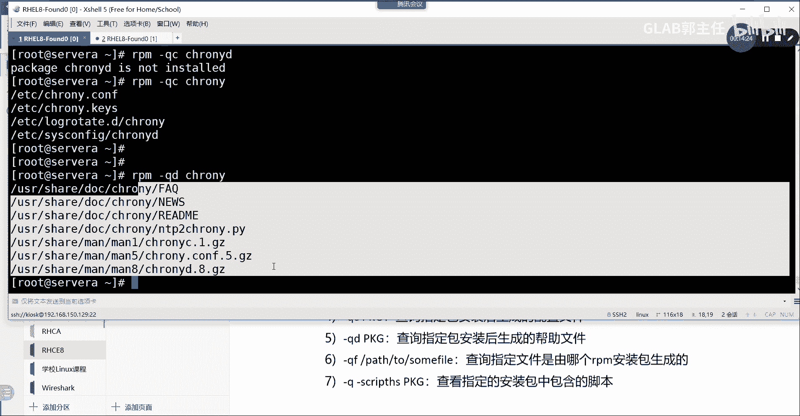
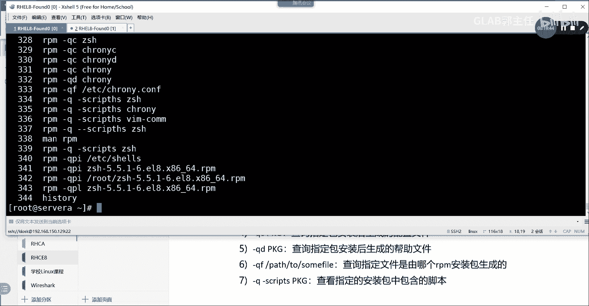

# 【Linux／RHCE／RHCSA】零基础入门Linux／红帽认证！Linux运维工程师的升职加薪宝典！RHCSA+RHCE／19-软件管理 - P1 - GLAB郭主任 - BV1bQ4y187dL

好接下来我们看软件包安装，LINUX当中的软件包的安装，软件包安装分两大两个啊，两种安装方式，第一种是基于rpm安装，第二种是基于样本的安装，嗯就这两种，我们先看第一种基于rpm的安装是个什么概念。

就是单个软件包的安装，单个软件包安装，那么类似于在windows上下载点ex e是可执行文件，下下来双击下一步，下一步下一步的安装方法，你能听懂吗，好类似于这个大家应该都懂的。

类似于windows下载了什么点ex e的，或者或者点还有一个专门用来微软执行的，点MS的吧，这些都是可执行文件，等啊这样的可执行文件，进行软件的安装，OK这是rpm。

那么我们在LINUX下的就是点rpm格式的，点rpm软件包来安装的，OK好，但是我们要注意的是，rpm的这种软件包，包括在LINUX中的rpm这个工具，它不仅仅只是用来安装软件的，这个功能非常强大。

我先给你看一下我们下的这个rpm的软件包啊。

我们可以去到呃rpm的软件包，我看看放在哪啊，有没有啊，给大家看一下young repolice，在这里我登录了一个下来好了，我下载一个下来啊，稍等一下啊。

比如说我现在download一个上路的一个东西，DOLO的rpm包下来，这个rpm的包你可以在网上下啊，可以在网上找，网上可以下载这个文件，我现在通过样本仓库download一个rpm包下来。

杠杠d o w n l d download only，只是download下来不安装啊，然后杠杠e w n download l o AD download，什么DIRSDR等于放到哪呢。

放到我的当前的root下面对吧，然后download一个叫z share，好下来了，就这个包看懂这意思吗，这个包这种就是我们第一种安装的方法，就是要去下这种LINUX下的可执行的安装包。

这种安装包的后缀就是点rpm，能理解吗，各位但是我要说的是在LINUX当中的rpm，它的核心的功能并不仅仅只是做安装，OK并不仅仅只是做安装。

它能做的东西很多啊，我们来总结一下rpm，可执行的rpm这个工具能够执行的功能，能做的功能总结很多啊，比如说第一个第一个就是我们所说的安装了，对吧好，那么它安装的时候有一些option选项。

比如说杠杠I就是in all rpm加GI，就代表他要安装，能听明白，第二个杠H，H代表的是以井号的方式显示安装进度，以井号的方式显示安装进度，OK然后呢一个井号是代表的是2%，代表，2%进度啊。

我说的是进度，安装进度，听懂了吗，OK然后呢杠V呢，显示安装的详细信息不说了啊，好还有一个叫杠VV，VV就是显示显示安装的更加详细的信息，一会儿给大家演示啊，先把这些总结一下，好杠杠，第二个第四个叫杠。

叫node pass，Notepass，这个叫忽略安装依赖好，说到这个就不得不说rpm的这个安装包的缺点，缺点，rpm的安装它不解决依赖关系，就比如说我想安装一个应用。

那么这个应用本身它是依赖其他的安装，软件包的，那么你要能够把这个应用跑起来，比如阿帕奇对吧，这种应用要能跑起来，你必须要能把它前面所依赖的那些软件包，都先装好，然后再去做阿帕奇的应用，听懂我的意思吗。

如果你下载下来，仅仅只是一个应用本身的安装包，它是不解决这个安装包之前的依赖的，那些安装包的，这就是它的缺陷，但是你又不不想管这些东西，我只想安装它，你就加一个杠杠对吧，Not depends。

Not depends，那它就可以把这个包安装上去，不去解决依赖，忽略依赖的报错，听明白意思吗，OK好，然后呢，后面还有两个命令啊。

叫replace r e p l AC e r e p l AC e package，Pk js，这个命令看名字应该知道啥意思啊，重新安装重新安装，而且是替换原有的安装，就是会覆盖，说白了就是覆盖明白。

我不管你之前做的啥，我直接通过replace package直接把你替换掉，好，最后一个这个安装上面的一些参数啊，杠杠FORCE看名字知道啥意思吗，强行做做某事情，false false是强制吗。

可以实现强制安装，强制降级，强制删除叫杠杠force，就跟RM的GF是一个效果，强制做某事，它是长命令，不是短命令呀，杠杠force在这里没有短命令，杠F啊，一定要打杠杠force好。

所以第一个安装大家听明白了吗，然后给他安装一下啊，比如说我现在想安装一下这个ZC，我可以通过rpm港IVH看得懂吗，嗯把Z卸安装一下，对吧，能够看到他所有的安装信息，明白OK好嗯。

这个是这个是这个是安装，那个是安装嗯，没有问题吗，各位然后要重新安装的话，你把这个改成杠杠replace package就好了，不去抢，不去给他演示了，好，这是第一个安装，第二个查询查询。

我觉得用的是非常多的，我们可以通过rpm去查询我们的软件安装好，查询里头有一些参数啊，叫GQ杠QQ就是查询的意思对吗，杠QA代表的是查询已经安装的所有包，这几个都比较常用的啊，第二个我先给你全记好。

然后再给你演示杠QIQI什么意思啊，Q是查询I吗，I后面要加一个package，pg不就写pg好了，大写的PKG后边要加你的package the name，好吧好。

将你的pk package name，请问这个命令是干嘛的，查询指定包的说明信息，OK查询指定包的说明信息，好杠QL也是pk g加你的这个名字好，这个命令是干嘛的，查询指定包安装后生成的文件列表。

查询指定包啊，安装后对吧，生成的文件列表，OK好继续查询QC加pk g这个是什么意思啊，C查询指定包安装后生成的配置文件，这个很重要，查询指定包一定是安装后R生成的配置文件。

OK好再来一个q d pk g，这个代表的是查询指定包，安装后生成的帮助文件，我们不是说与某些软件上完了，是不是要查查自己的带的帮助文件，但你不知道在哪儿啊，对不对，所以你就直接用这个QD。

来查找它生成的帮助文件，帮助我们很快上手，怎么去用这个软件好不好，再来一个杠QFQF后面就不是加这个name了，应该要加一个pass p a t h啊，Pass to，好这样写，我们再来把解释写一下。

大家知道查询指定文件，查询指定文件是由哪个rpm安装包对吧，生存的，一会儿给你演示啊，最后一个杠Q加一个杠杠，这个script s c r IP t hs脚本，S c r i p t h s。

然后加pk g这个代表的是什么呢，也是名字，PKT都是内查看指定的安装包中包含的脚本，查看指定的安装包中包含的脚本，记住了吗。

好我们来给大家一个演示一下啊，都记好了吧，记完了看我演示一遍一遍去理解，我们这边下边几个重要的东西，先看啊，RPM杠QA不加任何东西，它会给你列出来我已经安装了哪些rpm包。

就当前系统所有的安装的rpm包都可以列出来，听得懂吗，OK啊太多了，你最好加一些过滤，比如说我只想关心刚才我装的z share，是不是就装了一下，并且看到它的版本好，这第一个这个其实第一个用的比较少。

第二个RBM杠QI加VSHER，这个是查看安装包的说明信息在哪里，在这儿啊。

就是你能看到你安装的这个软件什么版本啊，什么这些东西，这样对吧。

所有的安装信息都在这，这个也是看的比较多的，好v share，就比如说VMVI诶，这个没有装吗，v i is not installed v v i am command啊，这个也能看到，对不对。

所以你要看这个软件的详细信息啊，你可以通过QI好，再来一个rpm杠QLQL，我们还看Z希尔吧，这个是看什么生成的文件列表。

所以有时候你会在看到系统里面软件安装了，会生成一大堆文件，对吗啊，你想看这个软件的我到底生成了哪些文件，你就可以用它来看这个q l z share，能明白我意思吧，好前面都是一些常看的QC呢。

QC加ZSHER，他说的是指定查查，看安装指定生成的配置文件来看，这个比较常用啊，这个软件的配置文件基本上都在etc里面，为什么我们说去安装了NTP的这个ROME，就知道改那个配置文件。

有时候不记得没关系，你这里去查询一下CHRONYCNYD，弄完是不是就知道去改etc下的这个文件，听懂了吗，不记得没关系啊，这个是NTP啊，刚刚不是讲了NTP吗，NTP要安装的服务啊。

所以一些配置文件不记得没关系，你可以通过rpm去查查，他直接帮你找到这个软件相关的配置文件好，然后QD呢生成了一些帮助文件，我们直接用QD去看它的帮助文件，好。

帮助文件也看到了一大堆吧，嗯听懂吗，好QFQFQFQ是查询。

F是指定你的文件，这里不是加package的名字了，是加一个路径，比如说我根本就不知道说，这个文件是哪个软件产生的，是因为哪一个软件安装产生了这个文件，我就直接把这个文件的路径复制在这QF。

它会告诉我这个文件是这个软件安装生成的，所以正着查着查都可以能听懂吗，通过软件查有哪些文件生成了，通过文件的路径去查去，是哪个软件生成的都可以，所以这个也是查的比较多的好吧。

然后呢嗯查看指定安装包当中包含的脚本，我们通过Q，然后杠SCRISCRIPTHS啊，这个是脚本加the sher，看这个脚本生成了好，就这个这个包有没有生成什么脚本，没有没有。

那我们就run c h r o n y，这个也没有嗯，我们vim command，啊说哪里啊，他说要要从什么开始是吧，With a gun u，哦两个杠，写错了，SCRIPTSRPM杠Q对吧。

没有这个选项，这样子啊可能格式不对，查找一下啊，S s c r i p t h s，看哎没有，SCI有NO script，来看一下啊，script杠杠哦，scripts没有t 是吧，SCRIPTS啊。

哎，没有H是吧，CRIPTS啊，这就对了，更正一下这个脚本没有T没有T没有T没有T。

就这脚本写错了好。

这个是看我这个软件安装。

生成了哪些可执行的脚本好吧，可执行的脚本好，大家可以自己去看啊。

都是在处理这个软件相关的。

那么如果这些都明白了之后，我给大家写一个，大家帮我判断一下我在干什么，R p m q p i，然后呢呃etc下的CHRONYC，刚刚那个命令叫什么，CHRONYC点CNF这什么意思啊，啊，我换一个啊。

etc下的shes s h e l l，我感觉这个没答对，SHELLS就用这个命令，SESHSHERS是什么意思啊，QPIQ查询P，P是什么鬼东西啊，I呢，Error no package。

Not a sorry，不好意思，写错了啊，应该这样写，LISHA啊，这样子的，不好意思，应该这样写，这什么意思，查询这个包的这个包没装吧，如果你可以不装，明白吗，OK你可以不装。

当然你也可以指定它的路径，比如说在哪啊，在root下面的什么什么什么，只好只是刚好这个安装包在我当前目录，我没有加前面的那个路径，明白我意思吗，所以这个就是查看这个需要安装的这个包啊。

他的这个详细的安装信息，这可以不是安装的啊，再来一个RPM杠呃，叫叫什么QPL，The sher，这什么意思啊，Q p2，P是pass的意思吧，刚才没讲P对吧，P是pass的意思。

所以这个就是没有这个包。

没有安装之前，我就先看一下这个包里，它会安装之后会产生哪些目录文件吧对吧。

所以这两个其实也会用的比较多，就这俩P啊，好QPI和QP2啊，其实都一样的，那不说了好不好。

这个是查询，再来第三个作用，升级我们可以用它来升级我们的软件吧，好升级的话，我们讲几个，第一个是杠大U大URVHVH，知道了吧，V是VERBH，是以井号显示升级的进度吧，对不对，还有一个叫大FVH。

这俩应该是有区别的，区别的，先看大U大U好，这什么意思啊，肯定都是升级，对不对，那么升级会面临什么问题，就是如果以及系统当中已经有了这个软件，我在升级的时候对吧，就是老版本已经存在，我在升级。

如果老有可能出现的是，他压根就没有装这个软件，你再去升级的时候会有问题吧对吧，所以这两个区别无非就是这两种情况，我们先来看杠大U代表的是，如果你在升级的时候发现了老版本，发现了老版本。

如果发现老版本则升级，否则也就是连老版本都没有，则安装直接就安装了，下边这个就跟上面相反了对吧，如果发现了老版本，那么就，则升级，否则干嘛退出，是这意思吗，大F就是尽管他只管升级。

你这系统如果压根就没有这个老版本，那我就退出了，不装了，大U就是发现只要如果没有，那我就直接给你装上就完了，所以这个升级没问题吧，各位OK，这没什么好讲的，大家记住大U和大F就行了。

好接下来一个作用是卸载，卸载软件也简单，杠一，刚E就是卸载了，来我给你演示一下，刚才我装了Z线吧，对不对，我现在把它卸掉。

怎么卸RPM杠EZSHER好，然后我们再通过刚才查询我安装的软件包，怎么查的，rpm杠QA对吗，然后过滤一下this year，没有了吧对吧，刚卸载很简单，直接就杠一就好了。

好继续，还有卸载，还有呢叫印，这个是除了这些东西之外，他还能做校验，校验用的是什么杠大V这什么意思，校验安装的文件是否被修改，它可以校验安装的文件是否被修改，他帮你校验这个文件有没有被修改。

好我们来看一下啊。

嗯我们来先安装一下这个VM应该安装了，我们通过rpm杠大V去校验一下vim git，他会帮你去校验好。

没有被修改对吧，没有任何输出，就是没有被修改，所以它可以通过rpm加杠V啊，去帮你校验这个文件，它校验就用哈希去校验的，就帮你去校验这个文件有没有被修改，能听懂我意思吗，各位OK好，然后呢。

嗯还可以校验来源的合法性及软件的完整性，这也在校验里头吧，它可以校验校验来源的合法性，和合软件的完整性，这都属于校验的范畴，和软件的完整性明白了吗，好先来看啊，第一个杠V4校验文件是否被修改。

第二个杠杠IMPORT，啊这个就先不说了，杠K吧，那个不用写啊，杠K是去验证这个合法性和完整性，验证合法性和完整性。

我们可以通过杠K来验证它的合法性和完整性，杠大K吧应该是大K啊，杠大K他，然后后面加的应该是ETC下的CHRON，C h r o n y，密码记不住SHESHERS。

这个是去校验这个软件的合法性和完整性，其实没有出，没有出任何的error，那就是对的。

就这个意思，好吧好，这个后面用的不多，但是要知道可以加这些参数校验，可以用rpm来校验，最后一个rpm可以重建数据库，rpm可以重建数据库，我们可以用杠杠，他可以做数据库嗯。

杠杠i n i t DB i n i t dB，这个是初始化数据库，第二个杠杠，Rebuild i e b u i l d r e b u i l d，然后DB这个叫重建数据库，重建数据库啊。

就这些可能用的不多，但是嗯大家要知道rpm除了安装包之外，它还能做很多事情，当然前面一直到卸载这一部分，都属于对软件包的管理对吧，那除了这些之外，它还可以做这些事情，那这个数据库现在不在我说的范围之内。

现在记录一下就可以了，后边再了解好吧，最后再给大家补充一个，最后再补充一个，可以从rpm包中提取需要的文件，而不安装软件包，可以从rpm这个包中提取你需要的文件，而不安装这个软件包。

就有时候你会发现这个软件包里头某一个文件，你是想要的，那我又不想安装它，我只想要这个软件包里的某一个文件啊。

你可以怎么做呢，举个例子啊，我们可以这样做，它通过叫rpm，Rpm two，什么CPI，就是通过这个命令，然后嗯我们来提取这个软件包当中的，这是一个软件包，我来看看啊，这个软件包有没有啊。

也有这个软件包不一定在本地啊，来我把这个软件包给大家打一下，叫OWONDER嗯，W i d g s t d g e t s，你看这个，1。0，这是它的软件版本，然后我看能不能补全四点X86。

我先举个例子下，横杠64点rpm，然后找到他CPID这个部分CPIOCPIO，然后杠ID，然后把点星号星号TXT前面是什么，我不关心好吧，No such file or directory。

嗯让我想想啊，这样子啊，我们用Z系好了，这个软件好像不在本地，不在本地应该也可以啊，我刚才说不需要安装，就看里面的东西应该怎么看呢，通过rpm q l是吧，the shell吧，哎不对。

通过rpm杠Q什么F吗，Q f。

不去安装，能够看到里边安装的这个文件是这样的啊。

QPL啊，这个是不安装来看，然后我们想找到，我只想要里边的一个什么文件，有没有TXT，没有吗，他没有JXT1哈希签名没有，我只想要里面的一个什么文件，等一下啊，看不到，我看进去了，找一个随便找一个。

随便找一个，他应该有一个CONF的文件，这个有一大堆嗯，这个有一大堆，这样子，把它复制下来，我们用刚才那个命令来给大家演示一下，这个哪个啊，我们不找这个软件，我们就用当前当前这个z s h share。

这个里边的这个东西，然后用CPIOCPIO，然后杠ID在里头加个东西，就是42，我不管啊，if configure的东西好一个，1万多的，这个让我看看出来多了个US2是吧，希尔利希尔看到了吗。

五点多少方选出来了，就这个就是呃就这个啊，它是有内容的，它里边是有东西的，所以你会发现去提取它不去安装，只想要它里边的某一个文件，就用到这个命令，这个命令好不好，复制一下。

就这个命令前面是去用这个命令，去去读它里边的东西，然后这个CPID就指定你的这个串，就只是去看这一部分，把这东西弄出来弄出来，然后保存出来，把这个文件啊，相应的这个文件，这个这个文件弄出来。

然后放在本地自建一个路径。

这个路径也是按照你的安装包里的路径，进行建立的，你看我这个路径很长的，路径很长，在五点几下面有一个什么function对吧，所以用这个啊，用这个呃对就是这个可以了好吧，然后接下来这个是rpm。

rpm做完我们来看看YM，好样的话跟rpm的区别就在于什么呢，要么它可以理解为是我们的一个软件的，叫应用管家或者叫软件管家，在windows上有软件管家，比如说大家都会装360对吧。

360软件管家或者QQ的软件管家，那么软件管家跟你之间去下包区别是什么，你直接在软件管家里点点点，他就帮你搜索到，并且安装了对吧，OK那么在LINUX当中也有类似于软件管家的概念。

这个软件管家就是要么仓库，这就是样本仓库，它类似于软件管家啊，好接下来要么仓库还是比较复杂，我们先从概念先给大家了解一下，首先arm仓库它是一个cs架构，既然是一样的仓库，既然是软件平台或者软件管家。

C代表的就是我的LINUX客户端是吧，C就等于LINUX客户端，能听懂好s server s等于server，对不对，那S作为server server可以有哪些东西可以做呢。

所以接下来我们要讨论搭建ym server，仓库的搭建啊，Ym，搭建样本server仓库的方法有哪些，第一个搭建YM仓库方法，和YM仓库的server的方法，第一个是红帽官方仓库。

红帽在在线在云平台有一个官方的仓库，红帽云平台的官方的仓库，这很明显是需要上网的吧，他需要上网，并且还需要买红帽的订阅，就是买花钱买他的这个东西，他才能你才能用他的仓库，能明白，这是第一种，第二种。

第三方的仓库，第三方的仓库，比如说阿里云，大家常用的阿里云和163，这些都是第三方的仓库，这种第三方的仓库不需要买订阅，只需要上网就可以了，明白OK，那为什么红帽除了上网之外还需要订阅。

因为红帽它除了给你支持软件之外，它会给你提供支持服务，就你这个安装包软件有问题，他会给你做定制的服务，所以他需要订阅，明白吗，你下第三方的，人家不需要你花钱，你安装的好不好，他管吗，当然不管，明白吗。

所以这个要知道第三个实现要么仓库叫本地，嗯本地的本地的仓库O，那本地的仓库我们有两种方式来实现，第一种叫本地局域网的仓库，第二种叫本地硬盘，或者叫本地DVDISO镜像仓库，OK那么本地局域网的仓库。

这个需要我解释吗，就是你在自己搭建了一个私有云一样的东西，你在本地自己局域网，搭建了一个自己的样本仓库，然后让其他机器来来跟你去去去下载软件，听懂我意思吧，OK所以他可以在本地。

首先他是一定要内部网络的内部网络，然后再加你的一堆rpm的软件，rpm软件包吧，这个rpm软件包你可以自己去下载好明白吗，然后做自己的本地局域网仓库好，然后呢我们在安装LINUX系统的时候。

他DVD的ISO镜像本来就带了一堆rpm软件包，所以我们可以用它的镜像来搭建本地的ISO镜像，这个是不需要上网的，但是需要本地的，需要本地挂载ISO镜像，需要本地挂载ISO，它是不需要上网的。

明白我意思吗，OK好，那在我们的实验环境当中，他是用的是什么样的方式，他用的是这种方式，我们的系统是独立的，几台server，它都是独立的，不能上网，明白吗，他在里边自己搭建了一个属于自己的局域网。

然后呢在一台服务器上做了自己的样本仓库，其他机器都来找他来同步，来来来下载软件，听清楚了吗，这是第二个，第三个，这是去建仓库，我给大家演示，第三个，第三个啊好既然是一个cs架构。

那么请问要讨论的是我们要讨论的是嗯，我们要讨论的是我们去安装一个软件的时候，我们去安装一个软件的时候，他应该怎么去实现，就是实现安装软件的过程，实现安装软件的过程，这个我需要给大家画一下。

它是一个cs架构，所以我们看到的C肯定是我的LINUX，S是远端的样本仓库，对不对，OK那么所有的rpm的软件它都放在server上，也就在远端的样本仓库上能听懂吗，那比如说我克兰端想要装一个Z线。

那这个时候是怎么去到远端去找到远端，并且下载下来的，他应该是这样子的，请问啊，我第一个问题，请问远端的样本仓库的所有的rpm包，他都会被客户端缓存到本地吗，也就远端的这些rpm的安装包，它到底放在哪。

放在client本地，还是放在server上，server嗯，当需要的时候才去server上download对吗，所以应该会发现，其实我去下载的时候。

那client是怎么知道server上是有我需要的软件的呢，如果软件包不是登陆在本地缓存的话，那么至于放在server端的话，我在安装的时候，client是怎么知道server上有我的安装包的，对不对。

所以本地一定会有一个文件，这个文件其实就是一个list，它会把我的server上有哪些可以安装的，Board list，就是名字全部在没有安装之前都要同步过来吧，都要从远端同步到本地，有了这个list。

在安装的时候他直接查list，有他就立刻去找server download这个软件包没有，他就告诉你无法安装，听懂我意思吗，所以大家理解没有错，软件没有全部下载到本地开始。

而是需要的时候到server端去下，那么前提有一个前提，就是必须要把远端所有可以安装软件包的list，download下来，这样在安装的时候比比对list就可以了，听懂了吗。

OK所以我们会看到在YM的这个样子的，这个仓库里头会有很多仓库的元数据，其实就是list啊，然后呢包括除了要解决远端的list之外，因为样本仓库它还能解决依赖关系，就是你要装阿帕奇。

前面要装什么包这些东西，依赖关系它也是一个list文件，听得懂吗，OK明白好，所以这里总结一下他这个特点是什么呢，他这个特点是什么，软件包，软件包和依赖关系，软件包的list就是名字啊。

不是软件包本身和依赖关系在在client本地缓存，这就有意思，就是说其实软件包本身没有在本地缓存，对不对，OK当需要下载安装，先查本地的这个list对吧，然后再去下载到本地，然后才能够正常安装。

这这个能听明白吗。

所以cs架构就是这个架构，我们来看他本地的一些元数据，就是它本地安装的这个呃，要么仓库本地的，本地的一些一些一些一些缓存的数据在哪呢，我看看啊，这都这玩意儿在哪儿呢，嗯在呃。

先看我们现在的这个这个样本仓库在哪啊，etc要嗯要点report a，要点report点D下面有有这个呃，我看看这个东西在哪啊，我找一下啊，他本地会有缓存的，我刚刚讲的几个依赖关系和list。

呃这个在哪啊，我找找看啊，不知道在哪，这样我来找一下，我不知道他在哪，我们通过find找一下，放根目录，下面我们把它这个它是一个XML文件，所以我需要需要写杠name杠F杠tape。

我知道是一个file文件，然后杠name gun，我知道它的名字叫fire fire list，叫file file list，点XML点GZ应该是这个文件，哎没有这玩意在哪啊，哦不在，这在应该在。

这个文件我不知道在哪，忘记了，不知道放在哪儿了，嗯没关系，没关系没关系啊，这个缓存young replied，你看我可以给你看一下，像这个这些这些东西，就是通过要么report list。

它缓存到本地的。

我现在要找的就是他把这些依赖关系，首先要知道这些依赖关系，server上肯定是有的，server上肯定是有，然后client从server上要先去同步一下。

同步的过程，就是通过样本report，像这种状态去同步的理解吧对吧，他要先从server上把这个list同步下来啊，list和依赖关系也不是client有的，而是在server上。

只不过需要list先拥有这张表。

才去download这个我们的下载的文件就不找了啊。

不知道放在哪，可能是一个动态的隐藏文件，不管啊好。

那么我们来看那这个说完了以后，安装过程做完了以后，我们来看它的重要的配置文件，它重要配置文件就一个在哪呢，在etc下面的要点report reports，点D下面有一个什么什么什么什么什么点对吧。

IEPO文件不管名字是什么。

一定是以REPU结尾的，就是我刚刚看到这个文件，CD etc下面有一个要点report点D，它下面有两个文件，这个是它自带的，我们主要是这个文件，不管名字是什么，它一定是一点REPU结尾的，能听懂吗。

各位好，就这个文件，这个文件里头才是我们重点要配置的，YM的仓库来看，要么仓库作为client，只要指我的仓库在哪不就好了吗，对吧，OK好，大家记住，在LINUX的八当中。

我们配样本仓库一定要配两个样本仓库，一个是best os。

一个是app string，这两个都要配，这是八的一个需要要求，大家要配的叫DISEBSS和app app string。

这两个仓库都要做，都要配备SOS呢指定的是基本的软件包，a p p stream是系统上的一些应用层的软件包，这是两个不同的仓库，以前只要配一个仓库就可以了，放在一起，现在我们要配两个仓库。

两个仓库都要配好，接下来我们说重要的看这个格式，大家眼熟吗，做过开发的应该都知道，这个格式很明显是一个字典的格式吧，等等号可以理解成冒号吧，是不是字典字典是典型的有KV值吗，K和value嘛啊前面是K。

后面是V吗，你懂吧，OK那在这里的话，中国号格式就一定是这个格式啊，上面是中国号，中国号里面的东西不重要，它只是一个名字，随便写，理解我意思吗，好base u n2，这不是随便写的。

这个是我局域网做样本仓库的一个链接，如果你要用公网的样本仓库，你这里应该写阿里云或者163的，可以访问的链接，听懂了吗，各位好，Enable，是不是开启这个地方可以写零，可以写一可以写true。

可以写false，那么true就等于一零，就等于false，听懂了吗，true k g b g这个用force代表这个force，你可以把它写成零，懂吧，好最后一行name一定要有。

那至于name后面的名字随便写不重要，所以真正重要的就三行JPG，check就是要不要做校验，不要做软件版本的校验，然后呢这个就是要不要开启这个样本仓库，肯定是要嘛，这个是你的样本仓库的链接。

要么仓库链接写的不对，下不到软件的，听懂吧，OK所以对于客户端，真正重要的样本仓库就三句话，两个仓库就六句话，听明白，这两个链接不一样啊，两个原因不一样。

所以各位听明白了吗，我把它复制出来。

好配置，这个配置要把它贴出来，这就是一个标准配置，不管你接下来在哪里做，都要按照这个配置来来来做啊，都要按这个来好不好好。

那这就是我们样本仓库的配置，样本仓库的配置好。

然后给大家再补充两个公网仓库的链接，公网仓库只要能上网就行了，不需要大家，你只要能把你的LINUX搞上网，你就可以连接到公网仓库，就把这边链接换成公网的就可以了，嗯公网的样本仓库给大家推荐几个。

第一个阿里云的HTTP，大家可以直接写这个链接就可以了，要第一个是阿里云的，叫mirror，MIRRROS吧，应该是点163点com，这是163的啊，再来一个HTTP冒号双斜杠。

M i r o r s is mirrors，点阿里云，阿里云应该是这样的，阿里云点com，OK这两个是官网的链接，红帽的你可以写，但是需要订阅，我就不给大家写了，这是两个官网的样本仓库。

你就把上面链接替换一下就好了，前提你的LINUX要上网啊，好接下来呢给大家来演示项目的一些管理方法，项目的一些命令的一些命令，通过YM来进行检查和操作的一些命令，要我的命令，好呃。

我们用YM的ym list就列出啊，显示已经安装的软件包，显示已经安装了，装包啊，好然后呢再来啊，Young search e a r c h young search，加关键字加一个关键字。

这代表的是根据关键字找到软件包。

好我给你演示一下，首先这个就可以退出来了，所有配置文件做好了，那就好了，我们要看一下，这个给你列出来所有安装的软件包。

就跟我们rpm杠QA是一样的。

各位能听懂我意思吗，OK好，然后呢，第二个叫search ym search，比如说我们想装ZSHER，但是我不知道这个ZSHER软件包的全称叫什么，我就ym search this year。

他会帮你找诶，有一个叫ZSHER的这个这个看得懂吗，OK好，所以它会根据你要去找的这个，然后帮你去找这个软件包叫什么，好还有吗，还有软件包的search，还有一个叫info，就不整理了。

你们一边看我操作，一边整理啊，加VSHER好，这个是看我们当前软件包的详细信息。

这个要么看的结果，跟我们刚才rpm的哪个命令很像啊。

QI对不对，跟QI，因为这两个都是做软件的管理嘛，一个是软件仓库，一个是软件包本身嘛，所以最终还都是装的是rpm包吧，听懂了吗，各位所以这也是看他的学习，跟刚才有一个命令很像啊。

好接下来还有一个叫young pro，叫样PROVIDS好，它会它会告诉你这个显示啊，与指定路径名匹配的软件包，指定路径名匹配的软件包。

呃，我看看啊，这个写怎么写，指定路径名匹配的软件包。

比如说etc下面的，指定路径明匹配的软件包，怎么后面跟一个啥，我看看，Young，等会啊，P r o v i d s，指定的路径明provide，我看看怎么用的，这个我有点忘记了。

Young provide。

main下样子，P r p r o v i d i。

P o v i d e p o v i d e s k，然后看一下provide provide，Provide。

看一下在哪里用的provide。

受益生活。

你见过的还有没有命令哦，我知道了，还是一样的啊，这个provide跟刚才的那个QF是一样的，比如说嗯cg，我们看EGCCHRONYCHRONYC，是这个吗，VIM我不记得这个CHRONYC点。

CHIONYC点COFK知道了，那就这样来写的，Yp r o v i d s，在etc下面的这个CHRONY点CONF对吧，他会告诉你给他一个文件路径，他告诉你这个文件是哪个软件安装安装导致的。

或者安安装生成的，是不是这个软件跟rpm当中有一个命令，是不是也很像对吧，OK好这个就是provide，然后要命store，刚才有有装过ZSHER，就是这么装的啊，ZSHER是用rpm装的。

要么install是直接装z sh，这代表是可以安装我们VCR这个软件包，这就是安装软件包，This year，好安装就安装了，OK好。

要么update，还是整理出来了啊，P r o v i d e s，还有我就不写详细了，告诉你有哪些内容，Install，还有update，这些都可以，还有remove，知道什么意思啊，删掉吧对吧好。

还有一个，各位没问题吧，啊这几个常用的就要么后面接这些东西。

大家都试一下，这个知道的这个知道的，这个知道的，我刚刚已经安装好了，我想把它删掉，要remove嘛，Lisha，他问你要不要删除的删除，那就删掉了，就这样啊，然后呢。

ym history到时候可以看一下ym history，Hs yh s t o r y，Y要么history history对的，要么history，它会显示出来你你这最近啊所有的安装。

删除软件相关的所有操作。

就是显示你的这个安装的所有信息就明白了。

OK好，然后还有一个需要给大家做重点补充，叫ym group install是什么意思啊，就是以组的方式来安装软件包，有些，啊有些软件包包括这个Python对吧。

像Python这个软件包，它其实挺依赖的软件依赖的很多，软件特别的大，所以在LINUX的系统里头，他对这样的软件做成了一个group，做成了一个组，组成了一个包。

你直接去要么install group Python，他就帮你把所有东西都装好了对吧，所以后边叫基于group的一个软件的安装管理，OK好，那这个group嗯，Group。

我们来看一下常见的就是要group install，先ygroup list吧，我们看看有哪些group，这里头都是我们可以就是已经装了的对吧，Available environment group。

常见的在考试当中会让大家装一个group，叫叫什么组来着，我看看这个会让大家装一个development tools，就是这个development tools里面包含太多的这个开发工具。

你直接把它都放在这个组里面，这个装应该简单的，你就要group install，然后把它复制过来，嗯他说什么version model nothing to do，就是已经安装好了是吧，这已经安装好了。

考试的时候，在CE的考试里头，会让大家用and sport脚本去装一个这个OP toos，已经好了，说明已经在里面了，安装的方式就是这样装的，要么group in store。

明白为什么各位就这样装的啊。

只是做了一个包啊，打了一个包而已，再再补充一个要mod model young module，就是基于模块化的animal，模块化的安装包管理，这个也是在红毛八新增的内容。

刚刚我说的Python不是用group装的，不好意思，更新一下，Python是用的ym module，装的是用的young model转的啊，来我给你演示一下啊。

首先来看一下啊module mod l e m o d u l e list，看一下有哪些module，现在它默认自带了很多module，你看Python是不是有2。7和3。6的都有吧。

它是以model装的啊，他以model方式装的，然后呢我们也可以通过。

info去看一下model的详细信息对吧，可以通过install直接去安装这个model，可以通过remove直接去移除这个model，也可以通过disable直接取消这个model好。

还可以reset掉这个model，所以说下面的这些参数都是在药物model后面的，删除更新信息，Disable reset，ok reset是重置，是重置，这个清楚吗，清楚了之后，我们来给大家演示一下。

给大家来演示一下，比如说现在我想装一个装一个Python，装一个Python的，转一个python2。7对吧，当前Python的版本是多少，它默认自带3。6，已经是3。6了，六了是吧，那我还想装一个2。

7嗯，B y e x i t，那就让young model mo d u l e install，呃样本mod r e a s t a l install，我们把刚才的python2。7，转一下。

他说要不要装是吧，那就自动帮你装了，明白吗，然后呢这个这个是module基于module的管理，那直接就可以用药物module来装，不是不是跟我们之前软件安装很像，你会发现以前我在装LINUX上。

装Python开发环境的时候特别的烦，中间各种问题，各种依赖包要装好长时间，现在有了module之后很简单，直接要model Python，他帮你把所有东西都装好了，能听懂我意思吧，后边还有数据库啊。

你看他的module能装哪些module，你可以用mo d u l e model list看一下很多啊，就你这里能看到的它都有那啊开发的pure对吧，还有还有还有ml对吧，好HTTPD也有。

然后我记得应该还有一个叫数据库，MYSQL数据库也有的，之前装过ruby是吧，嗯哎就这个这个SQL叫postage SQL，这个也有对吧，有9。6版本和十版本的都有，还有p h p pr啊。

这些都是在这个平台上开发的，会比较多一些好，那么这个就是model后面补充的一个model作业。

496页，安装包，496页好不好，496页，496元好。

