# 【Linux／RHCE／RHCSA】零基础入门Linux／红帽认证！Linux运维工程师的升职加薪宝典！RHCSA+RHCE／20-网络管理 - P1 - GLAB郭主任 - BV1DG411Q7ms

好啊有声音，那我们继续啊，我们继续往后看，接下来看网络管理哦，那个上面日志分析的实验应该在354页，日志分析的实验，大家把357是不是一个开放实验，我也忘记了，354日志分析。

日志分析354次日志的一个一个实验，然后综合的开放性实验做364页，这个包括NTP，包括日志分析的，所以这个364好吧，364页，接下来我们看网络，接下来我们看网络管理。

好网络管理在这个LINUX当中也是比较重要的，这个网络不通，很多东西都跑不了对吧，那么这个在RHEL8，它的网络管理做了一个很大的改动，这个要写的是第一点，RHCE8红帽八的版本。

它在网络这个层面做了很大的改动，网络配置，有有一些变动啊，变动主要变动在哪呢，变动在现在前端去调试的命令，用的是NMCLI，不是像以前一样用那种这个编辑这个呃，那个配置文件，就是以前去配这个网卡参数。

是不是都是要到一个什么CSCONFIG，什么CP下面的一个网卡文件去修改的对吧，现在所有的操作都是在MMCI上面去做的，这是它前端的一个调整命令的接口，但有人说去配置原来的那种配置文件，可不可以也可以。

但是可能会有一些问题，红帽官方推荐八以后，全部用这个NMCLI来进行修改，N m c i，这是一个命令行的操作方式，好不好，这是第一点，这是第一点，第二点，第二点啊，第二点呃。

它的接口的编号也发生了变化，接口的编号也发生了变化，旧版本的红帽叫什么，旧版本，旧版本的叫ETH0，ETH0啊，什么ETHE啊，这个都很常见的，对不对，但是新版的接口的编编号就发生了变化，不是这样子的。

新版是基于什么来编号的呢，新版本基于硬件的信息，或者叫固件的信息来编号的，这个编号的规则我需要给你列出来，大家遇到这个编号，看见一串不要觉得奇怪，哎很多人不认识这什么鬼东西啊，对不对。

我们常接触到的就是ETH，你搞这么长干什么，它是基于硬件的加PCI总线加网络类型来确定的，举个例子啊，先把这个编号规则写下来，是基于固件的信息加上PCI总线，加上PCI总线，再加上网络设备类型。

网络设备类型来确定我的端口编号的，这就是我的端口编号，OK好，举个例子啊，举个例子，这个写在下边吧，举个例子，如果是以太网，如果是以太网的网络，那它就是以N开头的，OK如果是以太网，就是1N开头的。

如果是无线，就是以W2开头的无线就是W乱码，就不是以太网了，无线是WLAN，那它就是以WA开头的，那就简写了，如果是广域网，他广域网叫叫WW，叫WY，如果是广域网接口的，那它就是以WW开头的。

这样写清楚吗，OK这边前面也是规范一下啊，如果是以太网，它就是以N开头的，好这是标识，然后板载的设备接口，板载的设备接口，如果是1N因，我们知道是以太网，对不对，然后O1这是什么意思啊，这表示。

这个表示的是板载对吧，板载以太网是不是烟，是不是以太网，板载以太网设备编号是一的接口，1N01代表的是板载的以太网，编号是一的接口，OK好再来一个，如果是ENS3，这个代表什么意思。

S跟上面的O就不一样了吧，S代表的是PCI，它表示的是PCI热插拔对吧，3号对吧，中的以太网接口，记住吧，ENS3代表的是PCA的这个接口，所对应的3号的这个网卡叫ENS3啊，好再来一个。

如果是WLP4S0fuck这么长，这代表什么意思啊，W2很明显，这是一个无线网卡吧，P4呢，代表的是PCI总线是四的，P也是PCIPCI总线是四的，S0呢S0代表S代表slot，就是插槽。

插槽是插槽是零当中的这样一块网卡，所以看他的接口编号，就能看清楚他到底是一个板载的还是PCI的，还是哪个插槽的，所以这个应该很长啊，我还写出来叫它表示的是先写插槽。

插槽零中的PCI总线是四的WLAN接口，清楚吗，OK明白吗，好再来一个，最后一个更长啊，叫ENP0，S 1f0，这是什么鬼东西，这么长，EN知道的，以太网PPCI插槽零上面的，对不对，零点。

然后呢s slot插槽也是1PCI的板卡，零插槽是1F是什么东西啊，F叫foundation功能对吧，功能是零的这样的一个接口，这么长，这个我就不记了，大家自己记，主要是F的区别。

F是功能功能接口是零的，前面都一样吧，前面都一样，没问题吧，应该都一样啊。

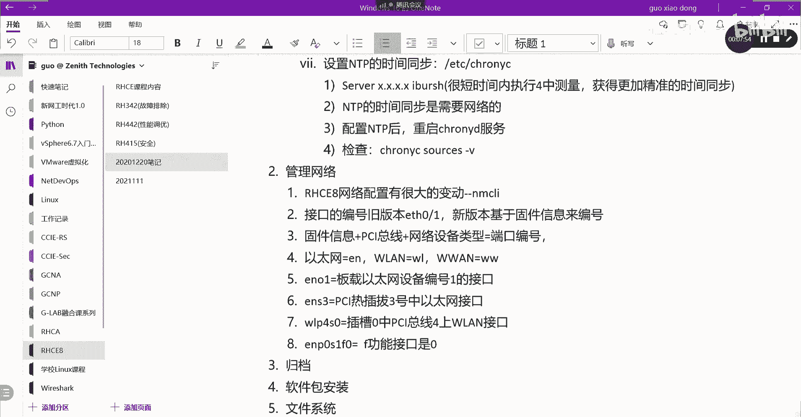

来，来我们IP address是不是能看到是这样，以这种接口方式啊，什么ENES0，E n p e s0，PCI e slot0对吧，以太网吧清楚了吧，这个就说到这。

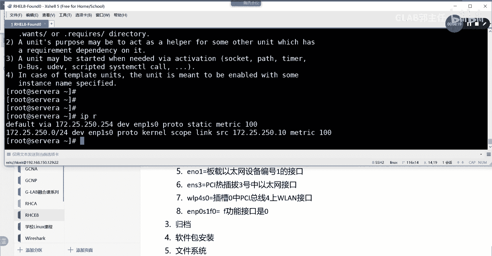

他的第一个就是接口的边边接口的标识不一样，这个很多人不太习惯啊，好第二个嗯，先写一个概念吧，然后把下边的都缩进吧，接下来第二点，第二点我们来看怎么去配置配置的方法，配置的方法有好几种。

第一种就是NMCLI，这是一个命令行的方式，这是一个命令行的使用方法，第二种方法叫NMNM退TIMT，这是一个图形化界面，考试的时候大家可以用NM退的，我先给你演示图形化界面。

因为命令好像很多人记不住啊，太费劲了太长了，我看一会我给你演示一下，很长。

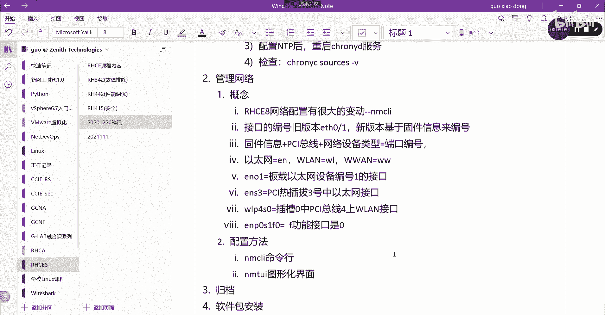

完全记不住，你看啊，NMTNMT应该是呃，它会自动调用系统的图形化界面，这个图形化界面是不需要安装任何软件的。

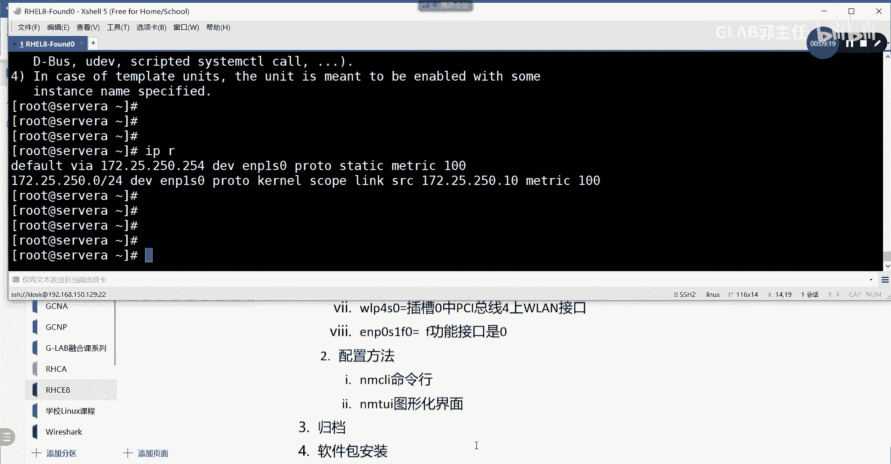

我们最好在系统里面，因为你用外边的话，它调用不了系统本身的图形化，所以我们应该在这儿我给你演示一下啊，图形化界面相对简单，很多同学记不住命令，就用图形化，好了好，来看看图形化也是通过命令行法调出来的。

叫NMT，就打这个命令NMT啊，T y n m t y，这个时候这个图形往熟吧对吧，就这么干的，编辑一个，然后我编辑一个，这是有限的，然后有线的名字是什么啊，Mac地址是什么IP地址该怎么配对吧。

Disable，手动配IP地址，然后配IP地址秀一下，然后你去下面去指定IP地址，一个去配，这个不用我教大家自己去摸索一下，应该都会的图形化界面，明白我意思吗啊，应该会的，应该会的啊，然后取消。

然后bu都是上下键退出来结束，听懂了吗，就这么干的，好接下来我们来看命令行，命令行的配置命令，命令行的配置命令很多大家不用记。

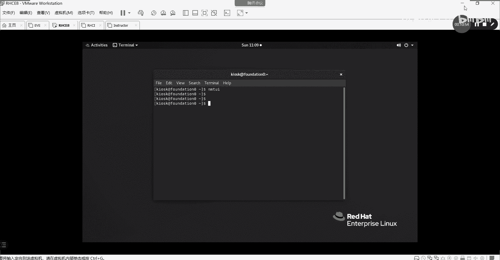

我教大家去查找帮助的方法，我们可以用may i m c o i gue，X a m p l e examples，明白好，然后呢我们找到example，七个example，九。

example7或者example9。

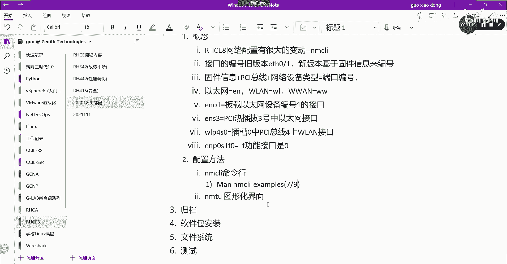

来查找我们需要关心的命令来给你演示一下啊，去卖一下main，这个我们讲过的NMCOI，这个命令的e x a m c l example好，第一个是七，你能够看到七的example啊，这是七。

七下面我们再搜EXAMPRE，看有没有诶没有诶，这个要往下翻的，在下面还不能直接给大家去搜索出来，在这，大家先看命令m CLI connection，ADD type类型是以太网的。

然后if name是这个名字的，对吧好，然后呢那个还有什么其他的其他的名字，这是做链路捆绑的嗯，要找一个跟我们相关的，GG挺多的，tab以太网啊，这个这是第一句话，先把他艾特进来。

然后再通过modify去改，那么这个是改它的Mac地址，改他的名字太多的参数了，所以大家很多人记不住这个这个东西啊，好这是七来看九，九在哪里，九在下面是吧，七和九啊，哦是这个这个是七，再看九。

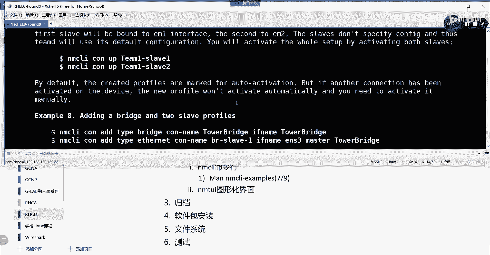

这个是九，九是改，你看九是改，你看ADD它的名字，if name是什么，type类型是什么，IPV4是什么，KTV是什么，IPV6是什么，然后去改他的DNS啊对吧，然后这个加IPV4，就是加一个DNS。

就这样做，这就是我们要看到的命令，各位把它记下来，把它记下，能明白这意思吗，啊啊记下来。

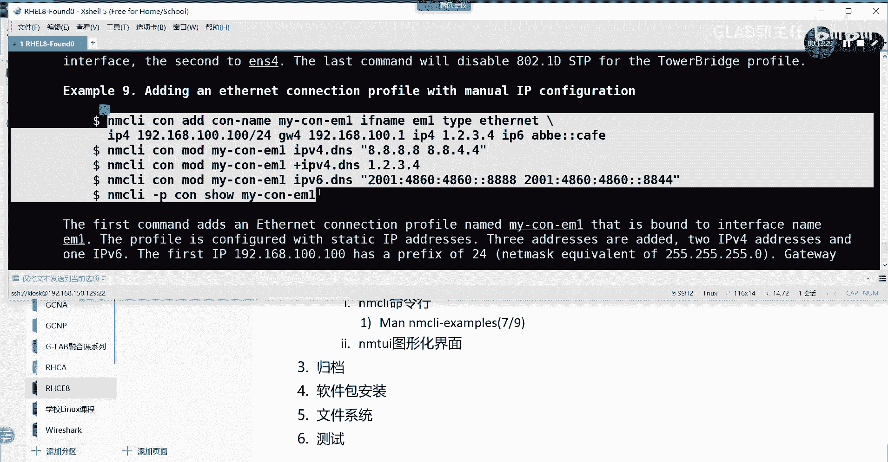

我给你演示一下吧，这个我还要增加一块网卡。

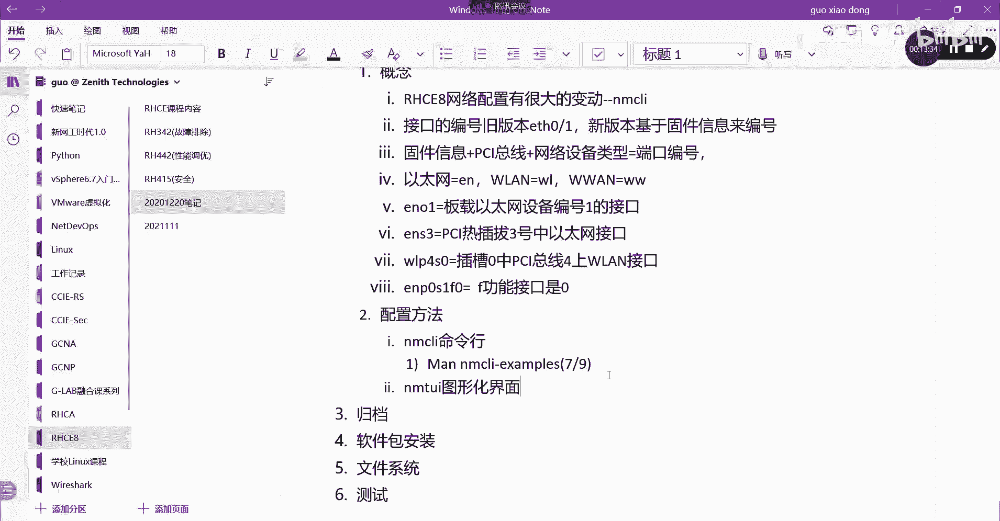

我把七和九的命令给他贴出来。

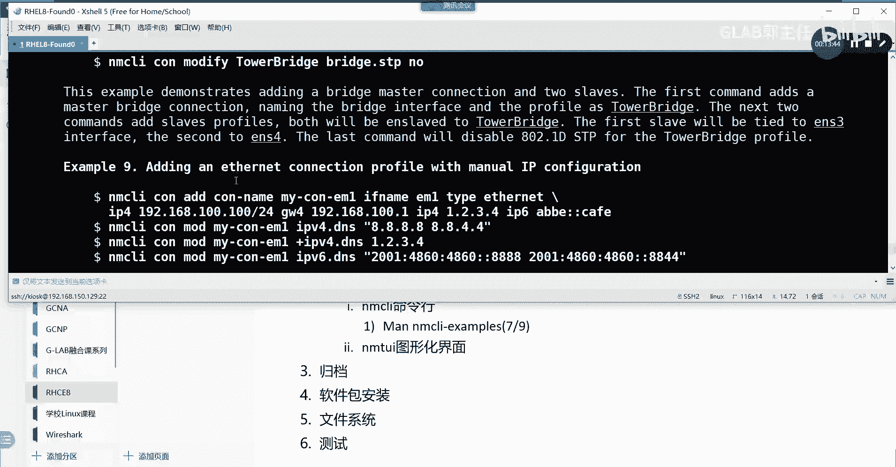

九啊，这个是九，大家可以自己记在笔记上。

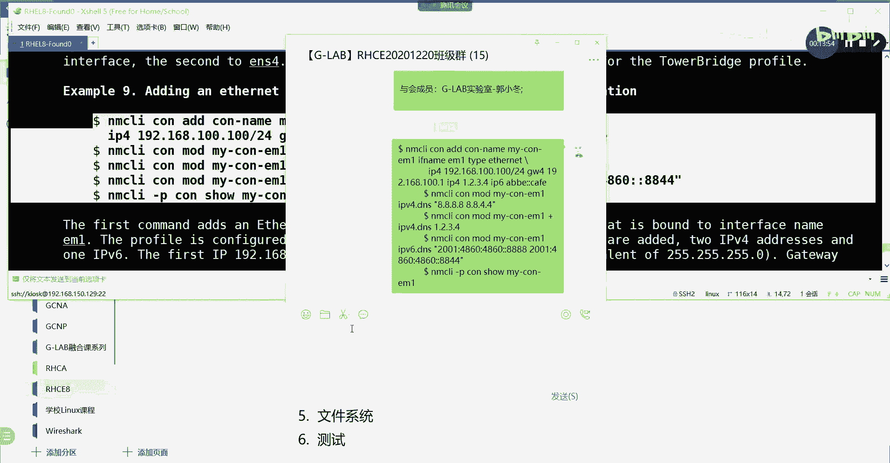

还有一个是七。

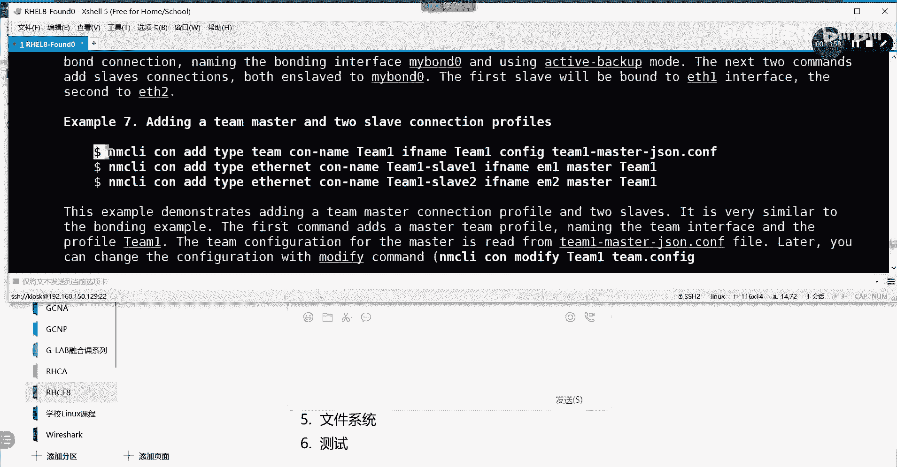

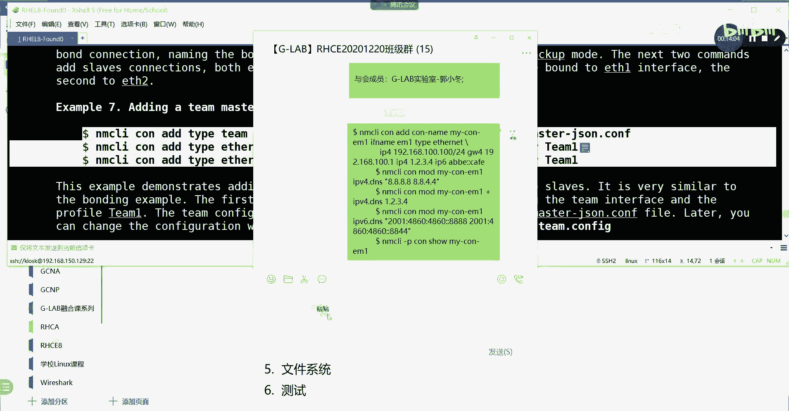

好了好了。

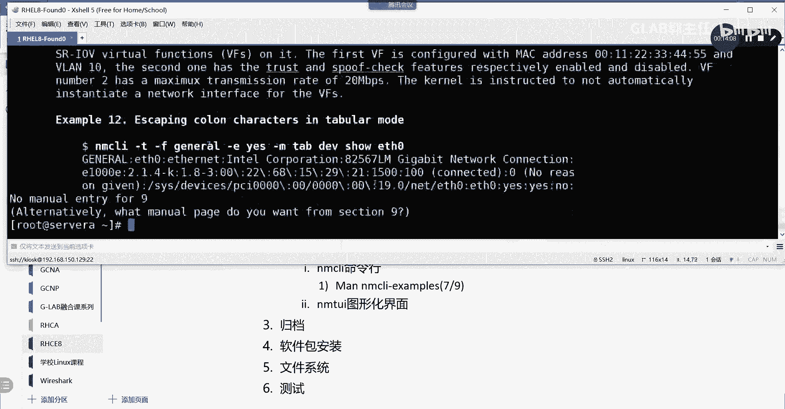

我给你演示一下，首先啊怎么去配这个IP地址，IP地址的话，我们就配这个现在的吧，我看看IP，我就假设他现在没有这个IP，这个IP是117225250。10对吧，好，我们来看一下MCOI，我们有几个命令。

常见的命令，先看一下connection，能够看到吧，nm cr connection是看现在的连接，绿色的代表这块网卡是正常的，能听懂吗，OK好NMCOI，还有呢如果想看这个网卡的详细信息。

NMCOI这个connection秀我秀什么呢，w i show这个网卡可以按tab键补全的，看这个网卡的详细信息，我们能够看到这块网卡的所有的信息都在这。

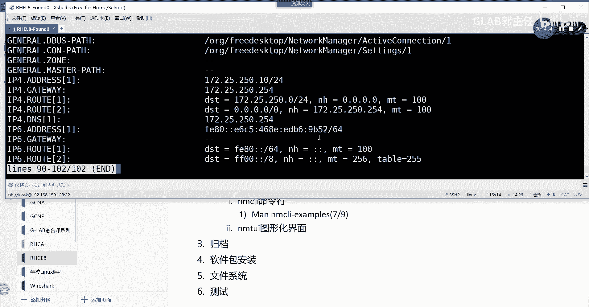

所以这是第二个命令，我把查看的命令给大家整理一下啊，第一个MCICONECTI，我们可以按tab键补全，这个是查看网卡的，不叫brief的一个信息，概要信息，概要信息，第二个呢。

N m c o i c o n n e c t i o n connection show，加上你的网卡的名字，WIE什么什么什么什么，这个是看网卡的详细信息，没问题吧，OK然后呢，接下来这次查看。

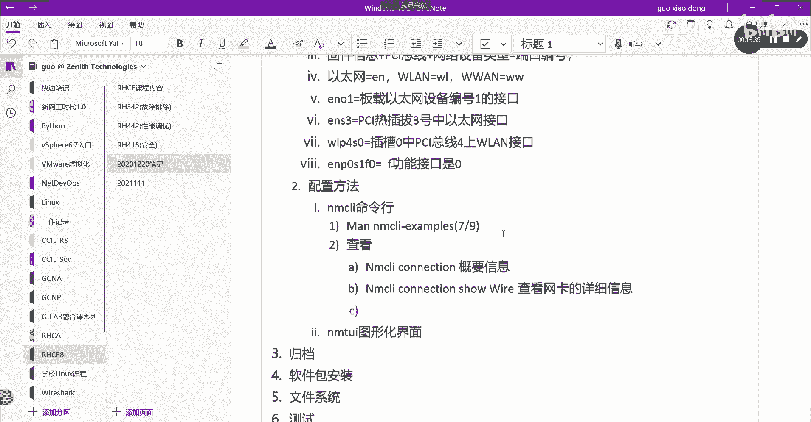

接下来我们要删除网卡信息，怎么删除呢，I m c i，因为遇到网卡信息的时候，大家看啊，Nm c r i，我们去看啊，M c l i connection，看有时候你看到的这块网卡它不是绿色的。

可能是灰色的或者是红色的，你可以把它先删掉，我现在一删就断了，我现在一三应该就断了，因为我是通过这块网卡来来来来来通讯的嗯，那个server a server a让我想想啊。

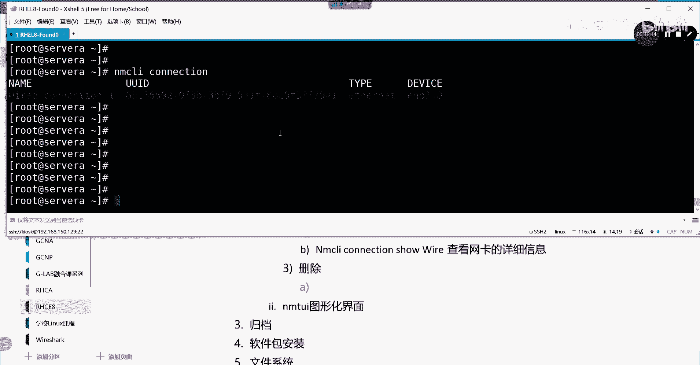

在里面做好了，我在里边，我去我去做server b server b，server b server b也是通过SSH进去的，这个房地产没有权限，放低是没有权限。

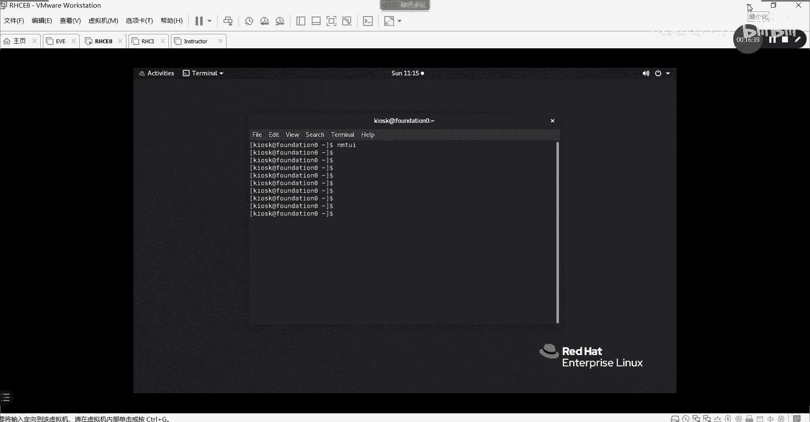

没关系，比划一下啊，NMC l i c o n delete delete是删除我们把这个网卡，就只要只要写这个名字，把这个网卡删掉，就是这个命令通过它去删除我们一张网卡，这个删除不是把网卡直接去掉啊。

只是把网卡的配置信息，原有的配置信息给它重新删掉。

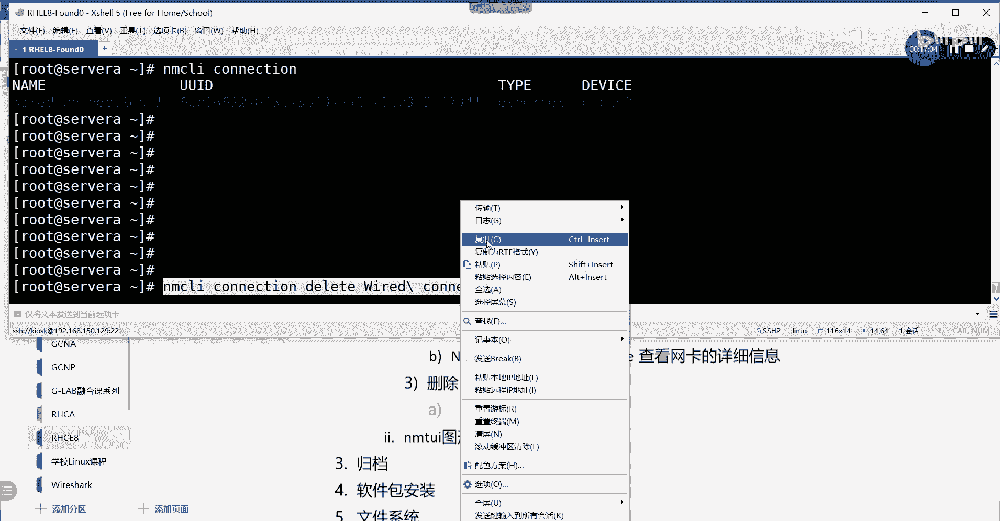

然后你可以重新建，所以这个是我们的删除，大家先记住啊，看到没，这个是你的网卡的名字啊，这是你的网卡名字好，删除了以后我们再增加，因为有时候你直接去改的话。

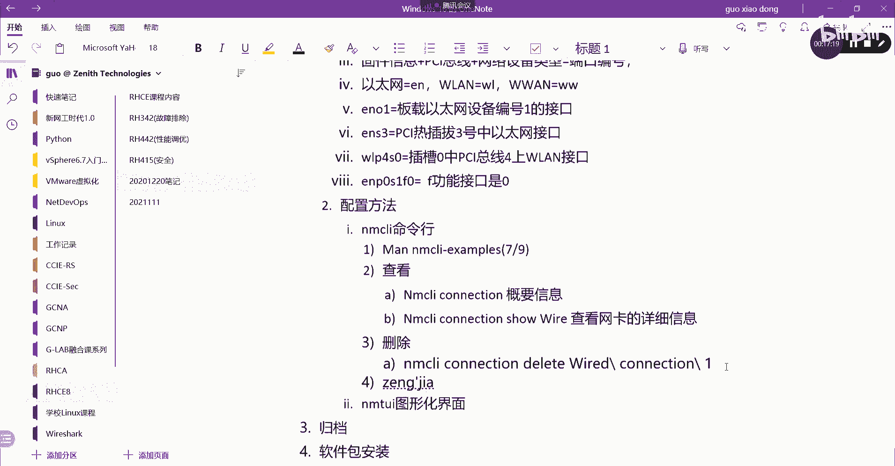

可能会有问题，所以建议大家先把你要处理的那个那块网卡，先delete掉，用这个delete命令先删掉，然后再增加增加怎么增加呢，就跟我们刚才看到的命令是一样的。

Nm c i connection add，ADD是增加了，增加的时候你要去指定它的type类型，type类型，ETHERNET以太网吗对吧，然后他有两个名字，一个叫if name。

if name和if name，就是这里的名字啊，就是这里的名字对吧，就这里的名字我们给它起叫EMPES0，E m p e s0，然后还有一个叫connection，Connection name。

指的就是这里的名字，能理解我意思吗，好那么这两个名字不一定要一样，但是你要这里的e if name，这名字要跟这里的一样，不一样的话，你还要去改后台的配置文件，太麻烦了，所以建议大家删掉了以后。

删掉了以后再重新增加的话，你要看清楚原来的device的名字要写，要写成这个if的名字，然后connect name不一定要跟原来一样，是指这里的名字，你可以跟ENSES0吗，叫ENPES0。

这个能听懂我意思吗，各位好，原来删掉了，所以我需要再写一句。

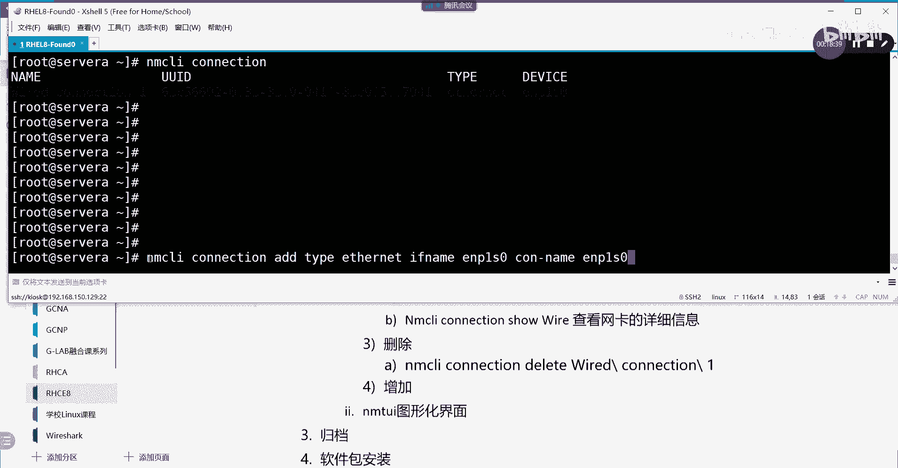

把它加进来，这就是我把它加进来的，第二句话增加，增加增加完了以后还没还没完，第四第五步要修改，因为你只是加了一块网卡进来。

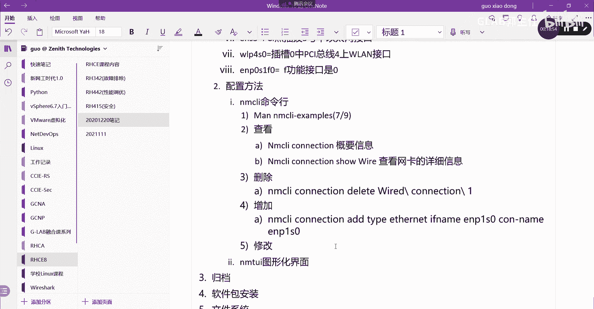

配置信息的网卡进来，你还没有对它进行修改，接下来要修改了，修改怎么改呢，它就不是ADD了，叫叫modify，对不对，好改什么，改这个ENSEMPES0对吧。

你要改你刚才增加的那块网卡的device name啊，E e n p e s0，接下来我们要改它，改它是什么东西呢，IPV它后面很多东西啊，你想tab键补齐，看能不能补齐诶，EIPV4哪里写错了。

modify确认一下啊，ADD这个是ADD modify这个MD，modify的来看啊，connection是吧，Modify，OK然后去改什么呢，改我们刚才的这个啊，应该是这个，因为我刚才没删掉嘛。

改的应该就是这个，你刚才前面那个名字就这个，因为我增加的名字和这个名字是一样的，所以我写EMPES0没问题吧对吧，所以这边你要改哪块网卡，这个名字就是我们的connection name。

就刚刚增加的这个cn name。

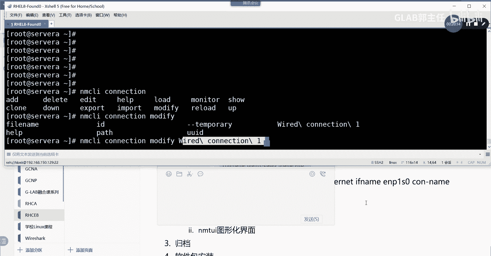

就这个名字去改这个名字，修改好。

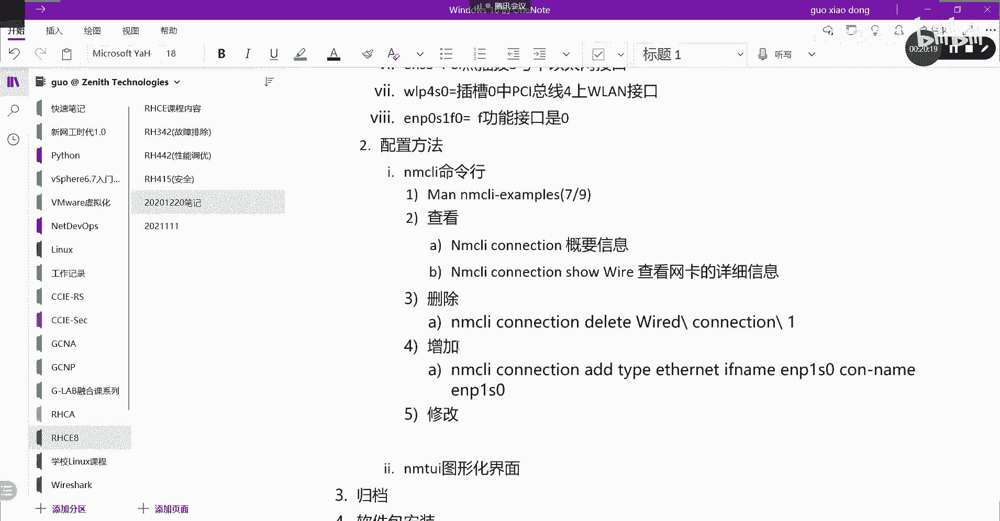

修改它，这接下来可以改的东西很多啊，你看比如说这里都能改，这些都能改，你看两个tab键，它会帮你说出来，比如说IPV4，跟我们相关的IPV4dress等于什么，1。1。1。1杠24。

这就把它改成IP地址了，这个能看得懂吗，我就尽量的用个IP地址比划一下，还有呢IPV4点gateway，1。1。1。2可以吧，还有什么呢，IPV4点D我们常见的就这几个吧，8。8。8。8，明白意思。

常见需要大家改，保证一台机器能正常上网，能够正常跟外面通讯的就是地址，野马野马在这边一起写了地址掩码gateway d，先保证他能上网，到时候后面再说嘛对吧，所以这一这一串是我们命令行里头修改的。

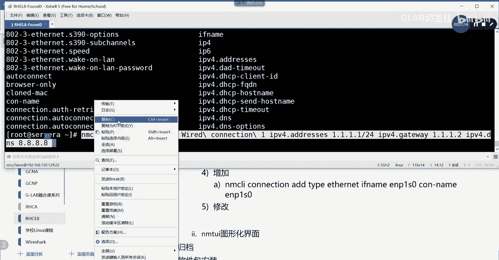

这一串接过来，所以很长，大家自己要去自己整理明白了吗。

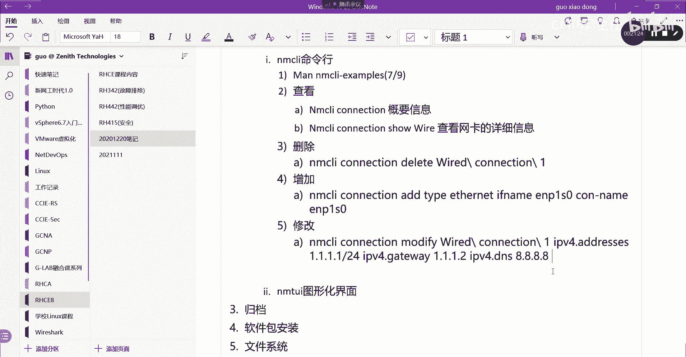

好这些东西修改完了以后，还有一些琐碎的参数，那你自己去看了，按tab键补齐，他后边你能看到的所有东西都可以改，DHCP呀对吧，都有Mac地址啊，都是在这个里面加加选项好不好，那么这个弄完了以后。

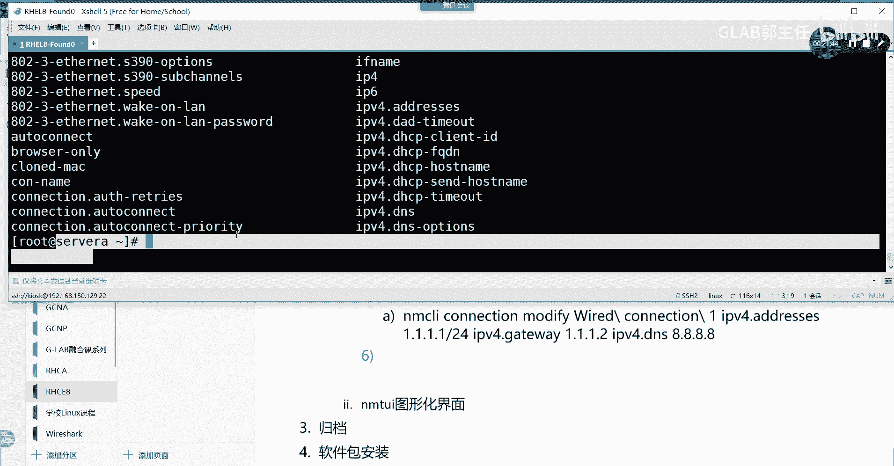

好这个弄完了以后，接下来我们来看第六步要干嘛，要重启网卡，重启网络服务，你所有的改动改完了，都需要去重启一下网络服务，这个网络服务怎么做呢。

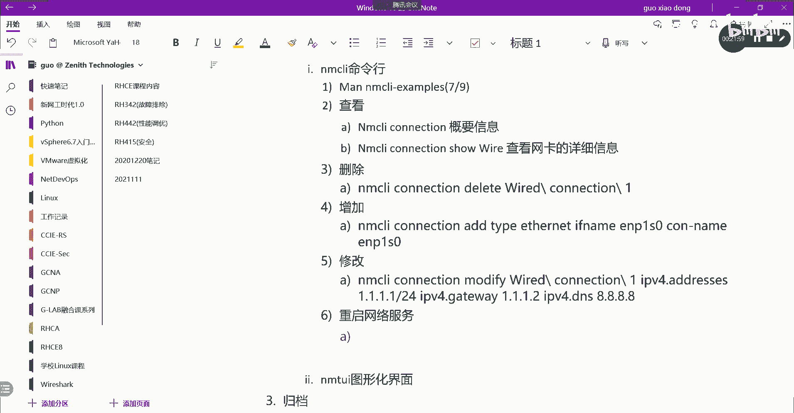

肯定还是通过on m c i啊，它有一个NMC i connection reload，有看到吧啊，这个是重启网卡，它不会重启其他服务，他只重启网卡服务，叫im connection reload。

这个重启差不多有个五秒钟左右，大家再去查看一下。

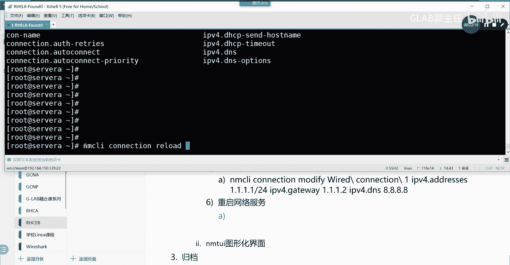

所以这个要做的这个不做，你的网卡不是立即生效的啊，还有重启的，你要么重启系统，你要么重启服务，M c r connection reload，看懂了吗，然后再用上面的查看命令，上面的查看命令。

再补充一个简单查看IP。

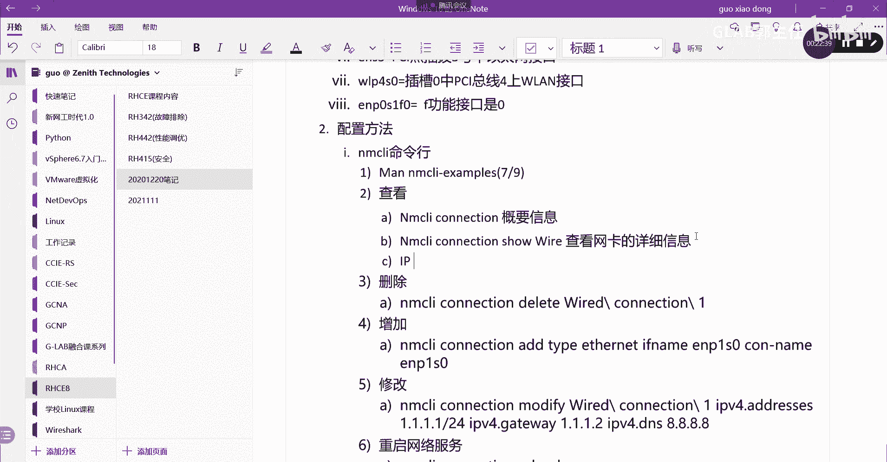

IPR就这么简单，IPR重启完了以后，IPR这个是简化的一个命令，或者叫IP link，是不是也可以，IPL或者IP link这个这几个命令。

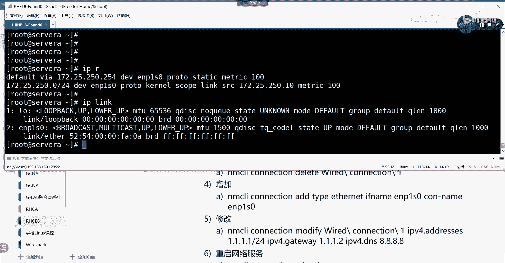

大家都可以去试着看一下，简单的看一下IP link好吧。

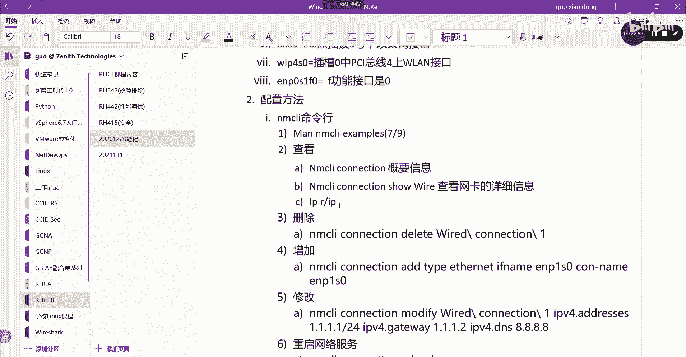

还有什么大家平时常用的叫IP，是IP configure还是if config，老跟windows搞不清楚，if啊，if config figure叫查看这个名字，诶好，你可以去看。

if configure总共就两个。

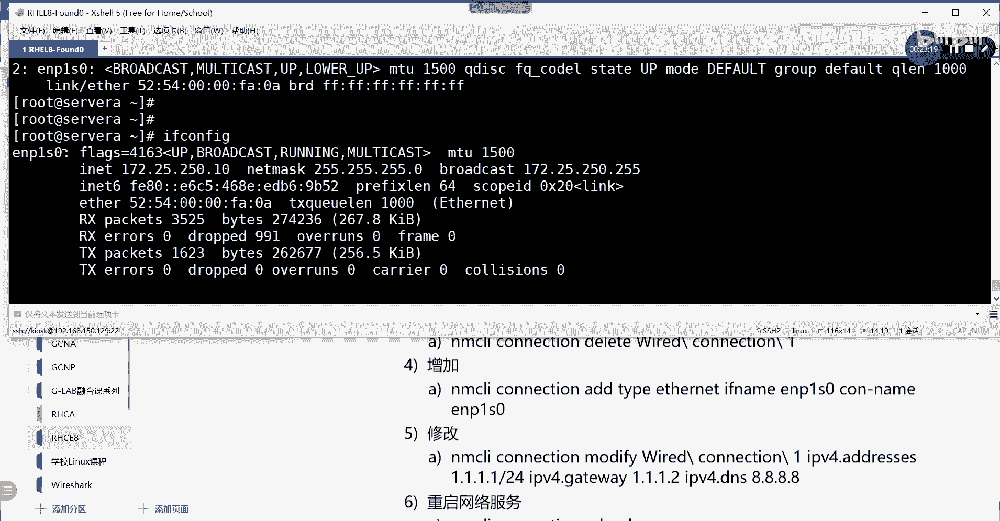

你跟这个名字吗，就只看这个网卡，If configure，if可会了，也是查看的啊，就是他的网卡服务都起好了以后，你可以去查看一下吗，OK那么这就是我们的常规配置，另外还有一些配置文件。

我要给他整整理一下图形化界面，就是用这个来做的，那么还有一些相关的配置文件，相关配置文件，第一个D的客户端的配置文件在哪里啊，在etc下面的有一个叫reserve文件，RESOLV点CONF在这里。

这个是什么DN相关的DNS客户端的配置文件。

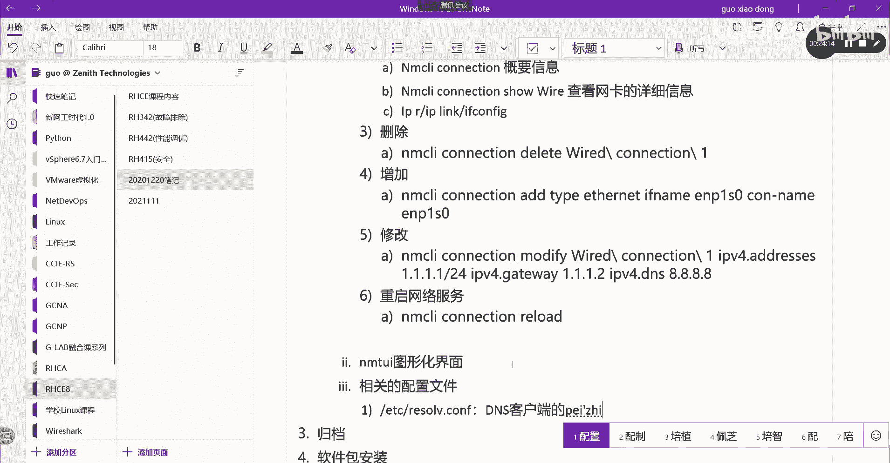

我给大家演示一下，在这啊，在etc下面的etc下面有个reserve文件，这里头配置的就是我的，这里头可以去配你的d server，那当然D也可以用，刚才MC2在后面写IPV4D，听懂了吗。

也可以去直接改这个配置文件，把它的这个name server改成D，这就是DNS啊，这就是DNS好不好，这个是第一个第一个配置文件。

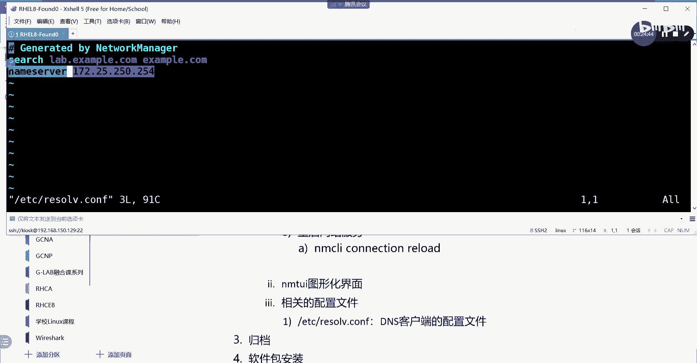

第二个第二个有一个叫etc，下面有一个叫hosts，这个跟windows一样，好理解吧，这个叫本地的，本地的这个这个这个这个对应的解析文件吧，叫本地文件，本地host文件。

本地host文件这个文件是优先于DNS的，不用我讲吧，这个要去查找任何DNS，这个host文件是优先于resolve里面写的DNS。

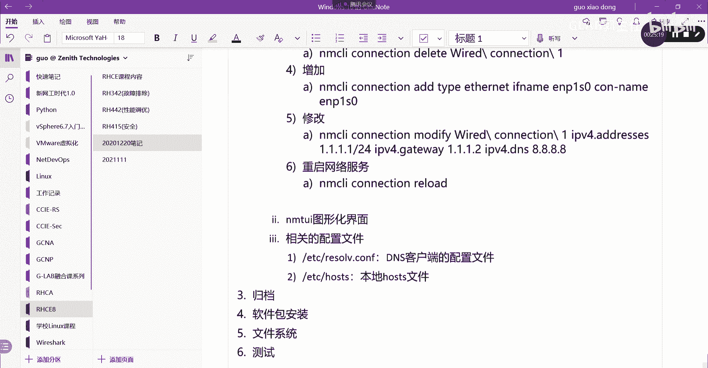

DNS它是优先解析的，所以还是要看一下你的这个hosts文件，在etc下面有一个house好这一堆东西啊，优先于我的D明白吗。

各位为什么我在为什么我在workstation能直接SSH server a，是因为他在这个host文件里写了短域名的，很多人这个问题问过我的，他说为什么你的你的域名主机的域名这么长。

你却可以直接写一个server a就到server a上了，我说请你去看看你本地的host文件，能听懂我意思吗，各位直接访问就可以解析到了，这个短域名host文件里面有好。

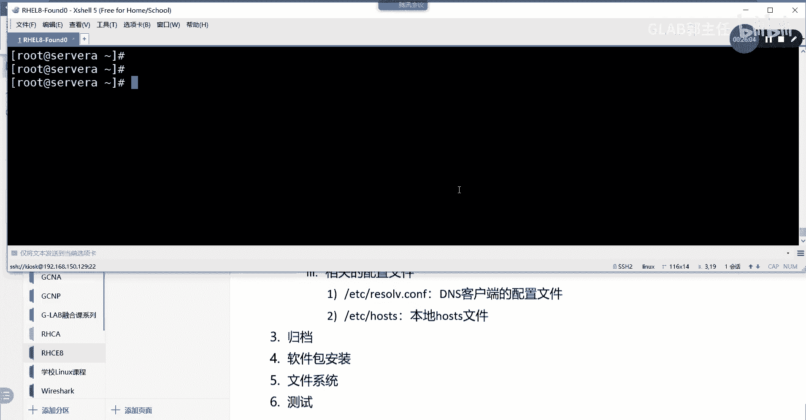

这个是第二个啊，然后呢这个这两个重要，还有一个重要文件，是所有的网络信息的配置文件在哪里，在这太长了。

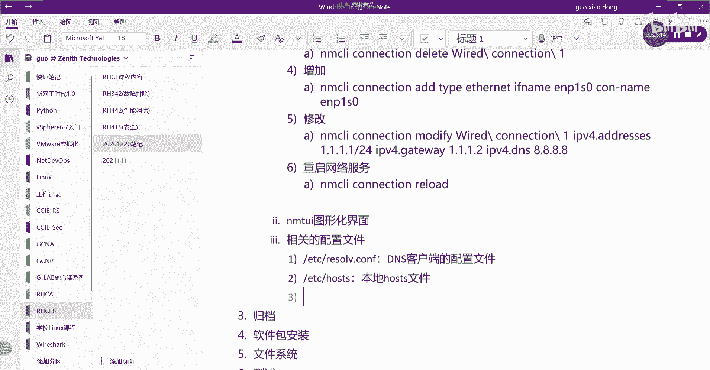

就是以前的编辑的那个网卡配置文件，我们去编辑一下，在etc下的SYSCONFIG里面是不是net什么script，里面是不是有一个if y就这个文件，这就是我们之前原先配置的那个文件。

现在官方不建议大家去改这个文件，听懂我意思吗，很长啊，这个很长，直接通过MCLI去修改前端的命令就有了。

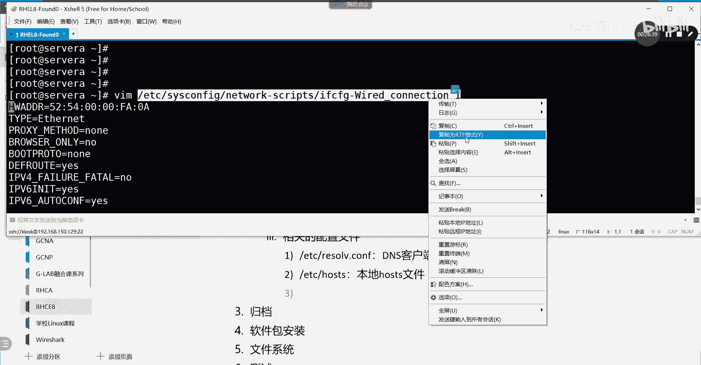

你不需要去修改这个东西了，但是也需要给大家说一下，这是我们网卡所有信息的配置文件，OK好相关文件，然后通过mi命令行去改，通过网卡去改呃，呃通过图形化命令去改，差不多了，好吧啊。

其他的应该没有什么可以给大家补充的，另外呢再补充一个图形化界面的方法，叫这个图形化界面的方法，其实是RH红帽八更新以后的，这个也算是他的一个改进吧，就是web界面，但是你要能够web界面对它进行配置。

需要安装一些东西，需要安装一个什么东西啊，要要么一下，要么接下来就讲INSTALL，要么install c o c k p i t信号先安装一下，安装完了以后，我们要要要要要开启一下服务system。

这是一个服务啊，就图形化界面，web界面能访问他的服务system Ctrl的一个服务enable啊，然后呢杠杠now，杠杠now，后边有一个code pit，来我给你演示一下。

大家看到这个图形化界面之后，后边我们包括接下来要讲的很多东西，都直接可以在这个图形化里面做，很多人说哦，那我要学命令行，学个P啊，直接直接用图形化就好了，那我们来看一下CPIT。

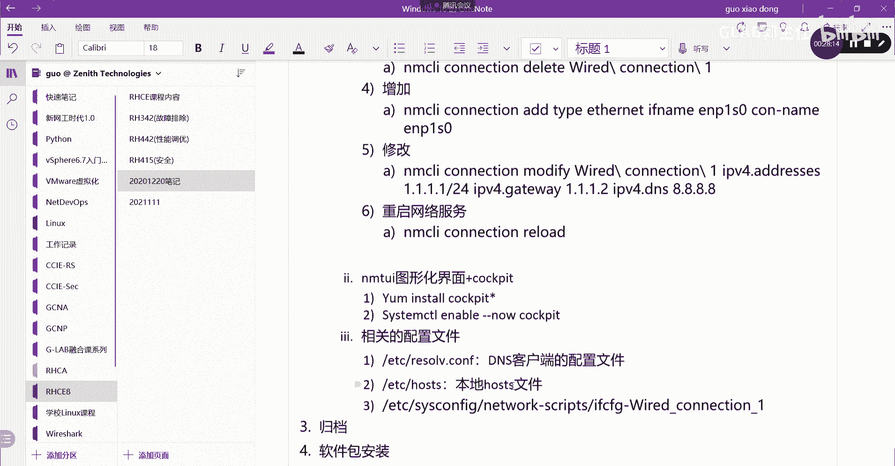

大家看过吗，没有吧，我不知道这个应该是不是装过了，应该装过了吧，我看一下啊，呃SSH我们蹲到server a上好了，server a我们来看CCT2，STATUS里面是不是有cockpit哦。

没没装是吧，没装没关系，我们要装一下啊，要么use store，我们把coo c k p i t信号杠Y我装一下，是啊，因为我要么原是配好的，所以直接可以装，好在它安装的过程当中。

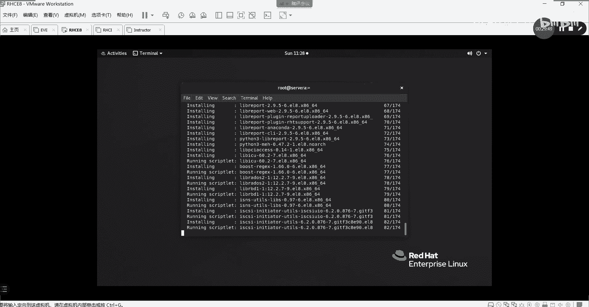

我们再补充几个东西，应该还有一些东西要补充的，补充吧，第一个我们可能要去改主机名，修改主机名用什么host name c t r，这个是修改主机名啊，Holic t l。

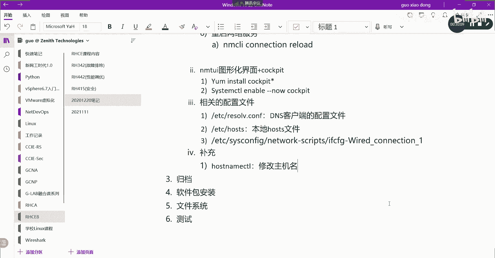

大家可以先看一眼，那比如说我在这了，可以看一下他叫host name Ctrl，通过这个命令能看到主机名啊，内核啊，所以这个命令也会常见的比较常用的，OK还有you name，Your name。

大家比较常用嘛，you name杠A这个看的不是很详细，我也不太建议大家用这个命令，所以一般用host name t2看的比较详细一点，那么修改用户名的话。

就用HOSTNAMECTRL加c host name吧，把名字改改，改掉之后再host t改了吧，各位明白这意思吗，所以没什么好说的，我看看啊，还有什么东西需要跟大家提一下，应该没有吧，应该没有了。

那么呃，应该没有了吧，应该就这么多。

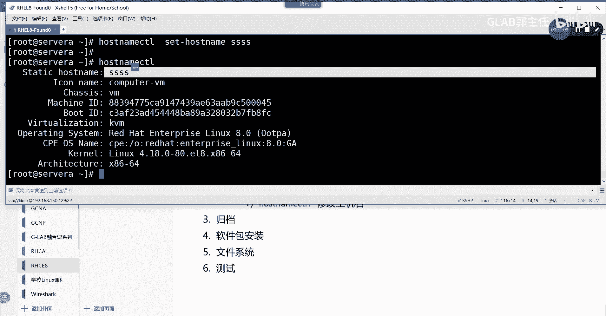

好，来我们等等这个server copy，装完我们用我们用图形化界诶，装好了，装好了之后，我们用图形化界面进去看一下这个cockpit，装完以后，我们要给服务重新起一下，SYSTNCT2对吧。

然后enable这个杠杠now copy好，重启好了以后，我们再打开浏览器，只要网络通啊，一定要网络通，然后打开浏览器去访问我们这个地址。

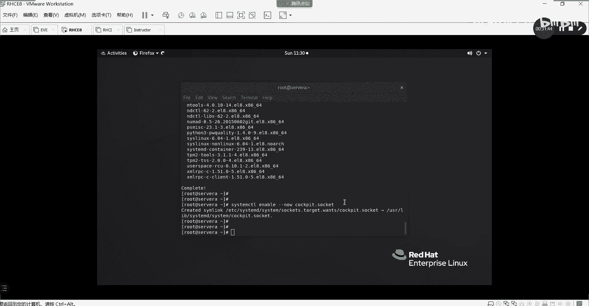

好那么访问这个服务器地址，用户通过HTTP去访问，我们可以直接访问server a吗，端口号不是808，端口号不是43，应该是9090，通过cockpit去访问它的端口号是9090，ADD啊。

这什么鬼东西。

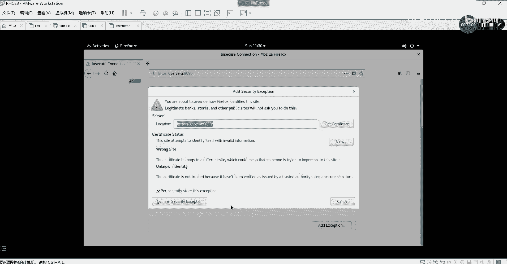

confirm petition进来了吧，现在我这个登录的界面就是server i，这台服务器的web界面管理，我们可以对它进行登录，你可以用普通用户登录，你也可以用超级管理员，权限不一样嘛，对不对。

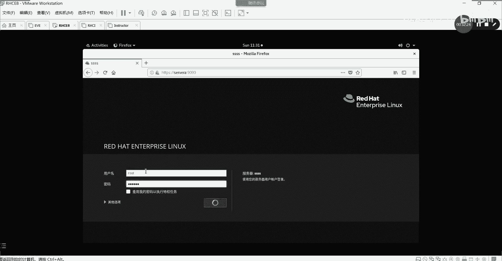

很明显，这是一个非常直观的图形化界面，用户名看到没，这叫host name，主机名对吧，我可以在里面管理存储，查看日志对吧，调试网络，听懂了吗，所以给大家演示这个之后，发现。

最后发现我前面学的那一堆命令，都可以在这实现，但是我要告诉你的是，这个初级工程师才会看图形化界面，高级工程师一般都是敲命令的，因为命令会来的更快，而且图形化界面它现在还有很多bug。

这是RGEEL8后面才增加的东西啊，就是红帽八才有这个叫coke page，然后他为什么要有这个呢，当时我们参加原厂培训的时候，原厂环保工程师跟我们讲，他说未来对运维的定义就两个级别。

一个级别就是很low的这种主要负责监控的，就直接看图形化界面啊，只要看看这个这个这个dead叫dead bush是吧，看这些东西，然后告诉上面的人出现什么问题了，第二个级别就是直接可以去分析优化内核。

就是敲命令那拨人，所以他会把很多的简单的运维工作做得更直观，让下边的初级运维，更好的去做对监控的一些工作，然后高级运维还都是要做更深层次的，命令行的一些操作的，大概就这么个意思对吧，所以大家建议啊。

如果实在搞不定，你就用图形化吧对吧，如果能搞定的话。

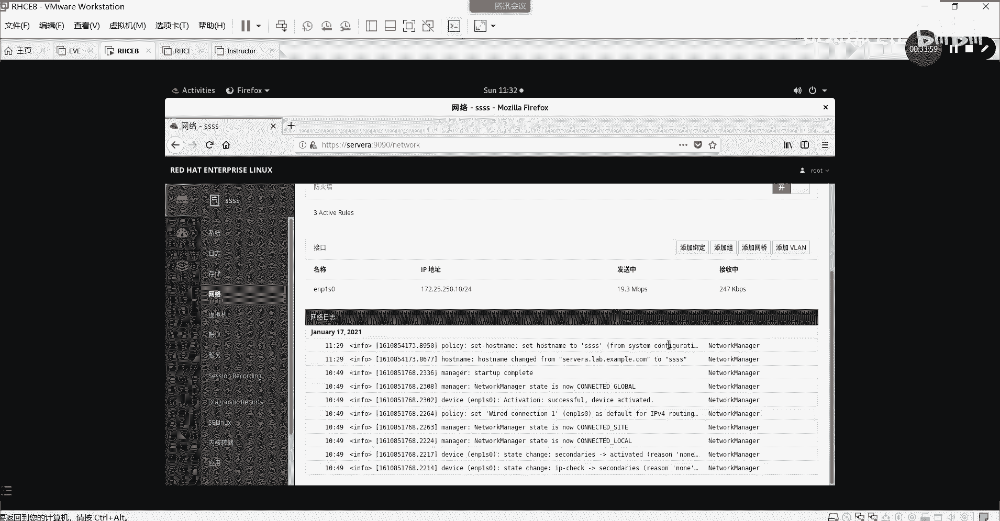

就用命令行，就这个简单到最后给大家讲一下这个事情好吧，这叫这个啊，其他我看没什么好补充的，应该都网络这块应该都好了，主要还是集中在NMCRI这个命令里面好，那么大家把作业。

最后的作业420页是需要大家做的，这个是课后的，我说的这些都是课后的好不好，然后今天还有123，还有三个东西，上午应该还能再讲一个好吧，我们上午把归档讲掉。

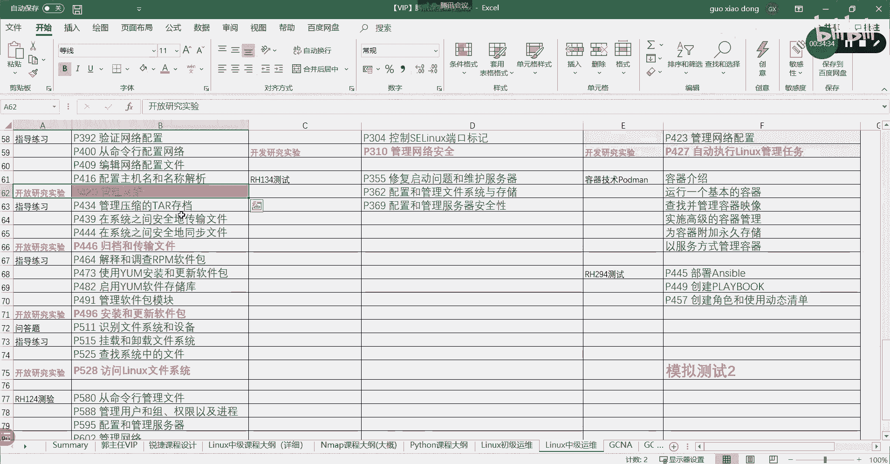