# 【Linux／RHCE／RHCSA】零基础入门Linux／红帽认证！Linux运维工程师的升职加薪宝典！RHCSA+RHCE／21-文件系统 - P1 - GLAB郭主任 - BV1XC4y177hx

后边啊后边其实在接下来要说的这个文件系统，只是简单的介绍，在你看在后边，我们在后面两天会给大家重点介绍，存储相关的东西，现在只是简单的总结一些基本概念好吧，文件系统，来概念什么叫文件系统呢。

回顾一下我们文件在就跟存储相关的，我们在前面有讲过，跟存储相关的存储，要要把你的系统里面，数据放到我的存储的存储的硬盘上面，我们必须有几个条件，或者有几个有几个概念，你必须要理解的。

第一个是i know和block，前面讲过吧，就系统是如何能够读取到文件并且存放文件的，它一定是通过i note和block的关联，i note是i note是数据在存储上的唯一标识，是一个id。

是不是block是实际数据存储数据的地方吗，实际的硬盘上存储数据的地方，所以i note和block的这个概念前面有讲过，大家一定要知道好，这是我们要概念讲的，第一个数据在系统当中存储。

一定是叫系统读取数据的过程，它里头有两个概念，II和block要理解，OK前面有讲过啊，这是第一句话，第二句话，我们整个在系统当中，对存储的访问是跟什么东西直接挂载的，存储是直接挂载在哪里被读取的。

存储空间是直接挂载在哪里被读取的，挂载在目录，对不对，还记得吗，我们的系统当中你就不不看存储啊，整个系统的架构其实最顶层的目录就是根目录，根目录下会分一级目录，二级目录，三级目录能听懂吗。

而我们把很多东西是不是都放在目录里面，对不对，而整个的架构里头并没有像我们windows理解的说，有C盘，D盘，E盘，没有啊，C盘D盘E盘这个很简单，哪个盘就哪个存储空间，对不对。

但在LINUX里头他没有CDE盘，它都是目录，所以很简单，第二句话要理解的就是存储的，我们所有的文件系统或者叫存储，是直接跟我们的目录关联的，对吧好，一切存储都是跟我们的目录关联的。

这个关联可以用另外一个词代替，它叫挂载，听懂吗，所谓的关联就是挂载，我可以把某一个磁盘，某一个盘啊，100G或一个T把它单独的挂载给某一个目录，那你像这个目录放文件的时候，它其实就放在这个盘里面。

能听懂我意思吗，各位OK，所以在LINUX系统里面，一切的存储都是跟目录关联的，这一点一定要明白，一定要明白好听，明白了啊，这是第二句话好第三句话，在文件系统在存放文件系统的时候啊。

我们要对文件系统要能够被目录挂载，要经历几个阶阶段呀，就是一个存储或者叫一个存储存储单元，或者一个硬盘，一块硬盘能被挂载给目录，存放数据需要经历哪些阶段啊，这个硬盘挂上就能用吗，不能需要经历。

第一个是不是要分区啊对吧，第二个是不是要格式化呀，格式化的本质是确定什么文件系统，对确定文件系统才能向你放数据啊，好第三个阶段格式化了以后，第三个阶段就要经过关联关联，跟我刚才的一个词叫挂载，听懂了吗。

你这个牌都弄好了，你不挂载，你怎么能不用呢，所以一定要被目录挂载，挂载是给什么挂载，目录挂载啊，比目录挂载，这是我们都是我们前面讲的东西啊，听懂了吗，给目录挂载我才能用啊，才能用，OK那么既然有挂载。

就有取消挂载对吧，或者叫卸载都一样的，对不对，我可以把已经挂载给一个目录的磁盘卸掉，挂载给另外一个目录可以吗，可不可以可不可以，可以，文件原来原始的存储，存放在磁盘里的数据还在不在在理解吗，在的啊。

所以你可以任意的去切换你的挂载目录，它里边的数据还是存在的，是跟着跟着这个挂载走的，听懂了吗，好，那么这个挂载我们在后面会给大家讲两种，三种类型的挂载，一种叫手动挂载，一种叫自动挂载。

就是怎么去把目录和磁盘关联起来，我们有三种方法，第一种叫手动挂载，第二种叫自动挂载，第三种叫按需挂载，按区挂的就是我们要用到第三方软件，这个第三方软件叫auto auto，就auto fs。

这个是我们考试的一个重点考试，会考按需挂载，当然这个自动挂载可自动挂载是必考内容啊，这三个都要只是有一题专门考auto fs好不好，这个是我们的挂载，挂完了才能用啊，好这个是硬盘要能被数据读取。

必须要经历的三个阶段啊，必须要经过三个阶段啊，好那么说到格式化确定文件系统，这里要再补充一下，我们在LINUX系统中常见的文件系统有哪些，常见的文件系统有，啊有二EXT二XEXT3XEXE4，对不对。

还有什么XFSXFNS，也是一种新的文件系统，能听懂意思吧，还有还有很多啊，还有呃，Reset s e r f s，Reset，Reset fs，Recfs，OK这是存放小文件的，这是存放小文件的。

这个都能理解吧。

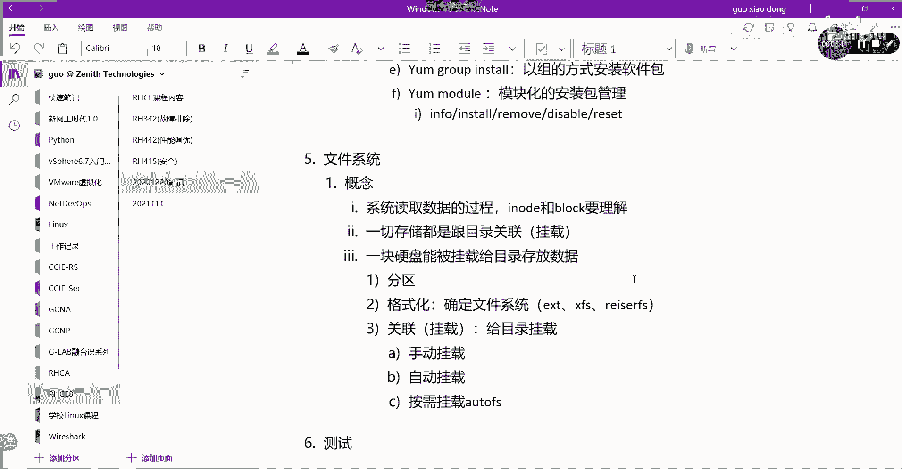

好其实他们支持的文件系统很多，那么我们怎么看操作系统，能支持哪些文件系统呢，有一个命令可以帮大家去看，查看系统已经安装支持的文件系统啊，通过IOS杠叫LIB，下面有一个叫mod models啊，最下面。

嗯还要加一个反的，大家先看我写什么意思啊，you name杠R先执行它，然后k e r n e k e n e l corner是吧，Cofs，看到了吧，这个不是单引号啊。

这个是tab上面的那个叫反引号，我们讲过吧，反引号是可以直接先执行的，把执行的结果u u name杠R，大家看看执行结果是什么，是不是我的内核版本嗯，这个命令这其实是一个完整路径。

只不过我不想去写这个内核版本太长了，不记得，所以我用反引号UMR把它调用，调用一下我的内核版本，然后就放在这个路径里面，这是一个完整路径吧，当前操作系统能支持哪些文件。

系统取决于我这个kernel fs下面有没有安装，能支持NFS吧对吧，那么NFSD能支持XFS可以吧，EXT4可以吧，feat可以吧，所以这里能看到所有safe也可以啊，shift也可以。

CFS也都可以，所以这里看到的就是我们操作系统能支持的，所有的文件系统，听懂了吗，OK也可以用这个命令去看啊。

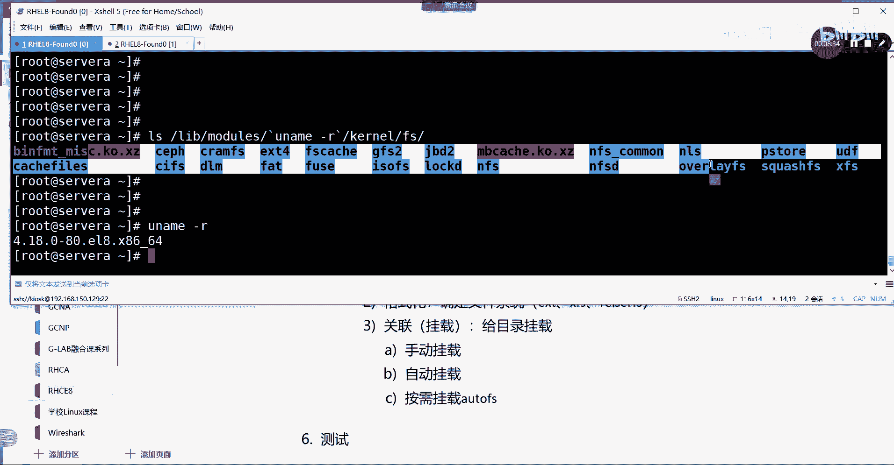

大家可以自己记一下，可以用这个命令去看，我就把它写在后面了，好就这面OK好，那么这个是没什么问题的，接下来我们来看，接下来我们来看这个手动挂载，我们应该用什么命令，手动挂载很简单。

mt自动挂载跟一个文件有关系，跟叫etc下面的fetal festival，我可能没写，对这个EGFSTAB啊，FSTAB没有L，所以手动挂载就用mt，然后编辑自动挂载，就是所谓自动挂载，就是重启之后。

他还是帮你挂好了，手动挂载只是临时的，重启之后就失效了，临时挂载重启失效，这个清楚吧，好自动挂载就是重启之后，重启之后还是挂载的，就是重启系统啊，自动挂载上去，明白按需挂载的概念。

就是需要的时候才帮你自动挂载，这就是三个挂载的区别，能听明白啊，这个没什么问题啊，好接下来给大家讲，跟查看管理我们的存储相关的一些命令啊，这个命令我们就比较简单了，介绍一个吧，不止一个吧，应该，命令啊。

第一个叫DF。

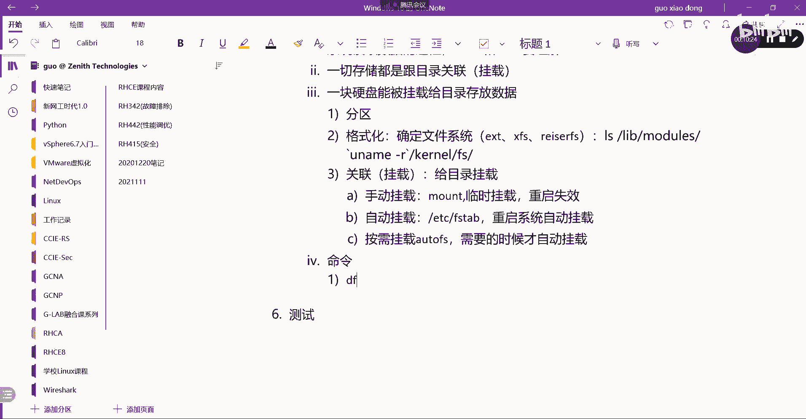

看查看当前我有哪些这个这个挂载的存储，通过DFDF看到了吧，DF看到我给你解释一下，DF后面有一些参数，杠THT的话就是先说HH就是H就是这个size，以我们人能看得懂的方式给我们显示出来。

P就是显示挂载的这个存储空间的type类型，就文件系统嘛。

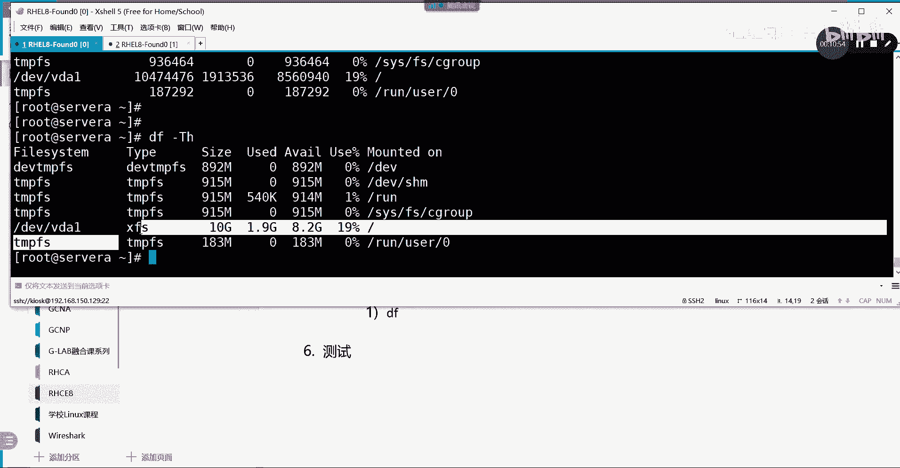

其实就显示文件系统能听懂吧，所以常见的杠大T啊，小H，这是我们常见查看挂载存储的一些详细信息，查看系统挂载的详细信息，听得懂吗。

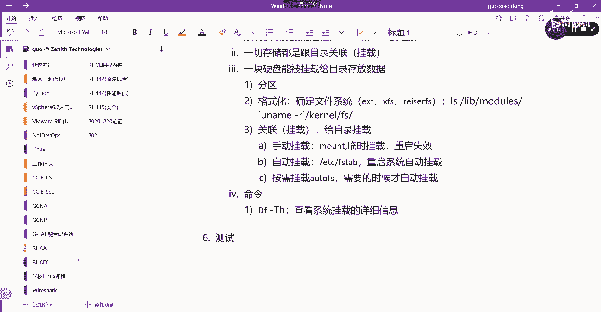

OK这个不难吧，这个很简单，那在这里我要给大家简单的解释一下，在看到的这个哎，他说系统有这么多吗对吧，有这么多吗，看到d EV tap，还有下面的三个键盘FS，总共加起来四个了，再加最后一个FS。

也就是说，这几个它都是系统在安装的时候自动产生的嗯，能听能理解为什么这个叫这个，这些都是啊，这些都是内存中的文件系统，系统重启之后，这些里边的文件都会消失，能听明白，所以大家在看文件系统的时候。

这些可以忽略不看，理解吗，你把这些去掉之后，是不是只剩一个了，是不是就只有他呀，只有他你看一目了然，我们就只看这一行好，这个叫文件系统的磁盘符，理解吗，盘符就是你这个文件系统的名字叫什么。

就叫VDAEDEV下面的VDA1，第二列这个叫什么文件系统嘛，对不对，第三个呢就这个文件有多个磁盘有多大吧，十个G第四列用了多少，第五列还剩多少吧，第六列用的百分比吧，最后一列挂来点挂载点，很清楚吧。

我所有的文件是不是都放在根目录引申出来的，所有的子目录下面，所以我把这十个G的盘直接挂给根下边，所有的地方不都有地方放了吗，理解吗，如果我现在要求大家再搞一个盘出来，再弄一个盘出来好。

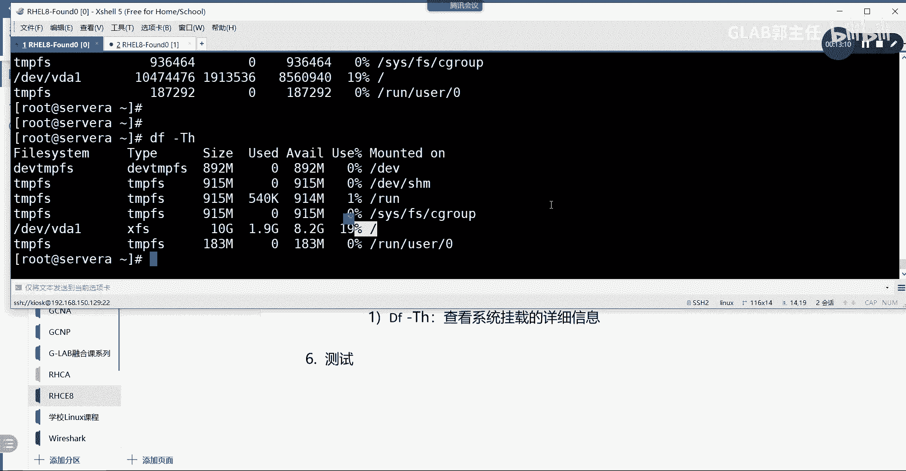

现在我看到的是正在使用的情况，我想看这个服务器上有没有其他的盘。

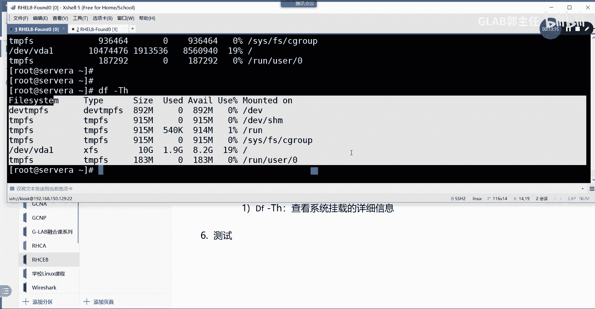

没有用的，怎么看，有第二个命令叫LSBLK。

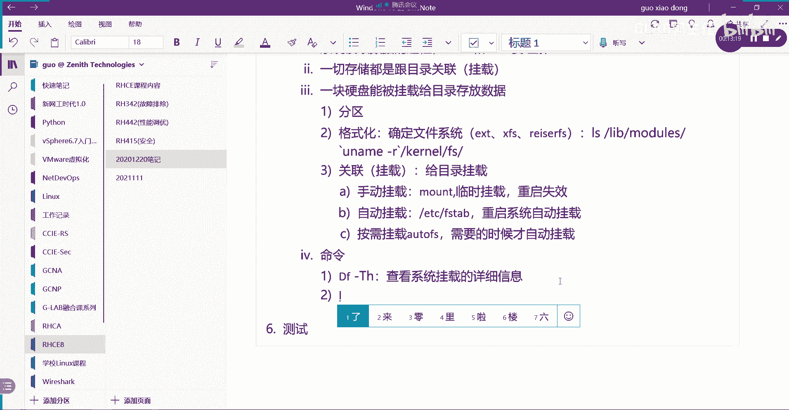

这个命令也很常见啊，我来给大家看一眼ASBLK看到了吧，好请告诉我LSBOK看到了什么呀，是不是这个电脑上这个服务器上其实有四块盘，ABCD吧，真正用到的只有一块盘，后边有三块盘，都没有用理解吗。

并且都是五个G，这个没有用，代表说的意思，就是他没有分区，也没有格式化，更没有挂载，只是插上来了，被系统识别到了而已，没有用，听懂了吗，没有用啊，它没有用，所以通过LSBOK。

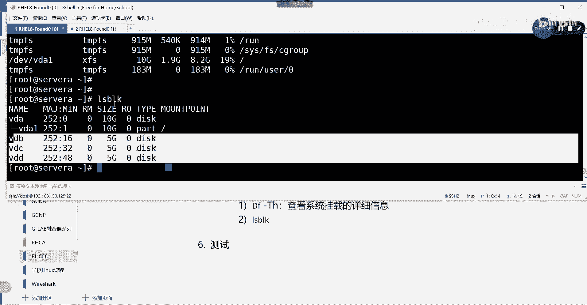

能够看到系统上所有的磁盘对吧，好查看包括用到的和没有用的啊，查看系统上所有的存储空间吧，明白了吗，各位所以你要买回一块盘出来，买了一块新盘回来之后，你要插到服务器上，你想看它有没有被识别。

你应该用这个命令啊，好，那么这个这个这个就是我们前面介绍这些介绍，然后挂载是mt卸载，叫什么EMT是吧，叫u mu m o u n t手动卸载啊，我们来看一下FETABLE吧。

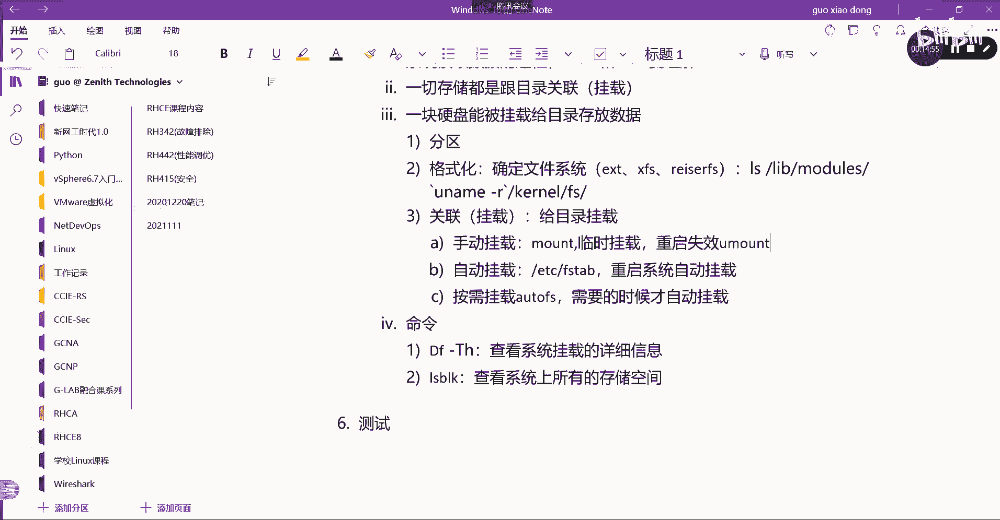

好这个是看目前当前的状态，我们看fetable etc下载FETABLE这个文件很重要，好系统启机之后，首先要加载这个FTP文件，然后把一些硬盘挂上来，挂上来了以后才能去去去去加载里面的东西。

加载操作系统这一条里边有这一条啊，这就是我们当前的那一块盘，怎么看出来他就是我这里的那一第一块板，就这一块板VDA1，怎么看出来就是这个VDIE，有人说他这个前面的盘符不是VDIE啊。

这个是什么UUIDUUID，就跟我们的机器的Mac地址一样，是硬件的唯一标识，硬盘也有一个自己的唯一标识，它用UUID来标识，听懂我意思吗，好，我们来看当前这个UID，是不是跟我的UID一样的。

我可以在这里给大家简单的看一下，怎么看UUIDLSBOK杠杠FS吧，后边加杠杠FS是可以看到你的所有盘的，同时还要看uu id uid923884F923，刚才是不是这个，884F923对吧。

OK说明这个就是我的主要的VDA的第一块盘，听懂了吗啊，然后这个盘这个是怎么写的，首先指定哪块盘，后边这个斜杠代表的是挂载点吗，后边这个是文件格式吧，好这边其实应该要写option选项。

默认没有什么特殊的选项，这边就写default，理解吗啊后边一个是要不要做校验，一个要不要做备份，不要零，就是都不要理解吗，后边两个零代表的都是NO，所以真正关键的还是前面三个吧，听懂了吗。

OK所以FETABLE它跟我们能否成功被挂上。

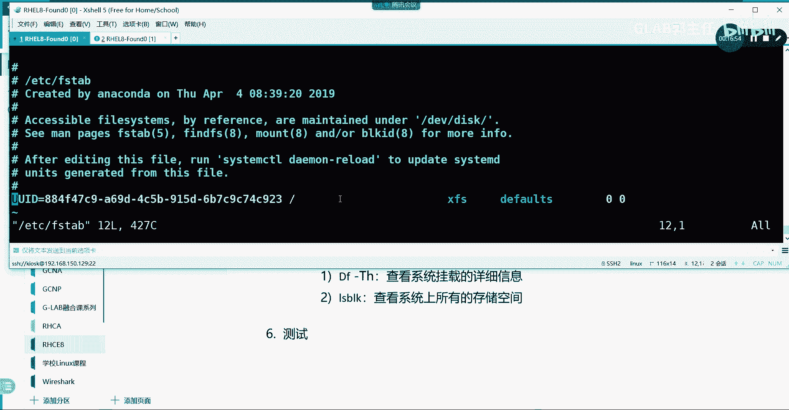

DF看到能否成功被挂上，它是一个核心的文件。

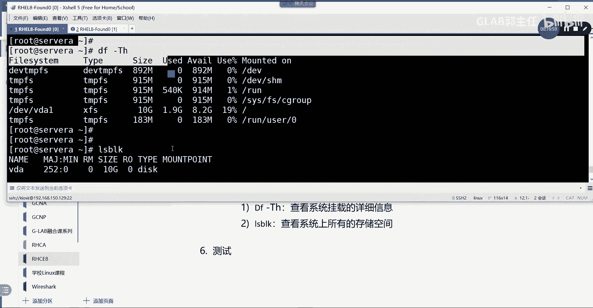

就是etc下的table，看得懂文件系统了吗。

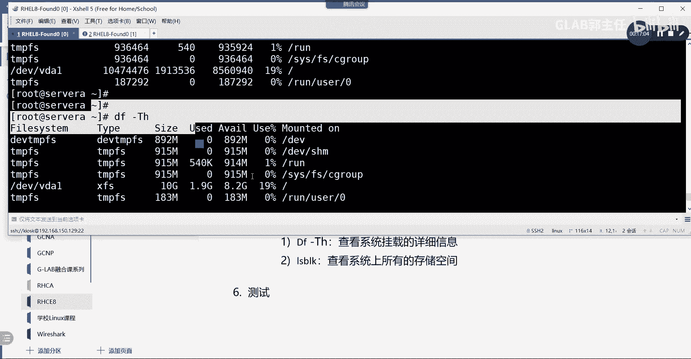

听懂了吗，所以挂载的时候希望大家都用UUID，这个地方可以写UUID也可以写，我的也可以写，这个也可以写，这个也可以写盘符啊，也可以写file system的盘符，OK好，关于更多的存储。

我们到后面再讲，今天我们就给大家简单介绍一下。

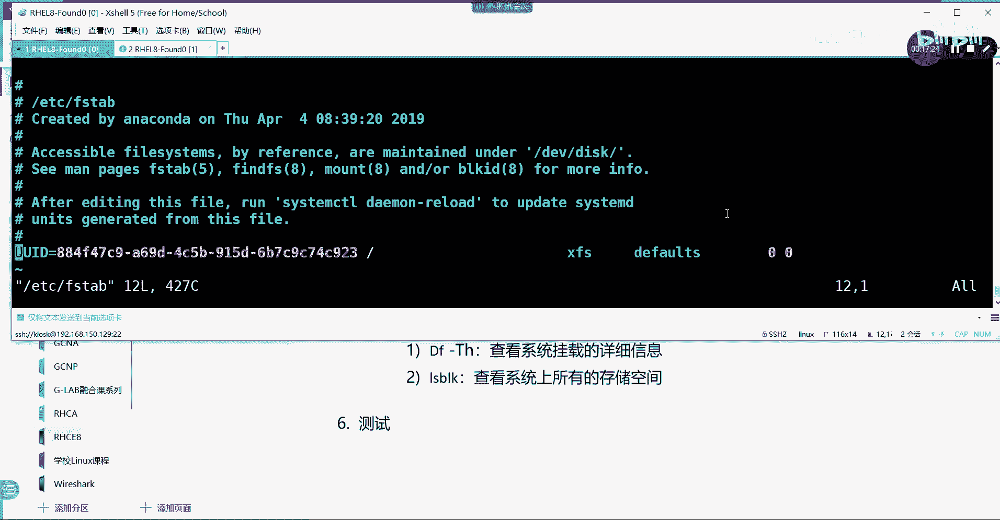

存储相关的一些几个重要的命令啊，还有检查就这么多。

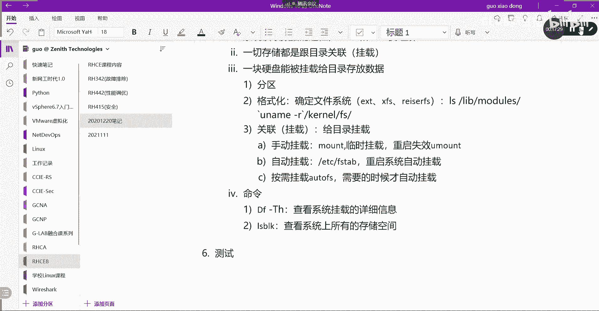