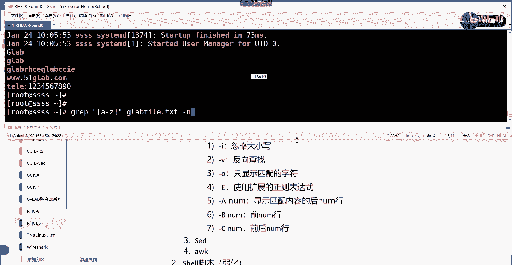

# 【Linux／RHCE／RHCSA】零基础入门Linux／红帽认证！Linux运维工程师的升职加薪宝典！RHCSA+RHCE／22-三剑客 - P1 - GLAB郭主任 - BV1AC4y1E7CF

嗯好，那我们今天的第一个内容啊，三剑客给大家补充一下，那后边有有一些练习，希望大家跟着这个节奏啊，自己去练一下，然后后边的一些练习当中，会涉及到三剑客当中的grab这个，所以可能会大家可能不太了解。

所以拿出来给大家讲一下，这是今天第一个内容，今天第二个内容，到了真正的第二本书了，我们总共三本书嘛对吧，124134，294，124是最初级的内容啊，我们讲了四天左右。

然后134其实是对124的一个补充啊，中间这本书其实不是没有第一本厚，大家可以看到啊，要薄一点，那么中间的内容有一部分还是被被缩减了，就今天我们要讲的第二个东西叫这个呃，拜师的脚本或者叫希尔脚本。

第二点，谢谢脚本，那这一块的话，在以前的红包C当中是一个重头戏，就可能要讲讲很长时间，这是一个开发类的自动化的一个，算是一个比较简单的脚本语言，那么以前在系统里面做运维都会用C脚本，现在它弱化了。

弱化了啊，以前要讲两天，现在只需要讲两个小时都不到啊，为啥呢，因为现在主要是用USP，就是我们的第三本书，第三本书是红帽八，新新加的东西，就294294，我们会有四天的内容都在讲这个自动化运维。

用SB来部署，所以呢现在很少的情况下，去用shell脚本去做自动化仪的部署，但是有一些脚本呢简单的语法要给大家说一下，这也就是说这一块讲的会非常的简单，我们把所有的运维的工作都交给了第三本书。

交给了294sport去做好，这是今天第二个内容会说的会比较简单一点啊，然后第三个我们讲系统优化，系统优化，这个系统优化我们其实在整个的LINUX的学习的，全整个知识体系架构当中，系统优化分两部分。

一部分是基于图形化界面，或者叫基于定制的优化，叫定制的优化，这个定制的优化指的是红帽的话，不光是红帽，像很多LINUX的发行版，它都会自带，就是集成好的优化策略，大家直接去调用它，集成好的优化策略。

就是类似于一个模板，直接调用它就可以了，这是最简单的一种优化方式，这也是我们第一阶段要学的优化方式，然后呢，第二种优化方式是基于，是是基于叫什么customer的，就是自己的你自己想要去做。

根据你的实际情况对内核进行实际优化的，这个是我们专门有一门CA，有一门课叫优化的课，ca有一门专门有一个优化的课程，这个内容就相对比较难了，对内核来进行实际的优化，要讲很多定义和优化的东西。

所以大概分两个优化系统优化的优化，这是第三个内容，今天要说的第四个内容是叫FC2，叫文件访问控制，文件访问控制FSR好了，那么其实在对文件访问控制上面，我们在第一门课里头，也就在前几天有讲过权限。

对吧对吧，权限权限是对文件访问控制的第一第一道坎，我们可以通过权限来实现谁能访问，谁不能访问，明白吗，OK好，那么为什么还要再讲，这是我们文件访问的第二个控制方法，叫第二级别的。

嗯第二级别的文件访问控制，嗯为什么要讲这个呢，大家会发现讲到这儿的时候，大家会发现前面讲的那些文件控制，仅仅只能控制说哪哪些用户，对不对，比如说组用户能访问这个文件，明白我意思吗，然后组能访问这个文件。

它能控制用户当中的单个的某一个人，能访问这个资源的什么东西，还是它能区分单个用户吗，比如说我们说的是叫这个文件的数组，就是这个文件的所有者，他能访问这个文件，是不是通过这个RWX这三个位来来来控制它。

对吧，然后这个文件的这个所有者所在的组，整个组对文件的控制，也是由那三个字符来控制的，明白吗，然后其他用户也是用那三个字母来控制的，但是他能精确控制到其他用户当中的，A能访问什么，B能访问什么。

C能访问什么，能有能有区分吗，区分不了，所以才会有第二级别的文件访问控制，叫FAC2，它能够能够控制都是other用户，那么在other用户里面还要去区分不同的用户，个体对文件的访问权。

这就是我们的第四个，对文件访问控制的一个补充，这个是必须要考的，然后第五个叫S1，LINUX的安全性其实就是SLINUX，S linux，这就是我们今天的安全性，那么SLINUX的话。

它是他也是做文件访问的，他也是做文件访问的，也是可以理解为是第三个级别的访问控制，第三级别的访问控制，那么他在做什么呢，嗯我们其实到了讲这块的时候会给大家去讲，SLINUX它是做更高级的防空控制。

那么我们不但能控制谁能访问这个文件，我们还能控制这个人，能访问这个什么类型的文件，我们刚刚只是说了文件对吧，只是说了文件，但是没有说是什么文件，应用文件对吧，还是这个其他的普通文件，对不对啊。

还是比较核心的内核文件，这些所有的东西都可以通过SLINUX，第三级别的访问控制来进行更严格的控制对吧，好了别着急，到后面会一个给大家讲，我们先看今天第一个内容，就是我们今天五个内容啊，五个内容好吧好。

先看第一个，三剑客，先看第一个啊，三剑客我刚刚已经写了，主要是哪三剑客，第一个就是GRP对吧，第二个是seed，第三个是AWK好，首先要说首先要说的是，不管用哪三个命令，他这个三剑客都是在处理什么。

他都是在处理三剑客啊，他主要都是在处理什么，我们文本文件里面的内容，三剑客主要在做什么东西啊，大家一定要搞清楚啊，这边给大家写一下啊，嗯主要的是在处理我们系统当中，文本当中的一些一些内容。

处理文件处理LINUX系统中，文本内容啊主要是处理系统当中的文本内容啊，他处理文本内容的所有的这个方式，它是通过这三个命令来进行处理，而且还要加什么，加上正则表达式，正则表达式前面有讲过，有提到过。

是不是对吧，那么在整个的系统当中就分两种特殊符号，一种叫通配符，一种叫正则表达式，通配符主要是在我们处理系统的时候啊，什么IOS后面加的那些一系列东西，前面讲的那些东西都叫通配符。

现在我们讲的智能表达式，主要就是为三剑客服务的。

把系统打开。

听懂了吗，加上正则表达式啊，在我们的每天做LINUX运维过程当中，时刻都会面临大量的带有字符串的文本文件，那么我们需要包括这个文本文件，包括配置文件，程序文件，命令及输出，还有日志文件。

那么经常会迫切的需要，从这些大量的字符串当中，查找到跟工作相关的内容，所以就要靠正则表达式，加上这里的三剑客，来对系统当中的这些文本文件，这些信息来进行处理，理解，我意思吗，OK所以这个是我们学三节课。

比较重要的一个原因，好吧好，这个要说明一下啊，这个要说明一下，然后这是第一点吧，算特点吧，对吧，第二个特点，这三剑客当中的话其实不光光是这几个嗯，这三剑客三剑客主要是加正则表达式。

来对系统文件来进行处理是吧，这个没什么问题，然后呢嗯记清楚啊，三剑客主要跟正则表达式，它跟的是正则表达式啊，不是通配符，很多人搞不清楚，他把后面所跟的这些内容都是他认为是通配符，不是啊。

这一定是正则表达式，不是通配符啊，然后呢嗯我们来看啊，如果后面遇到一些特点，我们再往上再往上，那我们来看看这个grab，先看这个grab，把正则表达式来给大家列一下吧，正则表达式三个都会用到。

所以我们还是先说一下正则表达式好不好，那么正则表达式的话，我们有别于之前讲的通配符，我们说几个常见的第一个尖括号，这个代表的是以什么开头的，这第一个第二个dollar，dollar是以什么结尾的。

OK好，那么我们来简单的给大家举个例子，比如说我这样写这个尖括号，尖括号GLAB，说明这个时候我是要去查找我的文本当中，是以这个GRABGLAB打头的，第一个字符就是G明白意思吗，同样的道理。

如果我写的是g r a b dollar，这说明我前面不管你是什么，一定是以GLAB结尾的，所有的内容显示出来对吧，所以这两个比较简单，也比较常用好，那么如果如果我是这样子的，是尖括号多了，监控号多了。

请问这是什么意思啊，以什么开头，以什么结尾，中间有东西吗，没有东西，所以这个是匹配的，应该是什么嗯，匹配是什么，空格键里边是空格吗，过滤除了空行以外的，其他的输入，除了空行以外的其他输入。

除了空行以外的其他，所以他匹配的应该是不是空行啊，因为中间没东西，明白吗，没有东西，所以它匹配是除了空行以外的其他数，大家先记一下，一会我给大家演示啊，然后呢点这个是什么意思啊，这个应该比较简单。

代表的是任意的单个字符，包含空格，空格也算一个单个字符，一个空格算一个单个字符，明白好，还有呢这个呢这个叫转义符，转义符，知道吧，知道吧，比如说斜杠N那么如果没有这个转义符呃。

斜杠点你们假设是一个斜杠点，如果没有这个斜杠的话，这个点代表的是任意单个字符吧，但在点前面加一个斜杠代表，这就是表示点明白吧，他会把我们特殊的智能表达式的字符，恢复成它原来的意思，这个叫转移，好吧好。

第六个新号，信号就代表的是重复，它代表的是重复零次或者，或者多次重复零次或者多次好，所以如果你看到点信号代表的什么，点信号点代表什么，任意的单个字符，星号代表的是重复，那点星号代表什么啊，这么简单。

它代表any any什么意思，任意对不对，任意的话，那就是匹配所有字符，匹配所有字符，这个能看懂吗，OK好，那么几个，其他的我们之前有讲过，跟前面有别一下啊，中国号，比如说ABC是什么意思。

中括号里边ABC这应该是一个选择，在这个范围内选择一个字符啊，明白我意思吗，是ABC当中，就在用那个用那个用那个选择的话，就是ABC当中三选一选一个字符没问题吧，好前面有提到过这个尖括号。

ABC是什么意思啊，这个是非明白吗，前面有提到过，就是除了ABC这三个字符以外，其他的任意一个字符，你这也是任意一个啊，也是这种写法，是写一个字符，其实就是飞嘛对吧，这就是非OK那继续后边几个不常见的。

但是后边也也会用到的，第八个叫A斜杠，花括号，然后呢N逗号M斜杠，这啥意思啊，这是把某一个字符重复N到M4，把什么字符，把这个A字符重复N到啊，到M4，清楚吧，所以这八个最后一个其实不怎么常用。

但大家也要知道啊，大家也要知道啊，然后呢还有最后一个，还有最后一个，最后一个是再看一下，大家看猜什么意思啊，斜杠，小括号AB斜杠，OK然后呢点星号对吧，结束了，然后反斜杠一，这什么意思。

这里我们一个来看，首先点信号，大家知道是什么意思，任意对吗，没错吧，好最后一个这个反斜杠一，这个应该要要连起来，看这个反斜杠不是对一做转移啊，不是不是转移，然后我们来看前面前面的话小括号啊。

到这小括号ABAB很明显，小括号里面感觉像是一个分组吧，明白意思吗，像是一个分组，所以这个时候嗯，他会把整个一行当中AB的当成一个第一个组，当成一个组，AB当成一个字符，而不是两个字符，明白吗。

AB会当成一个组的字符，然后用反斜杠一去调用第一组，明白意思吧，如果我这里写反斜杠二代表的就是调用第二组，所以后边是调用前面以AB为主的，这个第几个星号，星号星号点星号代表任意嘛对吧，其他号我都不管。

我只关心以AP为主的，如果你这一行当中有五个AB组的话，那么我就调用第一个ab组，第一个听得懂吗，所以这个是怎么去写这个啊，这是分组的意思，这是分组好，他是这样写的，是以ab为一个组。

OK然后他这边有一个专业的名词，叫后向后向引用对吧，后项引用重复一次的，重复一次的行后项引用，重复一次的行，更新一下啊，就是这个是重复后向引用啊，就是调用重复一次的行。

一会我们通过简单的来给大家演示一下，好不好，开完了啊，系统应该开好了。

等一下啊，看一下课程啊，pet以及CH，124没问题啊，那么RHT杠VMCT2star classroom，然后把所有都打开，好在它开机的时候。

一会儿我们正则表达式先写在这，我们先来学第一个，然后通过例子来简单的理解一下正则表达式，然后也来理解一下这个grab，OK好，先来看grub，GRP它的语法我们先从它的语法开始。

GRP加它的option选项，option选项啊，那么它的option选项有哪些呢，我们来看一眼啊，OP选项第一个杠I代表的是忽略大小写，这种很多选项大家没有别的选择记在笔记上，然后把它记住。

通过例子记住它，第一个杠杆啊，忽略大小写，第二个杠V我写的都是常用的反向查找，OK然后呢杠O，代表的是只显示匹配的字符，然后杠E叫代表的是啊使用扩展的正则表达式，使用扩展的正则表达式。

OK那么这里要提到的是，我们刚才给大家写的这一堆东西，这种都属于标准的正常表达式，这属于标准的正则表达式，我们还有扩展的扩展的话，其实嗯一会会给大家讲很少的，扩展的正则表达式。

就后边几个从第十个开始给大家写扩展的好吧，如果要使用扩展的正则表达式，你需要在后面加一个杠大E大EOK，杠大A代表的是后面要加一个number啊，大A后面加一个空格number。

这个代表的意思是显示匹配的显示啊，匹配内容的后number行好，根据这个套路跟大B呢，什么前，行吧，这个套路刚大C呢显显示的是，到C推的出来吧，前后，OK好，差不多grab，大家记住这几个就可以了。

我来简单的给大家看一下，来给大家操作一下啊，给他操作一下s h root server a到A里面去，还没起好，等一下啊，稍等一下，那么在他起的过程中。

我们把那个扩展的正则表达式，也给大家整理出来，从第十个开始啊，这是一个扩展的智能表达式，我前面就写扩展了，OK扩展正则表达式有一些不一样的，就是跟前面的正则表达式不一样，第一个加号了。

加号代表的是重复一个或者一个以上的字符，重复一个或者一个以上，刚才讲的星号是重复什么零次或者多次吧，然后加号代表重复一次或者多次，有区别的啊，这是有区别的，所以如果想重复一次或者多次，你得用加号。

OK然后呢第11个问号，问号是重复零个或者一个前面的字符，这是问号，然后斜线slate就是这个中竖杠，我们把它叫管道符，这个我们把它叫做货，如果你写A对吧，斜线B这代表的是在A和B之间选这个叫。

或者明白吗，卡住了，看到了吗，卡住了，哦好了好了好了吧好第12个啊，就是我们之前学的管道服，这个叫做或者可以去选择，或者然后呢嗯这两个前面有讲ab，这是什么意思啊，分组是不是啊，分组啊。

这个分组和前面讲的这个分组不太一样啊，你看这个分组是用的两个斜线，他为了简化分组，他会把这个内容缩短成这个，如果用这个，你就得用扩展的正则表达式理解我意思吗，所以这个叫扩展的正则表达式的方法。

这个叫标准的正则表达式，写的会繁琐一点，为什么要讲或者才能表达式，就是有些会简化，有些东西会比较简化，比如说前面上面讲的要重复N次到M4，如果用扩展的字能表达式，那就是NM就这样就可以了。

是不是比上面要简单一些，直接在你的字符后边这样写，他写省掉了这个号括号里边的斜杠，然后也省掉了前面的东西，直接写前面的东西，重复N到M4，这个就代表的是用来扩展，而不是标准的，明白，我跟你说好。

来我们来简单的演示一下啊，别急，我们一个来。

好来看啊，哎这个名字被我改了是吧，不重要，没关系，来我们把它开启，我们现在里边有东西吗，Test user，没关系，我创建一个叫julia fire，我创建一个文件，然后我把我的一些信息啊放点东西进去。

放点什么东西呢，嗯我们来看一下啊，这个我们之前的，大家还记得我们的log文件放在哪吗，VLOG下面是不是有那个message是吧，我们来看看有没有message，有system有吗，bot也有。

来我们cut一下message，好，这里面有应该有的对吧好，我们把这个cat的内容送到哪里去呢，送到这个家目录啊，家目录下面建一个名字叫glab fire点TXT，我建了一个文件，然后把他送进去。

CD到家目录里面去，看到有一个GB file test，对不对，然后我们cat一下GB file test，就是我们system那个文件里面的内容吗，没意思好，然后呢我们在这个里头我们来简单的看一下啊。

呃我们简单的大概的浏览一下，大概浏览一下我们怎么去找好，首先如果我想让大家找到以你这个哪个打头的，看看，写点东西进去吧，里边的东西可能都是好，我们放进去加一个GOAB对吧，小GLAB好。

然后呢再写点东西，Glb r h c e，进来吧，OKCCIE好，然后再写点儿说，我看看还有什么叫是我们的官网，3W点51GRAB点com啊，再来一个TELE对吧，然后冒号写一些数字。

1234567890，OK然后呢这个嗯先写这么多数字，888121212K就写这么多吧，我看看能不能匹配到我们想要的东西，先来看第一个，如果我现在这样写叫grab，它在过滤的时候最好用引号引起来啊。

尖括号G大GOK那么挂上这个文件，请问这个时候会不会匹配的，应该是以G开头的吧，K是不是以G开头的，记清楚它匹配的是以G开头的，仅仅只显示这个G吗，还是显示这个G匹配的一整行一整行，明白吗。

所以记清楚啊，我们不做任何修改的时候，我们匹配的应该是这个匹配的这个字符，匹配正则表达式匹配的这个字符的一整行。

它是以行为单位显示的，听懂了吗，我们总结一下啊，其实都是以行为单位显示的，我们写在这里，三剑客的特点不加对吧，默认默认默认都是以行为单位显示，默认默认的意思就是不加任何其他选项，不做任何修改。

它都是以行为单位显示的，听懂了吗，OK好，那继续再往下看啊。

这个这个这个太简单了，我们再来点复杂的，那么如果是这样写的，这个点com dollar是不是以点com结尾的，看到没，也是以行为单位形式的，这些都比较简单啊，这些都比较简单好，再来最重要的一个。

我把点com换掉，改成尖括号，然后呢杠V请告诉我这是什么意思，查不逊选项除了什么，首先经过号多了，匹配的应该是什么呀，除了空行以外的东西，然后杠V呢，杠V是反向查找，对不对，所以这个输出的结果是啊。

输出的结果是，再看一遍，这个匹配的是什么，没有任何东西，这个应该是空行吗，然后杠V匹配的就是除了空行以外的东西，那不就是去掉了这个文本当中的空行吗，明白意思吗，来我们再创造一些空行，我记得有空行。

最后一个不就是空行吗，这最后一行就是空行，我就给大家写的，再再再来一点啊，两个空格空格，然后直接空行一个空格回车，123回车回车，1234，我这边做了很多不一样的操作，明白我意思吗。

空行字符在里面算空行吗，空就是我这个一个空格，空格字符不算对吧，来我们看，是不是啊，下面是不是多了一堆东西啊，这一堆东西没有没有东西，但是不代表它是空行，所以我们尖括号多了。

匹配的是严格匹配的是非非非这个字符的空行，非空格字符的所有空行，明白吗，OK其实就是空行，这就是严格意义上的空行，里面啥东西啥东西都没有，空格不算啊，你的空格不算啊，OK啊就是相当于什么都没有对。

什么都没有，没有任何字符，因为我们说空格也算一个字符嘛，都能理解吧，好那我们再来一个，一个点是什么意思啊，请问这个时候输出是什么东西，点代表是什么，咳咳点列表示任意单个字符，包括空格，对不对。

你能告诉我这个显示的东西是什么吗，啊一个空不对，你又忘记我刚刚写的了，你中间匹配的虽然是一个字符，但是会以行为单位显示吧，明白不是所有，所以请告诉我这个结果是什么，什么空调除了空行以外的所有明白吗。

除了空行以外的所有，这个输出和这个输出是一致的，明白吗，各位不一样的方式，他的输出内容是一样的，听得懂吗，OK好继续啊，大家一个来看啊，如果这样呢，反斜杠，这个是什么意思啊，我加一个反斜杠啊。

只会显示有点的行，这个时候的点就不是任意了，它就是一个严格意义上的点，能听明白没问题啊，这个就是严格意义上的点点星号呢，请问他的输出是什么啊，所有是吧，好这个所有包含空行，包含那个空行吗。

有没有包含空行，包含了明显包含了为什么，因为新号它是重复多少次和多少次啊，有重复零次的吧，重复零次不就是空行吗，各位听懂这意思吗，所以这个就代表任意，明白吗，这个代表任意你整个文档里头所有的都出来。

包括你的空行，包括你的严格意义上的空行，听懂了吗，OK所以点代表的是任意，然后信号代表重复零次或者多次好，再来一个A到Z好，这个匹配什么小写A到Z的，对不对，来看小写A到Z的没有，这时候就没有任何空行。

因为它没有匹配空格字符的空行，对不对，没有空，没有匹配空格字符，所以他一定会从每一行当中去检索A到Z当中，小写只要被匹配到的，他就会把这一行都显示出来，所以你就会看到每一行这些标红。

那就是说明被GRP匹配到的，明白吗啊那他会被匹配到，他会被匹配到，他会被匹配到，对不对，其实不管哪一个被匹配到，他都应该会显示这一行，所有的内容能听懂我意思吗，好各位好，那么这个是A到Z啊。

这个是A到Z，那如果我后面加一个杠N什么意思啊，刚刚这个有没有讲啊。

没有是吧，那补一个。

刚刚大家猜一下什么意思啊，有不一样吗。

看到没显示行号。

显示你匹配的所有的行号，明白吗啊，OK它显示了这个所有的行号了啊，好那么有了这样一个显示行号的输出之后，我来问大家一个问题，我加盖恩以后，这个文件被处理显示了行号，请问这个文件的原始内容有没有被修改。

也就它原始内容里面有没有呃，都加上行号，原始内容有没有被修改，我去看一下是不是没有啊，到后面我们会还会用seed，我们会对文件里面所有内容来进行切割，来你对你的所有东西来进行修改，然后显示在你的屏幕上。

那个会更加直观，体现到很多人会觉得这个被处理过的文本，是不是被你的seed修改过了，包括我这里用的是加杠N，它的所有的前面加了这个number号，是不是原始文件也都加了，那么号被修改了。

我才在屏幕上看到这所有的东西，告诉你没有说明这是什么原因啊。

我们的三剑客最终在处理的时候啊，我们的三剑客在处理文本内容的时候，是没有对原始文件进行修改的，三剑客处理文本的时候对吧，没有对文件内容进行修改，那它它它是怎么实现的呢，他的所有的实现方式是统一的。

是先把文件读取到内存中，然后所有的加选项的操作，所有的操作对吧，仅仅修改了内存，内存中的数据吧，这个能理解吧，他把所有的文本都读到内存里面，然后我们通过grep3剑客，包括C的AWK，在处理文本的时候。

仅仅只是修改了内存里面这些东西，然后显示在屏幕上，他并没有对原始文件进行修改，听懂了吗，所以到后面大家会发现，如果你处理的文本信息要回写到，要回到原始文件里面去，修改原来的内容的时候，要加选项的。

不加选项它是没办法回血回去的，理解我意思吗，OK所以这一点一定要注意啊，三剑客所有的内容并没有默认啊，并没有修改原始文件。

听明白了好继续，继续啊啊再来一个加个尖括号，什么意思啊，除了A到Z的就会匹配数字对吗，所以你会发现除了A到Z的，其实也包含空格吧，是不是啊，所以最后空格也给你显示出来，听得懂吗，OK这个没什么问题啊。

好那么再来一个，刚才我不是写了很多八吗，对不对，然后八星号啥意思啊，我这边写了很多吧，这边有八，这边也有吧，请问这个时候它会显示嗯，嗯有八的还是哎有人说没有八的也显示了，其实所有的都显示了，能理解吧。

嗯大家会发现写一个八，加星号和写一个点加星号，一样吗啊那能理解吗，它会匹配每一行有八的，你看其实有区别是有区别的，各位肯定是有区别的，明白但是，输出的内容区别不大，那是因为你写八的话。

他肯定严格意义上去找每一行有没有八重复，对不对，他重复零次，那就是没有八，重复零次，没有八，没有八的话，重复了零次，那它匹配的是这一行的，什么匹配的是不是这一行的，你看上面这一行没有八呀，这行没有八。

没有吧，没有吧，匹配的应该是这一行的，其他的重复零次就不是不是空的吗，对不对，匹配的是空啊，所以你会发现我们刚才创建了很多空的，也都被匹配到了理解吗，所以匹配没有八，匹配的是空，那有八就匹配八，明白不。

所以大家知道星号是重复零次也是有可能的啊，所以这个是要注意一下，那么再来，如果这样写的话，我们是不是后边一定要加一个大E，因为我刚刚讲过了，直接用花括号这种写法的话，代表的是重复，明白吗。

那么这种重复的话，要直接调用我们的扩展正则表达式，那么这叫扩展只能表达式，所以后面要加个大E好，请问这个输出是什么，这一行吗，还是这一行重复几次啊，有输出吗，有没有输出告诉我，首先告诉我有没有输出。

有没有有对哪一行就八这个行对吧，是不是啊，肯定有输出啊，他重复三次，不是说一定要给你输出了，是三个八，他会去找这一行当中，只要满足有三个八的，他就把这一整行输出啊，明白不，所以肯定有输出。

它是以行为单位的，听得懂吗，各位OK啊明白，但是如果你把这边写成杠O有输有输出吗，首先告诉我有没有输出NEO吧，有没有输出，有输出的是什么，三个吧，哎三个吧，他说诶奇怪，怎么输出了两行啊。

怎么输出了两行，请告诉我怎么输出了两行，告诉我，啊尴尬了，我有两行都是三个八吗，你看他行号是不是同一行啊，你看同一行先去匹配三个八，哎有了输出对吧，又匹配了三个八，哎又输出。

所以这三个八输出的虽然是同一行，但是不是同一个八，明白吗，一个是前面三个吧，一个是后边三个吧，听懂了吗，各位所以加杠O它只会匹配到，它只会显示你匹配到的内容，你匹配到的内容只会显示不是以行为单位了啊。

明白，所以前面三个八匹配到了显示出来，后面三个八匹配到了也显示出来，所以你看到的是同一行，听明白吗，各位好好继续啊，那如果我这样写呢，我把O去掉了，我就不O大家知道的，就是只匹配显示的东西嘛。

我把这边改成四逗号五，告诉我有没有输出，有没有输出，没有有没有输出啊，有是不是有输出吧，嗯有没有输出，没有肯定有啊，怎么没有输出啊，下边四和五跟上面三都会有输出，我把O去掉了，把O去掉了。

还是以行为单位显示的，看到了吗啊，那么它是匹配的是八重复重复几次，四次到五次，重复4~5次，所以最多是五只嘛，所以五个五个八字有这种橙色颜色的显示，说明他是被匹配到的，明白我意思吧，匹配到。

然后显示他匹配到的字符的一整行，能听懂我意思吗，有输出啊，OK那再来如果加O呢，有没有输出，有没有说出几行，一行没问题吧，他匹配完了以后，后边是不够啊，不够啊，他匹配了五个八，听懂我意思吗。

OK匹配了五个八好，那这个这几个啊，把我们刚才讲的扩展的这个，还有这个标准的正则表达式，都给大家梳理了一遍，OK好嗯，那么我们再接着往下看，好我们来来，还有扩展的正则表达式没给大家梳理一下，来。

我们看啊，继续，grab我这样写啊，杠O知道什么意思啊，然后呢G加D，这个会输出什么，加号是不是有提到过，根号是什么意思啊，加号什么意思啊，在哪来着，还在这重复一个或者一个以上对吧，尴尬了。

这个有输出吗，没有对不对，那如果我想让他有输出，我得改一下这个文件对吧，我写什么呢，G g g l a b，呃不对，GGB是吧，那是GB是吧，D这个GGGD对吧，然后GJGD对吧，然后呢我在想啊。

嗯记空格GD，OK我试一下再来一遍，这个应该会匹配什么呢，这个也没有匹配，为什么，请告诉我刚才我写的这些东西，写了这些东西重复一次或者，重复一个或者重复一个或者一个以上，他不重复了一个，为什么没有匹配。

告诉我，有没有匹配匹配了，知道为什么了吗，再次验证了，加号代表的是扩展的正则表达式，你想用它要匹配的东西，你必须后边加大E明白吗，或者你用另外一种方式，它叫e grab。

这个代表的是就是用扩展的智能表达式，来匹配内容，你把溢价前面或加后边都行，明白吗，OK好我们就用e grab啊，杠O代表的是只匹配你显示的内容对吧，好G加号D你再来演示一遍啊，好这个时候看到了。

它会重复一次或者多次都会显示啊，看到了吗，应该有的应该有的，OK那如果是把O去掉它，它会显示这个匹配的一整行吧，明白明白我的意思不，好就用这个啊，好再来再来再来再来，杠O啊，还用杠O吧。

然后G把家改成问号，这个时候会匹配什么东西，问号是啥意思啊，重复零个或者一个重复零个或者一个看结果，重复零个或者一个这么多D好多啊，嗯重复零氪不就没有G吗，没有G，那只要匹配D不就完了吗，听懂吗。

各位OK，所以他这个只要匹配这一行有D的，这个应该会被匹配到吧，然后呢如果不重复一个重复一个，重复零个或者一个啊，它可以重复前面一个重复一个嘛，就一个G嘛，所以你看到的只有匹配的是一个G的好吗。

没有两个G的，好像匹匹配到吧，对这个没有任何问题好不好，然后呢把问号改成这个呢，要么是G，要么是D啊，很明显，要么是G，要么是D2的选择，再来一个小括号基地，这是匹配的，匹配的是GD，明白吗。

你看到的都是以GD为单位的组，听得懂吗，GD这个是GD哦，这是基地，OK好，再来一个哪一个这个吗，这个吗，这个问号括号是这个e grab杠O基地对吧，这是一个组嘛，听懂我意思吧，OK然后呢再来一个。

看看有没有啊，请问这个是什么意思啊，这啥意思啊，首先小括号就代表是一个组，对不对，然后括号里的是一个管道符一样的，这个叫或者对不对，所以他应该会选择la的这个组，或者OO的这个组，这是或者啊他是主的。

或者你发现要么是LA要么是O明白吗啊，二二选一嘛，能听懂意思，不是这个是这个OK好了，那么这个叫e group也给大家说完了好吧，e group也给他说完了，那么group其实我们用的比较多的呃。

其实就是让他来处理文件啊，让他来处理文件，来处理我们的这个文件，OK好，那么接下来我们来简单的告诉大家，我们用用，用这个来练习一下好不好，我们来练习一下，我们经常看我们的系统的IP地址。

我们是用的是if config对吗，If configure，你看我的IP地址，if configure e n s这个吧，我复制一下，好先看我第一个要求，我要求各位通过刚才讲的这三剑客的group。

帮我把if config里面的IP地址给他抓出来，这很简单啊，我们的自动化运维，是不是要先从网卡里面把IP搞出来，搞出来之后，然后送到Python脚本里面去，让Python去读到这个IP地址。

然后才能够远程把脚本刷上去吧，嗯是不是这样的，所以现在很简单，各位请帮我。

把这个操作系统的这块网卡的IP地址，给我匹配出来。

把IP地址给我取出来，我要你帮我取出来，用grab或者用e group怎么想，快给大家一分钟思考一下，实现这种需求的方法有很多，但我们现在要求用graph来做或者e graph来做，怎么做。

是不是要对内容进行处理，是不是要对你一定要有东西输出，输出了之后产生的文本，产生的这些信息，然后再送到给group去处理吧，OK所以一定是在这个后边加东西嘛，是不是加管道符啊，这个管道符不是。

或者了是把前面的输入当成后边的输出，继续处理吧，OK好那丢给谁呀，我们一起来思考，肯定是丢给GRP嘛，对不对，这个grab ok然后让他怎么去匹配，现在就要考虑GRP如何匹配中间的IP地址。

是不是这个意思，怎么匹配啊，仅仅只是匹配IP，所以一定要加一个杠O，只显示我匹配的这些东西，这个理解吧，然后接下来就是匹配IP，匹配IP地址还不简单吗，来，引号先引起来，IP地址是从0~9当中的。

大家想IP地址的特点，它是一个点分十进制啊，每一位每一段都有三位吧，每一段都有三位，每一位的取值范围都是0~9吧，所以我可以这样写，中括号0~9是不是把第一位取出来了，各位能理解我意思吗，中括号0~9。

那么他有可能只有这一位，有可能是三位，所以我要写它重复吧，是不是要用花括号写出来是吧，一逗号三，这代表的是把这一位重复一次或者重复三次，就把第一位取出来了，各位能听懂我意思吗，我们先来试一下嘛，对不对。

好这个时候他会匹配什么诶，发现这个没有输出，原因是什么，用的是扩展的，前面加个E，要么加个大E匹配出来了吗，看到了吗，这个时候匹配他会帮你把你所有的啊，这个这个这个重复一次或者三次。

相对应的都匹配出来了，那这样写肯定是不行的，但是至少看到结果了，然后呢是不是有点啊，你得写点要写第二位了，第二位是不是也这样写啊，中国号0~9，然后也从-1~3次，这样写可以吗，1~3次逗号啊。

逗号三次重复1~3次，有没有问题，当然有问题，这个点代表的是啥，任意我们所以要给他帮把它转移成单个的点，这就是点明白吗，OK所以这个时候我们再匹配一下诶，是不是有点像了，对不对啊。

按照相同的套路继续往后搞，那么斜杠点再写第三位，中括号0~9，对不对，花括号一逗号三就把第三位给写出来了，再来个反斜杠点，中括号0~9，中括号花括号一逗号三，重复1~3次，看得明白吗，是不是抓出来了。

各位明白，很简单，按照我们刚才讲的，再结合你要处理的IP地址的特点，你就能把它抓出来，好理解吧，第一行是IP，第二行是野马，第三行是他的广播地址，没有任何问题了，OK这个是学完大家就能用上的啊。

这个主要是用啊，主要是用，OK主要是用好，那么接下来我们来给大家看一下，我们第二个叫seed老师问问题，问我那个之前都是用双引号，这都一样的，你改成双引号是一样的啊，没区别对，单引号双引号区别在哪里。

前面讲过吧，嗯讲过了吧，你的引号里头有变量的话，它是有区别的，没有任何变量，它没什么区别，好吧好继续啊继续，接下来我们来看这个哎，seed啊，我们来看seed。

seed其实跟seed的功能要比这个GRP要强得多，我们来看一下。

这是GRP，说到这，我们seed seed全称叫流编辑器，我们叫流编辑器，OK那么它是一个纯文本的编辑器，它是一个纯文本的编辑器啊，像这种文本的编辑器，大家一定要有别于我们在windows上的word。

word大家用过吗，大家觉得word是一个纯文本的编辑器吗，当然不是，为什么word除了对文本编辑之外，还能对文字进行渲染进行处理是吧，我可以我可以放大加粗，加颜色加底色，明白吗。

我们所说的纯文本的编辑器，它既简单的就是处理文本，它不能处理文本的特效，明白啊，OK所以流seed他就是处理文本的，不能对文本进行处理特效的一些处理，明白这个是要注意一下，有别于word好。

然后第二个特点它是逐行处理的行编辑器，这一点是不是跟graph也比较像啊，它是逐行处理的一个叫行编辑器，嗯对吧，然后呢嗯这个要区别于我们前面讲的vi或者VM，请告诉我VI和VM是行编辑器吗。

什么叫行编辑器，它是以行为单位来编辑的，这叫行编辑器，就是你在你在处理这个seed，在处理的时候，他也是把内容加到内存里面去，然后在内存里边去处理这个文件，内容明白啊。

就相当于seed在内存里面打开了一个文件，但是它是以行为单位打开的，OK那么vi和vim你觉得它是以行为单位打开的吗，不是对不对，很明显不是啊，vi是全屏编辑器，大家注意，很明显一打开是不是整个屏啊。

一整个屏你在里面写很多东西，写的很多行业都没有任何问题的，所以它是一个全屏编辑器，要有别于vi啊，这第二个特点，第三个特点嗯，它是逐行读取到内存模式下来进行处理，然后输出显示。

然后所以默认C的它是没有改变原原始文件的，仅仅只是对读取到内存当中的文件进行修改，这点内容我刚刚在GRP是不是有讲过啊，讲到过这个是尤其对seed来说，因为他对文件的处理比GRP还会更加的精确。

而且处理起来会更精细，很多人认为他把文件也改了，不是这样的，所以在这里重点要理解，刚才我总结的那个，我给他写一遍吧对吧，它是逐行对吧，读取的，煮好逐行读取到内存模式空间在进行处理啊。

这这这这个都比较重要啊，然后输出显示，然后输出显示，所以对吧，所以，啊所以默认seed不编辑，不编辑源文件，这个要注意啊，不编辑源文件，那么仅仅对读取到内存中的数据进行处理，仅仅对读取到内存。

中的数据进行处理，那么后面再加一句，如果要对原文件进行修改对吧，必须要加选项，这一点说明白了吗，就对C的来讲，这一点尤其明显，所以我把这个很重要的这句话写在C的这里面，其实前面有提到过啊。

好接下来我们来看它的语法，这个语法就稍微稍微的复杂一点啊，seed我先写下来，大家自己看啊，单引号双引号无所谓啊，然后呢还有一个叫address，我写我写大写啊。

address第一个写的是address，第二个写的是command，command好，然后呢再跟我的file后边的可以写很多，可以跟很多发，这就是它的语法，这个语法说完，我们来给大家简单的解释一下啊。

他其实还有option，我给他写的，这边再加一个，刚漏掉了，这边有option选项可以加option，好哦，不你加后面加后面加前面都一样的，所以它的语法是这个样子的，好吧好，那么我们先一个个来解释。

先一个个来解释，第一个先解释option，OK好，option这个包含哪些option选项呢，第一个杠N告诉我是干嘛的，显示对吧，杠我们刚才显示行号在这里，不是就显示符合条件的行，显示符合条件的行。

只显示符合条件的行，前面要加个只only，只显示符合条件的行，没问题吧，OK杠I代表的是修改源文件，对不对，seed就有专门的OP选项让你去修改源文件，grab有没有没有吧，刚才是不是没有啊。

OK杠ILK要修改原文件，要加个杠I啊，好杠一杠E后面要加一个脚本，叫s c r IP t script，然后杠E对吧，先记一下啊，先记一下，代表的是SCRIPT，这个代表的是可以同时执行多个脚本。

就是你可以写一个脚本，这个脚本可以是Python，也可以是这个shell脚本，然后你再用seed处理这个文本的时候，直接调用这个脚本，理解意思吧，你可以把很复杂的处理写在脚本里面。

然后用seed直接调用这个脚本，就要加杠E了，它可以同时调用多个脚本，OK好，然后接下来嗯杠杆干嘛啊，杠R代表的是使用扩展的正能表达式，是不是还不一样啊。

我们在group的时候使用扩展的正常表达式加上杠，大意明白吗，seed用的是扩展的表达式，用的是杠杆，所以大家不要死，记不记得拿出来翻一翻就可以了，好不好，好那么这个选项就说这么多。

接下来我们来说第二个，第二个叫address，这个address不知道是哪些东西呢，第一个叫starline line，star line或者多star line到end line，比如说1~100。

这是在指定什么address，你看这个名字就知道，他其实是在指定seed要处理的位置吧，明白吗，seed要处理什么位置，你可以去指定一一行到100行对吧之间，OK然后呢就可以在这里用用用用这种方式。

一逗号100去指定，一会我给他例子给大家演示啊，别着急好不好，第二个正则表达式，用两个斜杠中间写REG，这就是我们的正则表达式了，中间的就是正常表达式，好比如我在两个斜杠里头写了一个尖括号root。

请问这个时候匹配的是什么东西啊，是不是以root开头的，明白意思吗，各位如果要正常表达式，你必须在这部分写两个斜杠，然后在中间写正式好听，明白了好，第三个第三个啊，嗯叫这个line number。

line number就直接指定行，直接指定行明白，比如这个太简单了，11直接写一个11，就说明他直接指定第11行的处理，听懂了吗，OK好，这第四个第四个s t a RT star line。

逗号加大N这个代表什么意思啊，从，从STARLINE开始向后的根行是不是有加呀，我不指定这个东西前后，我就指定从这一行开始往后加多少行，听听明白吗，好最后一个来个复杂的啊。

斜杠叫p a t t e r n pattern1，逗号再来一个斜杠，P a t t e r n pattern2，这样写什么意思啊，pattern代表的是关键字啊，就是某一个某一个关键字。

你可以把它理解为string，就是字符串对吧，你把它理解为string，Python 1python2，这代表什么意思啊，代表的是从第一次第一次被，pattern1匹配的行开始。

到第一次被pattern2匹配的行结束，听明白了吗，然后这中间的所有行，这个我说清楚了吧，这个稍微复杂一点啊，中间的address，那总的来讲，我们address这一块主要是在指定seed要处理的行。

能听懂我意思吗，各位OK好，第三个部分叫，好command主要包含哪些命令呢，这个要记一下，这个不是杠啊，第一个D啊，不加杠，直接直接加的这个command，加加这个关键的命令D什么意思。

delete嘛，要删除，删除符合条件的行，它是以行为单位的啊，P呢，显示符合条件的行，对不对好，然后呢A呢A空格斜杠string，这个是在指定的行后面追加新行，在指定的行后面追加新的行。

OK这个A不是大写小写，A然后呢这个是空格斜杠啊，A空格斜杠这样写，这个A他变成大写小写好不好好，然后呢在后面在后面追加的话，那就是A了，我这边一起写在这边了啊，ALA在前面，L在后面，明白吗。

OK好最重要的一个来了S小S啊，小S写两个写两三个，写三个斜杠，然后呢，第一个写第一个斜杠和第二个斜杠之间，写一个叫呃叫pattern p a t t e r n。

Pattern 1p a t t e r n python2，这个代表的是什么意思啊，这个代表的是查找并替换，这个用的非常多，查找并替换，就是把前面找到的pattern1替换，查找出来。

替换成后面的python2明白，然后呢默认只替换每行中的第一个，替换每行中的第一个默认值，替换每行中的第一个，如果要想把所有的行的，所有的被匹配的东西都替换掉，要加一个G，G小G啊，怎么写的呢。

就这样写的，在S肯定是一样的啊，S1233个斜杠A把A替换成B，然后后面加个G听懂了吗，在后面要加个G啊，要加个GK叫全局替换，这个叫全局替换好，然后最后一个需要大家理解的，小爱小爱是忽略大小写。

嗯所以seed还是挺麻烦的啊，大家先记住它，总共就分为三个部分，Option address command，接下来之后我们来简单的练习一下好不好，我们用seed来简单的练习一下。

我们直接拿我们的最后的要要大家处理的东西，来练习一下，第一个还是用刚才的方法，比如说我现在需要大家拿出来。

把我们刚才所说的这个IP地址，通过C的方法给他拿出来，还是这个需求，但是要求大家用seed来实现，大家看看怎么来做，好我先给大家提个醒，怎么去做这件事情，那么这个内容输出来之后，我们要对它进行处理。

我们是以行为单位的，所以我们应该处理的是这一行，明白吗，对不对，是明肯定是这一行，所以我们在address那一部分，可以直接用指定行去处理哪一行，明白吗，所以address确定了一定是指定某一个行啊。

没问题吧，然后呢，我们只想拿到我们中间切割或者说拿到的部分，那么option是不是也决定了，刚刚是不是只显示符合条件的行，对不对，option选项是不是这边自己去选啊，明白好。

然后呢我们是接下来option js都有了，我们用command command，怎么去把这一行的这个IP地址切出来呢，command就从这里选D肯定不是P肯定不是P，肯定是要显示的，P要的啊。

然后呢AL在什么前面加，在后面加，这个也是不需要的，最主要应该用D替换，大家想一想是不是这么个道理，我把前面的东西匹配出来，把它替换成空的，我把IP地址后边的东西匹配出来，把它也替换成空的。

那么最终是不是就留下了中间的IP地址了，就这么个道理，明白address先锚定到第二行option选项去选择杠N，或者说如果有正常表达式，那就用杠R对不对。

然后command这块用我们非常常见的查找与替换，把文件里面的内容这一部分查找出来，替换成空的，这一部分查找出来，替换成空的，那么最终就剩下这一行，剩下的部分就这个吧，道理是这个道理。

来我给大家演示一下怎么做啊，首先还是对他的输出来进行处理，我们用的是seed来处理，OK好，C的opp选项杠，N是显示是显示只显示这个你匹配到的东西，明白吗，这一行当中只匹配到的东西好。

这个是option，接下来address dress，我们用2PP，什么是什么意思啊，显示符合条件的行，明白吗，明白OK，这个能听懂吗，各位好，这个输到这之后，请问我是不是第二行只有第二行吗。

理解吗啊这个很明显啊，C的杠指定只想输出的内容，然后这个address直接指定的第二行，第二行是不是就出来了，第二行出来了还不简单吗，再加一个管道符，那紧接着对第二行再进行处理啊，还是用C来进行处理啊。

接下来的处理的话就是用替换了，就把这一部分替换成空，这一部分替换成空，那这个怎么写呢，是不是用我们的command对吗，command怎么写的，S123是不是写三个斜线啊，然后查找什么内容啊。

查找INET是不是把它查找出来呀，对不对，然后替换成空，这个地方是不是不用写呀，能听懂我意思吗，各位不用写就代表是空啊，不用写就代表是空，那么我们再回头看一下有没有被处理掉，处理下了吧。

那继续再加一个管道符，再用C的去处理，把后边处理掉，是不是还用这个方法，S3个斜杠好，后边怎么匹配啊，后边儿是不是NETMASKNET对吧，NETM你就写到这就行了，点代表的是任意吗。

星号代表的是后边我都不管吗，这个能看得懂吗，啊我只关心啊，我只关心这个后边这个匹配到NET这部分，后边一大堆东西我都不管，没必要全写出来，你就写一个NETM对吧，然后点7号代表的是任意明白。

但是一定要有结束符啊，后边你不能一直没有结束符，他就一直帮你往后匹配是吧，你要告诉他后边不管是什么，一直到结束，一直到结束，要有一个结束符，听懂意思不好，然后把它也替换成空的，拿到了吗。

是不是拿到了各位，所以通过这个例子，大家深刻的去体会seed它的作用，这个是这个是把他的这个第二行匹配出来，这个是替换用的是command，这个是也是替换啊，这也是替换，查找和替换用的是command。

好能不能帮我写在一行里头，我刚刚是用了这三个方式给大家演示的，我要写在一行里怎么做啊，首先一定有正则表达式对吧，NR对不对啊，有正常表达式怎么写啊，2S3个斜杠我先写出来，大家理解一下，然后INT。

对吧，I n t，这个是最高级的写法，我看他能不能理解啊，嗯然后有一个空格NET点星号多了，然后把它替换用反应用这个，然后GP，我把它换成井号啊，一会给大家解释为什么dollar这个换成井号啊。

然后反斜杠一这个也换成井号，诶seed看看啊，哪里不对，好INETINET写错了，出来了吧，OK然后我把井号，我把刚才没有替换成了井号，换成这个斜杠，我也写的INET是不是也有啊，好这两者区别是什么。

也就是说我在查找和替换的时候，这中间的斜杠是可以写三个井号的，一个井号，两个井号，三个井号，那就查找和替换，这三个字符是可以换成其他字符的，换成哪些呢，三个斜杠是肯定可以的，对不对，井号井号井号可以的。

然后at at at可以的，明白啊，各位听得懂吗啊，这些都可以换掉，这些都可以换掉，只是为了方便大家去做这个事情，那么上下结果都是一样，来理解一下这一行什么意思，我们还是看井号会看的清楚一点。

因为这里头有斜杠，他不知道这个斜杠什么意思，我们直接看井号，首先N代表的是只匹配我显示的内容，而代表的是我用正则表达式这一部分，option选项没有任何问题吧，好接下来我们来看中间这一部分。

中间这一部分它是把address和command放在了一起，我们先看dress，二代表的是二，刚才我是不是显示用的是2P啊，就是第二行print出来，那么这个时候我把2P也写在了里面，二在这P在这儿吗。

听懂吗，各位K2P啊，所以这个代表的是address，option address这个command好，中间这一串一定是command了吧，首先最后一个G知道吧，是global替换。

在我这里记加或者不加都一样，理解吧，K记加或者不加都一样，所以你可以把G去掉去理解，那么这一串清楚了吧，从第一个井号S知道的S代表查找和替换，对不对好，从第一个井号到最后一个井号中间分成了三段。

先看第一段，第一段代表的是要找到这个内容吧，第二段代表的是替换掉吧，但是我用到前面讲的组分组的概念吧，好int开始它会匹配到这一行的，int开头的中间的这部分是我想要的，我用括号括起来。

我不管中间是什么，用点星号代替，听懂吗，好然后匹配IP地址后边是不是有个空格，还记得吗，这边是不是有个空格，所以你这里要加个空格，然后把空格后边的这个匹配的好，这个后边就是我们刚才讲的NET点信号多了。

就后边我不管了，直接全部一直到结束吧，好这里的叫反斜杠，一代表的是反向引用，就我会把前面这一部分括号，小括号里面匹配的内容用斜杠一把它引诱出来，然后print出来，能理解吧，各位这叫反向引用啊。

他会把前面这个括号里面的东西把它引用，然后调用出来打印出来，所以你看到的就是我的IP地址了啊，这个能听懂吗，各位这就是seed，斜杠一就是反向引用，它把你前面匹配，你它是一个组嘛，一代表的是。

我把前面的这个括号里的第一组给它显示出来，pp组的概念是你看小括号不就有主吗，他把小括号里面的内容当成当成一个组，当成一个整体，听懂了吗，然后反斜杠一个斜杠一，代表的是去引用前面的第一个组里边的内容。

组里面的内容不就是IP吗，这样写的话嗯，IP前面的给它锚定了，IP后面的也给它锚定了，那中间不就是这个IP地址吗，对吧，确定了这个组的内容之后，再用反斜杠一给他引用不就结束了吗，清楚了吗。

各位seed seed，他要处理的东西要比他多一些啊，好清楚了，再来练习一下，我们会不会把Mac地址取出来，IP地址会去了，请帮我把Mac地址取出来，E0是吧，帮我把Mac地址取出来快你们应该会做的。

Mac地址在这。

