# 【Linux／RHCE／RHCSA】零基础入门Linux／红帽认证！Linux运维工程师的升职加薪宝典！RHCSA+RHCE／23-bash脚本 - P1 - GLAB郭主任 - BV17u4y1N7dt

OK好刚刚那个AWK没有录进来，大家可以看一下啊，C的这一块的话，我已经给大家整理出来了，然后练习题中午的时候一定要做啊，一会儿我再讲一会儿，然后再留一点时间，让他把这个题一定要做这些东西。

这些工具不做肯定会忘的啊，为什么要拿出来补充讲给大家，这个就是因为后边我们在工作当中，也经常会用到这些工具啊，三剑客不会，那就说明你根本没学过LINUX啊，这他的这个重要性和基础性对吧。

就相当于不了解学网络，不懂OSI汽车模型一样对吧，OK好，那么a wk这里呢其实我我这边整理了一下，它是一个开发语言，它有一些内置的变量，然后呢它的语法是这个样子的，那么前面给大家讲了，讲了几个诶。

哦被我擦掉了。

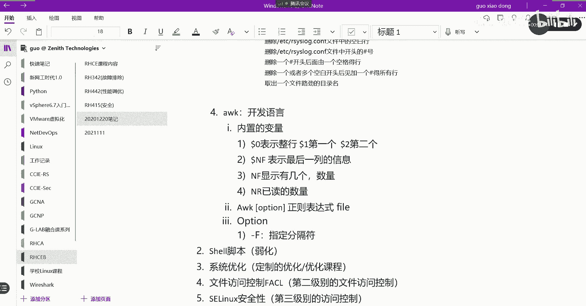

有几个有几个有几个名字，我这里有啊，这里在这里我们让大家用AWK来处理，我刚才给大家布置的作业，要拿到0644是吧，在这里呢可以通过C的先锚定到某个特殊的行，然后用AWK的杠大F来指定分隔符。

它的分隔符可以指定多个是不一样的，完全可以指定不一样的分隔符，有了这样的特点，我们可以通过AWK拿到任意的，我想要的字段对吧，然后他的所有的语言都写在花括号里头，花括号里可以写这个print。

大家一看print就知道了，这是一个开发类的语言，那么dollar调用我前面所分割出来的某一列，Dollar2，就代表啊我要拿第二列对吧，所以这个就能拿到我想要的东西了，好这个是第一个，第二个。

我们前面也给他写了一个，稍微复杂一点的条件判断，这个条件判断不管是什么判断，循环或者怎么处理，它都是写在花括号里面的，还有一点要注意的是，这个花括号外边一定是单引号，不要写双引号啊。

OK然后分隔符这个是可以单双都一样的，无所谓，好通过冒号分隔，然后这边的话跟之前比就多了一个条件判断啊，他这一行所要让我们实现的效果，其实就是处理etc password里面第12行。

到第31行的第一列，以分隔符，以冒号分隔符分隔开来的第一列，所以我不但可以以行为取，还可以列为取对吧，所以它既能做到指定行的某一列，而且他做的更加的精细一些，这个就是呃要比seed更方便的地方啊对吧。

还有个C的更方便的地方好嗯。

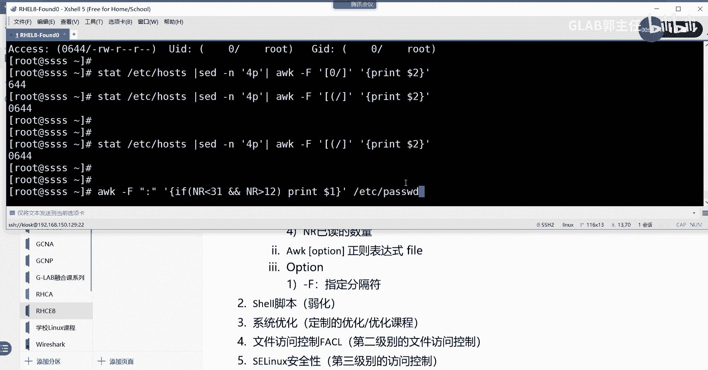

所以最后呢我们来给大家再总结一下，三剑客的这个三剑客的这个这个使用的地方吧，好吧，我们来总结一下，根据它的特点，我们来总结一下三节课使用的地方好，大家会认为根据刚才学下来，GRP或者EGRAP的特点。

它主要用来干嘛的一块，根据它的特点，它主要是用来筛选对吧，筛选出我们呃匹配到的相应的字段，它并没有对里面的字段来进行，做进一步的处理吧，他只要主要是筛选，主要是筛选，对不对，我们可以通过过滤或者叫筛选。

对吧，这叫筛选文本内容哦，关心的文本内容，好主要主要去筛选我们关心的文本内容，然后它更多的是要更让大家更多的去使用，它的这个正则表达式，该如何灵活的使用对吧，该如何去灵活的使用它的表达式。

筛选出我们关心的内容，然后seed呢，seed它的主要特点是在处理什么，看一下，记得这这一堆东西嗯，他能看它的语法，看他的address，然后看它的command，它最大的作用就是对行对吧。

对每一行的内容来进行替换或者查找，或者替换或者增加或者减少，理解我意思吗对吧，他是对行的内容来进行修改的，基于航的内容进行修改对吧，这个修改包括最主要的就是查找替换对吧，增加删除。

这就是seed主要用的一个内容，你看他的，看他的option，看他的dress address，定位置了，对不对，好OK那么这主要是它的作用好，AWK呢，AWK的特点。

它也是可以对我们的内容来进行处理的，但是它可以做到更复杂的操作，也可以对内容进行增加修改，增删改查，对不对，这个他可以做的，seed能做，他也能做啊，然后他还有比C的更更复杂能做的事情，它可以基于行。

基于列来进行处理对吧，它可以横向纵向行列处理，它会更灵活一些，C的对行列处理，相对来说没有AWK灵活理解吧，那在实际工作当中，三剑客应该是组合起来一起使用的对吧。

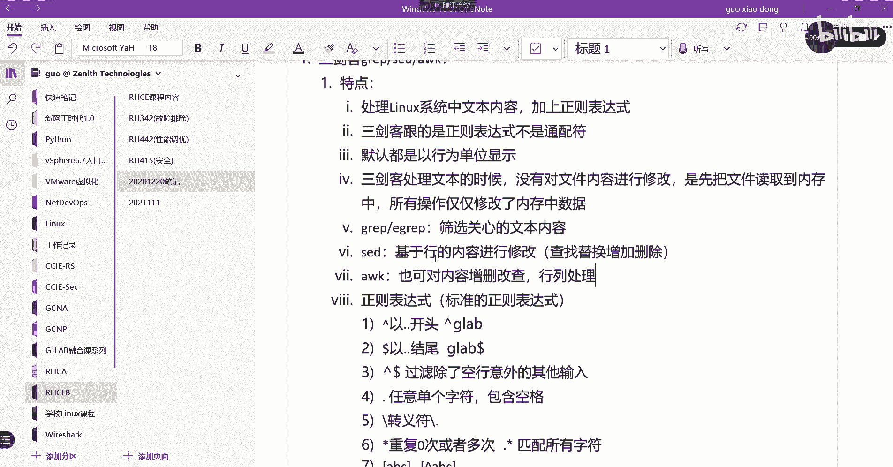

像我刚才给大家举的这个例子，他应该是组合起来使用的，像那个，嗯就最后一个了，就这个C的锚定了某一个dress，然后通过AWK来进行，我想需要的这个这个处理啊，然后也可以用group都可以。

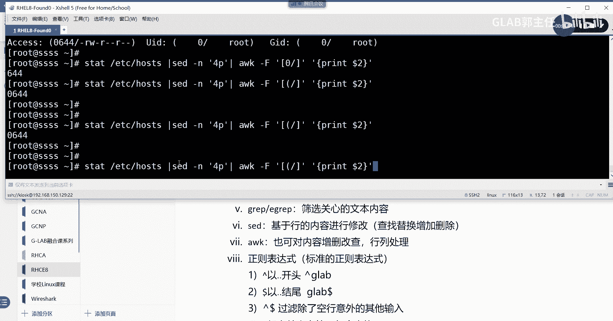

好这个就先说到这，没问题吧，好那么这个三剑客花了很长时间给大家补充啊，接下来我们来看脚本脚本，我看20分钟能不能说完，因为它内容已经被弱化到，已经很弱了，我们来看一下，从概念开始吧。

啊我们现在要说的是bash脚本啊脚本，那么bash是现在主流是主流的LINUX发行版，自带的一个叫希尔的编辑器，BH4s h e l shell的编辑器，这个要说一下，因为我们现在学的是一门语言。

虽然它是一个很简单的脚本语言，但是它也是一门语言，对不对，任何一门语言他都有自己的编辑器，大家写过Python的，知道了，Python要能够写Python代码，你可以用TXT写。

理解为什么你不需要去安装Python的任何东西，直接在本地打开一个TXT脚本，然后直接在脚本里面写Python，你只要对语法非常了解，你就可以直接在里面写Python的脚本，明白吗。

写脚本和执行脚本是两个概念，听懂了吗，脚本写完了，你要执行能够执行你写的脚本，取决于什么，这里的编辑器啊，对不对，就是你在Python官网下的那个Python什么3。63。7，3。8的那种东西啊。

那个叫什么，那个准确讲不是软件包，那个就是我们脚本语言执行的编辑器，听懂了吗，那么如果像java这种工业级的语言，它会它的编辑器会更复杂，对更加复杂，你要像很大的一堆东西来执行这些东西。

所以我们能够执行shell脚本。

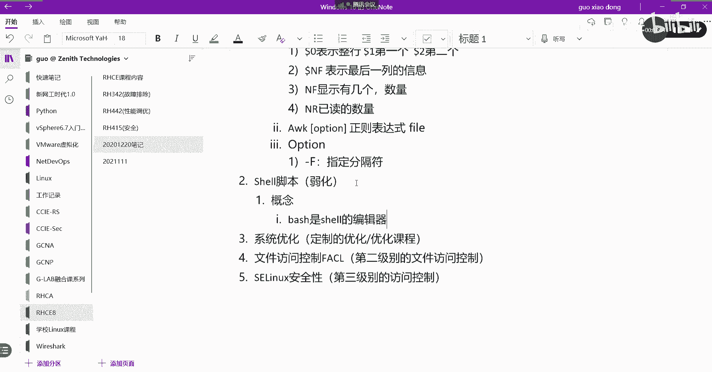

它的编辑器就是我这里的BBS是什么BH，就是我这里就是我们现在的这个，这个这个一整个界面，就属于BS界面或者叫shell界面，明白吗啊就你你只要进到这个界面，就相当于打开了希尔的解释器或者叫编，叫什么。

它叫什么编辑器对吧，这叫编辑器或者叫解释器都一样的。

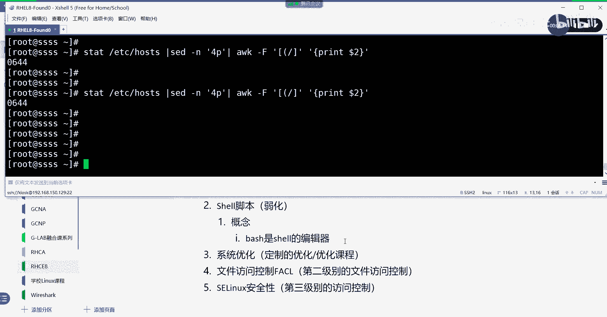

就是为了解释你企业的这个语言的啊，OK明白，所以在很早以前没有S波的时候，大家必学希尔脚本，因为自带了希尔编辑器，所有的操作命令都是在希尔编辑器里做的，那有一个非常好的这个脚本。

主要是这样的一个要求好吧，这第一个特点，第二个第二个啊，解释器和编辑器也说清楚了啊，解释器编辑器，然后呢这个脚本的特点是可移植性非常强，shell脚本的特点是简单，可移植性强，可一致性强，OK好。

那么只要有这个share，只要有bass的环境，它就能运行，只要有bash的环境，这个脚本就能运行，只要有就能运行啊，那么BT的环境是所有LINUX操作系统的发行版，都会自带的，都会自带。

所以说它的通用性非常的强，明白吗，还不需要安装任何东西，直接只要是LINUX，它就能执行这个希尔的脚本就自带了，好吧好，那么它也有一些缺点啊，还有一些缺点，它有一些缺点，他的缺点是什么呢。

不能够编译成底层的机器，更容易识别的语言，这是所有通用高级语言的缺点，这就是通用高级语言的缺点，就是不能够不能够编译成底层对吧，更容易识别的语言，更容易识别的语言，所以它的运行速度特别慢吧。

这是所有高级语言的缺点，包括Python高级语言，所谓高级语言凭什么定义它为高级，就是因为它跟人类对吧，它跟我们人交互更容易嘛，所以它是高级的嘛对吧，所以我们在Python里面写什么print。

什么if什么什么的，所有的东西我们人一看就懂啊，如果这样，那么怎样对吧，print打印什么，那么这些高级语言人越能接受，机器越不能接受，所以中间翻译的过程就会越复杂，听懂了吗，OK机器只能识别0101。

对不对，所以越高级的语言，它的运行速度越慢，这个是所有的通用高级语言的缺点，但是越高级的语言，它越能够越越容易学习，像Python Python下和希尔语言，这个应该是所有语言当中最容易的语言。

没有之一，没有自己，虽然现在很火啊，但我觉得它很简单，大家学Python只要五天就够了，只要五天，我我我上次也给我们一班的同学讲Python，因为我们学网络现在要学开发，要学Python是吧。

我们CCIEEI的课程里头，有专门的一个专题讲自动化运维，自动化运维总共十天的课，有五天讲Python，总共十天的课，我讲了，我讲了12天，然后这个基本的Python语法就讲了五天，五天讲完你肯定会了。

太简单了对吧，都最简单的语言没有之一啊，继续其他的应该没有什么来我们看啊，接下来我们来看拍拍BS的编程的基础了啊，第一个，查看解释器，查看我们的解释器，可以去查看我们当前线二的解释器。

我们可以通过cat etc下面的这个叫，大家可以看一眼我们现在大家拿到的LINUX8。

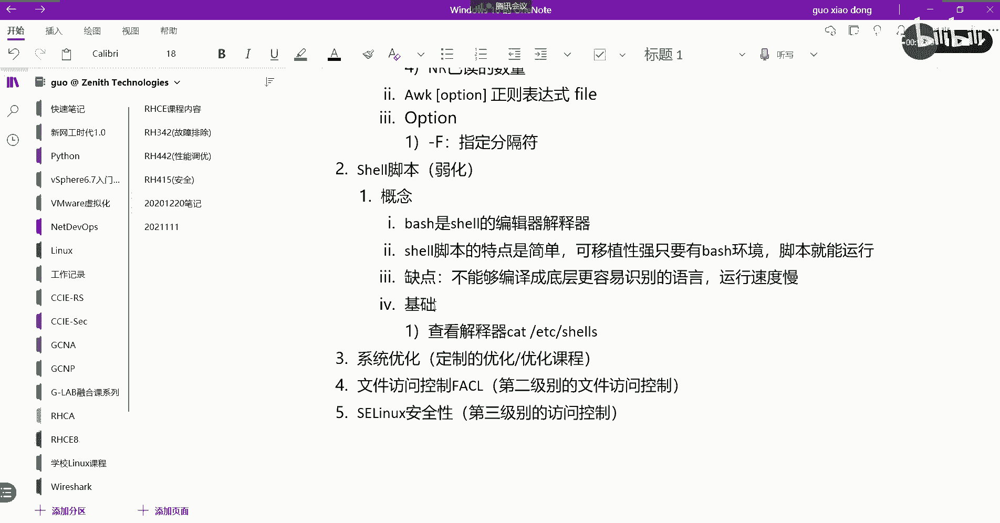

它默认用到的应该是什么batch，冰箱的batch用的是share，是这个是这个，这是我当前系统能支持的一些解释器对吧，那么如果我现在在用呢，我可以通过ENV去看了，ENV能够看到我现在的BH。

我可以过滤一下对吧，因为我们刚才讲的GRAP过滤一下bash，过滤一下希尔啊，我用的是不是bbish bin下面的batch对吧，grab直接过滤啊，过滤看这个输出当中他关心的这一行。

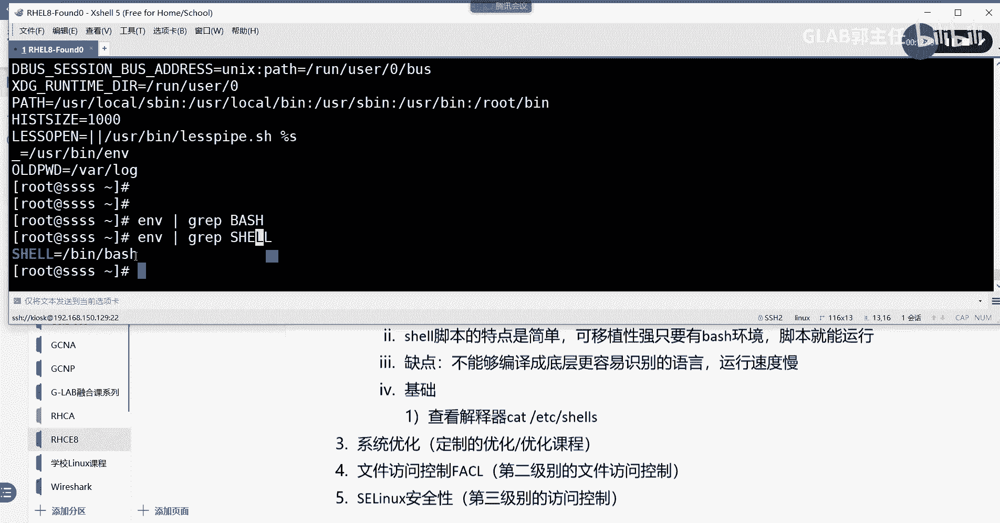

我当前用到的线，刚才这个命令是看我所有这个系统能够支持，所有的这个解释器。

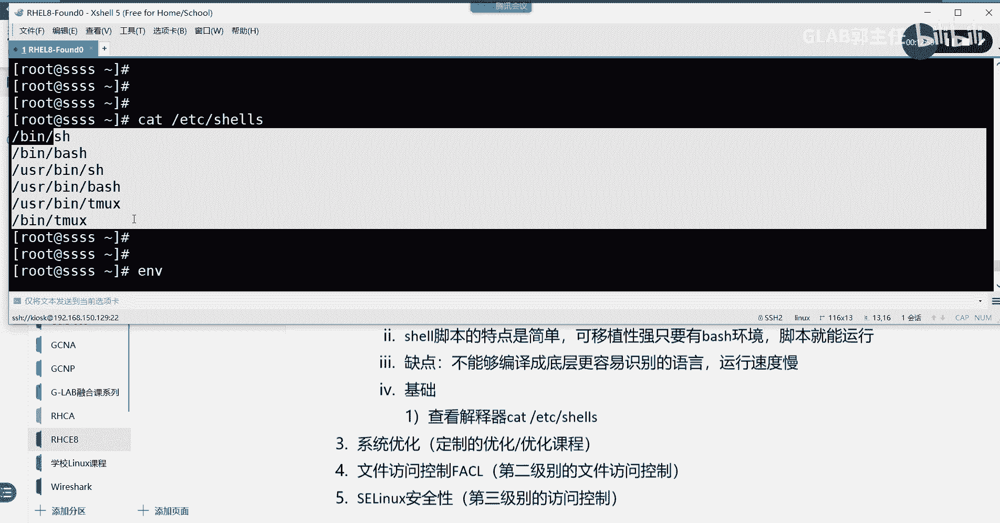

希尔的解释解这些都是能支持的，明白吗，然后当前在用的就是bean下面的bash，OK这个没什么问题啊，好，接下来我们来给大家写一个简单的bash，脚本语言啊，看一下吧。

好我们可以直接用vim编辑就可以了，Vm hello，点SH好，我再问大家一遍，这个点点SH的结尾一定要是点SH吗，不一定在LINUX里头的后缀没有实际的意义，只是为了帮助我们更好的区分文件，听懂了吗。

对吧好，这时候我们开始写拜脚本了，好编辑文件by脚本有几个比较注意的写法，第一个第一行，第一行一定要指定我的解释器，指定解释器用的是井号叹号，然后斜杠B下面的BOK好，这是第一行。

第一行是指定我的解释器，好，第二行，这叫注释，比如说我们写this is the the first batch script，这是我的第一个脚本，第二行只是一个注释，听懂了吗。

好第三行才是我们要在里面写的所有的东西，好大家想想呃，为什么说希尔的脚本非常简单，那是因为我们在base里面能够操作的所有东西，就在这儿能操作的，所有的代码都可以写在shell脚本里面。

因为他们执行的解释器是不是一个啊，你刚刚在你在外边，在希尔里面说的任何命令是办事去解释的吧，然后你现在写的脚本最终也是办事解释的啊，对不对，所以我可以把在外边的所有的命令，我都可以搬到这个文件里面来。

然后当成一个整个的命令，那个文件命令来执行吧，比如说我在外面是不是输了这个echo echo，是不是在外面可以做啊对吧，那么我在这里也可以做了，Hello，hello world是吧，明白我意思吗。

OK那么这个时候他能执行吗，这个命令这个能执行吗，那我们看看我写了哪些东西啊，我写的第一个代码就这个对吧，然后我在外面其实是可以执行的，我随便写个什么东西，是不是都给你说出了，那么你写在文件里头。

它也是能执行的。

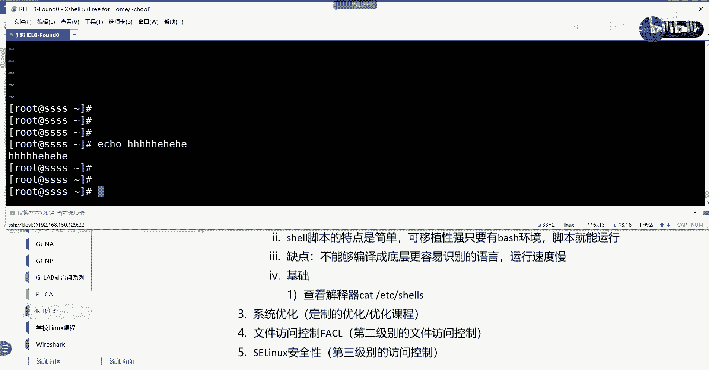

那这个时候就引申到我们bash脚本，脚本执行的方法，你在外面直接输入命令执行，大家都能理解，对不对，命令直接会被解释器解释，那没有任何问题，但是你把命令放在文件里头，文件要被解释器去执行。

有几种方法呢对吧，办事脚本执行的方法有三种，哪三种，第一种，第一种啊给大家写啊，第一种直接用办事的这个命令去执行文件，就这个命令可以直接用BT去执行，这个文件的里面的东西，这个没有任何问题吧，OK好。

接下来第二步，第二个第二种方法啊，我们可以用DR，用点来执行这个file，好，用点来执行这个fire的话，或者用source它有两种方法，S o u s o s o u r c e。

用点或者用source来执行这个方，那用点或者source的话，他会用当前shell的默认的解释器，就代表的是使用当前这个shell的默认的解释器，来解释，来执行这个没什么问题吧，好上面呢。

直接用BT代表的是直接指定，用什么样的解释器来执行吧，直接指定用啊，要指定使用特定的解释器来执行，因为我们知道啊，这个希儿的解释器不光有bash，还有z share，还有白希儿c share。

这些都是解释器吧，理解吗，那么上面第一种直接指定某个解释器来执行，然后不指定我就直接点执行这个文件，或者用source这个文件，用当前shell的默认的解释器来执行，听懂我意思吗，好第三种。

第三种叫点叫点斜杠来执行我的文件，点斜杠没有空格啊，后面直接加我的这个file，这是什么意思呢，但这里有一个注意点啊，用点斜杠来执行这个文件的时候，文件必须要有执行权限，必须要有执行权限。

这种点斜杠加文件的执行方式，就跟你在windows上下了一个EXE，双击下一步，下一步安装，这是这就是在LINUX的操作系统上，去执行一个可执行文件的方法，这是一个在LINUX操作系统上去执行。

一个可执行文件的方法，标准方法，也是一个唯一方法，明白我意思吗，你要去执行一个可执行文件，就这么干的，就用点斜杠加文件就可以了，但前提是他必须得有这个文件可执行权限，这三种方法我分别给你演示一下。

前面两种执行方法，我有说这个文件要执行执行权限吗，没有吧，各位来吧。

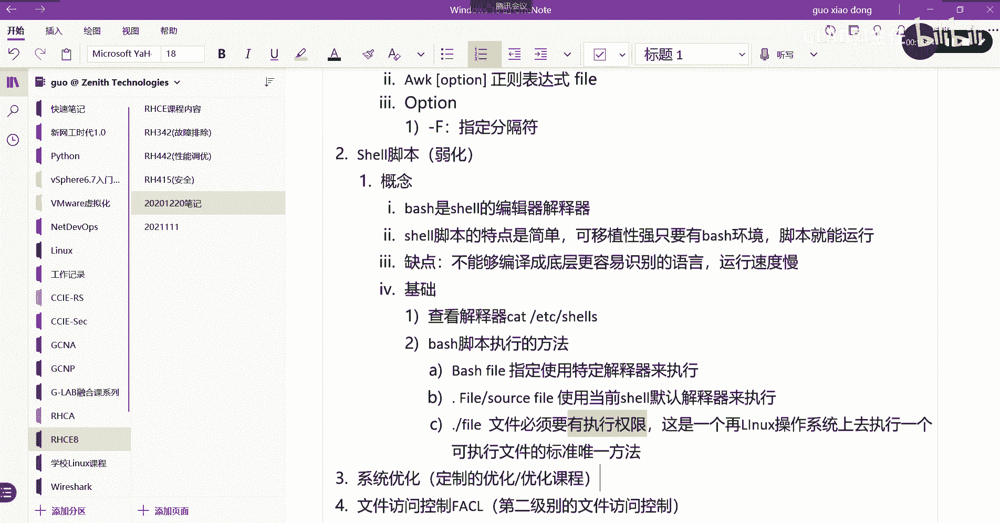

现在我这个文件写完了，他没有任何执行权限，Hello，点SH，他没有执行权限，OK好，那我现在要执行它，我用BH看啊，B a s h，然后呢，hello dsg执行了吗，hello world啊。

然后我用点空格执行了吗，或者用source hello world执行了吗，对不对，但是我用点斜杠，hello world h e l o d s h可以执行吗，不能他说什么没有执行权限呗，对不对。

那现在我给他加执行权限，大家还记得怎么加的嗯，A加x la嗯，对mod啊，加完了来哎呦呦，这个是不是变成绿色了，这就别代表可执行权限，有了吧，有了之后点斜杠，Hello world，执行了吗，明白了吗。

各位所以三种在办事里面执行的方法，这个我们在C的考试当中，前面第一个题会考，所以我给大家讲一下关于这个问题，我们前面在考试的时候啊，很多人出出错，当然我们要写一个脚本，要写一个办事的脚本。

这个脚本是要去运行ASSB去安装目的，一些仓库，安装样本，仓库是写在脚本里的，那么这个脚本的执行，我们统一的解法是给他去赋予执行权限，有三种方式当中，用第三种方法，这是红帽官方。

或者包括LINUX整个行业非常推荐的一种做法，给我要执行的文件赋予执行权限，不要用前面第一种，第二种，但你要知道脚本文件，第一种，第二种都是可以执行的，明白吗，OK好这个是他的执行方法，我说清楚了吧。

清楚了啊好，那么接下来，接下来我看看啊，嗯接下来我们来给这个办事的变量。

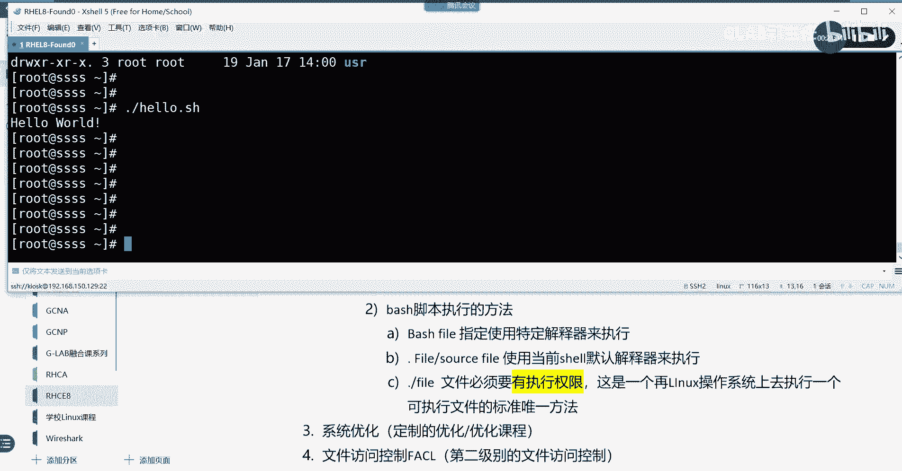

简单的介绍一下啊，在拜师当中，变量的分类，变量的分类，它大概可以分为局部变量，这个我相信很多人不懂啊，全局变量，还有一个叫特殊变量啊，我先说局部变量吧，好吧好，第一个什么叫局部变量，局部变量是指。

这其作用仅仅只是在他的被声明的白线中，只在啊，就是变量只在变量，只在这个被声明的这个白雪中，白线中，Ok，也就是说每个启动白线的进程，都存在一个变量空间啊，然后呢局部变量仅作用于这个空间。

我要给你画一下这个图，这是我的这是我的操作系统对吧，那么操作系统底层是什么，硬件一大堆，没有任何问题，然后我们真正操作的应该是应该是刚登进去的，这个叫谢尔吧，就外边的壳，对不对。

我们所有的命令去发给谢尔，我们所有的命令去指定希尔去执行，希尔帮我们解释完了以后，去调用底层的硬件来给我们提供服务，听懂了吗，所以希尔其实是我们人和机器交互的唯一接口，明白我意思吧，但是你很牛逼。

你可以直接去编译硬件好，但是大部分只是去跟share进行交互，听懂了吗，OK所以我们的希尔希尔希尔他是一个程序，它是一个软件，没有任何问题吧，那么我们刚登进去的希尔，他肯定是一个程序或者软件。

或者是在我们底层体现的是一个是不是进程啊，我们刚进去看到的这个希尔界面，它能够正常执行，它一定是以某一个软件运行的进程嘛，听懂了吗，好那请问如果我现在是SSH进去的，对不对。

看到的是这样的一个shell界面。

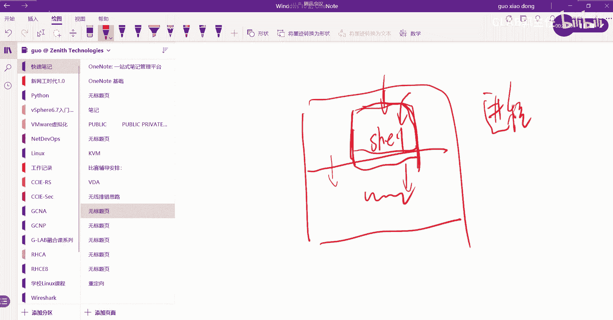

是这个界面吧，这个就是希尔界面，在底层它就是PSAUX，可以看到它就是我们这个，就那它就是一个进程吗。

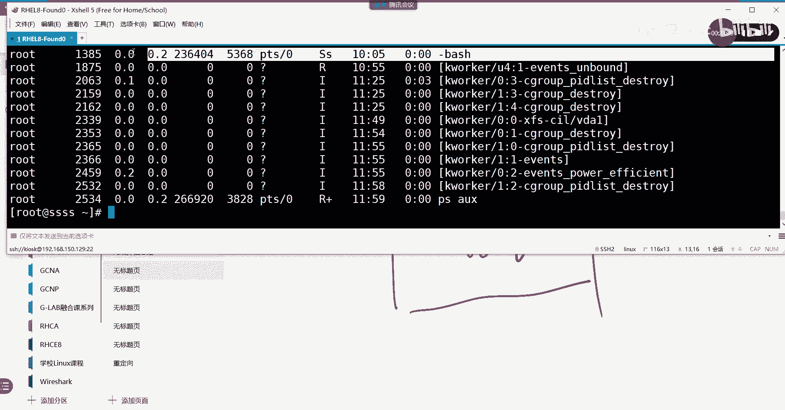

看到了吗，那请问如果我现在这是我，这是我A我通过SSH进来，又来了个BB也通过SSS进去，他也能够看到一个希尔的界面，他看到了希尔界面，和我看到的希尔界面是同一个界面吗，问的直接一点。

就是这两个希尔是同一个进程吗，有想过这个问题吗，这个问题你要想明白，你你在网络上通过SS去登到这个服务器上，是不是也有一个希尔的对话框，然后他登进来也是一个希尔对话框，你俩登的是同一个进程吗。

显然不是嘛，对不对，肯定不是啊对吧，你真的是你的，他真的是他的好，为什么要区分这两个不同的进程，是因为我们的局部变量，它是针对每一个不同进程的希尔的，就你在这个线里面定义的局部变量。

在另外一个希尔里面是不生效的，我给你举个例子啊。

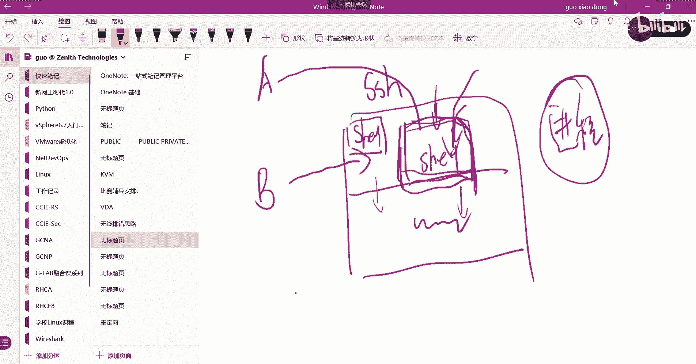

给你举个例子，比如说我现在看啊，我复制两个，复制两个渠道，然后我通过他也SSH到root server，这都是server，明白吗，然后我在左边的设备定义一个局部变量，这个局部变量怎么定义。

我定义一个叫host name，等于GLB，看到没，然后我要想看这个变量，我可以通过echo dollar hostname看到是不是GL8，看到了吗，好然后呢，我在另外一个。

这也是在这个服务器上的对吧，另外一个线，那我在这里通过EQU多了，host name能看到能看到内容吗，看不到吧，各位那我在这能看到吗，但是我在另外一个上面，他对这个变量有定义吗，有没有定义，没有定义。

听懂了吗，这说明啥，两个作用的变量空间不是同一个希尔，就每一个线都有自己独立的局部变量的空间，听得懂吗，OK好这个叫局部变量。

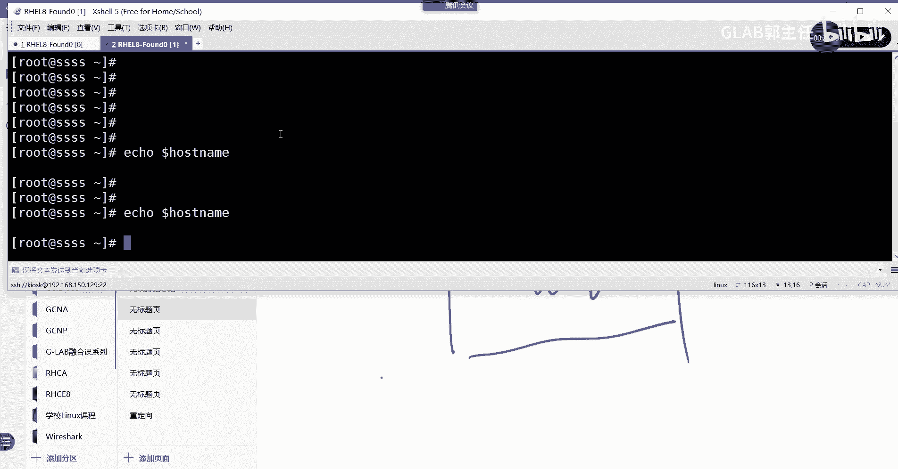

这个就叫局部变量，就是明白就是你在这儿啊，你在这里定义的变量和在这里定义的变量，这是两个啊，听得懂吗，不一样啊，好那么不管是两个线什么进程，它都运行在系统磁场，在系统里面定义的变量，这个叫全局变量。

听懂我意思吗，它底层有一个专门来定义所有的地方，所有的变量的地方，这个叫全局变量，这个全局变量既可以给他用，也可以给他用，对吧，这个叫全局变量，能听懂我意思吗，各位那么全局变量在哪定义呢。

全局变量我们跟全局变量相关的东西，有好几个文件对吧，有bash rc是吧，有什么profile，前面我们讲全局变量的时候讲的那几个文件，那就属于全局变量，明白我意思吧，好，那么我们怎么把一个普通的变量。

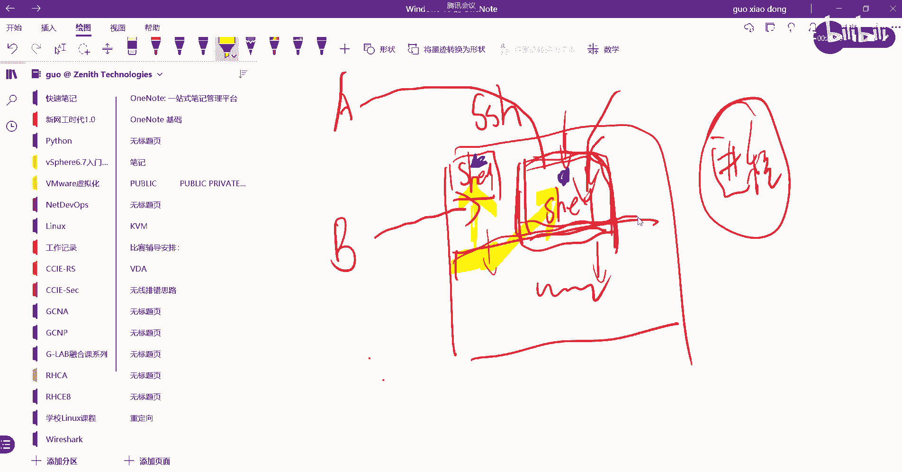

变成全局变量呢，可以临时的把一个普通的变量变成全局变量，它通过一个命令叫export，这个还记得吧，比如说export IP斜杠ADD等于1。1。1。1好，这个是就已经有了，这个你都会。

那这个变量就不是局部变量了，因为你在这里可以一口去调用这个IP，看到是这个地址，你在另外一个地方，也可以通过eco dollar去调用这个IP，这是IP什么哎，不一样，我看看啊，临时的导进来了嗯。

那要重新登一下出来要重新登一下，IPADD诶还没有看看啊，这个是，export进去了啊，这个应该是进去了，应该是进去了，进去了之后呢，哦这里要说明一下，这个下午再说吧，好吧，这个要说一会没关系啊。

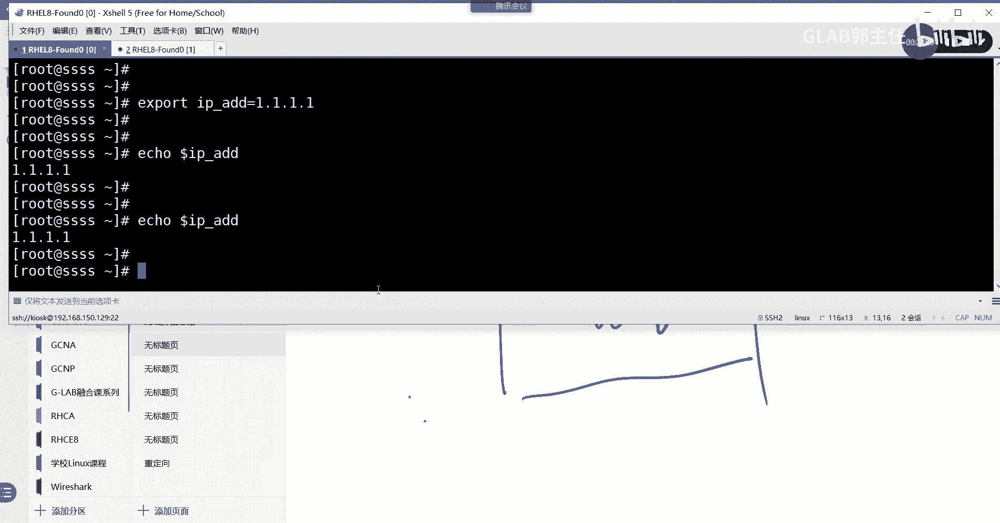

第一个局部变量应该是对的，这个说明一下，局部变量是变量，只是被声明的白线当中啊，它是每一个希儿都有自己的一个变量空间，每个T都有自己的变量空间，OK就这个意思。

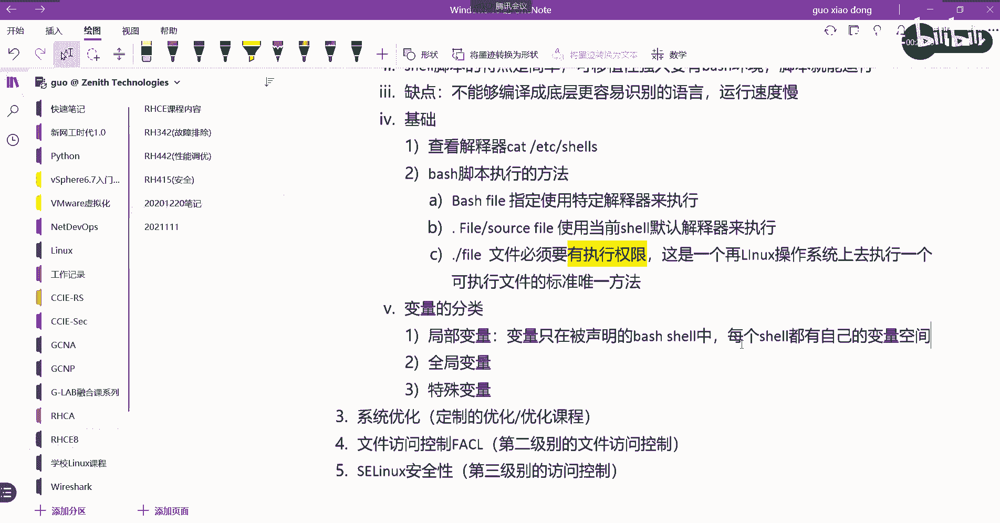

这个先暂停，我们下午再说，好来吧，我们接着讲啊，我们说到这个局部变量和全，局变量和特殊变量啊，这几个在尤其在写脚本的时候很重要啊，有很多人的脚本写完了啊，在这个地方能执行。

换了一个希尔界面又不能执行了对吧，又换了一台机器，好像又不能执行了，他又搞不明白什么问题，那么我们把这几个变量说清楚，你就应该知道吧，在哪里是什么问题，好，我们来看先看局部变量嗯，关于局部变量。

我这里已经已经给大家演示过了，就是变量只能在被声明的白希尔当中。

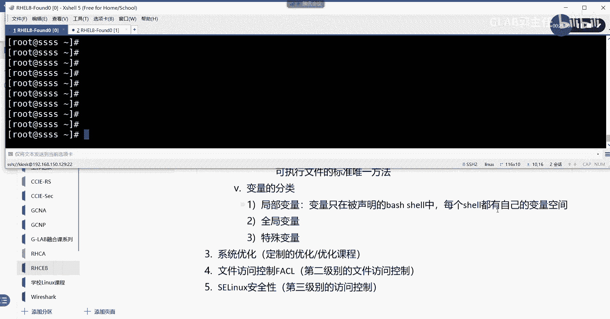

每个希尔就有自己的变量空间，对吧，好再回到刚才这个图当中来，我们上午有一些小的小小的问题，我会画的清楚一点啊，看一下，这是我的这个电脑，然后呢我的我的这个这是我这是A用户SSH进来，看到了希尔的界面。

这是B很显然这两个属于不同的希尔的，对不对，然后他们有自己各自的变量空间，那它它有一个自己的变量空间，他也有自己的一个变量空间，OK这个我们验证过的，你在不同的shell里面。

不同的SSH进来的里面去定义本地变量。

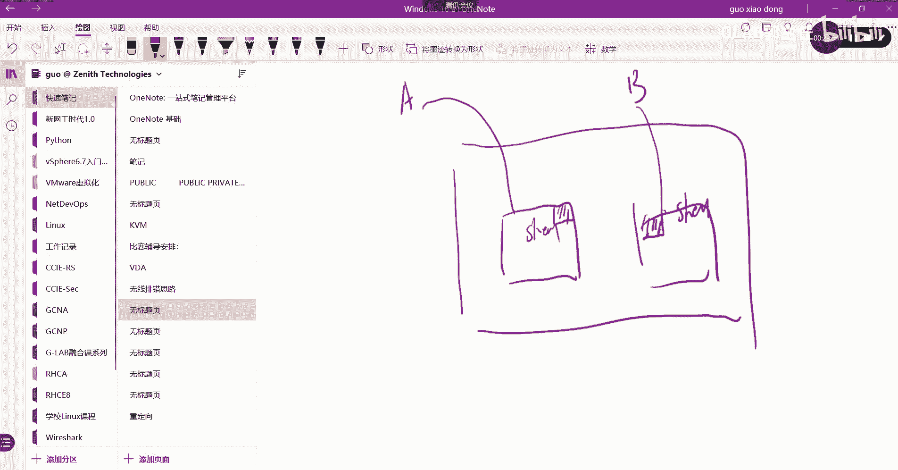

本地变量的方式很简单，就像我刚刚讲的，在这里我定义了本地变量，这个本地变量我是通过呃host name，直接host name等于GRAB是吧。

然后我通过echo这个通过dollar去调用HOSTNAME，很明显这个是我定义的本地变量，然后呢，另外一个终端我去equal hostname，他就没有这个没有任何问题，明白这个叫本地变量好。

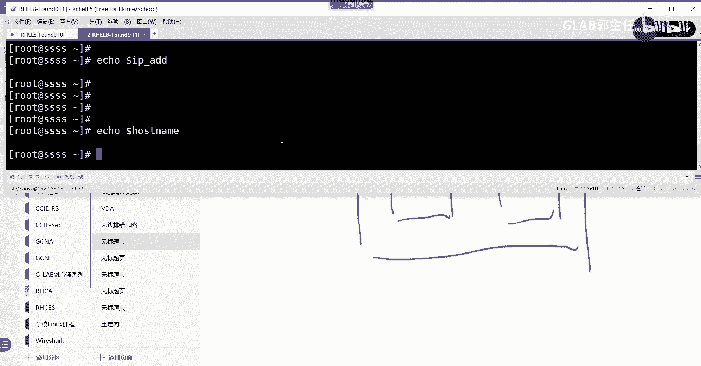

另外呢我们还有说到了另外两个变量，这是本地变量啊，不同的希尔有自己的本地变量好，接下来再说另外一个，我在我在shell里面是不是可以再开一个希尔，或者再打开一个解释器，默认打开了一个线。

这个线会自带一个解释器，这个解释器在LINUX里面叫白线吧，这属于希儿里面自带的，你只要打开一个线，它就有自带一个自己的解释器，叫白线，能听懂我意思吗，然后我可以在希尔里面再开一个，再打一下。

这个命令叫白希儿。

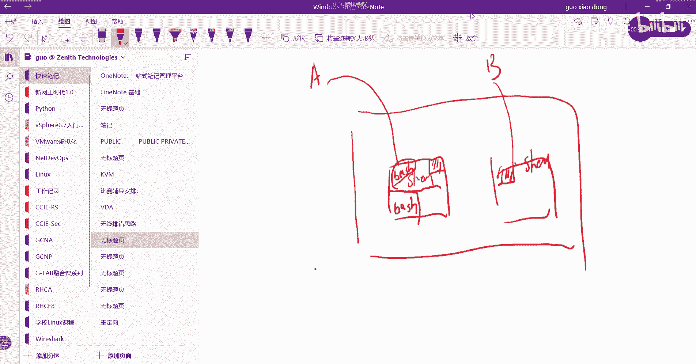

这是一个命令是可以打的，大家看下，我在这打一个白线是不是也可以了，明白我意思吗，好这个时候看到界面虽然跟刚才界面一模一样，但是你要区别，我再打一次白希尔，这时候我见到的界面是在馅儿里面。

又开了一个白希儿，这个叫子馅儿子的白希儿，明白我意思吗，是在紫的白线，明白K那这个紫的白线里面，他能不能去调用我刚才看到的那个host name变量呢，大家猜一下可不可以，可以吗。

刚才host有GLB现在有吗，没有吧，这说明我打开的是一个子线的，子线的一个一个环境变量，这个空间和我复姓的应该也不是一个吧，能听懂吗。

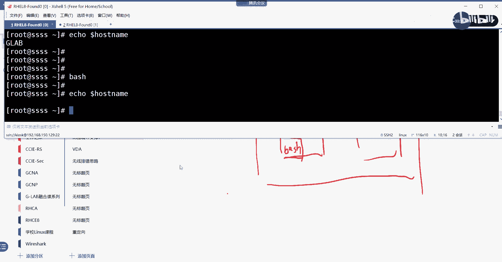

所以这里头又有另外一个，你开了一个白线之后，这里又有一个属于他指白线的环境变量的空间，那么所谓的局部变量，它其实相对独立的三个地方，这叫局部变量，第一个就是希尔弗希尔自己的一个独立的，这叫局部变量。

明白我意思吗，然后第二个我们讲的SSH进来的，他开的是另外一个进程，这个非常能理解，对不对，开了一个新的白线的进程，这个变量空间和这个变量空间显然是不一样的，另外那在这里。

我又给大家多了一个新的变量空间，就是在副线里面又开了一个子线进程的时候，这个时候子线的这个变量空间，和副线的变量空间也不是同一个嗯，这个听懂了吗，所以局部变量大概我们现在能理解的有几块。

这个局部变量有几块，大概有三块，对不对，第一块是我们的，第一块是第一块是这个SSH啊，或者叫独立进程的独立进程的shell变量空间，这个是完全不一样的，明白吗，独立进程的啊。

你SH和5S就完全不一样的进程，OK好，然后呢，第二个就是我们的这个子子线进程的，这俩都不一样对吧，都不一样，他们都不一样，能听懂我意思吧，啊都不一样吧，OK好。

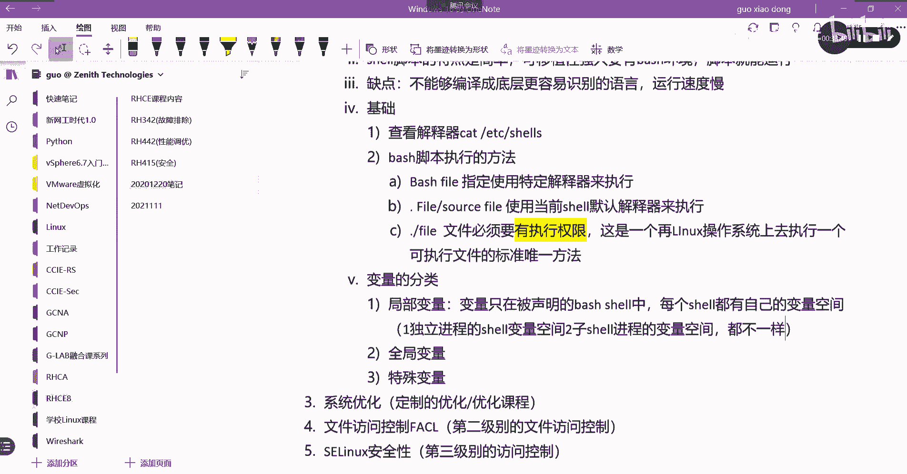

那么再回到我们上午说的，如果我现在在在这个地方，我现在啊退出来，CTRLDEXIT退出来，这个时候再打就有了吧，从直线退出来，看到的是副线的，副线的本来就定义了一个本地的局部变量。

那么你再去echo一下，就能看到复希尔局部变量里的，局部变量里的内容，听懂了吗，Ok，那么现在我们来把这个变量变成一个全局变量，这叫全局变量，我们变成全局变量用的是什么，EXPYD是不是用的是他吧。

好用它把它变成全局变量，OK变成全局变量，我们分别来看不同进程之间的全局变量，是不是一样的，子线和副线的这个呃，呃这个这个全局变量是不是一样的，各位能听明白我意思吧。

OK好那么这个我刚才已经做了export已经做了，我们可以看一下ENV上午就已经做过了，我已经做了一个IP address，应该是一点一吧，就这个IP小写的IP下NADD，这是我export出去的吧。

好export出去之后，我在复习里面equal一下，这个叫IP address，没问题吧，然后我再到仔细里面去进了，仔细了啊，我在IP dress没问题吧，OK所以这个叫什么全局变量，听懂了吗，好。

那么全局变量的概念其实就是我来总结一下啊。

他会全局变量的，也被称为也被称为环境变量，也被称为环境变量，那么默认情况下定义的变量是局部变量，全局变量的含义呢是子馅儿，是其子，白馅儿是可以继承当前白馅儿的变量，怎么去写这句话。

就是紫白线是可以继承对吧，当前BS下的变量我们把它叫做全局变量，这个能听懂吗，OK但是要注意我又开了一个SSH的进程。

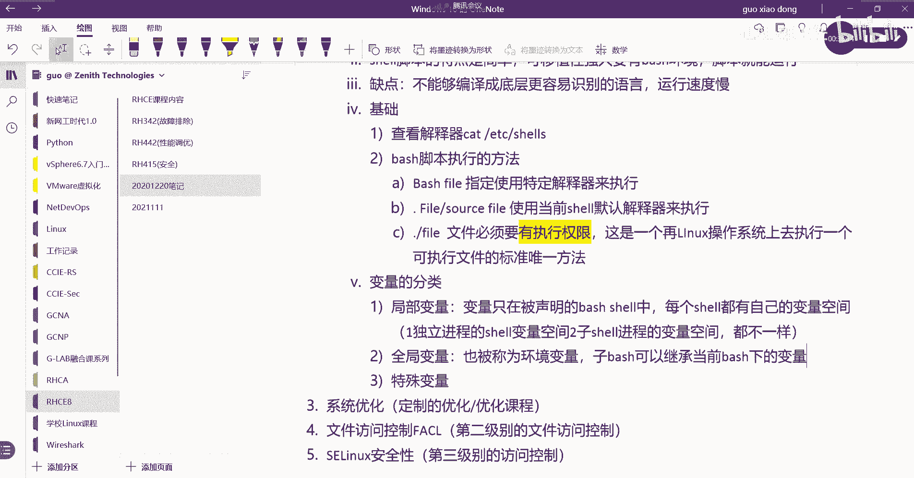

我在这里去ECHO去输入一下，调用我刚刚的那个叫什么玩意来着，IP address是吧，嗯有没有用没有用吧，这里为什么没有啊，这里为什么有，这里为什么没有啊，这属于不同进程下的。

就是不同的SHR不同进程下的希尔的环境，明白吗，我这里写的全局变量仅仅只是子线，可以继承父希尔的一个白希儿的环境变量，而我现在重新是只打开了一个新的进程吧，新的share的进程。

它当然是不能继承这个全局变量了，明白我意思吗，但是如果你想让不管哪一个SSH终端进来，只要打开shell的进程，它就会自动继承这个全局变量，我应该怎么做，我不我其实不应该用export，我应该用去修改。

我们跟环境变量相关的几个文件吧，最直接的文件是什么，就是在当前目录下，by shr c白雪的LC文件在里头，你看啊，在这里新增加了一个变量，这个变量是IP是大写的，跟刚才不一样啊。

IP而且address是全拼的，我给他了一个2。2，我写了一个能听懂吗，各位好，我写了一个嗯退出来，那这个时候我们来测一下啊，当前我现在在哪里，我现在在提出来啊，我现在在副线副线里面。

我们去看一下这个大写的IP address，202没问题吧，然后我到子线里面去，然后再去输一下IP下横杠address没问题吧，然后我再到另外一个SH新的进程下面，没问题吧，看懂了吗。

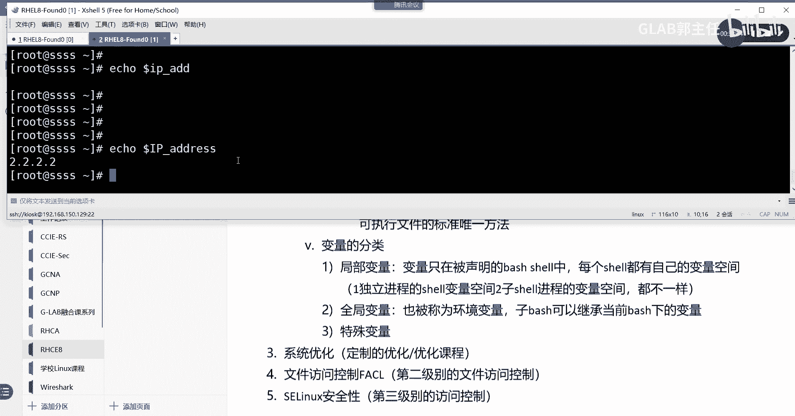

所以这里要看清楚啊，全局变量看你怎么用全局变量，它是一个全局的概念，但是如果你想啊要让这个全局变量在任何进程，只要打开希儿就继承的话，你需要去修改跟这个环境变量相关的文件。

这个文件有很多能够修改环境变量相关的文件，这里的BRC就是一个理解我意思吗，by12C就是一个要去改它的文件，然后这个文件是不管不管每一个进程，打开这个线都会去加载的一个环境变量的文件，Ok。

那么如果你只是在当前SHER去export的一个文件，它只会给自己的子希尔去继承，这个也是环境变量的全局的全局变量的一种，各位都听懂我意思吗，这也是很全局变量的一种，只不过它只是临时的。

只是针对当前副线的副线，有了只有子线能继承吗，对啊，其他新的进程就没办法继承了，就这样一个概念。

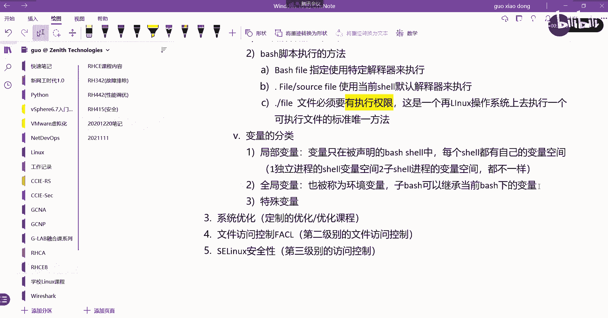

听懂了吗，各位明白了，这里说这么多啊。

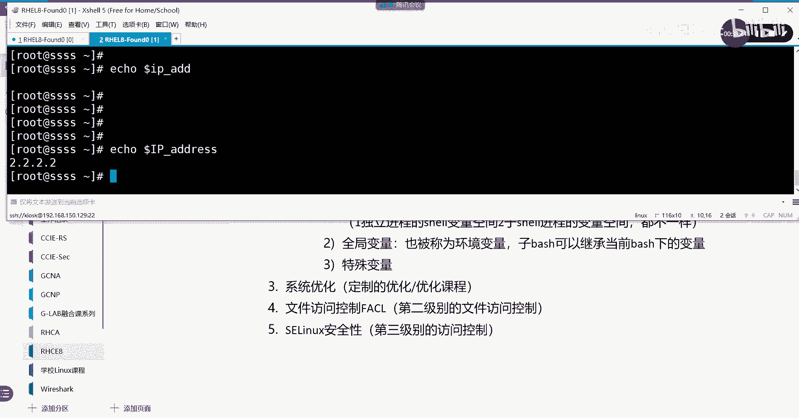

必须要强调，为什么要这么要强调，这个是因为我们在执行脚本的时候。

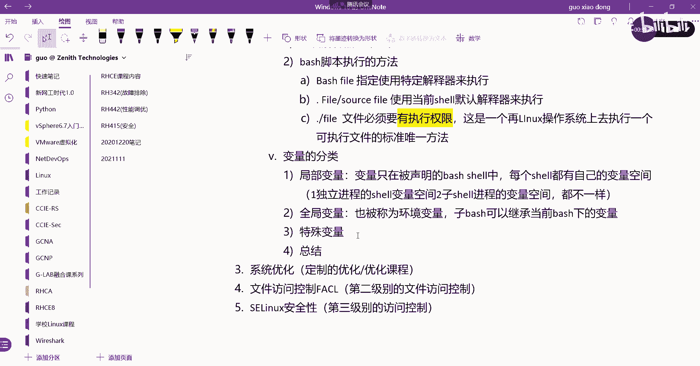

是不是有很多种执行方法，大家想一下，执行脚本有几种执行方法，执行脚本是有三种执行方法，对不对，但是呃我想问的是，我们的脚本它在运行的运行，正常运行，达到正常运行的目的，我们有几种情况去运行这个脚本。

可可能不是不是很明白我要表达的意思是吧，第一种就是我把它写好，直接在当前shell里面去用白希尔去执行，是不是这样执行的，这样执行，请问我直接回车，这样执行，他用的是负希儿的解释器。

还是用的子线的解释器，很明显吧，你打开白线就打开了子线吧，你直接用白线去执行某一个脚本文件，它不是用的副线，它是用的子线的，听懂了吗，对不对，所以这里头就有一个本地变量，全局变量和本地变量的区别吧。

各位听得懂吗，这里就有一个本局部变量和全局变量的区别啊，OK他打开了仔细，如果你在复希尔，你在你脚本里定义的一个变量，是复希尔的本地变量，然后你用BT去执行的时候，他是不是能够读到这个本地变量。

局部变量读不到吧，听得懂吗，对不对，所以要注意这是一种执行方法，还有一种执行方法是什么呢，就是系统它自动执行脚本，系统自动执行脚本的时候，是不是不需要，我在这个交互式的希尔界面里面去打。

那么任何一任何哪一种三种方式，任何一种方式的这个这个语语句，命令语句吧，不需要打吧，他在后台自动执行，听得懂我意思吗，各位后台自动执行，有人说后台自动执行怎么做啊，接下来我马上就会讲定时任务。

我可以把很多脚本直接写在系统加载，就系统开机就加载的文件里面，系统开机就加载的文件，需要你再去用命令去执行它吗，不需要，那属于系统自动执行的脚本，系统自动执行的脚本，它加载的变量有哪些呢。

系统自动执行的脚本，它需要局部变量吗，不需要需不需要全局变量要，对不对，要加载全局变量，而且这个全局变量要写在文件里面的，全局变量吗，而不是export临时的全局变量，理解我意思吗。

OK所以这个是系统执行的脚本啊，系统执行的脚本需要呃自我定义，需要的各种环境变量需要提前要定义好，听明白了吗，OK然后命令行中启动的脚本，会继承当前的希尔的环境变量，OK这里我给大家写两句话。

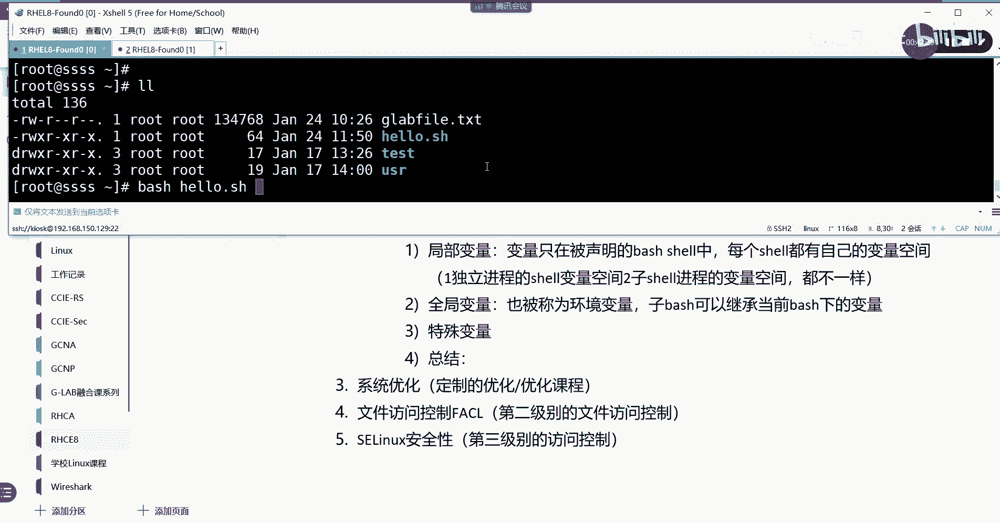

就我刚说的两句话，把它总结成两句话，脚本在执行的时候，在命令行执行的时候，它会启动一个子线，对不对，会启动一个子线，那么这个子线他会继承当前的环境变量，子线会继承当前叫父share的环境变量，对不对。

会继承当前副线的环境变量，我这个环境变量就是我刚刚讲的全局变量啊，因为刚刚说过了，全局变量又被称为环境变量，全局变量对吧，他并没有去继承父系的局部变量啊，听懂我意思吗，第二句话，系统自动执行的脚本。

系统自动执行的脚本，这种脚本启动方式又被叫做非命令行启动啊，你断了吗，断，刚刚说到这系统自动执行的脚本，自动执行脚本的方式，这就叫做非命令行启动，非命令行启动，听懂我意思吗，非命令行启动啊。

那么这个时候需要考虑的是，就需要自己去定义需要的各种环境变量，需要去定义，对吧对吧，自己或者自我需要的嗯，确定需要定义自我需要的各种环境变量，这一点非常重要，大家写的脚本要看你用什么样的方式来执行。

理解吧，很多变量如果让系统自动执行，你一定要在一些这个变量文件里头去定义，你的脚本里头用到的一些环境变量，需要去预先定义好，如果不定义它可能就起不来明白，因为他并没有像上面的执行的方法。

这样子他可以去继承副系的环境变量，直接继承下来就能用了，能听懂吗，下面没有东西可继承，需要你自己去定义，各位能明白我的意思，OK好，然后呢，接下来我们来说第三个环境变量，叫这个叫叫特殊的环境变量。

OK那么特殊的环境变量的话，我们来给大家简单的写一个脚本，我来写一边写，大家跟着我一边看啊。

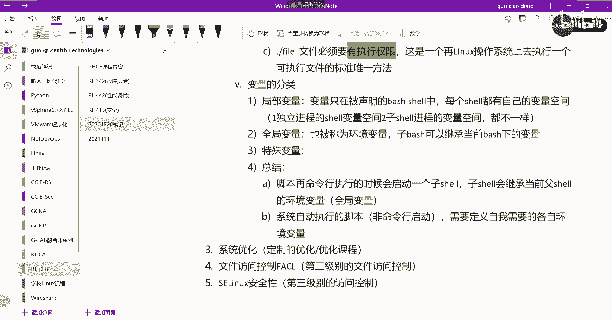

这是我们写的第二个脚本，叫vm vs点SH啊，这只是一个名字啊，第一行应该写什么呀，井号井号叹号指定B下面的bash，这个叫什么，指定我们的解释器，这个就在bash脚本里头。

第一行一定要写这个指定我们的解释器，第二行是注释，巴拉巴拉巴拉巴拉随便写，这只是一个注释好，接下来才是你真正的这个脚本的语言好，第一句话我们写ECHO对吧，大家先看啊，然后把俩引号写上。

说this cos对吧，Name is，Dollar0，好第二句，一口两个冒号调用dollar井号啊，dollar是调用变量对吧明白，然后dollar是调用变量PARA，TOTAL好。

这只是一个第二句话，第三句话ECHO好，再来PARAPRA是一个简写，是参数的意思对吧，List，然后调用我的dollar，at dollar很明显是在调用变量对吧。

ECHO1会我给大家看看它的作用是什么，再来，然后呢，第一个the first is，第一个是不是DOTA1dollar1调用对吧好，最后一句话。

echo两个说the e c o n d second is多了二吧，差不多就这些，差不多就这些我都写完了，写完了大家来看啊，好这个脚本我要给他给他一个执行权限，我可以给他一个执行。

当然我也可以用BT直接去执行，开一个子线吧，仔细来执行它好BH，我们执行一下TSH，它会报错，他什么都没有，你看啊，说this code name is，是不是这个名字啊，然后呢有多少个参数在里面。

零个参数吧，零个参数吧，那么后面什么都没有吧，什么都没有，说明后面要跟变量的，后面是假设我们要跟三个东西，比如说atom jk，好好再来一个，HELEN跟了三个对吧，回车好，这个时候就不一样了。

看这个代码的名字，就是我后边跟的这个名字，你这边写啥，他这边就写啥，所以请告诉我第一行多了零，多了零，它调用的应该是什么，我第一行代码是不是写的，This code name is dollar。

dollar就是你脚本的名字吗，明白了吧，就这个吧，所以dollar能表示程序自身OK好，接下来继续看，有有多少个参数在在我的这个后边跟的三个吧，你看啊，如果我把黑人去掉，变几个了，两个了，对不对。

然后再把这个三还能加上，是不是三个说明第二行里面的多了井号，什么意思啊，表示参数的个数，它会帮你统计后面跟了几个参数，然后把它数值附在这理解，OK好，接下来第三行说这个参数list是什么参数的list。

我用的是dollar at是吗，Dollar at it，也就是他会帮你把所有的参数都列出来，所以dollar at应该是表示列出全部的参数，听明白了吗。

ok the first is dollar1和DOTA2，DOTA1和DOTA2，我前面讲过的dollar1代表的是第一个参数，DOTA2代表第二个参数吧，第一列第二列嘛。

之前用AWK是这样引用的对吧，对他就是第一列。

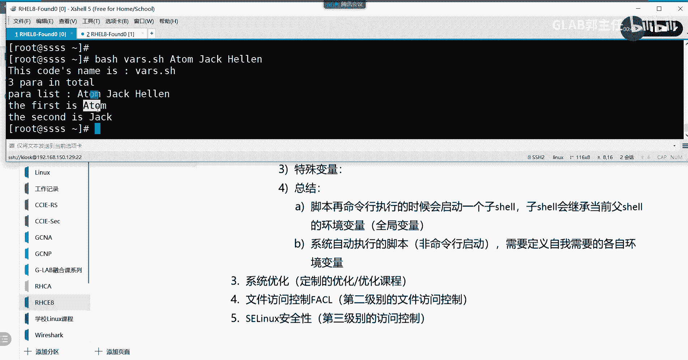

第二列，所以我这边给大家写的这些特殊字符，大家来记啊，一边记一边想。

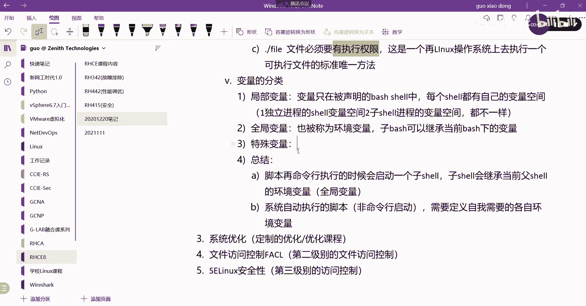

来，我把这个代码再给你看一下。

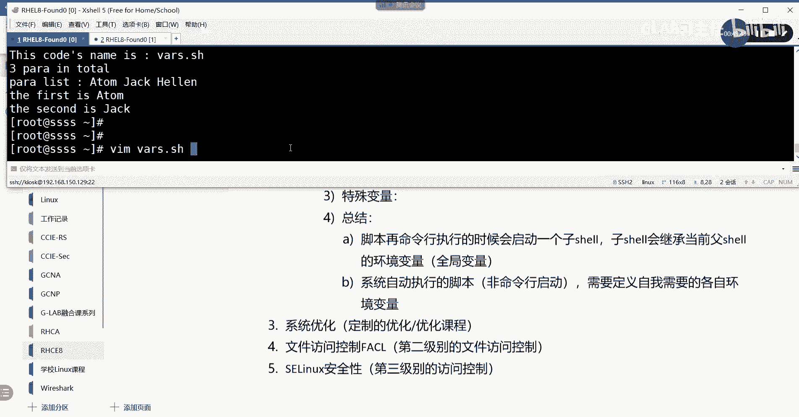

第一个DOTA0，多了零对吧，还有呢多了零代表什么，表示程序自身自己写啊，多了零表示程序自己其实就是程序的名字了，表示程序自身，OK第二个多了井号呢多了井号代表参数的个数，对不对，好。

第三个多了艾特代表的是是列出所有的参数吧，对吧，OK然后后面又多了1dollar，2dollar3，这代表的是位置吧，就是我想引用参数的位置吧，第一个第二个，第三个。

那么我给你列出来这些以dollar结尾的，这些所有的表示方法就叫特殊的变量，后边的dollar1DA二dollar3，有时候我们还把它叫做位置变量，因为它是指特定的位置吧，能听懂我意思吧。

所以这就是你能够看到这些啊，这就属于特殊的变量，不属于第一种，也不属于第二种，那就是特殊变量，各位明白了吗，明白了啊，好了明白了之后，接下来我们就是变量的分类，我们在写脚本的时候。

还是要考虑这些变量的分类，然后呢其实有两大，任何开发语言都都离不开两大东西，一个叫一个叫条件判断，一个叫循环对吧，所有基本类的语言都有条件判断和循环，写在这啊，这个不会详细讲。

一会通过这个实验来理解一下啊，条件判断和循环啊，这个太简单了，在脚本里头的条件判断它叫if then，我把语句给大家写一下啊，它有多条件判断和单分支语句和，多分支语句和双分支语句，大概就这么个意思啊。

叫if对吧，if怎么样怎么样，if怎么样，结束了，这个叫单分支语句，如果if，对eos e else结束，这叫什么双分支语句，对吧，再来if等等，If if else，if对吧，If else if。

然后等等，e r s e else等等，FIFIS循环是那个判断结束的标志啊，FI就是结束了，就就就这这个判断就结束了，所以第一个叫单分支，第二个叫双向分支，第三个叫多分支，理解吧。

中间的L4F你可以写很多个啊，我这边我只写了一个来告诉你了，OK这是条件循环呢，在BS里面循环有三种方法，一种叫for for循环，Python也有吗，for什么在哪个里边。

然后do这样这样这样for循环是用的最多的，还有while对吧，while怎么样啊，while什么true去变量它的布尔表达式，while什么什么是while判断的，要么是有，要么是没有嘛。

for的话其实是一个range里面可以去循环吗，对吧，OK所以这个是while也是可以的，还有最后一个叫呃，叫UNUNITL，UNIUNTILUNTRL这个单词united是吧。

差不多就这也是循环的一种啊，看到不要觉得陌生啊，在在这个是在希尔脚本里面有一个循环啊，它的用法跟while差不多啊，那叫until对，until tk不错啊，好了，来我们来看一下。

我们这个就说到这后边还有很复杂的东西，另外这里头有一个要要说的是，刚刚说到变量是吧，变量的分类里头嗯，然后其实变量的这些分类里头，变量的赋值这种希尔这种弱语言类的，它不需要去声明变量的类型。

因为你没有发现我写变量没有声明变量类型吧，像Python还需要声明变量类型，对不对对吧，字符串啊，什么浮点型啊，整形啊，对不对，像这些东西是要去声声明的，再在其他语言里头。

希尔不需要默认所有的变量类型都是string，都是什么street对吧，string叫什么意思啊，字符串对它默认所有的变量类型都是字符串啊，听明白了，这个注意一下，我就不写了，好其他的就没啥了。

我们来打开我们的教材。

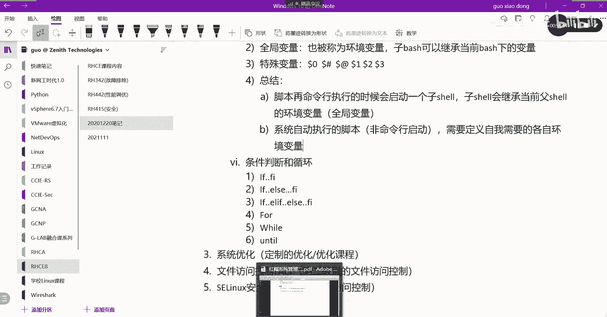

我们用两个练习来看一下，我把教材翻到第五页，对有吗，第五页，这第二本书的第五页好不好，第一个实验非常简单，我带你过一遍，第一个太简单了。

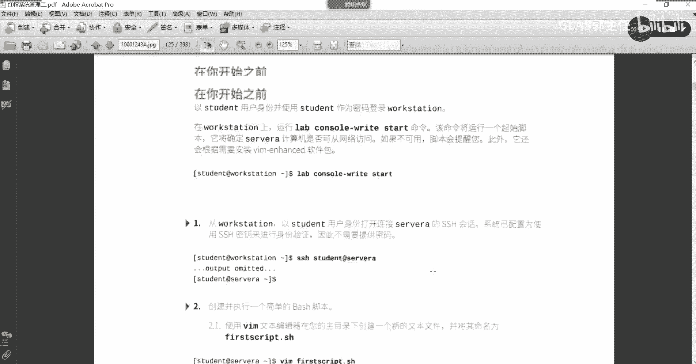

对吧。

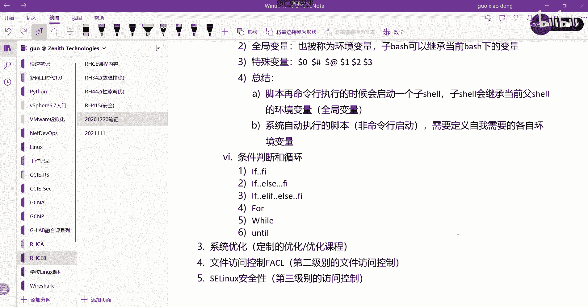

来我们看一眼，第二本书13411345打开的，干嘛那么凶啊，我喊高点他都听不到，好来继续啊，让我们看一下，开了应该都开了，我们通过要到workstation上，SSH到workstation上去啊。

嗯STUDNT搭档，第五页at w o r k s t a t I/O n，到workstation上好，然后呢我们打开这个这个这个实验，这个实验叫，console什么right对吧，Star，优秀。

第二小时诶，这个我好像也开了，我来试一下，看看有没有在student server上SH，sorry有了我们试一下v m first fr，还真没有没有啊，同志来吧，要rhd gclear cost的。

rht clear cos0124清掉，重新设134，RHT杠cat cos rh134了，这俩用的环境不一样，这玩意我就不怎么想演示了。

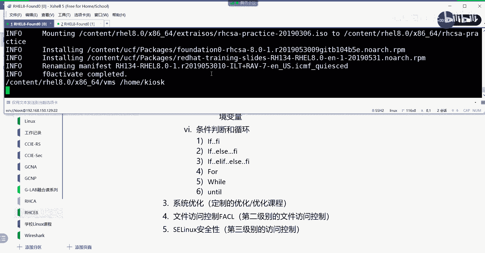

我们来看一遍好不好，就两个需要帮大家来来来。

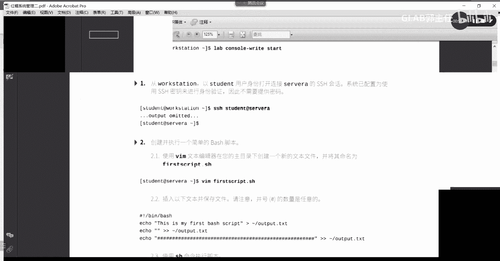

需要帮大家来理解的，就两个东西啊，第一个第一个实验呢就第五页，这个实验就是告诉大家如何去编辑脚本啊，第一个啊打开这个环境之后，编辑它默认帮你写好了一些东西，我们来看这个脚本，第一行是指定解释器。

它没有写任何注释，那么核心就在下边了，对不对，就这了，还是equal this is，什么什么什么什么，把这个东西是什么意思啊，写了一个一串话啊，然后这个是什么符号，从定向吧。

从定向到家目录下的output点TXT这个文件，这个时候他就把这个内容写进去了，写到这个文件里面了，对不对好，然后呢又输入了一个空的东西，这个叫这个叫什么追加吧，它不是覆盖原来的文件内容。

只是在下面往下加，对不对，好，加了一串东西进去了，然后又加了一堆井号，这也是追加加进去了吧，所以其实现在你执行这个脚本之后，其实就冒出一个文件出来，这个文件里面就三行内容，第一行，第二行，第三行。

是不是这个意思啊，好然后他让你在里面写一些东西，你看啊，执行完了之后看一下A有了吧，三行好，接下来他让你在里面写些东西，写哪些东西呢，写这些出题字，就是让你写的一直到这。

那么请告诉我这些内容写写了个什么东西啊，List block device，这也是一行文字啊，也是追加到output txt文件里了，然后呢又追加了一个一行，然后又追加了诶，这个是什么。

L s p o k l sb l k，是不是看我当前所有的存储的硬件。

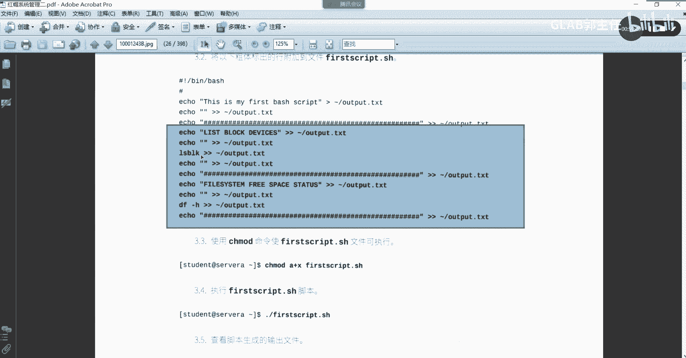

其实你可以，因为这些所有的命令都可以在这打的。

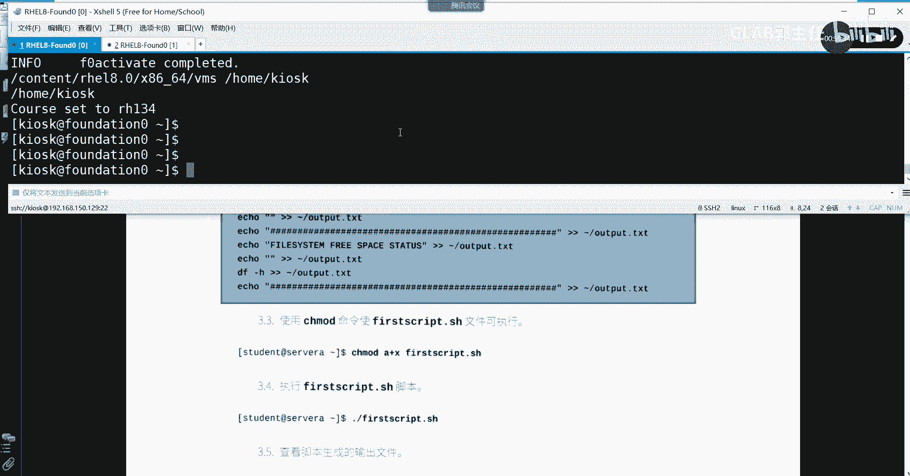

是不是输出一大堆东西出来了，然后这个时候他会帮你把LSBOK，输出的内容也追加到这个文件里面去，然后又加了一行，又加了一堆井号吧，然后又输了，说file system free space，Echo。

输了一行诶，这一句DF会显示我当前DFHFH是吧，又输出这一堆东西了，然后又输出一堆井号，所以啊增加了这一段内容，其实真正的他是在输两个命令，一个L4B2K，一个是DF杠H嘛对吧，写在脚本里。

然后你接下来去执行这个脚本，给它加执行权限，直接去执行这个脚本的时候，脚本里面的内容是不是包含了，我刚刚在脚本里写的这些东西，首先会包含RSB2K的输出和，DF杠H的输出吧，各位能听懂我意思吧。

所以他把一堆命令放在一个文件里，然后把这个文件用去执行，那最后就出结果了，批量执行，这就叫自动化吗，他不会让你一个命令一个命令去做吗，他是一堆命令一起做吗，OK这是第一个非常简单啊，后面就不说了。

cat一下就能看到了，我们看第二个第二个实验是14页，14页要注意一下，因为它涉及到我们for循环，他14页用的是for循环来执行我们的脚本，看他怎么写的，14页，这个也简单啊。

在student server server v，他要我们干嘛呢，要我们去执行这两个server上面的host name，不是用命令用脚本的，用脚本去执行，所以你写了个for循环。

你看看for循环怎么写的，For host in s server b host，这个host大写其实就可以理解为是一个变量嘛，对不对，先把这个host等于server a先把。

然后再把这个host等于server b明白我意思，不然后在下面去调用，用花括号加dollar去调用上面的变量，这个host就是变量吧，啊如果是server a。

那么这个就是去获取server a的house name吧，如果server b那就获取了server b的host name，这个简单吧，很简单明白，for循环的标志就是for在这里面。

然后做下面的循环，做完了以后写个down就结束了吗，听明白了吗，各位这个脚本，你可以把这一堆命令都写在脚本里头，你看他让你写脚本里建一个目录，然后呢，然后在这个目录里头去编辑这个东西。

把刚才这堆东西写进去啊，就把这堆东西写进去，看懂了吗，把这些东西写进去，然后执行这个脚本，执行完了以后，你就能拿到执行的结果，就输出在你的屏幕上。

他获取的是server和server b的什么host name，也很简单明白，这就for循环啊，就这个套路啊，for循环，其他语法特别简单，就这个套路，for什么东西，do这个循环，然后结束。

for的后面跟的是你循环的条件，是不是这个循环条件条件超不过sera server b，然后都是你的循环体，就是你要做的事情，然后最后down就是你结束循环的标志，理解吧，结束循环的标志。

OK就这么简单，所以这个这个是第二个实验也做一下啊，好第三个实验其实不用做，24页，应该是我们刚刚讲正则表达式，正则表达式，大家呃，这个里面的实验的正则表达式内容相对简单。

希望大家把我上午讲正则表达式的内容，多看一遍，多看两遍，把里边的实验要会一定要会用seed，用AWK在我的系统里，获取我的IP地址和Mac地址，这个是最基本的好吧，然后呢。

这个这个开放性实验27页需要大家做的，先大家记好，今天的第一个开放性实验教材上的27页，好吧。

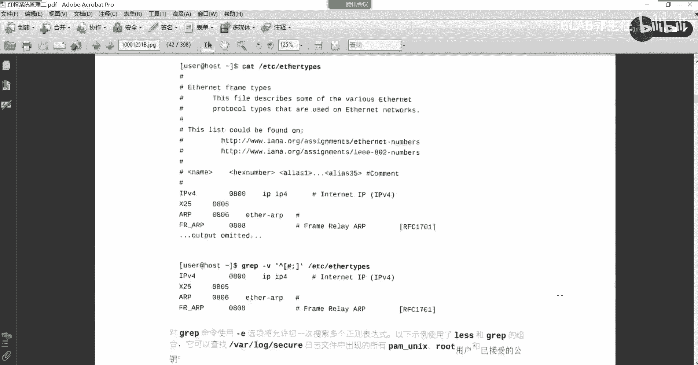

记一下啊。