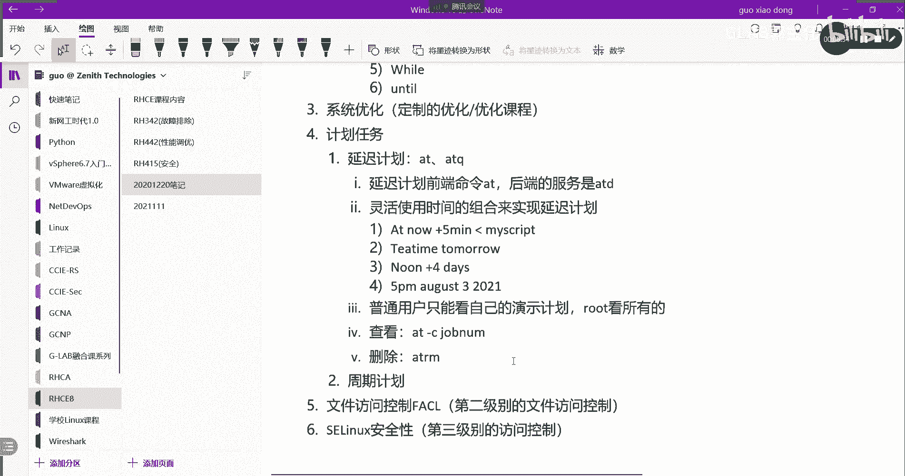
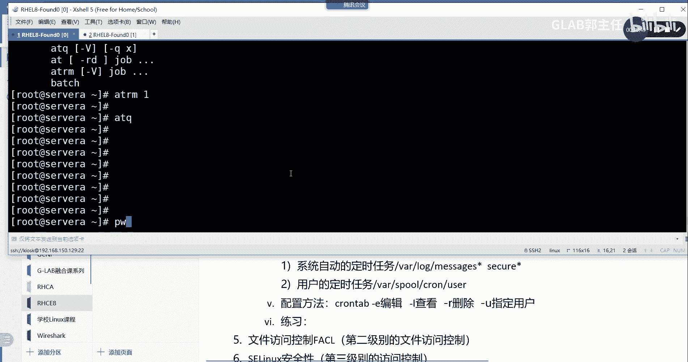
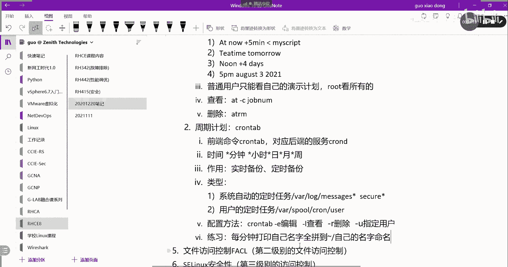
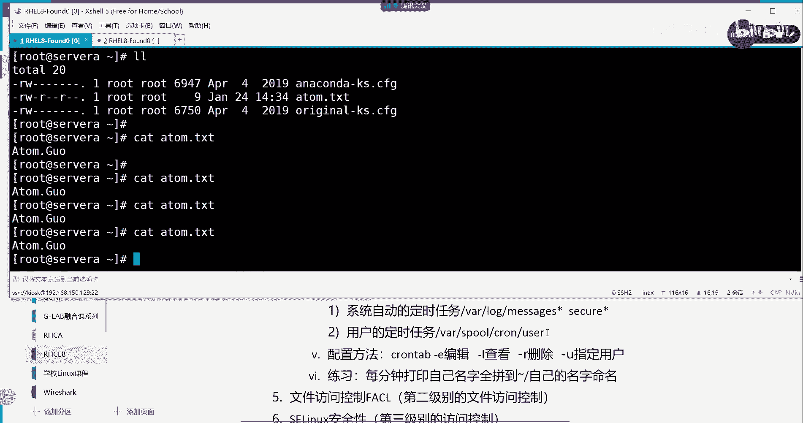

# 【Linux／RHCE／RHCSA】零基础入门Linux／红帽认证！Linux运维工程师的升职加薪宝典！RHCSA+RHCE／24-计划任务 - P1 - GLAB郭主任 - BV1Pe411Q76S

好了，接下来我们来看下面一个内容，系统优化是不是到系统优化了，对了，我没到吧，系统优化吗，好像漏了个东西，计划任务计划任务漏了，算了，先说系统优化吧，计划任务先说计划任务吧，系统计划写在上面啊。

我们先做计划任务好，什么叫计划任务呢，我们在LINUX操作系统当中计划任务，也就是说有计划的去做一些事情，有计划的让操作系统让你帮你去做一些事情，对吧好，这个计划任务分两个，一个叫延迟计划。

一个叫延迟计划，一个周期计划，好看名字就看得出来，延迟计划，就是就是你指定在未来的某一个时间点，要帮你做一件什么事情，这就要把这个工作往后去，设定未来的一个schedule，明白意思吧。

这叫延迟到后面的某一个时间点，来帮我实现一个延迟，用的是at t，用的是at或者ATP，或者叫ATA，叫ATQ啊，叫ATQ好，来我们简单的总结一下它的特点啊，用户可以安排延迟任务啊。

来满足我们运维的需求，延迟任务可以满足我们的需求，那么在系统安装后呢，我们用的延迟任务的前端命令就是这个at，后端的服务叫TD，第一句话是呃，延迟计划，延迟计划前端的命令是at，后端的服务是TD。

我们现在所有的在前端操作的命令，他都其实都有一个统一的名字叫前端命令对吧，前端的命令的名字，不一定等于后端服务的名字吧，同志们不要认同嘛对吧，所以呢我们一般接触的最多的命令就是命令。

那我们也要知道后端对应的服务的名字，大概长什么样子，叫什么好，这是第一句话，第二句话呃，我们可以是选择它的主要的操作，就是我们可以去灵活的去使用它时间的组合，它的核心点就是灵活使用时间的组合。

说你那个第一个下面写的ATT，上面写的ATQ到底是哪个，我写的我写的就是对的，一个是服务，一个是前端的命令，对这两个东西明白，一定要搞清楚，后端的服务是ATD，前端的命令有两个。

一个叫ATATATQ明白，OK上面是命令，下面是服务啊，别搞错了，可以要灵活的使用时间组合，来实现这个复杂的延迟计划，那么我们，那么我们就要来写一下他怎么怎么个复杂法啊，举个例子啊。

我们通过at now加5分钟，这是啥意思啊，艾特小写啊，第一个A小写5分钟以后做点什么事情，得得得得得得做什么事，后面应该跟你的脚本，后边跟脚本应该是这样跟的，要输入从地上。

就是你把你要做的事情写成脚本，然后用输入重定向的方式，让at在这个时间去执行，听明白了吗，OK这标准他是这样做的啊，语法就这么个语法，但是最主要的就是这个时间怎么去定义，不管是延迟计划还是周期计划。

它最核心的就是怎么去定时间，你不能本来说在接下来，就是今天晚上要干的事情，你把它搞成明年的今天晚上对吧，那就尴尬了，明白或者本来今天晚上要做的事情，你搞得今天中午做了，刚好踩线全断了吧，因为你这么一搞。

所以一定要搞清楚时间点，这是at now加5分钟，就是从现在开始，未来5分钟就要开始做这个事情了啊，能理解吗，那再来他还有其他的呢，比如说T台TEATEATTIME。

T i t o m o r r o w，这啥意思啊，记小写啊，T time，下午对，明天的下午茶时间，老外一般下午茶时间什么时候，去差不多是这么个意思，所以所以这个是你只要写t time。

这个不是我随便定义的，就是他艾特后面可以跟着一个规范的时间格式，它就叫t time，就是下午茶时间是吧，下午茶时间三点到四点就可以干这种事情，他就叫ta tomorrow，好，再来一个，这啥意思啊。

啊NN4小写啊，啊诺afternoon，那就下午呗，四天以后的下午啊，哦这个是什么中午是吧，都是中午是吧，afternoon是下午，你们英文太好了，OK好。

再来一个5pm a u a u g u s t，32021，这个已经写的很清楚了，就2021年的august是几月啊，8月大家英文还是不错的，我觉得是是不是可以试着上课，用英文跟你们交流一下看，Yes。

Ok ok yes，OK哈哈哈哈哈，最后最后现场就只有ok yes，No，yeah对，太尴尬了，2021年8月3号的下午五点钟pm，下午五点钟去执行这个事情，这个能理解吧，好的这个没什么问题啊。

好那么这主要是它的时间格式，这些时间格式都非常的灵活，大家可以去用啊，可以这样写，格式都写清楚了，好那么我们来简单的给大家来演示一下这个T。

诶没开是吧，机器开了没有，RHT杠VMCT2s t RT classroom，先把classroom打开，然后再把所有打开，你开等一下啊。

这个没什么复杂的啊，趁着它开机，我们再把其他几个点总结一下啊，非特权用户只能查看自己的，也就是普通用户了，普通用户只能看自己的延时计划，root是可以看所有的延时计划，这个没问题吧，好查看执行的命令。

我们可以通过查看执行的命令用哪个命令，用at gc，然后呢它有一个叫JOB那job吧，杠C1会有一个job number好，然后如何去删除呢，删除用的是叫ATRMRM，大家知道是删除吧。

用它来删除我们的进化任务，OK就这些其他没有来给你演示一下啊，这个太简单了。

还在开机没关系，他在开的话。

那我们就看一下，我们的这个这个这个教材上的实验，这个东西看一眼就会了，我就过得快一点，没什么复杂的，主要还是在后边的延时任务吧，啊对周星任务也是任务。

就这啊嗯，就这啊大家把教材翻到38页，38页看啊，他这个执行很简单，来来就这句话，其他都不要看，就看这句话，第一口，Echo date，从定向到home，Student。

my job点txt at now，3分钟，就是我3分钟之后我就我给你敲一敲这个命令，让你感受一下啊，就在从现在开始，3分钟去执行前面的这个操作吧，OK那么我通过ATQTQ也是一个命令。

是查看我现在有哪些延时的计划，普通用户只能看自己做的延时计划，root用户是可以看所有的延时计划，就用ATQ就能看到诶，我现在有哪些延时计划，正在队列当中，听懂我意思吗，OK然后呢这个是看详细的。

用watch a t q直接看详细的这个这个信息啊，这个一般用的不多，其他的不用去看其他东西，好，Tea time，这是一个标准时间，是吧，t time吧，Ok，t time是四点钟啊，这边有写四点钟。

他不是一个范围，四点钟，我刚刚说的三点到四点是吧，四点TTM是四点啊，四点就是一个确切的时间点，四点钟去执行这个操作，其他的那你也可以写，直接写具体的时间就可以了，ATQ去看这些所有的东西。

然后AT杠C杠C杠就讲过了，就查看执行命令，AT杠C后面加你的drop，drop在哪里看到的，在上面看到的，ATQ看到前面的这个就叫drop，理解吗，然后将那个number能够看到他详细信息嗯。

其他的就没了，就这么多就这么多。

好好好，然后ATQ没东西是吧，S o s t m c t u s t a t u s，我们看一下ATD是不是这个服务默认running a，这是个服务啊，这是个服务，然后我们现在来做个事情对吧。

我们来做个事情，就是呃我们可以ECHO给他一个DATE，去date一下对吧，DT的结果我给他送到哪里哪里哪里，随便给他个什么东西吧，无所谓了，就这样吧，好不好，输入一个东西。

然后送到at在现在开始加3分钟去执行，然后ATQ看一下是不是有啊啊就这么个意思，他说的就这么个意思，3分钟之后他会给你把这东西打印在屏幕上，明白啊，然后呢我想看他的信息，那就可以通过T杠C加上drop。

Drop，是不是能看到他的详细的东西，在这就这个东西不出来了吗，就明白，然后我想把它取消掉，ATRMATRM哎不对不对不对是吧，删除叫ATRM1，然后再通过ATQ看一下，没了吧。

你能听懂，这个没什么好讲的，就这么简单，大家把这个题，把这个题照着这个题本录一遍就好了啊，没有什么其他复杂的东西，这个不是最重要的。

那我们来看重要的一点的东西叫周期计划，周期计划这个比较用的比较多啊，看名字就知道了，周期计划应该是周期性的帮你去干一件事情，对周期性的帮我们去干事情，好嗯，这个叫周期计划，也叫周期任务。

他一般帮我们解决什么问题呢，就比如说我们一般的系统系统，他要去检测到我们很多重要的文件需要去备份，那大部分备份情况下会发生在夜里，那么我们会指定每个月什么时间，去把所有的东西集中备份一下。

这是不是周期性要去做的事情对吧，OK它的单词的命令，它它的关键字叫crown，叫crown啊，这是命令啊，这是命令c r o n t a b chrome，这个是服务，不好意思。

C r o n t a b，这个是前端的命令，好来看啊，前端的命令用的是c r o n t a b crown table，然后对应的后端的服务，是CROND自他的服务了，好一般情况下这属于守护进程。

也就是只要系统装完这个服务就已经启动了啊，默认是自带的，跟刚才那个差不多，所以就不写了，好检测的检测，执行任务的频率是每分钟要精确到秒，需要用脚本来执行，我们来给大家看一下。

它的时间是怎么去自定义它的这个周期性的，它总共有五个值，也就是它有五个信号，12345，我写了五个星号啊，第一个星号代表的是分钟，第二个星号代表的是小时，第三个星号代表的是日，第四个星号代表的是月。

第五个星号代表的是周不一样啊，很多人认为说第五个是不是年年月日小时分钟，不是的，不是这样子的理解，它总共有五个信号来执行我们的操作，这个先记下这五个信号，分别代表不一样位置的时间周期，第一个是每分钟。

第二个是小时日月周，好定时任务一般用来做什么实时备份啊，备份用的会比较多，好定时备份，这都是它的作用，常见的作用，OK好，然后呢分为两种类型，这种定时任务分为两种类型，这两种类型第一种类型是系统自动的。

系统也有自动的，为什么系统刚装完开机之后，它就自带了这个守护进程，是因为系统周期性的也要去做一些事情嘛，还记得我之前给大家讲那个查看日志的时候，有收到过type目录，过段时间就把文件都清理掉了。

他是怎么做的，就是用的这个服务啊，它系统默认装完机之后，有一套自己的自动化执行的一些脚本，这个系统脚本不用你关心系统自带的，像定期清理探测目录，就是他干的，理解我意思吗，就是他干的好。

第一种叫系统自带的，系统自动的定时任务，OK这种任务一般放在哪里呢，大家可以去观察一下，在我把目录写给大家，是在V上面，VLOG下面message a g e s啊，这个不光不仅仅是这个在这里。

还有在哪里，在库里面SECUSECURER型号，就这两个文件里头，他把这种自动化系统自动任务脚本写在这，OK这个东西你不要管，也不要删，也不要去调整好吧，只是做个了解，然后呢这是第一种，第二种是用户的。

用户的定时任务，用户的定时任务放在哪呢，用户的定时任务放在哪呢，好用户的定时任务放在另外一个地方叫while，下面的SPOOL上面的CRON下面的user，这个user就是你的用户吧。

比如说我是普通用户，那我放进来放在了，就是这个atom或者G200一个普通用户，这个user就代表是tom或者G210，理解吗，如果是root用户，那这个user就代表是root，那不一样吧。

不同的用户有自己不一样的定时任务，听明白我意思吗，OK好接下来配置方法，配置方法很简单，我们不需要去编辑这个文件，它前端有一个统一的配置方法啊，我现在写的是前端统一的配置方法啊。

叫c r n t a b crown table，这是我们考试当中的一题，有一题就要考定时任务，在GL里面通过它去编辑一下哦，这是查看，不好意思，杠一，chrome table杠一就可以去做了。

去做这个事情了，当然你也可以去编辑文件啊，你也可以去编辑它对应的文件啊，编辑它对应的文件，这个就是我们的配置方法，杠E是直接去编辑，那还有呢后边还有一些杠L大小写的L了，else list的意思。

所以这个是查看对不对，还有一个就是查看我给你写出来吧，查看，编辑还有一个杠R什么意思啊，猜得出来吧，删除对不对，还有一个杠U指定用户，就我可以指定特定的用户，哪个用户具有这个定时任务。

也只有管理员可以指定特定特定的用户吧，嗯所以我可以通过杠U去指定啊，好没问题吧，没问题啊，好这个这是配置方法，那接下来我们就要通过练习来给大家练一下了，来我们练一下啊，我们来练习，第一个练习。

要求大家听清楚我的要求啊，第一个练习，第一个类型我们先把这个几个特殊的字符啊，就是下面这个星号。

我们先写一个简单的，让大家来感受一下啊，先写一个简单的，我要求现在root用户啊，我现在也要求root用户在在这个每分钟等会儿啊，是每分钟打印一次，自己的名字全拼到哪里。

到这个server log下面去，自己的名字命名的文件夹，我就不到这里了，我就到当前目录PWD。

我就到这儿听听我的要求啊，我需要实现每分钟打印，自己的名字全拼，对吧，到哪里到家目录下面去，然后以自己的名字命名，听清楚了这个要求了吗。

OK好怎么写，是不是用chrome cr n tab叫chrome table gue，是不是直接去写了，好在这里直接写这个写怎么写的，它的格式是这样的，这个编辑就是VIM的编辑器啊。

前面五个星号12345，你中间可以多干，多按一格都空一格没问题，前面就指定时间，然后后边啊空一格指定你要做的事情，先不管前面的时间是什么周期，这个周期是什么，你先告诉我。

要实现每分钟打印自己的名字的全拼，怎么实现，打印自己的名字，全拼到一个文件，这还不简单吗，伙计们，echo是不是是不是echo，我的名字全名是atom点锅啊，对不对，然后把它送到哪去。

每分钟打印不是覆盖，就是一分钟往里加，一分钟往里加，应该是追加，对不对，追加到哪里，当前目录就是当前就是加目录嘛，对不对，这个要写清楚啊，是root啊，这要写这个要写绝对路径，你写相对路径他不认识啊。

而且绝对路径是根目录下的，root家目录下的，取一个文件名字叫用自己的名字，tom点TXT是这样写吧，后边是实现了我的最终的要求，那你会发现后边写的这些脚本脚本语言。

跟我们在命令行里实现的是不是一模一样的，明白你把你可以完全当一个shell脚本来写，也可以当这个所有命令行的组合也可以都可以，OK好，接下来到重点了，周期计划每分钟打印怎么实现，第一颗星代表的是分钟。

第二个是第二个是小时，第三个日月周好，每分都是现在怎么做，每分钟时间怎么做，好了，我们说个简单的，每5分钟只是实现怎么做，我们不说每分钟每5分钟好，再来个最简单的，我就说在在在下午的每天的下午的02：

50分，每天下午02：50分，第一个是一分钟，对不对，这肯定写50嘛，对不对，好两点下午02：50应该是24小时制的话，那是多少，下午14：50是这样写的好，然后是每天呢第三个信号是不是天嘛。

这个每天咋写啊，每天就是心心就是每天理解吗，所以你就这样写，就代表的是每天下午的02：50分，做什么做什么做什么，听得懂吗，OK那理解了心就是每天，那么请告诉我每分钟是什么，怎么怎么做。

每分钟跟星游跟这个天有关系吗，跟十小时有关系吗，没有小时没关系，跟天没关系，月没关系，周没关系，跟第一个有关系，每分钟是不是就这样写就对了，这就是每分钟听明白吗，每5分钟呢没有符号，把字写成五是吗啊。

把这写成五，星加五新加5+5是什么鬼，加五不对，斜杠对，先斜杠五，这就代表的是每5分钟，每5分钟明白这叫没有5分钟啊，好现在我们要做的是每分钟，我们不用把这个先去掉，没关系啊，后边有很长的很多的例子。

都是来讨论这时间怎么写，其实周期任务最大的难点，不是后边的人功能怎么实现，而是前面的时间该怎么表达，来我把它保存一下啊，OK了对吧，来我们看现在还没有出现吧，一会儿他会在每分钟直线实现一次的时候。

他会在这里生成一个文件，新的文件叫tom点TXT，然后每每分钟往里写东西，每分钟往里写东西，现在还没出来呢，别着急，等一下稍微等一下好吧，稍微等一下，等我这边打零点5分30秒，只能是整数，没有小数啊。

刚刚有刚刚有提到过，说想要精确到秒，要用脚本来实现，不能用这个crown里边的功能栏，它精确到它最小，精确到就是每一分钟他没有秒哎，出来了，看到没，T o m t s d，这不是我生成的。

它自动生成了我的名字，然后他们不停的在里面追加，不停的在里面追加理解吗，这就是这个row table的简单的一个操作，我们先放这好。

这个第一个练习是最简单了，打完后边把要实现的东西写上去就可以了，好我们来做几个时间上的练习，第一个大家看到我来写，请告诉我它是什么意思啊，30空格要看清楚啊，30空格，三逗号，12空格，星空格，星空格。

新，请告诉我这是什么意思，这什么意思啊，你说的没错嗯，嗯每天的拍卖饭多吃点好，每天的每天的12。30对吧，货还是和和不是货啊，每天的12。30和3。30去做什么事情，理解吗，这不是或者的关系啊。

这是和O这个简单吧，说明你如果说时间是间断的对吧，你要去的话，那你就用逗号隔开，逗号隔开好，再来一个30空格，看清楚怎么写啊，新号斜杠六空格空格，这什么意思，一个小时一点问题。

然后就是嗯不知道美丽会等着什么人，是吧，想清楚你想象一下，刚刚说的没错，差不多就这个意思叫不是不是每六个半小时啊，是不是又断了吗，我的天怎么继续录啊，这刚刚说的没错，是每每六个小时的半点。

半点就是30分，不就是半点吗，每六个小时的这个半点，六，隔六个小时半点，这个30分，隔六个小时的半点，我就要做这件事情是吧，隔六个小时，30分左右，30分的半年就做这件事情，这样理解理解。

是不是隔六个半小时啊，每六个小时的半点和隔六个半小时一样吗，每六个小时的半点不是六个半，哎呀反正那个时10分钟都只在30上面吗，他就是那个小时不一样吗，小时就每隔六个小时转一次嘛，每隔六小时转一次啊。

他这个好像是在一个固定时间的，那个半点来执行，对是的，不一样，不一定是六个半小时，不一定是六个半小时啊，仔细想想，比如说你一点开始执行的对不对，那就对，下一次不是我说我说跑脚本吗，我一点钟开始跑脚本。

对不对，那我肯定下个垂，那是07：30的时候，这个开始执行没问题，这个，好的没毛病，别急啊，再接着往下看，看看，能不能再深刻的理解一下我们的整个过程啊，30还是30，八杠18逗号不是逗号，斜杠二。

这什么意思啊，18。88。12个小时，这个能理解八点到18点，每两个小或者是每两个半小时是吧，八点到18点，八点到18点，八点钟到18点嗯，每两个小时的半点，怎么去理解这个每两个小时的半点。

那所以请告诉我，第一个就第一个匹配的这个应该是几点，08：30，08：30，八个人应该是10：30是吧，10：30十点半嗯，10：30，然后下一个就是12点，12：30对吧，12：30对吧。

然后接下来就是02：30，对不对不对，08：30了，10：30，第一个是10：30，对不对，12：30再加两个半小时，就是3。13，也不是一家人，他那个你那个30代表的是我那个追加的30。

并不是说我那是到了30岁才开始执行的嘛，8~18对吧，每隔两个小时不就写着固定的时间，应该不是那个30是固定的时间，还能加多少，如果你加吧，因为之前不是说不说3分钟之后，然后直接加画一下。

画一下那八九十十一十二，然后到十十三十四十五十六十七十八好，然后呢，现在我们写的是，我们的理解是每两个小时的半点对吧，如果是八点钟的话，他写的就是八点到18点，八点到18点，斜杠二就是每两个小时。

每两个小时的这个30分钟左右，30分钟，然后去执行这个动作，那么第一次执行应该是8。8点，第一次执行应该是几点，08：30，为什么是08：30半小时，主要是八点到9。1个小时，九点到10。1个小时。

应该是10：30吧，八点88年的32个小时干什么，08：30不对，不能算啊，为什么要算08：30呢，这个是八点到18点的，每两个小时，他的老师，那你举个例子吧，就比如说你前面第一个信号。

但是后面全是星号，那这个时间的话是就每半个小时就半个小时，加半个加半个小时，不也就比如说我是一点钟，他就下面是01：30，然后是两点02：30三点，他说每半个小时加一啊，这并不是说我是每次都是半01：

30，02：30，03：30，04：30哦，不是不是不是不是不是这样理解不理解，第一个，第一个如果是30的话，那就是半点，就是每每个每半个小时，就30分钟的时候去执行哦，并不是说我都是对，不是家。

不是家，就是30分钟去执行，30分钟执行，对他只在30分钟的时候开始执行，3分钟之后执行，不就是之前打了个三算吗，哪里之前打了个三，你之前不是举个例子吗，你不是阿tom多吗，三个位，没有任何东西。

刚才我讲的是每5分钟，是在是在第一个星号后面加一个五，不一样啊，对我写两种写法，一种是信号不变，后面加个，我这是每5分钟啊，然后不加不加斜杠，没有信号，直接写30，这就是几点的30分钟，30分对吧。

如果没有写几点，那就是每小时30分，对你说就每小时30分能理解吗，如果后面四个星，后面四个四星，前面一个30，这就是每小时30分，或者换句话叫每小时的半点，是不是半点嘛，他不是30一个小时。

一个半小时两点，不是那样子对吧，然后这个是每5分钟干一些事情，这个是就是半点，这个说的就是半点好，然后呢再看上面，这就这就这就可以理解了，我们刚才写的那个是是是这样写的，没有什么斜杠，就直接是半点嘛。

直接是半点，直接一半，那就很简单，不是08：30，到8~18，他有一个斜杠二啊，如果如果把这个换成如果把这个换成星号，那就是每个小时的半点，但它不是星号，他写的是八点到18点，每隔两个小时的半点。

八点到18点，每隔两个小时的班，半点半几点，从八点开始到八点到八点，08：30，七点要不要三八，点半，然后再隔两个小时10：30对吧，再隔两小时10：30嗯，然后呢再隔两个小时就到12：30。

这样子的是吧，我是叫你酒后是嗯嗯这个好像也有道理，08：30应该也算在里面对吧，八点开始，八点08：30开，嗯没错，是这么理解的，08：30这个很难去，这个从08：30开始啊，我觉得应该也是8。

30开始，然后每隔两个小时的半点，每隔两个小时的半点，对的啊，应该是08：30要算的，从08：30开始啊，然后接下来就每隔两个小时的半点，没问题，这个应该是应该是这样算的啊，好再来一个再来一个再来一个。

来来一个复杂一点的零零新号，1123，每一个小时的静静，零零星号星号星号星号上面和下面有区别吗，你钥匙钥匙找，这俩一样啊，这俩是一样的，就写下来，然后星号星号星号星号质量是一样的，就是每个小时整点是吧。

嗯嗯这就是这个要注意的，再来一个吧，我们再来一个就差不多了，我们再来一个零零十一新号41~3，这个复杂了，是不是这五个数当中啊，只有中间一个没有指定是吧，那怎么去表述这个事情呢。

请告诉我这个事情怎么表述，后面1~3是啥意思啊，1~31到三周，1~3周，最后又是周是吧，他说的应该是周几，不是1~3，周一周一到周三，周一到周一到周三是吗，对吧，对不对啊，一日不零四，周零四，周日对。

一到周三就周一到周三，OK你怎么描述啊，什么4月份4月4月所有怎么去，这个字代表的是什么，4月是每年的4月份吧，但问他您是不是星号啊，诶您是您在哪没有啊，哦没有，您没有，您那那个是分钟。

这个是小时余日月是吧，那对了没有，年不需要连，那就是每年的4月份嘛，每年的4月份的周一到周三，31等于十十一点去做这个事情，4月份的周一到周三，是这意思吧，是的是的，就每年的我给你写啊，每年的4月份啊。

每年的4月份的四，就整个4月份的整个4月份周一，周三的11点整干这种事情，明白吗，就这个事情啊，好那我们自己来做一个练习，这个就是我给你写完，你自己去理解，我现在去理解一下啊，我们写一个。

大家帮我写一个，每天早每天每周6日上午的九点钟，大家来G2本上课，嗯算了十点每周六每周末吧，周末是不是两天啊，我们就写周末吧，哎算了就写周日吧，我们是周日上课是吧，每周日上午的09：30分来去那边上课。

嗯是多少钱啊，就不要去限制几月份啊，什么哪一天啊，我就说每周每周的周日来这边上课，早起啊，嗯前面好写30空格九嗯，然后呢星号星号零是不是这个意思啊，对每周日啊，每周日，这就是每周日的09：

30分来这边上课，明白嗯好，然后再来一个最后一个了，最后一个呃我们要求呃，我要求在3月9号的早上九点钟来这边打王者，3月9号早上，3月9号早上九点钟，那就是零零空格九是吧，九点钟吧，3月9号嗯，九是吧。

3月13星星是吧，就这看这么看，就这么单纯的看，应该说的是每年的3月9号，是不是他没有年的概念，那你要这样写的话，今年这么干了，明年这个时间还这么干，它是一个周期性的嘛，因为你写这个时间它是带周期的啊。

周期性的啊，在做这件事情，重复做一件事情理解吗，对好的，这个明白了，大家自己去写，没了好，就这么多，来，我们再看看有没有需要，需要说的啊，好最后一个真的最后一个了，我来看看啊。

好最后倒数第二个还有两个还是来写啊，帮我实现周六，周六和周日帮我实现，周六和周日上午，九点钟和下午14点，执行备份，后边执行备份，不用你写，我们就把时间写出来，周六和周日上午九点和下午14点。

去执行这个备份任务，没问题，09：30，那就肯定是整点了吧，对不对，好，9。09，逗号14，对不对，新号新号，周六和周日嘛，那就是嗯六和零，对不对，就这样写，没问题吧，啊这就是我们这是倒数第二个。

还有一个还有一个我看看，还有一个是每隔两个小时，每隔两个小时，将系统的etc下的什么东西打包到下面去，每隔两小时做一些什么什么什么事情，这咋写，每隔两小时就去，别的情况干嘛呢，新号诶不对，这怎么写啊。

对应该是零零星号杠二对吧，然后一个两个三个是这样写的，这个和我们接下来要讲的这个星号星号杠二，星号星号星号一样吗，这一样吗，第一个第二个明显不一样嘛，这肯定不一样，对不对，第一个是每隔两个小时的整点。

第二个是每隔两个小时，从现在开始是吧，你现在比如说是二十五十五分，每隔两个小时，也就到下个两个小时的55分，干这种事情，有一个是整点干，一个是两个小时，整干就算两个小时，从现在开始参照物。

以现在的时间为参考点，往后跑两个小时，要干这种事情，他没说啊啊对我刚刚说的是每隔两小时，也没有说每隔两小时整点还是每隔什么是吧，所以大家自己区别一下，这是有区别的好吧，我这个不等号啊。

这个是不等于不等啊，不等嗯，用波浪线，好的就这样好吧，大家看一下，应该应该这个时间应该都搞清楚了，那么剩下的东西，其实就是我们去怎么去实现的问题了对吧，怎么去实现时间搞定就行了。

好那么这就是我们的计划任务，计划任务这块我们最后再嗯最后再看啊，我们来看看大家把那个第几页，它还有一个东西，就是通过计划任务去管理临时文件，这个其他系统都会去帮你去做，大家只要把那个教材上的。

要有一个文件去改一下就行了，我们说pip目录是过段时间它自动清理嘛，对不对，我们在练习的开放性实验里头，有一个让大家去修改，修改这个策略，就是太白目录默认是多长时间去清理啊，默认大概是没记错。

应该是多少，一个月还是多少，然后你在练习的时候，他让你改成一个短一点的周期，就可以去修改它系统默认周期，计划任务的这种策略文件，好吧，这个我就不去说了啊，这个没什么，最后把开放性实验P57页做一下。

57，我要求我的要求，只是让大家去做所有的开放性的实验，因为开放性实验是一个综合的，他把前面的内容全部综合在一个实验当中，需要人来做的，这是第二个实验。

