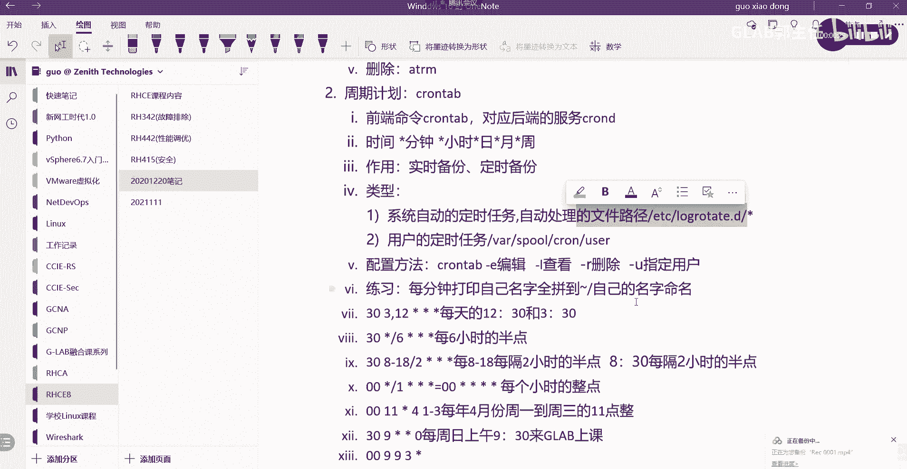
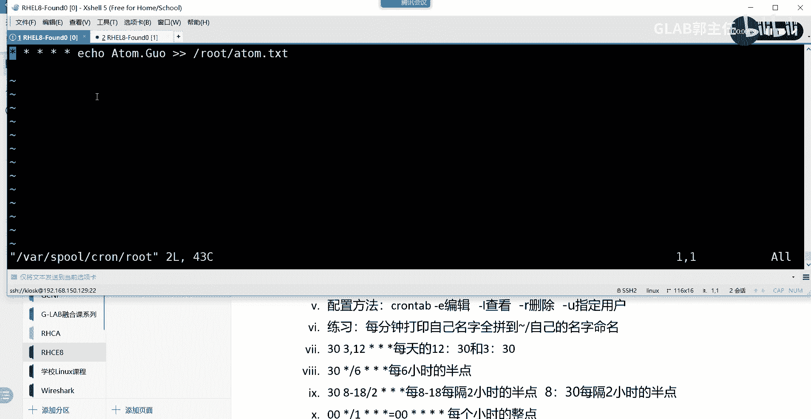
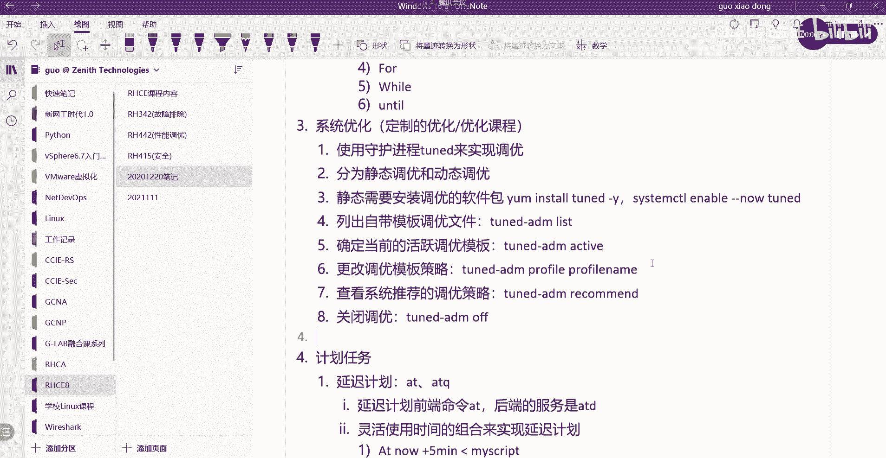
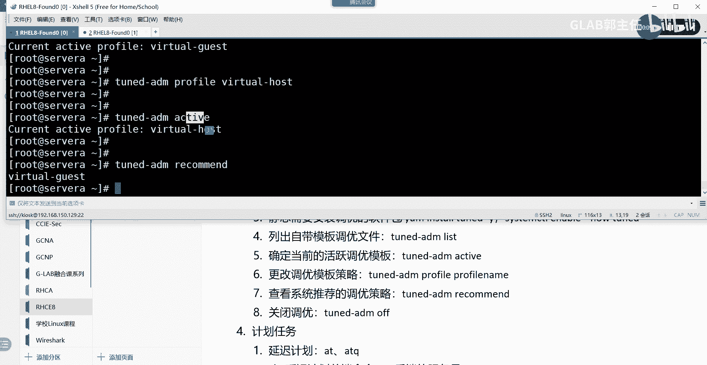
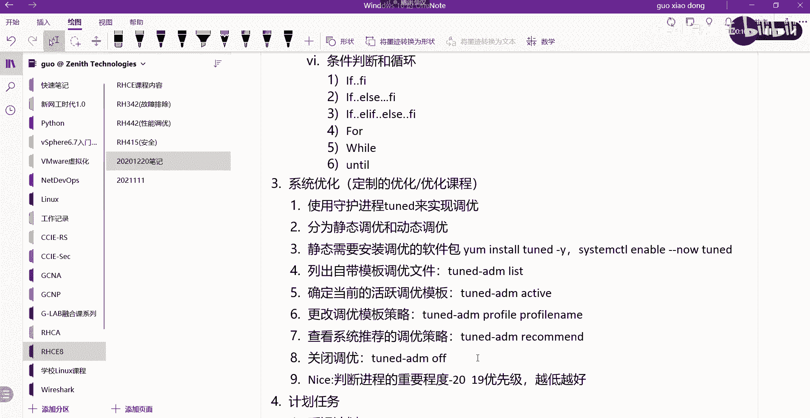
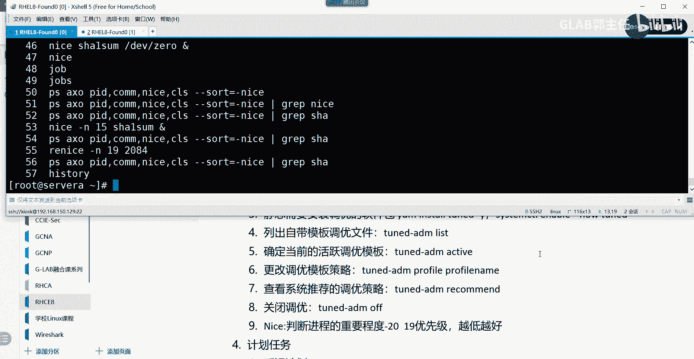

# 【Linux／RHCE／RHCSA】零基础入门Linux／红帽认证！Linux运维工程师的升职加薪宝典！RHCSA+RHCE／25-系统调优 - P1 - GLAB郭主任 - BV1na4y1S7cZ

OK刚才有一个小的更新，是在我们写定定时系统自动任务啊，周期性任务的时候，系统自己的定时任务，他会把所有的系统的这个定时任务的文件，处理的文件路径是这个，不是我们刚才写的message和screw。

就是它自动处理的时候，会当成日志会记录在我刚刚写的那个目录里面，那个目录叫log message和log里面，好吧，就这个啊，这系统自动的大家也不用太关心。

没关系，主要关心我们自己的，然后刚刚有提到说我们的自动化任务，自动任务的呃，操作它重启之后还会还会存在的，因为它的所有的用户的周期性的任务，他都放在VR上面的，叫什么玩意来着叫呃。

放在war上面的s p o sport上面的chrome上面的，加你的用户吗，都在这，它不会消失的对吧，这里可以加很多个定时任务啊。

好那么接下来我们来看，接下来来看优化，优化比较简单啊，因为我们现在接触的优化太简单了，我们主要接触的就是定制化的优化，就是系统会给你自带的这个优化，这叫定制化的，到了后面会做内核优化，到后面再讲吧。

好吧，现在给大家看到的都是定制化的优化啊，来系统调优啊，很简单的把概念理一下嗯，就不分了，就这里头很简单，我估摸着一会儿就跟大家说完，因为太简单了，考题有一题就考这个有一题非常简单，送分的。

就这个考的系统优化，好吧好，首先说系统定制的定制的优化，它有一个服务，也就相当于一个软件吧对吧，这个服务叫使用，它是一个守护进程，守护进程TUNED对吧，来进行来实现定制化的优化，或者叫来实现呃调优。

这个叫调优啊，白实线调优用它来调优，然后呢我刚刚讲的是定制化调优，又可以把它理解为是一种静态调优，分为啊分为静态调优和动态调优，静态调优动态，静态调就是我们讲的直接用他的模板就可以了，还有一种叫动态调。

动态调就是我们后面讲的配置，对吧，动态调优就是监控系统的活动状态，然后来根据它运行的产生的一些结果，来动态的去调整它的变化，静态的就直接套用他的模板就可以了，明白好，那么我们主要讲的是静态。

静态调优的话，需要安装刚才讲的这个这个这个手动安装，调优的软件包啊，静态需要安装对吧，调优的软件包，调优的软件包，这个怎么去安装，这个还用我讲吗，不用我讲吧对吧，默认他就是一个其实系统装完。

你已经有了这个调优的软件包了，如果没有的话，你可以通过ym install去装一下这个，TUNED去装，这个明白吗，装一下这个TNED啊，TUNED去装一下这个软件包，杠Y这就是安装好。

装完了以后还有一个东西要做，要做成什么system，这个前面都讲过system，大家看啊，ENABLEDENZO杠杠，听到TUNED这什么设置，它的开机自动启动吧，要做这句话。

然后接下来有几个重要的命令，列出所有可能调优的配置文件，列出自带的模板调优文件，可以用这个命令叫TUNEDAMDLST，这个是列出来，OK好，第二个，确定当前的活跃的调优文件或者叫调优模板。

就当前正在用哪一种调优策略吧，我们怎么看TONEDANDAC，t i v e active好，这第二句话，第三句话，更改调优策略嗯，更改调优的模板策略，这是第三句话，OK怎么打呢。

TUNED杠AAMD空格，Profile，P r o f i l e profile，然后就是你的p r o f l profile name，为什么要list出来，因为它默认自带的模板的名字。

你可能不知道啊，对不对，然后你要列出来，列出来之后，看看当前是不是考试要求你改的模板，模板的策略，不是的话，那你就把它改成你的这个模板策略就可以了，明白吗，好还有最后一个叫查看啊，系统会给你推荐。

查看系统推荐的调优策略，系统会给你推荐怎么看系统给我推荐的呢，也是通过TUNEDMDADM是吧，杠ADM叫RECO推荐叫什么说的，record recommend是吧，MND是这个意思吧。

MEND这个查看这个推荐的明白吗，好最后关闭调优，就是到了后面我们要动态调优了，我们把它静态调要去掉，关闭调优，通过t u n e d AMD AD f s AMD，无所谓了，dm me好像是报复关掉。

好了就这么多，调优就这么多，那我给你演示一下这几句话。

大家大家记住就可以了，安装啊启动，大家不用管了，因为这个服务应该已经开启了，来我们先看这个服务启动了没有，我们通过，system t2studies叫什么TUNED是吧，是不是running好。

running了以后就不用装了，不用装，那我们先把它调用的模板出来，叫ADM对吧，DM然后呢list看一下，这里头大家能看到的所有的模板，就这些都是它自带的。

比如说balance他会帮你用balance的模板的话，主要就是一些general的一些东西的做balance，然后如果你这个主要是针对desktop，那你就用desktop模板。

如果你对网络啊比较敏感，那你就用它自带的network的模板，明白我意思吗，如果你是虚拟机啊，它会让你用virtual guest或者virtual host啊，一个是基于KVM的啊。

一个是基于这个什么什么什么都一样，明白我意思吗，好那么这个是列出来他有哪些模板，你可以用，那我想看他给我推荐哪个TNEDADM，Recommend，他会推荐我用virtual guest吧，明白吗好。

那我想看当前我用的是什么样的策略模板，Active，看一下好，我当前其实就是用的WATCHGUEST吧，明白我意思吗，好如果考试它让你改成virtual host，那你就该用第三句话了。

是不是TONED看adm profile profile，然后用watch host看到了就改完了，改完了以后再看一下，是不是明白他给你recommend，recommend是没有变的。

他应该还是理解意思吧，所以所以考试就三句话，这题是送分题啊，他会告诉你把整个系统的测呃，这个调优改成什么什么什么什么什么，改成他建议的，或者他就告诉你改成系统建议的调优的策略啊。

所以你要用recommend先看一下，对不对，然后用prefer改过来，然后再看一下，然后再去看一下是active，再看一下不就结束了吗，理解吧好所以这个没什么好讲的。

就这么点东西啊，这个都是模板往里套的，没什么，然后最后再给大家补充一个叫nice，补充一个命令，nice这个命令是用来判断进程的重要程度，判断，判断进程的重要程度啊，判断进程的重要程度。

我们可以通过nice来看，然后它的优先级是从-20~19，书上有啊，这个是补充内容，-20~19的优先级，优先级是越低越好，越低越好啊，越优先级越低值越低啊，他这个这个越高好吧好，那我们可以通过呃。

可以通过我们来举个简单的例子吧。

好不好，我用这个来指定一下例子，简单的例子，我们可以通过PS去看它默认的优先级，叫AXO对吧，然后显示它的pd逗号c o m m command，然后还要显示它的nice嗯，C l s。

然后呢杠杠SORTS等于杠NC e nice好，这面大家可以看一下啊，简单看一下，这个是按照我的需求去显示啊，显示现在的进程进程里头，我关心的几个点就pad，我只想看pd看现在进程的命令对不对。

然后看nice看这是nice啊，NI就是NCOSCOS不管，然后统计一下，你会发现这些我们现在要关心的，就这个就这一列，这一列就是每一个进程它都有自己的优先级，我们在运维的时候。

可以指定哪些进程的优先级会更高，不指定的话，系统会给他一个默认值理解吗，由系统有一套判断进程优先级的标准，那么管理员可以通过nice，去改变它的优先级的标准，听懂我意思吗，好比如说我现在要改了。

我现在通过nice去指定某一个进程的值，比如说s h a e summer，这是一个SHAE的一个进程，我们把它放到DEV向的zero上面去，然后给他放到后台去进，换到后台运行，是不是用这个前面讲过吧。

好这个时候他会放在后台运行，那么放在后台运行的时候，那么我们可以去看一下，诶这个在他已经在后台后台运行了，怎么去看后台运行的这个这个这个这个叫什么，看后台的那个，叫什么来着，还记得吗，嗯电视框架啊。

电视放最，这不是把后台运行的叫DP吧，对吧，是不是JOJS看到后台运行的这个嘛，对不对，明白我意思吧，好那么现在我想改它的它的这个默认的值，那个nice值是多少，再看一眼，能看到吗，过滤一下。

叫什么SHA有了多少十，对不对，它的默认值是十啊，刚才已经看到了，那么我现在能不能把它改成15，可以改，我们可以通过nice去改杠，去改它的值15，然后s h e summer，然后放到后台去运行。

对吧好，直接改过了，改了之后我们再去看看CHA，这个不是改的，这个新增了，应该是吧，nice杠25，先指定了一个，他就运行了15吗，明白意思不好，然后更改现有的进程是怎么改的，它叫RENICE，对吧。

改成19改成19，然后给他PID，我们把那个改成19，我们把第一个原来改成2048，2084，是不是有新的优先级了，19了吧，明白意思吧，所以在这里的几个命令都比较简单，我给你列出来，就这几个吧。

这个是改对吧，这个是重新新建了一个，对吧，杠N就直接指定明白吧，如果不加杠杆，定有先进的是十，对不对，创建新的进程的时候，可以用杠杆去指定，然后改一次用就不给你抄了好吧，那么关于调优啊。

再加进程的优先级的指令。

