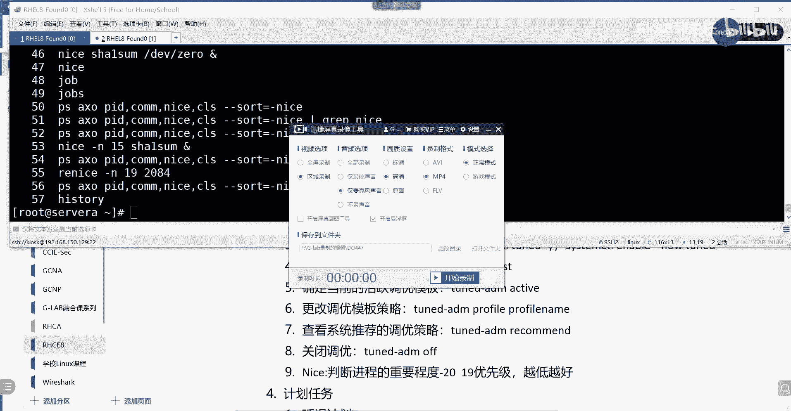
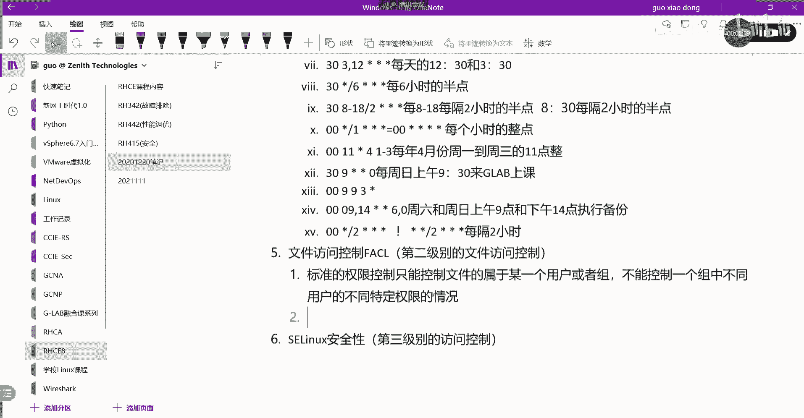
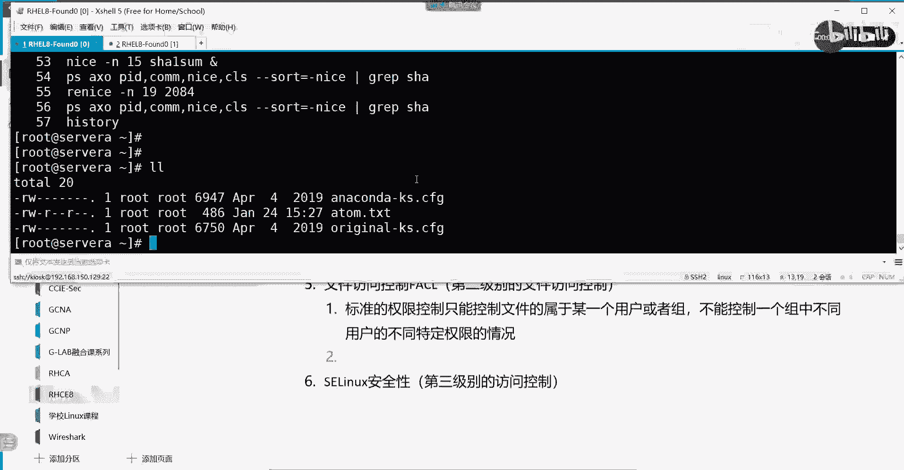
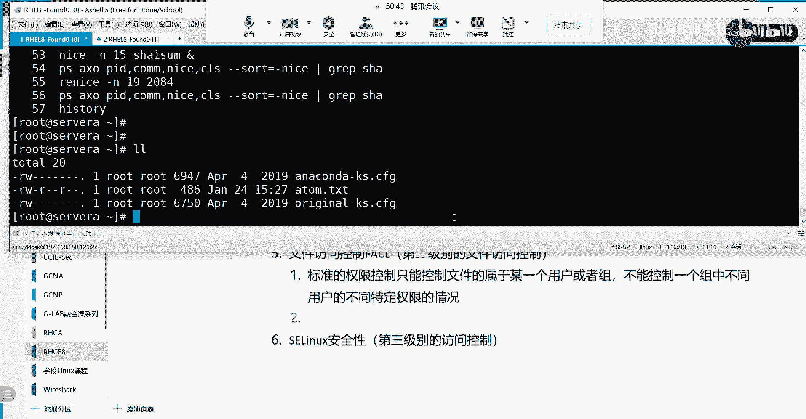
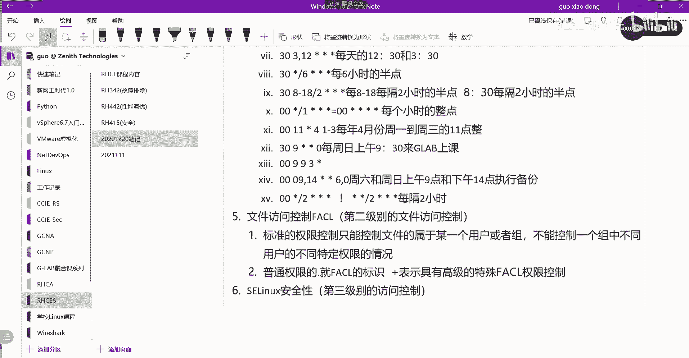
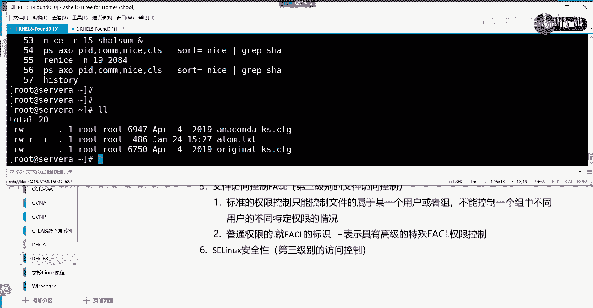
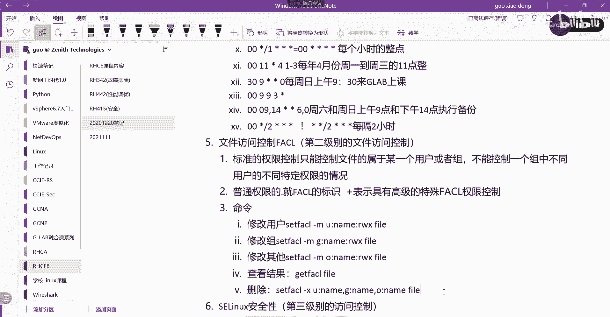
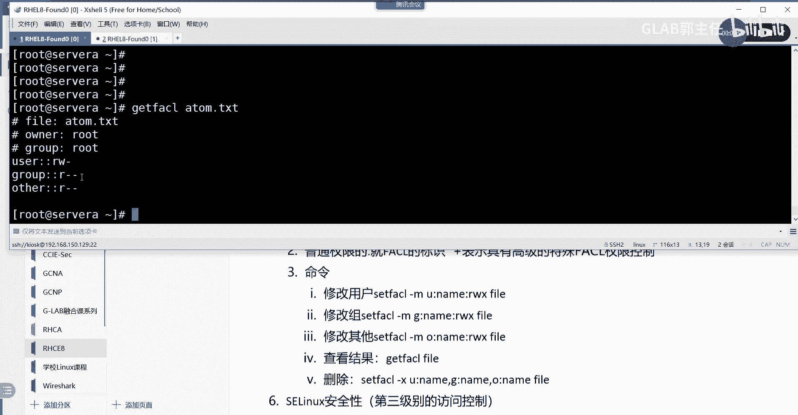
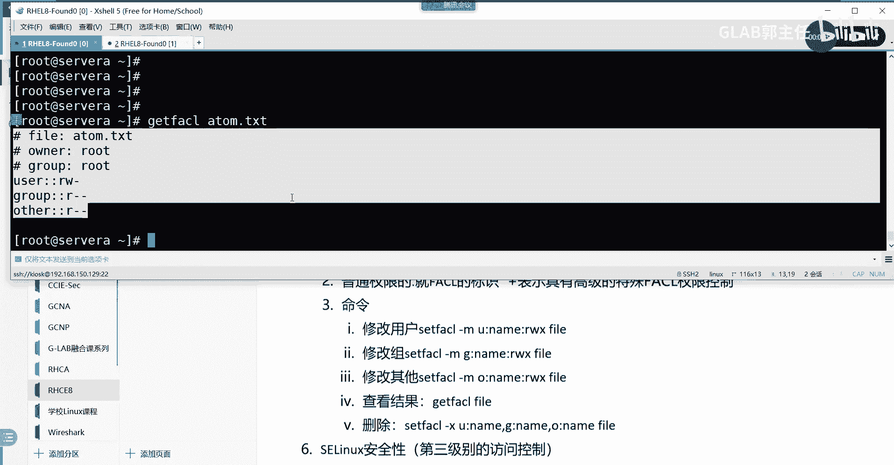
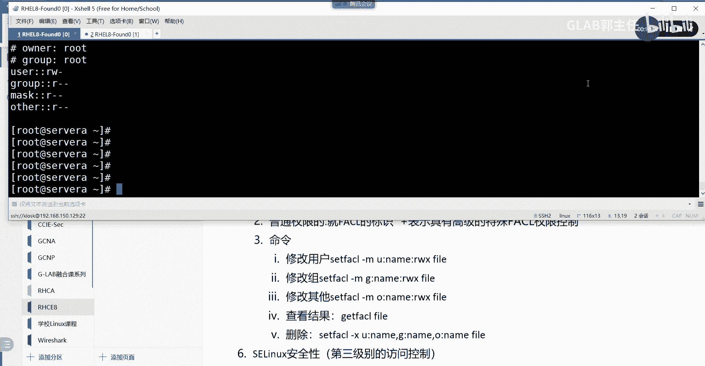

# 【Linux／RHCE／RHCSA】零基础入门Linux／红帽认证！Linux运维工程师的升职加薪宝典！RHCSA+RHCE／26-文件facl控制 - P1 - GLAB郭主任 - BV1yb4y1g7fZ

好了这个说完了以后，接下来我们来看诶，到哪了，到这儿了是吧，文件访问在录啊，接下来我们到了，文件的访问好，这个要要有几点要给大家说明一下，我们对文件的访问，前面讲过权限的控制是吧，对不对。

抢了权限的控制，那么在这里要提到第一句话，权限标准的权限控制，标准的权限控制只能控制文件的属性，只能控制文件的属性哦，只能控制文件的属于，不好意思，只能控制文件属于某一个用户或者组。

或或者组明白你说对吧，或者主它不能够控制，不能控制多个特定指定用户的不同权限，不能够控制对吧，一个组写的再精确一点啊，不能够控制一个组中对吧，不同用户的不同特定权限的情况，就是大家都在一个组。

我还想区分哪个人做的更多一点，每个人做的更少一点，这个用普通权限就控制不了，能理解吗对吧，普通绝剑就一刀切，你在组里，所有在组里的人就只能干这些事情，但是我这个左右有区分呀，对不对。

不同的人有不同能干不同的事对吧，所以这个时候我们标准的权限控制，就做不了这种事情了对吧，就需要用到扩展的，或者叫基于文件的访问控制来实现，对吧好OK第二句话，第二句话啊，第二句话啊，好。

新的文件和子目录，会从父目录默认的C2中继承S2，是这个不行，这个不对。

我想想啊，先来看。

大家还记得我们在讲权限的时候，是不是有讲过这个东西啊，我们在讲权限会讲这一串东西对吧，这串东西第一个字符代表啥意思啊，讲过的文件类型对吧，这代表的是文件类型，如果是目录这边是D，如果是普通文件。

这边就是一个横杠链接文件就是L是吧啊，这是文件类型，后边总共三段一段三个九个字符，代表的是普通普通权限，后边点当时有讲吗，点没讲吧，算了没有提了一下是吧。

好现在要说了，就是普通权限后边的点，普通学校后面这个点对吧，就是FSL的标识，就是FS2标识，如果只是一个点，那就是用普通权限来控制的，如果这个点变成了加号，那就代表这个文件具有高级的FC2的权限控制。

能听懂吗，如果是加号，就表示具有高级的特殊的FC2的权限控制，明白就看这个位置。

就看这个位啊，所以大家在看权限的时候，不要像以前一样，直接只看这个，一会我做完特殊权限，你会发现这边就变成加号了啊，别人加号啊，别人加号好，OK没什么问题吧，好那么其他的话我觉得应该没什么了。

就讲命令了，我说明白了它的作用了吧，说明白了，接下来看他的命令，主要就是命令了，我们来把命令给大家写一下，命令第一个呃，我们要修改它的修改，比如说我想修改指定用户的FSFSL的权限。

修改用的是杠m gm是修改的，然后呢他要设置的话，他要改的话叫sf AC e，这是它的关键字com这是一个典型的修改，我给他写一个例子啊，U冒号，然后写这个名字。

然后再写它的权限还是WX然后指定我的file，这样做的来看清楚啊，SFC2就说明他在设定它的高级权限了，高级的文件访问控制权限，然后杠modify修改的意思啊，然后中间这一串用冒冒号隔开了。

用冒号隔开了，那么U啊先写UU是关键字啊，这个就是某一个特殊的用户啊，那么这个特殊的用户具有什么特殊的权限，对某一个文件听懂了吗，就这么简单，没有其他东西，这个是改用户，还有改什么，还有改什么。

改组是吧，修改指定组的CL他也可以改组，我把上面写清楚一点，上面是改的，修改用户，下面是修改修改组怎么写sf a c2，这个一样的吧，杠M也是一样的吧，就不是U了吧，就是G就是G的名字，G的。

我用RWX代表只是模拟，告诉你这地方是全限位，也就是说它是可以被继续控制，但是真正的权限的V，还是跟之前讲的权限的V是一模一样的，可读可写可执行，明白吗啊这些都一样啊，然后对某一个文件啊具有这样的特性。

好吧嗯，好继续，这是修改组修改，其他呢我们不是还有修改其他的吗，对不对，好，再看set fc2杠M还是这个杠M，这就变成不是G了，变成哦other吗，听得懂吗，OK好这些都一样啊，这些都一样好。

那么怎么去看呢，查看的命令，查看结果，这个查询的结果，我们用的是GFCR加fire的名字，ok get vs加fire的名字，直接就可以看到了，就可以看到了，好，这个我说明白了吗，如果你设置的不对。

想删除的话，你应该用删除如何删除了，我们把删除给大家整理一下啊，删除还是通过sf s l来做的，但是就不是杠M了，就是杠X杠小X啊，然后怎么去删。

比如说U冒号name逗号G冒号name逗号O冒号name，这个看得明白啊，你可以一起删，中间用逗号隔开，你也可以一个一个删，杠X，就把你刚才所做的上面的这三个，所做的全部删掉，那既然三是可以一起三的做。

是不是也可以一起做啊，你可以把上面的三句合并成一句，根据你的需求，你可以分开写，可以合起来写，中间用逗号隔开，听懂我意思吗，各位嗯，OK好，那么这个是呃这几个就是修改删除，还有查看修改删除，还有查看。

来我们简单的做个示例，这个也不难啊。

很简单啊，好首先我们来看一下atom这个文件，它默认的高级的访问权限有没有没有吧对吧，是带点的说明，这是没有的明白，但是不妨碍我们去看它，Get fa sl atom，点击XT直接去看，看，到了吗。

好我文件的数组是root啊，数组是root，然后呢数组它可读可写，没有执行，然后所在的组读没有写，没有执行。

other只有读的权限，是不是我们普通权限OK没有问题啊。

好那接下来我们来给他做一些特定的设定啊，我现在创建两个用户叫G2为一，再创建一个JB2，看到了吗，我要求我要求大家来做设定，请问啊，我创建了两个用户，这两个用户属于哪个组啊，默认没有指定组。

它是不是会创建跟用户一样名字的组啊，对它不属于任何其他组，还是属于GW1和GL8这个组对吧，这两个组属于root吗，other group还是user，other属于other，用户明白吗。

OK用户的话，他统一的只有读权限，对不对，好现在我要求大家去做特殊的设定，让G2唯一的用户对这个文件具有可读可写，GL82对这个用户具有可读可写可执行，明白吗，它属于other。

如果让你用以前的权限控制你，搞不定的，你要么把它放到某个组里面对吧，对不对，然后你对组来进行操作吧，现在呢我不放任何组，我就是他让他做other的用户啊，理解不好，我只想让他做这个事情怎么做呢。

一起做啊，sf a c2开始设定杠M对吗，然后呢对对某一个用户吧，明白我意思吗，是不是用户好，对某一个用户对谁呢，对GLB1这个用户设定可读可写杠，是不是这个逗号，还有一个特定的用户叫GLB2冒号。

它的权限是可读可写，可执行，对哪个文件对atom点TXT，这个看得懂吗，很简单，我一起写的，然后get f a c2去看一下有没有不一样的变化，有没有明白，多了两行，明白多了两行，这两行就是特殊的控制。

明白不啊，多了两行还多了一个mask，这个mask叫这个mask，就是它的默认的mask，默认的默认控制SL的mask，大家先不用关心这个mask，这样这个时候你就会发现啊，我们不是所有的用户。

都是按照普通权限来控制的，然后我做完了以后，你会发现这里变成加号了，看到了吗，对不对啊对吧，然后呢，只要有普通用户对它有执行权限，它就变成绿色了，说明有人对他可执行执行，他做了个执行，加了个执行权限。

那么这个地方看得清楚吗，好这是第一个我的需求，再来一个，这只是普通用户，就是普通的other用户，我现在要求我创建两个组，我不是有两个组吗，我多了G210组和G220组好。

如果单纯的我这个组里面可能还有其他用户，不仅仅只有吉拉贝和吉拉贝那组，对他也只有可读权限吧，主要就是我现在所在的这个root组，对吧，那我想修改，我想修改这个G修改一个组。

我想起来B1这个组对它具有可读可写，只可读可写的权限，SFC2杠MG是不是改G啊，这列表一冒号rw fire f叫atom，看懂了吗，然后get f a c2atom是不是多了。

基于组的特殊的一个特殊的组的一个处理啊，啊所以它不仅仅只是对某个特殊的用户啊，特殊的权限去处理它，还可以对对某一个特殊的组特殊的权限去处理，还可以对特殊的other特殊的权限去特殊的处理，明白这意思吗。

所以在原来的权限基础之上，他可以做更精确的控制，更加精确的控制呃，在考试当中就考题就是这么出的，他说让大家创建几个用户啊，那么这几个用户，他不是跟其他用户访问权限是一样的。

他要去区分开不同的用户具有不同的缺陷，比如说tom1具有可读可写，tom2具有可读可写可执行，就像我刚刚那个需求一样，他没有像做这种组的区分，他做的都是用户的区分，谁懂啊，好删掉。

把我刚才所做的东西删掉，set fc2杠X对不对，然后把U把那个删掉，GOABE删掉逗号，再把U冒号GOAB23调，逗号G冒号GOAB13调，对atom点TXT这一起删的啊。

把我刚才做的东西是不是都删掉了，再看是不是又恢复了，没了吧，嗯没问题吧，OK所以这个是删除啊，这个没什么难的好，关于FS2，这也是一个考题啊，大家把那个第103页的题做一下，这是第三个吧。

这些题都不难啊。

