# 【Linux／RHCE／RHCSA】零基础入门Linux／红帽认证！Linux运维工程师的升职加薪宝典！RHCSA+RHCE／27-SELinux - P1 - GLAB郭主任 - BV1fN411M7oX

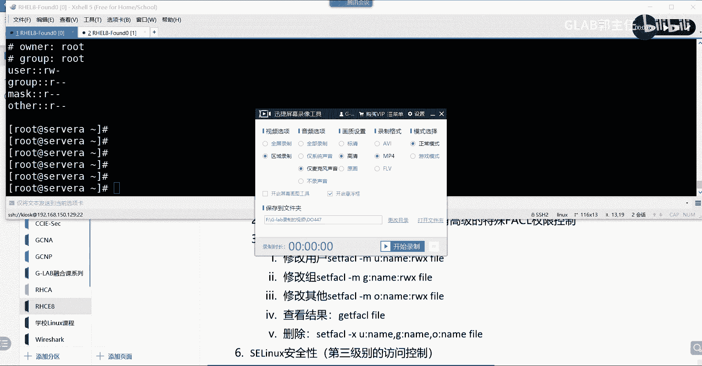

好了，最后一个叫今天的S1LINUX，最后一个啊，这个也是也是也是考题，也是一个考题，CSARHCSA的第三题吧，应该是第三题还是第二题，应该是初级考试里最难的一个题嗯，第三题当然现在现在的改版了。

因为到明年大考的时候，CSA要加一些doer的题，要加容器加加加PORTMAN，加容器不用担心，没关系，容器本来应该是初级的内容，我把它放在后面讲，到了明年的时候给大家把USP讲完。

我会给大家花个半天的时间重点讲一下容器，因为在考试当中会加两到三个题，加容器，现在考试越来越难了，我觉得之前考试挺简单的，他本来就挺难的，因为都是操作题嘛。

他跟这个中级的笔试题背题库不是一个level的，要操作的，然后呢这个本来就难，然后现在又加了其他的东西，要加容器，要加其他乱七八糟的东西对吧，所以稍微有些难，没关系啊，来我们看SLINUX，好了。

SLINUX首先我们先来看它的作用，先从概念开始吧，从概念开始，概念第一个SLINUX在LINUX当中的用途非常的大，那么它可以允许和拒绝访问文件及其他的资源，这个怎么去控制呢，他说的是啥意思啊。

他说的就是我们在对文件访问的时候，我们是可以通过权限来控制什么人，对什么文件可以访问，对吧对吧，来说听清楚我的意思啊，我们刚才的权限普通权限也好，或者FS2的高级权限也好。

它都是控制用户对这个文件能不能用是吧，人对这个文件能不能访问，但是他能够控制这个人，能访问什么类型的文件吗，能控制访问什么类型的文件吗，比如说这是一个应用应用文件，应用程序产生的应用文件。

或者叫比如说阿帕奇这个应用服务，产生了基于配置的一个配置文件，你能够控制这个用户能访问普通文件，不能访问配置文件，也就是对文件的类型在访问控制上有区分吗，你能就能访问就访问，不能访问就不能访问的权限。

是不是这样控制的，最多让你多区分一下哪些用户访问的多，哪些用户访问的少吗，对不对，用FS来执行吧，但是SLINUX是可以控制它，你能够访问哪些类型的文件，它的文件基于应用的。

而且应用的文件上下文都是有关联的，所以这是一个基于上下文关联的访问控制，基于上下文文件关联的访问控制，同一个应用程序文件所产生的文件，它的上下文都有一个tag tag标记，明白对于一个标记。

那么如果一个人来访问的时候，他没有这个赋予他的tag权限，他就没有办法访问这个应用所产生的所有文件，听懂我意思吧，OK那我们来总结一下它的概念，这个是可以允许我们允许或者拒绝访问，文件或者资源。

它的精确度要比用户和权限要大幅提高，嗯怎么说，可以更精确的控制，可以更精确的控制文件的访问对吧，那么嗯主要是控制访问文件的类型，可以基于文件的类型，可以基于文件的类型来实现控制，就这么个意思，对吧。

他除了做这个方式访问之外，它还可以进行什么样的访问方式来控制它，还可以除此之外，除此之外，那么还可以呃，还可以控制用户使用什么方式，来对文件进行访问，就是不但能控制你访问的类型。

我还能控制你以什么样的方法，来对这个文件进行访问，这个主要是对应用程序，主要是应用程序，应用程序，在大家在每一个应用程序在运行的时候，他都会调用系统的应用程序，对应的配置文件对吧。

配置文件支撑的应用程序能够正常运行，大家能听懂我意思吧对吧，那么应用程序在对配置文件的访问，跟我们普通用户对文件的访问一样吗，肯定是不一样的吧，这就是两种不同类型的访问文件的方式，听懂了吗。

还有一个是普通用户对文件去读取这些文件，这是访问方式的不一样，那么S1LINUX也是可以控制的好，这是第二句话，第三句话，SLINUX主要是专注应用层的主策略的定义，它主要是专注的是主要啊。

主要是专注应用层的策略定义，通过声明各个程序文件和网络端口上的，预定义的标签来对资源进一步保护，这一句很重要，通过什么手段，他要先声明程序的或者文件的，程序文件和网络的端口号，SM的预定义标签。

网络的预定义的标签，然后呢来对资源进一步保护，来对资源来进一步保护，Ok，好在这里呢我们给大家看一个我PPT上的图，这个图我给他贴进来，要去，不是这个，这从哪冒出，其实教材上也有吧，我们看教材。

这个教材比我比我这边画的要好，看教材，教材上有个图，第几页来着，放到S1LINUX啊，积极在这啊，在115页，115页，首先啊每一个文件，这是一个文件吗，3w html，这是一个文件，对不对。

那么如果要用SLINUX来控制的话，他必须要对文件的一些东西来进行预打，预定义或者预标签，要对他打一些标签，前面这些东西就是我们预定义的标签，我们一起来看啊。

首先第一个是我这个文件的user叫S1linux user啊，这是我们的s linux user，这user先放一放，第二个就是他的角色，这都是标签啊，这都是标签，然后第三个是它的tab类型。

我们说过了文件，我们一旦打上了tab类型的话，就可以通过S1LINUX来对这个用户访问的文件的，所打的tab类型来进行控制，这个文件它就叫HTTP system content gt，这是他的标签。

明白吗，后面是他的一个level，所以我们主要的控制是基于这个标签，特别类型的控制，所以这就是标记了这个文件的SLINUX的type类型，那么可以对它来进行控制，来看下面一个例子，这个例子会更直观。

有了刚才预定义标签之后，我们再来看他的文件的访问啊，这个文件的标签是HTTPD的，什么什么什么什么，对不对，然后这是SQL文件的标签，它的标签就不是就不是这个HTTPD吧，因为不同的应用。

对不同的文件打上的标签是不一样的，阿帕奇打的这个文件标签就是HTTP，这是系统给他打上的，也是规范好的，然后呢，数据库的标签叫MYSQL的这个dB的T看得懂吗，好那么两个标签SLINUX标签都有了以后。

接下来他们互相之间阿帕奇的应用，他就携带了HTTPD的这个标签格式的访问，他他携带的也是MYSQL的方案，那么这俩标签都有了以后，互相之间能访问吗，阿帕奇上层的应用程序能够访问MYSQL的文件吗。

能不能不能不能了吧，因为标签不一样，你是没办法访问的，听懂了吗，如果，那如果要想让阿帕奇的应用能够访问MYSQL的文件，怎么办，是不是把标签改成一致啊，游戏规则已经定好了，每个文件。

每个应用对应的文件都会打上不同的tag，那么相同tag的文件在应用之间才能互访，这个是游戏规则已经定好了，能听懂吗，那你要想互相访问，就必须按照CLINUX的访问规则，大家标签都打成一致的，那就OK了。

懂了能听懂我意思吗，OK好，所以这就是一个很典型的SLINUX，可以控制应用程序对文件的访问，三按照type类型，也就是访问方式来控制的，听懂了，这个比较直观啊，这个比较直观好吧，这个比较直观好吧。

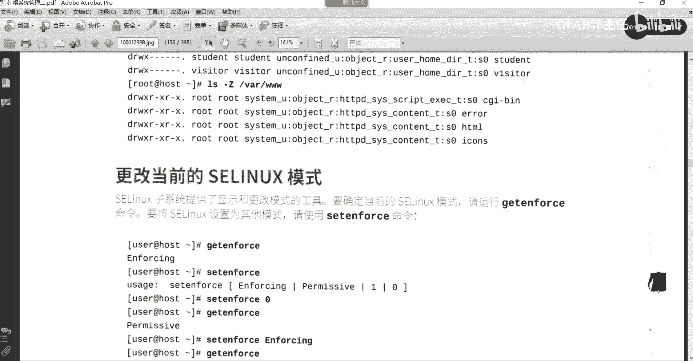

来我们看啊，既然说到这个，我们就需要打开我们的系统来看一下这个标签，SLINUX这个标签贯穿系统的所有文件，不光是文件，有它的进程，也有有人说建设为什么会有，我们刚刚不是一直在讲文件吗。

我刚刚是不是提到了，某个应用程序可以对文件进行读取啊，我这个应用程序的本质是什么，是不是就是进场啊，对不对，应用程序能对文件访问，其实说的就是进程对文件的访问，那进程能没有标签吗。

进程没有标签是怎么对这个文件访问，怎么去判断进程和文件之间的标签是一致的呢，听懂了吗，各位在系统里头进程肯定也有标签，要不然他没法控制好，我们来看一下啊，叫PSAX大Z大Z是看进程的标签大Z啊。

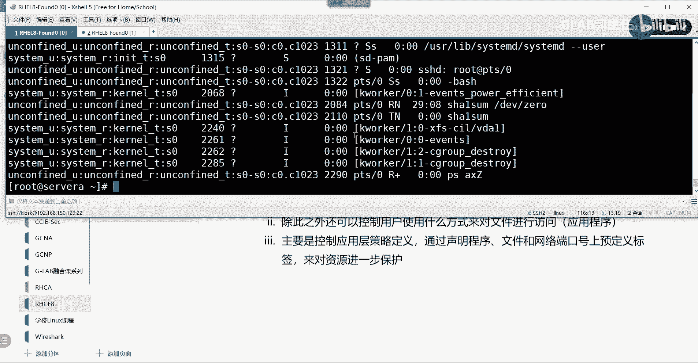

这个看到的就比我们之前看到的要多多了，你看这一大堆东西标签在哪啊，是不是一样的吧，这是用户吧，SLINUX的用户吗，它的用户就是system进程的用户是system，然后呢。

我们主要看的标签是是看这个这个type类型，第二个是角色嘛，下横杠R代表的是角色，然后下方杠T代表的就是tag，就是标签，听懂了吧，这个进程，比如说某一个进程，要对某一个文件要具有访问权限。

它的这个这个地方至少要一致吧，不一致是不是没法访问好，那有了S0UX的安全系数会非常的高，那大家想想高在哪里呀，如果一台电脑被黑客攻击完了以后，黑客想要去调用你系统中的文件啊。

黑客想要去黑客在攻击到你的系统，要对你的这个其他的，比如说我是通过web进来的，有可能web应用程序的所有的文件都被贡献了，但是web以外的其他文件，你的所有的访问权限是不是被SLINUX保护起来。

你没有办法去攻击其他的东西，因为你访问不了tag类型，可能你都不知道，明白我意思吗，嗯明白明白吗，OK那有人说我说的这种攻击，不是说底层的全部沦陷啊，它是通过应用渗透进来的。

不是说直接能远程通过SS去登到你的系统上，你都登进来了，我还看不到你的tag吗，对不对，这叫彻底沦陷好不好，我说的是通过应用渗透，应用渗透，它是只知道你应用的这个应用可能被攻陷了。

另外一个应用就会被保护起来，理解吗。

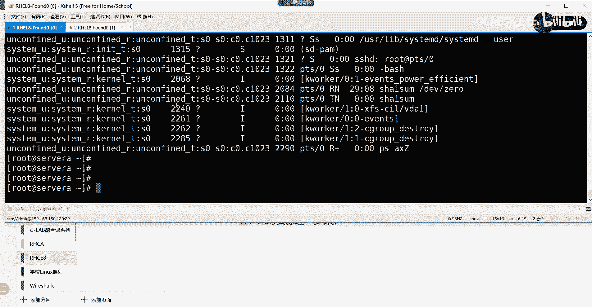

OK所以安全系数会比较高啊，好那么这个是这个是我们的应用啊。

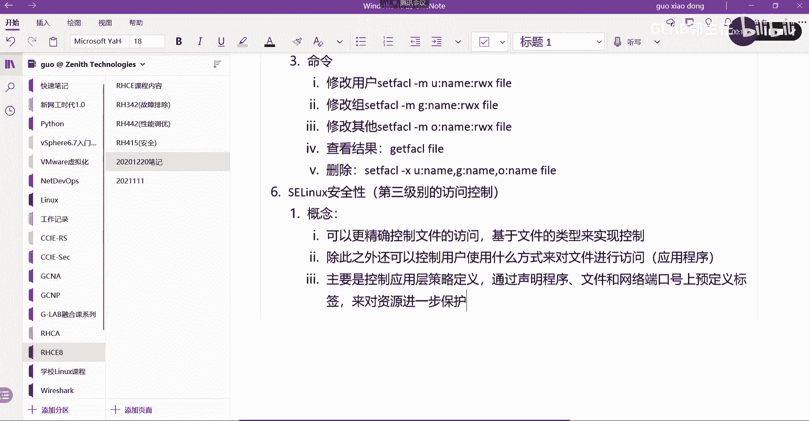

这程序再来看我们的文件也有啊，LS杠L啊，这个是看我们所有文件的属性，那么如果想要看文件对应的tag标签，要加一个特殊的参数，LSL大Z会看到有不一样吗，又多了一列，看到了吗。

所有的文件它都有SLINUX的type类型的标签，我说明白了吗，明白了，那么CLINUX到底在哪，这是一个开关，在哪里调整呢，我们可以通过get get enforce，Get in force。

我们可以看当当当前的系统的，其实系统默认安装好，它默认的SLINUX都是enforcing，都是开启的嗯，他也是建议你开启的，那这个开启的文件在哪里呢。

在etc下面的S1LINUXCONFIG去修改一下这个文件，这个文件它默认是enforcing，看到了吗，它有三个模式，这个是强制开启吗，这个是这什么意思啊，这个是关掉嘛，对不对啊。

他的强制策略第一个肯定是强制，第二个呢AC linux print warning，就是他会只是会告警，他没有任何强制手段吧，第三个就直接关掉了，连告警都没有了，明白吗，嗯第二个是只提醒没有开啊。

第三个是告警都不告警，直接关，第一个是强制开启，也就是你所有的防护策略，都必须按照SLINUX的策略来进行，明白，好吧好嗯，这个是我们的LINUX好，那么我们来讲一个比较重要的东西啊。

我们来讲一个比较重要的东西，这一块还是比较重要的。

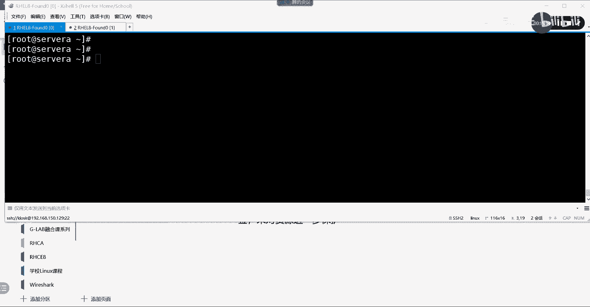

这在讲之前，我们要总结一下他的这个上下文访问的策略，S1LINUX上下文访问的策略，第一个新文件通常就是你新建一个文件，新建一个文件，我们把它叫做新文件嘛，对不对，新建一个文件。

它所携带的tag是怎么产生的呢，通常从父目录继承，SLINUX的上下文。

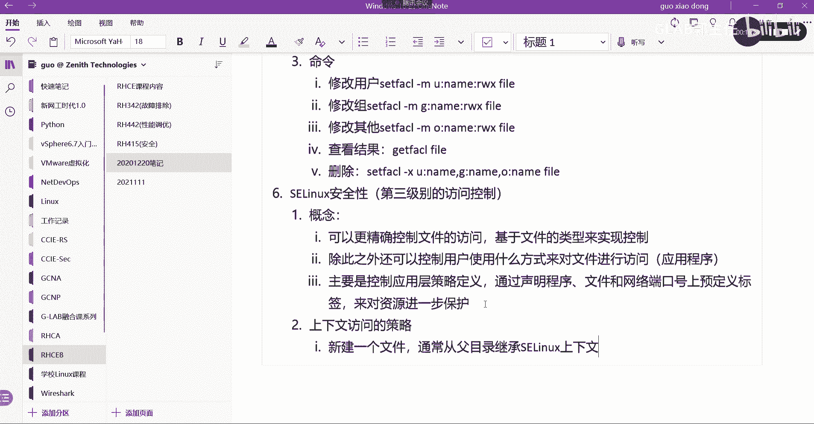

第一句话记好，先记好，先记好好好来吧，Mac dr2，我们新建一个，建一个test是不是好，我们来看嗯，A4杠L大Z可以看到test，我新建的test，它所携带的这个tag是不是admin home。

明白吗，这home那么我们重新touch一个新的文件，touch a在哪里在啊，touch在test下面创建一个A，那么我新建了AA的文件的时候，大家要看LS杠L大Z。

看一下test下面的AAAAA的标签，是不是等于号吗，是不是，第一句话是不是印证了我们的，任何的新文件的产生，都是从父目录去继承这个属性的，明白不好。

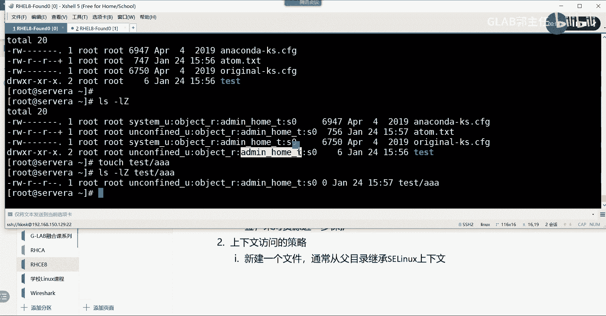

这第一句话，第二句话，什么情况下会破坏这种继承呢，破坏了就是不继承嘛，对不对，什么情况下会不继承，什么情况下两种方式，第一种当移动这个比较重要吧，当移动，移动文件会保留原来的上下文。

第二种情况使用CP杠A，来复制的时候也会保留原来的上下文，这两种方式它会不继承，就是你在动这个文件的时候啊，听得懂吗，各位你在动这个文件的时候，他会他会他会他会这个上下文不行啊，不一致啊，OK好了。

我给大家演示这两种，你这移动肯定会的，移动叫MV吗。

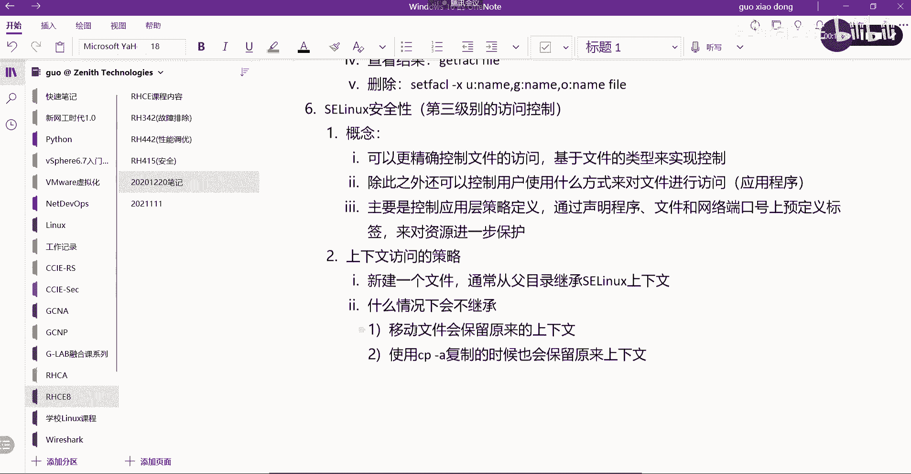

剪切是不是这个移动是MV啊，来我们坐一下好，那我们来把这个目录，我们把AA到另外一个地方去，放到哪呢，C到C到tab下面，我们C调到tap上面去，好tap上面的话，那么我们来看一下LS杠L大Z。

我们看一下tab他自己的碳板杠LD小D是吧，看一下tab他自己的标签是不是type t啊，嗯然后我们把刚才的那个目录那个文件挪过来，test a在加目录上面的test a把它挪到当前目录吗。

挪到tab上面去，是不是挪过来了，挪过LS杠，LZ我们来看一下大Z啊，在tab上面的是不是有AA，这个AA不还是等于换杠T吗，就这种情况是不会改的，听懂了吗，啊你这样的话就会出现各种文件这样挪来挪去。

其实它的标签上下文是不一致的，能听懂我意思吗，嗯这个是两种通常破坏继承的方式，一个是MV，一个是CP，CP加杠A能理解吗，我们在讲CP这个选项的时候，讲过杠A，杠A说的是它会保留这个文件的所有属性。

从一个地方copy到另外一个地方，is all的意思啊，所有的属性就包括S的type类型，听明白了吗，好那么这个听懂了听懂了，那这样会造成什么问题呢，这个会造成什么问题。

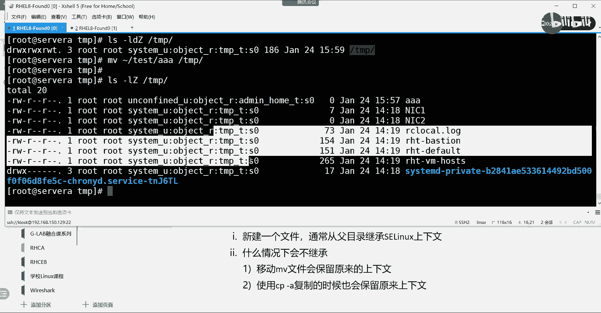

就这种打破继承的方式，会造成一个什么样的问题，上下文不一致带来的问题是什么，肯定是访问啊，对不对，访问肯定出问题啊，来我给你换一个啊，比如说我们上面装了一个阿帕奇，或者就是一个HTTP的服务。

这样说大家更容易理解，HTTP的服务我就装了，HTTP服务是要对外提供服务的，一般访问访问HTTP首页对吧，那么首页的话我们把它叫index文件吗，HTML这是一个文件，对不对，好。

正常情况下HTTP的服务安装完以后，它有规定的HTP这个应用啊，他会去访问V上面的3W下面的什么HTTP啊，这样的一个目录下面去找这个index文件，听不懂吗，这个是安装程序的时候。

它就自动指定了这个默认路径啊，啊他去访问就是OK的，因为从上层的应用，应用程序本身的type类型就是什么HTTPD，什么什么什么理解吗，到一直装完以后，到整个的文件路径到index文件。

它都是HTTPD什么什么什么的type类型，所以你只要把这个首页放到index，放到这个指定的默认目录下面，然后在外外部去访问这个首页，它就能正常访问，但是现在如果我把这个index文件。

从HTTP的默认路径下拷走，考到哪了，我考到我自己的家目录下面去了，请问这个时候你觉得还能访问这个index文件吗，能不能访问，不能明白吗，不能不能听得懂吗。

或者你在你在你的根目录下面建了一个test文件，然后在里面放了index index文件，放进来了，不能访问，如果要要能访问怎么办，两个问题为什么不能访问，第二个药能访问题怎么办。

不能访问的原因是因为上下文不一致，因为你新建了test test目录，大家会看到一个新的标签吧，它不是我们从应用层，从上面的应用程序就一样的，HTTP的标签吧，从上到下访问的时候。

就是从HTTP的标签访问下来的，听懂了吗，当你到了test不能访问的就是上下文不一致，导致文件不能访问到index，那要怎么办，把你新建的test的标签，改成跟前面的test标签是一致的。

就都改成那个HTTPD什么下N杠T听懂了吗，嗯才可以访问好，那接下来就到了，怎么去改上下文的标签啊，这个问题我就不写了，得得得得自己去写，好不好，肯定是上下文不一致啊，好修改，如何去修改上下文的标签啊。

我们通过一个命令，这个命令，笑死，m a n m a n a g e s e manager是吧，然后去FCONTEXT，这个命令来声明文件标签，然后去改它啊，去改这个文件标签啊，这个啊。

通过这个命令来改，那这个命令有一些选项啊，有些选项我简单给大家写一下啊，呃，稍等一下啊，有一些选项，第一个叫杠A杠A其实它是A的简写，就是添加嘛添加标签，添加一个标签，然后有一个叫杠T杠T很明显。

这是tap，就是要改它的tab类型的标签，修改，tag类型的标签，因为我们刚才有看到教材上，他的SLINUX有很多段是吧，第一段是user，第二段是rule，第三段才是tape。

第四段是level吧对吧，每一段的修改都有不同对应的这个字啊，那跟我们接触的比较多的就是这个杠A和杠T，明白，那如果我现在给大家写一个例子，大家帮我看一下是什么意思啊，S m a n a g e。

呃加这个FCONECT哎，不F一F1CFCONTEXD，F c o n t e x t，这个杠A杠T改成HTTPD下横杠，SYS下杠cot e x t下杠T好，然后呢我们来写这个这个文件。

这个就比如说是index n d e x点HTML，这句话什么意思啊，很明显就是要改这个文件，把他的文件的type类型改成这个吧，理解我意思吧，各位，好了吧，把前面的改成，把那个前面改，后面是改标签啊。

这就是完整的标签哦，对这是一个呃，这边不是冒号，是下一道题，这个是杠，这是一个完整的标签，你看到了吗，这个标签就是我们刚刚看到的标签。

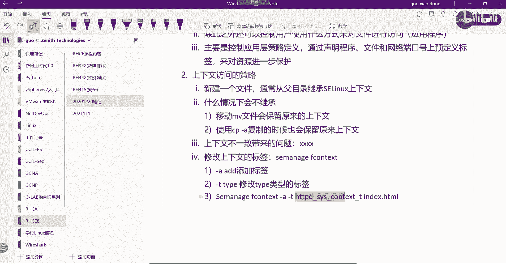

就长这个样子，标签长这个样子哦。

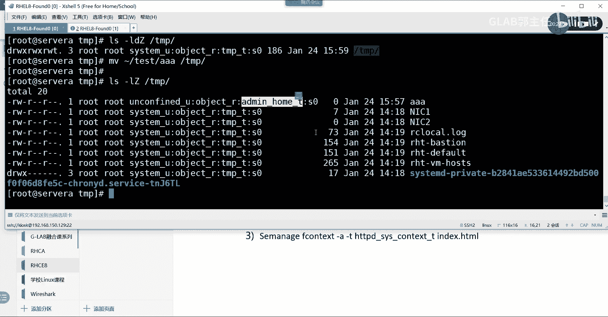

明白吗，但是index前面不是有吗。

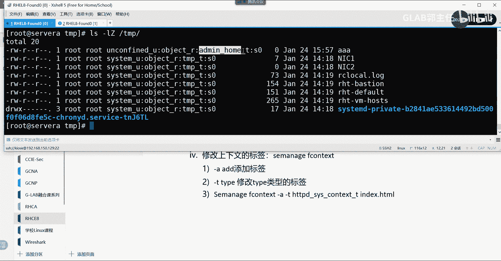

对啊index是个文件，我要改这个文件的type类型的标签，明白吗，我要改这个文件对应的标签，好吧，好这就是我们的CCLINUX，现在跟大家说到的就这些东西，那么我们通过一个练习来给大家演示一下。

应该是第118页，看看，118页，大家通过呃登进来，登进来之后去编辑一下，把它改成一参数设置为这个啊，这个第一个比较简单啊，然后去看一下，然后重启就好了啊，嗯这个是第一个是调整它的这个模式啊。

第一个不说了，太简单了好不好，第二个是125页，修改它的上下文，一般数遍修改它的上下文，这个呢这个明显就是我举的那个例子，在这个实验当中完全应验，所以大家一定要把这个时间做一下，这个是改它的上下文啊。

然后呢我新建了一个，他新建了一个index文件，然后现在我想重新自己建一个文件和目录，然后还要让这个web界面能提供访问，就是完全按照我刚刚说的来，杠A杠T要修改，听懂了吧，刚才看DL修改。

然后改完以后他就能访问了，那么这个实验仅仅局限在S100X，该怎么去调整，他们并没有让大家去部署阿帕奇，部署什么HTP服务，跟服务一点关系没有，就是在修改SLINUX的相关的标签，改完你就能访问了。

其他所有东西都先不用管，因为你也不用你管，这就是我们实验环境的好处啊，啊如果单纯要要搞这个东西，你要搭很多东西，要把很多服务都装好，转完以后你再去讨论SLINUX，这个你只要把环境一开啊。

他这里头只有SLINUX有问题，其他都没有问题，能听明白嗯，125页，这个做一下好，然后我们来看130页，应该不需要做，130页，应该是SLINUX的布尔值好，130也不用做，三后边都不用做了。

关于CLINUX，大家只要做125页就可以了，这个部分的开放性实验也不用做，OK125就这么多就可以了，后面还会再给大家补充一个基于端口的访问，到后面再补充吧。

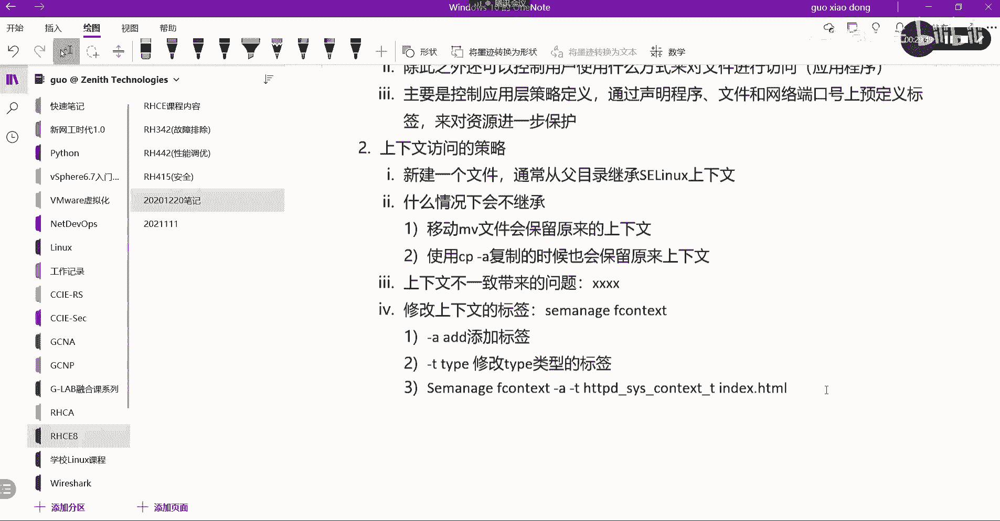