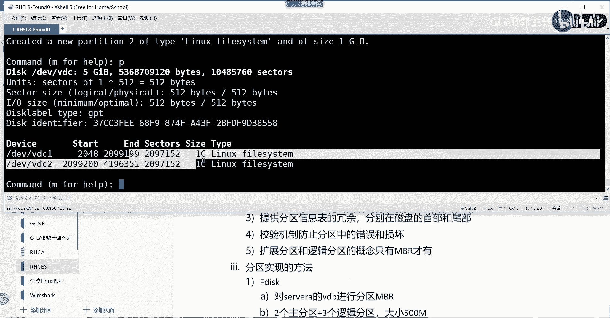

# 【Linux／RHCE／RHCSA】零基础入门Linux／红帽认证！Linux运维工程师的升职加薪宝典！RHCSA+RHCE／28-fdisk分区 - P1 - GLAB郭主任 - BV1ZC4y127A8

好吧，那我们就开始吧，然后那个今年年前最后一天课，总共差不多今天有七个内容啊，第二本书上的后边的几个东西，那么大家会看到今天主要内容都是在讲存储呃，在系统上的各种存储，在这里都会讲到啊。

基本的存储逻辑卷，高级存储和网络存储，这四个是平时用的比较多的，也是我们这次考试的必考内容，这四个都考肯定都考网络存储，考高级存储，高级存储当中考一个有两个高级存储技术啊，只考VDO逻辑卷肯定要考的。

然后基本存储就是划分这个分区，这个是属于呃运维最基本的操作的内容，所以这个也肯定会考的，所以前面四个大家一定要认真听啊，然后第五个内容的话，主要说的是开机的一个启动过程。

大家在嗯遇到系统起不来会遇到哪些问题，那么这个起不来的操作系统我们该如何处理，那中间还会给大家补充一个，如何去破解系统的密码，如何去破解系统的密码，应该会在这里去讲，然后最后一个就是网络的安全安全。

这部分我记得应该是讲那个防火墙相关的东西，这应该是系统防火墙放火枪啊，防火墙的服务啊，放在最后讲，然后呢这个是在最后一部分，然后第七个内容就是我们第二本书，后面最后的几个测试，需要大家今天要完成的好吧。

今天内容还比较紧，后边还要留时间给大家做，那我们开始看第一个内容吧，我们先看第一个管理这个基本存储，那么呃在讲基本存储之前呢，大家一定要再回忆一下，我们前面其实有提到这个存储的这个概念对吧。

那么在系统上，在系统上，尤其是在LINUX操作系统上，那么我们对存储的概念，前面了解下来的特点是什么，操作系统对吧，存储的特点，它的存储啊，现在我们了解的第一个，大家应该知道它没有分区的。

没有分磁盘的概念，它不像windows有C盘和D盘，对不对，所以他的第一个非常重要的特点，就是所有的存储都必须什么挂载，它就有一个概念叫挂载，挂载在目录上，对不对，所有的存储都必须挂在我的目录上。

都必须挂在目录上，能听懂吗，OK然后也就是他所有存放的空间是基于目录的，而不是基于windows里边的什么C盘，D盘，E盘明白，所以也就意味着我是可以拿一个存储空间，比如说是十个G给它挂载。

挂载到哪个盘，可以挂载到根目录下的home，这样的话我向根目录下面去放任何文件的时候，它其实就帮我放在这十个G的存储空间上，能理解意思吧，然后我再把这十个G卸载掉，挂到其他的目录下面去的时候。

原来在home下面放的内容，在其他的目录下也看得到，明白吗，所以这句话是我们LINUX里的最核心的概念，是基于对这个你可以把它挂载目录，这样的话存放数据都是基于目录来存放的，那么在这句话里头。

我们涉及到一个叫挂载的概念，对不对，OK好，先先不说挂载涉及到好几个概念，第一个概念就是这个存储空间是怎么实现的，这块跟我们windows里面很像，首先你得有一个硬盘，对不对，拿到一块硬盘之后。

我们得对它进行分区格式化，挂载是这样一个概念吧，明白我意思吧，所以我们首先要拿到一块硬盘空间啊，这个硬盘的东西格式会比较多，现在主要的什么HTD啊，SSD啊，对不对，这些只要叫存储的这个硬盘。

我们把它都叫做存储空间，那么拿过来之后，怎么样才能够被挂载到目录上，那中间必须要经历几个过程，第一个就是分区分区的概念对吧，第二个叫格式化，格式化的本质是确定这个硬盘空间的文件系统，对吧。

OK然后确定好了以后，我才能被挂载到某个目录上，才能存放数据，能明白意思吧，才能存放数据好，所以我们接下来一个一个来讨论，第一个看硬盘的格式，硬盘的物理格式吧，或者就是硬盘本身的格式类型吧。

我们叫硬盘的类型，常见的什么HDD是吧，什么SSD对吧，还有很多种硬盘类型的格式，这些都属于物理上的硬盘格式，那把叫物理上的硬盘格式对吧，那么不同的HDD也有不同的这个格式类型。

所以这个叫大家买硬盘的时候，主要考虑到硬盘的转速啊，空间大小啊，读取读写速度啊，这些东西都可以理解为是我们在这里讨论的，所谓的叫硬盘类型的概念，各位能明白我意思吧，OK所以这是我第一个要讨论的。

我就先写这两种类型，就先写这两种类型，然后接下来第二个分区，分区的两种方法，我们把硬盘的分区有两种方法，第一种方法我们叫BR，BR的方式和GP，好接下来我们就会给大家讲怎么去分区，拿着个一块硬盘。

我们要对它进行分区，那么有两种分区的方法，一种叫NBR，一种叫GPT，OK后面会讲这两种的区别，大概在一个现在主流的分区方式，好一会给大家讲下来，格式化，格式化的本质上是确立文件系统，这个明白吧。

确定文件系统，也就是说啊你拿了一块空间，你必须要确定它是什么样类型的文件系统，才能够往里放东西，这个我之前一直给大家举个例子说，比如我们拿到一块毛坯房，我们要给他装装修才能进去住对吧。

所以说拿到房子不是立马就能够进去住的，他必须要进行装修，装修的过程可以理解为是硬盘的格式化，要确定你家里的装修风格啊，你才能住进去吧对吧，所以这个文件系统它有很多种类型，在LINUX当中什么EXT对吧。

然后XFS有很多种类型的文件系统，等等等等等很多啊，这是常见的，还有什么WIFI对吧，还有什么swap，这些都是他文件系统啊，这个是LINUX里边的，再举几个非LINUX系统里面的，比如说大家都用过呃。

VMVM在拿到一块盘插进来之后，在虚拟化平台里头他也要对硬盘进行格式化，它格式化了叫叫VMFS是吧，他叫VMVMFS有六，现在是六了对吧，也有七，以前是五六，那这就是我们在虚拟化平台里头。

格式化的文件系统，再举几个例子，windows里面常见的两种文件系统，一种叫FAT，还有一种叫NFS，然后叫叫NTFS对吧，是不是叫NTFS，是的吧，就是NTFS啊。

这种格式是windows下的两种常见的文件系统，所以你会发现格式化在任何一个操作系统里头，都是都是对硬盘必须要经过的一个一步操作，那么根据不同的操作系统啊，虚拟化平台的操作系统和LINUX。

不同的操作系统和windows的操作系统，它都有各自系统对应的文件，系统明白这个就叫做系统所支持的文件格式，这就是我们格式化的目的好吧，那么这个一定也不能忘记，一定不能忘记，一定要对它进行格式化。

然后才能进行挂载，接下来我们讨论挂载，挂载数也是我们今天要讲的重要内容，在系统当中，只有被挂载的存储空间才能够存放数据，只有被挂载了以后，你的数据才能够被放在你的硬盘上，或者放在你的分区上，OK好。

那么在系统里挂载有几种方式，有三种方式，第一种叫临时挂载，第一种叫临时挂载，这个是我们非常常见的，用的就是mt直接打mount命令，这叫临时挂载，大家知道临时挂载的特点是什么，就是暂时挂上去。

系统只要一重启它挂载这个就就消失了，能听懂吗啊，这就这叫临时的，暂时给你挂上来的系统，只要一重启，这个挂载就失效了，这叫临时挂载，OK好，第二个叫永久挂载，永久挂载的概念就是一定会重启之后。

它还是会自动挂上来的啊，只要不管在任何时候，永久挂载，这个存储空间会一直是上限，online对吧，那么他这个主要的方式就是要去编辑，一个叫FACTABLE文件，这个也是会今天重点给大家讲的。

他要把你的挂载信息写在FACTABLE文件里面，这样的话才能够实现永久挂载的目的好，第三个也是我们今天要讲的也是一个考题啊，这叫这叫按需挂载，按需挂载会用到第三方的一个软件。

第三方的软件叫auto fs，这个是第三方的软件，要用到这个软件来实现按需，什么叫按需，我要用的时候挂上来，我不用的时候就会卸载对吧，所以按需挂载对资源会有一定的节约节省。

所以这是我们要讲挂载的三种方法，所以呢这个是大概的一条线啊，去用存储大概的一条线，每一个呃，关键的这个节点都会有相同的不同的一些技术，我们都要一个个去给大家临时来讲好不好，现在我们来看我们一个来看啊。

先看我们的这个嗯，先看我们的分区，其实最在最前面会给大家先从那个呃，从这个这个这个这个开始介绍，叫磁盘的介绍，磁盘的介绍啊，就是就是我们要讲的这个硬盘的类型，OK简单的介绍一下吧，好不好。

肯定很多人还是不是很理解，我们来简单的介绍一下磁盘，OK好，那么我们的磁盘在，也就是最底层的这种物理的磁盘，它其实都是大家去买的那个硬盘对吧，去买的那些硬盘，那么所以底层的磁盘可以是独立的硬盘。

也可以是什么，也可以是做成red，大家都做过吗，他一对硬盘通过red的软件把它堆在一起，做成一个red red，做成red，明白意思吗，可以是一堆硬盘组成的。

叫这个rer AI d read read有很多种方式，什么0110是吧，什么3456，这个就属于存储搭建read的这种方式，瑞的好处啊，比如说read0read1之间的区别。

read5read6之间的区别，它的好处在什么情况下应该用reg，这里我就不详细讲了，大家可以自己去下来，自己去了解啊，不管怎样，他是把他是考虑到硬盘的可高可用性才会做raid，对啊。

read通过软件或者硬件的方式，他把一堆硬盘堆在一块，最终结果也是实现了，做成了一个独立的一个一个一个硬盘吧，算是一堆存储空间，明白吗，OK所以这也是一堆的存储空间，只不过是一堆硬盘，考虑到高可用性。

全部堆在一起的，全部摞在一起的，明白意思不好，除了这个之外，还有一个也是今天要讲的叫LVM逻辑卷，后边到时候大家不要觉得很奇怪诶，逻辑卷这个怎么弄，逻辑卷也是底层的，就是在分区之前要搭建的事情。

我们可以把一堆硬盘做成逻辑卷啊，就相当于把一堆硬盘，都放到这个硬件池子里面去了，然后我可以从逻辑卷里面来分我们想要的空间，来给其他的目录了去挂载，所以逻辑卷的方式，也是实现底层存储空间的一种方法。

OK差不多就这三种方式，独立的硬盘，这个最能理解了，但是买回来一块硬盘，我可以在里边分区吧，第二个呢是做raid也是一样的，一堆硬盘通过硬件或者软件的方式把他的硬件，把它的存储空间都放在池子里面。

然后我在池子里面划分分区，第三个叫逻辑也是一样的，所以这是我的第一个磁盘的底层实现方式，有几种方法，第二个我们来简单介绍一下磁盘，Ok，物理的角度来考虑磁盘的这个存储的方式，它有自己的叫什么扇区。

是不是在磁盘上有自己的扇区，这个明白，然后读取扇区上的内容，我们是用的是扇区上要存放数据，它有自己的叫迟到，明白意思吧，好能读取磁道上的一些信息的时候，用的是磁头，大家可以拆硬盘下来看。

很多硬盘只要拆下来就不能再用了对吧，在空气中它里面都是真空的，一旦暴露了，那就不可能就报废了对吧，所以硬盘大家一般不用随便猜，那大家都知道，在磁盘里头能够对数据进行读写对吧。

所有的操作离不开扇区磁道和磁头，明白扇区磁道和磁头，那这只是给大家简单的了解一下啊，只是简单的了解一下，那么我们去计算磁盘的大小的时候，一般是怎么计算的呢，我们磁盘的大小这个不考啊。

这个内容不需要大家简单给大家普及一下，磁盘上的一些基本概念，它是怎么计算的呢，迟到，磁道数乘以磁头数，然后呢再乘以512个字节，这是它的最小单位，然后再乘以我们扇区，才乘再乘以我们有多少个扇区啊。

这样就算到我们这块磁盘大概有多大，大概有多大，明白意思吧，OK这是一些简单的一些名词的介绍啊，OK那么这些说完以后，接下来我们来理解这个分区，这个只是普及一下，让大家对磁盘有个简单的了解。

我们来了解分区分区有两种方式，一种叫MBR的分区方式和GBT，好我们一个来介绍，先看MBRBR它它的全称叫master boot record，对吧，叫master bot，主要的开机记录区。

好在说这个技术之前，我还是要大家先想一下，想个问题，我们先来想一个问题啊，这个画一下啊，这个是必须要掌握的，我拿到一块硬盘，比如说我拿到一块硬盘，这块硬盘我们也假设它不大，只有一个G不管了，对吧好。

那么我们需要在硬盘里面干嘛，分区对吗，什么叫分区，比如说分了一个区，两个区，A区B区，C区是分空间大小吧，OK刚刚有提到磁盘，它是如何去存储数据的，它有自己的迟到，有自己的磁头，有自己的扇区吧。

明白说的再直接一点，就是它在分区的每一个点，你的分区点在磁盘上都有对应自己的坐标，比如说这里是多少磁到多少磁头的多少扇区，能听懂吗，明白吗，然后这个地方肯定也有，他自己唯一的磁盘上的标识，多少磁道。

多少扇区，多少磁头，明白我意思吗，各位OK，所以我现在想说的是，我现在要对这个磁盘来进行分区的话，那么磁盘在读取数据的时候来了一个读取请求，那他怎么知道去找到自己的A区，去找自己的B区，去找自己的C区。

有人说这个不简单吗，我一看就知道找A区，B区C区，你是站在我们上帝视角来看这一块磁盘，但磁盘本身他是不知道自己有几个区的，能听懂吗，磁盘站接收到数据请求的时候，他是怎么知道去找到自己的A区。

找到自己的B区，怎么去识别自己的C区，所以磁盘必须得预留一部分空间出来干嘛，是不是这部分不是用来做分区的，它里边中专门用来放我的分区信息的，这个分区信息，就是比如说A区是从10151~10159。

听懂了吗，它会标识着你的分区的坐标，从什么扇区开始，到什么扇区结束，这部分的空间是留给A区的，如果分了B区，那就是20151~20159，听懂这意思吗，C区就是30151~30159。

那我说的这个能听懂吗，OK那么这些信息这个叫信息呀，记录了分区的信息，它会放在这个黑色的部分，这一部分是专门用来记录分区信息的，而不是分区本身能听明白我意思吗，OK所以现在我们讨论的MBR也好。

GPT也好，我们在讨论的是后面具体的分区，还是在讨论的这个分区信息表，是不是在讨论分区信息表，明白吗，我用MBR来分区这块空间，就是NBR格式的，或者说按照NBR的大小来画的。

我用GPT这里就是GBT大小来画的，各位能听明白吗，OK那么你在这里所有的分区的，你你所有的分区的信息，都被记录在我的这个空间里头，记录在硬盘自身的某个空间里边的话。

那么那么硬盘在读取这块数据存储的时候，它是不是就知道有几个区啊，并且就知道这个区是从哪一个扇区开始，到哪个扇区结束啊，你能听明白吗，各位明白了吗，所以我们现在不管是学NBR还是学GPT。

它其实就在都是在讨论这个分区信息，该如何记录，这点明白了以后，我们来看第一个分区方式，NB的分区方式啊，好这里头有一个有几个比较重要的点啊，第一个，它的最大的分区的磁盘，大小是2T。

也就是说用MBR最多能给你分的硬盘大小，就是两个T，最多最多就两个T，明白意思吧，OK好，那么接下来有一个非常重要的说法，是我给他看一下啊，我来看看现在刚才是不是卡了一下有没有卡，没有卡没有卡。

现在好了吧，好卡了，现在好了啊好好，第二点非常重要的是，他的如果用MBR来分区的话，他记录的这个分区信息的大小，就只有64字节，而每一个分区信息是固定的，每一个分区信息的空间大小是固定的，是16个字节。

所以NBA最多能分几个区啊，这能听懂吗，也就是B我给我要用B来分区的时候，这块黑色的部分就是64，这块这块大小就是64字节，而分区的话，我们每一块分区的这个记录表的大小，也是固定的16个字节。

所以NB最多能分几个区啊，是不是四个区啊，能理解我意思吗，一个区就要占16字节，它总共就64个字节，所以NBR分区它最多占最多分四个盘，这个能听明白我意思吗，所以NBR最多只能分四个分区，对吧。

这是他这是他决定的，但是如果我想用NBR分很多个分区，大家应该自己分区有用过啊，他其实文笔也可以分很多个分区的，怎么来怎么来去做更多的分区，这就要用到叫扩展分区，好大家来想想这个扩展分区来实现对吧。

划分更多的或者叫超过四个分区的需求，用扩展分区来做，来，我们来一起理解一下NBR的扩展分区，怎么实现的，这个非常重要，很多人分居完全不懂啊，这个要写清楚还是一个G，然后呢，我前面对吧，这是一个64字节。

它最多可以分四个区，一个区16个字节能听懂吗，OK那么我分第一个区，占用了一个字节，这个字这个地方就是记录A分区的大小，从哪个扇区到哪个三区啊，OK然后我再分B分区，用第二块空间大小，第26个字节。

我再分C分区，我用第三块听得懂吗，各位C分区，我记住第三块好，接下来我想我这里准确来讲，我想分六个区，如果把最后一个所有的空间，都用剩下的16个字节记录的话，他是不是最多只能分四个了。

那接下来他是怎么做的，他是怎么做的，他把最后一个分区做成了扩展分区，明白好，做成了扩展分区，那么有扩展分区就有它相对的一个定义，叫主分区，所以前面ABC它把它叫做主分区，这点能看懂吗，好。

那么扩展分区也是记录了最后的空间的，一个一个记录的，他叫扩展分区啊，也是记录这个，所以它整个最后这一块，所有的内容都叫扩展分区的空间，这一点你能明白吗，OK好那接下来怎么做的呢。

我这前面的这个NB的组的分区，信息表都被占满了，那我会从扩展分区里面划分出一部分信息出来，划不划出一部分空间出来，专门用来记录扩展分区的信息，好比如说我现在要分六个，现在三个还差三个，对不对，对吧好。

那么我用这一部分的信息来记录D分区，这个就是D我用这一部分的信息来记录E分区，那这部分就是E我用这一部分来记录F分区，那这部分就是F能看懂吗，这意思就是NBR的空间满了，没有关系，我可以借助后面的。

从后边剩下的空间划分出一部分新的分区线路，分区的这个记录表记录的空间，这一部分叫扩展分区的记录信息，表，明白我意思吧，OK啊明白吗，所以如果有了这样一个方式之后，我在我的扩展分区里头。

其实是其实可以按需的，自己去扩DEFG什么什么，你想画多少就画多少，因为它是占用后边的空间来记录信息的，而不是像NBR用前面固定的64个字节，不是了，听懂吗，所以像这种方式分的。

我们把前面的ABC叫做主分区，把后边的D啊，往后所有的分区把它叫做扩展分区，这个叫主分区和扩展分区的区别，但是一定要有一个主分区，也就是主分区一定要有一个这个主分区的概念。

就相当于大家在装操作系统的时候，你的windows系统一定要装在C盘里面，C盘就可以理解为我们LINUX里边的主分区啊，操作系统一定要装在主分区里面，听懂了吗，OK如果不是放操作系统的，你可以。

但是硬盘在划分的时候也是一定要有，一定至少要有一个主分区可以啊，所以他刚刚说的就是我们分区的各种方法好，我们把这几个内容来总结一下，刚才写的这个内容来总结一下啊，来实现划分超过四个分区的需求好不好。

然后呢，我们来看，扩展分区这里这里要说啊，这里要说啊，这个扩展分区对吧，扩展分区，是实用啊，扩展分区的方式来划分多个，这叫逻辑分区，这里有一个更加明确的其他的词，就是这一部分是扩展分区，没有问题的。

然后呢，后边这一堆东西我们把它叫做逻辑分区啊，逻辑分区，OKOK这叫逻辑分区好不好，那大家想一下这个过程嗯，我前面的ABC我去划分没有任何问题，我在我们就讨论扩展分区该如何画呃，我比如说现在我要先把。

是不是先把扩展分区先画出来啊，我在创建，我现在要划分这个dd分区啊，我们在讨论ABC已经划分好了，假设现在我要划分D分区，这个过程是什么，第一步是不是先把剩下的部分做成扩展分区，对不对。

做扩展分区的目的是什么，请告诉我，这个做扩展分区，它直接导致结果是，是不是在上面开辟出了一部分空间，用来记录逻辑分区的分区信息呀，理解吗，所以这一步一定要这一步，没有的话，他没有办法给你扩充出来一部分。

记录逻辑分区的空间大小，好，这第一个问题听明白了吗，一定要先把扩展分区画出来，这一部分画出来的目的，是为了建立逻辑分区信息记录的信息表，好这第一个问题，第二个问题，扩展分区这一步做完了以后。

他的D分区就做好了吗，扩展分区划分扩展分区和划分地分区一样吗，不是吧，对不对，刚刚已经说了，扩展分区作文，只是拥有了逻辑分区的分区信息空间对吗，但是D盘的空间我是不是还没画呀。

D分区我是不是还没有告诉他从哪到哪里啊，从哪里上去到哪个扇区，能听懂我意思吗，所以第二步才是真正的再去划分地分区，这个划分地分区，就是把地分区的详细信息，写入这个逻辑分区信息的存储空间。

听得明白我意思吗，所以在这里要要要D分区划分，其实要做两步，那么E分区，F分区后边直接在这里面画就好了啊，划分FE所以单独的去确定逻辑分区，它并不是让我们拥有了后边的逻辑分区。

它只是把后边一大堆东西确定为扩展分区，它并没有任何多出任何分区出来，那么在扩展分区有的基础之上，再去划分自己单独独立的逻辑分区，听明白了吗啊所以这个一定要注意啊，很多人上去直接划分的扩展，它扩展都不画。

直接想画逻辑分区，那怎么画没法画的，要知道啊啊主分区主分区位置固定吗，必须是第一个吗，是的，它的序号是从第一开始的，那来吧，这个写使用扩展分区的方式，来划分多个逻辑分区啊，划分多个逻辑分析。

就我刚刚描述的意思啊，一定要先第一步啊，一定要先划分扩展，画完了以后再去划分逻辑，这样才可以逻辑DEF什么什么，对不对，好，这是第四句话，第四句话，好接下来我们继续啊，第五句话，这里要记得最多对吧。

如果用NB，大家能看到最多几个组分区，最多可以划分几个主分区，四个吧，对不对，最多可以划分四个主分区，我把这几个分区全部做成主分区不就完了吗，那么这个缺点就是它不能再扩展了，最多如果画四个主分区。

那就四个区，听到了吗，对吧好，然后呢，一般是怎么画的，三个主分区加什么一个扩展分区，是这样的吧，好那我们还可以怎么画，还可以怎么画，可不可以一组一个组分区加一个扩展分区，可不可以啊，我划分一个主分区。

剩下的全部做成扩展分区，然后我要扩盘，全部在扩展分区里面做不就完了吗，可不可以也可以吧，好那么可不可以一个主分区加两个扩展分区，可不可以也可以呀，对不对，为什么不行啊。

那可不可以零个主分区加一个扩展分区，这个不行，明白吗，也就是主分区至少要有一个主分区，至少要有一个，这是第五句话，第六句话，扩展分区最多，它也不是无上限的，扩展分区最多可以创建15个。

打开18个扩展分区，一个扩展分区啊，最多可以创建15个逻辑分区，这个我说清楚了吗，OK一个扩展分区最多可以创建15个逻辑分区，好就这么个意思，各位能听明白吗，听明白啊，OK好，那么我们接下来再来看看。

有没有什么需要给大家补充的啊，看来大家为什么就是这个说过了，就啊你在创建扩展分区的时候，他其实这部分的空间也是确定的，就这部分空间就是用来用来记录逻辑分区的，这个空间它也是确定好的，它不是可以让你扩的。

就这部分空间它是确定好的，16×15嘛，就这么大，最多就这么大，你明白我意思吧，最多就这么大，所以你一个扩展最多只能分15个好嗯，这里还要做，还要去去说明几个问题，再补充说明几个啊。

第七个第七个扩展分区不是真正可用的分区，需要在扩展分区上创建逻辑分区才可以使用，这个是我刚刚说过的，你只创建扩展，没有逻辑分区就不能用啊，OK好，接下来主分区和逻辑分区，在一般的数据存储上没有什么区别。

那么在安装操作系统的时候，一定要安装在主分区上，这一点我给大家写下来，其实也有提到啊，主分区和逻辑分区对吧，在存储数据方面，没有，没有区别对吧，那在什么方面有区别呢，就是在安装操作系统的时候。

一定要安装在主分区上，这是我刚刚提过的吧，主分区上啊，OK好，接下来一句非常重要，这句话记好了吧，第八句话啊，对硬盘的分区，我先先说再写吧，大家会觉得对硬盘的分区，我们对硬盘这个分区。

其实修改的是你的分区里边的内容，还是还是修改的分区信息表啊，是不是分区信息表，是不是这儿啊，明白吗，我对硬盘进行分区的修改，有没有改变，原来硬盘分区里面的数据有没有没有，只是改了分区信息表，听懂了吗。

各位OK，那么如果我去修改了这个分区信息表，从本质上来讲，其实是在修改64字节的记录的分区信息，这一块的区空间，而没有去删除原始分区里面的数据啊，我只是在修改这部分内容，后边的东西都没有被修改。

没有被删除啊，厉害吗，OK好，这一点要写下来，就是我要写的东西，对硬盘分区的本质，是对64字节，空间的修改并没有，并没有并没有，理论上并没有删除，理论上并没有删除分区内的数据内容，听懂了分区没有啊。

我没有说后边格式化，你格式化完了，那肯定全被删掉了，听懂了吗，分区和格式化要分开看啊，简单的分区修改，并没有改变原始分区里面的数据内容，OK这几句话一定要记清楚好，那么磁盘可不可以不分区呢，最后一句话。

磁盘也可以部分区直接进入格式化，这是可以的，但是不推荐这样这样使用，因为你不分区，大家都放在一块，对不对，就像你家里房子可以不隔间啊对吧，直接全部大家住在一块儿，吃喝拉撒都在一块。

睡觉都在一块也不是不行啊对吧，OK私密性可能就没有办法得到更好的保证了，好这是我们的最后一句话，听明白了明白，接下来我们来看GPTGB的分区方式，会有一些不太一样啊，好这是一个UEFI的标准。

那么可以它可以解决NBR的限制，它的限制是什么，刚刚也说了，最多是不是两个T啊，它有2T大小的限制，这是第一个，第二个，它最多可以提供128个分区，这是他的这个最多128个分区啊。

OK好分区大小是可以支持最大分区的大小，最多可以支持，80个80亿，太自觉，这已经很大了，OK来了解一下就行了，好，那么使用全局的唯一标识符，GUID来识别每个磁盘分区，这是它的特点，这个就不写了。

大家可以这个不需要太掌握啊，它有一个催眠局的，唯一唯一的GUID的标识符，来识别每一个分区的，好好，接下来有一个它的特点是NB2不具备的，它提供这个分区信息表，冗余它可以提供分区信息表示冗余啊。

分别在哪里呢，分别在我们磁盘的手部和尾部，三区分别在磁盘的手部和尾部散去，就写手部和尾部吧，好它有自己的一个分区冗余，明白吗，就是前部头部的这个分区信息挂了，没关系，它还有尾部的他那他作为冗余啊。

好那么它有一些校验机制，能够防止我们分区信息表当中的错误和损坏，校验机制啊，防止分区中的错误，和损坏，OK这是它的一个特点，你发现GBT是不是应该，要比我们的NBR要好啊对吧，还解决了很多问题啊。

我们可以用GPT来给大家演示，一会给大家演示，就是用两种方式来演示，明白这个是我们的分区了，这是我们的分区，那么接下来我们来看，怎么来做我们的分区啊，怎么来做我们的分区，分区实现方法有两种。

一种叫FDISK，FDISK第一个叫FDISK好吧，第二个叫叫pattern，我们看一下啊，P a r t e d，OK这两种方式我们也给他讲，先看f f disk。

我看看我的环境应该好了吧，好开好了之后，我们SSH到root下面的server上吧，L s b o k，我们可以看一下，LSBOK讲过，是看我这块这个主机上有哪些硬硬盘吧对吧，看我们现在啊。

现在用到的硬盘是VDASBDABDA，分了一个区，你看啊，这是一块物理硬盘，物理硬盘让我们分了一个VDA的分区，这个挂给了谁啊，是不是挂给这个系统的根啊，根下面所有的目录放数据都会放在这个硬盘上。

这个这个分区上理解我意思吗，OK好，那么我们来看一下这个分区的方法叫FDISK，我们用FDISK，在DEV下面的VDA我们可以看一下，这个时候我们会看到，你看f disk要分哪一块分区。

这个分区的盘是一般的话都会放在DEV下面，所以你DEV跟VDA，就是要对这块盘进行操作，那么很多命令不清楚，你打个M他会给你列出来有哪些东西。

听懂我意思吧，有哪些选项是可以做的，我们讲几个比较常见的。

我们讲几个比较常见的，第一个MBR相关的ABC这些都可以用。

然后这个general这是都能用的。

我们先看PP就是print，打印出我现在所分的分区对吧，打印出我现在所分的分区从什么时候开始开始，到什么结束，扇区是多少，大小是多少，所以十个G大家会发现呃，我这块盘本来是不是就十个G啊。

而且分的第一个分区是什么分区，是不是主分区一定要有啊，而且我操作系统是不是都装在这里，所以这应该是一个主分区，能看到吗，OK好，那么这个主分区的大小就等于我这块盘的大小。

也就是这个盘没有可能再分其他分区了，他把这一个所有的空间都给了VDA1，这个分区明白吗，OK好，那我们只能用下边的下边三块盘都没有用啊，我们可以一个一个来用啊，先看VDVDB5个G好退出来怎么退啊。

好记下来，我们重新来分，我们不分VDA。

我们分VDB，我们先把几个把需求给大家列一下吧，FDISK要实现的需求，对server a进行分区操作对吧，然后用什么分区，用NBR进行分区，好分几个区啊，我给它分两个主分区对吧，加三个扩展分区。

看到了吧，哦不不是三个库存下三个逻辑分区，不能三个扩展分区啊，三个逻辑分区好大小，我的这个分区大小都是一个G够吗，刚好五个G是吧，担心不太够，大小大小小一点，大小都是500兆可以吧，这肯定够了。

大小都是500兆好，这是我要实现分区啊，这是我的实现分区好，那么这是我们要做的事情，然后接下来把分区的格式改成GBT，就是对我们再换一个啊，对server a他们没写哪个盘。

server a的VDB进行分区，对server a的v DC进行，分区，所以叫GPT对吧好，那么我们分一个主分区，一个主分区加两个逻辑分区，大小是一个G就完了嘛对吧，我们就做这件事情来看怎么做。

v dB对吧好，先分区用NN是new一个是new一个，但是我怎么确定我现在分区的格式是NBR，怎么去改它的默认的分区分区方式呢，MM里头会有一个，看一下啊，等一下啊。

嗯我找一下，第二个，第二个我们来看一下吧，大家把那个书可以翻到，因为书上有啊，书上有159页，这个这个后边几个分区后边实验都都挺全的啊，所以开放性实验需要大家做的，159页，大家看一下啊。

他先用的是patty对吧，他先用的是pit，然后pit后面直接加MSDOS，这就说明用的是NBR，这个一会说我看看他的FD4K在哪里啊，他们都是用的pit，再看看下面一个分区交换分区。

现在官方主推的就是pet，就是第二种分区方法，其实大家平时在用的比较多的，也有全部用FDISK来做的，改它的分区在哪了，有点忘记了，等一下啊。

179。

这样子啊呃。

这应该是G没有GG的话就是一个GPT，对O的话是创建一个叫DOS DOS，就是MBR来试一下啊，o ados disk DP一下，然后我们来看一下啊，现在我们先不去指定那个现在就是DOS。

也就这个就是我们的NBR的一个方式，如果是G我们看，然后P1下就变成GBT了，看到没明白好，不知道说啥，你打开M看一下啊，打开M看一下，主要是这两个其他的分区格式大家不用关心啊，主要是这两个。

OK现在我们可以打P看一下目前的分区，分区的方式，你为什么要先确定分区方式呢，因为你确定了分区方式。

你才能够知道你大概最多能分多少个分区吧，你看啊，GBD和MBR它的分区的这个这个不一样吧，大小不一样，分区的个数也不一样，所以我们要先确定我们的分区方式，也不管是用FDISK还是用pattern。

它其实都是可以去用NBR和GBT。

来进行分区的，好我们先按照第一个需求来，我们第一个需求是要先。

对这个B来做NPR的分区，所以我们要打一个O再P1下，看到的应该就是DOS这就是NB的分区好不好，那么接下来开始分了new一个N啊，N就是new一个，他会问你是创建P就是扩展E，就是P就是主分区。

E就是扩展分区，能听懂吗，我们要创建几个，是不是两个主分区，先打一个P呗，对不对，它默认是从一开始的，那你这边打一或者不打一都可以，好分区，第一个扇区是从2048开始的对吧，我们可以指定扇区。

那么接下来我要分多少500兆对吧啊，你算扇区算大小，就用我刚才给大家的公式，什么找磁到磁盘扇区乘以512，太烦了，给大家一个方式，我要分500兆，那就是加加500兆，这就说明我要分一个500兆的。

500兆大小的分区，主分区分完之后再P1下，是不是有了分了一个VDB1，能听懂的意思吗，各位好，然后还要再创建，再new一个，再有一个他问你创建主分区还是扩展分区，主分区对不对，就到二了吧。

他的id就到2~2之后直接回车好，第一个扇区不用管到哪结束啊，还是好，这边的话如果要要要打错了，要把它消掉，要按住CTRL键，CTRL键加加这个删除键，然后加500兆再P1下，是不是分了两个区，明白好。

接下来我们要做什么，分三个逻辑分区，所以再new一个，这时候就不是P了，就是E看懂吗，OK好，第三个默认第三个，然后到最后默认到最后，把剩下所有的全部放进扩展分区，好再P1下。

这时候是不是已经剩下的四个G都被放进了，扩展分区能听懂吗，OK那么这个扩展分区分完以后，他能用吗，不能用，接下来还要再分三个逻辑分区，对不对，才能够用，一定要搞清楚啊。

这个扩展分区你只要看到扩展分区它不能用啊，他只是帮你把后面的所有的空间都做成了，扩展分区，也就是分了分了，这个能在扩展分区记录分区信息的那对空间，出来了好接下来我要在再再去创建什么好，开始对吧。

ospace primary已经被用了啊，不管好，这个时候我们要给他分，500兆再P1下，看到了吧，明白好，接下来这是第一个啊，还有几个，还有两个是吧，还有两个，那就再建一个呗。

好再加500再P1下两个主分区，三个扩展分区再new一个，再加500对吧，再P1下五六，看到没，567，这三个是我的逻辑分区啊，然后前面的一二，这是我的主分区，能听懂，OK好，这些都做完了以后。

我们开始要保存了，保存啊，好保存完了以后，我们LSBK看一眼，VDB是不是分了这么多分区啊，根据我们的要求看得懂吗，各位啊好，那么扩展分区我们说了，它分出来的目，目的。

其实就是为了记录我们逻辑分区的一些，分区信息吧，所以他这个空间不大，很正常，那么接下来这些都做完了以后，我们分区做完了，就这样分的能听懂吗，分区分完了不代表它能挂载，还需要用到后面的格式化。

还需要用到后面格式化，那我们现在的格式化一下，格式化我们找一个格式化一下好不好，我们把VDB1格式化用的是Mac fs，点我们按两个tab键看一下，你会发现所有的格式化，都是用这种方式来格式化的。

看你要格式化成什么样子了，比如说我要格式化成EXTEXT4，那就打就是EXT4，对DEV下面的VDB1来进行格式化好了吗，能看懂吗，明白好，VDBELSBOK格式化好了，格式化好了，接下来就是挂载对吧。

接下来就是挂载怎么看它的格式化，DF大TH去看一下。

这个是所有的看到是挂载好的，很明显格式化完了没有挂载。

在这是看不到的理解吗，好挂上来呢，我们简单的挂一下，我们通过临时挂载的方式，mt杠A把哪个挂上来，mt把DV下面的VDBE挂载到MNT好吧好，过完以后，我们再用DFDH看一下。

v db1是不是挂在了mt下面，明白吗，那么如果我现在CD到mt上面去直接放一些东西，Touch，这个时候看到的这个AA啊，其实就是应该在我的mt v DB一下面能听懂吗。

他的文件格式是不是这个是不是400多兆啊，看到吗，OK如果其他的盘也要用起来，其他的这几个盘。

你看他已经被挂了，给mt了，其他的盘也要被用起来，必须被格式化。

然后挂载，听懂了吗，好，那现在如果我想把这些盘都删掉呢，把v dB的这些分区全部给干掉。

怎么做，首先如果有挂载的情况下，你一定要把这个挂载给它卸载掉，u mt d EV下面的VDB，VDBEBY正在用，里边有东西是吧，哦我现在正在里面，我you mt没了吧。

好df gt h看一下已经把它卸载掉了啊，LSBOK看一下。

已经没有任何怪的信息了，先保证这个，然后再把每一个分区盘删掉。

明白好怎么删，Ftk f f disk，在DEV下面的VDB好，P1下是不是有一堆东西好，如果要删除的话，我们用DD从它是从最后开始上展，第七个删掉，再P1下，七没了吧，再D1下，第六个删掉。

再P1下没了，D1下D5个删掉，再P1下没了，D1下第三个删掉，再P1下没了，看到了吗，D第二个三调对的，再P1下没了，D第一个三调，第一个has been delete，再P1下，没了吧啊没了没了。

再保存一下，然后我们再通过DLSBOK，看一下这这块盘是不是干净了，没有东西了，听得懂吗，OK好那我再问各位一个问题，我现在把他的所有的分区都删掉了，在不在，怎么去判断。

我感觉上首先啊你现在删除的这一堆东西。

其实是你的分区信息表，对硬盘上的数据没有改变，刚才我们就这么记的对吧，这肯定是没有改变的，你在硬盘上创建的那堆东西肯定都还在，肯定都还在，明白都还在，肯定都还在，那怎么去看。

要要要用到一些其他的恢复机制，现在是肯定看不到的，因为他连盘的分区都没有，更别谈挂载了，看不到，明白我意思吗，但是这个盘里的数据是可以恢复的，明白吗，是可以恢复的，从本质上来讲。

他并没有对你的盘里的数据进行清除，它只是把分区信息清掉了，那至于怎么恢复，需要拿着硬盘去做数据恢复，这是可以恢复出来的，能听懂吗，OK好，那么这个是要提一下啊，这个是要提一下。

那接下来我们来看GBD的一个分区，JPG的分区，我们用vd v DC吧，我们把这个分完，我们下课休息一会儿好，f disk杠DEV下面的VDC好吧，然后呢用G呗，记完了以后，我们P1下。

看到的就是GBT的分区格式，OK好看到了，这时候我们再用N1下，第一个你看明显就不一样了，是不是能分128个，那边是1~4啊，现在128第一块扇区大家不用改啊，接下来我们要把它分成一个G嘛，一个G的话。

那就是那就是加号1G呗，是不是这个意思啊，P1下一个G出来了，OK好，那么一个分什么，分一个主分区，两个逻辑分区啊，它有逻辑分区吗，好没有，刚刚是不是写错了，直接分了是吧，不好意思，再分一个G，呃。

看一下啊，哦这是这是第一块扇区，不好意思，在这啊。

晕掉了好了，这里跟进一下呃，他没有说提任何逻辑分区的概念，对不对，所以GBT的分区格式是没有逻辑分区的，也没有什么扩展分区的概念，扩展分区只有NBR有啊，这个要注意一下好不好，你说一下啊。

扩展分区和逻辑分区的概念只有MEMBR才有，因为它分的空间很多啊，128，对不对，比，你这个扩展分区能够分得最多的，逻辑分区都要还要多，所以他没有必要去讨论，扩展分区和逻辑分区的概念好。

所以在这里你会发现我们在分的时候，我们在分的时候，他都压根没告诉我说分成什么类型的。

直接往后一个一个分就完了，听懂了吗，好好保存一下，USBOK分了两个区域，VGC分两个区，都是一个G明白同样的make fs，make fs点，这时候我们用XFS换一种文件格式形式。

把DEV下面的VDCE格式化一下，然后我们把它挂载一下，mount dev下面的VDCE挂给谁好了，挂上了之后，我们DF大T看一眼是不是挂上来了，格式是XFS对吧好，然后我们CD到MNT，没东西吧。

刚才虽然这里面挂着其他的目录已经卸载掉了，没东西了，我们再创建BBB再看一下是不是BBB有了，对不对，CD到家目录DF杠大T去看一下，mt有了XFS对不对，所以大家会发现不管哪种分区格式，从结果来看。

数据存放问题不大，只要你分完了格式化好了，你只要挂了目录怎么放，跟你的分区格式用什么类型没有什么关系，听懂了吗，只要分好了，格式化好了，挂了目录，那么数据该怎么放，怎么放啊。

跟你到底是用的NBR还是GBD，没有任何关系，好我还是那句，再把它干掉，我再把它干掉，USBOK好杠掉，先u mt，DVDV下面的VDZ1好了，卸载掉了啊，这不叫呃，挂载掉，挂载删除了，删除之后。

我们要删掉FDISKDEV，下面的VDCP一下对吧，一个3D第二块删掉，D没了，P没了吧，OK明白这意思不好，保存一下ARSBK是不是v DC又恢复了。

各位应该明白吧，好好不好好，这个是我们的分区啊，包括格式化也给大家演示了一下分区，还有一个叫patty，这个是我们重点要讲的，一会再看好吧，现在它官方主流主要建议的，还是用的pet来做的好。

关于FDISK，我们给大家总结到几个几个常用的，在分区的时候啊，交互式界面比较常用的几个，第一个是嗯，知道吧，是不是创建分区啊，总结一下第二个P是不是指定主分区啊，对不对，然后E是不是指定扩展分区对吧。

这个只有NBR的时候才会有D呢，是不是删除分区，对不对，还有吗，再补充一下，还有W是不是什么保存退出嘛，对不对，保存退出，还有退出的概念啊，好还有吗，还有还有刚刚讲的P，这个P是主分区。

还有一个P是print吗，对吧，这输出就在我这里打的P啊。

就是这个P啊对吧，这个P是输出print意思，然后如果是NBR的话。

那个P是主分区的意思好，还有吗，还有还要讲几个，就MM是帮助嘛，对啊，我不知道有哪些命令，我直接看一下mm是帮助的意思啊，还有吗，还有一个还有一个还有一个是T，这个是我们后面要讲的，这个是修改T字。

修改我的分区系统的类型，修改分区类型，OK好修改分区类型。

等一会儿给大家讲讲swap分区的时候，我们现在分的这个分区的类型是普通的呃，文件系统分区叫LINUX的分区分区方式，那么如果我想给他分做做内存的交换分区，这个T就要改了，看一下，P1下。

看我们改的是这个类型，看到吗，这个是默认能存放数据的LINUX的文件系统类型，一会要做交换分区，就要改这个类型，这个改用的是T我们可以改一下T好，这个时候会让你改82，再P1下。

那就改成了这个type类型是不是变了，再改一次T改成83，再P1下哎，83也是这个，如果不知道的话，你打打打什么啊，对here在这在这大l l l l l linux swap是19。

GBT的swap是19嗯。

T19再P1下，是不是linux swap分区不一样啊，就是GBT格式的分区的swap，和NBR的那个swap分区，他的T的类型不太一样，好不好，这些都OK了，之后我们D调吧，P1下没了好W。

USBROK好，没了吧。

这个是T修改我们的分区的类型啊，常见的类型有普通的LINUX的类型和swap类型，VR的类型都有啊，这个不知道哪个L叫L，这个LR小L小L，他会给你列出这个类型的所有类型，列出所有的类型。

前面所说的分区类型啊，列出所有的分区的类型，OK差不多就这几个通过FDISK来做，清楚吧好这个是我们的分区。

