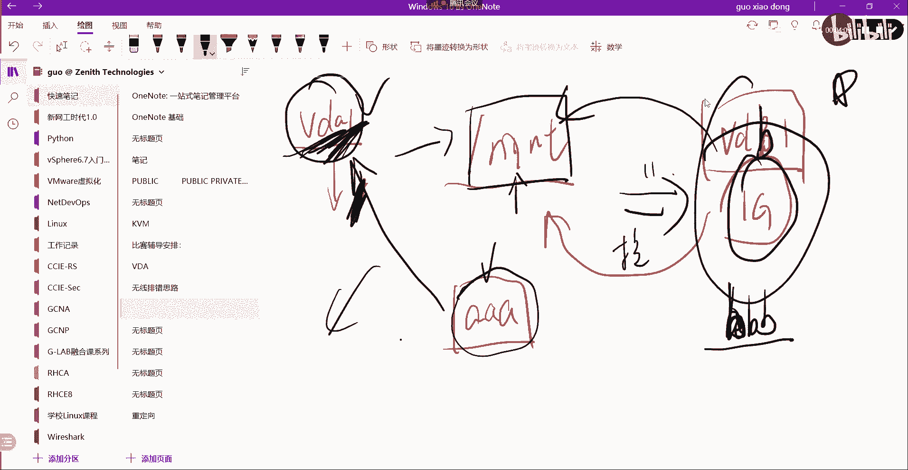
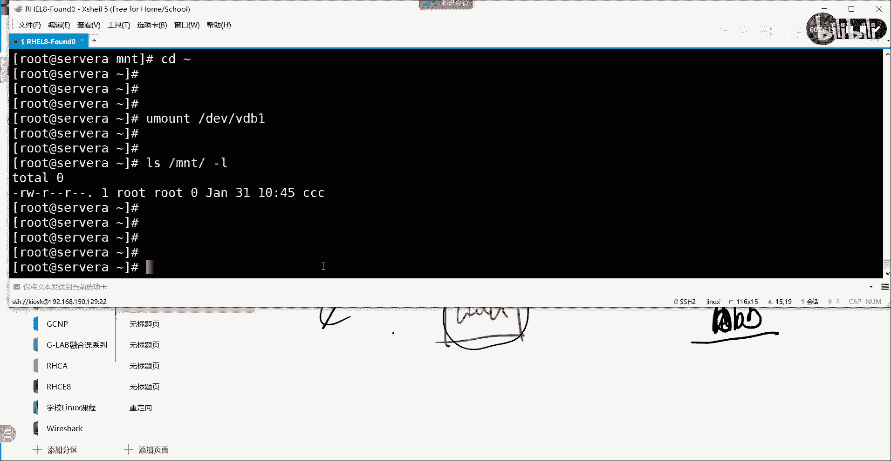

# 【Linux／RHCE／RHCSA】零基础入门Linux／红帽认证！Linux运维工程师的升职加薪宝典！RHCSA+RHCE／29-parted分区 - P1 - GLAB郭主任 - BV1bu4y1b7Rr

好了我们继续啊看啊，那个刚刚有个同学在现场问了个问题啊，他说那个，他说挂载的空间针对当前目录吗，说那个子目录啊，他是怎么用的对吧。

那我们来看一眼啊，他这个是要写一下，刚才，大家明白挂载的这个问题，比如说我这个目录叫mt对吧，然后呢在没有挂载之前，我给他创建了一个叫VDVDBE对吧，这个是我的一个G的空间，在没有挂载给mt之前。

这个mt它是有存放的地方，因为它会把VD是不是有一个VDA1啊，VIDAE的空间挂载给了根目录啊，mt是不是刚好在根上面对吧，所以我们要讨论的问题是在没有挂载之前，如果mt里面有一个文件。

假设是AA没问题吧，然后呢我又创建了一个G的挂载空间，创创建了一个G的挂载空间，叫VDB1，然后我把它挂在过去挂载过去，那我的问题是请问原来mt下面的AA在不在，我挂载过去之后又创建了一个BBB。

挂载过去之后，在mt下面又创建了BB，所以原来的在mt里面创建的所有内容，在不在在的，对不对，是在哪，是在VDA1里面的吗，是在这，这肯定是在的对吧，然后新挂载一个G的空间进去。

给mt mt mt l l看是看不到内容的，因为这块空间里头所有的内容都没有空的了，那么我创建了BBB是不是能看见BBB啊，明白吗，但是AA是看不到了，因为AA并不在我的帽子一个G的空间里面。

它在我的这个里面，在根目录下的VDA1里面能听懂我意思吧，但是AA没有消失啊。

没有消失，那么我给你先解释一下这个问题啊，DF杠TH现在现在根上面挂了很多东西，那么我的mt没有挂上来，我把它挂上来，MDEV下面的VDB1吧，挂给谁挂个帽子，然后在DF杠t mt是不是挂上来了。

然后我们CD到mt上面去，CD到mt上面去，我在mt里面原来创建了一个文件叫QWE，这是我创建的好，现在我把它卸载掉，我u mt u mot d EV下面的VDV地址，v db1是吧。

再看一下la4GMT是不是CCCCCC，不是我创建的CC是原来在mt里面创建的，这说明什么问题，说明其实你不要管这个目录目。

之前是放的什么东西，你只要把这个东西挂上去之后，那么所有在mt下面，所有的内容都会被放在这个空间里面，不管mt里面的子目录还是对吧，还是什么，有什么文件，只要在这个里边，所有东西他都会被放在这个文件里。

这个空间上，那原来mt上面的内容它并没有消失，它还存放在这个原来的空间上，那只要把它挂回来，他还是能看得见的，能理解吗，或者挂给其他的目录也是能看得见的，懂了吗，所以你不用不用去关心。

这个目录到底挂上来之后，他的子目录存放的时候放在哪，这个只要挂上来，他的文件或者他的子目录的，所有的文件都是在这个空间上，它子目录也属于他，对不对，他子目录是不是也属于台。

同志们，我在这里创建子目录，我在我已经挂上了以后啊，我在这里创建子目录，这个子目录里面的内容，也是属于我这里写的一个G的空间。

OK但是如果你现在在mt里面，假设一下，假设一下，mt我挂了，VDB1我挂了一个VDB1，一个G的空间大小挂了MD，我在mt下面又创建了一个目录，我创建了一个E1的目录。

然后我在E1的目录下面又建了AA的文件，听懂吗，这个是在下面的啊，是在下面的，那第一个问题是我的我的TAEE文件和AA，这两个文件放在哪个空间上，是不是放在这，是放在VDB一上，你能听懂吗。

然后这个时候我又做了一个VDPVDB2，一个G我把这个挂给了E1，我把这个挂给了依依，那请问挂上来以后，我还能看到一一下面的AA吗，一一能不能看到E1下去能看到AA吗，看不到，因为AA在哪里。

AA是不是在这啊，能听懂吗，那如果我在E1下面创建了个BBB，你能看到的吧，这个BBB在哪啊，是不是在这啊，理解吗，然后我再把我把这个挂载上来的VDB2，给它amount掉，卸载，这能不能看到AA了。

能不能看到A可以，因为你只要卸掉之后，他的父目录是挂在VDB1的，他的子目录肯定也还是到VDB1，上面去读取文件嘛，所以能看到AA能听懂的意思吗，就这个意思啊，就这个意思，所以你不用管你挂在哪儿。

它其实就放在那，你不挂他恢复到原来的空间，就要看他的目录放在挂在哪里了，目录上面那都能看到，OK这个要注意一下，其他的没什么好说的，那我们看patty，patty好，我们还是来来来来来划划空间吧。

我们还是来划分空间嗯，pit它的分区方式跟FDISK的区别，我先写一下plot和FDISK区别，FDISK大家会发现所有的分区都是交互式的吧，我F第四个进去，他让你分多少，你分多少。

他给你一个交互式界面对吧，什么NP什么分多少T能听明白，然后party是不仅可以支持交互式，还支持非交互式的，它可以支持交交互式和非交互式的，好这两个区别在我们的工作当中用用的话。

它的它的作用就很明显了啊，比如说现在我想让大家，我想让大家把这个server服务器上有100块牌，100块盘全部去分区，按照我的要求分区，这个要求很多啊，假设啊这边有N多个要求。

那么如果用FDK你怎么做啊，是不是一个一个登上去，每一个交互式界面都要按照这个要求去分一遍，听懂了吗，如果非交互式的话，我是不是可以把它写成脚本啊，我可以写成我们前面讲的办事的脚本。

然后直接刷脚本不就完了吗，听懂了吗，所以这就是非交互式和交互式的区别啊，非交互式的界面它可以支持批量操作，可以支持批量操作，这也是为什么现在红帽你看红包的官方教程上。

他并没有给大家讲FDSK全面用的是pet，还非常建议用这种方式理解我意思吗，但是平时大家在工作当中，如果不是写脚本简单的，你用FTK完全没问题啊，只要看结果，你画出来就行了，好不好，就这点区别来。

我们根据我们的要求来来来来实现一下，我们来简单的用pit来实现，先用交互式的方式来给我分啊，分什么呢，分MBR对吧，party也是可以支持NB2分区的，分MBR的话。

里边的要求是一个主分区加两个逻辑分区，两个逻辑分区，然后要分别格式化挂载好不好，第二个需求是用非交互式的来实现GBT的分居，我们也给他分一个加两个好吧，一个加两个逻辑分区，他们有两个逻辑分区了。

就三个分区，GBT没有什么逻辑分区，一个概念听懂了吗，做两个吧，简单一点好不好，大小无所谓了，来我们试一下怎么做，先看交互式的。

嗯LSBK先看交互式的，我们先把v db1给它去掉，DFT看一眼卸载掉，我们把他刚才用的是什么划分的，FFT杠TEV4VDBVDVDBVDB吧，P1下D1下，P1下W好了好，然后没了啊。

我们还是用VDB，用PARTED叫PTDV下面的VDVDB，这是不是交互式的，能看懂吗，各位好，这个时候他让你输啊，他他要让你输什么，输这个输这个，你看交互式的模式来帮我们创建主分区。

那么我要做叫mk part，这里要打叫MMMK，怎么打MKPART打这个MKPART，然后呢tab类型是因为我现在是什么，M k p a r t，就是我们用MBR的方式来实现分区。

所以他问你是组的还是扩展的，对不对，所以呢我们要打primary p i m a r y，他问你分出来文件类型是什么，这边就可以直接让我去他的文件类型了吧，我们用XFS好，从哪里开始啊。

第一块扇区是2048，是不是2048S小S小S是扇区的意思，OK好，到哪里结束呢，我们假设要给它分500兆到哪里啊，是不是可以写这500兆币，这样写可以吗，可以吧，好然后呢，做完了QUIT退出来退出来。

然后我们通过USBLK看一眼VDB1分到了，这是交互式的，各位能听明白我意思吗，嗯好如果我想看，我可以通过它叫PARTED，pd v下面的VDB1不要VTBE了，就print了PRINT，这就看到了。

通过这个命令pted dev print，看到我这个分的空间是从哪里到哪里，并且文件格式是什么，嗯各位能听明白吗啊MSDOS就是MBR啊，我这里的分区类型就是NBR，听得明白，OKOK好。

这个是用交互式的哎，这个做完还有一个命令要刷新一下，要通过这个命令去刷新一下，我们的注册新的分区的一个信息叫UDEV，这个命令大家考试的时候要打一下，不大可能到时候有些有些问题打一下啊。

这个面you device msit，就刷新一下内存，等待系统重新注册新的分区啊，就这么个意思好，这个做完了以后，我们还是给他做格式化，叫麦克FS点，我们给它格式化成XFX吧。

把DV下面的VDB1重新格式化了，应该格式化好了吧，好家杠F啊，好了，加个杠F啊，他提示你加杠F，你就叫杠F格式化好了以后，我们给它挂载上来，mt d EV下面的VDBE挂。

给mt k CD到mt下面去，LL没东西吧，创建一个东西，touch a l l有了吗，OK好，那么DF杠THXFS，这是通过party的话一样的吧，OK好，那么我们把它推出来，U mt。

DV下面的VDB1好，然后再看一眼，没了好删掉，怎么删呢，我们把刚才的那个删掉，好来我们把它删掉啊，P a r t d parted dev，下面的VDB是他吧，呃然后呢我们不知道怎么删。

Type help to view list h e l p，我们可以通过help来看一下，他会给你看到是不是RM啊，对不对，RM删掉，那么我们先看清楚啊，RM将里的这个东西是把它分区给删掉好。

Rm parted number，诶，刚刚是第几个来着，刚刚第一是吧，删这个啊，K和一吗，然后这个结束了之后，我们刚才是不是呃保存是什么来着，忘记了，是快退出啊，退出QUIT退出了好。

然后我们通过DEV下面的v DB p t print，没了吧对吧，然后建议大家做完了之后再叫ud v set。

刷新一下，然后再看一下，没了吧，好这是删除明白吗。

接下来我们用交非交互式的，给大家用GBT的方式来创建好，非交互式的，用GPT展成这样，非交互式的看一下啊，这么做的非交互式的p a RT e d pack，对的什么分区啊，对DEV下面的叫v dB是吧。

然后用它有一个标签叫麦克L，叫make lb l a b e l，这个是指定我用什么分区类型，OK好，那么这个分区完了以后，是不是他问你是不是要要要用这个GPT，是的啊，New new，应该这样子吧。

我GBT后面打个yes，看看new discla，哦GDP打错了，不好意思，GPT啊啊是的啊，就你这样后面直接加一个yes也是可以的，GPT对吧，这样就可以了，诶等一个yes也需要我去确认吗，好了。

那么嗯可以直接后面加yes啊，我觉得也可以不用加，刚刚可能是被我确认好，那么接下来我们开始分区这个分的话，如果如果是用mm br的话，这里就写什么，就不是GBT了，我们换一个，叫M还记得吗。

ms DOS吧，这叫MBR，好了好后呢，如果我再把它改回来，G b d yes，还是要确认，好那么接下来我们还是要分一个区域，怎么分呢，P r t t pted dv v d b，对不对。

好VDB我们要他用的是叫什么Mac，make part g b d是没有那个primary和什么什么对吧，直接去创建，我们来看一下啊，他直接创建直接创建嗯，我确认一下。

Make a part x x f s，然后写他的第一个第一个是2048，第一个扇区到1001造造币吧，这样写他会不会报错，You may need to update，诶可以可以，完了以后。

这就算就算好了，好了之后我们print一下，是不是有了明白吗，所以非交互式的，你看你只要把你刚才交互式的命令，直接往后加就行了，写在后边是不是就可以了，各位能明白吗，然后做完了之后。

u device set一下就好了，然后格式化麦克FS，点XFS，然后DV下面的VDB1后边加一个杠F吧，强制格式格式完了之后再挂载mt杠，mt杠DEVVDB1对吧，然后挂给了MNTCDMNT，没东西。

在touch一下AA一下好吧，DFTH挂上来了，这是通过非交互式的直接写的，明白吗，非交互式直接写的啊，好那这样的话就比较简单。

直接可以写脚本，比如说现在我让大家写一些需求，非交互式的要求，第一个给我使用GPT的分区分区方式对吧，然后呢分一个EXT4的大小是100兆的，这是第一个第二个需求分区swap swap分区。

接下来就要讲了，swap分区大小是100兆的，199兆吧好吧，然后再分区一个这个这个分区GBD嘛，就没有什么逻辑不逻辑了，分区这个一个G的，明白好，分完了以后格式化，格式化完了之后。

挂载这一堆东西我都可以写在脚本里面，每一个需求都可以写成一句话。

用这种方式写出来之后，直接把这脚本执行就可以了，就会很快明白这意思吗。

没有任何交互式的界面好，这就是非交互式的优点啊。

那么我们来总结一下他的命令啊，大家自己看吧，H i s history，那，这些这个是确定它的分区类型，这个直接就分区了，就开始分区，然后主要的是这个地方，这个就相当于N就是new吗，new一个分区。

这个是文件类型XFS，这个是从哪开始到哪结束，对吧好，那请问如果接下来我要建第二个分区该怎么写，我们现在已经建了第一个分区了，DEV下面的VDB1嗯，退出来，v DB print是不是进了第一个好。

我要从开始建第二个，是不是把刚才那句话弄过来诶，怎么写，这里第二个分区，我的文件格式不是XFSEXT4，这里写啥呀，是不是这个理解为要写第一个，第一个扇区写啥呀，是不是100几啊二吗。

造地到2001造币，可以吧，再print一下文件格式，没写NEXT4啊，是不是这样写的，你要你要自己往后加呀，自己往后加，这就是第二块序号，不用你管你的每一个空间分上一个结束，就是你下一个开始。

上一个结束就是下一个的看得懂吗，OK这里上一个结束就是你下一个开始自己上，帮你调整了，就这样来做的好吧，自己往后加就可以了好吧，其他的应该没有什么。

这是party好，接下来我们再补充一个这个party。

