# 【Linux／RHCE／RHCSA】零基础入门Linux／红帽认证！Linux运维工程师的升职加薪宝典！RHCSA+RHCE／30-交换分区 - P1 - GLAB郭主任 - BV1jz4y1A7NP

OK那么接下来就到了我们的第第四个，第四个内容叫交换分区，交换分区也是分区的一种，我们来看交换分区吧，这里留个思考题，交换分区，这里留个思考题啊，我们说啊TT也是可以用这个非交TT。

用非交互式是它比较常用的，但是如果想用FDISK来实现非交互式的，非交互的分区，也就是说你把FTK这种交互式的东西，能不能也写成脚本，让他来实现非交互式的可以吗，比如说我现在想划分，想划分一个。

我想划分一个主分区啊，我想划分两个主分区，嗯嗯怪不得学长三，我把这个需求写下来啊，脚本实现划分几个组分区啊，让我想想啊，N1N2就写两个吧，好吧，我们做的简单一点，我们想划分两个主分区。

两个为了你把后面其他的你只要往后加就行了，用脚本来实现思考一下会吗，用脚本怎么来实现这种，这个留在这，是可以的，就写起来比较麻烦而已，要把我们前面讲的东西用上了，好不管我们先先做，后面交换分区好吧。

好交换分区，第一个什么叫交换分区呢，嗯交换分区其实是我们经常提到的一个概念，内存的空间本来是有限的对吧，一个手动空间是有限的，那么我们是不是可以，硬盘的空间其实是挺大的是吧，空间比较大啊。

所以能不能就是实现硬盘的，从硬盘当中划分一些空间出来，从，从硬盘中划分一部分存储空间，空间存储存储空间用来干嘛，用来给内存，给内存做缓存，就当内存用吧，只是不是完全做内存处理，而是只是做内存的缓存。

能理解这部分的空间，我们就把它叫做swap交换分区，能听懂这意思吗，啊他就是用来做内存的缓存的啊，那么它是硬盘的一部分空间，它不是内存的空间，硬盘的一部分空间划出来，专门用来做内存的缓存。

这部分内容就叫做swap分区，OK啊这里要提到的是，因为这个交换分区啊在我们的硬盘上，所以呢相对相对内存的速度的话，它还是挺慢的，相对内存的处理还是挺慢的，他还是慢的，这就是我们要说的第二句话。

OK好交换分区的文件格式，交换分区的这个文件格式，它不是我们普通的LINUX，它叫linux swap，一会要改的，要改成把这个分区改成linux swap就可以了。

然后格式化格式化也是跟之前有一些不太一样，格式化swap分区用的是它叫Mac s w a p，swap加Mac swap对吧，没有任何点，之前是Mac fs什么什么什么的，对不对，去跟格式化。

用它来给大家演示，接下来格式化分区做完，他还得激活，要激活交换分区才能使用，这个激活使用的命令用的是什么，Swap on swim，好一会，那停用呢，挺有用的，是4s w a p swap of好。

这两个要注意一下好，接下来所有东西都弄好了以后，格式化也都弄好了以后，接下来就是挂载，挂载跟之前明显没什么区别，挂载跟普通的分区一样啊，没有什么特殊的，直接挂就可以了，好不好好不好，然后呢。

最终是查看有一个查看的命令给大家总结一下，查看这叫s w a p swap on，杠杠SHO啊，这个是最终要查看交换分区的，来我给大家演示一下如何去创建一个交换分区。

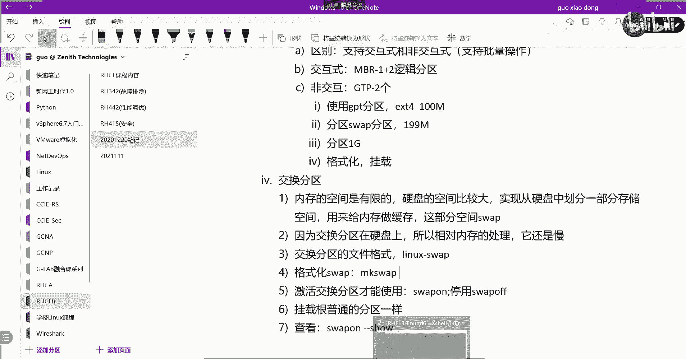

就这么多了，好就这么多，我们用CDASBLK我们用它来，我们用VDC吧，好不好，我们用fdisk f f disk，用什么都行啊，自己看DVVDC好不好，P1下好，现在是GBD。

我们把它改成NBROP一下，好就变成DOS了，好就变成DOS之后呢，我们新建一个分区主分区对吧，第一块没问题，结束一个G没问题，是的好，P1下好，这是第一个，你看tab类型就是一个普通的LINUX。

明白好，接下来我们把它再新建一个，新建一个随便一个P1个，第二块500吧，P1下，现在我们要把这一块的tab类型，把它改成swap分区，好一会看一下，这个时候大家找一下swap是几啊。

八是几12K不一样吧，GBD的是19是吧，GPT格式的分区改它的type类型是19，NBR改它类型是82，所以在这里我们直接改T了，改第几块啊，第二块，然后把它的类型改成82，然后再P1下。

看看是不是丝滑板，看到了吗，好说明我们要把某一块分区做成swap版，主分区是不是可以做主分区，是不是可以做成12分好，再再再做一个扩展分区，扩展分区第三块没问题，剩下的都做，然后再建一个第四块。

再加500兆，没问题，再P1下，我是不是做了一个扩展分区，这很明显是一个扩展分区吧，对不对，那么我能不能去修改扩展分区，也把它改成swap分区，80几22P一下，可不可以呀，也可以呀，所以再加一句话。

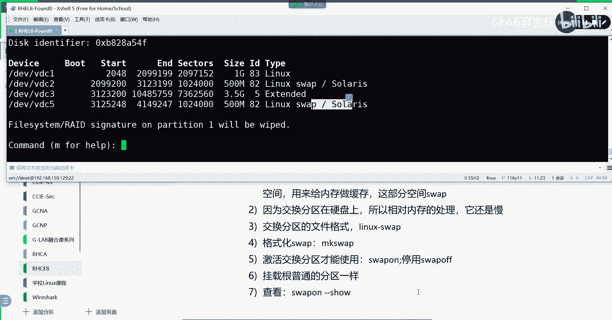

主分区如果是MBR的话，NBA分区格式分区类型，还是主分区和逻辑分区，这叫逻辑分区都可以作为swap。

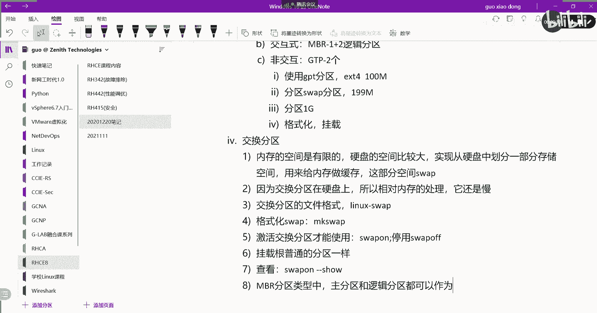

能理解吗，是不是两个都给你解释了，那个分区的时候，那个不是123，他为什么会把四调掉，我们我们不是都是默认的吗，不是默认这个不是默认，因为我把你想啊，因为我把前面两个做成主分区。

我把剩下的所有的空间都做成了扩展分区，都做成扩展分区，我们的默认的逻辑分区就是从第五个开始的哦，逻辑分析就从第五个，前面四个是留给那个前面用的，明白吗，所以他都是从五开始的，所以你前面有四。

它就有没有四。

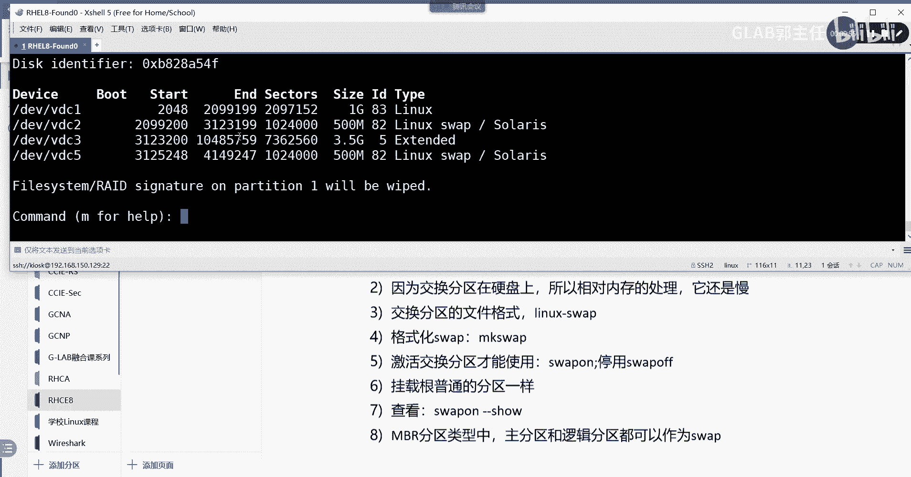

那就没有四，好不好，说到这个我们再再提一下，如果我现在在创建分区的时候嗯。

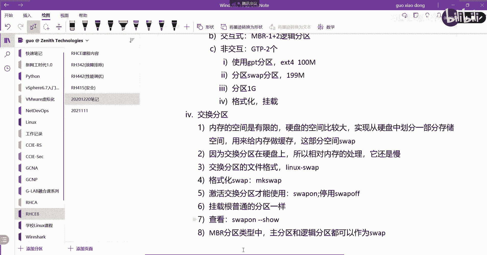

如果我现在创建分区，我只创建了四个主分区，但是我的每一个，我四个主分区用到的这个分区空间，加起来没有达到硬盘的上限，就是我硬盘有500个G，我分了四个主分区，我每个主分区分了给他一个G。

那是不是还有490多个G啊，那我请问剩下的490多个G的空间，还能用吗，你能听明白我意思吗，一块500G的硬盘，我分了四个分区，就分了四个，而且都是主分区，每个主分区占一个G。

我还剩496个G的空间没有分出去吧，这496个G的空间能够用吗。

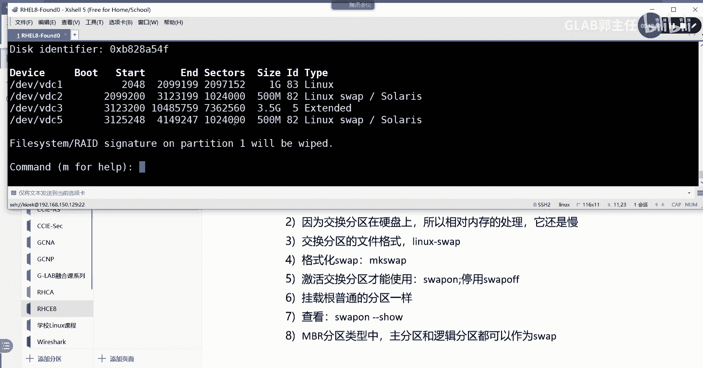

可以被谁用啊，能不能用，不能不能明白吗，不能啊，补充一下第十个对吧，这句话怎么说呢，就刚才你提到这，我想到了一块硬盘，如果分成四个P对吧，而且有没有用完的空间，剩余的空间将无法使用，分层。

四个P就是四个主分区，明白吗，然后呢，而且有空间没有用完，没有用完，那么剩下的空间将无法使用，听懂了吗，而且剩下的空间将无法使用啊，OK好，刚刚我是不是有一个，我这里有一个错误，更正一下，不好意思。

这个地方刚刚脑脑袋短路了啊，这个我刚刚说，是不是一块盘可以分两个扩展分区啊，这不对，一块板只能有一个扩展分区，至少一个主分区好不好，这个更正一下，我写一下，一块硬盘只能有一块扩展分区，对吧。

然后至少一块主分区，就这个意思，不要跟这一下，我看到这，我想起来一块硬盘最多只能分一个扩展分区啊，这个要更正一下好了，现在算齐了啊，上面的特点NB2分区这块齐了啊，这还有最后一句话，好了吧。

记好了记好了之后来我们看看扩展分区啊，啊叫交换分区。

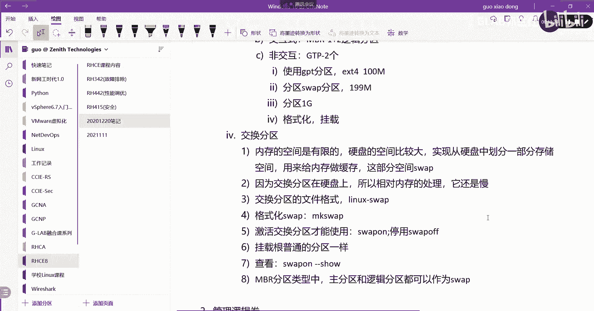

来我们做一下交换分区，交换分区我们已经看到了啊，所有的东西呃，LSBOK我们看分了这么多，分了这么多这么多啊，我们来看我们把两个都做成了swap，好在分完以后，我们接下来格式化格式化。

他用的是它特殊的格式化方法，叫mk swap，我们把DEV下面的VDB级啊，哎忘记了4VDB2是吧，把它二做成了swap分区VDB2了，swap分区，OK好，格式化完了以后，我要用它的话。

你要通过swap swap，Swap on，要要用它后面要加的DEVVDB2，要这样，后面不能不加，这个时候你再看一下就有了，所以这个是看你后面这个秀加不加，他都能看，刚才直接打死外方法。

是不是没有任何交换分区挂上来，然后你这个叫启用，启用完了再看一下就有了，这东西不好，然后我们把swap5也挂上来，五不也是swap吗，哎NO such file or没有格式化。

没有格式化是没办法挂上来的，对不对，所以你要通过max swap呃，从五开始了，第一个交换分区吧，No such file i will be again，哦写错了VDC5是吧，我刚刚写的是VD几啊。

V d p2，V d2，写错了，来看一下FDISKDEV下面的VDBP一下，这个不行啊，这个格式没改，你就算那边格式化也没有用啊，明白意思吧，就一定要用VDC呀，写错了啊。

OK这里看到的有不代表是可以的，它的格式不对，我们应该用VDC2和VDC5来再看一下啊，mike swap在DEV下面的VDC2好，还有一个VDC5好了，然后我们把它挂上来。

swap on d EV下面的VDC2，V d c5，一个一个挂上来，然后我们把swap swap on看一下，虽然是三个，但是VDB2没有用，我们把那些off掉。

swap of d EV下面的VDB2，再用swap帮我看一下，应该看到这俩才对，为什么呢，嗯因为FDISKDEV下面的VDC，你P1下看到的它的类型一定要是swap，否则它不能充当内存的缓存。

这里要注意这个一定要改完改成功才对啊，就算看到他不能用啊，用不了，Swap，看到有两个啊，500G好，这个是怎么去看啊，就这么简单啊，其实就是它的类型不一样。

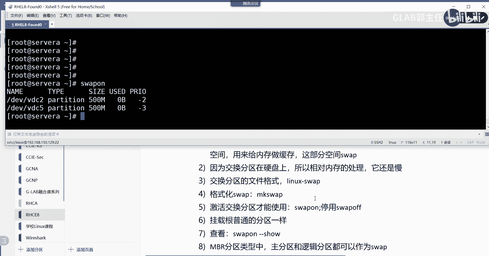

格式化方式不一样，其他都一样，这个没什么好讲的了好吧，然后大家大家把这个实验，170一页的实验做一下，就是交换，这叫什么叫叫叫开放式实验，171来71，然后呢后面还要补充一下，这是交换分区对吧。

我们现在说到现在一直在说分区嘛对吧，接下来说它的格式化格式化我们总结一下吧，大部分的格式啊都用Mac fs后面加点，对不对，后面点你想把它格式化什么格式，后面点就用什么，这是大部分的分区的格式化的方法。

就用它，然后有一个不一样，Mac s w k，Mac swap，这是格式化交换分区，其他的没什么了吧，就这么说吧，格式化就说这么多，然后呢挂载挂载说一下挂载，我们一直在给大家用的是临时挂载。

就是直接mt挂载，对不对，mt第一个应该是你的挂载点，把语法写一下，第二个是你的挂载目录是这样的吧，OK好，如果不报错。

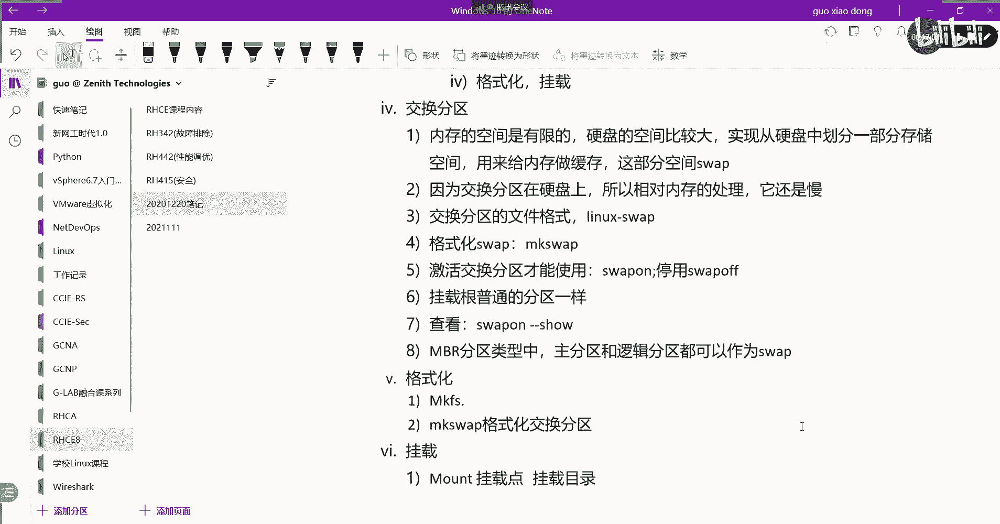

mod临时挂载不报错是最好的结果，如果你的mod在挂的时候发现有报错，那你说明肯定哪里有问题明白，所以不报错是最好的结果。

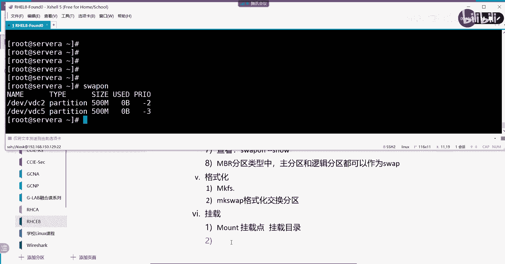

那么接下来我们给大家来讲一下永久挂载，永久挂载就要用到FETABLE这个文件了，这个文件在哪，在etc下面的FETABLE。

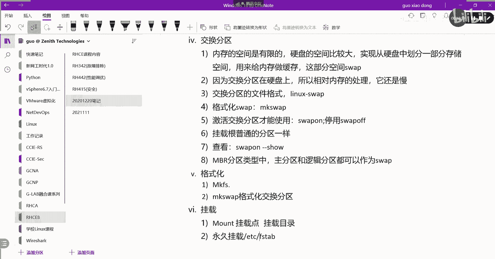

听懂了来，比如说啊，我们现在呃swap on直接把它启用了以后，我们交换分区，交换分区它要在它重启之后，他的这个挂载也会也会也会也会消失，所以说我们要把交换分区挂在FETABLE里面。

重启之后它才能够永久挂载，我们现在DK这样子啊。

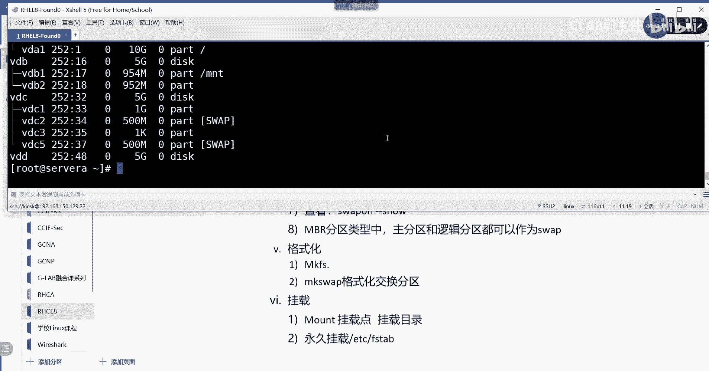

mt是不是也是我临时挂载的，各位能听懂我意思吗。

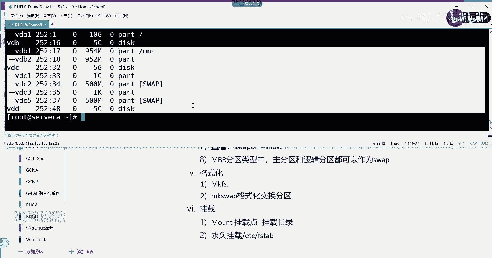

然后我把server也重启一下，我们现在都是用的临时挂载，重启之后你再去看，发现这地方应该就没有了，VTB1应该就没有MNT挂载，这是临时的，然后这个应该swap也是要也是会消失的，挂载不上。

等他重启啊，我们稍微等一下，那么想要让它永久挂载，就需要去看我们的etc下的FTP，要去编辑这个文件，我们把这个文件详细的一会给大家讲一下，我先登到B上，一会等AA起来了以后，我们再做啊，在哪里。

在vim etc下的FACTABLE，看这个文件，这个文件呢G啊，我翻到最下面这几个字段，我要给大家讲一下，这个是默认的默认系统，安装完了之后就有一个挂载，因为系统文系统是装在VDBABDA1里面。

对吧，VDA1本身是要写进这个文件，重启之后才能成功加载系统，如果连系统的盘都没有写进FETABLE永久挂载的话，你的操作系统每一次重启根本起不来，听懂我意思吗，所以默认系统安装完，它默认是有一条。

这就是你的操作系统的挂载的，永久挂载的这一条，我来简单解释一下，他有几个字段需要大家知道。

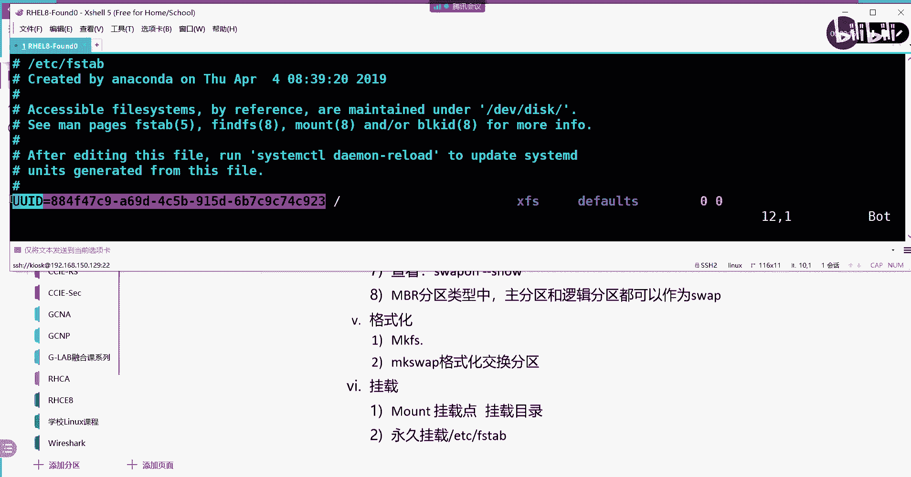

第一个第一个字段，第一个字段可以是UUID吧，或者也可以是你的挂载点，对不对，或者是你的挂载点这都可以，这个挂载点就是DVVDVDAVDBVDC，明白吗，这是第一个字段啊，好这个比较重要。

建议使用我们的UUID，UUID是每一块存储分区的唯一标识啊。

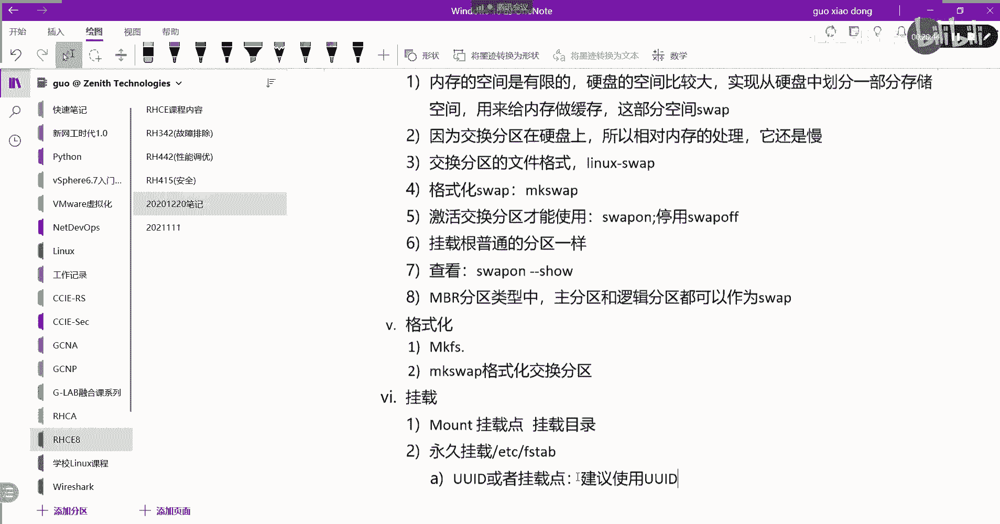

每一块存储空间都是有它的第二个字段，这里这里是什么挂载目录是吧。

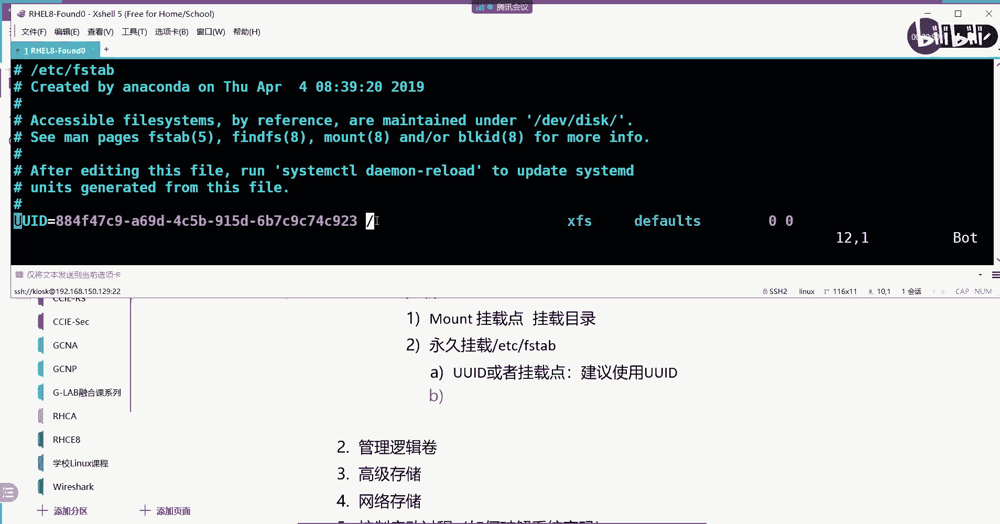

这叫挂载目录挂载。

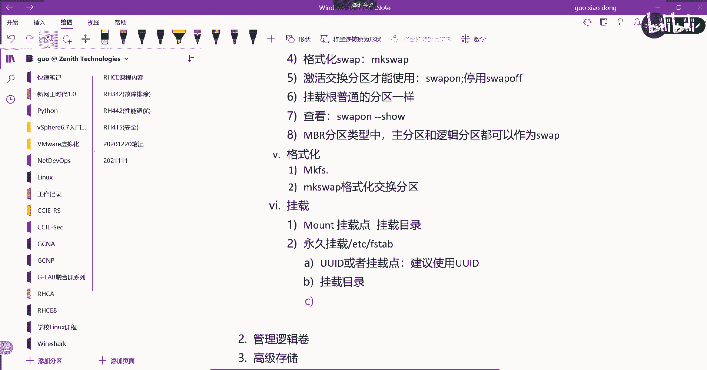

很明显这块是可以跟盘用的，装系统的，第三个呢。

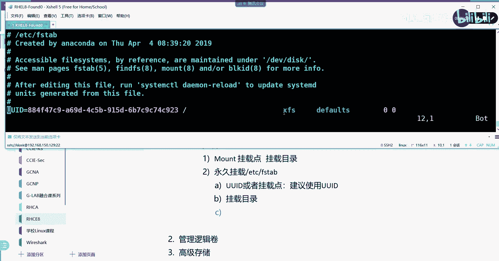

第三个XFS，这是什么文件格式。

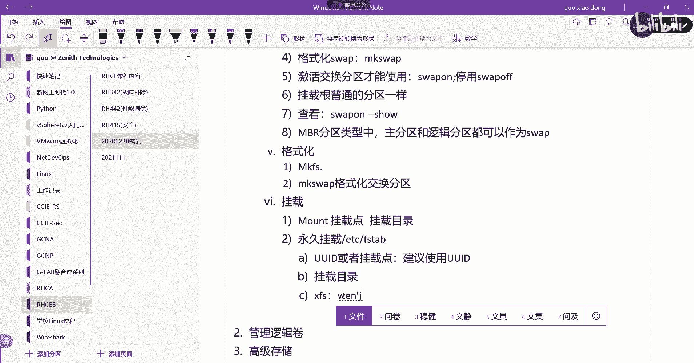

是不是。

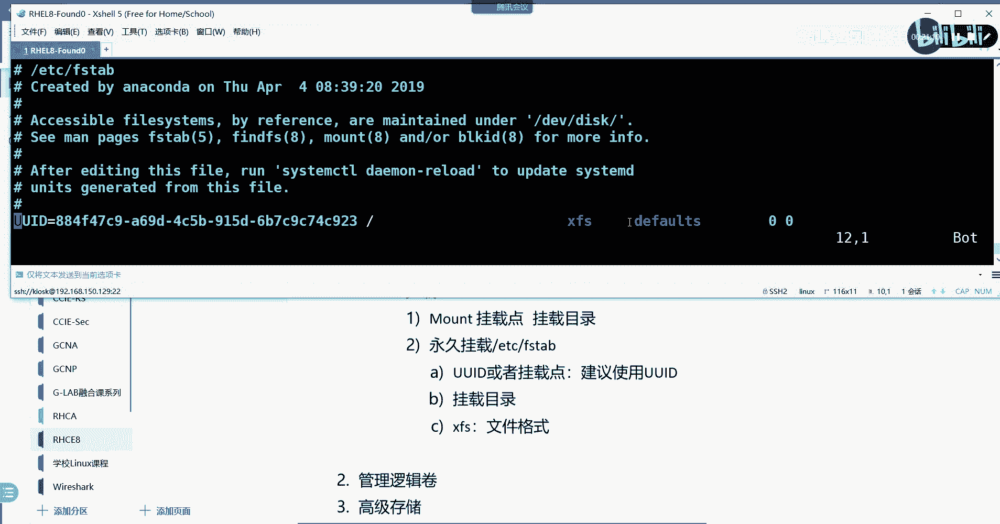

default啊。

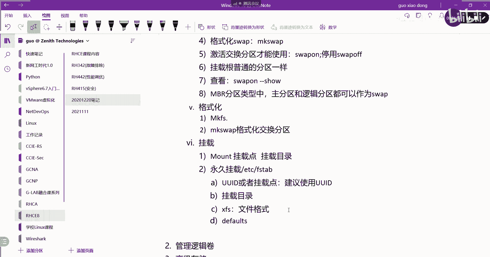

这是什么意思啊，这个是他在默认的一些参数选项，如果没有特殊的参数都学到了一会，接下来是能学到的，网络挂载的时候。

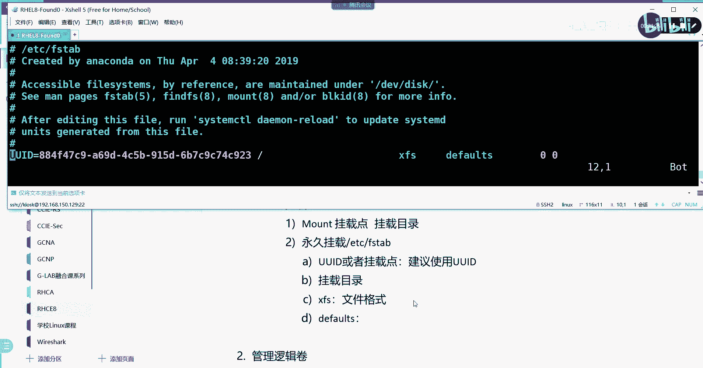

这个地方要做一些参数的修改，这个叫嗯挂载选项，挂载选项啊，这个是没有的话，就用默认没有特殊的，就使用defaults，明白我意思吧，然后最后最后两个第一个零，第一个零，第一个零分是不是校验。

第二个零是不是呃。

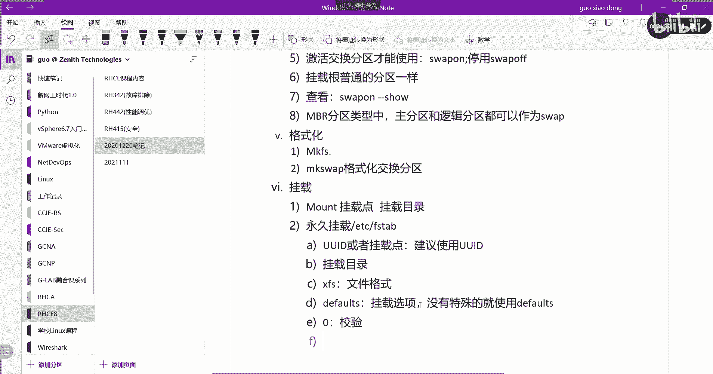

第一个零代表的是是不是备备份还是交易。

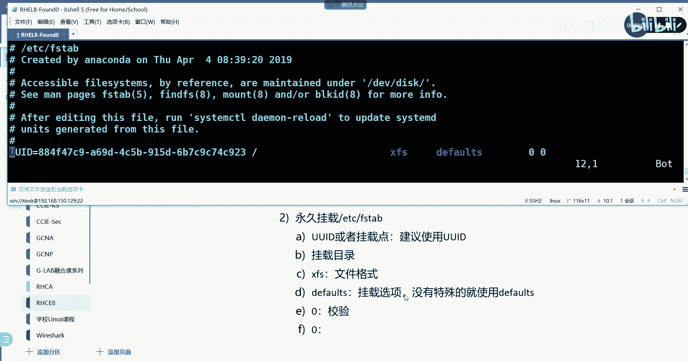

是不是要检查备份，我不知道哪个了啊。

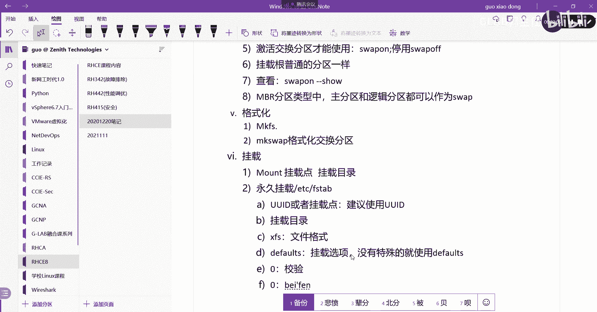

大家都无所谓，后边两个要么一个是备份，一个是校验，一般都是不需要的，不需要关心，所以都打零，明白吗，所以都打零，OK这是这几个值要提到的东西，那么关于中间到底怎么去隔，是不是要像他那样对称。

我建议最好像他这样对称，其实中间你只要建一个空格就可以了，就是每一个选项之间只要建个空格就可以了，如果你写的跟他一样对称的话，可能会更好看一点，理解吧，好我们到server a上好。

server a完了以后，我们DF杠大TH是不是没有了，刚才是不是还能看到VDB能挂给mt吧，现在是不是都没有了，swap是不是也没有了，各位明白吗，LSBOK但是我们的分区是不是存在啊，V d b1。

VDBVDC2和VDC5是不是都有啊。

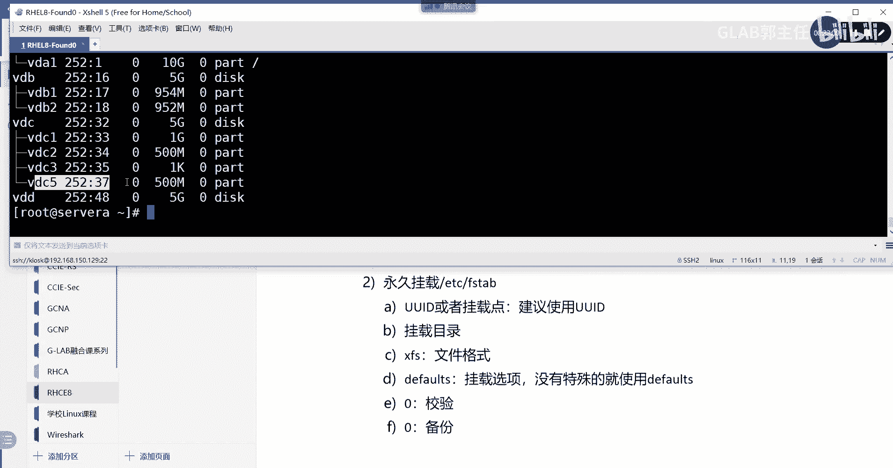

好这是因为重启之后，所有的临时挂的全部消失。

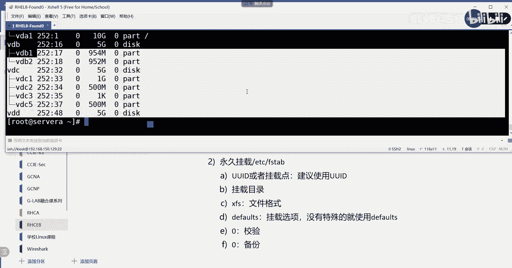

我要想让它能够永久挂载，我们现在就两个了，一个是VDB1的分区，一个是VDC2的交换分区，我想把这俩永久过来，是不是要写啊，怎么写，是不是要看UIDUID是杠杠FS啊，后面加一个杠杠FS。

你会发现看的要多一些，我们看先看VGB1，是不是他对不对，来我们来复制一下啊，XFS看清楚啊，复制，然后去编辑etc下的，好在这里我们shift g切到最后一行，然后打一个O快捷键，然后开始打UU。

UUID等于刚才你复制的那一串，不要写错，很多人很容易复制错，一定要复制这个，明白对应的VDB1，后面的3F到BB结尾的3F到BB结尾，空格挂给谁啊，挂个mt，然后往后刷啊，写着对齐的XFS没问题吧。

DEFAULTS后面有个SR，我都能把S给漏了，零零没问题吧，这是挂载mt，第二句话，UUID我是不是要挂在交换分区，交换分区我们就挂这个吧，所以你要复制一下他，然后粘贴过来。

好这个地方请问交换分区是挂给谁的，有人懵逼了，是交换分区挂给内存的，这边写什么，写内存是吧，肯定不对嘛，对不对，交换分区没有挂载的目录对象就不要写，你接swap，这里这里写swap，明白吗。

格式就是swap，没有什么参数，Default00，这个能看到吗，交换分区的区别就在于它没有挂载点，他没有挂载给具体的目录，它是给内存用的，所以在这个地方写swap就可以了。

那么它的文件格式类型也是swap就可以了，听得懂吗，来保存一下，好，这个写完以后，我们还要做一件事情，还要做一件，你要测DF杠TH，你现在是不是看不到，你虽然写在文件里头。

这个文件是不是要挂载上去才能看得到啊，怎么把这个文件生效，我们是不是要用临时挂的呀，你通过mt杠A它就可以，他就会去读这个festival文件好，这个时候还是一样的，不报错就是最好的结果。

然后再用DF去看挂上了没有，帽子挂了吧，再看swap好，swap网还是没有，因为swap交换分区的临时的启用，和普通的磁盘带分区的临时启用，不是用的同一个命令吗。

交换分区是不是swap on device，什么VGC2吧，是这个吧，然后再看一下，有了吧，所以这两个要看临时的不是同一个命令，普通的是mt杠A，如果交换分区是用swap这个对象，听懂了吗，各位好。

然后呢这些都弄完了以后，我们再来测测，就重启一下，再重启一下，如果重启过后能看到，跟我这里看到的结果是一样的话，那就说明我们做的是对的，这叫永久挂载，明白不重启之后，它还还还在啊。

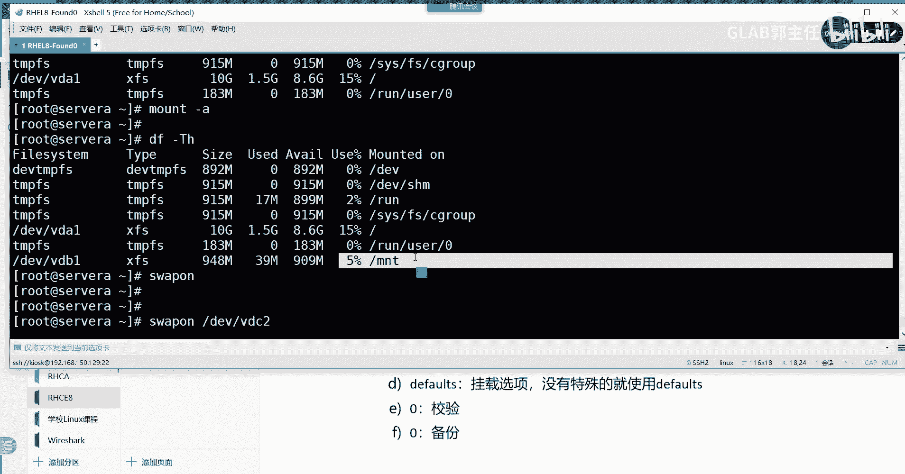

重启之后还在，所以呢我们永久挂载也说完了。

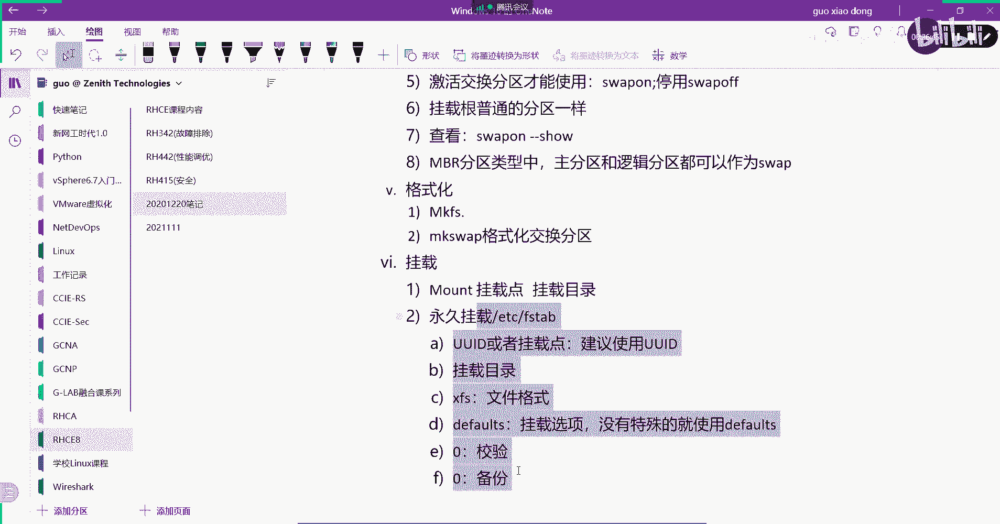

一会儿等它重启，我们验证一下好吧，我们重启之后给他来验证一下啊，好的话，前面的这些东西做完后面就很快了，因为就是在我们的这些分析基础上，来进行逻辑卷的划分啊，什么高级存储网络存储啊。

就是在这个基础上再去做其他东西。

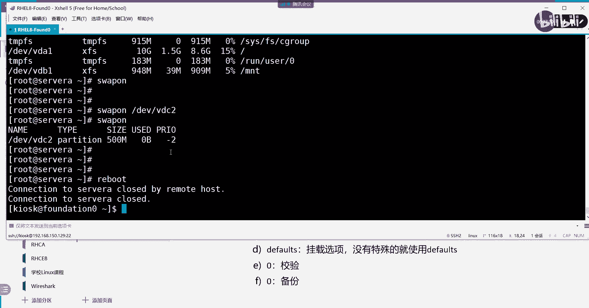

分区搞清楚了吧，分区挂载这些东西啊。

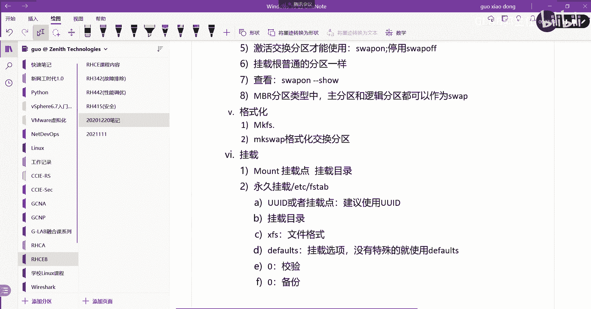

等一下，等到7号，好嘞我们看啊，他应该起好起好了，我们DF大TH看一下mt是不是挂在上面，没有错吧，VDB啊，然后swap我看一下是不是也在啊对吧，所以在考试的时候，大家一定要把所有的东西都做完了。

重启重启之后再重新检查一遍，检查的是什么，检查的就是你的永久挂载是否有效对吧，因为很多人做完看上去都是挂载好了，但一重启所有东西全丢了，都失效了，那是因为这个就是这个特点，好吧好吧。

那就是我们的这个分区啊，分区和挂载，其实这里边的内容挺多的。

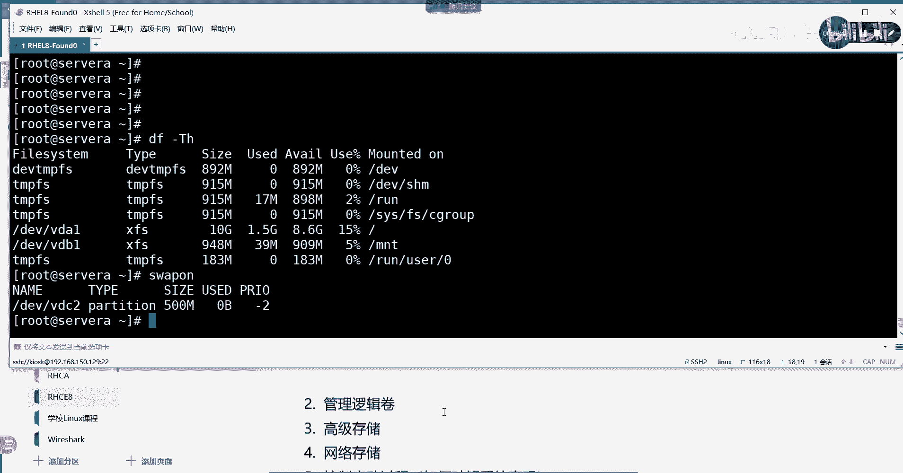

有分区两种分区方法，总结一下吧，两种分区方式各自的特点是什么，然后各自的这个这个，这个各自特点和各自的区别，然后呢两种划分的命令，一种FTK，一种用pit，他们都能做NPR和GBT的划分。

它们的区别是什么，交互式的怎么做，非交互式怎么做，最后呢其实他们都可以支持非交互式的，只是FDSK特别麻烦给大家留着这个思考题啊，我把答案给大家，大家自己想一下是不是这么个意思好吧，我把答案给你。

是不是用我们之前讲的从标准输入到标准输出，用EOEO杠E啊，是在它是一个标准的那个交互式呃，你可以试一下，用这个来试一下，看看能不能用FDISK实现一句话，把我需要的东西都搞定，就比较复杂。

你看这个东西多烦，我用PDD直接不就完了吗，pd非交互式写的比他清楚多了，听懂了吗，这个我也给你们，大家有兴趣的自我自己去研究一下它，每一个斜杠什么意思啊，OK然后呢这个两种划分分区的方法。

接下来讲交换分区啊，交换分区是内存的缓存，他有一套自己的东西啊，他们不一样格式化啊，也总结了交换分区和普通的磁盘分区的格式化，最后挂载挂载重点讲了永久挂载，永久挂载，这个是大家最基本的操作啊。

有很多是需要大家永久挂载的好，还有一个按需挂载，在后面的auto fs会给大家讲到，就按需下载，会讲这个网络存储的时候会讲到按需挂载好吧，那下午这些东西教一下，我这是上午这些东西说完下午的就快了。

然后这些就很快在前面的分区基础之上，直接只要知道大家怎么做就可以了，然后高级存储也是的，网络存储也是的，就比较快了，好不好，让我们先去吃饭。

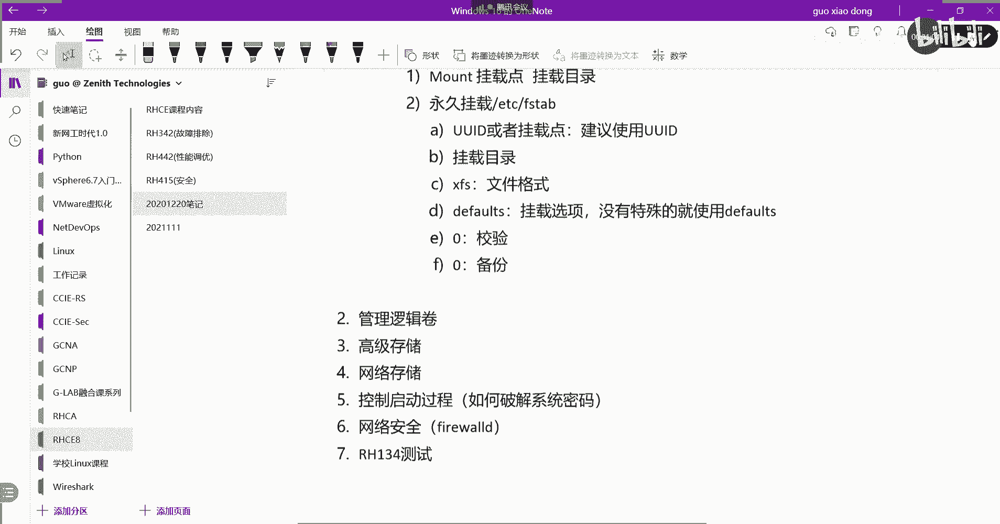