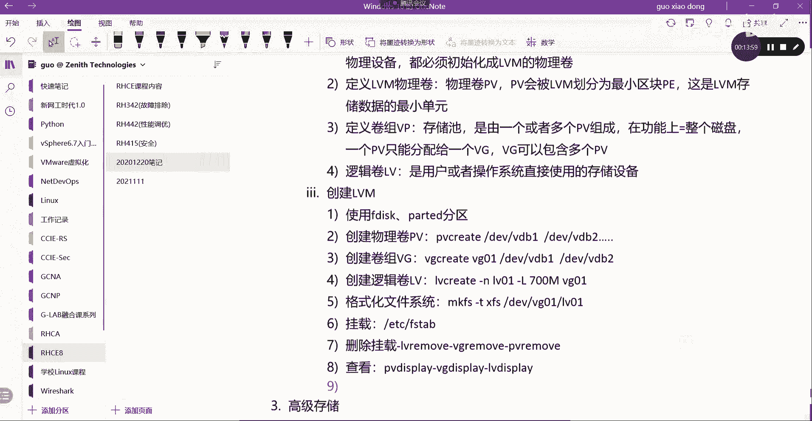
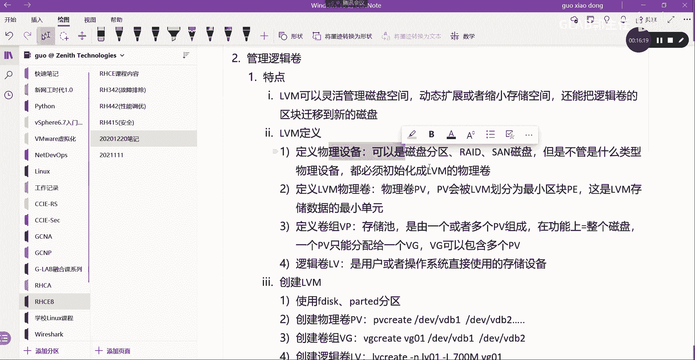

# 【Linux／RHCE／RHCSA】零基础入门Linux／红帽认证！Linux运维工程师的升职加薪宝典！RHCSA+RHCE／31-逻辑卷LVM - P1 - GLAB郭主任 - BV1zG411S7Di

好我们来看，接下来我们到逻辑卷啊来看啊，呃逻辑卷，高级存储和网络存储三个都是考的内容，那现在逻辑什么叫逻辑卷啊，逻辑卷它全称叫LVM，叫LVM逻辑卷对吧，那么逻辑卷可以更加灵活的这个管理。

我们的磁盘空间啊，这什么意思呢，就是我们在刚才的分区过程当中，大家有没有发现我的分区如果不够了，一般会怎么样，我分了十个G不够了，这个分区不够，你是不是它没有一个动态让大家去扩是吧。

那如果我分给他封了十个G，觉得有点多了，我能不能把这个空间腾出来对吧，就是给给给给节省出来，给其他地方用，发现是不能的，对不对对吧，所以真正的在我们的呃系统的运维当中，真正在用这个存储空间的时候。

也不是用我们刚才的分区啊，这是最基本的一个操作，我们应该用分区为最基础的方式，然后在这基础之上用逻辑卷，逻辑卷的好处就体现出来了，它可以啊，特点吧，特点或者是概念，第一个它叫LVM。

它可以灵活的管理空间，可以灵活的管理磁盘空间啊，具体体现在可以动态的记住哦，是动态的，可以，它可以动态的扩展或者缩小我们的存储空间，这一点就是分区啊，基本的普通分区是不可以是做不到的对吧，然后呢。

还可以把逻辑卷的空间内容迁移到其他磁盘，还能够迁移，还能把罗辑卷的区块，我们把它叫做区块啊，它叫区块存储的迁移到，新的磁盘，这是他比较重要的一个特点，明白意思吧，然后呢，接下来我们对LVM。

这就是它核心的一句话，它的作用它可以扩展空间，缩小空间，还能够迁移这个逻辑卷子上的内容，Ok，我们怎么去做这个逻辑卷，大概分几部分，我们首先要定义它分几个部分，首先要定义我们的物理设备，这什么意思。

我们不管是什么类型的存储技术，它都需要依赖底层的分区，或者用底层的硬盘都可以，他在最底层的叫物理设备，这个物理设备可以可以是什么磁盘分区，我们刚才是不是在讲分区啊，可以是磁盘分区，还可以是什么。

是不是可以是read阵列啊，对吧，还可以是什么sin，就是网络的一个磁盘阵列都可以，但是设备必须要被初始化成，这个逻辑卷的物理卷，但是不管是什么类型的物理设备，都必须，初始化，LVM的物理卷。

这叫物理卷，听懂了吗，OK也就是你可以用刚才的分区，但是一定要用刚才分区的话，要把它定义成我们的LVM的物理卷，OK这叫物理设备，好，第二个定义我们要定义我们的LLVM的物理卷咯，就跟上面讲的了。

对不对，在使用硬件存储之前，必须要初始化成PV物理卷，它有一个另外的英文名字叫PV，对吧好，那么LVM工具会将PV划分为物理区块，P，PV会被LVM划分为，最小的区块它叫最小的区块，一会都能看到的。

它叫POK，那么最小存储块是用来存储数据的最小单元，这是LVM存储数据的最小单元，OK好，这是第二步要定义的，我们的物理卷，物理卷定义完了以后，我们可以在上面需要定义它的，第三个内容叫卷组。

要定义卷组叫VP啊，卷组叫VPK，那么卷组就是我们这里讲的存储池，它就是我们的存储池K存储词好，它是由什么组成的呢，它可以是由一个或者多个PV组成的，看清楚他的逻辑关系啊。

逻辑卷其实都需要一级一级的去定义的，先要考虑到哪些可以成为我的逻辑卷的，物理设备，刚刚写过了，那么接下来要把物理设备放到逻辑卷的物理卷，也就是要定义这些物理卷，定义完了物理卷之后。

在物理卷之上要定义我们的资源池或者叫VP，它叫卷组嘛，要去定义它的卷子能听懂吗，所以这个卷轴是可以由多一个或者多个PV，组成的，那么在功能上与基本存储中的整个磁盘类似，在功能上啊，等于我们的整个磁盘。

你可以把它写成等于我们整个磁盘对吧，但是有一个要注意的，就一个PV只能够分配给一个VG，但是一个一个，但是VG可以包含多个PV，好这句话能听明白卷子啊，卷子我们一个PV就是物理卷。

一个物理卷只能属于一个存储池，但是一个存储池可以有多个物理卷，就这个意思好，第四个需要定义的就是它的最小的一个单元了，叫逻辑卷，逻辑卷叫LV，好驴啊，逻辑卷是用户和操作系统直接使用的存储设备。

它是用户或者操作系统，操作系统也是可以啊，也就是也就是我们的这个系统的文件，是可以装在这个LV上的，操作系统是用户或者操作系统直接使用的，存储设备，OKOK好，那么这就是我们最终给我们用到的。

这我们直接接触到的其实是逻辑卷，最上层的叫叫LV，所以它叫LVM嘛，叫逻辑卷的管理嘛对吧，OK我们用的应该是LV啊，它上面都有一些其他的定义，这个听明白了哈，好听明白以后，接下来我们来看一下嗯。

创建逻辑卷，如何创建好，大家来跟我一起回顾怎么去创建，第一步应该干嘛，使用前面讲的FDISK或者party来分区是吧，对不对，来根据我们的要求先把区分出来对吧，那么就用我们这种分区的。

默认的LINUX的这种这个分区类型就可以了，那至于用MBR什么M2B，或者说GBD无所谓的好吧，这第一步，第二步创建物理卷，对不对，创创建物理卷用的是PVCREAT叫p v create。

叫pv create，然后把DEV下面的VDB1听懂了吗，或者DEV下面的VDB2，把你把你的刚刚创建的那一堆分区，都可以放进来做成我们的物理卷，这就是声明物理卷，能听懂吗，这就是声明的物理卷。

然后接下来我们要创建，创建什么物理卷叫PV啊，我们这边简单的这几个对应的名字，把它写上去，第二个创建卷组，卷轴是什么，是VG啊，对不对，创建组是VG，那么就用VG，Vg create，对不对好。

然后VG01，然后DEV杠VDB1，或者DV杠VDB2，这个能看懂吗，我就是把这两个PV都放进这个VG这个组里面，所以说一个VG可以包含多个PV，能看懂吗，这就是我的VG的这个名字，就是VG的名字。

OK好，第四步，创建逻辑卷，创建逻辑卷，LV好，这怎么创建，是不是lv create好看啊，Lv create，创建逻辑卷，杠N指定名字，比如说LV01，可以吧，然后杠大L。

我们刚才刚才不是已经有了卷轴这种存储池吗，我可以在词里面按需的去划分，我想创建的逻辑卷，所以通过杠大L来指定我要创建多大的，多大的LV，听懂了吗，好700，比如说我想创建一个700兆，然后在哪里呢。

在VG01里面划分，所以这个看的很清楚啊，我创建一个需要用到的逻辑卷，在VG的这个池子里面指定了700兆，我可以创建700兆，这个能看懂吧，OK好创建好了之后呢，LV就是给我们直接用的。

那么用之前还需要干嘛，是不是格式化呀对吧，格式化需要格式化我们的文件系统，这种格式化文件系统，跟我们刚才的格式化文件系统就不太一样了，他这么做的叫麦克FS也是一样的，其实差不多啊。

我这里用的是Mac fs gt x fs，然后DEV下面的就不是某一个分区了，就是VG零一下面的LV01能看懂吗，对吧，就这样做啊，就这样做，然后最后第六步挂载呗，挂载我们可以选择用永久挂载。

在etc下的FETABLE里面去编辑这个文件，实现永久挂载，听得懂吗，UUID挂载点，就是跟我们刚才讲的是一模一样，明白OK好，就这么做啊，好，那么如果我们想要删除我们刚才创建的逻辑卷。

请问我创建是不是从上到下，一步一步往下创建的对吗，删除的话应该是从上到下一步一步往上去删除，删除能明白，我把这个删除的过程给大家写一下，如果你挂载已经有挂载的，要先删除挂载，删除挂载，这是第一步。

第二步，第二步删除，先删除哪个啊，是不是要先删除LV啊，创建lv lv create，删除lv remove r e m o v e，明白删掉了以后再删vg remove吧，明白KREMOVERVG。

删完了再删PV，这个能看到吧，所以创世先从PV开始创建，删除应该是从LV1级一级的往上升，你不能直接把这个下边没删，直接把PV删掉，这个他会报错的，理解我意思吗，OK所以这个是删除啊。

好然后这个查看的一些命令，我也给大家总结下来了，查这些都比较简单啊，查看我想查看怎么做，怎么查看啊，如果想看PV，那就是p v d s p l a y DP v display吧，然后呢VG。

还有什么LV，啊这是查看清楚了吗，好来我们开始做一个简单的演示啊，我们来做一个简单的演示嗯，我可以怎么做呢，啊我可以在我的这个这个这个实验拓扑当中。

我们来看LSBOK在这里，我刚刚是不是创建了一大堆东西啊，你看啊，我问大家一个问题，我是不是可以把v DC下面的这四个分区，或者呃这四个分区全部放到逻辑卷的PV，定义成逻辑卷的PV，可以吗。

可不可以把这四个分区先不要看swap啊，假设他不是swap，我可以把这四个分区主分区也好，扩展分区也好，把它定义成逻辑卷的PV。

可不可以可以啊，没问题啊，这边不是有写吗，它的定义物理设备是不是可以是分区啊，明白我意思吗。

OK再来再来一个，再问第二个问题，我可不可以把如果没有分区的，没有分区的情况，有分区一定要定义分区啊，如果没有分区，我把VDB1和二删掉，VDC1到五都删掉，我可不可以没有分区的情况。

我可不可以把VDB，VDC和VDD都定义成逻辑卷的物理PV。

区别是什么，刚才定义的是分区，现在定义的是直接是这块磁盘嘛，是不是可不可以啊。

当然可以呀，可不可以啊，诶可以吗，来我们试一下好不好，现在不是有一个完全有一个v dd吗，他没有做任何分区吧，我可不可以把这个v dd给它定义成我们的PV，我们通过pv create是吗。

我们把DEV下面的VDD可不可以呀，可不可以，是不是已经successful了，已经好了呀，对不对，听懂我意思吗，各位OK，没问题啊，可以的，那么我们现在把VDVDVDB2也放进来，V db2。

这里边有东西是不是也放进来了对吧，说明什么p v display，看一眼是不是有两个东西放进来了，一个是VDB二一个是VDD，能听懂吗。

所以作为逻辑卷最底层的物理设备，它既可以是一块没有分过去的物理硬盘，也可以是一块分过区的分区。

听懂了吗啊，都可以啊，都可以好，这个就是我们第一步先通过pv create啊，定义我们的物理卷好，接下来，Vg create，那么创建VG01了，对不对，然后把DEVVD我们把把哪些东西放进来。

VDD是不是一个对吧，还有一个VDB2吧，是不是也是啊，已经存在了，我们可以写在写在VDD，然后呢DEV下面的VDV2已经存在，然后我们通过vg display看一下，Vg01，我们里边有多大呀。

这是多大，五个G5个G刚才是VDD是吧，VDDVDB没上来，VDB2没上来，来啊我们重新来好不好，我们要把这个呃，要把我们刚才定义的PV要放到VG里面去，vg create应该是这个吧，零一。

呃VG01已经存在，哦对了，VG要把它加进来，我看一下啊，加进来创建，已经创建了vg extend cre，嗯ext extend v g01DEV下面的v DB two，好已经加进来了。

然后我们再来看vg display，是不是加进来了五个G加900多兆。

总共是两块在里面嘛，明白意思吗，OK就这里再补充一下啊，创建的时候啊，就是你可以你可以先全部创建，你像这样的方式，就是把这两块都放进这个VG01里面，作为他的卷轴，但是如果你只放了一块。

把后边一块要加进来的时候，这就不是叫vg extend是吧。

就这个vg extend是我这里打的，这个把它加进来了，空间就变小变大了，能理解吗，各位OK，这个无所谓啊，好放进来以后，接下来我们要做VG的，要做LV是吧，好LV，Llv create gun。

指定一下名字了，LV01了对吧，杠大L指定一下要创建多少兆了，700兆在哪里创建呢，在VG01LV不就创建好了吗，l v lay创建了一个700兆大小的，看得懂吗，对吧好。

LVM我们可以看出来叫l v skin，看到了是不是有一个700兆的，看到了吧，好这个LV就算创建好了，创建好了之后，我们要格式化了，Mac fs点XFS，这个是可以量格式化的，也可以加杠T啊。

就是杠T指定XFS，这是一样的，能听懂吗，OK好，然后点嗯XFS对哪个呀，对DEV下面的VGDEV下面的，DEV下面的VG01LV01，是不是这个给他做格式化，格式化好了，格式化好了之后，用刚才的挂载。

我们来简单的用临时挂载，mount d EV下面的VG零一下面的LV挂给谁呀，挂在mt可以吧，然后我们CD到mt下面去，里边没东西，我们可以touch一个文件可以吧，好DFTH这个是临时挂载。

我们是不是看到了有这样的一个挂载，看到了你看到前面有这么一串啊，有一个map什么的，这就是逻辑，能理解吗，这就是逻辑线，OK那要让他永久生效，我们必须得通过，必须得通过在哪呢，在逻辑卷在哪里啊。

是不是这个，它是member对吧，应该是这个我们要把它复制出来，然后我们通过vim etc下的FETABLE去编辑一下，在最下面加一行UID等于，是不是这个对吧，这XFS不不不挂给谁，这边写错了。

挂给谁啊，挂MD又挂上了是吧，我挂给其他的，比如说这里也可以挂个MT，然后把这边写x fs default，后面不写了，能听懂吗，这是永久挂载啊，这是永久挂载，OK那么这就是我们从创建一个来看。

从创建物理卷，再创建VG，再创建由V在格式化再挂载，那么我们要删掉怎么办怎么办，这边有一个命令，刚才打了，大家有没有留意啊，叫2v game，这个是查看我机器上有多少个逻辑卷。

并且他的状态是不是active sky，OK好，然后呢这个我们要删掉一个删掉，所以首先我们必须把它，EMTDV下面的VG01也有V01，EV下面我要把它卸载掉，他叫mapper，busy哦，我正在里面。

好现在先要卸载，这第一步就是我这里的删除挂载，如果把它删掉，如果没有，那就用u mt把它卸载掉，第二个先从lv remove删掉呗，对不对，那么名字叫LV01，Lv remove，哎。

是这样子这样子删掉吧，他说需要移除这个逻辑卷吗，是的，移掉了，然后你再通过lv display，看一下是不是没有任何东西了，要看到没有东西了，然后再再3VG啊，Vg remove dev。

是不是v g v g remove，把VG01删掉，删掉了吧，然后在vg display看一下是不是也没东西啊，明白再把PV删掉，PV3的pv remove，p v remove一个一个删哦。

我们把DEV下面的VDD删掉，可以吧，VDB2去掉了，然后还有一个v dd去掉了，然后然后你在你在这个pv display没东西了，然后lv skin没东西了对吧，TF杠TH刚才挂载也没用啊，对不对。

没有map什么东西了，没有了吧，能看懂吗，OK所以删掉删除从前一级一级创建，从后一级即删除，就这么干的好，接下来我们来讲一下逻辑卷呢，它的这个比较特殊的地方。

我们可以对它进行扩展，LVM的扩容，LVM的扩容和缩缩，小扩展和缩减，我们把扩展到和，缩减对吧，我们可以扩展，也可以缩减O好，那么我们也可以把他的这个，从一块逻辑卷上的内容迁移到另外一块上去。

在这里也会一并给大家去讲，我们先来记好不好，扩展扩展这个卷轴是增加额外的物理卷到PV，到我们的这个里面，来把这个图给他画一下，把这个图给大家画一下，首先我们就不管最底层了，我们就直接说pp v好不好。

那PV1PV2，这个是声明出来的吧，对不对，然后PV3这些都是我声明出来的，然后每个PV都应该放到一个叫叫池子里面，这个池子的名字叫VG，我们把PV放进来，PV1放进来，PV2放进来。

PV3放进来能听懂吗，OK好，然后我们在这个池子里面要划分我们的VG，在池子里面是不是要划分LV吗，划分的这个LV最终是不是给我们的某一个，某一个mount某一个目录去用啊，是挂载给挂载给某一个目录。

是这样的一个逻辑吧，听懂了吗，好那如果现在我们要讨论的是，如果现在我的LV这个空间不够了，这个不够了，我可以直接通过逻辑卷的方式，通过LV的扩容，让原来划分的这个LV变得再大一点，听解理解我意思吗。

好如果觉得这个LV空间比较大，我想把它缩小，那我可以通过LV的技术把它缩小，所以可以更加灵活的去控制，挂给目录的存储空间的大或者小，理解吗，那么迁移也是这样的，我可以把挂载给这个目录的LV01给它。

迁移到另外一个，我重新创建了一个LV02上去，数据是可以完全呃完成这个所有迁移，而不影响数据的，这叫迁移，各位能听明白吗，好那么如果说LV不够，我可以这样扩容，没有任何问题，让VG不够。

是不是也可以扩容啊，VG是基于PV的，对不对，所以后面又有一个PV4，PV5被我声明出来了以后，我可以把PV4也往里面放，PV4把PV5也放到这个VG里面，那VG的池子是不是就变得更大了，变得更大的话。

那就相当于从空间上来看，是不是扩容了，危机啊，理解我意思吗，VG池子大了，我里面创建的LV的个数是不是也变多了，LV的大小是不是也可以变大，所以扩容其实就在讨论，可以对我们的VG进行扩容。

也可以对我们的LV进行扩容，好能不能对我们的PV进行扩容啊，PV这里一个一个出来的，这个是扩出来的吗，这个是定义出来的，对不对，明白吗，你得有物理设备被定义出来成PV，你才能往里面放，听得懂吗。

比如我买了三块板，我把三块盘都定义成了PV，送到了VG里面去，这时候三块盘不够了，不够PV怎么来，你得去买啊，买一块PV回来是不是插上去，插上去之后你还不能成为PV，你必须要声明一下。

新插的第四块盘变成PV，它才能被放进VG这个池子里面，各位能听懂吗，所以扩容和缩小，他强调的并不是对PV进行扩容和缩小，而是对我们的VG和LV，所以只有VG和LV之间的扩容和缩小，能听明白我意思吗。

OK好，那么我们来把这个内容整理成我们的笔记，嗯第一句话，物理卷是通过什么硬盘的增加，来扩展，它不是通过这个LV扩容来来增加的，一定要通过硬盘的增加来扩展明白，OK那么嗯，好这是第一句话，第二句话。

那么我们要扩展或者叫扩容PV，扩容PV，这个不能扩容，这个只能增加，对不对，所以我们就不讨论扩容PV了，我们要讨论的是扩容，VG扩容VG应该用刚才已经演示过了，是不是vg extend对吗对吧。

Vg extend，VG01把DV下面的SDB2加进来，这就是扩容飞机，刚才已经讲过了，好缩减呢，缩减VG缩减微机用的是缩减VG，缩减VG就是把这个池子里面，把这个池子里面的PV拿掉嘛，对不对。

OK所以缩减VG我们用的是刚刚也讲过了，用的是VGMOVE用的是vg remove吧对吧，用的是VG呃，呃缩减缩减VG，我们用的是pv remove，不好意思，移除VG当中的PV。

用的是pv remove d EV下面的那个VDB2，OK没问题吧啊好，那么嗯这是缩减，然后扩展LV呢，扩展LV用的是lv extend对吧，extent gu杠大L是不是指定要扩展多大呀，加300。

加300的意思就是在原来的基础之上，额外再加300的空间，这叫扩容吗，原来是什么DV下面的VG01，下面的LV01，是不是这个啊，听得懂我意思吗，各位OKOK好，那么缩减呢，这是缩减，这是扩容VLV。

我们要缩减LV用什么，比如说我现在有个L我现在LV是700兆，我想给它缩减缩减，Lv，想清楚是不是有还是lv e x t n d extend col，我是不是可以减啊，我既然用加，我就不能减吗。

我是可以减的，减个200兆，这就是缩减DEV下面的VG01，下面的LV01可加可减，减就是缩掉了，对不对，然后加就是增加了，都是通过lv extend来做的，考试有一题就是让大家扩容。

OK没问题没问题吧，他那个lv remove用在什么时候，LV的remove就直接删掉了，他直接就把这个LV的整个都删掉了啊，OKLV这就是直接删掉了啊，好注意，第六个，大家想一下，不管是扩容还是缩减。

除了扩之外，我们还要做一些什么操作啊，想一下我们把刚才的过程再梳理一下，比如说我现在创建了一个PV，然后呢创建了一个VG，然后又创建了一个LV，这个LV我创建的是700兆，没错吧。

然后这个LV创建好了之后，我是不是要给他做格式化，格式化了才能被挂载这么一个流程吧，现在呢我觉得这个700兆不够了，我想给他扩，我给他加了300张，OK好加了300兆，那它就变成一个G。

不是是不是一个G1个G，OK假设就是一个G了，那这一个G要能够全部被用的话，必须有一个前提是什么，你真新增的这300个灶有没有被格式化呀，所有的空间新增或者缩减，它都要重新去。

我们把它叫做重新去刷新一下它的文件格式吧，要刷新一下它的文件格式系统，你新增的300兆他没有去指定它的文件格式了，700兆是指定的，听懂了吗，所以你新增的300兆要能够被正常使用，需要重新格式化。

格式化，为什么用刷新，而不是用格式化，因为你用格式化700兆内容不全，被你不要影响700兆里面的文件内容，去刷新一下新增空间的文件系统吧，听懂了吗，这样的话他们就统一统一规范成一个文件系统。

那就达到扩容的目的了，所以简单的只是扩容，不能够做到文件的安全，或者说正常的存放，还要对文件系统进行刷新刷新，一定要刷新，大家知道为什么要刷新，对不对，刷新文件系统，OK好，刷新文件系统它是分的。

如果你原来的文件系统格式是XFS，那么它刷新文件系统用到的就是XFS下横杠，它有一个叫group g r o UPS，G r o w f s g r o w f s，然后把你刚才的那个MT这个是挂。

一定是你的挂载目录啊，后边跟的是你的挂载目录，而不是你的挂载点，如果是XXFS，它是用这句话去刷新的，OK那么如果是EXT4的话，那就用的是另外一种方式了，文件系统EEXT4K好，他用的是resize。

这个要记得考试的时候，因为你也不知道它让你扩容的文件系统，原来是什么格式，我也不知道没有准确答案，这个是考场，看看题目自己去选择好，Resir e s i d e r f s。

用这个命令DEV下面的怎么VG，零一下面的div01，呃呃我们统一的写它的挂载点挂载目录吧对吧，统一写的挂载目录，还有一个文件系统，文件格式是什么，还有一个我们学到现在是不是还有一个swap。

swap应该用的是mk swap，这个是没变的，原来swap就是用它来格式化的，OK好，然后MNT他没有挂载点，用Mac Mac swap，怎么这个后面跟的就是你的分区了，或者说你的逻辑卷都可以。

因为他没有挂载目录嘛，那就是DEV下面的VG01，下面的LV01最早来几好吧，如果是普通的逻辑的话，去重新刷新文件系统，不同的格式用的是不同的命令，主要就记这俩swap分区跟之前是一模一样的。

它不需要记的，直接max swap就可以了，各位能听明白我的意思啊，好来我们来把这个扩容做一下。

现在啊刚才全部删掉了是吧，我们重新来做一个，我们把一整块VDD放进来，p v create d EV下面的VDD，第一步，第二步，Vg create v g create。

然后VG01把DEV下面的VDD放进来，这第二步吧，第三步，Lv create gun，指定一下名字咯，VG01是不是G啊，这是不是VG是LV01，是不是啊，然后呢杠大L指定它的大小。

假设我们假设先给他个200兆，200兆好了吧，好呢，去哪里呢，在哪里，在VG01里面去分，这个看得懂吗，嗯好他说里边有内容，是不是要创建好，创建好了好，我们一起来看一下，先从lv display看一下。

创建了一个200兆大小的lv vg display，看一下VG，第四回来看一下是不是有一个VG，一整块盘是5G的是吧，这是VG10的总大小，然后pv display现在只有一块盘被放进，定义成PV。

所以只有一块，看到只有一块好，那么这个是要能够用的话，我们要对这个文件系统进行格式化对吧，所以麦克FS点，假设我们给它格式化成XFS，那DEV下面的VG零一下面的LV01格式化，格式化完了之后。

我们要对它进行挂载，我们都要对它进行挂载，我们用临时挂载的方法，mt在DEV下面的VG零一下面的LV01，对不对，我们给它挂载给谁呢，我们随便给他挂一挂载给嗯，挂载给是不是有一个就media。

是我就直接挂给他好好DFTH，看一下是不是挂了media x fs没问题吧，各位好了，好了之后，接下来我们要对它进行扩容，我把它扩成700张就加500张，对不对好，首先我们先一个来讲。

如果我们想要给VG进行扩容，这个前面讲过的是不是通过vg extend的对吧，vg extend直接把东西放进来，在VG01里面，我们把DEV下面的，都断了，现在转圈现在好了，那我们继续啊。

好这个时候我们要对VG进行扩容的时候，你这里按tab键，它能帮你补，他补出来的只能是被声明的PV，刚才我是不是只有一块盘被声明PV，而且被用掉了，对不对。

所以还得先通过pv create去声明一个新的PV对吧，新的PV我们就用VDP2好了，设定好了，然后这个时候再用VG去增加VGEXTNT，把DEV呃叫VG01，要指明一下，要要给每一个卷组给扩容吗。

DV下面的VDV2是不是放进来了，好这个是对VG进行扩容，那接下来我们想对LV进行扩容，那应该用lv extend是吧，lv extend呃，这个，杠杠杠N是吧，杠N是LV01，然后指定一下杠大L。

我们要加500兆，在VG里，我看看啊，不需要不需要直接加杠杆子名字直接加诶，因为是extend，直接指定杠L大概是扩多少，然后指定对哪一个逻辑卷是吧，之前的tab键就补齐了。

看到了lv extend杠L加500，DEV下面VG01LV01扩容好，这个时候我们再去看DFTH，有没有变成700兆啊，还是100还是200，对不对，为什么，是不是没有做刷新刷新刷新这个动作要做。

那么你得先通过DF杠T去看它的文件格式，是不是XFS，是的话，那就刷新一下刷新应用，我们应该是XFS，那就用XFS下横杠叫grooves对吧，然后对我们说可以对我们的挂载点。

这个挂载点是media对它进行刷新，然后再DFTH变化了没有，700多吧，差一点无所谓的啊，差一点无所谓，差不多是这么个情况，这个就是扩容，听懂了吗，那缩减呢，缩减，缩减来吧。

好还是用这个lv extend杠大L，我们给他说一个减200兆，现在700，现在应该是到时候应该是500是吧，对这个DV的VG，呃他说什么，Error，嗯我想想啊，报了个错，错误的argument。

错误的参数，这样子不能用减吗，哦这个杠L是肯定是的。

然后加他只能往上加，我看看他没有减，他没有减，不会吧，加16兆，special物理，这个没关系，怎么解，他解释LV的reduce，等会我来试一下啊，杠L减200兆，在DV的log是的。

好然后呢我再在那个再刷新一下是吧，我们先没有刷新DFTH还是还是700是吧，然后我再刷新一下XFS下横杠，GPSDEV下面的VG，下面的零一，下面的LV版，It's not a mont，没有瓜。

Lv skin，这里是变了，看到了吧，这就是我们U1下呃，u mt d EV v g01LV零一啊，对密点，好DF杠TH没有了，然后重新mt一下，DVVG01的LV01挂给million。

cannot read这个block div map，重新挂一个不能挂，就经常会有这种问题嗯，我看看啊，LSBLK哦，它变成VG01杠，LV0145百兆，是缩短了是吧，刚刚写错了。

他DUCE之后发生了一些变化，哎mount media，其实还是这个啊，还是这个，那为什么挂不上呢，可能要重启一下，AOSBK就是这个吧，就是这个已经缩小了，已经缩小了，已经缩小了，这个是没问题嗯。

我挂个test吧，我看看在DEV下面的map上面的VG01，我重新换一个挂给这个家目录下面的，也就是当前目录，再来一次我重新刷新一下啊，X fs grooves dv mapper vg。

嗯不是穿那种嗯，DV下面的VG，上面的map，上面的VG，不要用杠F好是好了，TFTH等一下啊，是这个问题，稍等好一会给你们讲啊，然后这个DF干看不到了，我们重新来挂一下MMT呃。

DV下面的VG零一下面的LV还用这个挂，我还挂了个灭点，现在好了，DF杠TH是不是500兆好了吧。

好这里要说一下，缩减的时候会有一个问题，LV缩减，首先它叫它叫什么，它叫reduce是吧，REDUCE啊，Reduce reduce，然后加加这个减掉减掉就可以了，这里要说明一下呃。

缩减的时候它会面临一个问题或是没有问题的，你直接将空间加进去，把加的东西呃刷新一下，他就跟那个原来的一起来用了，所以框没有任何问题，说有什么问题呢，说的话，因为你根本不知道你说的这部分空间里头。

有没有内容，对不对，有没有数据，这是一个很重要的问题，比如说原来我是700兆，你想把它说成500兆，他可能数据零散的分散在存储空间上的对吧，然后他肯定要把这200兆给relax出去，要释放出去是吧。

释放出去的时候，他要先做第一步就是把这部分的文件先迁走，从这边迁到另外一个地方，也就是他并一定要先让他做一个文件的合并，或者文件的这个处理，处理完了之后，你再用reduce再去减少，就没有任何问题。

原始文件是不是还在刚才我整个操作过程，我没有做这个合并的操作了，没有合并操作这一块的空间，什么情况下才能用，是不是我重新格式化了，重新Mac f f s就可以了，对不对，就可以用了。

这说明在缩减的时候一定要做一个操作，就是要把他的文件要要要要从要要移调，怎么以这个命令再补充一下，然后漏记了，就是缩减之前，要要先把呃这个叫什么文件内容合并，这个合并的命令用的叫PVPV叫嗯对。

就是pv pv move叫pv move，将数据从一块物理卷上切到另外一块物理卷，那应该叫嗯，让我想想这个是怎么个用法。

他应该用move来移，但是可能不是pv move来吧。

我现在还是把这一块说成300可以吧，DF杠TH我们不格式化，把它说成300，现在是500，我给他说成300，那么在做之前应该先用，我现在是LV吧，lv move有吗，vg move有吗。

pv move有吗，只有pv move嗯，我想想啊，刚才用的是lv reduce是吧，Lv reduce，这块应该怎么做，我看看VG有什么，好MEMBRINE对吧，应该是这个啊，好VG，零一。

呃这个是迁移吗，我看看啊，V g01，啊VGVG杠VDVG，然后就是做一个迁移，就把一个地方就可以看到VG名字叫这个，然后要名字叫这个，这改名字吗，不可能，他是把一个不活跃的VG。

把它合并到一个活跃的微机里面去，应该不是这个，遇到小问题说的，稍等一下啊，看一下看一下教材，大家看一下教材啊，我这个命令有点忘记了，在扩容的一部分，应该在，缩小啊，现在问题是在缩小上啊。

前面增加没什么问题，稍等一下啊，在194页来看一下，还真没有缩小，LV没有缩小的，教材上好像没有缩小，他只有扩大缩小的是另外一个，就是他会把逻辑卷，他会把PV啊，PV在缩小啊，对，他会把VG里面的PV。

从一个地方迁到另外一个地方缩小，没有LV的缩小，LV缩小，如果没有提的话，我记得印象当中好像就是我刚才的方法，不应该啊，应该可以呀，当然一般缩小的情况其实也比较比较比较少见。

我试一下吧，好不好，如果只有这一种情况，也有可能他也是我们做LV缩小的方式。

他没有啊。

教材上没有，教材上没有LV的缩小啊，我们先把这个情况再给大家画一下，理解一下我要做什么，是这样子啊，现在呢我有两块盘，一个叫一个叫VDVDB2是吧，还有一个叫VDD，这两块全部被声明成了PV。

然后把它们全部放在了VG里面对吧，那危机里面分了一部分的LV出来，这个LV的空间是我们现在的五百五百兆，现在我想对这个LV的空间进行减少，扩扩就不用说了啊，我想给它减少，给它减少成300兆。

OK那么应该要先对LV里边的内容进行规整规整，然后再给它缩小，这样的话不需要对整个空间进行格式化，那么在他整个的教材当中，其实他有提到的是有一个叫PV的，PV的move是呃我我我现在需要缩小的时候。

我不是直接缩小URV的，它是把上面的东西从一个挪到另外一个上面去，比如说我会把这个是五个G，这个可能只有一个G，我先把这个里面的PV大声明过的，PV的内容先没入到这个上面去，这个mod的意思就是。

如果你的下边的LV存放的文件，占用了VDP2里边的空间的情况，它会把它的内容，先通过pv move移到另外一个盘上去，移移到另外一个盘上去，然后移移过去之后，你可以操作的是把这个盘从VG里面拿掉。

这样的话VG空间是不是达到了缩小了，就达到缩小的目的了，然后呢这只是对VGVG小了LV。

这个时候我是不是可以对它进行减小，接下来就是我要做测试的一个事情来吧，来试一下，首先啊DFTH看一下，这个已经被挂在了media里面，没有任何问题，好，现在我们通过pv move把DEV下面的VDV2。

我给他move到DEV下面的VDD上啊，没有没有没有任何数据，没有任何数据，这个时候我就可以通过pv remove，把DEV下面的DEV下面的VDB2对吧，把它给移掉，So please use a。

他说让你用VG的reduce，先用vg reduce从里面移过，移出来，好，VG的reduce，把d EV reduce，V g01，下面的DEV，下面的VDB2，先把它reduce掉，OK好。

这个reduce完了以后再通过pv remove对吧好，现在我们通过vg display看一下，应该里面只有五个G大小了。

只有五个G大小了以后，这个时候其实已经把上面这部分东西都去掉了。

他已经没有了，那么怎么怎么在减少我的LV呢，那么我们通过LV嗯，我们可以通过vg reduce v g reduce，然后VG01啊，什么东西，reduce的这个不能reduce，这就完了。

所以应该不是vg reduce，reduce reset reset跟那个resize啊，You want a resize，uv resize是吧，然后呢是LV01是吧，DEV下面的嗯，杠杠大。

L指定，现在是500兆，我给它弄成300兆，然后是DEV下面的这个是吧，确定好了300DFTH还是这个，然后我用XFS下杠，groups d EV下面的mapper的VG的这个，media好了。

重新reset啊，要要要用挂载目录DFTH，没有变化是吧，LV但是这里应该变了，Gary skins300，这个地方挂载看到的没有变，可能要等，可能要等，这里是已经看到了，已经变了啊。

明白他说要先取消挂载着，再去操作那个缩减，好吧这个现在group这个没有让我重新格式化。

没有让我重新格式化。

是这刚才没查到啊，刚才没看到，就是reset。

刚才没看到好吧，那这样就就就全了啊，应该是的，应该是这样子，应该是这样子，需要重新这个pv remove，是要是在你上次上面刚才已经讲过了，就是上面的PV要从微信上拿出来的时候。

要把PV里面的内容要合并合并对吧，叫PVPV的move，PV的move，然后在这里的话我们需要用叫LV的，叫LV的resize啊，叫LV的RESI嗯，缩减对二零，缩减它不是LV的reduce。

再看一下缩减，直接可以指定它的那个300兆就缩减了，他其实还是可能会有一些文件会消失的，还是你看他又说你destroy你的文件了对吧，他并没有像PV从VG拿出来以后。

他有一个合并数据的操作，直接lv size，它还是会把这个空间会有一些哎不是，那你就说打个比方，我这个LV01里面如果有500多空间，我已经塞得快满了，我塞了490了，然后我reduce的啊。

不是我resize110，是不是那个文件我就有可能说丢了，对的那肯定的，你你把你缩小，必然会面临可能文件就丢失啊，嗯扩大的话可能文件还能留着你缩小，如果确实缩的太小的话，文件肯定会丢啊。

诶那我如果只有只有200多的东西在里面，但是那个我说我也，我留留的空间是比200多要多的，也有可能文件会损坏，因为它可能是分布的，分散的，放在那个对LV上面是吧，LVSIVE好了，就应该这样子啊。

然后这里要注意的是，缩减的时候会面临文件的丢失。

这个是必然的，因为它没有一个让你去合并文件的。

这样的一个操作，为什么上面就pv move是比较，是是是需要去叫pv move吧，pv move这个是需要讲的，是因为我的PV的物理盘，也就是物理卷，我有可能要换，对不对。

比如说我有五块被声明成了PV的物理卷，那么有一块卷我想把它拿下来，那你可以，你一定要操作的，就是把这块PV卷里的数据先挪到其他的PV上，然后你再把这个PV从VG当中提出来，然后你才能把它拿掉，能理解吗。

这是有可能的，但是VG1旦缩小，一定是面临有可能面临文件丢失，这是没有任何问题的，OK所以这个是要先把先把PV里面的数据对吧，迁移到其他的PV对吧，然后再把PV提出来，再把PV拿出来拿出。

或者叫再把pv remove，他叫reduce，先先再把pv reduce出出这个VG就这个概念，然后你再把它remove掉，所以这个是有意义的，下面缩减我觉得意义不大，大家缩减我觉得平时也不怎么用啊。

主要是扩展是lv reduce，lv lv reset是extend跟reduce合成版本，又能夹又能减啊，就这样吧，可以缩减其实用的不多吧，缩减其实用的不多，都可以扩展，大家要记住啊。

其实平时尤其是对数据库的一些挂载的，一些逻辑扩展经常遇到对吧，过了一段时间你数据库的目录就满了，所以要重新再再破，好吧好这个就先说到这儿，不啰嗦了啊，然后呢练习了203，203教材，我刚才也过了一遍。

主要还是针对扩展。

