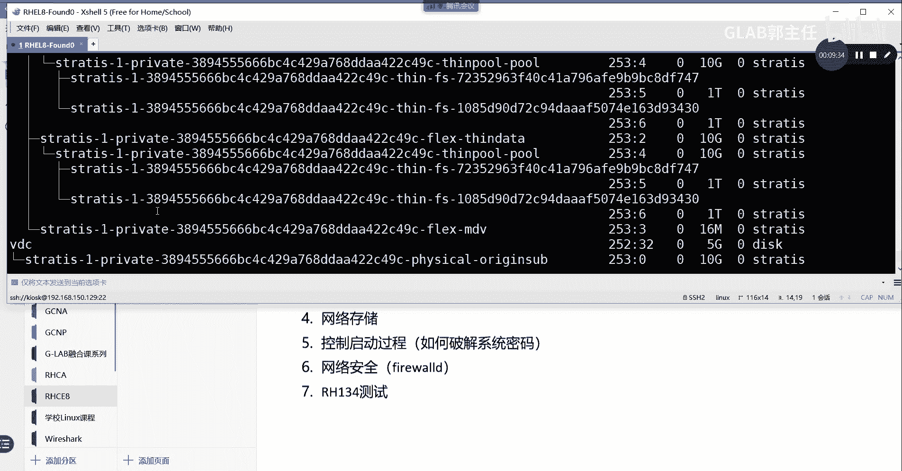
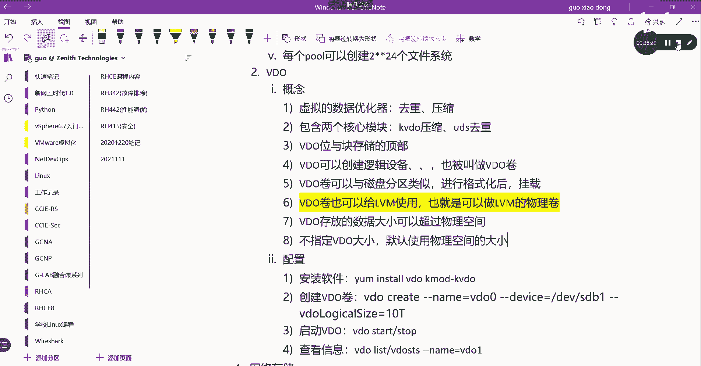

# 【Linux／RHCE／RHCSA】零基础入门Linux／红帽认证！Linux运维工程师的升职加薪宝典！RHCSA+RHCE／32-高级存储 - P1 - GLAB郭主任 - BV1cN4y1S7nP

好吧继续啊，到了高级存储，高级存储当中，我们要讲两个内容，第一个内容叫STUDI，高级存储啊，叫strategy s t r a t i s s t r a t i s，这是第一个，第二个叫VDO。

这是两个高级存储，第一个我先简单的说一下呃，strategy这个是红红帽八版本以后的新特性，新出来的，红魔八版本的新特性相当不稳定，对相当不稳定，红帽官方都不建议大家在工作当中去用它，考试也没有考。

这只是新特性，不单单未来可能会考，只是给大家简单介绍一下，我用不同的环境在做STRATS，看到的现象都不一样，有时候挂上去，有时候挂不上去，然后跟红帽官方的人确认，他说这个非常不稳定，嗯先放着好吧。

那介绍还是给大家简单介绍一下这个video，这个是必考，这个内容是必考内容，video是他的高级存储，而且也比较成熟的技术，也是我们重点要讲的东西，好先看，Strategy。

它首先是以这个管理物理存储设备池的服务，形式，透明的为用户来创建逻辑卷，它可以理解为是也是，也是以像逻辑卷创建的方式一样，但是它是用的另外的这个存储的这个方式啊，嗯他也是一个卷管理的方式来的。

它也可以调整它的大小，也可以这个缩减它的大小，那么具体的我们先不去给大家去去讲，他的理论的部分，我们先给大家看一下怎么操作好吧，我先给大家看一下怎么操作。

我来演示一下吧，我们就用它的环境吧，嗯DF杠TH看一下盘都被用掉了，我们就用server server b吧，server b上不是还有一堆盘没用吗，对吧，我们server b a s b l k好。

三块盘都没用，来我们看看，首先要用static，必须得先安装我们STRATS软件，要要安装，要么有store s t r i，是不是STRATS卡了STRATIS，然后先安装它的COI。

还要安装STRATISD，这两个要装一下，S t r a t i s s t r a t i s d，把这俩软件装一下，好安装好了以后，接下来我们要激活TEMCT2，在enable杠杠NSTITISD。

把这个服务哪里没答对，STRATISDSTRATIST嗯，哪不对，ASTALIASTRADISD好，要在这句话有两个作用，一个是现在开启这个服务，第二个就是开启这个服务的开机自动运行啊。

一句话有两个作用，好这些都做完了以后，接下来我们要创建开始创建了，它是家用的是s t r a strategy，它是用它来创建的，先创建poor create pro1，我们给它创建一个pol1。

然后把DEV下面的VDBVDB放起来，VDB是不是一整块盘，对不对，好这个就把我们的VTB放进来了，好我们可以通过STIATIS，然后看铺有哪些list，这时候会发现我已经把一块盘放到这个PO里面。

能看到吗，好继续，如果我还想再增加，那我可以通过s t r a t i s strategy poor，通过ADD它通过叫ADD ADD dt-1，我们把DEVDEV下面的叫VDC放进来。

ROS看看对不对啊，s poor好看到了，然后再看一下是不是他的谱就变大了，好现在我的pool里面，我把两块物理盘都放到这个strategic，pool里面了，好，然后接下来创建我们的这个像这个池中去。

创建快设备，S t r a t e r s strs，创建我们的快设备，它的快设备叫block device list，pl1查看现在现在这个谱里面有没有快速本，是不是有两块啊对吧，VDB和VTC都有。

有两块，这个是查看快手表，然后在这个词当中创建文件系统，创建文件系统file system，然后呢创建POE里面创建，然后呢FILESYS1，这就是我创建的file system的名字，创建文件系统。

等一下，嗯卡住了好好了，然后接下来我们来看这个有哪些文件系统呃，叫file system list，看一下是不是创建了一个文件系统啊，好，你没有发现这个文件系统，没有让我去指定它的大小啊，直接创建的。

对不对，直接去创建，没有让我指定它的大小，它会有一个默认的大小，对吧嗯，我们在创建文件系统的时候，它不需要让我们去指定它默认的文件大小，说明这个是一个什么样的配置方式。

这个存储空间的大小是一个什么样的配置方式，就是你用多少，他就会让你从这个池子里面拿多少，能理解吧，精简配置吧，对不对，这跟以前你画个一个G，你这一个G都归你管，你就算用不到一个G。

剩下的人也不能用剩下的部分，那么strategy的好处就是他在创建空间的时候，不需要大家指定大小，那么不每一个文件系统，它用多少就可以从这个PO里面拿多少，不需要指定文件大小，就这个意思能理解意思吧。

好除了这个特点是它的一个比较重要的特点，一会我们一个来总结啊，然后呢还有一个比较重要的特点，我们还可以对文件系统来进行快照，来给他做快照，好strategy来看我怎么做啊。

呃strategy file system，它可以做snap snap shop对吧，我们在pl1里面，对FIFI那个名字叫fire s y s是吧，F i l e fire s y s e。

我们可以对它这个文件，刚刚创建的那个文件系统来做快照，好不好，这个快照怎么做呢，S n a p gun fire soy s1，这就是做的那个快照快照的名字，快照的名字，等一下啊，有点慢。

有人用这个STRATE去管理的话，还存在那个LV的概念，没有任何LV的概念，就是你可以把刚才我们是直接把整个盘放到，strategic support里面。

你也可以把分区放到static support里面，都一样的，就是到这一步的，这它跟LVM是平行的，是平级的，你可以用LVM来进行这个东西，也可以用static来做，那么它底层对象都是一样的。

底层的对象都是一样的好，那么这时候我创建了一个快照，我创建了一个快照，那么我们如何来来来来把这个文件系统挂载，因为你创建是创建好了呀，对不对，我怎么来给我们的目录，给我们的目录来用嘛，好来吧。

我们在server b上创建一个test目录对吧，然后我把我的这个呃呃文件系统挂上来，挂给这个目录去使用挂，我们还是可以通过临时挂载是吧，我们也可以通过FACTABLE挂载好吧，我们用临时挂载的方法。

我们把那个把那个怎么看LSBOK吧。

STRATEX做完一大堆乱七八糟的东西。

烦都烦死，你看一下啊，在哪，我要看一下它的路径怎么挂，哎我看看临时挂载mt在DV下面的，有没有这个，A l s b o k，我看看他有一大堆的东西，文件系统，这是快照是吧，还有文件系统。

这时候是不是有两个文件系统，一个是快照对吧，一个是这个文件系统，OK那就用这个吧，来看啊，M o n t mt，我们把它挂载给我们刚才创建的test挂载。

刚才创建的是不是test server b。

下面刚刚是不是创建了一个test，在加目录在root下面的test好了吧，好然后CD到当前目录的test里边没啥东西吧，对不对，好不好，没啥东西，然后我们在里面创建touch，123456789。

这个肯定是唯一的，我创建了一个文件，是不是ASD什么什么什么什么的，明白意思吧，然后我向这个文件里面写一些东西，this is test送到这个文件里面，然后catch一下这个文件好，是不是有内容啊。

好我现在主要做的事情是什么呢，好这个时候我现在的文件系统STRADICS，我的文件系统有两个，一个是没有写文件之前做的快照，一个是呃，现在做了一些文件在这个文件系统里面。

然后我对这个文件系统再做一次快照，我来再做一次快照，就这个叫快照二吧，可以吧，好然后呢，接下来我们把这个文件系统我给它删掉，我们把原始的文件系统删掉，是不是有一个叫呃叫destroy是吧。

Destroy，我们把file system的文件系统现在还不能删，因为它被挂载了，我要我要先给它取消挂载，我要先取消挂载呃，CDCD到这里，我们先u mu mt把它先取消挂载，好了对吧好。

取消挂载之后，我们用ros file system destroy，我们把这个文件系统给它删掉，他说他报了个错，不能删是吧，不能删，我们来看一下现在还有吗，没删掉是吧，没有删掉，没有删掉。

那么我们应该是，ROC先把什么池子里面file system，先把file system里面的destroy好，pro1先把pl1DISTROY啊，不是是说破一，然后后面再跟那个呃呃对，指定他的名字。

他要指定哪个PO是吧，好这时候没了，我们来看看是不是就没了，没了之后来我们把这里再建一个m k d r test1，好把test挂在第一个快照上面，然后把test2，就这两个分别挂在我刚才两个快照上。

M u n t，看下list啊，因为要用到这个路径，mt先把它挂给test，是吧，然后呢把二，挂个test1对吧，好然后CD的我们不用CD了，直接四杠L，先看当前目录的test，没东西。

因为这个是刚才第一次做的快照吧，再看一楼是不是有东西啊，有些东西对不对，所以有这个快照的话，我们可以对文件系统，它把它把我上传在存放数据的这个过程，已经抽象化了，这个文件系统是不是。

跟我们刚才所讨论的分区啊，什么逻辑卷一点关系没有啊，他就抽象化成了文件系统，你接下来哪里要用什么东西，你直接基于这个文件系统来，来进行操作就可以了，而且这个文件系统还可以做快照理解意思。

不能听懂我意思吧，对你没有任何格式，直接创建好了文件系统就能用了对吧，它不存在任何什么文件格式什么之类的。

直接就可以用就可以了，好那么说到这么多，我们来把这个STRATEX，简单的给大家写几个比较重要的东西，嗯对吧，好那么第一个大家感受到的是，它是以这个存储池的服务形式，来对上层提供服务的，对不对啊。

那么STRATIC池子里面可以有哪些物理对象，这个物理对象应该跟逻辑卷很类似对吧，也就是说加入这个管理词的物理对象，写的写的白话一点啊，加入管理池的物理对象，可以是什么，可以是硬盘，对不对。

一整块硬盘明白，还可以是我们的分区，分区也是可以的啊对吧，还可以是，就REDIS是吧，做radio对吧，做read read还可以是什么SN，这些都可以，这第一句话OK第二句话嗯。

这个它可以把我们底层的呃这个分区也好，文件系统也好，全部给抽象化，基于文件系统来给我们的目录直接提供服务的，这句话怎么看对吧，就是会把会把底层的一些东西抽象化，底层的存储硬件，包括它的文件格式对吧。

文件格式包括文件的大小都透明掉了，全部透明对吧，使用文件系统直接未上传进行服务，它的文件系统叫fire soy s t m system，通过文件系统它就是文件系统，它没有什么格式，没有什么其他东西。

也没有大小，通过file system直接为上层提供服务，OK直接为上层提供服务，对于我们使用的人来讲就特别特别的简单对吧，OK那么这个是他的这个透明方式来管理卷的好，然后第三句话，它的文件大小。

也就是它的大小不需要指定对吧，文件系统的大小不需要指定，但是要知道为什么不需要，是，因为它是使用精简配置的方式来获取存储空间，这个能听懂吗，他使用精简的方式来使用，处理空间好，也不需要去固定指令。

指定多少东西啊，那么多个文件系统，什么叫多个文件系统，怎么不去说了，文件系统也可以保留这个词的空间，可以以便在需要的时候保证可用性好，下边吧可以做这个快照来保护来备份，或者说来保护重要的数据。

重要数据的文件系统，这就是可以做快照，可以做快照啊，OK好，那么我们刚才不是创建了词吗，它每个词可以创建多少个文件系统，每个铺可以最多是可以创建二的，24次方个文件系统，是不是很多啊，对这个很多了。

可以创建24次方的文件，所以大家不用关心文件系统的个数，就像刚才那种做各种文件系统，包括快照文件也算文件系统，它可以创建这么多啊，已经够多了，已经够多了啊，好吧，Ok，好这个叫STRATS，就说这么多。

接下来我们来说video，我们来说video video这个是比较重要的，video呢它叫虚拟的数据优化器，数据优化器，那它优化在哪两个方面，它优化主要体现在两个方面吧。

一个叫去从一个叫压缩看这两个优化，大家能明白video主要重要在哪吗，如果没有video，我们之前在存数据，比如说你有一个文件是一个G，你拿这个G1个G的文件放在某一个分区上，占占空间。

是不是占一个G啊，然后你把这个文件复制一份，还放在这个空间上占几个G啊，是不是两个键啊，对不对，他没有对文件数据进行重新排列，去重这种操作，如果用了video，你相同的文件，它在空间上只占一份空间。

它不占两份空间，能听懂吗，它自动帮你创建了软链接，类似于链接的方式链接到这个存储上的呃，最本质的核心文件，所以用video能节省不少空间对吧，能节省很多空间，它能做驱虫压缩，应该不用不用太太太那个吧。

压缩应该知道了吧，它可以对文件进行压缩，原来是一个G的，我压缩完了以后，我能把这个文件变成700张，所以多出300兆空间出来，所以它是它主要是做这两个优化的，好不好，既然是对两个进行优化。

就包含了两个核心的模块，包含两个核心模块，一个模块就是用来做驱虫的，一个模块就是用来做压缩的，叫KVD，大家稍微了解一下，这个是用来做压缩的，压缩优化的，还有一个是叫UDS，这个是用来做驱虫的。

OK就这俩好，那么video是位于快存储设备的顶部，这些块的设备也可以是加密的设备，这个这句话应该重要的，在前面一部分说的是video在什么地方，位于块存储的顶部，对吧，他不是在底部，所以你想啊。

其实可以把V就理解为理解为，理解为一个第三方的软件，它会安装在操作系统上的时候，它会对你的这个底层的这些分区也好，或者说逻辑卷也好，作为它的压缩对象，在这些逻辑卷上再去运行video的时候。

它能帮你对底层的这些数据进行去重和压缩，听懂了吗，他应该工作在上层，你应该把它理解为是一个第三方的软件，OK所以它叫优化器啊，它叫优化器，他说的是优化器对吧好。

那么呃当然也是可以通过video来创建我们的逻辑，逻辑逻辑设备对吧，逻辑设备被称为video的卷，所以这里要写video可以，创建逻辑设备，这个逻辑设备就理解为叫video的卷。

也被叫做video的卷对吧，这个是他的一个一个一个存放单元，就以它来来来来来存放数据，然后来进行压缩，video卷与磁盘的分区是类似的，可以将这些卷格式化为所需要的文件系统。

然后像常规文件一样进行挂载好，这里再做进一步的解释，video的卷啊可以与磁盘分区类似，对吧进行格式化后进行挂载，明白，然后第六个，那么video的卷做完了以后也可以给逻辑卷使用。

是可以是可以做逻辑卷的物理卷的，也就是可以做逻辑卷的物理卷，对吧，你可以先用video把它画出来，画出来完以后，你可以给他丢给逻辑卷，让他做物理卷，这样的话你逻辑卷上创建出来的空间。

其实就就有压缩和驱虫的功能了，理解吗，好嗯好，所以它是可以压缩和驱虫的，那么通过这个特点，大家可以判断video的卷，它能够存放的数据的空间大小，是不是可以超过物理的空间大小啊。

video存放的数据大小是不是可以超过，可以操作什么，可以超过物理空间的限制，你这100个G的盘，我用了video之后，我是不是可以做video卷，大小的时候可以做成200G啊，因为它可以压缩。

可以去重嘛，其实它真正存放的数据应该不止两百一百个G，听懂了吗，所以是这个意思，一会大家会发现video在创建空间的时候，你的牌可能只有一个G，但是我可以做100个G的video的空间大小，OK好。

那么不指定video的卷子大小，默认是使用物理的大小，不指定video大小，默认使用物理空间的大小，好这个就是这几句话，那么弄完以后，我们来给大家看一下video该如何配置，来配置它。

作为第三方的软件肯定也要安装了安装软件了，这个安装的软件肯定还是通过ym install，并且要把那两个功能都装上，一个叫video，还有一个叫KMDKMOD是吧，杠key video。

把这俩装上两个软件啊，都要装，第二句，第二部创建video的卷，这个video的卷怎么创建，这个命令比较长，一会我给他贴过来，但是有方法大家不要记啊，不要死背，没有关系啊，一会儿我给他贴过来，有方法的。

第三步我们可以去这个嗯，启动暂停，查看video啊，或者显示video，这些都可以启动video，怎么做叫v d o s t RT start，这是启动吗，这stop s t o p是不是暂停啊。

啊这个就不往下写了，然后查看一些信息吧，查看信息主要的会有显示video有哪些，通过video list，这是第一个命令，第二个命令我们可以通过V通过叫VDOST，ATSTATS啊。

STATS来看我们的这个video的状态，找video stars gone g name等于video1，这就是看video1所有的状态啊，然后接下来无所谓了，就这么说吧，这是很简单，主要是就一句话。

其实就一句话来。

我们简单的来操作一下嗯，简单的操作一下VDB，VDC是不是还有一个VDD是吧，我们用VDD来做VDO，好吧好来吧，怎么做VDO其实就一句话，但是要先安装，要么store它叫VDO。

然后KMOD是不是k mod k mod杠K，video k video啊，已经装好了是吧，正常已经都装好了，装好了以后，我们要看video怎么用，我们可以卖一下video，因为那句话比较长。

大家不要记，因为man在考场都能用，哪都能用，然后在下边打EXAMPLE大写的回车好，你就会看到这么一串，不要被直接复制过来，提出来，然后贴过来要改改啊，先从前面开始啊。

video create name就是创建一个video的名字叫video1是吧，好这个名字他给你什么，你就用什么，然后把哪个设备放进video里面来啊，你看这边有什么db1，这明显是个分区吧，对不对。

你除了用分区之外，你还可以用一整块盘，我们在这里用VDD，VDD1整块是不是没有备用啊，然后呢它的大小我们可以给它创建多少呢，我的VDD的大小刚才有没有看是多少，五个G是吧，五个G啊。

所以我在这里可以给他50个G，可以啊，是不是可以创建，看懂吗，我只有五个G大小，但是我创建了video的，这个叫创建video的卷，对不对，这个叫V的卷就好了，就这么长这么长。

我给大家贴过来，那就这些。

大家到时候自己改改就好了，不需要记啊，不需要记好，然后呢，我们通过video start，Video start，video start error哦，名字是需要的。

video start杠杠name name等于video1是吧，这时候是不是开启了，然后呢，我有哪些video通过list来看嘛，讲video Lt是不是有一个video1啊。

然后video s t a t s s t a s t a t，看他的状态叫什么来着嗯，我看看他的装STATS是吧，SSTATS是这个STATS，我打错了哦，写错了写错了。

video s t a t u s是吧，T a t u s，然后杠杠name等于video1，这就是他的状态，他会告诉你压缩了多少，然后弄了多少，明白啊，这是他看他的状态，看他的状态好，然后呢。

我们现在video df杠TH，没有任何东西，这是我挂载的STRATS啊，没有什么关系，LSBLK是不是有一个video，有了50个G啊，video没有挂任何东西，我要用它的话。

我是不是可以把它挂起来给我的某个目录啊，MKDR我们创建一个test2，然后把video挂给test2好，MOUNT我现在做的都是临时挂载啊，我们把这个DEV下面的VDO，ADEV下面的不是BV下面的。

我要看一下ASBLK这个是这个目录，叫VVDD啊，对mount dev下面的v dd，50兆不是G，刚才大小没改，对好删掉怎么做，把那个VDO删掉，Remove，不知道是不是remove，Move。

是的啊，remove是吧，那就video m o v e remove掉video1，它有一个什么，还有加参数，不是这样的杠杠哎对都要加name video1，这样做删掉了，重新来创建。

history应该是这个默认没有加单位是50兆，我们要做50G，是不是这个好了，然后LSBK现在是50G没问题，然后呢，现在我要给它挂上来，挂到test2上嗯，Mount dev。

那么DV下面的map video诶，是这个dv map上面的V很多都是有一个map对应的，没关系啊，挂到test2上去，the star run啊，他说没有格式化呃。

bad block Missing code ab要格式化，你创建了video之后，格式化Mac fs x fs格式化一下，所有的文件系统在用之前都必须格式化，这一点明确啊，给它格式化成XFS。

然后卡住了，好了好了之后再挂一下不就好了吗，CD test2对吧啊，里面没东西吧，里边没东西好，现在怎么去要测它，这个这个这个video是具有驱虫和压缩功能的，呃，大家可以下一些文件。

我们的这个练习的环境里面，有的到时候会在开放性时间，大家做一下，它会给你一个非常大的文件，你把文件就放到挂载的目录里面，然后不停的复制，不停的复制，然后来看它所占的存储空间大概是多大。

怎么看DF杠TH去看它的video大概占多少，当然还有一些其他的方式可以看，比如说它叫video s t a t s，里面有一个杠杠，human h u h u m n嗯。

叫REREAD叫read r e AD a b l e，就这个通过这个命令，大家能够看到你这个他帮你节省了多少，没事吧，用了多少，你的大文件往里放的越多，它能够帮你节省，你现在没有任何东西。

也就你放一份文件，你放一份文件的时候，它的节省率就会越越越低是吧，你的文件数量越来越多的时候，而且是相同的文件，他帮你节省率就会越来越高，明白意思吗啊，就使用率嘛，所以大家可以把那个第229页的。

video的实验做一下，229页啊，他把video dragons都放在了一起，教材229页，它有专门大文件。

现在我系统里面没有开那个实验环境啊，没有开实验环境，没有开实验环境啊。

好听明白了好，那么再来再来做一个教材上没有的啊，我们把DV上面的这是第一位，我们把刚才挂载的东西去掉，root test2好，我们说过了video现在已经去掉了。

这个video是可以直接挂给我们的目录用，也可以做成逻辑卷是吗，刚刚有说吧，video是可以做成LVM的物理卷嘛，所以现在我们要做，来试一下video能不能做成LVM的物理卷，怎么做啊。

是不是通过pv create去DEV下的map上面的video，一把它做成我的物理卷，他说上面有东西，然后我们通过pv display看到了吗，各位嗯，没问题啊，对不对，所以啊我们如果这个在工作当中呃。

想要对空间利用率做的更好一些，你应该先通过video做成一个分区，或者做成一个把整个硬盘做成video，然后把它塞给LVM在逻辑卷上再去划分空间，这样的话，你的逻辑键就具有驱虫和驱虫和压缩的功能了。

理解吗，各位把所有的硬盘都塞到对，你把所有的牌全做成分对，然后然后把所有的video全丢给逻辑卷，然后让逻辑卷去做VG，去做LV，那么上层的LV是直接给用户用的是吧，那么用户在用的时候。

它就有驱虫和压缩了。

所以这里这个后面不做了吧，你直接丢给了PV，后面太简单了。

做VG做LV吧，那说明它是可以放进来的啊，这是可以放出来的。

就是这句话嗯嗯在哪，这句话，没问题吧，嗯嗯好。

