# 【Linux／RHCE／RHCSA】零基础入门Linux／红帽认证！Linux运维工程师的升职加薪宝典！RHCSA+RHCE／33-NFS网络文件系统 - P1 - GLAB郭主任 - BV1qw411W7GV

好吧来我们来看NFS就是网络存储啊，好，那么网络存储可以理解为，我们在系统里面做的一个，网络的一个共享存储啊，就是网络上的一个共享存储，它的英文叫NFS，叫NFS。

叫network files这个system网络系统啊，叫网络文件系统，OK那么呃system as story存储还是系统无所谓了，就这么个意思啊，NFS那么我要给他画个图去理解一下。

我们这个NFS很多人不清楚啊，但他很模糊，模糊这个NFS中间涉及到的技术细节，来换一下啊，就拿我们一会要做的实验来讲，我们在网络当中有一个server b，这是一台LINUX系统。

也有一个server a这两台，那么他们之间是通过网络连在一起的，当然在同一个网段了，另外理解为不在同一个网段，现在我们不管怎样，中间网络是通的，那么现在要实现的就是server b上面。

它有一块有一个目录啊，有一个目录，这个目录假设叫public，然后要要让server n能够通过网络的方式，通过网络的方式把public这个目录。

server b上的public这个目录挂载到server a的本地，也就是在server a本地上，首先啊远端的这个public，它的本质上是不是一块存储啊，它不是一个仅仅不仅仅只是一个目录啊。

它对应的是server b上的一块存储空间，能听懂吗，然后呢要求是通过server a把远端的这块存储空间，通过中间的network挂载到本地吧，所以你在server a上打开本地目录的名字。

不一定有可能叫的名字叫test，能理解我意思吗，然后在本地打开这个test目录，其实访问的应该是server b上的public，对应的存储理解吧，OK那在我描述的这个过程当中，它涉及到两个技术。

第一个技术叫挂载，就我们前面讲的挂载，不管本地的空间还是网络上的空间，对于我server来讲是不是都是挂载啊，那我可以在哪挂啊，我是不是可以通过mt临时挂载，可不可以写在FETABLE里面做永久挂载。

可以吧，还可以用我们接下来要讲的按需挂载，这也就是说不管你这一块儿在哪儿，只要涉及到说能够挂给我挂载给我的test，这都叫挂载，只是写法可能不一样，但是都叫挂载，理解吗，OK好，第二个技术就是呃。

如何能够实现网络上的这个空空间的共享，我们从前从前面一直学到现在，一直在说本地的空间用来给本地的目录使用吧，我在本地插一块硬盘，我直接本地挂上来，这个没有任何问题吧，前面在讲呢。

不管是video stats还是分区，都是讲的是本地给本地应用，听懂了吗，那现在不是哦，现在是通过网络上的server a，通过网络来给server a用，所以很明显中间要走一个什么。

是不是要走一个协议啊，本地直接给本地用，直接走本地的串行线，你就直接走的线，就是互相能访问了，明白吗，现在当然本地也有协议啊，就纯属的协议什么sci啊是吧，这也有也是有协议才能通的。

那现在呢走在网络上一定要走一个协议，这个协议就叫NFS，各位能听明白吗，所以这就是我们网络共享存储，涉及到的两个技术，一个是挂载，一个就是NFS，听得懂吗，所以我们要解决两个问题，才能把它挂上来。

这个过程听明白了吧，好，所以网络存储，我们主要其实有两种类型的网络存储，一种叫永久挂载，实现网络存储的共享，这其实是在网络上共享某一块空间嘛，在网络存储共享，对不对，好第二个要讨论的就是按需的。

按需挂载，就是不同的挂载方式，但是还是通过网络来实现存储的共享，是不是这两种方式对吧，不管哪种方式都包含两个技术点，一个就是挂载，一个就是共享，共享走的是FS对吧，挂载一个是永久的，永久的。

不用不用再再强调，他应该是在做FACTABLE文件的修改吧对吧，好按需的，我们一会再讲，我们先看永久的好永久的这个例子，我还是建议大家把这个教材上的一个实验，给大家演示一下，教材244页。

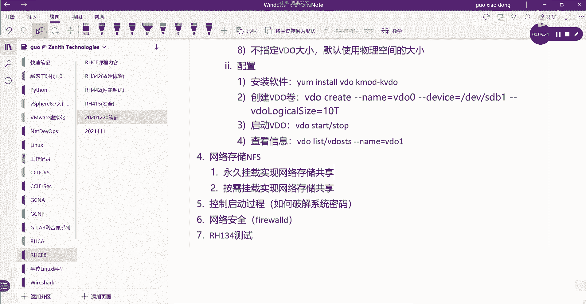

just b4C给大家演示一下啊，嗯在workstation上，我们等到workstation上，好在这里呢我们打开我们的实验环境，它叫lab net net storage。

S t net storage，Nfs star，还得开一下，244页的，这个就是我们演示的第一个实验，就是通过永久的挂载，这个我们在实验环境当中是不需要大家关心，中间的第一个第二个技术就是NFS。

大家不要太太太关心，因为他已经帮你做好了，明白就服务端的NFS都已经做好了，大家有兴趣可以去看一下怎么做的，其实很简单，也是修改MFS的文件就可以了，OK然后我们要做的事情就是为什么要开环境。

就是这个原因啊，因为他帮你把NFS该做的都做好了，你自己搭也可以把SVP重新装一下，NFS修改一下配置文件就可以了，我们来看通过student workstation，他登到student。

先登到server a上去吧，登到server好，先登到思维，然后通过这个速度杠I直接提全，其实你可以直接SSH root到扫码就可以了，好在这里呢他有他有一个需求，他说要求用NFS要在客户端。

我现在server是我的客户端，要在客户端上要开启NFS的版本号，分别是二三对吧，呃，要根据我们的要求去去开启，相应的一些NFS的协议，这个按照他的要求去打就可以了，简单演示一下，他在客户端去做NFS。

然后杠杠FNFSD，然后用UDP，对吧，这是第一个第一个，第二个version v e r s2，就把这个关掉，就是默认用他的version4，把二和三都关掉，N后边这个N就是N好。

然后呢要求你把TCP打开，那就是TCPY开，然后呢把version4叫VERS4，把四打开好吧，然后有4。04。14。2也都打开，4。04。14。2都打开，OK好，打开完了，这些这些都要求打开就行了。

这里只是简单的给你演示，在客户端如何去修改NFS协议相关的东西，就这么看的好就不错了，不改也没关系啊，他只是做了更安全，就把该关的关掉，默认这些东西都是开着的，所以这个是可选项，可做可不做。

那接下来我们要在本地，创建一个用来挂载的挂载点，这个挂载点叫public，我们在哪里创建MKDR，在PUBUC创建一个叫public，在哪里啊，LS杠L在斜杠在这里创建了一个叫public。

PUBLIC创建了一个，他一会儿就是挂载给他了，对吧好，中间能FS，也就是服务端能FS都是OK的，那么我们如何来验证我现在是可以挂载的呢，现在中间的FS已经可以了，你可以直接做挂载，对不对，直接做挂载。

我们是不是可以用临时挂载来简单的测一下好，临时挂载杠T去指定我的用什么类型，通过NFS这个协议去挂好找谁呢，server b看一下我的写法，写一下，应该大家就会了。

lab点e x a m p l e example，点com，请问这个域名是不是就是我的server b啊，我们是不是做了DNS的对应关系啊，所以你如果不写域名，应该写IP地址吧，对吧好。

就到了server b上，server b上对应的是哪一个目录呢，SHARE叫希尔，这个已经帮你做好了，ship u b l i c这个public，然后挂载给本地的PUBLIC，这一串能不能看懂啊。

mt GMT是临时挂载，杠T就是通过NFS这个协议找谁，找网络上一个叫server b的主机，这个地方可以是域名，也可以是IP地址，好记住中间有个冒号，就代表我要找这个主机的哪一个目录。

这个目录写的是shers public，挂载给谁呢，这是我本地的挂载目录，各位能看懂吗，如果不报错，就说明中间的NFS都是OK的，这叫临时挂载，临时挂载挂完了，我们通过DF大T去看一下。

是不是把它挂上来了啊，就已经能够访问到我们CD到本地的public lol，看一下里面是不是有东西啊，这一堆东西看到的其实是server b上，public目录下对应的东西吧，能听明白吗。

各位所以就这么个意思，所以先弄个临时挂载，那如果要想永久挂载呢，永久挂载是不是我应该去编辑etc下的FETABLE，这个文件，GO是不是在这里开始写，把刚才的那个写进去，重启它就有了这个写怎么写。

先写挂载点是不是server b点，就把刚才那个链接，lab点e x a m p l e a example点com，是不是这个好，还没完，在哪里呢，挂载点它是一个路径啊。

SHARES下面的p u b l i c public，挂载的谁啊，是不是挂载给本地呀，是不是好，接下来协议用的就不是这个地方写，原来挂载到本地硬盘，写的是文件格式对吧，现在应该写应该用什么协议挂。

是不是FS啊，你能看懂吗，好这边的选项选项就不用DEFAUL了，用的是第一个叫RW逗号，他有很多选项的话，用逗号隔开，我一个给你解释，RW就说明我挂过来时候我是可读可写的，RO就是只只读明白吗。

就这个地方我可以控制我挂过来到底能干啥，RW可读可写，然后SYNC这个叫什么同步，对不对，就是呃远端的public更新的信息立刻刷新，同步到我本地的public上，就是他他改了，我立马就能看到了。

如果不去这样改的话，它会根据NFS的这个周期再去更新，这个改完就要触发更新，好零零看得懂吗，好保存一下，然后mt杠A挂载没有报错吧，然后你可以重启一下，只要重启之后发现他还是挂在上面的。

那就说明这里改的是对的，这就做的是永久挂载，听得懂吗，OK好，这个我就不重启了，我就不重启了，退出来，所以再退出来，然后我们把这个把它finish，把环境关掉，这就是我们讲的第一个实验永久挂载。

所以你会发现如果用FS搞定的话，其实我们真正在处理的仅仅就是挂载的问题吧。

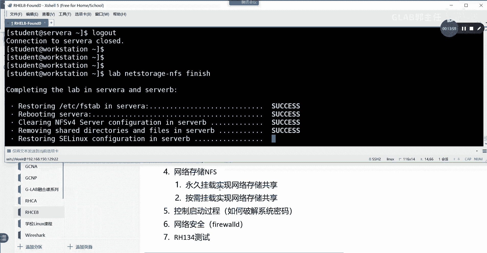

对不对，就真正只仅仅在处理就是挂载的问题。

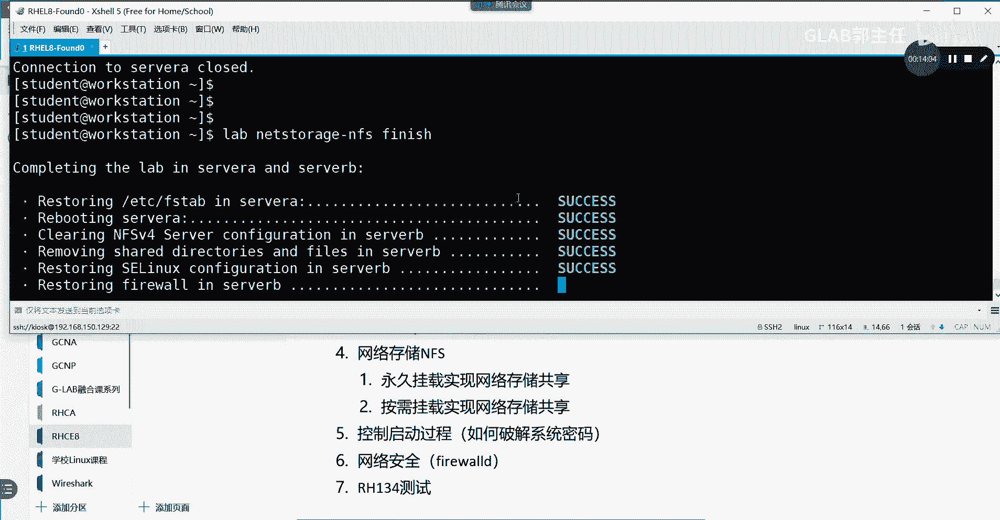

那这个挂载的问题要么是永久挂载，去编辑fetal这个文件。

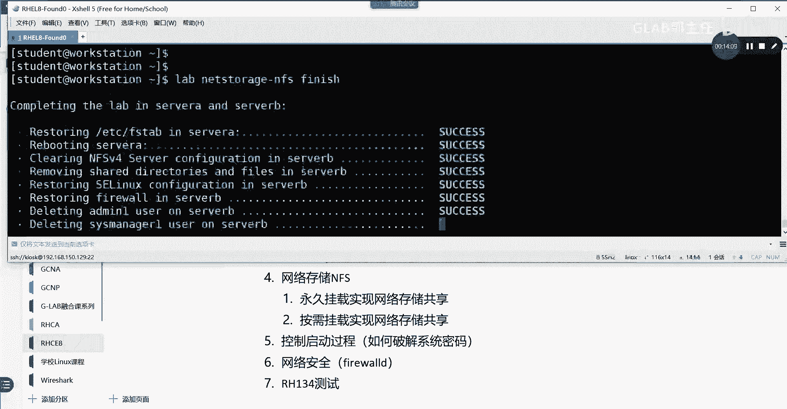

要么是临时挂载，主要就是看这个挂载该怎么写，他跟我们本地挂载的写法不太一样。

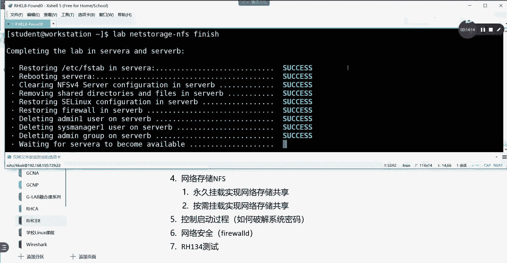

是不是啊，主要就是这个看清楚了啊，怎么写的，看清楚啊，怎么写的，OK所以第一个没什么难的，我们主要讲第二个。

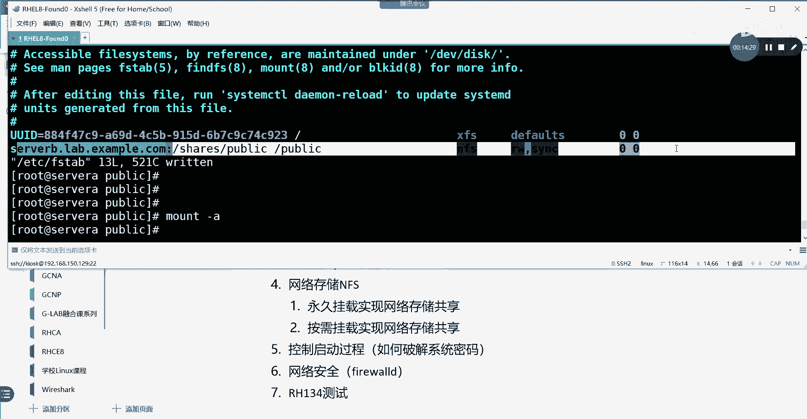

我们主要讲第二个，第二个叫按需挂载，好来看这个图还是要解决这两个问题，第一个问题NFS，你只要开环境，NFS就不用你关心他，所有东西都做好了，主要是解决挂载的问题，那么挂载我们前面演示了临时和永久。

现在接下来要按需挂载，那么按需挂载，它用到的是一个第三方的软件，叫auto fs，这个软件是需要装的，那么它的作用是什么，作用就是我需要访问这个目录的时候，它才会自动帮你挂上来，要不需要的话。

他就没有帮你挂上了，他就不会帮你挂上了，按需的去挂，这叫auto fs，所以现在主要讨论的是另外一种挂载方式，而不是NFS本身，我们要讨论的是另外一种挂载方式叫按需挂载，叫auto fs。

OK好按需挂载auto fs，我们主要实现的是要几个东西要做，第一个要安装第三方的包，要安装这个软件包，第二步要在要在本地要创建，要创建我们的映射文件，对吧，创建这叫主映射文件了，还有两个。

一个是主映射文件，第二个要创建映射文件，要创建两个，一会儿给你看啊，然后呢还要启动我们安装这个软件的服务，就这四步，就这四步，好吧，就这四步测试部搞完了以后，我们就可以对它进行访问了。

那么我们来看一下我们的这个实验，自动挂载网络附加存储，用250一页看一下啊，因为要用它的环境，我就我就不想自己去搞个FS了，太烦了。

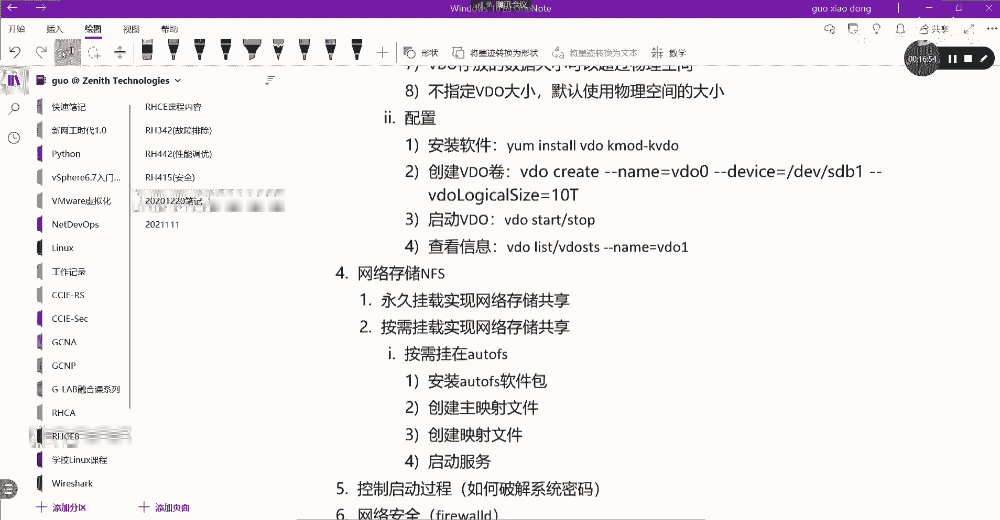

你就用它的环境好了，好libernet storage，net net storage的auto fs stop，打开，好那么这个好了以后，我们通过SSH root at server a上。

直接到server a上了啊，到了server a上之后呢，我们要要要先安装了，要安装auto fs，要install auto fs，因为按需挂载也是一个第三方的软件，你要把它安装一下，OK好。

装好了以后，因为我们说这个这个原网络挂载有两个技术。

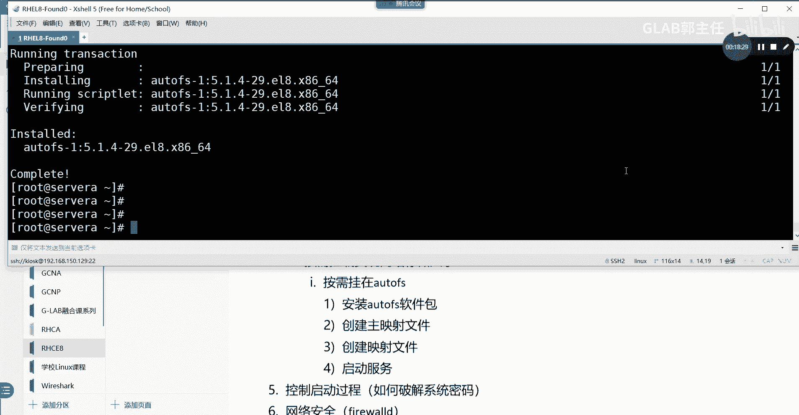

一个是NFS，一个是挂载吧，所以现在你可以先通过临时挂载的方式，来检测一下中间的NFSP的有没有问题，大家能明白我意思吗，临时挂载你直接写挂载NFS，测一下有没有，如果临时挂载都挂不上。

中间NFS肯定有问题，但是在我们的环境，FS都是搞定的，不会有问题，但是这是大家在在做这个事情的时候，一个排错思路吧，一步一步来对吧，我就不给你去临时挂载了，这个肯定是没问题的，然后呢ifs没有问题。

以后我们就不临时挂载了，我们直接去编辑它的映射文件。

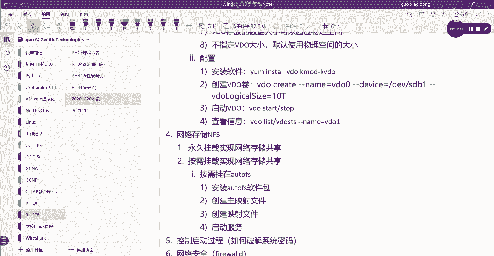

auto fs它为什么能够临时按需挂载，它叫按需挂载，它是有两个映射文件的，第一个映射文件在etc下的叫auto的，叫auto点master点D下面这这下面有一个文件名字，这个文件名字是自己创建的。

随便叫什么，我前面就用叉叉叉，也就这三个叉代表的是任意理解吗，但是后缀一定要以点auto fs结尾，这个能看得懂吗，各位前面叉叉叉名字不重要，但是你写什么，后面一定要调用的。

但后面的点后缀一定是点auto fs，不是点auto fs，它没办法识别好，这是一个空文件，在空文件里头，大家看我写斜杠，这个是根是吧，这个是直接目录，然后在etc下面叫auto auto。

点DIRECTK这个名字也是随意随意的啊，随便写都可以，好保存一下，这是第一个文件，第二个文件就是你刚刚写的etc下面的叫auto，点DIRECT，就这个文件在这个文件里头，我们要写的详细一点了。

首先要把ex它的要求是要把EXTERNAL，把这个目录，可读可写逗号SYNC同步过来，逗号逗号啊，编写点FSTYPE叫文件的FAFS的tab，用的是NFS4，我先写写完给你解释，然后后边写你的挂载。

挂载点server b点B点ex a m p l AMD com，冒号在哪里呢，S h a r e s share，S h a r e s share，share下面的DRECTDIRECT。

然后下面的EXTENL，就这么多来我们来，我们来演示一下，我写了两个文件，第一个文件在etc下的有一个叫auto点，master点D下面有一个叉叉叉，这前面的名字不重要，这第一个文件。

第二个文件在etc下面有一个叫auto点directory，就这两个文件，这两个文件一个是主的，一个是对应文件，这个上面是主文件，主映射文件，下边是映射文件来看啊，怎么去看这两个几个东西。

首先啊如果他先读主的映射文件，对不对，他是把这个代表的是直接在根目录下，根下面的目录，这是直接文件，对不对呃，我想把server a本地根目录下的直接文件。

直接映射的文件名映射到去找这个etc的auto direct，这个映射文件，那么这个是不是这个文件，也就是说其实就是主要的还是这个文件，这个文件上面怎么写。

当你去访问server b上面的这个文件的时候，直接去找本地的，映射到本地的external这个文件，那么它是可读可写同步的，并且用的是NFS4，听懂吗，所以这就是这两个映射对应关系。

就把我们本地和远端的映射关系就写清楚了吧，一定要写成两个文件，一个文件不行，这是主的对吧，这个是详细的映射关系，我说清楚了吗，OK没问题吧，好那么没有问题，以后接下来我们来看啊。

他还做了一个其他的映射关系，他还做了一个映射关系，但是没关系不重要嗯，他还做了一个，他做了俩，他做了我们就做一个吧，好不好，我们做一个做一个做一个，做完了以后SYSTEMCT2嗯。

去enable杠杠NAUTOFS，开启了对吧好，开启了以后，接下来怎么测呢，接下来怎么测呢，政策我们应该在这时候要切换用户了啊，我们应该在这个server a上，因为他这个挂载点是基于用户的。

我们要切换到叫customer哎，哎construct，Constructor，一切换到这个用户，切换到这个用户里头，我们CD到斜杠上面的excel l l，看一下是不是有read me。

能理解我意思吗，OK明白，一定要切换到这个用户，如果不切换到这个用户的话，我们直接在root下面root也能看到的呃，CD到excel上面，root是肯定能看到的，如果你切换到其他用户呢，来试一下啊。

他除了一个construct1，还有一个construct2，我们看一下二能不能看到CD杠，external2也能看到，应该还有一个用户吧，我看看，cut e t c线的password。

还有一个operator，我们来切换到operator，operator1CD到external，哎是不是没有权限呀，LS杠L对吧，然后这个external里面没有权限，这个能看明白吗。

这个是权限控制的啊，就是他怎么operator是可以的，operator不行，constructor是可以的，就是这个原因，那我切换到constructor1的时候。

我CD到excel下面是可以看得到的，那是因为这个共享的目录它是受权限控制的，他是权限控制的，也就是不管本地的还是远端的，挂的是谁，他的他的访问权限，都是都是受这个远端的控制的，那我们看一下啊。

在远端应该是受server b控制的，对吧，server b对应的目录应该是在哪里呀，CD是不是shes director上面，是不是在CD到excel上面去啊，是吧，那么这个目录能不能访问。

应该跟它目录本身的，理解吗，OK所以至于是哪个用户能够访问我网络，网络挂载过来的，这个目录是由我server上的nfs server上的权限控制的。

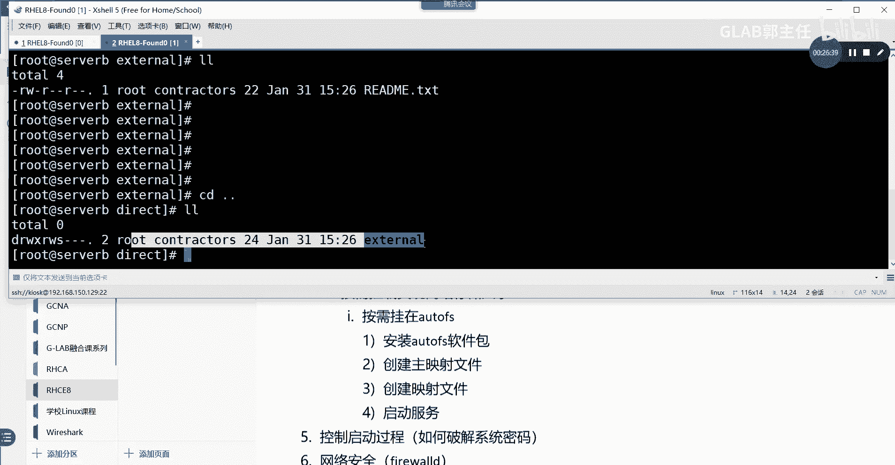

说明白了吗，考试有一题啊，CSA就考那个。

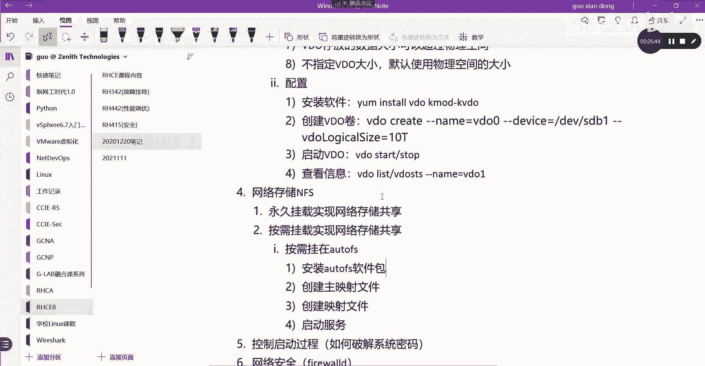

他让你把server a server b上的呃，考的跟这个很类似啊，他让你把server b上的extra的目录挂载到本地，挂载到server a本地，就这么干，写两个文件就好了。

把这俩映射关系写清楚。

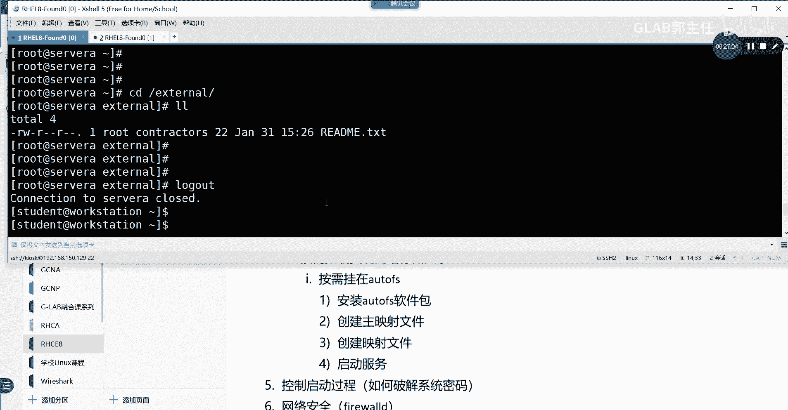

就这就这样，清楚了吗，没问题啊，NFS大家不用担心，因为他都是帮你弄好的。

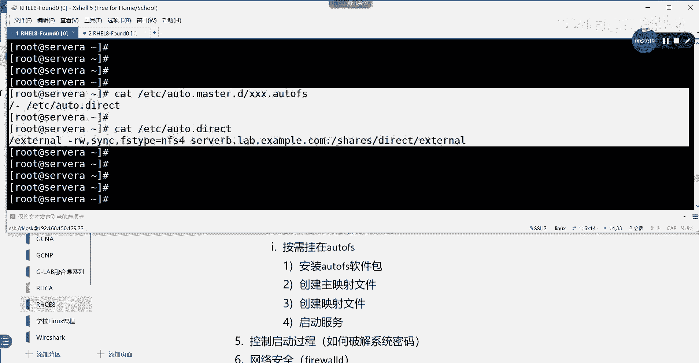

NFS就算要做也很简单，去编辑一下NFS，这个也要装的，但是考试不需要大家练习的时候也不需要啊，不用关心。

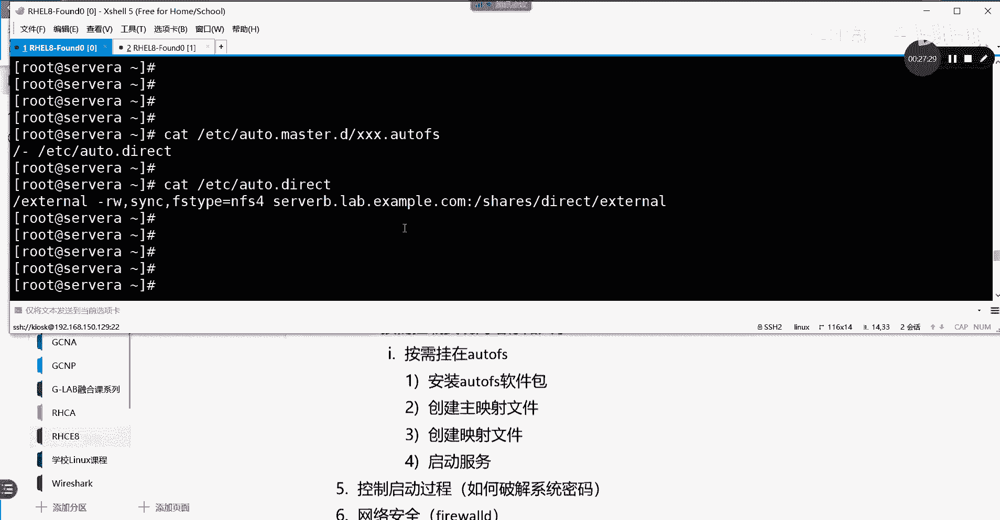

因为比较简单，直接改一下就好了，所以它不在我们考核范围。

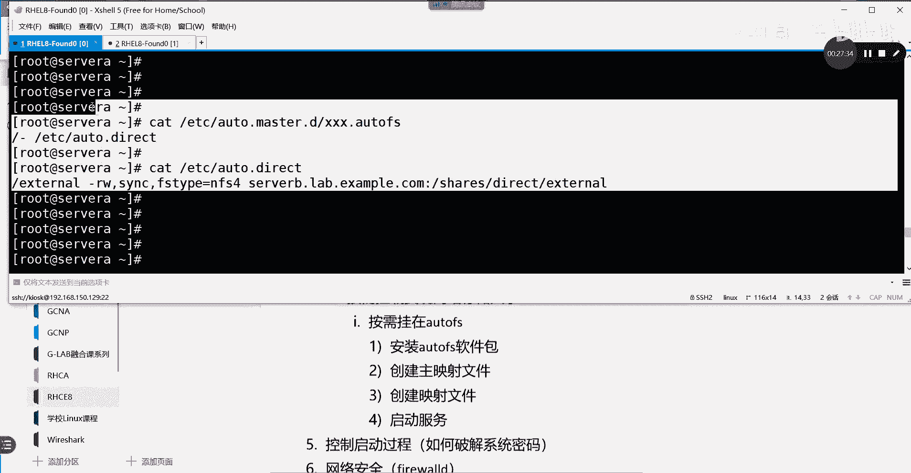

就是主要在auto fs，大家需要写好这个映射关系好，然后比较容易错的是这个地方，很多人在写中间用点，它不是用乐视逗号，他用点肯定不行不行啊，对不对，所以按需挂载，其实是不需要去编辑festival的。

就直接要编辑这两个映射关系就好了好了。

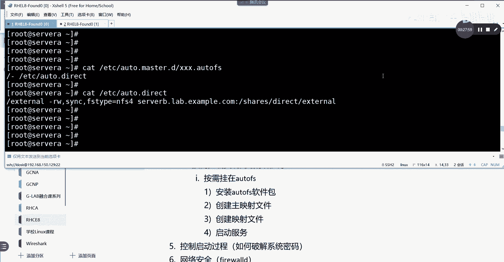