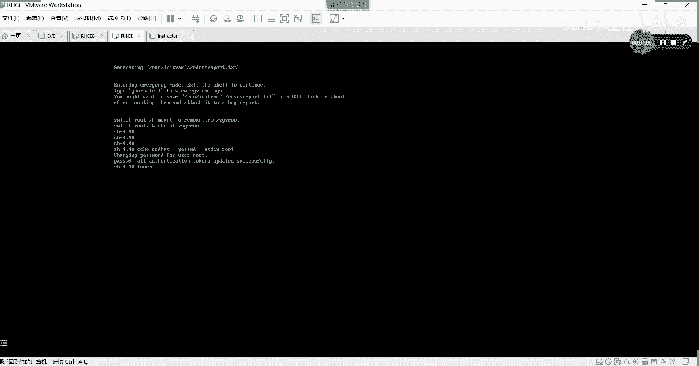
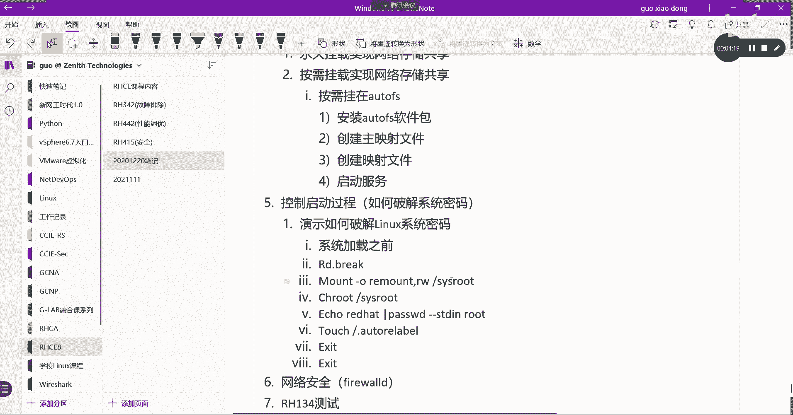

# 【Linux／RHCE／RHCSA】零基础入门Linux／红帽认证！Linux运维工程师的升职加薪宝典！RHCSA+RHCE／34-破解密码 - P1 - GLAB郭主任 - BV1jj411E75D

在工作当中可能会遇到我们的操作系统的密码，不记得了，那么我们主要演示如何破解LINUX密码，破解LINUX的系统密码，OK那么大概分几步，第一步我们一定要在开机状态，就是重启的状态下。

要进到加载系统的最前面的部分，也就是不能等你系统加载好了再去影响它，对不对，系统加载好了，你就要输密码才能进了吧，所以一定发生在系统加载之前，系统加载之前来影响到他的这个破密码的命令，有几个。

我给大家演示一下，RD点BREAK就是要输入rd break，然后呢m u n t mt杠O，我先给你写下来，remote逗号RW对这个SOS root，对这个系统的跟用户。

然后通过CHROT去改变我的角色，SYSROT好，然后开始通过ECHO去改密码了，比如说REDHATPASSWD杠杠STDIN，对哪个用户啊，对root用户我们改的就是root用户密码啊。

然后最后再去touch一下，刷新一下这个这个更新表叫auto relap，这个单词不要打错，A u t o auto relab，Auto relax b e l，然后退出，记住，就这几句话来。

我用我们的这个环境来给大家演示一下啊，我这个是我的红帽的系统，你看开机我可能不记得他的密码了，开机在这个界面的时候，按不要让它继续了啊，按上下键把光标停留在第一个，按键盘上的E出现这个了吧。

找到LINUX这一段，LINUX是LINUX，然后把光标挪到最后面，看光标不要搞错啊，一定是最后面QUIET是不是到了最后好，到了最后之后，空格在这里打RD点BREAKRD点break，不要打错啊。

RDRD点break b r e a k好了没，好了之后不是回车，你看下面是有提示的，按CTRLXCTRLX仍然重启，这个时候他就不加载系统了，它会给你加载这个一个一个迷你的一个系统，是最外边的。

不是不是核心的那个系统啊，就会进到这里来，明白意思吧，好进到这里，我们要做的第二句话，就是在刚才给大家抄的叫mt m u n t，mt杠O加分选项，remote逗号啊，RWOK好。

然后把4vs r o t，就是把我的根的系统目录挂上来换上来，然后把我的角色CHROT，把它改成叫切换到这个根目录下面去，就发生变化了吧，然后在这里就可以改了，我们把。

STDIN对哪个用户改的都是root用户，这个意思就是把root用户的密码改成red hat，是不是成功了，对不对，好成功了以后我们还要去touch一个文件，这个不要写错了。

是斜杠点，刚才我是不是写错了，我原来写的是点斜杠，点斜杠也是大家最容易错的是斜杠点，伙计们千万不要写错啊。

这个太容易错了，是斜杠，就是在根目录下面的一个隐藏文件，斜杠点，这个隐藏文件名字叫auto auto reliable RL a b e l，不是BLE，这是一个什么文件，就是嗯你只有刷新一下。

你就重新刷新一下这个文件，刷新一下这个文件的时间嘛，我们说touch是用来刷新这个文件的计时器吧，刷新它的时间，然后它才能重启，重启才能加载，刷新一下，退出来再退出来好。

这个时候他会重新加载auto relab，这个文件会有点慢，如果你改成功了，他在左下面会有一个百分，有一个百分比的计时，如果没改成功，他立马就起来了，很快就起来了，然后你输入密码发现不对，稍等一下。

怎么办，上面有写说reliable，Reliable，要take a very long time是吧，这就对了，如果你在改的时候，发现他没有经过左下角百分比重新的重新的，这个就是刷新的过程。

那肯定是错的，就这几句话啊，就这几句话，好都刷新好了，然后就开始重启了，有点慢啊，他正在把这个tap里面的清掉，好在重启之后到这个界面，大家就不用管，让它自己启动。

好起好了以后记住啊，我们改的是root密码，很多人上去之后直接用普通用户进去，普通用户，你刚才密码不是没改嘛，对不对，你怎么试都试不进去啊，对不对，你应该要换，不在这里。

我们应该用去改的是root用户的密码，改的是red hat，OK了吧，应该可以了，上来了，明白了吗，这就进来了，这就是破密码，考试有一题就是破密码，这一题搞不定这个机器上所有的题你都是零分。

那密码搞不定，你进去都进去不了，你怎么做，明白吧，所以这个有一题是突破server b的密码。

