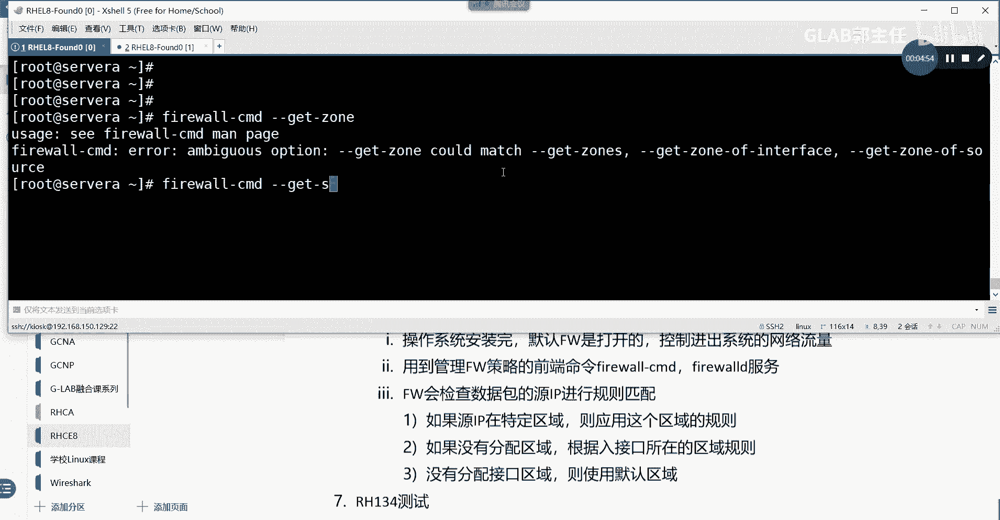
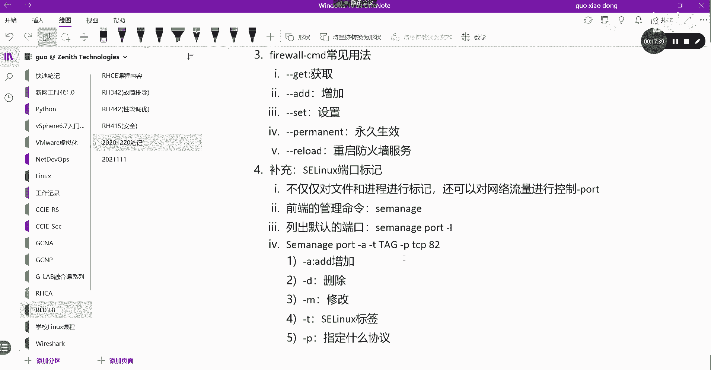

# 【Linux／RHCE／RHCSA】零基础入门Linux／红帽认证！Linux运维工程师的升职加薪宝典！RHCSA+RHCE／35-Firewall防火墙 - P1 - GLAB郭主任 - BV1qu4y1A7w6

OK好，接下来我们来看网络安全，主要说的就是防火墙啊，在系统里头装完系统，它默认防火墙是开着的，对吧，我们来看从概念开始总结起吧，第一个操作系统，安装完防火墙默认是打开的，播音号流程是什么，是打开的。

它主要用来干嘛呢，它可以控制进出的网络流量，控制进出系统的网络流量，这一点要注意，这个网络流量包括数据包啊，包括网络地址的转换呀，包括端口的转换，这些都是由防火墙来做的，所以它除了可以控制包啊。

那还能控制它，还能做网络地址和端口的转换，这一点大家要留意一下啊，它可以转换的好，这是他第一句话，第二句话嗯，他这里头有提到一个叫空用户空间，也就是当数据包在到达用户空间之前。

是要被我们系统的防火墙处理的，明白意思吧，在到达用户空间之前，那么所有的数据都应该要被防火墙来检查，它的规则进行转发，所以在到用户空间之前的进来啊，对吧好，这个就简单的理解一下。

然后接下来他用到管理防火墙的前端命令，管理firewall策略的前端命令是什么，firewall它是用的是firewall gucmd吧，是不是MD，应该是的吧，firework杠CMD。

所以大家要知道这个是它的前端命令服务，在后端的服务叫FIREWORD，啊这是他的服务，OK这第二句话，第三句话这个比较重要，第三句话比较重要，firework会检查防火墙。

会检查系统的每一个数据包的原地址，所以它是根据原地址来进行查策略的，firework会检查数据包的原IP进行规则查找，进行规则匹配嘛，对不对好，那是怎么来进行规则匹配的呢，如果原地址在。

如果原地址被分配给某个特定的区域，它是分区域的，特定的区域，那么就用这个区域的规则进行查找，则应用这个区域的规则，OK好，那么如果没有分配区域，如果没有分配区域对吧，如果没有分配区域。

那么就会根据入接口所在的区域规则，根据就会根据啊从哪个口进来的入接口，所在的区域规则，这个能听懂吗，好如果没有，如果如果没有区域啊，如果没有分配区域，就根据入接口所在的区域规则。

那么没有分配接口区域就会用默认规则，没有分配接口区域，则使用默认的区域，它有一个default区域，所以根据这个解释，你能发现防火墙查规则是根据区域来查的吧，每一个每一家防火墙都这样的。

有一个trust区域和UNTRUST区域吧，都会分的对吧，都会分的啊，好这个是他的查找规则，来我们来看一下系统默认的区域，我们来看一下系统默认的区域啊，怎么看呢，我们来看一下啊。

打开一个我来看，Sorry，我们看server a系统默认的区域，firewall gucmd是吧，Get，叫什么杠杠G是吧，杠中一加service。

这是他服务我看到的区域区域，Get get get get，他有active中有没有有没有所有的种，哎，有JS是吧。

jones six啊，这是它默认的区域，看到了吗，默认所有的区域是不是有有这个block，Dmz home internal，我们看一下有public，它默认应该不叫default public是吧。

我们看他激活的区域AC t i v e public，默认这个接口会放在public区域里面，所以他查找规则是查找public的规则来进行查找的，明白这意思吗，OK好那我来看public区域的规则。

详细规则可以怎么看，我可以CMD杠杠list吧，or吧，看到没，这个命令我可以看到，默认是public这个public区域的规则，使它默认开了，这是默认开的SSH吧，有没有发现我们操作系统默认的话。

就可以通过远程登录的方式进行，对它进行访问吧，这是因为接口默认在public区域里面，而public区域默认开放了SSH的端口，各位能听明白，然后这个接口也默认是放在public里面。

所以就应该是这样子的，那么如果我们要放行其他的，现在能放行的服务，是不是就这些呀，如果后面要访问HTTP的服务，要访问其他的服务，你必须要在这里把HTTP开了，他才能进来吧，否则你从这个接口上来。

所有流量都是被替代的，支除了他们明白了吗。

OK所以接下来我们要讨论的是，三种配置防火墙的方法，三种方法，第一种方法已经讲过了，通过firework杠CMD，是不是FIREWORD，一会给大家讲啊，第二种方法。

直接编辑etc的FIREWORD中的配置文件，直接编辑配置文件来修改防火墙规则，这个配置文件在etc下面有一个FIREWORD，直接去编辑它，第三个方法是通过web web界面配置。

大家还记得web界面是通过红帽八，是不是有一个有新增了一个功能啊，是不是叫cockpit装一个copy，用那个web界面登进去，啥都能做吧，对不对，可以在这里做，所以重点不演示了，然后现在简单的说一下。

直接编辑配置文件。

这是怎么操作的，我们可以通过VIETC下的这个FIREWORD啊，都在这，那有哪些哪些重，然后哪些策略你可以在里面加对吧，当然这个也不是我们主要的修改它的方法，我们应该修改它的方法。

用用FIREVERCMD，five or c m d怎么用。

接下来给大家讲一下fire cmd的常见用法，用它用的比较多，常见用法呃，第一个是杠杠gt get后面加一些东西。

你可以直接按tab键给它补全，通过firewor firework杠CMD是不是有个杠杠get呀，那你自己看这个可以get很多东西啊，get default zone是什么，Get zone。

get active zone对吧，get source还可以get source，然后呢get这个remove source and interface，这些都可以啊。

ADD接下来讲ADD，这是获取吧，接下来有一个杠杠ADD呗，增加。

增加可以加很多东西，我们可以增加接口，可以增加service，把这个改成ADD是不是可以增加，主要主要常用的是增加接口，我们把某些接口放到某个重里面去，然后也可以增加端口端口，比如我想开8443端口。

我就可以通过杠杠a port等于8443，听懂吗，然后我还可以增加service service的，比如说我想增加HTTP，我可以at service HTTP啊，就这样做，这是ADD，这是ADD。

然后呢，接下来还有一个叫sit。

杠杠fit这个什么意思，我们可以去设某个重设置，设置这设置相关的。

我们把A改成set，看一下，在这里可以设置某一个重default zone是什么，然后设置log和设置它的这个最短的，一般用的比较少，主要是set好呢。

还有一个比较重要的，叫杠杠，你看他用的都是长命令啊，嗯还有一个叫杠杠，P e r m a n e n t p e r m a n e n t，这个这个什么意思啊，这个是永久的是吧。

这个比较重要，永久生效的，比如说我们改了加了，我们来加一下杠杠，A杠，我们把端口加一下，port等于8443哦，他说嗯，8443tcp，加成功了对吧，然后我们通过加一个843，加一个协议list。

28443是不是加进来了，对不对，OK然后让他永久生效，他要加这个叫杠杠PERMINT，这就永久生效了，所以这两句话第一句话是让它生效，第二句话是让他永久生效，这两个都得打，所以这个叫什么，不不是不加。

第二句话，不加这个参数的话，那它重启之后啊，8443又消失了。

没有被放行，理解吧啊这个很多人会容易忘，然后最后有一个叫杠杠reload，这个是重启防火墙策略吗，这个只是重启防火墙服务啊，OK重启防火墙的服务啊，其他的应该没有什么好说的，我看看应该差不多吧。

就这些好吧好，然后关于这个，这是防火墙的常用操作啊，主要就是通过FILCMD来做的，最后给大家补充一个内容，这个也是要考的叫SLINUX的端口标记，回忆一下SLINUX。

之前说SLINUX它是用来做上下文打标签的，对不对，上下文打标签的目的，就是为了能够让我们的应用来访问文件的时候，基于标签来访问，那它弥补了我们权限控制的一些不足对吧。

那么我们可以通过SLINUX更安全可靠的去呃，实现这个不同应用之间的这个独立的访问，比如说MYSQL只有MYSQL的应用程序，它可以控制程序访问某个文件，是根据标签来访问的对吧。

HTTP的程序就不能访问这个MYSQL文件，因为他们标签不一样，能理解吧，那前面讲的SLINUX就是这个概念，那现在它还可以控制我的端口，是默认S1LINUX端口，我举个例子啊。

默认大家觉得默认HTTP的端口是不是八零啊，好默认这种默认的行为，它会被S1LINUX的这个pot list端口表所记录，它会放在这个记录表里面，也就是八零对应的应该是HTTP。

如果现在我想访问82号端口的HTTP，就算你防火墙放行了，也不能防，为什么，因为S1LINUX，它的这个port list里面没有把82加进来，没有把82加进来，就算你的所有服务都搭好了。

防火墙也放行了，82，他也不能访问82这个HTTP，因为S1LINUX最后一道防线它不允许，所以现在我们在讨论的，其实就是如何可以控制这个访问的，我们要把呃SLINUX的端口列表里面如何去修改它。

增加它，删除它，减少它就是用这个，因为它也直接决定了我们的某些应用，能不能访问它，可以控制文件的进程的上下文标签，它也可以控制端口的上下文标签，是因为82没有加进来，82没有打tag，所以就不能访问。

所以就这个意思，所以现在我们要做的事情就是如何来管理SLINUX，来吧，先写两句，帮大家理解一下，SLINUX不仅仅对文件和进程进行标记，不仅仅对文件，进行标记，还可以对网络流量的端口来进行标记。

还可以对网络流量进行控制，最直观体现就是可以打，可以对pot来进行控制吧，OK好，这是第一个，第二个，嗯我们可以通过一个一个叫前端的管理命令，前端的管理命令就不是FIREVERCMD了。

它叫SEM叫sese manager，叫S1的manager，通过它来管，通过它来管理好，接下来给大家简单的演示一下几个常见命令，第一个命令列出，默认的端口。

叫se manager port杠L这是第一个命令，一会给大家演示啊，OK好第二个命令s e manager port杠A杠A是A的，杠T是给这个端口打标记对吧，这个D我就写一个tag了。

这个是个标记啊，然后GP是指定某一个协议，比如说对TCP的协议，然后后边直接跟端口号22，听明白了吧，好在这里我要解释一下，杠A代表的是ADD增加好，还有一个杠D，如果把杠A换成GD那就是很明显了。

是不是删除啊，删除端口所对应的标记啊，好然后还有一个杠m gm什么意思啊，是不是修改modify增加删除，修改就对应的这三个词，然后杠T代表的是我要打的S1LINUX的标签的tag。

OK杠P代表的是指定的协议，指定什么协议，就这些吧，嗯TP我们考试也就考这些，其他没了，P实在用也就用了。

用这些其他没什么好说的，来我们来简单给大家演示一下这个怎么玩，考试也有一题也考这个啊，初级初级考的lg c s c啊，会考这个好，这个不需要第三方的软件，它因为是一个SLINUX。

装完就自带的前端工具叫s manager，port杠二，好看到了吧，这就是它默认的一个port list，好我们关心的是HTTP，我们可以通过grab过滤一下呗，看到了吧。

默认它只放行HTTP相对应的进程标签是这个，包括HTTP所有的文件标签也都是这个，听懂了吗，现在又多了一个端口标签，它会默认把后边这一对端口的端口标签，也都打成这个，所以默认八零是可以访问这个服务的。

听懂了吗啊，那现在如果我想让八二也能访问，能访问吗，现在是不是不能啊，有没有八二，默认范围里面没有82，所以我们要做的事情就把八二加进来好，怎么加S1manager，用刚才讲过的呀，PGA是不是加呀。

是AD杠T好T后边跟着tag，就是应该跟这个tag1模一样啊，不是其他的，这不是瞎写的，一定要是这个tag，OK好杠PTCP呗对吧，然后把82加进来，这一句能看懂吗，明白啊好。

然后我们再看一眼有没有82，有了吧，明白OK好，那么接下来我们来演示一下怎么去修改，简单了，把A改成M呗，对不对，把A改成M，然后把这个82改成8282，哦他说呃is not define。

他没有被定义828，83，诶这个M我看一下M什么意思，他俩忘记了，A4MAGE斜杠杠M，看我看看什么意思啊，哎没有，啊EXAMPLE，没有空着，哦那叫manager port。

有sigma port gul，杠A杠T啊，这就是我们写的是吧，杠A没有杠，哦M4modify是吧，4modify哦，有可能不是改端口，不好意思，应该要改他的tag端口是已经被定义了，对不对。

这个如果是你改把八把这个改成弄成8282，那就直接是ADD了，就不是M了，能听懂吗，这个应该是把八二已经加进去了之后，你想要改其他的东西的时候，改UDUDP，没有被定义，嗯干嘛，他说没有被第一杠A。

A是可以的，看一下啊，UDP的82也加进来了，这个没问题，然后呢，我想改，我能改吗，我改他的tag看一下啊，P udp82，我把它改掉，改成随便改啥就改成这个吧好吧，然后我把它改成M，应该是可以的。

嗯他说这个没有用啊，Must be a potape，Potape，哦对，还有一个标签叫POTAPE，POTAB1这种可以吧，好听的主唱他有判断啊，不管了，M是修改，但是我们现在改下来都没有成功是吧。

好像没有怎么修改好了，我们把它用D来删掉试一下，我们把UDP的82删掉，好然后把TCP的82也删掉，好然后再看一眼，没有了吧，对就是D啊，D和A没问题，好像不能改，我没有看到哦，这个是修改标签啊。

有可能是修改标签哦，这样子我把标签改成它，对不对，这应该都可以吧，好吧，我先把UDP的加进来，UDP的82，我先把它先A进来，A完了以后我们来改，那就是杠M杠T把它改成一个存在的标签。

刚才所有的标签都不存在吗，那没关系，杠PTCP82不是TCPUDP的82，这种应该可以改了吧，好吧对不对对吧，这就可以了啊，说明他只是修改你的标签了，我把它删掉啊，好就这样子的。

这就是这样子的，那么这个加进来之后，你的所有的防火墙放行策略，所有东西都搞了之后，他才能访问，所以一定要注意在系统里面，SLINUX是他最后一道安全防线，他也他也能说上话的，不是防火墙放了他就能放。

必须要也要读SLINUX，它可以控制进程对文件的访问，还可以控制流量的端口，打tag能不能访问。

所以他控制的也比较细，比较安全，那么在所以我们在工作中遇到问题的时候，第一先把SALINUX给关掉，对不对，谁知道是不是他的这个这个东西影响的，它能影响的东西挺多的，我们是不是要编辑一下。

其实还记得在哪吗，是不是在SLINUX的configure里面，我们把这个SLINUX的enforce改成disable，就跟他没啥关系了，理解吧，先排除S100X的影响，这很多都是他影响的好。

这个是我们最后防火墙。

