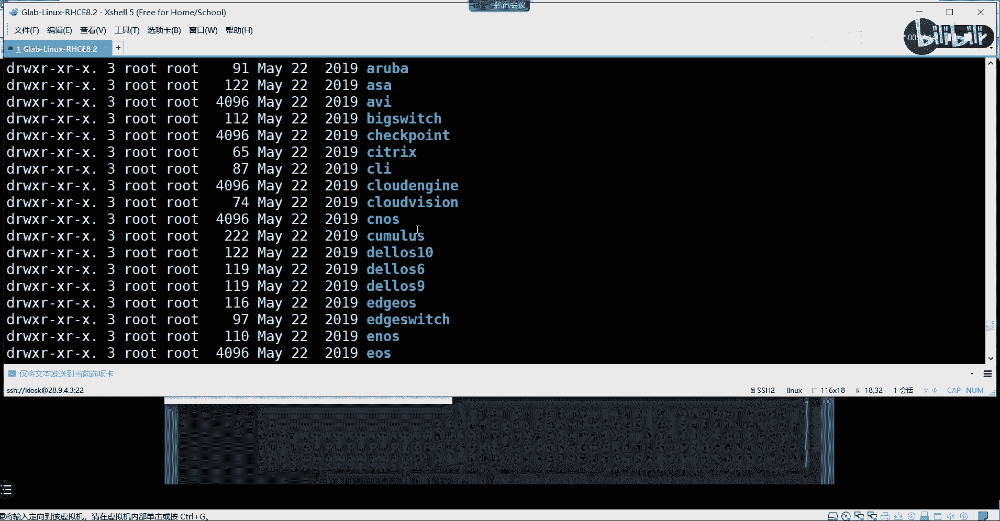
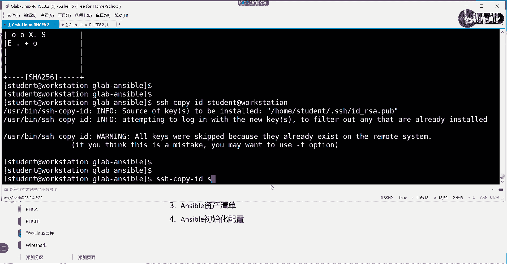

# 【Linux／RHCE／RHCSA】零基础入门Linux／红帽认证！Linux运维工程师的升职加薪宝典！RHCSA+RHCE／36-Ansible介绍 - P1 - GLAB郭主任 - BV1oz4y1w7CX

H。大家把麦进一下啊。好，我们大家都能看到吧。看到啊，那么我们开始之前呢，还是先说一下我们时间规划。从这周开始，我们是两天啊两天课，还有差不多还有6天，6天课的话，4天是S ball。

然后还有两天是模拟练习，我把时间给大家看一下啊。考试时间已经确定了，定在3月，大家到时候请假的啊，3月22号和23号两天。你们看哪天方便就请哪一天。啊，红帽考试没有放在周六周日的。

他们考官也要也要休息的，所以他都忘在工作日，所以到时候要看一下22、23这两天当中的任何一天都可以。嗯，这是可现自己选吗这两天嗯，反正我们。两天都能考。对，看你选的哪一天。但是每场8个人要平均分一下。

我们这次有十几个人考，至少8个人考。所以你你的时间先定下来，赶紧告诉这个这个班主任，他要帮你先排。知道吧？两天选一天。根据你的时间来选啊，一天8个人。不行，再调嘛。然后呢。

这个时间这周两天、27、28、两天，下周两天6、3月6号、3月7号两天port就4天的内容。这四天内容工作量非常大，就都是代码。大家需要消化，我会把代码都贴给你们啊。然后呢，另外模拟考试13号1天。

然后呢，20号一天。模拟考试大家必须要来现场。所有人。啊，没有远程，因为都是用我的我这边的电脑来模拟的，不是用你自己的电脑。听得懂吧？用我的电脑啊，当然如果实在来不了现场的，私下再跟我联系一下啊。

我我再给你想办法，我希望是所有人能来到现场，用我的电脑来模拟啊。OK好，然后呢，就是这个模拟考这两天放在这两天，这两天弄完以后，2323参加考试了。哎，老师呢14和21就不上课。对，让大家在家里练习。

在家里练习，因为模拟考测完之后，发现哪里不行呢，就在家自己练嘛，我会把环境都给你们。来这儿的模拟的测试环境，可能我要做一些小的改变，就模这是模拟考场。当然我也会把这个练习的所有的东西都给你。

我现在正在做，因为它的这个题目最近加了多cker的内容在里面，所以我要把原来的环境全部弄掉，然后重新再做一套新的环境给大家去练。啊，所以我现在正在做这套东西，然后呢，差不多应该在周一左右就会给到你们。

周一左右把这套东西都给你们，并且我把每个题的视频也都给你们。每次考试它就不变了，被上次。有没有上级考试。好，来，我们看这个第三本书啊，红帽RTCE的第三本书主要讲的是enspo。po是现在比较火的。

也是主流的一个自动化运维的工具吧。这是一个开源的项目。我们把b的简介啊。首先第一个内容我们来讨论spo简介sb是一个开源的自动化平台，它是一种简洁的自动化语言，O它是一个平台，它不是其实准确来讲。

它不是一门语言，它是一个工具。这个工具里面要能够正常运行的话，它里头有一个叫鸭么的语言，对吧？鸭么才是它里面这个工具要用到的脚本语言，一会儿我们看到鸭么，它是一个自动化的引擎。

用于服务IT的基础架构的自动化。好，在这里我要给大家解释一下什么叫自动化。很多同学啊在接触sb的时候，它完全不清楚这个工具到底要干什么。我举个实际的应用场景啊。举个例子，在没有自动化这个概念之前。

我们在运维我们的服务器是怎么做的呢？是不是每。每一台服务器上要配去去起各种服务，去开方火墙端口，听懂我意思吗？去y某去去压某一些软件，明白我意思吧？比如说这台服务器它是外b服务器。

你需要登到这台服务器上去把刚才说的那些东西都做一遍。然后另外一台是DB服务器，你需要登到另外一台服务器算把DB相关的服务防火箱端口也全都放开，打开，全部做一遍。如果有200台。

你的操作就跟我刚才说的要做200次。各位能听白听明白我意思吗？OK所以这样的话，对于大型的数据中心来讲的话，我们运维人员的工作量就特别大。就非常大，对吧？我们要运维几百台机器的时候，每一台都要这么干。

那雇一两个人肯定是不够的。所以如何来提高大家的工作效率，所以就提出了自动化的概念。所谓自动化的概念就是呃我们可以原先的这个操作是人去操作机器，对吗？对吧我们每一个人在跟机器进行交互吧。

自动化的概念它转变了思维，就是让机器去运维机器。有人说机器怎么均用为机器啊？我们可以通过脚本或者代码开发的这个语言，把脚本写好，然后装在这个机器上，通过这个机器自动运行这个脚本来管理其他的机器。

我说清楚了吗？明白了吗？所以自动化运维的理念，它提出了一个新的管理方式叫机器管理机器。听懂了吗？好，所以在我们sport当中的主体的架构是，它上面就会有一个非常主要的架构。就要聊到他一个非常主流的交构。

它既然是机器嘛，对吧？好，这是一台机器，我要管理一堆机器。这个机器要去管理一堆机器。OK所以在Sport架构里头，它把所有的机器分为两个概念，一个叫控制节点。一个叫数控节点。这听明白了吗？

控制节点就是我们呃在这个机器上要去写一些脚本语言，写代码。然后这些代码都写完了以后，我们可以用这个机器去管理其他的一堆的数控节点的机器。所以这叫机器管理机器，这个能听明白了。安斯波就这个架构。

我们主要控制的是受控节点，其他被管理的这些节点我们不需要关心，因为它会被直接控制节点去管理起来，去运行一些相应的服务啊，对吧？根据我们的要求去运行控制节点上的脚本，从而实现管理所有服务器的目的。

我说明白了吗？OK这就是sport架构啊，控制节点和受控节点。好，再继续往下看，这就是自动化的概念了啊。好，aspo呢它可以管理强大的自动化任务，然后呢适应许多不同的工作流的环境啊。

既然用脚本来实现管理，那我们可以通过实现脚本的逻辑的结构来管理复杂的服务器的应用需求。记住吧，脚本里面几乎都能实现，它的逻辑比较复杂。这就是我们学sb难点就在这儿。我们在ensb里面啊。

它还要学循环学条件，学各种判断，其实就跟开发是一样的吧，对吧？它只不过比开发的语言要简单一些啊，因为它主要关注的是工作流，运维的工作流，好，接下来第四个sb自动化语言它简单。那么功能比较强大。

它不需要任何代理。好，这里有一个概念叫无需代理。刚才这个架构里头有没有说需要一台代理的机器来实现所有的管理啊？不需要代理，它是直接在受控，直接在控制节点上运行我的asport脚本语言去直接管理受控节点。

中间没有任何代理。这个要区别于现阶段，除了sport以外的其他的一些主要的呃自动化运维的工具。除了sport，还有其他好几个，还有好几款。安port无无代理的。啊，其他有几款是有代理的。

所以无无代理和有代理的区别就是无代理是不是更简单一些，直接在控制节点上写代码运行就可以了。听懂了吗？有代理还要去部署代理代理节点，把东西送到代理节点上去，通过代理节点来管理所有的数控节点，这就比较麻烦。

明白意思吧？O好，然后第5个aspo，它是怎么实现对我的设备进行自动化运维的呢？这个是大家必须要掌握的，怎么实现的？大家看一下。看完以后告诉我安斯波。自动化运维我的受控节点用的是。什么协议？看完了吗？

看完了啊。好，这就是它核心原理啊。看完了，我给你画一下。控制节点到数控节点用的是。SSH。用SSH登上去，能听懂吗？OK然后呢，Sb的脚本语言叫鸭某。它是通过妖么的格式来写的，写的这个脚本语言听懂了吗？

好，SSH上去之后，把脚本语言通过SSSHSSH送到受控节点上。然后呢再通过其实应该是这样子的啊，这边我画错了，应该是这样子的。现在控制节点上把妖么语言。转换成python。转换成python。

通过SSH把转换的python送到受控节点。然后在受控节点上去执行你的python脚本。直接去执行拍线脚本。🤧执行完了以后，把python的这些东西都删掉。把python的这些模块都删掉。

各位能听懂我意思吗？ok所以。😊，所以大家看清楚看清楚这个图告诉我，在我的整个s管理架构当中，控制节点和数控节点一定要实现他们的。SSH的配置吧。他们的SSH是不是要配好啊？明白我意思吗？

OK这是第一点。第二点，它的所有机器上是不是都要装？是不是都要装python的解释器啊？如果没有python的解释器，它的这些pyon模块能运行吗？是不是不能运行啊？

所以sboard的前提大家一定要搞清楚啊，先把SSH都配好，然后一定要保证所有服务器的python都是装安装好的。这个大家不用担心python基本上现在红帽的各种发行版。

不光是红帽啊、渗透OS啊、末班图啊，其他的各种发行版，linux各种发行版。自带了系统就自动帮你安装了pyython。至至于是pyon2还是pyon3，大家自己去看。理解吧？

OK那么SSH默认操作系统也是开启的，只不过在刚开始的时候需要去初始化一下。听明白了。好，在这里我们主要给大家来说的是sboard的这个原理，它是怎么来管理的。通过SSH来远程登录。

然后呢呃通过y某转换成python程序推送到我的数控主机上，然后再数控主机上去运行python的模块，运行结束以后，直接把python的模块删掉，就实现了自动化的管理。听明白了吗？各位。明白了。好。

然后呢sboard的重要优点，什么跨平台，你看无需代理，我们看几个重要的啊，不光是linux上可以呃去去管理去实实行sportwind啊unux都可以，而且它不需要代理，然后呢。

它的压mo的文件的文本格式啊，这个是比较简单的，一会我们重点处理的，就是这个编写代码就是用的鸭某O然后呢使用sboard的playbook来进行更改，它的这个比较比较方便，然后管理起来也比较方便。

因为现在运维我的服务器只需要管理这个sboard yamo的纯文本的代码就可以了。我只需要去管理代码，这叫源代码可以视作为脚本的源代码，那么在在我的网络当中是这样管的。

我到了一个新的网络直接把源代码copy过来，稍微修改一下，直接运行就可以了，对吧？然后呢，它还支持动态清单和静态清单，什么叫动态和静态，就是我们数控节点的机器可以。是一个呃写死的这个静态的清单。

200台服务器。我把200台都写在这个清单里面。如果是动态的，我们也能够用脚本语言去实现动态拉清单的管理。动态的概念就跟我们动态路由一样的。就是网络当中如果是200台，它就是写写了200台。

那就是只去管理这200台。但是有可能呃某一个时间节点，200台当中有5台机器宕机了是吧？5台机器档期，我需要管理员手动去改这个静态清单才能改过来吧。但是如果用动态的话，它会去帮你自动的去更新这个清单。

能听懂吗？啊，就是实时的去帮你去拉取网络当中的主机在线的状态啊，是不是会更更轻松一点。后呢它的这个这个这个最后一句是红帽的一个商业款，现在我们觉的是免费的。它有一个叫t的，叫红帽卫星的。

这个是要付费的啊，这是他给企业推出来的一个企业架构的Sport。现在我们。觉个是免费的啊。来，这个价格我说过了，我们通过控制节点上，你看啊，这个是asboard引擎。

我们用户通过呃登录到asboard引擎里面去管理我的playbook，这就是我的playbook，从而实现对远端主机和远端网络。哎，这里要注意，它不仅仅可以自动化运维我的服务器。

它还可以自动化运维我的网络设备。比如说路由器啊、交换机啊、思科的、华为的都可以。明白吗？其实原理是一样的，不管是路由器节点还是交换机节点，它都是一台主机，对不对？可以理解为就是一台小型的服务器啊。

你服务器都能管，这些机器肯定也都能管。不能管，好吧。好，这是它工作原理。刚才我讲过了，可以在本地通过anboard的引擎，然后对这是管理节点吧。对所有的代码。

它这里有inventual inventoryory是我的这个这个这个叫什么呃清单。然后呢通过playbook脚本压模语言，通过压模的模块然，asboard模块来实现整个脚本的书写，写完了以后。

通过管理节点的这个an board模块转换成python。这个是python的代码，通过SSH把python代码送到我的被管理节点上。然后在被管理节点上执行自动执行python的语言。

这个脚本语言就实现了这个服务器的管理。呃，执行完了以后，python脚本就全部删掉。🤧不影响明白吗？OK这是他一个工作原理，听明白了？好。好了，来我们来看一下啊，接下来我们来看控制节点的组件。

就我们在控制节点上有哪些东西。首先第一个叫配置清单，这个清单大家应该能理解的。我既然是要去管理我的服务器，你至少要在控制节点上去标明我要管理哪些远端的服务器吧。所以所有被管理节点被放在哪里。

就放在啊放在这个清单里面。不好意思，说错了，这个叫配置吧，叫安board配置。这个配置的话，一会儿也就它的主配置吧。第一个我刚刚说的清单是这个所有的服务器呃列表是在哪里？应该放在清单里面。

所以这两个文件一会儿会给大家演示啊，重要的文件。然后第三个是它有核心模块有400多个，也就是说它主要用模块化的方式来实现对所有设备的管理。

比如说我们要去管理这个服务器安装我们的这个呃软件模块它用的就是压模的模块，这是模块，不是命令啊。如果他要去更改某一个文件，他用的是fi的模块。听懂了吗？OK所以他把所有的管理功能都模块化了。

我们在管理服务器要实现功能的时候，要去找对应的模块。明白吧？好，所以呃大家应该能发现aspo其实跟我们之前学的linux的一些命令的区别在哪里啊？之前我们去管理服务器安装用的是y某RPM是吧？

去管理去安装软件包，是这个是这两个命令，对吧？现在我们在学ensb playbook，学的是它的模块，就学这个模块怎么用。所以把原先实现同一种功能的这个目的，又学了另外一种方法。

就安b里面的这个模块的命令怎么用的？你才会去写这个脚本语言。明白了吧？就是这一套东西再再重新再学一套东西。好，copy啊，我要复制文件，原先用的是copy的命令，现在用的是copy的模块。

这个模块怎么用？就是我们pir学的。所以我们这样的模块大大小小多多少少，现在有400多个核心模块。400多个，但现然现在应该不止啊，很多个。所以大家不需要把所有的模块都学。

只要把我们主要在运维工作当中遇到的模块学一下。然后如果遇到了新的功能需要实现，那你去查asport这个帮助文档就可以了。好，然后我们也可以自定义模块啊。这些模块你可以用python来写。

也可以用ruby来写，也可以用希尔来写都可以模块模块都是能写出来的。它是一个开源社区嘛，所以任何一个人都可以把模块写出来，贡献给社区的人，给其他人去用啊。理解吗？OK所以可以自己写，也可以用啊现成的。

那么playbook主要是用ymo这个语法格式来写的，一会儿给大家演示这个是什么样的格式。好，它的插件我们先不说啊，插件还是比较强大的功能。最后一个大家了解一下。playbook执行的时候。

它的特性叫密等。什么叫密？就这个脚本我第一次执行。他是不是应该能够把能装的服务都装上了，对吧？那如果我再执行一次呢？再执行一次。他会怎么选择呢？第一种选择是把所有的东西再装一遍。我刚刚是不是装过了。

对吗？他再把这个模块再装一下。是吧或者把文件再复制一下。第二种选择就是他会去判断在执行之前先判断你有没有做，是不是做的话，他就不会再去执行重复的动作。就这两种选择吧，听懂了吗？好。

as board的执行方式是第二种。就他执行完了以后，他不会再重复执行相同的动作。对吧他有一个判断机制，他会去判断你有没有装装了，他就不会再去执行。这叫密等性。这样做的好处是不是很明显？

对吧不会去浪费资源。而且呀有些有些服务器上的操作，你不停的去执行，可能会产生一些未知的bug。会有一些错误，听懂了吗？所以啊playbook在执行的时候，它用的都是me。执行过一次，不会再重复执行。

所以大家在我们的这个控制节点上不停的去执行playbook，不用担心它不会报任何错。因为执行过了，它就不会再执行了，听懂了吗？OK好，这个是它的例子。好，那么接下来。我们来演示一下好吧。

我们来简单的演示一下。

这个是我新做的一个环境啊，我不知道。

所以啊因为它更新了docker嘛，docker的这个一些实验实验的这个练习。用以前我给你们的练教学环境是做不了的，必须要用我现在要给你们的，好吧，所以这个我赶紧做出来给你们。😊，嗯。这么看啊？好了是吧。

环境跟之前差不多啊。大体上差不多就加了一些东西而已。好吧，来我们看一下啊，IPR好嗯，2894。1。这个机器开起来以后啊，因为我加了一块网卡，我就可以我这个功这个我已经之前教过你们了。

是不是在虚拟机里面加一块网卡？

呃，新的环境我拷给你的就已经加好了，直接调节过来了。所以大家直接看一下地址就可以了。然后通过外边的机器来对它进行管理。

嗯。就是这个。

好，那这个机器我就可以关在这，不管它了。这样的话我的复制啊什么东西也都方便一些。好，这个就是我开的那个环境啊。呃，首先看一下。我现在的。看一下我现在的教学环境用的是哪个环境，134啊。

134是我们第二门课，对吧？我们要把它改过来，改过来怎么改clear。叫RHT杠clear cost0先把环境都清掉。好了吧，好了以后接下来我们嗯叫RHT杠st courseRH294。

把我们的课程改成我们第三门课。R去294。嗯。

等一下啊，开机要要一点时间。好，环境开好了，一会儿我们要做哪些事情呢？来给大家写一下啊。好，简介说完了啊，它的特点刚刚就那几点，大家记住一下，尤其要了解它的工作原理啊这个。工作原理。一定要知道。

工作原理一定要知道，听明白了。然后接下来我们来讨论Sboard的安装啊，Sboard它说算是一个软件，默认应该是没有装的。我们需要把它装起来。装完了以后呢，第一个是安装，第二个还要配置我们的环境。

这个配置环境包含哪些东西啊，是不是SSH要配啊？对不对？还要配置清单。配置清单还要配置asport文件。配置asport的主配置文件。好，就这几个东西，一会儿我们要做好吧。这是我们要做的事情。呃。

配置环境主要涉及到其实主要就两个任务，一个是SSH的配置。还有一个是我们的sboard的一些配置，就是这个配置包含清单配置和主文件的配置。ok其其实就两个任务，我这边写了3个听明白了。好。

那SSH这里我们要重点提一下。呃，我们在第一门课讲到SSH服务器配置SSH有几种方法呀。还记得吗？SSH的实现有几种方法。第一种是密码登录，对不对？SSH登录进去之后，他让你提供用户名和密码。

你才能管理服务器吧。第二种是什么密钥吧，还记得吗？密钥登录，就是我先生成一张新的RC的非对称密钥证书，生成完了以后，我把公钥从我的这个服务器copy到我的受控节点服务器上，明白我意思吧？好。

公钥共享了以后，我直接通过SSH进去之后，是不会提示任何断了是吧？OK刚刚说到SSH啊，它有两种方法，第一种是密码，第二种是密钥，就是证书嘛，对吧？然后呢。

你觉得在这里我们的Sword应该用哪种方式会方便一些啊？用哪种？它是不是要不停的SSH到我的数控节点上去传递python的模块啊？python脚本对不对？你觉得机器管理机器的过程，你需要提示密码。

让机器去输密码方便吗？肯定是不方便的。听懂了吗？所以这个SSH一定要用免密钥的，就是不需要让它互相提示说输密码，理解我为意思吗？各位。啊，所以这里的s波啊，我们应该。又断了。

所以这里的Sible我们应该用的是什么？免密药的。免密钥的方式来进行登录。所以这就是我们要配的，就是我们要配的，明白吗？Yeah。好了。

好啦，好，来，我们开好了，开好了之后呢，来我们把它装一下RHT杠BMCT2。Start。Classroom。先把classroom打开，然后再把所有的机器都打开。

294的环境就是我们考试练习的环境啊，考试练习也是用这个环境来练习的啊。然后呢，这个134的环境就是我们练考RHCSA的环境。只不过考试环境和我们的练习环境不一样。所以我要再要改一下。

把把这个我们大家平时的练习环境改的更像考场上的环境，理解我意思吧？那么我们的SCE的这门考试，就是用294来改的。所以我先把这个环境给你介绍一下。有有几台机器啊。他有一台数控节点。

这台诉控节点叫worktation。然后呢，这个要管理4台机器。serA。BCD它有4台数控节点。所以控制节点就一台，我们通过worktation上去写。鸭某的脚本对吧？然后我们装asible。

是不是也是装在worktation上？对吧装完以后，然后呢装完，然后去写脚本，还要保证他们上面都装了python。拍审不用看，应该都装了，明白我意思吗？OK好。

装完asport接下来我们要做的是就是要做免密钥的SSH。这个都是S要建立。这个免密钥的SSH。这个听得懂吗？那么要做这件事情。

开机呀又要有一点时间了，总共有5台虚拟机，不止啊好几台。

啊。然后这个新的环境我给大家做了虚拟机的管理的快捷方法，就是把actives点开，会不会多了一个这个东西啊？

这个东西就是管理虚拟机的快捷方式，我们点开。所有的虚拟机在这里。都能看到，等一下啊，开了几个。Sorry。还在开没开好，4文B没开好啊。那overB。所以如果说重启关闭，直接用这个就更方便一些。

等一下开机要一点时间。来，我们把这个内容说完，我们休息一会儿啊。来，我们先通过SSH先到我们的先到哪里，先到我们的控制节点上去。SHH通过student啊这种方式就是免密的方式，直接登过去了，对不对？

不需要密码，直接进去了啊，因为环境这些都给你配好了。好，在这里我们要做的第一件事情是安装我们的安ible啊，怎么装呢？因为是普通用户student进来的。

所以我们安装的话要用y installstore，要用速度要提全。对吧。Aspo。呃，密码是sdent。嗯。😊，现在sport是2。8，看到这个状态啊，你就说明它已经安装了，对吧？已经安装了。

如果没有安装，大家记得这么装的啊，速度啊，要么instoreO然后就这样把Sb先装好，装完了以后，接下来我们要做的第二件事情，就是我们来简单的看一下。通过Sport杠杠。

versionion可以看到我目前的版本是什么？这第二个命令啊，asport version看一下。好，然后呢我们的主配置文件放在了，它只要安装完软件，默认的配置文件都会放在ETC下面。

ETC上有个sport的目录，目录下面有个sport点CFG，这个是主的默认的配置文件。能听懂我意思吧？好，这个配置文件里边内容会比较多。

我们可以看一下ETCport上面的asport点config这个里边的文件非常多，内容比较多。装完以后，我们不可能用它默认的这个文件，我们要自己去创建一个新的文件。

就是自己创建属于你这个环境下的sboard组的配置文件，这个能听懂吗？OK好，然后你会看到s board用到的一些模块放在什么地方啊，它模块放在这些地方，你可以自己去看一下，对不对？模块放在这个地方有。

然后这个地方也有USR什么more来，我们把这个模块给大家来看一下，看一下啊，我们CD到刚才看到的这个模块下面去。然后LL看一下唉，这个模块里面没有是吧，as per module。PWD。嗯。没有。

嗯。来看一下啊，是不是这个模块。PWD。user希尔asberg哦，这是插件模块啊，这个是插件模块，不是这个应该是s package。有一个叫。Mo module。那就再退出来。Psport，杠杠。

看一下啊。这儿在这儿。好。上面是一些插件的模块啊。好，这里就是我们所有的模块，我们可以通过WC去杠L统计一下21个，那海冰到模块是吧？mod下面。系有。24个。怎么这么少，我看看啊哦。

不同的售控节点的类型。看啊我们能够关心的类型有哪些在。你看啊我们关心的网络类型可以是网络节点。对吧然后呢，也可以是我们的呃系统。对吧可以是windows这边列出来的是什么？

就是sible能够管控的受控节点的类型。可以是网络，可以是系统，可以是windows，可以是lininux，可以是存储storage。我们来找一个我们比较关心的网络里面去到network上面去看一下。

是不是可以管很多东西啊，补油啊，对吧？然后那个NOSNOS是什么？NOS是这个nexus的一个系统。然后还有什么F5看到了吗？啊，E叉5S。这些都是网络的操作系统啊。理解吧？网络strix。

明白，所以网络所有的东西都在网络的这个目录里面。你在这里看这里能看到的他都能管。

这里能看到他都都能管啊，他都能管好不？好，然后其他的我就不给大家一一看了。模块怎么去找这个呃模块在什么位置，你可以通过Sb杠杠。Motion。可以看到这儿，这是它的主模块啊主模块。好。

那接下来我们来改一下我们的这个先改我们第一个，先改我们的配置文件，先改我们的配置文件，好不好？好，配置文件我们来看一下啊。嗯。我的配置文件。稍等一下啊。先改我们的配置文件。好。

配置文件我们最好一般是怎么来操作呢？我们一般在student下面新建一个。属于自己的一个一个目录啊，m第二我们可以建一个嗯。随便建一个吧。Make个d2G。asport好。

然后到CD到sport这里在这边我们建属于我们自己的配置文件。好，怎么建这个配置文件叫NSIPsport点CFG。asport点CFG对吧？好，在这里写几个比较重要的。我们这个不需要去记。

因为它有默认的配置文件。我们开两个窗口。好，在这里我们开两个窗口，把默认的配置文件打开。s啊打开搜几个东西。第一个是嗯它的这个。じ。Inventory。啊，叫dforce在这里啊，就这里。

所以这个也可以呀，我们把defaultt它这两个东西把它给它写出来。复制一下。今天好嗯，这个不需要。这是一个注释嘛，对吧？好，关于defa这一个内容里面的话。

我们主要关心它要指定它的inventory在哪里。对吧？好，这个inventory应该在哪里呢？就是在我的刚才是不是有写，是不是在我的加目录下面的叫呃 studentdent。student对吧？

加木路下面建了一个叫zlibber杠。安berg尔目录下面。inventure，这就是我指定到我的这个这个要被受控节点的那个list在哪里？🤧好，然后这是第一块。第2块我看看还有什么啊。嗯。

还有一个叫privi。应该在下面啊。在这好，这几个比较重要，我们把它都复制过来。这个是在确定我们登录到我们的数控节点上，它的一些权限的问题。第一个。他需不需要提全，需要通过什么方式提全，通过速度来提全。

然后要不要变成什么样的这个那要跟谁去借权限，我们跟root去借权限，要不要需要密码，不需要密码。因为我们用的是免密钥的登录，听明白了吗？OK好，这个配置文件，我们先给它写这么多。好，我们来看一下啊。

在这里我写了一个配置文件，听明白了吗？好，这个配置文件大家会发现spo在执行的时候一定会先去加载这个主配置文件吧。只有加载了这个主配置文件，他才知道到哪儿去找这个清单列表吧。

这个地方是不是指明了清单列表，指明了一堆的权限的相关的操作啊？所以主配置文件做完了，还得去配置我的清单列表吧。好，搞清楚清单列表应该配戴什么目录，就配戴这个目录吧。对不对？好。

现在我是不是就在这个目录啊，我直接在这里去建我的清单列表。好，大家来看啊清单列表该怎么写。新能列表要怎么写啊？我们VIM。Invent。inventory就这个名字啊。好，这个清单列表它是有这个格式的。

第一个中国号代表的是你的主名，我给大家写几个好不好？我给大家写几个，大家来判断一下啊。第一个啊。呃，比如说我不写中国号，我直接这样写1。1。1。1。2020202，这就是我们的主机地址是吗？对吧？

能看懂吗？好，然后3。3。3。3不是3啊，我们用3。3。3点，后边加一个中国号一冒号15，中国号，这个能看懂什么意思吧？说明是从3。1到3。15写了一个range，我我相信大家应该都懂，我写一遍说一下。

应该都能都能懂。能听懂吧？好，这个是以IP地址来写的。我除了以他来写，完还可以写什么？Test。01点。example点com这个是什么？域名嘛，对吧？域名的前提你一定要有DNS对应。

因为他要去找这个机器的时候，先要发DNS解析，最终还是通过IP来通讯的吧。各位能听明白。好，这是test一test02。whatt02点。EXMPRex点comM。看得懂吗？好，继续好，test。

如果我test加一个中括号，下面写05冒号09。example点com这个应该也能看懂什么意思吧。就是test05到09这个域名所有的是不是中国号就是一个range吧。各位能听明白。好。

接接下来写了好web。😊，接下来我要写中国号的对齐方式，刚才上面都没有中国号，现在我要写中国号叫web server。下横杠。Svers。好，在这里呢我们来写192。168。1。2。没问题吧。好。

web1点EXAMPLE点COM没问题吧。好，V82点EXAMPLE点COM没问题吧。好，请问这个时候我写的这堆内容跟我上面写的那堆内容区别是什么？上面是单个的主机，不管是IP还是域名，是单个的。

对不对？在这里我又给它分成了组吧。这个是组吧。所以接下来我在处理我的服务运维服务器的时候，我可以直接指定这个组，他就把下边这一堆机器。都管起来了，就以组的方式来进行管理机器，上面是以单个机器的方式。

能理解我意思吗？各位啊，好好，比如说我还有再写一个叫DBserv。是不是又分了1个DB组啊？好，192。168。2。2没问题。好，再写一些域名叫DB1点EXAMPRE点com好，DB2。

EXAMPRE点com这不是又分了一个组叫DB嘛，对不对？好，这个应该能看懂啊。像上面一样。好，我再写一个。钟浩。中括号啊给它括起来叫all service。好，在这里我不写单个主迹。我不写IP地址。

也不写域名，我这样写叫。2。service它在后边加一个冒号，有一个叫CHILCHILDREN。这什么children是吧？好，在这里我写两个东西，一个叫DB。service还有一个叫web。是个意思？

好，请告诉我这个作用是什么？あ。是不是做了一个组的嵌套啊？啊。各位能看明白吗？所以如果我直接调用our service，它就把上面的两个组，这直接就它就包含了上面两个组的所有主机吧。所以这一定要这样写。

明白我意思吗？嗯，我会把组又放到另外一个大的组里面。主机放在一个小组里面，然后我把某一个大小组放到某一个大组里面。那听明白了吗？啊，明白了啊。好，明白了这个inventory我就写完了。写完了以后呃。

我们来看一下，我们配置了两个重要的文件，一个叫主配置文件，一个叫列表清单文件。听明白了吗？清单文件里头所涉及的那些小的细节。我给你讲的就是你要掌握的那些复杂的东西，清单里边还可以做很多种花样。

很多种方式。那些等到后面大家再去熟悉啊，刚开始熟悉的阶段不要搞那么复杂。好，接下来我们在这个目录里面，我们去看一下杠杠version。嗯。我在当前目录去执行asper杠杠version的时候。

它是不是告诉我主配置文件改成了我刚才的配置的这个文件。各位能听明白吗？我现在在这个目录下去呃去看sport的话，他会告诉我，如果你在这个目录下执行的话，他去查找的主配置文件，就是你刚刚配的那个主配置。

这不是默认的吧，默认是不是在ETC下面。现在不是ETC能听懂吗？OK好，如果我先退出来呢。😊，As for。这个是不是就是用来默认的？听懂了？好，说明一个什么问题。说明什么问题？在这里在这里。

我去看的时候就用的是我这个当前目录下的主配置清单，说明如果你在执行安port的时候，当前目录下的主配置清单是优于优先于默认的安port主配置清单，听懂了吗？

其实也没有谁去在USSboard用它默认的现在。因为默认清单里面写的东西太多了，而且不太符合我们的实际网络的一些环境。听懂了吗？我们都是在我的当前这个目录下面自己去创建一个属于自己的sport的主清单。

就像我这里这样写一样，根据你的要求往里写，你需要的内容往里加。各位听得懂吗？OK因为你只要在这个目录下写了，它就用的用的就是一个主清单。因为当前目录下的主清单，是优先于ETC下的默认主清单的。理解吗？

各位能听懂吗？好，所以这个时候啊，他去执行这个组清单了以后，就会自动去加载你的inventory。听得懂吗？好，来，接下来我们来看一下，来简单的来了解一下，我们现在清单有了，主配置清单也有了。

虽然SSH没有配，但是我是不是可以通过Sible去加载我这个组的配置清单，去看我清单里边有哪些东西啊。看清单不是这样VIM inventoryvent去看，这个是编辑清单。

我们要看sible能够调用清单当中的哪些主机是要通过安波去看的。来看啊。第一个啊sible all。杠I去指定我的。inventory这个清单，然后杠杠list杠hos。这第一个命令。

是不是把我刚才所有的清单都列出来了？杠2啊安波2，也就是说刚才的清单能不能被安斯波去读取？好，能读的话，请你帮我把。我写的我这是我自己写的呀，自己写的inventory。

这个是inventory的名字啊。这个inventry就这个inventry能听懂我意思吗？各位。OK好，如果能读取来，请你去到我这个自己写的evenventature清单当中。

把所有的主机都给我列出来。这个是第一个命令，没问题吧。好，这个这个命令大家先听懂，然后再记啊。好，第二个anport。好，大家来看我怎么写we。serverーvicice。

对吧然后通过杠I去指定我们的inventory杠杠list。Host。🤧えい。哪里写错了？下划线哦下划线嗯。这里写错了，它就不出来是吧？下划线啊。就对了对吧？好。

这个是把我指定的inventry当中这个组，这是一个主的名字啊。对吧我把这个组的名字啊。啊，对应的主机都给我列出来。没问题吧，各位。没问题啊。好，再继续再来一个anible1。1。11。1。1。

然后去指定inventory。我们来看不指定inventory可不可以，我不加杠，啊，不指定inventory好不好？然后刚刚list杠。Hose。是不是也可以啊。

不指定inventry它默认为什么也可以，因为它会去读这个asible主配置文件，主配置文件里面不是已经指定了它的这个inventry吗，不就是它吗？听得懂吗？OK所以不需要指定。

但是如果你有其他的呃清单文件。嗯。如果有其他的清单文件，在其他地方不在这个目录下面，你就要加杠I去值了。听懂吗？好，这个没什么问题啊。好，再来一个as。

test我记得有个test01点EXMPRE点com，我们去去查这个域名。不指定啊不指定。杠杠。STS。也可以吧。好，这个就不去演示了。好，这个就不去演示了。那我们来简单的演示一个其他的。

比如说我们可以这样子sb1。1。1。1逗号2。202。是不是也可以啊，查这两个杠杠list杠。Host。所以要查多个用逗号隔开，听懂了吗？嗯，好，再来一个as for3。3。3。3呃3。1。新号。看看。

看到了吗？信号代表任意，请告诉我这个符号是通配符还是正常表达式？今天我们学了呀。通背服吧，通背服啊，同志们通背服明白吗？通背服代表任意，智能表达式代表重复多少次吧。还记得吧？对不对？所以搞清楚。

我们可以结合通配符的方式来做asport这个list清单的筛选。明白好，没问题了啊没问题了。好，那么再来一个来一个复杂的啊，再来一个复杂的。大家先看我写啊anbo。😊，用单引号把它引起来。

然后这里写web。service下横杠啊，web service，然后冒号DB下横杠。Servicice。好吧，然后呢我们再通过list杠，行，先告诉我这个结果是什么。跟刚才都不一样吧。啊。猜一下。

是什么呀？web是不是3个DB是不是3个啊？所以这个是代表的是这两个组。所有的机器都给我列出来了。听得懂吗？O好，再来一个。😊，我把前面加一个。我给他前面加一个特殊的符号，哎，在哪来的？在这儿。像这个。

有没有啊好，没有，请告诉我。呃，还有一个。除了这个特殊的符号之外，还有一个感叹号。有没有啊？好。这是什么意思啊？这是什么意思啊？上面是猜得出来的，焦集是吧？上面是这两个组的交集的交集的部分。

下面是这两个组的差异的部分。这个差异就是前面跟后面的差异。你把你把这个放前面和这个放前面，结果应该都不一样吧。你和我的差别和我和你的差别，它的输出应该是不一样的。听懂了吗？但是交集肯定是唯一的。

他俩没有交集。听明白了？OK他俩没有交急啊，所以这两个啊作为一个补充啊，大家要要要要要要看一下。好吧好。好。嗯，我们把这几个命令给大家来列一下吧。就这些吧。就这些。自己整理一下，好吧。我就不给你整理了。

自己整理一下，就照的视频再整理一下。教材上也都有啊，看教材的也可以。Yeah。好，这个就是我们的invent，这个做完了以后，接下来我们要做第二个操作了，就是要配我们的配什么？SSH免密嘛，对不对？好。

那么SSH的免密怎么做呢？首先。首先啊在这里我们所有的管理的这个方式都是用的ddDEVOPS。通过dop用户来进行管理。

看啊。在哪来着？在这儿是吧？

嗯。稍等一下啊。接下来我们来做米密啊。考试是底bo，但是我们练习用的都是tudent都可以。

啊，没关系啊。写一下啊。也就不管用什么样的用户去登录啊，都要都要去配置对应的。我这边写一下啊。对应的普通用户的。缅闭。对应的普通用户的免密。在这里我们的教学环境用的是。student用户考试用的是。

Evolves用户。他给你什么用户，你就怎么做，听懂了吗？他给你什么用户，你就把我现在这边的student换成那个名字就可以了。谢谢吧？好，来看我怎么做啊。

首先，在SS在worktation上，我们要产生。啊，要产丝对炼的用户应该都有嘛，对吧？应该都有ID。他说这个用户应该每一台机器上应该都有，这个大家不用怀疑，应该都会存在的啊，应该都会存在的。好不好？

不不行，我们去到另外一台机器上看一眼。So人。那么ID。student有吧？如果是developopITDEVOPS应该也都有啊。现在我们用的是tudent。BCD就不看了啊。在student上面。

在station上首先通过SSHG呃SSH的这个。这个叫什么？这个叫key件了。对。去产生一个密钥。就产生一个密啊。推车推车推车。好，产生好了以后，我们把这些秘钥一个一个全部copy到我的公钥啊。

一个一个都送到我要管理的所有的机器上，包括worktation自己。通过SSHcopyID。对吧好，这个是copy IDD自己自己怎么做啊。

自己就是STUD这边s student一定是他给你指定的用户名字。因为所有的密钥都是基于都是基于这个用户的，对不对？好，这是ski的第一个。第二个。

S T U DN T student at survey。

哎，哪里不对。呃，or keybecause already啊已经存在了啊，student的用户已经存在了。

算了，我们用dvol吧，好吧，就用dvol，因为dvo几几个机器也都有。这样的话会看的更直观一些。SSH。He。如果用dop，这边又退出来了。就不是用student来登啦。DEVOPS。

对吧应该有dSSH。Key。产生key的一个密钥。回错回回错好了，然后再通过SSH的copy。然后通过DEVOPS到哪里啊？到serverA上去。好，这时候就不一样了，对吧？应该看到这个效果才对。

yes。是的。好，密码。Student。哎哦，red hat。好好了吧。好，B。Yes。Ray hat。好了吧？好，C。Yes， really have。第。Yes。Re hand。好了吧，没问题吧。

然后还有一个是自己自己也也WOKSTATI我其实自己不需要，但是呢。自己产生的自己还要告诉嘛，对不对？应该有了啊，现在密钥应该都搞定了啊，明白了吗？各位好，明白，这个搞定了之后，我们可以来简单的测一下。

我们可以通过dopps。😊，OPS这个用户，我们通过student上去servver，要有没有让我说密码？没有吧？听懂了吧？所以要的就这个效果。好吧。好，所以第一步做好了。第二步还要提全。

你官密码免密登上去之后啊，我还要有可能要有些装软件一定要用root用户才能装吧。你通过dop上去，你是通过dops上去的。但是要装一些东西的时候，一定要提全提全也要做，怎么做呢？在我的呃提全啊。

提全应该通过root用户去提全。我们要通过肉体用户。在这里我们通过SSHroot。要配置我们的so doer文件吗？这之前都讲过啊。嗯。叫什么？呃，哦就VIVS速对，就这个文件直接打VI速。

在这里我们搜索一下WHEEL这个目录啊，在什么地方在在这儿这边加一行。在这边加一行百分号。我们把DEVOPS。对吧我们把DEVOPS或者说不用它，因为DVOPS的默认就在这个Y里面，我们把它去掉。

把前面的井号注释去掉就可以了。给大家看一下第一VOPS是不是在这个Y里面。嗯。な僕t。有ID。啊，他不在，应该是servver上在啊。SSH root。Sver B。我来看一下。IDDEVOPS。🤧哎。

不在这个里面呃，我看一下IDSTUDNT哈我看一下。哦，是tudent在这个w里面DVOPS不在，不在的话，应该怎么做呢？井号还加上跟他没关系，我在下边重写一行。提全吧，摆分号。第EVOPS。

照在上面冲打一遍嘛。等于。2。对吧no。看什么。这个就代表啊我们要既要这个DEVOPS所在的组，这个是组啊。嗯，可以借助任何用户进行提全，并且不需要这个用户的密码。

如果是不是这句话是不是可以体体现为我可以跟root去提全，并且不需要说root密码，理解我意思吗？好吧，好，这个这一句打上啊，把这一句复制一下，其他几个机器也都要做。所以准备工作要先做好。

而且一定要用root用户对这个几个机器进行这个文件的修改。搜索一下。在在这儿加一行贴进来。对了吧，DVOPS没对齐，没对齐，不要关系没关系。C。D。好了。😊，这些都做完了，可以了吧？明白了吧？好。

明白了以后，接下来我们可以通过啊还是通过这个dboxs到work stationation上。

大家想想我们现在做了哪些事情啊？免密做了用的是DEVOPS不是student。对吧好，把所有的密码公钥全部copy到所有的机器上啊，然后呢呃包括这个提全的配置。

在soduer里面对我的普通用户进行提全的配置也都做了。安ible配置清单做了安port的主配置文件也都做了，并且测试验证安ible是可以直接调用我的配置清单的。听懂了吗？好，SSH有了这些都做好了。

是不是可以测试一下我的机器能不能连到通过S本能不能连到我的数控机器上去啊。是不是啊？来，我们测一下怎么测。能不能连到我的数控主机的机器上去？

在这儿。还是在dops的 works station上，我们通过asport。哦，这里的这里的配置文件就要改了。Emoary。CD到lib里面嗯CD到。哦，不在这里是吧？哎，那就是在这里重新写呗。

刚才建的是在那个student的用户下面，不在这个目录下面，对吧？重新建一个。叫鸡来本。就叫gla吧，好吧，然后CD到gla上面去。在这里我们根据刚才的配置再来一遍，我们把。asportCFG的文件啊。

复制过来吧。CP。home下面的。student上面的。B。呃，对正这下面的这个。home下面的student下面的看看哦，没有权限。嗯。

CPhome下面的student上面的这个嗯把自己所有的东西都copy到。home下面的。这个 divorcevo。在这是吧。哎，我入这用户这个普通用户。可不可以？可以。来，然后我把它CP到。算了。

就在这里吧。尽蛋表把它删掉RMDR。就在这儿好了，S board。Of course。home这个要改是吧？home下面的DEV下面的asible啊，没问题。但是。这个文件要改。这里面不是。

这里边要改吧。为么要改。这个是read only。嗯。因为是入体用户的。算了。嗯，复制一下。

懒得写。

来看这样可不可以啊？CP。Hport。到。Asport。重复了来一个名字。好，这就对了是吧？然后我把这个删掉2M。Thanks， for。把它删掉。然后再把原来的改改过来，an for一an for。

MV过来。好了啊。还有还有一种这个CPinventry反正是要是要是要重新做的，我就把它删掉这个inventry。也烦。算了。Inventory， inventory。

一O2M杠2F inventoryvent。MV eventually一 eventually。好，现在都变成了DVOPS的了。好，让我们来简单的改一下。Asport safety。你把这个改一下。

这个不对。在哪个用户啊，也不是student，应该是DEVOPS是吧？里边没有目录了，就是就是在这个第1个OPS在加目录下面。然后下边的都不变，保存一下PWD确认一下DVOPS的加目录下面啊。

没有任何东西。好，inventry的文件要改，因为这里头一大堆东西不是我们环境当中的机器，刚才只是演示一下，让大家看sport能不能调动这个list的清单嘛，我把它清掉，我把里边东西都清掉。

我们可以通过一个之前学过的命令叫eco加个空格定向符到inventory里面。然后这时候你再去编辑一下emailry，是不是什么都没了？从对向前面讲过的啊就用一下。好，接下来我们来来编辑。

我们来写好不好？来写啊。这个我来看看我的这个清单应该是怎么写来着。嗯。无所谓了，我就这样写吧，好不好嗯。先分组吧。server我有几个 serverer，一个是serverA。好吧，好。

然后呢sver A点lab点EXAMPOE点com，这是我的第一个。这我第一个好，第二个。嗯。这个servverB。soB点lab点。example点com。再写一个。

我就是为了让他呃把这些服务器都列出来啊，你可以分组，你可以不分都可以。servverC点le点EXMPRE点comM。对吧好，再来一个serv D。sver地点lo点。好了，你就这些吧，来我们测一下。

asb用刚才的学习的2不需要去指定inventory，直接杠2就所有嘛，对吧？杠杠list杠hosts。啊，都有吧。好，这些都能读出来，这不是我想要的。我想要的是现在主的配置文件也做了SSI也都做了。

免密也都做了。我们来看spo能不能远程登录到数控节点的主机上。我们通过spo怎么做呢？它有一个叫po2，对吧？要针对哪一台机器加个R，有一个叫杠M杠M叫model，我们用哪一个模块用P模块来测一下。

啥东西。啊。没其他了。你为我没接锁吗？B。第一场没有吗？等一下啊。可能一开始的公要。这个所有的朋友。公钥我已经都传过去了吧，就是对方的公钥没没传到这里。呃，我只要把我这边的公钥。给过去。

因为我这边登过去的对方的公钥要接收一下是吧嗯。不需要呀，应该不需要怎么办？一个一个来吧。4A杠M。Pin。有什么意思啊？是不B。刚接触过了是吧，C。现在好了，我们来看一下啊。

这个绿色的就代表它已经能通通过pin，就是s board里面的pin，就是这个这么来做的。如果不用sboard，我可以直接去拼serv嘛。思维是这样投的对吧？就是不加不用Sb模块。如果用Sb模块。

就是这样来做的。sport目标是谁？然后杠M是指定模块啊，用pin的这个模块来进行测试。那么我们能够看到它都是绿色的，说明没有对远程主机进行任何改变。绿色是只是只是就对对方做了一个pin的测试。

没有对对方进行任何改变，能听懂你意思吧？OK好，所以这就是简单的。刚才有一个证书要接收看一下啊。做了一个证书的接收啊，接收一下就好了。公钥对方的公钥。对。对方的公钥。

OK好了好了吧。那么这个是我们这个如果说我想呃这个是通过pin来测的，我们来再给大家演示几个anible。

s文A对吧？通过杠M。杠M杠M这个参数comd command是它的默认选项啊，也就是说你可以不加这个杠Mcom，我们先加一个。Commond。啊，用comode这个命令杠S。I give就是它的参数。

我们来输入什么样的命令，post name。嗯嗯。😊，这个能看懂什么意思啊？通过sport上去，通过common的模块，然后呢在登上去之后输什么输hos name是不是显示我主机名啊？黄色代表是对。

其实common的这个命令ho name有没有对对方进行任何更改？也没有吧，他应该显示的应该是绿色才对，对吧？你没错吧，应该跟P一样才对。你准确来讲，也没有对对方进行任何改变。

只是看了一下对方的ho name吧。好，common就是这个特点，它其实他没有办法去判断我到底有没有对对方进行更改。啊，不管改没改，他都会给你黄色。好吧，这就是这个模块不好的地方啊。

但是我们可以通过它来简单的对远端主机进行测试。这里讲了pinned和hose name，听懂了吗？OK那么这两种的命令方法，我们在安po里头给它有一个名字叫ADhawk。

配置资产今天做了，初始化完了啊OK然后AD后。叫ADho。O好，ADho是什么意思呢？ADho有ADho就有playbook。这两个一起看的ADhawk就相当于我们原先对linux进行管理的时候。

就是在每一个这个管理界面输命令。比如说现在LS杠2每一个单个命令，我们把它叫做ADhawk。

然后在linux里头，我们是不是之前有学线脚本啊？我们是不是可以去写，比如说A点SH的线脚本，在这里我把一堆命令写在里面，LS杠L啊，对不对？DATE啊，对吧？ECHO啊。能听懂我意思吗？各位。

然后呢把它保存起来啊，没有写它的执行器。没关系，大概是这个意思。我在一堆的命令保存在一个脚本里面，然后直接去执行这一个一个文件。它是不是把这堆一堆命令都执行了？

OK所以这个在asport里面叫playbook。

叫脚本对吧？脚本的文件ADho就是单个命令啊，就像这里就像刚才给大家演示的这个命令，单个通过asport执行的命令叫ADhawk。

OK好，这个我们接下来一会儿再讲，就我们接下来要讲的内容叫各种模块啊，各种模块。ADhawk的各种模块，我们先休息一下。

