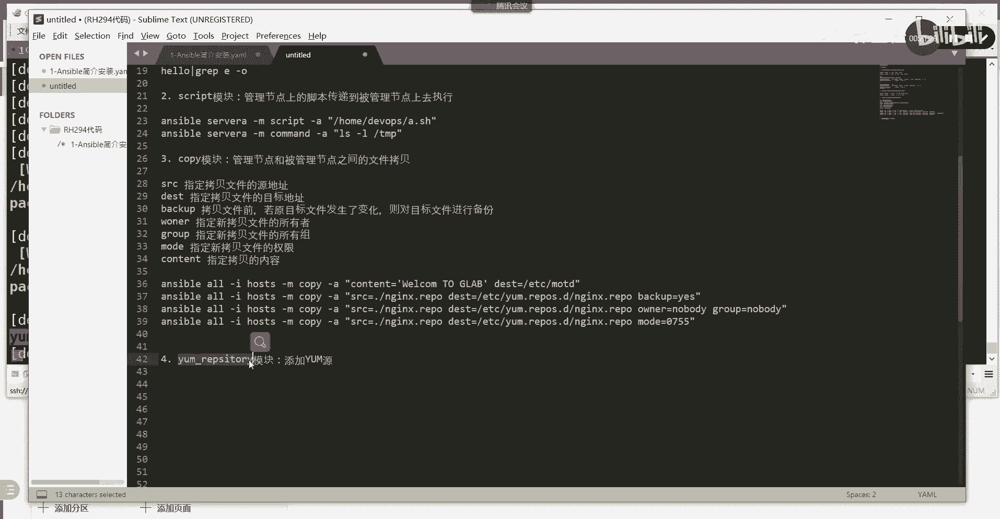

# 【Linux／RHCE／RHCSA】零基础入门Linux／红帽认证！Linux运维工程师的升职加薪宝典！RHCSA+RHCE／37-Ansible常用模块介绍 - P1 - GLAB郭主任 - BV1eu4y1A74w

好的，来帮大家整理一下第一第一部分内容的笔记啊，前面已经整理这么多了，我们接着往下inventor文件啊，我分两步，第一步就是给大家讲如何写一些复杂的inventor，然后就检索。

然后第二个INVENTURE就是我们实际要用到的，在这里呢我们就用的比较简单的。

这个INVENTURE的文件看了吗，我们b i m inventory就这个吧。

大家自己去写好不好，这是一个比较简单的文件，听懂了可以分组，可以不分组啊，然后这个弄完以后，接下来还有一个叫配置ESPORT组配置文件，配置ICESPORTCFG的主文件，这个主文件不需要记。

因为它有默认的文件，你可以把相应的内容copy过来，对不对，这个文件主要关心的就是主要关心的就是这个。

就这几个。

大家把这几个贴进去，能看明白吗，主要是default，default和PRIVISION这个东西，这几个写一下好了吧，好了之后，接下来我们就可以测试了，我们就到了测试环节。

测试环节讲到了这个AD hook，就是我们接下来要讲的叫AD命令来进行测试。

我们给大家讲了几个测试的命令，我们来看一下哪几个，就这个我把这两个给大家复制一下。

这是最简单的两个测试命令，你要测试你的数控节点和你的控制节点，是不是能够通，我们最常见用的就是pin模块，就用的这个明白吗，如果看到都是绿色的，说明你的前面做的这一堆东西应该都是OK的，没有问题了吧。

所以这就是我们前面第一部分内容所涉及到的，配置相关的东西，回头我把这些拷给你贴给你，我们来看第二个内容，我们来看第二个内个，这个先别急着急着急啊，我说我会给你们的嗯，第二个内容。

接下来我们要重点给大家讲这个模块，既然讲到AD hook嘛，就AD AD hook，这也是考试内容啊，AD a p c也是我们平时工作当中用的比较多的，一种命令的配置方式，Ad hook。

那么首先AD hoc和playbook的区别，这个我已经说过了，AD hook它是单个命令，是一堆命令的集合，如果要实现复杂性的流程的管理，一定要用playbook。

而不可能用单个命令的id hook吧，对不对，所以啊但是呢AD hook在前面学，我们可以用它来学习一些简单的模块，所以我们接下来给大家讲，常见模块的叫应用方法，我们一个人来讲这个来看啊。

常见模块的应用好吧，我们来一个来看，首先来看第一个模块，第一个模块啊，第一个模块我们就给大家讲command，command模块和希尔模块这两个模块其实是一样的，叫SHELL，这两个模块都是一样的。

它的作用是什么呢，都是在远程服务器上去执行某一个命令，是在远程在远程服务器上去执行，去执行，去执行某一个命令，去执行一个命令，这个应该能看到吧，我来举个简单例子。

就刚才这个就是用的common模块对吧，53号53哎，什么玩意，哪里写错了，好了是吧，是在执行嘛，就这个命令看得懂吗，然后呢，默认就是用的command，我可以这边杠M不去指定，直接这样也是可以的。

是不是一样的结果对吧，所以command啊，这就是用它去执行一个命令，比如再来一个SB不加杠M，我们可以直接去server a这个主机上直接加杠A，去执行一个额有空格的，比如说我们去执行echo。

Hello world，这个能看到吗，是不是hello world的，嗯对吧。

这个是有空格的，大家注意啊，有空格要用引号引起来，然后呢里边的用单引号，外边有双引号，这个前面有讲过，好吧好，那么其实这个模块和希尔模块应该是差不多的。

share就不是默认了，我需要加杠MSHELL就要加share，是不是一样的，明白吗，share也是一样的，但是share不是默认的，所以要加杠M去指定我用哪个模块。

所以呢这两个结果是一模一样的，但是有区别，这里要重点介绍它们的区别是什么，介绍command和嗯希尔的模块区别好，那么大部分是一样的，区别就在于希尔的模块可以执行特殊的，比如管道符。

common模块无法执行这个内置的命令和特性，举个例子啊，就是share可以执行管道服务相关的内部命令，这是一个，然后呢command不能，这就是也就是说command能干的希尔都能干。

希尔能干的command不一定能干。

我来举个例子，举个例子啊，我看一下啊，我们用server a吧，server对吧，我们用server嗯，然后呢通过gm，通过shell，然后杠A对吧，然后我们输入刚才的，Hello hello。

我们想通过管道符过滤一下GRP，是不是通过group来过滤啊，对不对，过滤什么呢，我只想看E咯，有没有E靠，这个能看懂吗，输入了一个一串东西，中间少个东西是吧，输入了一串东西。

然后呢我通过GRP去过滤一下这个可以吗，没有E啊，e grab e e是不是有啊，就是只看你输出这里面的E吗，不就出来了，杠代表的是只输出匹配到的内容吗，这个三剑客前面有讲过。

但如果说你想把它改成同样的，你用come on来实现，就不行吧，他认为里边后边一转就是大家输出的理解吗，common不能识别管道这些东西，share是可以识别管道这些东西的。

明白了吗，这几个你看一下，贴在笔记里你就知道了，明白了，OK这是我们讲的第一个模块，这个模块比较简单，第二个模块我们平时用的也比较少，就是只是在做AD hook简单测的时候会用command。

会用希尔来简单的测一测啊，单个命令，第二个叫script模块，我给大家讲的都是比较常见的script模块，这个看名字应该就知道了，就是在管理节点上的脚本，传递到被管理节点上去。

执行管理节点上的脚本传递到被管理节点，上去执行，这个很简单，其实很简单好不好。

那么我们在这里有一个我们在实验环境当中，是不是有一个有一个AA点SH嘛。

对不对，我们来编辑一下，把它再完善一下，vim没点H呗，然后呢我们就用一个简单的，不要搞这么复杂，我们在上面写一下井号呃，井号叹号上面的B，下面的ash是不是指定它的这个执行对吧，我们来简单的执行一下。

有没有没有执行权限，你千mod a点SH，千金mod加XA点SH，然后呢斜杠点了，是不是要杠L执行了是可以执行的啊，可以执行之后，我们想把这个脚本送到受控节点上去，然后去执行，可以吧，没问题啊，好嗯。

我们可以怎么做呢，我们可以ASSABLE这个server a，然后呢杠m s c r IP t script s c r IP t，然后杠A把什么东西送过去，把这个当前目录吧，当前目录。

把这个东西送过去，就是把本地的这个脚本在远程上面去执行一下，我本地的脚本在哪呢，这个脚本在哪啊，在要写他的完全路径啊，绝对路径home下面的DEVOPS，下面是不是有一个A点SH，看到了吗，送过去是吧。

送到已经送到，送到哪了，我看看home下面DEVOPS，然后我们去server上看一眼，S h 4dv o p s at s，诶没在是吧，看看他放哪了，看到最新的效果，close rc已经运行了TT。

哦在那个放到哪去了，看看，哎太不像你了。

这个看不出来。

这个看不出来，我们可以这样子，因为他是个LS的命令，我们可以把它改掉，我们创建一个文件可以吧，叫TOTOUCH，我们touch出来的文件一眼就能看到吧对吧。

我们touch tab下面的一个test1不就完了吗，这个文件应该没有，就touch一下touch一下，然后我们去看一下有没有，在这去看一下l s tap有没有test1有了吧，这是我创建的吧。

是不是用本地的脚本在远征上去执行这个，最好是有直接结果的，看的话没有必要这样看明白，我可以直接到server b上去看结果，我也可以在这里用AD hook去查看怎么看，我想在这看。

不想登到这个server a上去，看，用id号看看对方，看对面是不是要在对面去执行这个命令，用什么要用起来，用杠M是不是command的，用command或者用share都可以，杠A去指定我要执行什么。

l s col是不是执行这个呀，对不对，没问题吧，是不是有test，看到了吗，各位明白，所以这个是在我的受控控制节点上去，看对方的结果，这个是直接登过去看理解吗，OK都可以啊，都可以。

所以呢这个我就给大家简单的来嗯，这个我就不整理了吧，这个应该知道了吧，script在对方，我把这个运行的脚本给你看一下。

就这样。

还有一个是去查看的命令。

对吧，然后AD呢就在本地的控制节点上，这是第二个模块，没问题吧，第三个模块模块模块要讲十几个，接着往后第三个把它叫做copy copy模块，这个模块是我们后面接触的最多的模块，接下来几个都比较常见。

看名字应该知道是什么管理，然后管理节点被管理节点之间的文件拷贝对吧，管理节点和和被管理节点之间的文件拷贝，看到吗，好在这里我们简单举个例子来识别一下。

它有很多参数，然后呢如果大家遇到这种常见的复杂的模块，又不太会用，不怎么会用，教大家一个方法，不需要死记，很多选项都不需要死记，我们有叫AZBDC，叫ansport dog，这是一个非常有用。

大家平时在敲，包括后面记代码，考试上一堆代码不用记啊，直接查s sport dog就可以了，好来看看这个是他所有的ansport dog col吧。

啊这就是他所有的支持的。

所有的模块都在这里，有多少个，我们大概统计一下WC，统计一下，2000多个听懂吗，核心模块有400多个，常规在用的有100多个，所以大家学100多个就行了好吧，100多就行了啊，好来我们看我们。

比如说不太清楚这个这个这个这个copy怎么用，我直接按s dog copy嘛，会输出一大堆，怎么用呢，那么我们主要关心斜杠啊，搜索EXMPLA大写的example。

就能够看到它的常规用法，看到了吗，他是这么用的，在playbook就这样写的，各位playbook就这样写的，然后现在我们AD hook怎么用。

playbook就这样写的，我们查询YBOOK，先查一下ANSPORTDUC，然后呢再去写在playbook里面，那么AD hook如果要用copy命令怎么做呢，比如说。

现在我想把把某一个文件送到某一个目标上去，好吧，来我这里有写，大家来帮我看看这几个到底是什么意思，我就不打手打了。

大家给我看，SP杠A指定我的目标，指定我的EVENTURE文件，这前面应该都看得懂吧，杠M指定模块是不是用copy啊，杠A是不是要输哪些命令啊，前面都是我们前面接触到的好，主要在后边。

在这他是不是有一个content，这个不是随便起的名字啊，这个是关键字，content代表的就是内容，也就是你可以你要复制的这个东西啊，可以不存在，它可以是一段文字，可以是一段内容送到哪里去啊。

送到etc的MOTT，下面就是把COTT里面的内容送到这里去，看得懂吗，好这是内容，那么如果是一个文件，是不是用SRC啊，SRC等于什么，目标等于什么，看得懂吗，所以这里头SRC就是目标啊。

原DDDETS就是目标，这些都是关键字啊，就是把这个文件复制到这个里面去，后边有一个参数叫backup，backup等于yes代表的是什么意思啊，在复制备份理解吧，不加的话就不备份，听得懂吗，好然后呢。

我在复制的时候，除了可以指定从哪复制到哪之外，我是不是还可以指定复制过来的文件的数，组合啊，宿主吧，对不对，所以指定组用它honor，指定数组就是那个组啊对吧，用group理解吗，我还可以指定权限啊。

我是不是可以用mod07550前面可以忽略掉，755是不是我们的那个三段的权限啊，七五，所以我可以指定数组，数组还有权限，并且我可以指定它是不是要备份这个模块了吗，我们把它的核心的几个字。

几个字段给大家总结一下，常见的，SRC指定拷贝的文件源，DETDDST代表的是目标，backup是不是要备份，honor是属组，group是数组，mod是指定拷贝文件过来的权限。

content是拷贝的内容，是不是在这个例子里面都体现出来了，明白了吗，各位这个我就不给你演示了，因为后边这个模块经常用，从这个地方把文件copy到另外一个地方，只不过当时会在playbook里面写。

black book里面写好不好，这是我们第三个模块叫copy，把这几个字段记好，第四个模块，其实很简单，我觉得没什么难的，第四个模块叫young，这样report叫reps，I t o r y。

OK模块，这个模块主要是干嘛的呢，添加样本源考题啊，考试当中有一题就做，这个要求你用AD hoc命令去执行，向受控节点主机去添加亚本源，好这个是干嘛的呢。

就是比如说啊，现在我想要通过我的workstation，去配置server a和B的样本源，server a和B的样本仓库在哪里啊，我们不用ESPORTS是怎么做的，是不是在这里啊。

我去编辑1TC下的要点，report d下面有一个212，是不是这个对不对，是不是在这里写呀，写bl是这样，但是如果用的话，你就不能呃，你怎么去向这个文件里面写内容，就是要用到用到我刚才这里的这个模块。

给大家看一下啊，ma那不叫man，他叫ASPDCDC，上面的有一个叫YM下横杠RESI写来着。

这个名字记不住，I r e p r e p e r。

EPSITYREPSITORY打错了，怎么打来的，REPSITYY对吧，R e p s i t o r y，屁股还有把黑头换了，GL过滤一下，不记得名字没关系啊，grab样。

我看一下样本的有多少个打错了是吧，复制一下。

不能打错。

好吧来那就是ansport doc。

这就对了，是不是这样用的。

用的是young这个report name，就是我刚才这边写的这个这个name啊，就这个name你写吗，好然后呢描述对吧。

fire base u l l g b g b1模一样的，换了一种方式吗。

听懂了吗，理解吧，换了一种方式吧，OK所以大体都差不多，同志们大题的，但是要用AD hot怎么写啊，AD hook写起来就麻烦了，来我给你给你写一下。

AD hook是这样写的，这个很长啊，都是一行一行好去，这前面就不说了，直接看杠A嘛，前面都一样的，就看杠A杠A引号里面是不是先写name base url s，是不是这样写啊，一串都写在里面。

然后这个时候他就会把这一堆东西送到前面，这个主机上去了，能明白吗，各位好好，所以呢不管是AD hook还是playbook，它其实的参数都一样的，name仓库名字描述啊，描述仓库的信息。

base url file就指定你的仓库，然后呢指定你仓库的名字啊，就是写的那个点REPU的名字啊，state呃，状态是要添加还是要删除，我们用enable里面添加的话，就用president删除。

叫absent g b g k g b g c h e c k，要不要校验都一样的，换一换了一种方式而已，听得懂吗，OK那这就是这就是添添加仓库啊，这是添加仓库，那么既然有添加仓库就有什么。

就要么模块要模块是干嘛的，安装软件包，这也是非常常用的一个模块，后面会经常遇到仓库有了，是不是要给他安装软件啊，我们如果通过这个普通的运维。

不是用自动化运维的话，不用S运维，我们在这里装的是不是打，是不是这样装的，对不对，明白吧。

但是用export就要用到样样本模块了，用的就是这个模块。

而不是这个命令，OK啊，这个模块涉及到哪些参数呢，给大家看一下，example都在这看啊，是不是用的模块name，这个name就是你装的软件写的，就是软件名HTTPD，然后装装什么状态是什么。

装最新的还是直接安装，还是卸载，还是干嘛。

是通过state来控制的，能听懂我意思吗，各位OK好，所以关于样本的这个配置其实不复杂，很简单，要么模块我给大家举几个例子啊，给大家举几个例子，大家来看一下，我就不打了，这个安装我是不是可以前面都不看。

直接杠不就完了吗，是不是杠用的是模块，安装好，在这里有几个参数，一个precedent，lasted和in，它们之间不同的状态，它的作用是不一样的，来我给你主要就是state，他就俩参数。

一个是name，就是你要装什么软件，一个是用什么样的状态来安装，name是你的软件包安装，如果要装多个，中间用逗号隔开，没问题吧，好let's do it，就这几个，大家看看区别，如果用present。

那就是确认安装，但是如果有新的更新的包，它不升级，如果用install，它仅仅只是确认已经安装，确认已经安装，然后呢，如果是他要确保安装，然后再升级，并且还要升级叫latest，理解了。

然后就是把它移除掉，就是state，如果改成GX，就给它卸载掉了，理解我意思吗，OK就这几个，那大家请确认一下installed和present的区别是什么。

He thought her present，present和list latest区别，一看就看到这是升不升级的，问题是那这俩区别是什么，有没有区别，有区别，当然有区别，但是区别很细微。

都是装都装上了，举个例子，如果现在我的这个机器上已经装了NGINX，但是它不是最新版本，我的状态用present，他会不会升级啊，不会吧，明白为什么不会升级，但是如果我现在的上面。

如果用的是latest，他会不会升级啊，会吧明白吧，这个没问题，如果我这台机器上没有装GX，没有装ex，如果我用install的话，他会不会来装，会装的是最新的，理解我意思啊，装的是最新的。

那如果是用present，他会不会张最新的，会不会装最新的没装啊，我上面没装，会不会到最新的，会对吧，没有装，那肯定啊，他肯定是给你装，会装最新的吗，应该说不一定，他有可能会这样。

因为他装的时候只有latest，他会明确安装最新的in store的话，他没有装的时候，他也会装最新的，但是只要装了它就没有任何影响，只是确定你有没有装对吧，其实总体来讲它的区别我觉得区别很细微啊。

非常非常小，用的比较多的不是install，是present和latest，要么装，要么装最新的好不好，不用纠结这个细节，很多人会问我，为什么我刚刚提一下这个事儿，差别很细微，他会问我这区别是啥。

搞不清楚，你搞不清楚就不要搞了对吧，没有意义好，那么但是删除这几个，要知道这三个用的比较多，这三个用的除了do好吧，然后呢这个是安装我的软件包，这个软件包呢前面加个at tooth啊，不是某一个软件。

这是一个软件包啊，就这两个参数就这样没问题吧，好再看第六个模块，叫system system d，CCMD的模块，这个清楚吧，他要干嘛，在远程节点上开放，是不是开放某些服务啊，对不对。

就是它是对服务进行控制的对吧，可以对服务进行数控，节点上对服务进行控制，这个控制可以对服务进行重启呀，关闭呀，打开呀，开机自动运行啊，是不是这些东西类似于这些东西，来我举几个例子，你就看懂了。

来看system d，你能看懂吗，看看重新加载服务，前面都一样啊，是不是用这个重新启动服务，NGINX对哪个进行启动，State，是不是start stop restart reload。

是不是开机自动启动。

跟我们在讲，对某台单台机器进行单个运维的时候，用的这个TMCT2是不是跟这个一样的，restart什么HTTPD主要就是这些，就是就是这些东西，只不过换了一种方法，听懂了吗。

好那么system d它的一些参数其实不多的。

也就几个，我们来看一下，第一个就是要不要重新装载system d的一些单元，第二个就是enable，enable是不是要开机开机自动启动的吗，名字就是对哪个服务来进行操作嘛。

state就是对这个服务进行哪些操作啊，什么启动停止重启，就这些了，都在这明白了吗，OK所以啊这些模块大家先熟悉熟悉，后面用多了你就知道了，这是第六个模块，第七模块，第七个模块我们写两个。

一个叫group和user，看名字就知道在干嘛，是不是在对主进行管理和创建用户，对这个模块是主和用户的，管理组合用户的听懂了吗，来我把这几个举个例子给大家看一下，首先，如果是这样子的，这个看到吗。

对这个题前面就看也就大A之前都一样，可以完全忽略不看啊，你看后面是不是创建新建了一个组，这个组叫dB等于简单吧，对不对好，那么关于组的话，其实我们呃我们主要的这个参数就几个，给大家复制过来，Name。

就这里的name就是创建的主名字，然后有一个system参数，Yes or no，默认是NO，也就是要不要创建系统用户，我们的系统组我们组分为系统组和普通组吧，对不对，用户也是的。

普通用户管理员用户和系统用户吧，对如果你创建的是跟系统相关的，这里这个要加参数，一般不是这个参数，所以它默认是node，如果state是present，就是创建absent，就是删除，默认也不要加。

因为默认就是创建，所以这句话就是创建了DBA的命，而且不是系统组，没问题吧，这简单啊，OK那么再看用户，用户先看例子，再看它的参数，用户的话也比较简单，你看啊创建了一个FO的用户。

设置了密码是PASSPS，我们在创建用户的时候，是不是也会涉及到很多很多的选项，说比如说这个用户的交目录啊，对不对，这个用户的这个登录的这个BS是什么呀，是吧，江湖路在哪注释啊，密码呀。

一大堆乱七八糟的东西，所以用user这个模块来创建用户的时候，它的参数非常多，这应该是模块里头参数比较多的一个模块了，但是都不难，都跟前面讲的一样的，看名字代表创建的用户password。

修改这个用户的密码，要不要更改这个密码加目录，在哪里用什么样的希尔登录，他的描述是什么，是不是password那一堆每个字段的讲的那些东西啊，对不对，要不要创建用户的时候，要不要创建家目录。

要不要设定组对吧，要不要加到扩展组，那么要不要配合使用这个什么加到附加组吧，系统用户过期时间是吧，产生SSH key用户，我们说RSA密钥对，是基于用户产生的，像刚才我们做免密登录。

是不是先确定了DEVOPS的用户，再去生成密钥的，所以你可以在创建用户的时候，直接给他，直接用脚本给他生成密钥，就用这个来生成的，然后它的状态删除或者添加好。

remove呢就是可以用state absent一起使用，删除这个用户以及它关联的目录，所以围绕用户可操作的东西比较多，但是都是我们前面讲过的东西，换了一种方法而已，听懂了吗，所以这个就略过了。

这语法很简单，就这么简单，AD hook就这么写的，第八个这些模块我先给你一个一个过，然后后面还会详细介绍，第八个模块叫fire，看名字应该知道是干嘛，文件操作，它是用来做文件操作的。

我举个例子还是举个例子啊，大家来看一下，前面不看直接看这，请告诉我猜一下他在干嘛，干嘛，是不是他吃了一个文件state touch，一看就知道这是用touch来创建了一个新的文件吧，再来好嗯。

这个文件已经在了，我把这个文件的组组权限是不是file，也可以改它的权限啊，File，这个是在对这个文件进行，数组和数组权限的改变，没问题吧，好再来这个圆这个目标state是link了。

这个state变成link了，这是在干嘛，创建软链接吧，软链接有一个被链接文件和链接文件吧，对不对，所以这里会涉及到圆和目标，跟copy里面的圆和目标不一样啊，大家都这么写的了，第四个他在干嘛。

创建了一个什么目录吧，这个不是文件目录，怎么确定的，如果state变成directory，他就说明创建的是一个目录，理解吗，这个是在干嘛，再删除一个链接吧，刚才的链接删掉了，怎么看都是删除的state。

那就是在删除理解吗，这个也是的，删除了这个文件，删除了这个文件，所以它的参数主要就这么几个，它的参数主要取决于你在干嘛，取决于state里面不同的状态，我们看看state。

如果state directory说明创建是目录，fire就是如果如果这个文件不存在，它会被创建好吧，touch呢如果文件不存在，则会创建一个新的文件，如果文件或目录已存在，则更新更新它的修改时间。

这就是touch的作用吗，对不对，然后呢，link创建软链接，hard创建硬链接，opposite是删除，就这个state决定了一大堆东西，前面简单啊，数组数组权限pass就是目标的这个路径在哪里。

然后呢这个是递归，这个是圆和目标，云和目标主要用来创建硬软链接的，硬链接和软链接就是用它来创建的，然后S1的type用来更改上下文的属性，各位能听懂我意思吗啊这个也不复杂的，就这么多，OK先介绍一下。

这是第八个file，这是第八个fire，好第第第第九个吧，第九个第九个，这个应该到后面再详细讲，这个叫定时任务，先写在这儿吧，叫crew苦肉模块，大家知道应该干嘛呢，这个是在节点上做计划任务。

在数控节点做计划任务，这个我到后面再给大家详细讲，然后呢给大家举个例子，给大家举个例子啊，后面这个也比较简单，其实他告诉我他在干嘛，创建了一个叫create new job的crown的计划任务的名字。

然后呢时间是分钟是零，他要执行的job是LS杠，然后把执行的结果送到哪去了，第一位NN下面去了，好，请告诉我这个计划任务是干嘛，他是在干嘛，minute minute是什么，分钟是吧。

这个就相当于你在写计划任务的时候，还记得计划任务前面是不是有几个星啊，是不是五星啊，是不是五星对吧，分钟小时，什么年月周是吧，好日月周，日月周，对不对，那这个分钟代表信号变成零，那这代表啥意思啊。

这个minute就是这里的零，所以写法很简单，难点还在于计划任务的时间，该如何确定这五个星到底怎么去读，到底什么时候干什么事，明白这意思吗，请告诉我这是什么意思啊，这个啊把这边转化成我们平常能识别的。

就这样写吧，后边四个星，前面一个零，这个周期任务是什么意思啊，啊星代表的是每分钟零呢，这啥意思啊，那如果我把这改成一呢，一是什么意思啊，每分钟二呢，每2分钟每2分钟不是这样写的吧。

每2分钟还记得是这样写的吧，新代表的是每分钟，然后再斜杠，二代表的是每2分钟，是这样写的吧，对不对，那如果直接写成零是啥意思啊，整点吗，这是分钟分钟分钟他没有秒分钟，这个我们之前讨论过吗，没有是吧。

零好像真的没讨论过，这三个一样吗，不一样吗，不一样好中间这个是每每分钟干事情，然后零的话就是就是就是怎么说，就是每小时的这个零零分是吧，每小时整点去干这件事情，然后就每小时的一分钟就干这些事情。

是不一样吧，所以这个位置代表的是0~59，0~59度可以写不一样啊，不一样，前面的内容请大家去复习一下，然后chrome这个我就先说到这儿，它里面可以解可以写的参数，我先给你们，就这个name啊。

分钟时间天月对吧，是不是对，就那五个键啊，drop是要干的事情，就指定的状态，所以对比下来也很简单，还是那句话，换了一种方式来实，来实现我们的服务器的周期任务，这个这个这个需求好，第十个debug。

debug模块好了，这个模块相当于脚本语言里面的print，Python里面的print作用是什么，就是打印嘛，对不对，就把结果print，你在你的屏幕上嘛。

然后在ESPORT里面的这个输出用的是debug模块，所以debug模块是通常是将一个变量或者输出，直接打印出来，或者输出直接打印出来，这就是debug存在的作用。

后面也会用到这个debug来给大家看一下啊，debug举两个例子，用debug模块来把我们运行过程当中的结果，打印出来，看这边我定义了一个变量杠，E是给这个变量赋值，杠一是给这个变量赋值。

就是我定义了一个变量ROY，这是一个关键字啊，定义了一个肉，然后我把web这个变量，把这个值赋给了这个变量吧，然后呢debug message等于roll什么什么就输出了吧。

这个时候他就会在屏幕上打印出来，说角色是web听懂了吗，用message这也是关键字啊，这也是关键字，所以debug有两个有两个参数，一个就是去设定它的变量，一个是message。

直接把它作为字符串格式化输出好，这个没什么好说的，就是一个print好，还有两个，我们还有三个三个我们说完啊，别急，11第11个叫template，PPEMPLIT也叫template。

template模块，这个后面会重点讲，他用了一个叫ginger to，模板用的是一个精加to的模板来实现自定义，来实现自定义的替换，自定义的替换，就是我们其实在刚才学到对文件处理的话。

就是要么把受控节点，也就是会把原节点上的文件，通过copy或者通过fire送到目标上去，这个文件是不是死的固定的吧，这个文件原来长什么样子，你copy过去是不是还长什么样子啊，听懂了吗。

但是我们有时候会针对不同的节点，要用不同的文件，比如说嗯我针对web这些服务器集群，我要用跟web相关的一些服务器的文件，针对dB用dB相关的服务器文件，我有没有一个这样的一个文件，它只是一个模板。

我把这个模板文件送到web上去，它会自动生成跟web对应的文件，我把它送到dB上去，它会生成跟dB对应的格式的文件，也就这个文件源，它它是一个模板，听懂了吗，这个模板用什么写，就是用金家兔来写。

这也是一个语言啊，在这里头会写很多变量，然后通过template，把这个模板送到目标主机上去的时候，它就会自动生成跟这个目标主机相关的，相应的一些各自的文件，它们是不重复的。

这样就做到了文件文件的copy，就这两种情况，一种就是原封不动的copy，一种就是定制化的copy，所以template就是干这种事情，到后面会详细讲好不好，这个是比较重要的一个内容，考试啊。

考题也考这个，有一题就考它来，我给你简单的先看一下，看一下他的这个，那看看它的用法嗯，圆在哪里，所以圆一定是一个基因加二，G加T格式是go2点勾二结尾的，这叫进加二的模板，然后送到哪里去。

然后把变量附在这个word，这个变量赋给增加true里面的某一个变量，理解吧，其实他还是在对文件进行处理，只不过文件是动态的，它不是静态的，它可以根据JITO里面的，它其实就是脚本语言。

脚本进价最里面定义的变量，去自动获取目标主机上的值，生成跟目标主机相对应的定制的文件，后面会有实验，第12个，第12个叫line in file模块，这个是在被节点上去修改吧对吧，这个是在被管理节点上。

用用正则表达式对对目标文件对吧，进行一行一行对修改，所以这个模块是对文件进行改动，到目前为止，我们只是在对文件操作，有没有对文件内容进行改动啊，没有吧，对不对，所以要想对文件内容进行改动。

用line in file给大家举个例子，请告诉我这个在干嘛，是不是用正则表达式，很明显，这是正式用正则表达式匹配到之后，然后state是不是删除正则表达式，匹配的在哪个文件，是不是对这个文件进行匹配。

正则表达式匹配到了之后删掉了吧，是不是简单是吧，这个是删掉，如果是修改呢，再给大家看一下，替换另外一个例子啊，这个我们去看GA后面的，对这个文件进行SLINUX的匹配，然后用line去进行覆盖吧对吧。

line的内容就是把你前面匹配的内容给替换掉，所以这个会替换原先匹配到的这个，所以CLINUX就变成第三了吗，听懂了吗，各位对吧，OK所以这个是匹配替换，上面是删除。

所以关于lin fire的几个参数也就这么几个，给大家看一眼，pass就指定节点的路径，可以选择删除，可以选择默认，不用写默认precedent就是还要替换，然后正则表达式line就是你要被替换的内容。

create是不是文件不存在的时候，是不是要创建，这个一般很少用，对不对，主要就是上面的这几个，看这两个例子对比起来，记下最后一个，嗯line in file对一行一行感觉特别麻烦。

所以他还有另外一个叫block，叫block in five，猜一下这个模块干嘛用的对，进行什么，对目标文件进行多行的操作，刚刚是单行，对不对，单行一行一行的操作可以用lin file。

但是如果要用多行，用block your fire，就一大堆一段段的进行修改，听懂了这意思吧，来吧，我们的例子，它有两个参数路径三个参数，然后block然后进行干嘛操作来看吧。

对这个文件进行多行进行操作，block是他的行吧，反斜杠代表是多行吗，这个是什么，请告诉我第一个第一行，它的作用是什么，第二作用是什么，第一行是不是对这个文件进行更新啊，他没有加任何state。

就说明对这个内容进行更新，它它默认去帮你找就block所匹配的这个东西，然后更新掉这个加进来的，这个是加进来的，不好意思，这不是更新加进来的，加了一段听懂吗，他会把你看下，后面可以写很多行，第二行呢。

第二句是什么意思啊，是不是也是加进去了第三行呢，是不是删掉了，对不对，所以block in fire，其实它的功能相对来说虽然是处理的好几行啊，但是他并没有像我们的line in fire那么去灵活。

能够去修改第一行，第二行都是乡里面新增了两行，第三行是删掉了，把这个页删掉了，听得懂吗，明白删掉了，所以block infer它是大范围的处理，想里面上一项里面去增加或删除。

一般会用block infer，但是要针对某一行小的细节上进行调整修改，我们还是用lin file理解，不能这么做的啊，用，先把东西都加进去，然后再对某一个地方进行细微的修改，用LF听明白了吗。

OK这是我们的第二个内容，叫看我第二个内容啊，这个第二个内容叫，Ad hoc。

嗯好吧好。

