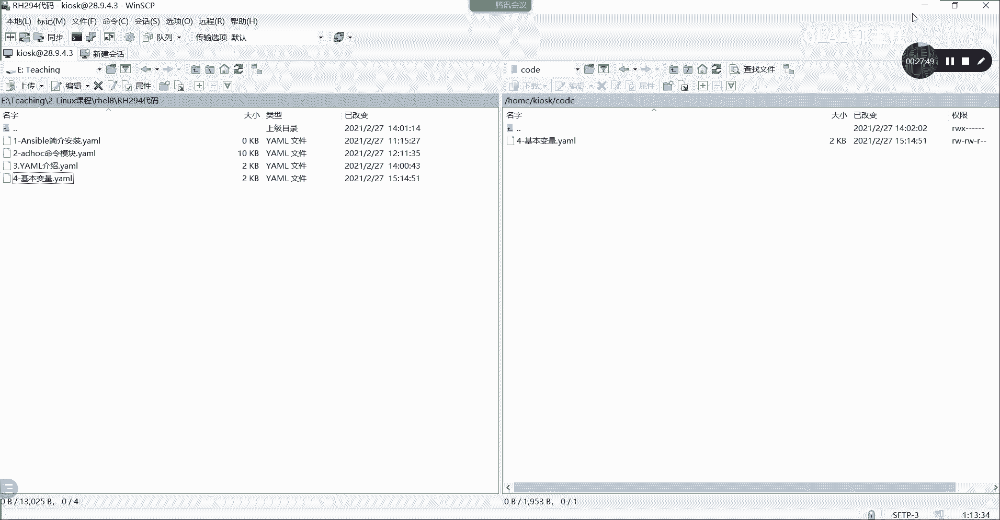

# 【Linux／RHCE／RHCSA】零基础入门Linux／红帽认证！Linux运维工程师的升职加薪宝典！RHCSA+RHCE／39-Ansible变量 - P1 - GLAB郭主任 - BV1Cz4y1w7f9

好的，我们继续啊，接下来我们要涉及到复杂的流程控制，一定不能像刚才那么简单是吧，很简单的来写，我们要涉及到变量，接下来要讲的这个内容叫变量，这个变量呢在esport playbook里面分嗯。

两种类型的变量，这两种类型变量都考一种叫普通的变量，一会儿给大家演示什么叫普通变量，还有一个叫事实变量，事实变量其实就可以把它理解为是内置的变量，export定义好的，自定义好的内置变量。

比如说呃获取这个主机的主机名，他就已经定义好了，叫ANSPORT，下横杠host name，那这样的话就可以直接调用内置的变量，就可以获取到这个主机的主机名，所以asp上NO host name。

它这个就叫事实变量，说白了他就是内置变量，一个叫普通变量，一个叫内置变量，听懂了吗，内置变量不需要声明，直接就可以用好，来看第一个普通变量，第一个我们叫普通的变量，普通变量呢呃呃上面有写啊。

上面这个给大家介绍了这个，事实变量和普通变量的区别啊，还有这个就不说了啊，好变量的范围就是我们普通变量的范围，大概分为global的范围，play范围和host范围，什么意思啊，我们可以在先看全局变量。

我们可以再看看例子，这就是全局变量的例子，这个我不给你演示啊，我这个PPT都都截截图，截好了，都能看到了，但你一定要看懂全局变量，全局变量通过杠来对变量进行赋值。

我还打一下吧，来还是打一下。

有一个直观的体验会更好，来我们打一下，在嗯我们讲就假设在这吧，ASB对吧，我们对server a来进行操作，杠M用debug来看它的print输出，加杠A的一个选项，这个选项用print里面的MSG吧。

叫MSG等于单引号，两个单引号啊，叫my key is，好调用变量是通过，两个花括号好，调用这个key好，然后呢这个key是一个变量，但是我没有定义它吧，所以接下来我要用杠E去定义，并且赋值这个变量。

杠一后面写哦，这个变量我要定义的key等于，你能听懂我意思吗，我们来看一眼是不是输出了my key value，能听懂吗，所以他会把这个value复制到这个key里面。

看到的输出是my key value，所以这是一个最典型，最简单的一个全局的global的复制变量，就是在运行asp的时候，通过杠E把变量的参数传递到playbook里面去，传递过去，听懂了吗，杠E啊。

通过杠来传递变量好，我除了用这种方式，我还可以把变量写在文件里面，这个文件可以是点JASON，也可以是点yo的，下面举了两个例子啊，还是给你写一下吧，我们假设我们编辑一个啊对吧。

我们vim编辑VMA点JASON的文件好，这个JASON的文件我们就写两个花括号，花括号里边我们把name等于，G r a b，这是第一个，这是一个字典格式吧，好，tap冒号等于RHC。

这是不是写了一个JSON的格式，是一个典型的字典吗，这就是一个字典，明白吗，好写完了以后，我们直接可以调用这个文件，可以怎么写，sport跟前面是一样的，只是后边不一样，这这这这都一样。

但是通过杠E传进来的时候，不是直接复制给他的，他要通过at一点精神，as是吧，A点JSON哦，有错误有错误是有错误啊，他这里没写对是吧，前面付不进去是吧，应该怎么写嗯，应该要写，我就写两个吧，好不好。

不要写这么复杂，我就写两个号，括号，然后逗号逗号对吧，然后两个花括号tap这样写才对，好S点JSA点JS是不是就是你这边怎么写，调用变量就行了嘛，我这边就写了这两个逗号，前面前面是GLB，后面是20C。

能听明白吗，这个IA点JSON就是我刚刚编写的这个文件，cut点A点JSON，是不是就他它可以到这个文件里面去调用，然后呢对name和type进行赋值。

明白吧，这次就不演示了，一样的，然后呢这个是JSON的格式，也可以把它改成yo的格式，调用的方式也是一样的，at a点yo就可以了。

这就是全局变量，可以是直接单个赋值，可以用变量文件进行赋值来看剧本变量，什么叫剧本变量呢。

剧本变量呢就是可以理解为在playbook里面，我们有一个叫叫叫变量的属性，在这可以加叫VARS，可以在这里写变量，可以在这里写，你看啊，我们的PPT上是这样写的，我们可以用user等于对吧。

好password，这里这是变量啊，这这名字随便定义啊，home等于my home下面的home下面的GOD好，这个时候我们就把这两个变量定义好了，一个变量叫user，变量的名字叫直叫JOD。

一个home的变量的值叫home的JOD，听懂了那个变量定义好了，怎么调用它呢，我们在play里面这个属于在play里面定义的变量，我们怎么去调用它，我们可以在这里去调用它，比如说我们创建用户。

刚才有讲吗，用什么，在这里加一个加一个task叫create user，Create user，我们用的是什么模块呀，是不是用user模块，对不对，明白吗，好user模块里面name好。

我们要创建这个叫刚才定义的GOD，这个用户我们用的是记住啊，这里调用在play里面调用变量，刚才我们调用变量是不是用了两个花括号啊，前面一个空格对吧，然后调用user呗，后面一个空格，这样子的听得懂吗。

但是在play里面调用，除此之外，还要用引号把它引起来，这个要注意，这个才是在play里面调用变量的正确方式，它跟我们刚才全局调用变量的方式不一样，play里面要加引号，听明白了吗。

这样的话他就会拿着前面定义的这个变量，里面的内容去create这个user，用user模块去创建这个用户，你能理解我的意思吧，各位O对吧，这些模块后面都会用到啊，都会用到。

所以这是第二种方式，我们用在play里面去定义我们的变量，除此在play里面写变量之外，还可以在play里面跟文件，就像刚才一样，你把变量文件都写好吗，写好了之后呢，我可以直接调用我的变量名就可以了。

理解吗，OK好一个是调用文件文件啊，一个是指定具体的变量，调用变量的方式，刚才有讲过了，去调用它的时候，一定不要忘记引号，记住双引号啊，user的这个变量前后都有空格，写法很重要，好这个叫全局。

这叫play里面定义变量和调用变量好，还有第三种叫主机变量，主机变量是在哪里定义的呢，主机变量它分为主机变量和主变量，是在我们的inventory里面定义的。

在这举个例子，我们在里面，我们这边不是定义了一堆主机吗，对不对，我们可以在后面写user冒号GOAB它不是冒号，是等于应该是等于吧，只有AB这个能看懂吗。

那就像这种方式，我们在单个的主机后面直接跟变量。

这就意味着我在这个主机上要调用这个变量了，这是在主机上明白吗，好然后在主机组里是怎么调用的，比如说我这里要定义一个主机组啊，对不对，好定义一个web的主机组，对吧，好在这里要加一个verse。

这叫在主机组里面定义是VR还是vs，我要看一下vs冒号vs，看得懂吗啊好在这里我们可以定义home等于斜杠，home下面的GOD，所以这个属于主机的变量定义这个叫主机组。

就是所有叫web server下面的这个组，下面的所有的主机都将会可以调用home这个变量，只不过在我这里没有web server这个主机组吧，听懂了吗，这个主机定义变量叫主机组定义变量。

接下来我们要讨论几个问题。

我来写啊，接下来考虑讨论几个问题啊，变量变量我来讨论几个问题，我们变量的讨论，首先我们把几种定义变量的方式给大家列出来，分为，分为三种对吧，定义变量的方式，第一种是第一种，回忆一下，跟大家一起回忆啊。

刚才刚讲过，一起来回忆，第一种是global的吧，全局变量，全局定义变量的方法用的是什么，杠E去赋值吧，在sport命令的时候，在执行的时候，用on sport执行脚本的时候，直接加杠E去传递变量。

OK好，第二种呢，第二种第二种是什么，是不是在play里面，play里面定义变量，是不是用的是有一个有一个verse的属性啊，是不是啊，是不是vs的属性在这里直接定义变量吧，他要注意的是在。

在调用变量的时候一定要加什么，双引号，是这样调用的，你写清楚啊，空格user空格是不是这样调用的，不要忘记了双引号啊啊第三个呢，第三个变量在哪里调用，在主机和组里面定义，是不是好，这时候会面临几个问题。

第一个问题，第一个问题，这三个地方都能定义变量，这三个地方如果都同时定义一个变量，哪个地方的优先级更高呢，是不是这个问题啊，就变量的优先级哪个更高，你会觉得哪里更高啊，你全局的在执行的时候。

用杠一传进去高，还是在里边的这个高啊，哪个更高啊，好告诉你哪个更高，三个变量的优先级依次升高对吧，让优先级依次增高，那肯定是host里面的变量的优先级更高，明白吗啊这个优先级记一下。

DR3个地方的变量优先级依次身高，这个没问题吧，啊OK第二个问题，我们说主机也可以定义变量，主机组也可以定义变量，那么我是不是也会出现，我在主机和主机组同时定义变量的时候。

哪个生效呢，比如说这里大家看我的PPT啊，看啊这个是在我的主机上定义的变量，然后去执行的时候，三是GRAB3啊是GLAB4没有定义变量，所以四看到的没有任何东西吧，这个能看得懂吗。

啊我对两个主机一个定义了主机变量，一个没有定义主机变量，然后去执行debug的时候，你看到定义了主机变量，变成了GLAB没有定义的，它就是空的，看懂了，OK好，再看，这个时候我对主机定义了变量。

对主机组也定义了变量，OK好，这个叫主机组，那这样的话到底是它生效还是它生效呢，不是不能不能这样讲，应该是这个时候我定义的变量是不冲突的，对不对，三的定义的是user g r a b。

然后对整个主机组定义了home，这个时候我去执行的时候，你会发现去执行三的时候，我看到了是这什么啊，我好像写错了是吧，这个叫GLABGLABGRAB，这里看到的是GLAB去执行四的时候呢。

执行是执行四的时候就看user的时候是没有的，是没有user，但是如果去看home的时候，去看home这个变量的时候，三和四都有吧，也就是后面这个变量在三和四上都有，而三又多一个user的变量。

听得懂吗，各位这是不冲突的情况，这个没有任何问题，我们要讨论冲突的情况，他们都定义了主机上定义了user变量，主机组也定义了user变量，但是它们的值不一样，一个是GLAB，一个是二区C1吧。

当两个变量定义的地方不一样，但是变量的值D1的变量是一样的，变量的值不一样，到底主机生效还是主机主优先看结果哪个优先，我去执行这个组的时候，一个是三式，三式GAB4是20C1，哪个优先，主机。

所以第三个啊，单纯的是主机和主机组里面的变量，如果冲突的话，主机和主机组里边或者叫变量冲突，那么主机变量优先，这个我说清楚了吗，各位啊，这个不能叫问题，叫讨论优先级，讨论六星级清楚了吧。

OK就这个变量就在这几个定义我都给你看了啊，都演示了，然后呢它的优先级是要记住的，好不好好。

它的优先级我们是需要记住的，然后接下来有一个变量的继承，什么叫变量的继承呢，就是呃我们刚才有演示说，大的一个小的组可以放在一个大的组里面，用关键字叫child来标志吧，如果我调用ODB的话。

它就调用了ODB下面的两个小组吧，那如果我把变量定义在RDB下面，下面的两个小组会不会继承我的这个变量呢，我们现在讨论的什么东西，你能听明白吗，好我们在写的时候，是不是可以把小组放在大组里面。

组成一个大组啊，这个大组里面包含了两个小组，对不对，那如果这个时候我在大组里面去定义变量，的时候，这个在o DB service里面定义的变量啊，叫user g r a b吧。

那这个会不会被这两个小组继承，会不会祝各位会啊，会啊，在大组里面定义的变量会继承到小组里面去的，单个主机好。

这是第三个结论，变量是可以继承的，明白这是大主王小组继承好不好，就这个就这个没有没有好不好。

没有了没有了之后呢，这个就是变量的概念，我们来简单的做个做个实验好不好，来简单的来理解一下，我们来简单的做个实验，好嗯。

这样吧，这个实验在教材100一页，我现在这个教材是实验教材上的啊，管理变量好，我们先把需求，我把需求给大家列好了，大家先看看需求会不会做，看一下他要求啊，安装三个软件包。

最新的已经明确要求安装最新的软件包了，这三个包吧，如果不用不用变量的话，我们是不是要把写要不要写三个task，要三个，对不对，明白如果有变量的话，我们就可以只要写一个样的模块。

然后把上面三个包放在变量里面，直接调用变量不就好了吗，对吧，OK然后这三个啊，这就是变量的存在的意义，打开两个服务服务要打开安装三个包，打开两个服务，创建用于测试的index首页文件。

然后防火墙要放弃HTTP端口测试web服务啊，这个需求其实很简单，听明白了吗，好那么我把我的代码贴过来，我就不打了，太长了，后面的代码很长，需要大家打，我懒了，我就不打了，来看啊。

但是我会给你把代码块一个看一遍，来一个一个看，三个斜杠开始了吧，对不对，先看啊，你先看这个代码，告诉我我这个代码有几个play，太长了，有几个play，请告诉我这个能不能再缩小一点，已经最小了。

好告诉我几个分类，两个很明显两个吧，这是这整个是一个play，然后呢下边这又是一个play，OK明白好，这两个play的作用是不一样的，上面这个play是在部署服务开端口放行做index文件。

下边这个play是在做什么测试，他最后是不是要让你测呀，测试到web服务器的访问，听懂了吗，所以这个需求我们做的是两个play，没问题，好了好了，我们一个来看啊。

好第一个play我们要针对这个web server，它叫web server，然后呢我们通过word的这个属性定义了三个包，两个服务，123456，总共六个是吧，嗯来看啊，他的包叫package。

这个是变量名，随便起啊，最好取起的，你是认识的，这个package要装到第二个包，这个package是你要装的，第三个包看得懂吗，三个包安要安装的包都做了变量了啊，两个服务。

一个是web service的服务，一个是fireword service的服务，对吧好，还有一个是要放行的端口号吧，端口号不给它定义，在肉里面看到了好，接下来安装安装，我们用的是模块。

然后在name下面直接调用，这是在调用什么，这时候安装的不止一个服务，所以我们在下面写了一个列表吧，这是不是一个列表，列表不是直接写的服务，而是调用的上面的变量吧，这就相当于三个包装了，而且要装最新的。

他要求是装最新的，用latest，所以这一段代码没有任何问题，看得懂吗，OK太简单了啊，第二个第二段代码是在干嘛，是不是开服务啊，各位好，名字里面他也调用了变量名字，这里也是可以调用变量的啊。

调用变量这个每开一个服务，它的名字就不一样，就可以看到是开的哪个服务好，用service模块来开这个服务好，调用了fireword service，这是在调用变量呗，然后开机要不要自动启动啊。

study是不是开了，所以第二段代码在开FIREWORD这个服务，同样的第三段是在开web的服务，是不是一模一样，只是调用的变量不一样而已啊，嗯一模一样啊，然后接下来是不是要创建用于测试的。

index首页文件，我们用的是什么模块，用的是你可以把一个文件copy过去，也可以写一段内容copy进去吧，所以在这里用的是content，用的是某一个文件内容放到哪里去啊。

放到VR下面的index里面，HTML index文件里面，所以这个模块前面也讲过，这个是在创建index文件，并且向里面写内容，你醒了啊，这里为什么没有state。

是因为默认copy state就是percent，是不是要放行HTTP的端口啊，放行端口用的是FIREWORD模块，这个模块前面没讲，也是非常重要的一个模块，你创建了服务，要能访问防火墙。

是不是要放行端口，放行端口用的是FIREWORD模块，很多人很容易搞混啊，放端口用的是FIREWORD模块，开服务用的是什么，就是开启这个服务，运行这个服务用的是什么，用的是什么service。

听懂了吧，service是用来开服务的，FIREWORD是用来放行端口的，这两个都要干少，一个都通不了，听懂OK好调用入呢，放行了HTTPDD好，最后用来做测试，大家看测试测试我用的是什么模块啊。

测试我在哪测，为什么要做两个plan，因为前面创建服务，开启服务是在我的受控节点上做的吧，在目标主机上测试是在本地做的吧，所以你的对象不一样，你要写两个play。

第二个play目标是在本地做local host，代表就是workstation，这台机器本地的机器理解吧，虽然没有在eventually list文件里面写啊。

但是这个local host就代表就是本机，然后用的是要不要提前，不要提前测试，提什么权，所以可以直接把提前干掉，不用提权用什么，这又多了个新的模块叫URI，URI就是大家打开fox fox浏览器。

输入网页测试理解吧，它会自动帮你发起一个URL，这个URL就是我的server a的地址，域名地址，然后去捕获它的状态是不是200，这个叫捕获返回值是不是200，200代表的是什么。

访问网页是成功的是吧对吧，如果不成功，要么4004的五的三的都不行，只有二开头的是可以的，理解吧，所以发起一个URL的链接，去捕获状态码是200的，那就说明你是能够成功访问这个HTTP的。

index服务器的，我说清楚了吗，各位明白了，那么接下来就简单了来吧，这个搞定了，这个是第几个实验，第四个课堂作业四吧，四我们变量啊讨论的一个是基本变量，好了好了好了之后，我们还是用这个往里往里传呀。

这个应该没有了吧，还有啊，你把它删掉，然后我们把变量放进去好。

这个时候在FDITION上应该又看到了四了是吧，然后我们把它，好送到送到这里去，送到这里去之后再，这是不是多了个四啊，然后呢我们要看环境的，我们要把环境打开，这个环境应该是我记得应该是在哪啊。

在workstation上叫lab，打开了之后在本地会生成，你看啊，只要环境打开了之后，打开了打开了吗，哦它生成在student里面，还挺烦啊，还挺烦挺烦挺烦，还不能用DEVOPSEVOPS。

它默认的环境是生存在student里面的啊，烦的，student嗯，怎么把它搞过来，没关系啊，这个这个那我就用这个好了就用了好吧，啊有了吧，就这个你做了开了之后，它就会有一个这个环境给你打开。

打开了之后，它自动帮你把全局配置文件和文件都做好了，理解吧，就是我们的教学环境，这些东西都不需要做，都已经好了，我们可以大概看一下是吧，每一个环境生成的可能都不一样，但是我们都应该懂，OK好来嗯。

然后呢再看一下EVENTURE文件，这时候是不是做了一个叫web server，只是对server a吧好了，然后开了之后，我们CD到里面去，我们来把这个目录把它copy进来，就是你这个也算的不对。

应该送的是重写吧，送的是s t u d e n t student art，在WRKSTATION，诶不对，在这里的G目录下面的一个叫哎对，DVARIOUS送过去，好有了吧是吧，送过来了，一定要在这啊。

因为你的全局配置的CFG文件在这也在，你的脚本也一定要在这听懂了吗，OK好，我们把这个文件改一改四，它叫什么，它叫playbook点，要么，playbook点y ml好。

这个时候我就把原来的文件给切切过来了，VMPLAYBOX等M2呢我们把没用的删掉，好啊没用的，删掉了脚本应该都有了，好保存一下好，这个没问题吧，我们PLAYBO，Ansible playbook。

然后playbook杠杠SYNTAXCHECK，检测一下有没有语法错误，没有是吧，没有的话，那么我们直接运行好了，OK没有任何报错，就说明是OK的，明白吗。

OK好来我们简单的测一下，我们跑完了啊。

已经是跑完了，我们来测对方，去去访问这个server a的服务器的时候，能够看到这个这个这个index文件是OK的。

index文件写的是什么内容来着，是不是这个example web connection，我们要去用AD hoc主动发起访问一下。

来最终测试tb exo什么来着，or啊，用什么用杠A不要加杠M了，默认就是commander是吧，好这里去访问CUILHTTP冒号双斜杠，server a点B点ex m p l e点com，有了没有。

在哪呢，还在这，是不是是不是内容啊，为什么还有其他东西，这个不用管这个你用CL去访问的，它会给你返回一些东西，乱七八糟的，这个你可以忽略，完全可以忽略不计，你看到的内容。

是不是就是我们刚才写的这个内容啊，Exam web content。

明白吗，再看一下我们整个脚本，两个play各种内容，所以他写东西就是一块一块的，你只要把你的业务捋清楚，你要做哪些事情，把play的架构先确定好，然后往里头一点一点填东西，理解吧，不管你的流有多复杂。

你这里每一个task里面包含了哪些任务，先给大家捋清楚，然后确定好用哪些模块，然后再把这些东西都写好，写好导到workstation上直接刷就可以了，我说清楚了吗，各位好，这个脚本在哪一页来着。

刚刚说的在100一页好吧，这个脚本在100 011会要做的啊，我尽快的把这个复制好，然后就是留时间给大家去做，我我我很熟练，没有用啊，我又不考是吧，主要是你们好，继续，这个是变量。

接下来给大家聊第二个内容叫事实变量。

事实变量也是要考虑一个内容。

