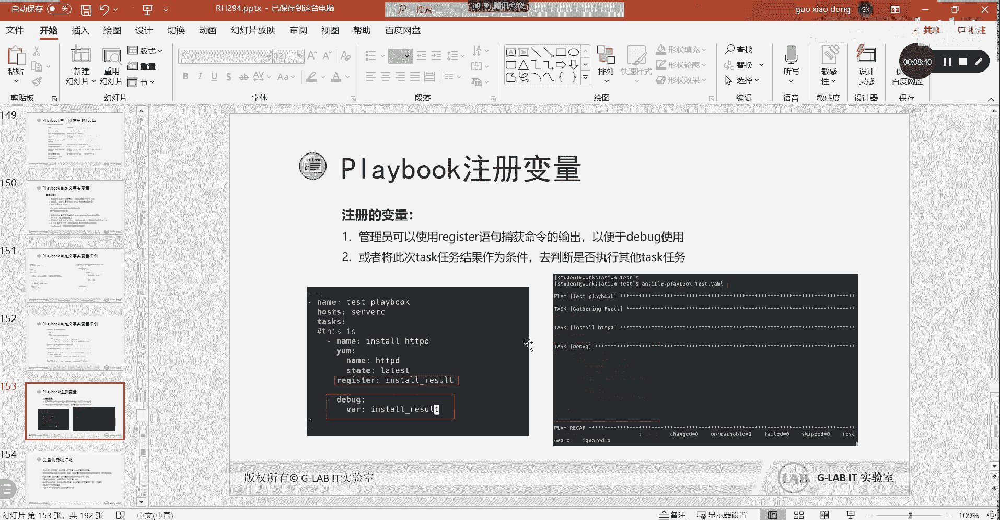

# 【Linux／RHCE／RHCSA】零基础入门Linux／红帽认证！Linux运维工程师的升职加薪宝典！RHCSA+RHCE／40-Ansible事实变量 - P1 - GLAB郭主任 - BV1gQ4y1h7QD

好我们来看变量相关的第二个内容叫事实变量，它叫enable facts，Facts，这个也是要考的内容啊，那么事实变量呢，是不需要跟前面的介绍变量不一样，它不需要事先声明和赋值，这个变量是内置的。

每一次playbook，有没有发现我每一次去执行playbook的时候。

其实在最开始的时候，他的任务，这不是我写的吧，这不是我写的这个名字，我没有定义这个名字吧，这个名字是什么，是不是在获取实时变量呀，所有的playbook默认在执行之前。

它都自动执行获取对方主机的实时变量，理解吧，当然这个开关可以关，但是默认是开着的。

所以你要知道，在playbook所有的playbook默认执行的时候，它都会自动去获取实时变量，我们也可以通过AD hoc的命令，去通过setup模块来获取来调用，获取实时变量好，然后呢。

ESPORT的事实变量可以成为playbook的一部分，对ESPORT的事实利用几乎不存在任何限制，你不需要定义就能用，很简单，借助这个事实变量，可以方便地检索受管节点的状态，包括机器的内存。

CPU硬盘状态，这些都是可以通过实时变量来获取的，听得懂我意思吧，OK1会给你，一会给大家演示一下，好然后呢这前面已经说了，内核版本网络所有的东西，这些都是实时变量所管的，然后输出是以JSON的格式。

我们可以存储在一个Python的字典当中啊，把这个机器所有的状态存储在一个字典当中，然后调用在每一个playbook，也可以通过setup来自动获取，来给大家演示一下。

这就是用setup手动获取ESPORT。

设为gum setup，来我们试一下呗，通过esport gu export server a，Server a gum setup，他说没有定义是吧，因为现在还是用的那个那个环境，多吧。

是不是一大堆东西啊，明白呢，我们要在里面过滤一下，我想看ESPORT下横杠跟IPV4相关的，哎叫INSP，诶叫什么玩意来着，n sport下杠，这个多了，这个太多了，我看看叫什么叫network啊。

这个是跟user相关的实时变量，这个是跟process进程相关的，这个还有你看啊，给大家看几个，这个是不是跟网卡相关的动漫相关的，这些都是以ex sport下横杠打头的。

这叫内置的事实变量，好不好好，然后呢，我们这里有有颜色，我们可以直接通过setup杠A过滤来看，我们跟内存相关的，跟挂载相关的，这个我就不去演示了，最终是怎么用它好，这就是一个我们调用事实变量的例子。

大家看一下能看懂吗，playboy的名字对所有主机做了一个task，这个task的名字是干嘛对吧，我要用的是什么模块，debug模块吧，debug模块用的是MSG，就直接输出print这个内容吧。

啊这个内容里面调用的是一个变量，这个变量我定义过吗，没有定义吧，是一种特殊的带下横杠的方式，所以这个变量就是我们的事实变量，听得懂吗，OK就是我的事实变量啊，明白那他会输出什么呢。

比较简单，Playboy，我们在最下面，我们把它去掉，我们重新写一个vim playbook1好吧，你直接在这里写好，刚刚刚好在这写，挺烦的，我不太喜欢在这，但是大家也可以，如果你喜欢就在这写。

有p r n t print好，house是二对吧，T a s k s，你看他不会帮你对齐，你要自己通过空格，嗯这边不对，要空格啊，前面两格name，这个name应该是什么玩意来着，print好。

然后呢用的是什么模块，d e b debug用的是debug模块，这个要空两格，debug模块用的是MSG的这个这个这个选项好，在这里，我们去写the，IPV4address is好调用。

调用我们的实时变量，这个可以复制的ASB叫d e f a u LT default，Ipv，四点ADDRESS，然后呢空格这就调用了，我的实时变量能看到吗，哪来的好看好。

来检查一下ansport playbook，Playbook，二一杠杠SYNTX杠CHECK好，没有错误，然后把这个检查的去掉，我们来看一下，是不是有输出啊，zap dress是什么什么什么。

他会帮你把地址获取到，然后填充在这个事实变量里面，听到了吗，就这么个现象啊，就这么个有这个东西你随时都可以用，不需要定义，很很方便啊。

好这个叫实时变量，然后呢在执行的时候，我们也可以用哎这个每一个BBOX在执行，默认他会去获取实时变量，那么如果我不想让它获取识别了，你可以在这里写，可以用这个可以把这个叫gathered facts。

把它变成NO，我们试一下好不好。

把刚才那个脚本vm playbook点，要么在这里呢，我们在你上面的时候执行的时候啊，在这加1+1行，在哪加一行，在这吧，在这加一行，这个叫gather ga t h e r下横杠。

这个FACTS冒号NO，这样的话在再去运行的时候，它就不会自动获取实时变量了，来试一下好不，Eball playbook，playbook点，要么有没有获取实时变量，直接运行的吧。

那就关闭了事实变量的获取，听懂了吗，好有些地方要啊。

那么有些地方他对这个优化比较严格，他觉得没有占用实时变量，你刚开始上来就给我获取实时变量，不是浪费资源吗，对不对，需要的时候你再开，所以要记得怎么关其他的事实变量，这是举了一些事实变量的例子了。

好还可以自定义实时变量，这个东西就复杂了，我们它是以JSON的格式来写的，大家后边如果有需要再自定义去，再去用自定义的方式吧，在我们rh ca当中，高级课程，高级课程会给大家去讲很多更复杂的东西。

好在考试没有考自定义啊，好接下来我们来看注册变量好，这个叫注册的变量，注册的变量是什么意思呢，就是管理员可以使用这个register，它叫register，这是一个关键字来捕获命令的输出。

然后用debug再把它打出来，Debug，大家有没有发现debug能打的东西。

只有你写的这个东西吧，哎我哪里有提bug的嘞，我刚刚在哪里有几bug了。

在前面是吧，看，这个debug下边的这个message，才是能够被打印出来的东西，对不对，好，有些时候你可以用事实变量来来来，来获取这个设备的相应的信息，但是有些时候我们想打印。

在执行playbook过程当中产生的输出怎么办，在执行playbook过程当中产生的东西，这就要用到这里的register来看个例子，我们想看在执行过程当中产生的一些输出啊。

我们用register来看好，这个就是个简单的例子来看一下，先看这个能看懂啊，Name host task，没问题吧，name这在干嘛，装HTTP t HTTP state，装最新的。

然后用register来接收，接收了一个register，后面定义的这个叫install gun result，这个叫这是一个变量，register定义了一个变量好，这个变量它会定义在这的话。

它会接收在YMHTTBD所产生的输出，然后再通过debug，通过把这个变量接收过来，就会在屏幕上打印这个安装过程当中的，整个过程输出吧，听明白吗啊，你在YM的时候。

他把这输出啊丢给了REGIST定义的变量，通过debug把这个变量又打印出来了，所以你就看到了嗯，我来做个举例，其实这边有啊，我就不写了，就这样写的，看到的结果就是，这个是不是看到它安装了整个过程。

对吧啊，就这样的一个过程，后边有用啊，有用到register啊，有些时候我们一般会用register和debug，两个模块啊，在进行运维的时候，用这两个模块来进行模块化的排错，因为我不知道他错是错在哪。

我想看它安装模块的时候所产生的输出，就要先用register去接收输出，然后再用debug去输出这个变量，就是这里的用法听得懂吗，就这样用啊，然后我们来讨论变量优先级的讨论，这个已经说过了吧。

就这里有很多变量还是过一遍，目前介绍了全局变量，剧本变量就是play变量，资产变量就是主机或主机组变量，这是前面介绍过的吧，现在又多了两个，一个叫事实变量，一个叫注册变量，是不是有五个变量好继续。

其中fact的变量是不需要人为去声明和赋值的，直接就用啊，注册变量需要通过关键字声明。

也就是说，其实你可以看到其注册变量其实要不要声明啊，要不要注册变量要不要声明啊，要啊你这不是在声明吗，对不对，你声明了一个install result变量呀。

所以注册变量是要声明的，除了fact事实变量不需要声明，其他变量都需要声明，我说清楚了吗，各位好，然后呢嗯全局变量基本变量，资产变量完全要人为的去声明，和赋值变量的优先级讨论。

也将着重从这三个变量去分析，也就是后边两个变量的优先级不需要讨论，不参与优先级的讨论，然后呢前面在优先级的讨论，我们前面已经写了吧，对吧嗯好，然后这个嗯这个已经已经已经写了，我就不去说了啊。

我就不去说了，这个也都说了好吧，这个在讨论我们的全局变量，剧本变量和这个这个叫清单变量之间的，这个优先级好，所以能看到剧本变量的优先级要高于资产变量，然后呢，我们的这个全局变量的优先级。

要优先于其他的两个变量优先级，结论就是我们刚刚总结的结论清楚了吗，好然后接下来我们来看一百一百011百零一，管理变量做了没有，做了是吧，刚刚做的就是这个啊，然后呢我们来看接下来第三个内容叫管理机密。

这个东西太简单了，这个很简单，他是干嘛的呢。

嗯我们在执行这个playbook脚本的时候，是不是没有任何安全机制啊，所有人连到这个机器上，它就能直接用，直接执行你的playbook脚本，对不对，所以现在要讲的就是能不能有一个安全的机制。

我我给这个playbook加把锁，搞个密码，然后呢，我只有我的密码才能输对了，他才能执行，我这边写的脚本就是对PLAYBOX脚本执行来加密。

这个加密不是真正的那种文件加密，是加了把锁，加了把锁，然后你想看里边也要输密码才能看到，能理解我意思吗，ok sport what这个叫密钥管理管理，访问敏感啊。

去管理一些敏感的sport playbook清单，然后通过这个来对这个结构化文件进行加密，它叫加密啊，你就把它理解为加密吧，然后对可以通过ESPORT这个命令，前端的命令叫ASPVT。

可以对playbook进行呃，创建编辑加密解密都可以，然后export word什么什么什么变量在执行，所以在执行所有东西之前，都必须要进行密码的输入，然后呢这是第三方的工具什么的就不看了。

我们主要来看他怎么做，这个简单啊，Usb vt create secret secret，点yo输了个密码，Red hat，Red hat，然后enable vt create创建了一个。

这是这是另外一种创建方式啊，嗯这个是通过存储密码的方式来创建，看啊上面这个是最简单的，就是就是对这个这是我的目标的压缩文件，然后我通过他对这个目标，要么文件进行简单的密码加密吧，下边这个是通过文件加密。

就是你把密码写在文件里面，然后通过这个文件来对这个secret yo来进行加密，听得懂吗，两种加密方式，一会我给你演示好继续，然后如果加了密之后要看怎么办呢，去看这个文件，然后要输密码，对不对。

如果是通过文件对它进行加密的，你怎么办呢，这是edit，对他编辑那个是view，这是edit，没什么好说的，然后要对通过文件对它进行的话，你要在这里，这是解密啊，这是解密，这个是加密，可以加密。

也可以解密哎，文件对它进行看，我怎么看呢，在哪来着呃，这是REKEY，在这对吧，他杠杠ask vt pass，这时候会要你输密码才能够看到，如果是文件的话。

是通过杠杠word password fire输入你这个文件的名字，然后才能看没了，来给你演示一下啊。

比如说在这我们想对我们刚好有两个playbook，一个是一个，一个没有是吧，我们第一个我们用密码，用ebr gun vt create cr，这个补补全CREAT创建对吧，创建一个文件。

我们对哪个文件对playbook点yo，对它进行创建，Missing require action，让我输个什么东西来着，As for what，写错了，CREATE好密码，我们就用REDHAT。

Redhat，他说什么RAUSIT，哦已经存在，这个是，稍等一下啊，sec点要么，Really hurt，really hunt哦，这个是加密的文件啊，说错了，你可以把这个文件密码写在里面。

red hat对吧，然后我这里有两个，一个是用来加密的文件，就是密码带密码的加密文件，然后一个是我的playbook，然后我要用它对它进行加密，我们可以通过下面，C r e a t e great。

杠杠VA呃，V a u l t，这个记不得我们怎么办呢，我们可以通过sport vt杠杠help，可以看到有这个东西，杠杠word password fire是吧，就这个吧。

Export vt c r e a t e，然后用我刚才的那个那个文件，那个文件，sec点yo去加密，playbook点yo，嗯哪里不对，可能，哦这边写错了是吧。

看一下啊，这很简单，我忘记这边的输入的命令了呃，创建新的加密文件，可以使用这个命令来创建新的加密文件，该命令将提示输入新的这个word密码，同时利用默认的编辑器打开文件嗯。

然后除了通过标准的输入这个密码之外，可以通过这个word密码文件来存储word密码嗯，用于保护此文件，需要通过文件权限和其他手段加以保护，这个呢。

稍等，杠等于什么，啊这这个是文件，不是文件，这个文件SEC点，要么对的呀，对他进行playbook点，要么，我们来看一下啊，SEC啊，这个是加了密的是吧，好这个是加了密的，这个是加了密的哦，我知道了。

这是加了密的，那么ex bgwt我们来view一下，运行叫v i e w view一下，这个他让我输密码，我们来输一下REDHAT好，这个是加密的密码文件嗯。

has spreview一下playbook点，要么we have，哎，不对呀，我想想啊，这哪里有问题，HBWCLEATE创建一个，对这个是创建的，创建一个playbook点，杨某REDHAT。

他说已经存在了，那就不是创建啊，view也不对，editor也不对，应该是这里的加密，通过它来加密它来我们试一下啊。

Export vt，这个叫ENCENCRENCRYPT吧，嗯我们用sec的，要么去加密这个playbook点，要么好，密码是redhat red hat，已经加密，写反了吗。

playbook点要么用sec，已经消灭v i m playbook点，要么诶是的，已经交了米，那我们是怎么去看呢，比如说，ESPORT的VT，我们去view playbook点，要么REHEART。

诶，他什么时候加密的，再来一次啊，我们把该删的删掉，有个一我们没有做任何改变的是吧，Hello，一啊，这个没有任何问题，其实我们把其他多余的都删掉，RM杠杠RF，我们把playbook点要么给它删掉。

然后再把secret要么也删掉好，这时候没有了干净了，干净之后，我们来重新来做，我们主要要对playbook1来进行加密，现在没有任何加密啊，playbook1没有任何问题好，现在根据他的做法是对吧。

Enable vt，我们是应该先创建一个用来加密的c r e a create，CREATTE是吧，创建一个这个叫SC点yo的文件，然后让输密码输密码，然后再在里头呢我们也也得也得用一个。

我们密码用的用的不一样吧，这个用RHCE好了，外边是REDHAT，里边是RHCE好，所以这个时候我多了一个文件叫SEC，它是一个密码文件，这个文件里头它是加了密的，要想看它呢也很容易。

我们可以通过sport vt去VIEW，去看一下这个文件，这是要输密码，外面的应该是REDHAT，只看到了里面的内容是RHC，能听懂吗，好现在只是做了一个加密的，用来做加密的密码文件。

那么我要用它来对我的playbook1进行加密，我可以用刚才的应该是通过sport这个word嗯。

我看看是哪个版哪个加密，has word fire命令，此命令可取多个预加密的文件，此命令可以做个使用这个嗯，这个哪个的前面S多，加密试一下吧。

ENCNCRIPT啊，我们把secret1T二好直接加密吧是吧，哦不是哦，我知道了，这时候就加了密啊，他没有说把哪个文件加密，哪个文件如果要用哪个文件夹的话，是在下面的这个命令是下边这个命令对吧，好。

现在我给它加密的是直接直接用的密码加密的，来试一下啊，我们现在要想看他的话，EB杠watt ew playbook1，他要输密码的这个密码是red hat，是不是就看到了，对不对。

如果我们现在要执行的话，playbook我们要执行这一，不加任何东西是执行不了的，他会他说你这个是加了密的，是必须要用解了密才能才能执行对吧，那解密执行在后面给大家讲，现在我现在给大家讲的是加密好。

然后呢现在是加了密，我想给它解密，解出来，解出来之后呢，然后我要用接下来，刚才创建的这个文件来进行加密，我先给他解密，Ansport，VTDE叫DECRYDECRIPT吧。

对这个playbook进行解密，好密码是REDHAT解密，解好了之后，我们通过vm playbook是不是就看到了，明白了吗，好像现在我们要用里边的这个文件，对它进行加密。

我创建的这个文件来对它进行加密，记住这个文件外边的打开密码是red hat，里边的是RGC，好，我们来怎么样呢，通过USBVT啊，先加密了，叫ENCRYPT嗯，然后呢我们通过杠杠哎嗯对它进行加密。

我们用什么东西进行加密用嗯，我们用什么东西指定文件，我来看看啊，诶我可以指定文件来进行加密。

啊我们来看看，edit can we key不用管，Ask，啊这个是运行的时候要用这个，运行的时候要用这个，然后呢嗯word word password fire，这个是运行用哪个文件也是用这个。

那我对它进行加密，用的是指定的是哪个。

我忘记了卡，esport word杠杠，我要确认一下我要用哪一个文件，Word password fi，应该是这个吧，应该是这个来吧，试一下，通过ansport root，然后对这个文件进行加密。

E n c r i p t，然后加密连接过来用的是sec点，要么对playbook，对playbook已进行加密，叫award password，Must be special to，没加成功嗯。

我确认一下看看，哦我知道了，知道了他是什么意思，啊啊啊，不是这样的，C r e a t e create，它有一个这个命令，Create word password fire，是不是用了这个，这个。

嗯这个叫叫叫什么fire，fire是什么，What as well for，What as well，The fa，啊烦的嘞，哎还是这样子的，第一个就是这个命令是直接创建，你在创建的时候。

这个密码放在里面，直接就给你加密了，这个没有任何问题，那如果我现在有一个有一个什么test文件，这个里面我放了很多东西，比如说放了这个password冒号对吧，是red hat。

我自己创建了一个文件在这test，那么我想把这个文件这个里边的东西比较敏感，我要把它把它加密起来，把它包起来，那么就应该用and sport这个watch上面的CREATE，然后用刚才的那个命令。

就这个吧，在这啊这个这个命令是创建这个用哪个文件，就是刚才写的test，然后用什么用他SEC的样貌，SEC点要么。

