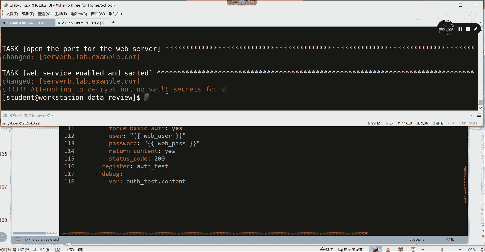

# 【Linux／RHCE／RHCSA】零基础入门Linux／红帽认证！Linux运维工程师的升职加薪宝典！RHCSA+RHCE／41-Ansible实验 - P1 - GLAB郭主任 - BV1Jw411N7F7

这个这个我们先放这儿啊，一会儿我们再看，因为后边练习当中，是有一个跟这个地方有关系的，然后呢一会我们再看一下，然后今天的这个最后这个实验，我们叫128页的管理的这个综合实验，这个声音比较全。

而且这个配置量也比较大，所以我赶紧给大家梳理完，梳理完了以后，大家需要做的两个啊，一会儿再看好来，我们看它整个的实验的要求。

他整个实验要求，他要做什么，这作业期了吧，基本变量，这个是128页的，好这是128页的实验需求，来看看要我们做什么，在这里呢他肯定要求我们用结合变量，要变量加普通变量加40变量。

然后再加我们刚才卡住的那个加密来，一起来实现下面的要求，这个要求总共有两个play，我们先一个play一个play的看呃安装，并且要升级到最新版本，这个肯定是用变量嘛，前面实验当中有说到这个是吧。

把软件包定义成变量，通过变量来做，第二个，他要求你用copy模块，将本地的这个文件要复制到目标主机上去，并且还要改它的数组是什么，权限是什么，这个很简单，是不是用copy模块把我们的这个文件要送过去啊。

对吧，第三个呢用file模块来解决宿管主机上的目录，然后把目录用于web服务器本身的，这个基本的身份验证的密码文件，然后数组合什么东西就按照这个来了，所以这个也是在对文件进行处理。

但是他创建的是一个目录，这个目录用来存放我们的验证用的密码文件，这些所有的文件不需要你关心，在环境当中都已经帮你做好，就这些文件在哪，他都会告诉你理解我意思吗。

你只要用file模块把这个文件送到目标主机上去，根据要求改它的数组和它的权限，这是第三个，第三个，第四个需求，用copy模块呢，要在这个这个这个这个这个身份验证的，这个文件里面。

此文件的控制节点在在哪里，在哪里，也就是用嗯用这个copy模块再把这个文件送过去，复制过去，用copy模块把这个文件也复制过去，然后在web root变量当中创建index文件，从此内容要调用事实变量。

也就是需要去创建用于index文件的事实变量，然后呢在service的模块当中开启防火墙FIREWOR，放行HTTP，service模块呢开启HTTP，这个就是前面前面的嗯，可能会多了一些文件的处理。

这些文件不需要大家编辑，都已经是已经做好的，第二个play，通过测试本地来测试，不需要去升级权限，通过guest账户来测试密码放在哪里，什么什么什么，通过URL发起一个HTTP的请求。

记住这里的请求不是HTTP了HTPS，并且它有特殊的用户规定，要通过这个用户HTTPS，并且获取状态码是200，要放在哪里啊，放在注册表中，注册变量当中，然后通过debug模块打印出来。

最后测试用到了register变量，debug debug来输出注册变量和我们这个debug打印，就这点东西吧，其实在让大家搭建它，本质上大家搭建一个HTTPS的服务。

然后呢把一些软件什么东西都处理好来，最后再去测一下，记住了吧，来吧，我们看一下我们的代码，我们来过一下我们的代码，这个太多了，这么多要疯了看啊，其实不复杂，一块一块的来，首先我们要写一个第一个play。

前面都不说了，然后把一大堆的变量都放在这里，这一大堆变量包含我们上面所提到的很多东西，比如说要装的包啊，package是吧，Package，然后呢呃要考的文件的源，要考的文件的源啊对吧。

要考到对方的什么地方啊，啊要考虑对方要创建对方的目录是什么呀，这些都是通过它定义起来的，然后我的index所在的这个目录是什么呀，在这，所以这个变量大家自己去梳理一下，需求都有明确给出来。

你就要按照需求把这些变量都做好就行了，我记得好像playbook这些变量应该都是做好的，没有做好，大家就自己打进去吧，好接下来做第task task是不是第一个要装包啊，这个不说了吧啊，三个包装好。

第二个是不是在copy文件啊，把原目标要改数组要改权限，这是需求当中明确要求做的，在这对吧，好第二个不错了，第三个也是在把我们的文件，这是在创建目录啊。

很明显file创建目录state应该是director创建，在目标主机的目标路径下创建了一个目录，并且这个目录的数组和数组，并且它的权限要按照要求去创建，然后下面这个是在开什么啊，还没到开呢。

这个是在copy HT TP s要用的一些文件，从这里copy到这里，要改它的数组，这个也是的，把原目标数组数组权限这个题目当中都有啊，明确要求要改要传哪些文件，到哪些地方改它的属性好吧。

然后接下来创建首页好，这里要注意一下，创建index文件的时候，他要求你用事实变量，所以事实变量用起来直接用就行了，在content里面直接调用的事实变量，请问这个事实变量是什么意思啊。

猜也能猜得到是不是目标主机的FQT2，这个目标主机的IPV4地址啊，所以最终你去访问目标主机的时候，网页上给你打的就是server a lin exam点com IP地址。

hubin customer对自定义的，这是怎么来的，就是通过事实变量来获取的，听懂了吗，获取的内容生成的内容放在哪里，放在index三WY23YHTML的index里面，这是变量啊。

B就是这个就这个是吧，index文件所在的地方，这个没什么难的，就可能多是多了点，但是难度其实还是可以的，不是很难好，防火墙要开启服务了，然后呢防火啊，这个叫这个叫服务service模块。

开启服务防火墙，放行端口，放心，HTTPS不是HTTPT啊，不是HTTPHTPS，然后呢要开启通过service模块，也要开启防火墙模块，开启的是防火墙模块啊，这个变量大家可以去看好不好。

然后其他的就到了第二个，第二个作用来测试它的目标还是本机，不用提全是吧，然后记住我要用到的一个普通用户，来进行登录测试，这个普通用户也是他给你的，OK它赋予一个变量，然后有一个变量的文件。

这个变量的文件，这个变量的文件就是我们用来加密的文件，叫secret yao，一会儿我们要创建这个文件，创建好了之后，接下来测试通过URL去访问HTPS，大家知道HDPS是有证书的对吧。

所以我们要把证书弄掉，就是忽略证书对吧，然后强制的基本验证要验证，要开始了，发起guest用户，发起guest密码，密码也在哪，也是给你了，这也是变量定义的，然后要返回值吗，要的捕捉状态码多少200好。

到底有没有成功，我其实运行一下就知道了，但是我想看运行的结果，我要用register注册变量来获取所有运行的输出，就这一段啊，测试运行的输出，然后通过debug模块把输出打出来，听得懂吗，就这个东西。

所以这两个最后两个用到注册变量和debug，OK好，那么其他的应该没有什么，就这么多内容，其实涉及的模块也还好吧，就主要是copy copy service fireword，样啊，还没有样嘛。

样么对吧，再加register，再加debug，URL没了。

来我们运行一下在294的代码，我们这里叫什么玩意来着，啊这个就是这样，课堂实验七是吧。

好那我们再把这个送上去呗，写完了课堂实验七拉进来。

然后缩小，然后再在这个地方应该就看到了，好然后我们把它送到哪里去，我要把刚才的实验环境关掉，刚才的实验环境是是什么lab lab，什么来着，刚才的实验环境叫lib dvarious。

Dvarious ga，好重新开叫lib date review star，好这个环境打完了之后呢，我们就可以到就生成了一个新的review了，我们直接到data review里面去。

然后看一下是不是s sport，这些东西都给你了对吧，你可以自己去看，然后要用到的变量还有很多文件呀，要从本地导到对方的文件都在files里面，我们可以LS杠L去看一下这个files里面的文件。

这两个文件都刚才都会用到的啊，都在这好，那么我们把它送到这里来嗯，PWD送到这儿来，复制一下，从这这个吧嗯，第五个这个叫什么，叫s t u d n t student，好冒号把他送到这个目录下面来。

好过来了以后我们来看一下就来了，好MV切一下，把它改成我们的需要的这个诶，他有吗，叫什么叫什么玩意来着，叫名字叫什么名字，名字名字就叫black boo吧，好吧嗯，点YM，好playbook有了来。

我们把这个playbook重新编辑一下，前面不需要都删掉，哎呦散多了靠，这个就是我们刚才编的啊，有人说你为什么不复制啊，你们可以试一下，就我这边这边复制过来，直接贴到vim编辑，你可以试一下。

我现在给你试一下。

比如说我把这一段代码复制一下，对吧。

这个代码，vim test txt123点，要么，爽不爽啊，又能复制，我也不这么干了，复制进去之后，你还得一个一个的去调缩进，整个人要崩溃了，要疯了，我不管你怎么改，烦死了。

复制的话就是这个样子是贴贴是贴进去了，但是yo的这个最重要的格式对齐，你要一个一个调，太烦了，然后我直接导进去就最好了，好不好，然后呢，我们来验证一下啊，还没好呢，他因为要用到加密。

就是我们刚刚卡住的一个地方，我们需要重新创建，创建一个用来解密的secret文件，叫我们来创建一下呗，创建啊，首先他说的是解密的文件放在哪里，放在这个VRS在vs下面。

然后我们创建一个通过ESPORTVT去创建，CREATE是吧，通过它去创建，在vs下面创建一个叫SECR，security s e c r e t点，要么是没写错啊，SECRATSECRET点。

要么在这里呢，我们用red hat we hit好里边的东西，它应该要调用这个里面的一个变量，这个变量名叫west password，web叫web下横杠password啊，要写成我们yo的格式。

冒号后面有空格啊，密码用red hat来保存一下，所以其实在vs在vs里面的这个文件，就是存放的是一个啊字典格式的。

看清楚了吗，字典格式的啊，这个web password在我的脚本里头应该调用了它，因为一会儿要调用到叫web pass，是不是他呀，这个就是我们的那个密码吧。

就是用来登录这个guest登录进去的一个密码。

这个登录密码放在加了密的这个word里面，在这OK好嗯，这个是做好了，做好了以后，我们可以来简单的来测一下，来检验一下它的语法，playbook playbook这个杠杠SYNTAXCHECK。

我们之前是不是这样子的，是不是这样子好，这个时候他会报错，为什么，因为你在playbook里面是不是调用了一个，调用了一个一个一个secret文件呀，就是vs里面的secret文件里面的一个变量。

这个变量就是vs secret里面，就是你是不是调用了一个加了密的文件。

加了密的文件就没有办法去执行对吧，所以我们在后边还得再加一个叫杠杠，ASK杠VALU叫什么，V a u l t v a u l t，这个pass就是输入一下密码，因为你要调用的那个文件是经过密码加密的。

REDHAT好，这个时候输完以后，他就帮你检查了，听懂了好，那么既然检查语法，通过检查语法，通过这个杠杠就可以不去掉了，我直接运行呗，直接运行看一下啊，一会儿也报错，为什么还是一样的原因吧。

嗯playbook调用了那个现在没报错，因为还没到呢，它的处理顺序是从上到下的对吧，等他到了最后测试的时候，你会发现会卡出来啊，是不是有问题对吧。

是因为调用那个密码，最终要这个地方要调用这个变量，文件名里面的web password的时候，它要求你输密码，你没有输密码。

你怎么能过得了呢，所以在这里要运行这个带了密码的playbook，后面也得加上一个叫ask杠，VAULTVAULT杠PS好，输一下密码吧，他就开始执行执行，没关系，第二次执行，第一次执行过的东西。

他不会再装，你看都是绿色的吧。

只有到最后的时候，过了吧，这就是reject的捕获的变量啊，看到的是他这是FK0，这个是IP地址，看得懂吗，OK所以最后就拿到了。

并且通过验证，通过了，这就是这个实验当中所包含的内容，这个实验当中没有难点，就是比较烦，你要一定要细心的去处理语言文件，目标文件，package service这些一大堆东西。

最后的话可能要注意这是HTTP的登录验证，所以要忽略掉他的证书啊，就是每次HTP访问，是不是会有提示一个不安全的证书啊，那叫自签名证书，所以这边打个NO，就相当于接收了没有任何证书方面的影响。

其他的没有任何问题，各位有问题吗，没有吧，OK好，所以我们说到这，我再总结一下我今天的几个内容嗯，从早上接触ANSIBLE对吧，知道它是什么，然后知道他怎么去安装好，安装完了之后，在环境配置的过程当中。

大家一定要注意的，有一些细节在这边已经都给大家整理出来了，然后在接触到SB的时候，它其实是用另外一套完全不一样的方式，来实现服务器的管理，以前我们通过命令，通过白线的命令去管理。

现在我们用的是s sport的模块化脚本来管理，听懂了吗，所以可以通过AD hook，也可以通过esport playbook脚本，playbook脚本要遵循yo的格式，yo的格式有讲过了。

它有三种数据结构，对不对，它有一些缩进的格式，它有一些这个呃，这个这个叫字典，和这些所有的混合使用的方法啊，格式标准格式啊，这些都是要他要注意的，然后这个说完聊了一些简单的一些样貌的play BO。

简单的playbook，Dplay book，多playbook，多play playbook好，接下来说到变量，变量在我们的复杂任务里面，基本上都是用的是变量，而不是说装一个服务就写这个服务。

我们应该要给它复变量，有了变量，很多事情就好办了，单纯的变量看不出结果，他加上循环就能看出来了，明白我意思吗，变量加循环，那么关于过程的控制，像循环条件在明天上午的时候会给大家介绍，应该在明天上午好。

那么这几个实验，最后几个实验要大家做，第一个看我复制进去，很快啊，你们打估计要打半天，第一个在在哪里啊，在在在在在在101夜的，不不，第一个应该是八十六十六页，做了是吧，88页的88页。

第一个第二个100一页，第三个128页记下，记下了吗，啊你哪怕抓紧时间把这几个代码都打一遍，你接下来接触C的题也会快很多，现在不花时间，等你到下下个星期要花时间了好吧。

