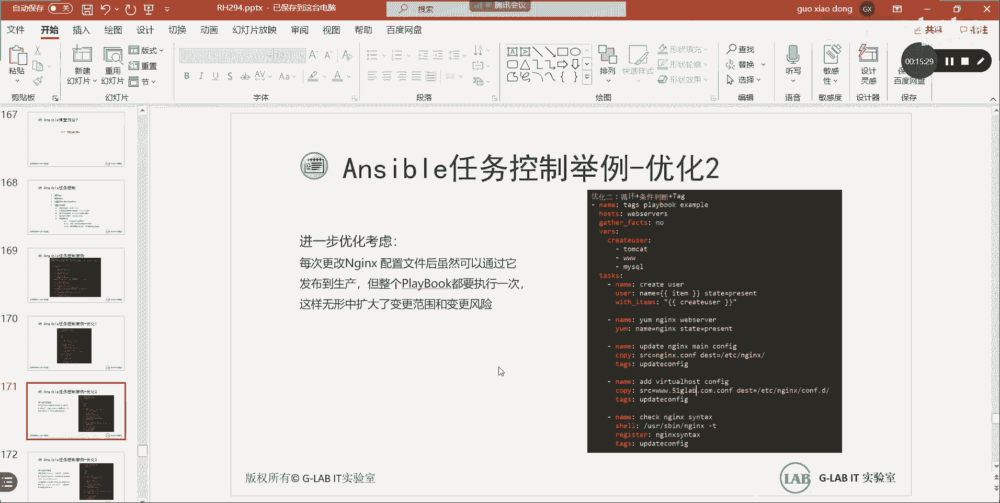
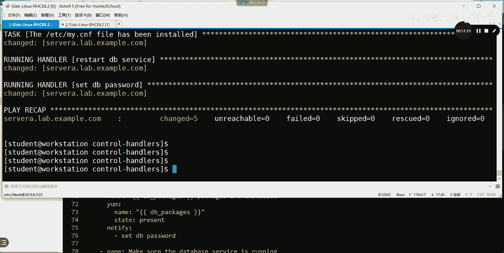

# 【Linux／RHCE／RHCSA】零基础入门Linux／红帽认证！Linux运维工程师的升职加薪宝典！RHCSA+RHCE／42-Ansible条件和循环 - P1 - GLAB郭主任 - BV1Az4y1A7j2

好来我们看今天的内容大概有三个，我们昨天啊回忆一下昨天的这个笔记没给你们，今天会会会一起给你们啊，在这今天讲完，我都给你们昨天讲了sport安装，然后AD hoc的命令模块啊，主要讲了一大堆的十几个吧。

常用的命令模块，然后这个介绍了ansport yo，yo yo的一个格式啊，这个是需要大家一定要记住的，其实asp我们这个阶段学的内容一点都不难，难就难在它的格式上，它的格式上很多人写完跑不起来。

难就难在它格式，所以大家一定要注重格式啊，格式怎么写，然后然后我建议大家用这种新的格式方式，就是很典型的key value的这种方式来写啊，这个这个名字冒号加值嘛，不要像以前一样的那种写法，写成一串。

写了一串，那个虽然逻辑架构看起来更清晰，但是未来有很多的这个模块，它那样写是不识别的，所以大家尽量用新方法来写，然后说到变量啊，变量应该是我们昨天一个非常重要的内容。

我们讲到了全局变量和play里面的变量，还有主机变量，那么最终得出了优先级的这三个结论，这三个结论大家要记住的对吧，不同的地方都可以定义变量，什么地方的优先级定义是最高的，就这三句话。

并且变量也是可以继承的，所以这个啊就在昨天内容有提到过，然后最后呢给大家聊了，留了几个作业，我记得应该是三个，这些代码量都算是还是可以的，蛮多的对吧，代码量还可以，但是应该不难。

但是它都是一块一块的对吧，都是一块一块的，所以大家只要确定好大框架，然后往里面去填。

and sport模块，还提到过说sport模块如果大家不会写，不会知道啊，不知道或者不记得我们应该在哪里呀，是不是通过asp dog啊，Dog，比如说我不知道YM是怎么写的，Dog ym。

然后去搜索一下EXAMPLE大写的example，你就会看到它常规的用法是什么样子的，你直接复制就可以了，复制带过去改改就行了，所以呢关于模块里边的一些参数，一些选项大家不用记。

只需要知道有一个dog就可以了。

所以这个应该不是难不是什么难点好吧，然后今天呢我们开始介绍条件控制，介绍条件公子，在条件控制开始的时候，我们一定要呃来思考一个问题来看一下啊，假设我们现在有一个实际的需求，这个需求是这样子的嗯。

你要要要求你写一个playbook，然后要求你创建啊，Tom cat，tom cat和这个3W还有MYSQL3个用户，一下子创建三个用户，然后同时要安装这个软件包，然后还要更新到最新的版本。

然后要配置NGINX的主配置文件，还有这个虚拟主机的配置文件，也就是index的这些文件，这是配置文件，要要要去做配置，然后呢最后让NGX服务要处于启动状态，这样的一个需求，我们现在应该能写的出来吧。

应该能写得出来，明白吗，应该可以，我现在这种写法就是老的写法，告诉你老的写法应该是这样子的，不要再这样写了，应该要分开明白吗，应该要把它应该这样子，然后把这个等号改成冒号，这样子写，能听懂吗。

应该这样写明白，不要用这种老式写法，能写的出来，大家先来看创建用户，我们用什么模块，user模块吧，然后呢分别创建三个用户，是不是要用三个分别写三次的三个user模块，明白意思不好，然后呢然后去安装包。

我们用YYM模块没问题，然后改文件，改配置文件，用copy用了两个copy文件，一个是去改它的配置文件，其实两个都是改它的配置文件是吧，一个是主配置文件，一个是虚拟的配置文件，OK都可以用copy来改。

然后最后我们把服务给他骑起来，这就是根据我们的需求，我们可以根据需求对吧，一板一眼的把这个所有的模块都加进去，然后最终运行，那这个运行的时候，我们会正常情况下不会出现任何问题，但是也有可能出现问题。

比如我们先看最重要的一个问题，比如啊在这个模块在改它的配置文件的时候，如果配置文件改的不对，他去执行这个任务的脚本的时候，他就会报错吧，好他只要一报错，后面所有的东西就没有办法继续执行。

这是airport playbook脚本在处理的一个规则，算是一个规则吧，它的处理规则是从上到下依次处理的，这个我们提到过吧，你写playbook哪个写在上面，哪个就先处理，没有问题吧，OK好。

还有一个规则，就是现在我讲的，只要中间有一个任务脚本处理不成功，他就会立刻终止，立刻停止执行，blackboard脚本，也是后面的任务都不可能执行，听懂这意思吗，这是一个问题吧，所以呢在这个问题。

我们应该怎么去解决这个问题，是不是得有一个判断条件，接下来就引出了，我们今天要讲的第一个重要内容就是条件判断，我们必须在执行的时候，是不是得先去check一下这个文件，改的对不对吧，文件如果对了。

那我再去改这个文件，然后再继续往下执行，如果文件改的不对，那么我再去怎么去处理，对不对，明白意思吗，所以这个时候我们会出现，会出现这样的一个考虑，那为了完善这个脚本做的更好，我们一定要引入条件判断。

这是要第一个要引入的东西，第二个创建三个用户，我们分别用三个user模块来写，是不是很麻烦，如果用创建30个用户，那你的playbook他的代码是不是很长啊，对不对，所以在这个时候如何把这块优化一下。

是不是可以用到循环，对不对，通过循环，通过变量加循环的方式，变量我们昨天讲过吧，我们可以给user定义变量，把这些用户都放在变量文件里面，然后在创建用户的时候去调用这个变量。

并且要去一个一个循环的去调用这个变量，我们可以用很简短的代码，就可以创建很多个用户，这就是循环，这也是一个要优化的地方，能听懂吗，OK好，所以我们来考虑接下来要优化了，怎么优化呢，我们一定要引入循环。

大家来看，我在这里做了改变，我定义了变量，请告诉我这个时候我定义的变量是三个变量，定义的哪一种，我们刚刚讲了三种定量变异的方式，全局playbook和主机是吧，请告诉我现在这个变量是哪一种方式。

是在哪里啊，这是变量吧，这种变量定义方式是三种中的一种，第一种global，第二种play，第三种主机123啊，这是global吗，global不是global。

是在asp运行的时候通过杠E的方式传参的啊，这个应该是在play里面对，就play就是脚本吧，剧本里面是不是写在剧本里面，对不对，这应该属于第二种，明白吗，这应该属于第二种的变量定义方式好。

这个时候变量定义方式定义了一个变量，这个变量如果这样写，这是一个典型的什么字典还是列表，列表吧对吧，很明显这是一个这是一个这下边是列表啊，下边是列表，上面这一块是字典。

它的K值就是这个create user，这就是它的变量名，它的value值是一个列表，也就是变量value值不止一个，所以你可以用列表的方式给他，一个个都写出来了，所以这边能看到三个用户吧。

好接下来怎么去创建用户呢，还是调用user模块，然后我把这边写的给大家能够看到，用老的方式写，可能更容易看清楚，看到了吗，啊啊这个也不对，这个应该用loop它的变量的方式，老的叫叫叫，现在叫loop好。

现在看清楚了，就是这一段怎么去理解，这段有个开发基础的，应该一看就看得明白，我用user模块来创建用户好，这个时候调用的应该是一个变量对吗，调用变量的时候，我们说应该要用，要用引号把它引起来。

应该这样写对吧，那这样写才对啊，这都是昨天提到过的格式上的一些注意点啊，好我们要去调用这个item，item是C的，Item，是create user里面的item，就是到这个是关键字啊。

到这个变量里面去一个一个的去调用这个item，然后去create用YUSER模块一个一个的去创建，听得懂吗，OK所以这就是一个通过循环来做很多事情，这个很简单的脚本就可以搞定了。

通过变量加循环他就写好了，所以这是我们要做的第一个优化，听懂了吗，循环OK所以呢当你发现能够用循环优化的时候，你就可以用循环优化，这样减少代码量啊，这第一个优化，第二个优化呢，第二个优化。

我们是不是要去判断你的配置文件改的对不对，安装没问题啊，安装直接装就好了，对不对，这不存在任何问题，没有装就装一下，装了的话也没有关系好，接下来就是配置文件，如果有问题怎么办。

这两个配置文件主要是哪个配置文件，主要是这个呃，主要是这个NGINX的配置文件SB下面的，就主要是就这两个配置文件啊，就这就这两个配置文件，那怎么检查这个配置文件的配置，对不对呢。

我们可以通过nginx gt这个命令，大家配置过NGX该知道的，通过linux gt就能够判断你的所有配置文件，配置的有没有问题对吧，所以我这里再加一个任务，用来判断配置文件有没有问题。

然后把这个判断的结果丢给register变量，你JS的变量是我们昨天学的什么变量，昨天学了五个变量，global变量，play变量，host变量，还有什么叫事实变量对吧，还有一个叫注册变量吧，这五个吧。

所以这应该是什么变量，注册变量吧，我们把前面执行的结果丢给注册变量，这个变量要声明的register，后边这就是他声明的变量名，听懂了吗，OK然后register捕获了他执行的结果之后。

接下来是不是会存在一个条件的判断，对吧好，当这个register捕获的内容，里面有一个叫RC等于零的话，就说明它的配置文件没有问题，RC等于零代表是执行成功的，听懂了吗，然后我再去重启这个服务。

听懂了吗，各位好，上面加了一个debug，debug是什么信息，就是输出吧，还记得吗，debug是在ANSPORT脚本playbook里面的print，类似于Python里面的print。

所以这个其实没有什么实际的作用，只是输出，你可以写可以不写，理解我意思吗，但是这一段是比较重要的，我加了一个条件，如果当上面的检测的RC等于零的时候，我再去执行起重启服务，因为在LINUX里面。

只要文件被改动，我们一般都要重启一下服务才能生效吗，对不对，所以加了条件会使我们这段代码更加的严谨，你能看懂吗，啊OK啊，也就是说这一段如果不没有执行成功的话，也就他本来就有问题的话。

我在debug这边就能看到，说明它的配置有问题，然后这一段会不会执行，不会吧，不会被执行吧，能听懂吗，然后只有当检测到它没有问题，然后呢print也输出来说RC等于零，没有问题了，他才会去重启服务。

才会执行这一段，理解我意思吗，所以做了一些条件的更精细的控制，没有任何问题吧，所以这是我们做的第一步优化，那么这段代码这是我们常见的优化的结果，那能不能再进一步优化呢，可不可以再进一步优化。

当然可以，比如说我有一，嗯在哪，搞清楚了，一会在今天有时间再跟大家说一下啊，嗯我看看在哪，在这啊，我们能不能再进一步优化呢，来来看看我们在执行每一个，每一次执行脚本的时候，每一次更改这个配置文件。

虽然可以通过它发布到生产，但是playbook都需要执行一次，这样的话，就是扩大了变更的风险，什么意思啊，就是还是这个脚本，这是我们优化过后的脚本，我们我们每一次更改配置文件。

是不是都应该需要重启一下服务就可以了，对不对，但是我们只想去更改文件和重启服务，当我的这个playbook如果变得非常的大的时候，也就是有很多的任务，需要在这个playbook里面的时候。

他每一次仅简单的仅仅只是更改配置，他都会去重新把所有的任务都执行一遍，这样对于企业来讲是很大的风险，能理解吗，明白吗，所以我们做更精确的控制，就是做到仅仅只是配置文件改变的时候。

那么我在这个playbook里面仅仅去执行嗯，更改配置文件和重启服务，其他的都不去做执行，听懂了吗，就把我需要的东西就执行一下就可以了，其他不需要的我就不执行更改的去执行，没有更改的就不执行。

OK那么这个怎么用呢。

来看一下他做了，他引入了一个叫在这一或二前面的循环和条件，还是不变的，他做了做了个tag，大家看这个tag我在我在哪里，我在这加了个tag，就是把我相关的啊，update这个是不是用copy去改文件呀。

在下面加了一个属性，叫TX给他打了个标记，然后这个也打了个标记，这俩标记是不是一样的，一样的吧，好然后我接下来在刷新这个ANSPORT的时候，playbook的时候。

我在ANSPORT后面加tag等于update config，这个时候他就会只去刷新所有的tag，等于update configure的任务脚本，其他都不刷新，理解我意思吗。

这样就能做到playbook虽然有几十个任务都在里面，但是我给不同的任务给他打上相同的TT，那么在执行脚本的时候，后边挂上一个tag，他就会去只去执行你指定的这个tag的任务，其他的任务不执行。

我说明白了，明白吗，所以这样的话对于大的生产网络里面，这样就可以更精细的去控制了改变的一些东西，其他不改变的不用不用去update了，就这些OK明白了吗，好然后那个这边还有做了另外一个来看。

我们来一个来看，还加了一些东西，这个循环没有没有关系啊，这边用with items或者用loop都可以啊，这个items也改掉，应该叫，无所谓啊，With items，上面是items。

y copy copy好，这个是判断配置文件，对不对是吧，这段代码什么作用，判断NGINX有没有running man，如果当NGINX没有running的时候，他就要去running。

nginx running了，就不需要，所以呢他用state这个模块去判断NGINX的pad在不在，were running下面有没有NGPID，如果禁止pad就是禁止id吗。

进程id在不在就可以通过state state这个命令。

就相当于我们，就这个命令states states，OK在war上面的，running下面的有没有，我这里没有，HTTP的运行里面都会有，都会有一个东西，他应该现在没有吧对吧。

只要有一个文件在它就会存在，比如说我们用state a点state，这个是嗯，我看看啊test，写错了不是这个啊，S t a t，STATSTATA点SH就这个命令，就这个命令啊。

刚刚那个state模块就等于在这个里边的这个命令，这个命令它其实就是看我们这个文件的状态。

然后在文件状态里面去check它有没有存在，pad的这个文件，如果这个是有输出的话，就说明一定N7X是起来的，也就只有NGXPID存在，它就有输出对吧对吧，然后有输出的话。

我给他的在N7x running里面，然后再重启这个服务的时候加了一个新的条件，你看中间是有逻辑逻辑的，逻辑上的运算的对吧，对于如果RC等于零，代表配置文件没有问题。

如果这个state exist等于true，就代表他已经是running了吧，对不对，如果running了，我再去reload，它叫它叫star true that exist好，这叫不存不存在。

这个是存在还是不存在，存在吧，这个是存在是吧，这个是存在存在，如果存在，那我去启动一下这个服务，存在再去star一下，应该是RESTAR吧，对存在的话就restart就行了。

restart重启一下这个服务，它已经启动了，你去st对吧，As a restart，Ok，所以如果它已经启动了，并且它的配置脚本没有任何问题，那么我再去restart一下我的服务，好吧好，然后呢。

然后这里这里就是star，这个没问题吧，他又来了一个新的判断，就是当配置脚本没有任何问题，但是他这个没有running起来，他是force吧，他force的话，我应该要start这个才对，明白吗。

明白这里的RESTAR或者用reload都可以啊，那这里一定是st好不好，OK好吧，那请告诉我这边的判断和这边的判断，你看写法不一样吧，这个是什么关系，and这个是什么关系啊，如果是N的。

我就不这样写了对吧，这应该是or吧，就是这两个当中只要有一个满足，我都会去start这个服务，听懂了吗，但是如果我改了配置文件的时候，我改配置文件在更新它的时候，我我这两个都要同时满足。

我才会去restart这个服务，听懂了吗，OKOK明白吗，所以应该是这样写的啊，好这就是我们第二步优化，第二步优化加了tag去指定相关的任务，去执行相关的脚本，第三个还能不能再优化呢，还能不能再优化呢。

当然可以来看一下啊，进一步考虑优化，观察当前的playbook，不能发现当我配置的文件没有发生变化的时候，每一次都会去触发reload server，配置文件没有发生变化的时候。

看看脚本配置文件如果不发生变化。

它会不会重启VLO，会不会，怎么不会会啊，看啊就被这句匹配啊，比如说我现在这个机器已经运行了，这个已经运行了几个吧，所以这个应该是true，没问题吧，但是我的配置文件没有发生改变，这个是不是零。

配置文件没有发生改变，这个是不是零，这个只是检测它有没有问题，没有检测它有没有变化吧，对不对，所以不管你改不改变它的配置，只要配的是正确的，这个肯定是零吧，这个肯定是零，他是不是肯定会reload的。

听懂了吗，所以这个配置现在现在的这个配置，不管你的配置文件有没有改变，你每一次执行它都会重启你的NG服务，听得懂我意思吗，OK所以能不能再优化一下，做的更精细一些，当然可以。

这里就要引入我们这里叫handle，handle是我们要讲的重点，他就是嗯满足什么条件，然后去执行什么样的脚本好看啊，它改在什么地方来一个看啊，这个不变没问题，循环不变，安装不变，copy不变。

copy不变对吧，这个检测脚本写的有没有问题不变，然后检测它有没有running不变，对不对，好，真正要变的在哪里，在在在这啊，等会啊，在哪啊，在这，在这就是这两个如果执行的话。

就代表配置文件应该改变了吧，等会啊，然后呢，我最终要去重启服务的时候，我把他的结果丢给我的handle，丢给handle，这个是怎么看我的配置文件发生了变化，就会丢。

notify会告诉他这个时候去执行reload server，reload index server就会被handle handle住在handle这里，handle上面就是reload nginx。

也就是说啊这个条件触发了以后，会去找这个名字，下面这个名字，这个名字和这个名字一定要一样，这个时候他就会去找handle，找，找到handle上面的reload，这个server之后就会执行这段代码。

所以嗯我们会在改变配置文件的下面，去加一个notify，然后再去触发重启我的NGINX服务，听懂了吗，明白了吗，所以只有我们会在在这里加了一个条件，判断加了一个这个叫什么处理上的一个控制。

我们只有在这个文件真正被执行改变了以后，我才会去处理handle下面重启的服务，如果那边没有改变，那就不重启，对不对，没有改变，那就不重启，这就是handle的作用，这就是notify加handle。

又又优化了一份notify讲handle，明白吗，OK所以整个最终优化的结果，就是我们第一这个这个这个PPT上。

大家看到的这个结果，没截没截全，因为比较长对吧，会涉及到循环条件判断，加这个tag对吧，加这个handle全部在里面，最终会实现这样一个结果，好这个做完以后，我们来我们来看一下我们的一个具体的例子。

这个一会说啊，我们来看一个具体的例子，看152页吧。

来看一个例子啊，好152页，大家可以看我们的需求，就知道课堂实验班是吧，我把我把这个配置啊，先看先不要看教材，因为我把教材上的需求都给大家整理出来了，大家看这个怎么做，这个因为比较简单，我就手打吧。

好不好，第一个循环我给大家手打，先看一下这个会不会怎么做，现在需求第一个我们要实现两个play，一个play是利用循环在这个主机组上要安装软件，这个软件他也给你了对吧。

然后安装完了之后要开启叫merry dB的服务，第二个play呢要在这个production的主机组上，按照条件呃要去判断，这不是所有的软件都装的，他要判断你的这个呃。

这个这个PROE的这个主机组里面的，服务器是really hit的，我才去安装，说明第二个play要比第一个play，多一个条件判断是吧，多一个条件判断，然后弄完了以后再开启我的ma DB。

就这两个需求好不好，来我们来看看怎么写，啊怎么写啊，可还是挺多的，算了我太懒了，还是挺多的，不打了，看一下啊，首先我们有两个play，我们中间可以用空格把它隔开，一个play1play的，看好吧。

这是第一个play，第一个play名字叫什么，这个我刚刚昨天有提到过，大家一定要严格用大写的方式去看，而且不要随便写名字啊，这个是我的playbook的名字，第一个play的名字啊，然后针对哪个组啊。

database的DEV组他有明确要求，database dev也就EVENTURE文件应该帮你都配好了，然后呢我们接下来要去安装软件包，我把软件包都丢给了vs，丢给这个变量，然后开始去安装软件包。

安装软件包的名字啊，就这两个包是install，这个只是名字，然后接下来用样本模块去安装name，去调用我的items，这个没问题吧，好items到哪去取呢，要到我的mary package里面。

这是一个变量名吗，到这儿去取下面的每一个items，听懂吗，所以这个时候他就会把这两个软件包都取出来，去ym install就安装好了，所以这是一个简单的循环，看得懂吗，没什么问题啊。

装完以后要去star买，是不是要去开启ma dB的服务，好用service模块去开启ma dB啊，然后start去开机自动启动吧，所以这个也都也不难，这个模块也不难好，这是第一个play没问题吧。

第二个play，第二个play还是安装软件包变量还是这些变量，但是它的目标主机组变成了database produce对吧，OK然后呢他这个安装软件包也不是全部安装，它是有条件的，他是说看条件。

他说一定要是red hat的服务器，才能够去安装这个软件包，所以会有一个条件判断，看啊条件用的什么win吧，就上面这一段肯定还是不变的，该怎么装怎么装呗，但是要满足way这个条件。

这个条件请告诉我这是什么条件判断的，后边写的这个内容，这是什么，这是什么，Ensboro，下横杠distribution这一段是什么，是啥，这是变量是吧，是不是变量，是不是什么变量，前面讲了五个变量。

在脑子里一定要记住，不停的念全局变量，play host变量这三个吧，然后是事实变量加注册变量总共五个吧，这是什么变量，事实事实变量最简单的标志，就是它自己下横杠打头的，事实变量在用的时候直接用。

不需要定义明白吗，事实变量还有一个名字就是内置的变量，就是内置这个变量是内置的，你直接用就可以了，怎么判断它是事实变量，它是以安sport下横杠打头的，那就是一个实时变量。

这个变量直接用这个变量是什么意思，他会给你列出来这个机器到底是什么发行版，听懂了吗，好这个变量直接调用，如果发现这个事实变量的结果等于red hat，是不是就能够判断这个机器就是red hat的。

是不是啊，所以用事实变量直接在这里做when的判断，判断了四好，那么就开始装，听得懂，不是变得好，非常好，他直接用就可以了啊，不用记得住。

记不住的话，事实变量考试也考了，给大家看一下实时变量记不住怎么办，嗯看啊我们可以通过SB诶，我这里我这里我是DV是吧，好安我去找server a上的实时变量对吧，然后用gm他不是有一个叫setup吗。

还记得吗，setup会给你列出server上所有的实时变量等，会会比较多，是不是都有啊，但是我们关心的实时变量只有是，And sport，下横杠打头的对吗，你记不住，但是你总得记个大概吧。

比如说我想知道它的发行版，应该是distribute d，用GRP去过滤一下，然后在这里去找这个STRIBUTION，是不是听懂吗，所以如果不记得都不记得，没关系，你就用下文档。

它会帮你过滤所有的实时变量的名字，你自己一个一个去找嘛，你听懂了吗，总归能记得个几个，比如说网络网络，我记得是asp，它叫ANSPORTDEFAU啊，应该是这个就默认的网卡配置是IPV4IPV6。

看到了吗，对不对，OK所以呢记不住没关系啊，但你可以去用setup模块，用这个set up模块去，把所有的实时变量给你列出来，实在不行，你就一个一个找呗，加group过滤一下。

听明白了吗，OK所以呢这个第二个play的第一个任务不复杂，就加了一个条件判断，那么第二个任务，第二个play的第二个任务，跟上面的任务是一模一样的，就是开启MDP吗，这个服务能听明白吗，各位来。

我们把这个脚本，我们把这个脚本来执行一下好吧，再用。

嗯我们应该退出来，不用，我应该用student进去，进去之后呢，我们用lb，这叫lab，叫control control floor，流控制的STRT只要开了以后，他就有一个啊环境给你装好了。

我们CD到control flow里面看一下，你看环境，只要打开我们的教学环境，只要打开它，很多东西都帮你做好了，ANSPORT全局配置文件和EVENTURE文件都帮你做好了，能听懂吗。

win win不要认为不要问我说这个database dev在哪啊，我没有做，帮你做好了，环境只要一开它就帮你做好了，听懂好，来，我们这个做完了之后，脚本我导进去。

还是用昨天的方式，我把这个脚本这个脚本，这个脚本这个脚本还没保存吗。

没保存，我保存一下这个脚本，嗯应该是，七了七，这个是课堂实验八，课堂实验八好了。

然后呢我们从这导进去刷新一下，七来了是吧，好放进来了以后。

我们再在这在这在这在这里就看到了，课堂3。8来了是吧，然后我们把它送到哪里去呢，然后不是data view，下面我们把它送到叫复制一下，直接送到对应的control flow这个目录里面。

用SCPSCP昨天昨天讲过啊，前天上次上次的课程讲过了124里面的，好像好，然后在这里呢我们就看到了来了来了之后，MV7我们给它起个名字，这个起名字叫playbook吧，听YEE看一下，改一下。

把前面的东西删掉，这前面的东西几个5DD好，这就是我们写的脚本差不多吧，好保存一下好，这个时候我们去执行，一定要记住在control flow里面执行。

因为他要用这个目录下面的文件和sport cfg文件，他知道是读的是这个啊，一定要在这个目录下执行好，我们在执行之前，通过insport playbook去看一下这个playbook的语法，对不对。

用的是杠杠SYNTXCHECK，检查语法有没有问题，没有问题，我们可以开始直接执行，它默认是要获取实时变量的是吧，好是不是在装啊，现在在做，这是第几个不累呀，第二个play是吧，server b嘛对吧。

然后开始开启MERIDB的那个service都OK了是吧，明白了吗，OK好。

这个就是这个简单，这个里面一定要理解，这里头其实比较简单啊，用的是条件，只是用了一个条件判断加循环，这里头有变量循环，这里的循环大家用统一的用loop，不要用那个with items，不要用那种老的。

我们用新的好，然后呢加了一个条件判断，加加了一个条件判断，在这加了一个条件，其他没有了，这个实验简单吧，没问题吧，好接下来我们来看第二个实验，第二个实验就是我们刚才讲的用的是handle。

handle啊，就是基于条件的处理，是作业157页，157页，我把需求给大家列出来，大家看看，先看看需求会不会做，要安装MDB的软件，但是如果这个任务被执行了的话，如果安装他说的是如果这个任务被执行。

是不是安装的任务被执行，安装的任务被执行了，就说明之前是没有安装这个MDB数据库的吧，所以安装完了这个数据库第一时间是要配什么，配密码吧，听懂了吗啊，如果反制啊，他的这个对立面就是。

如果这个软件没有被安装的话，如果这个软件安装了的话啊，说反了，如果这个软件没有被安装，对不对，就说明之前已经安装过这个数据库，所以就不需要去执行set password对吧，就这个意思。

所以只要这个软件不安装，接下来紧接着要做的事情就是给他设密码，是不是这个两个任务是有关联的吧，前面一个任务发生，第二个任务必然要发生，就handle嘛，notify和android做的事情。

第二个就启动数据库服务，这个没什么问题啊，启动一下就好了，用service嘛，第三个呢，将数据库的配置文件下载到了宿管主机上，把配置文件下载过来，那么只要执行这个任务，就会触发什么重启dB吧。

我们一直在提LINUX里面，只要配置文件改动它的服务，必然要先respect一下才会生效，对不对，所以这个任务这个任务也是这个意思啊，只要把配置文件copy过来的，发生了重启dB的任务就要立刻执行。

听懂了吗，对立面就是只要这个配置文件没有copy过来，他这个重启就不会发生，来看这个怎么做，这个简单吧，就用notify好不好看啊，啊这个配置反正就是接下来的配置，我都不高兴打了，就这么个意思啊。

留点时间让你们打，这个也都是我一个个码出来的，也不是复制的啊，来看啊，我们来看它有它有几个play，就一个play是吧，就一个plan，然后呢名字不说了，host对database不说了，好定义了变量。

变量是两个Python文件还是两个软件，两个软件包叫dB package，相关的两个软件包，那这个时候我们定义了嗯服务，这个服务叫mary dB，然后定义了要因为要考配置文件嘛，对不对。

所以我们定义了这个这个配置文件从哪down下来，从哪download下来，它定义了download配置文件的URL，一会儿要从这个URL去download这个配置文件好。

接下来这个配置文件的要放到什么地方，接下来这个啊这个是配置文件的源在哪里调，他是做了两次调用啊，看链接是一个变量名，然后最终这个download的文件啊，是这个，然后登录到本地的什么地方啊。

这些都是用变量定义的，大家应该一看就能看明白啊，好然后呢安装安装还是用这个安装安装啊，这里的安装它有没有用循环，看一下有没有人说话，没有吧，有循环吗，没有吧，这个问题就是我们昨天跟那个那个同学。

他在线上，今天没来是吧，讨论的问题，我们在安装包的时候，如果你有很多的软件包，你可以用列表的方式，写在这个定义的安装软件包变量下面，就是这里你可以写很多软件包，然后在安装的时候直接调用这个变量就可以了。

不需要用循环，明白吗，因为在YM的name的后边的格式，它是可以是一个list，它是可以是一个列表的，列表里面怎么写，他就怎么安装，他把所有的软件包都安装了，不需要循环理解。

但是如果是service的话，他就要用循环了，这里为什么不用循环，因为service只有一个吧，理解吗，他直接调用这个service，只要重启ma dB就可以了，所以这里就没有循环对吧。

但是如果service是有很多个，就一定要用循环，因为service后面的name它是一个string字符串，它是一个字符串，如果你写一像上面一样写一大堆写在这的话，那就他把你写的这一堆东西当成一个了。

一个完整的字符串了，他就认为没有这个服务理解吗，OK所以这个一定要注意，所以在这里啊，上面用的是循环，这里没有用循环，大家都看得懂啊，好不好，所以可以这样写，不加循环，直接直接安装软件包，安装完了以后。

用notify给他hold住，只要执行了上面的东西，notify下边的这个这个就需要被执行，这个名字叫set password，好，这个到哪找呢，到下面最下面这个handle。

看清楚这个tasks和handle是一个级别的，也就是在tasks里面的notify，应该去找跟嗯跟这个tasks平级的handle，下面的set password去执行，听懂了吗，过程就是这样的。

他脏了，然后去找设密码，设密码的代码从哪找，从这找设的密码是root和red hat，设密码，数据库的密码不是简单的user模块了，他用的是mysql user，看懂了，这个是专门设数据库的密码。

OK好，那么这个做完了以后，接下来我们重启服务，重启服务，这个太简单了，service模块调用变量就可以了，然后接下来我们要获取数据库的配置文件，这个时候上面有提到过获取文件，用在一个链接里获取。

从一个链接登录的文件，我们用的模块就是不是copy了，是叫GURL吧，也不是单纯的URURI，它就是一个URLURL用的方式叫get了，Url，有很多种服务方式，post post get理解吧。

这里我们从远端download文件下来的时候，我们用的是GULL，然后把这个URL写进去，目标复制到哪里去，然后就是呃download的目标文件，对不对，好，然后呢啊不说错了，不好意思啊。

这个应该是复制到download，放到哪，什么地方，放到这个服务器的什么地方，这个是从链接里面download的哪个文件，然后这个文件的数组数组，还有这个这个force是什么意思啊。

you force什么意思啊。

UI是吧，写错了，这下横杠，嗯有一个force，就这for是什么意思啊，force best验证也就是需要用到的一个他的一个验证，验证。

要不要用，就用这个，如果不需要验证，直接就可以过了对吧，这里他验证都帮你做好了，也就是这整套环境里面的验证他帮你做好了，所以这里你可以用验证啊，写个验证就可以了，好然后登录下来之后呢。

只要download这个配置文件就要重启服务，他又做了一个notify了，这时候是restart DP了是吧，然后去找他，在HD里面找他，然后把这个服务重启一下，整个逻辑关系看清楚了吗。

所以notify和handle应该是一对的，只要notify触发了，就立刻去找handle里面的代码去执行，如果notify没有被触发，也就是上面没有做这些事情，他就不会处理handle里面的内容。

理解吗，这个是条件判断比较重要的一对啊，notify和handle好不好，这个是嗯notify和handle，那么接下来我们来讨论一个这个，这个我去执行一下吧。

这个我来执行一下。

还放在这，不在这了吧，不在Ctrl flow里面，应该是另外一个，我把打开，刚才是叫VLAB，Controlled flawed the finish。

然后这一次我们叫什么叫叫叫叫control handles，来吧，lab叫control handle star，好这个时候会多一个文件啊。

control handlcd都control handles里面啊，这些都帮你配好了，好这些都做好了之后呢，我们来把这个脚本配置过来，复制过来，放到control handles里面。

这个时候这里面就有了，然后呢我们用MV7，他这个名字叫什么玩意儿，叫这个名字叫config dB，要么CNFIGUREDB点y ml，对吧哎对对对哦，他本来就有是吧，他在这里面本来就有。

就是叫config DP yo，他可能里面有一些配置我忘记了，但是不是大部分的，他会帮你把这些变量都定义好，所以大家会少敲很多东西，快删完了，好诶好来看啊，好就这么多了，这些330不重要，就这样吧。

好了，来我们验证一下ansport playbook config dB yo，看看他的语法有没有错误，没有没有错误，直接执行，是不是装了是吧，装了是吧，装了之后，我们可以在这个，是已经执行成功了。

大家可以去server a还是server b啊，可以去server a上MYSQL，用root ri登记MYSQL数据库，数据库去看一下也是可以的，好不好，这个后面还有，我们就继续往下看，后面还有啊。

好这个脚本大家看一下有没有什么问题，第157页变量应该都是帮大家定义好的，我看应该问题不大，都是帮大家定义好的，没问题吧，没问题啊，没有问题，没问题啊没问题，接下来我们来看一个，我把这个关掉。

