# 【Linux／RHCE／RHCSA】零基础入门Linux／红帽认证！Linux运维工程师的升职加薪宝典！RHCSA+RHCE／43-Ansible失败任务处理 - P1 - GLAB郭主任 - BV1Cb4y1g713

好了，大家都连上来看，看到了，基本上都在线上打个一，OK那我们继续，那接下来呢，我们来讨论这个流程控制这两个东西，我这边做了这几个，其实也是教材上的，这个是排错。

算是这个control流程控制的一个排错，我把脚本都做了，都做做下来了，做了五个playbook，我们一个来执行，然后找错误好吧，来看一下，我们先来看第一个playbook，我们先直接去执行吧。

export杠playbook，play1呃，s y n t a x c h e c t c h e c k check一下，语法没有任何问题，但是我们现在开始去执行一下，开始去执行一下好吧。

事实变量获取没问题，好有报错对吧，有一个地方执行错误了，大家要善于读这个错误，仔细去读，这个报错大概是在说什么问题，大部分大概能猜到个八九不离十是什么意思，他说要改变，这个时候失败了。

没有这个package，没有什么没有这个package吧，所以这个时候我们去看一下我们的脚本，大家能不能找到问题点，playbook1好，这就是我的脚本，第一个playbook没有几句话。

就这么几句话看找问题在哪，快有没有问题，刚刚大括号的问题在name里面不需要加引号的，只有在属性name属性调用变量的时候，一定要加引号，所以这个没有问题，仔细看啊，这个其实很简单。

这是一个非常简单简单的，PYPY脚本定义的变量，是不是啊，哎呀就这个变量，然后呢安装了一个包是吧，YM都是安装包的是吧，都是安装的，那问题在哪啊，第一个安装web package。

第二个安装dB package，D是吧，有人看到了刚才的报错也很明显啊，他说没有HTTP这个包啊，我们安装HTTP装的都是什么HTTPD吧，我们安装阿帕奇，安装这个服务就用HTTPD啊，不是HTTP啊。

听懂了吗，各位OK，所以这个问题应该在D这个地方的包有问题，好刚才我们说过了，如果这一部分的任务执行错误，下边的任务是不是就终止执行，就不装了，你看执行的过程是不是这样子的，这个地方HTTP没有装成功。

下边是不是就没有去执行装这个dB package，对不对，所以就这个问题听懂了吗，好好我们退出来，这是第一个啊，我就不改了，我们来看第二个，第二个，第二个的话，我们可以来。

可以在这个原始的基础之上加一个东西，Playbook2，大家看一下加了个什么，这是第二个play，加了什么一个来对吧，name没关系，host没关系，were变量还是这三个对吧。

那个package还是错误的是HTTP，然后呢任务第一个安装包是吧，还是安装这个包好多了一行，这个看到了吗，叫ignore，Ignore error，看名字就知道是忽略错误，对不对，然后继续再往下看。

下面没有问题吧，下面还是跟刚才一样的吧，好看这个代码告诉我执行的时候会有什么结果，如果就多了一个error HTTP能不能成功安装，不能下边的这个dB能不能成功安装，能他因为忽略了这个错误。

play会继续往下走吧，听得懂吗，各位本来会继续往下走，来，我们给大家演示一下，SYNTAX杠，先看语法有没有错误，没有错误，然后执行，好这个失败了是吧，但是被ignore了吧。

好OK然后他开始在装MARIDB吧，说明我们是可以对某些在运行的任务，可以选择ignore，它的这个error能够让他继续往下跑，用的这个关键的命令就是ignore error，懂了吗，一个被忽略。

然后下面被成功的安装了第二个play没问题吧，好第三个play playbook3，第三个play就有点多了。

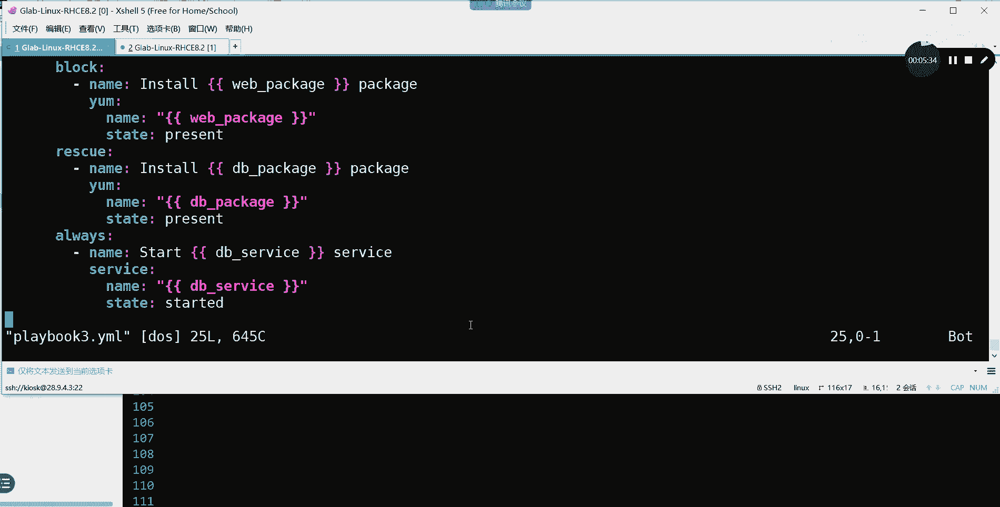

它的内容就比较多，然后呢我把这个play复制到，复制到这来看，可能会更清晰一些，第三个play啊，这是第三个play，大家看有什么区别，首先这个地方还是错的，对不对，然后再在下面。

你发现多了几个我们不认识的东西吧，you block rescue和always，这三个是平级的好，我简单解释一下啊，这个block如果执行失败，block如果执行失败，他就会执行rescue。

明白意思吗，如果block执行下面的任务，执行成功了，他就会忽略rescue，但是always不管你上面的block能不能执行成功，它都会执行always，这逻辑跟你说清楚了吗，对吧。

也就是block能执行成功，直接就执行block block如果执行失败，那就执行rescue，always听懂了吗，明白，所以不管怎样都会执行的，然后这个逻辑关系理清楚了，再来看一下这个。

告诉我这个play执行的结果是什么，这个本来执行的结果是他这里有三个任务，对不对，block一个任务，Rescue，一个任务和always一个任务吧，所以请告诉我执行第几个任务。

web package是不是有错误啊，所以block应该是执行失败，执行失败会执行rescue，对不对，所以这个play里面执行结果它会运行，第二个任务和第三个任务能听懂吗，第一个任务会失败。

因为他会执行第二个任务能听明白，OK好，那么如果我把这边改成D呢，我要改对，他会执行第几个任务，第一个和第三个任务，这个没有问题吧，这就是这三个三个关键参数之间的逻辑关系，所以如果我第一个任务是错误的。

那么他会执行第一个第二个任务和第三个任务，对不对，如果第一个任务是正确的，改回来，那他还会执行第一个任务和第三个任务，第二个任务就忽略了，我说清楚了吗，明白好，我们先来先来测执行第这个错误的。

先把它先把这个改掉。

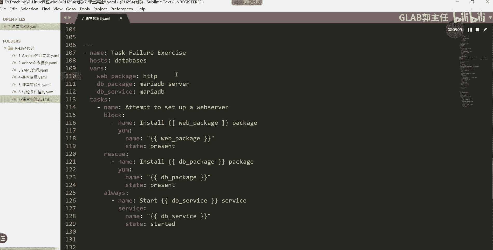

改成自错误的，我们来看一眼，嗯直接执行了，HTP错误，MDB这个已经在前面，其实装好了对吧，他其实已经跑过了，这边任务发现是已经装了，所以说他就没有再显示黄色，这个能听得懂吗，说明他是跑了这边的任务。

这个任务是被跑过的啊，然后呢第三个任务是肯定跑的，所以他执行的应该是第二个和第三个，第一个执行失败，好来看我们第4playbook4是改对的。

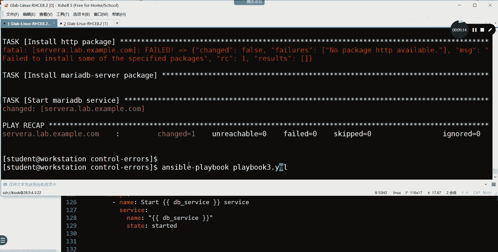

playbook4就是我这里的把它改改正确。

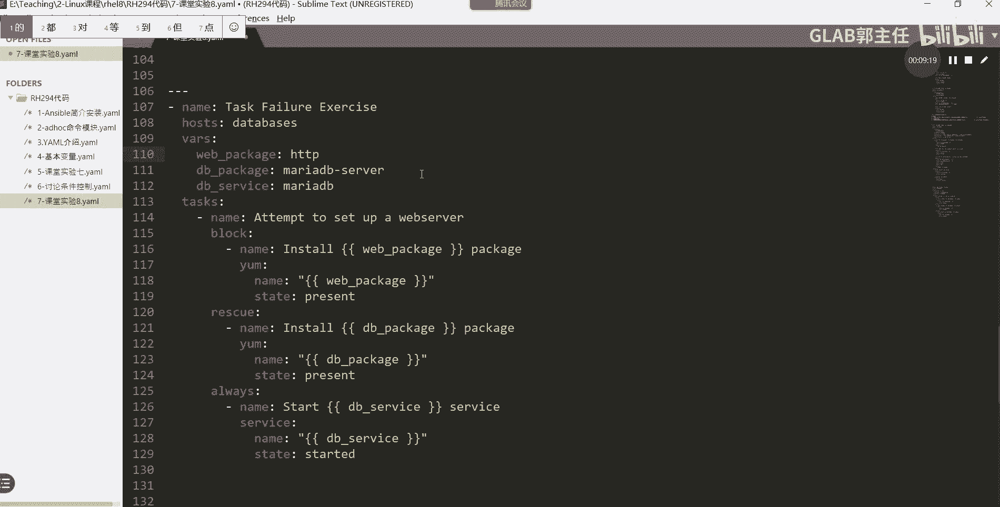

其他都不变好不好，我们来看一下吧，是不是这样的，vim playbook4啊，变量这边是不是改对了HTTPD啊，然后其他都没变，block没变，rescue没变没变，是不是一样的，改了一下pyx。

所以这个时候他应该会执行第一个和第三个，我们来看第一个，快来看看它的名字是不是第一个在执行啊，只不过已经安装好了吗，对不对好，第三个是不是开服务啊，他不是没有装。

没有去执行install mary dB的时候，那个package吧，它直接是执行的第一个和第三个，听懂了吗，嗯OK我们只要看它的结果就知道了，虽然都是绿色的，说明都已经装好了，OK没问题吧。

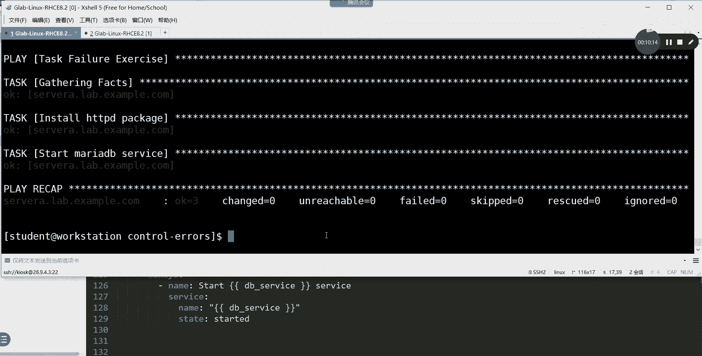

好好我们来看第五个，第五个play，第五个play也是贴出来让大家感受一下，也是比较长的，好这个是第五个play，大家帮我看看这第五个play有什么区别，加了一些东西，他就加了一些东西，加了很多东西。

就这么多吧，看仔细看啊，先看我们熟悉的名字，没问题，host没问题，变量还是这些变量名字啊，看一下变量名，对的吧，好这是正确的，然后加了一个command的一个模块，这个模块这个模块是这个模块。

用调用的是什么命令，data命令会显示时间吧对吧，然后通过注册变量，把这个显示的结果给给这个接住吧，注册变量把这个结果给给它，给它给它赋值，然后接下来通过debug命令把他的结果给输出吧。

所以其实看了这么多代码，这段代码其实就是在做简单的，就是做一个data，然后把data的结果打印出来，是这个意思吧，但是中间有一个叫这个，我们没见过，叫change v，看名字应该是什么意思啊，对吧。

先置位，这个是来修改，我来判断他是不是被改变的一个条件，这叫改变条件吧，也就是说当他确定后面的这个发生了，他就认为他是改变了，这个改变是说的是哪里的改变。

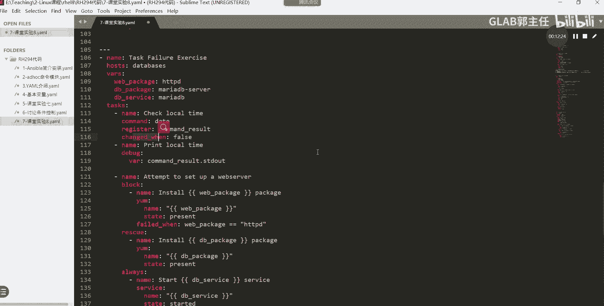

是说的我们在执行playbook的时候，他会认为你的这个结果是被改变了，是由这个脚本自己去决定的，我们也可以写这个条件，去去影响他改变的条件吧。

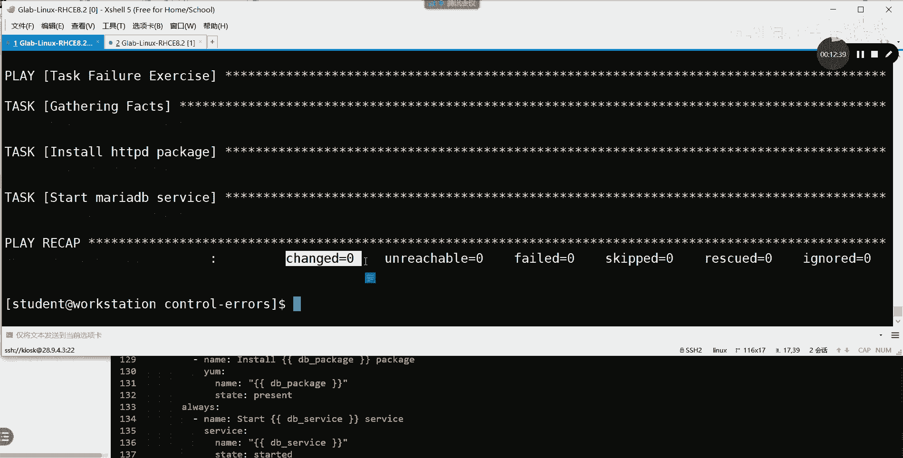

默认情况下，command这样的命令，他没有判断是否能够改变目标主机的能力，所以command命令不管怎么执行，它其实都是觉得他是改变的，那么你执行的时间改变了什么呢，是不是没改变，对不对。

所以这个只是用来演示的win啊，这个前期的win如果设置成false的话，那什么意思啊，就是不改变吧，所以这个时候看到的结果应该是间接的是零，他是绿色的对吧，如果没有这一句话的话。

那么我们说过了commander里面的命令，他没有判断的能力，他认为每次行一次他都是前进的，听懂了吗。

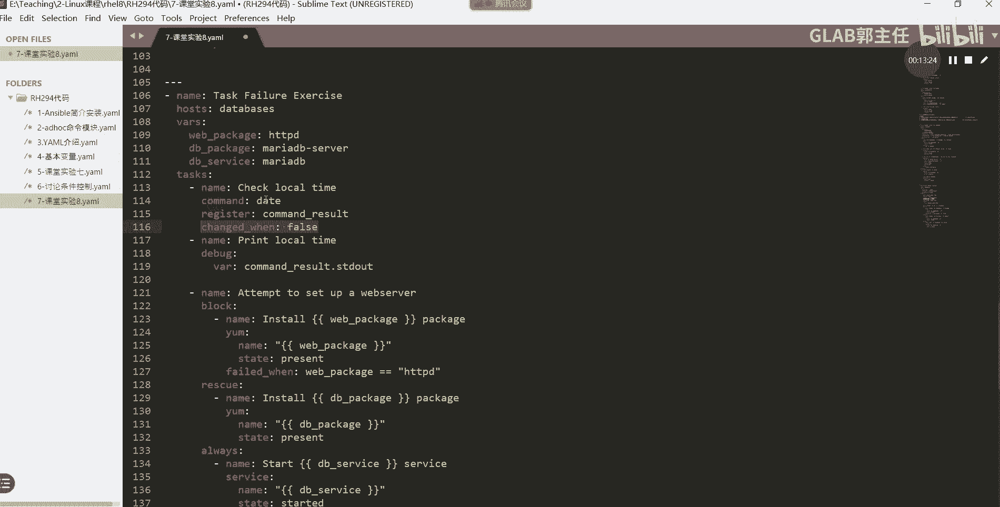

所以如果是用，我们可以，完全可以用那个id号来给大家演示一下，我们通过S8对吧，我们通过able server，我们自己搭的环境是通过SSHDEVOPS，这是我们自己的环境啊。

KSTATION用D6P啊，然后在这里有我们自己的sport脚本，对吧好，我们用asp the server a，这是一个组，我们可以通过gm可以不用打，因为是默认的，对不对，杠AD，是不是黄色的。

黄色代表是七级的，明白吗，那么如果你要杠MP，是绿色的吧，所以不管用AD hook还是playbook，所有的黄色体现的，就说明他认为对方主机是改变了他的改变条件，无法判断这个命令。

OK那绿色的就是没有改变的。

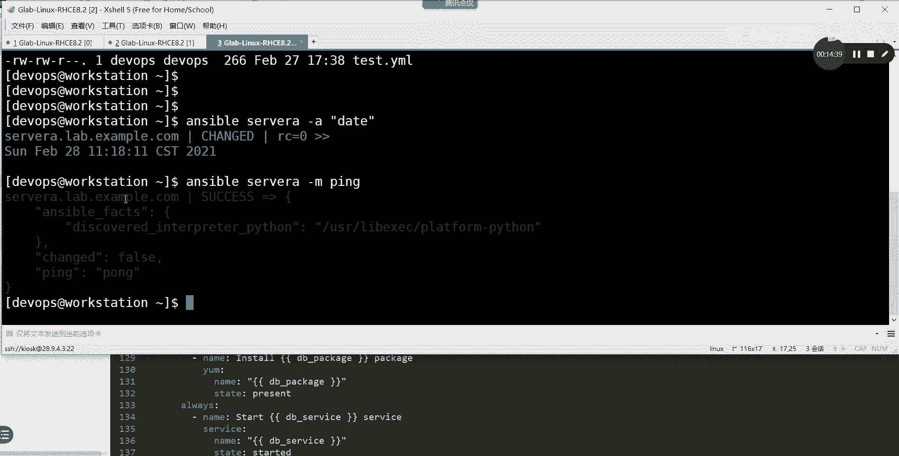

所以我就想给你演示一下，如果我现在把CHANG的win改成false的话去执行，那么他去用data输出的时候，他就不认为它是变化了，它是绿色，就是绿色的，听明白了吗，好继续，所以我用这个例子给你演示啊。

我们可以改变在执行脚本的时候，去判断是否改变的条件，来看就切记的问啊，好还有一个呢，再往下看这个debug打印出来的没问题，好，block去安装，没问题吧，这边又多了一个，这是什么。

是failed when，对不对，我们可以定义改变的条件，也可以定义失败的条件，这个意思就是当你去检测到啊，你的变量里面的web package等于HTTPT的时候，我就认为它是失败的，下面有没有变化。

没有吧，下面没有变化，所以第五个play主要是跟大家讨论的win和fire win，我们先来执行结果，然后再来总结结论。

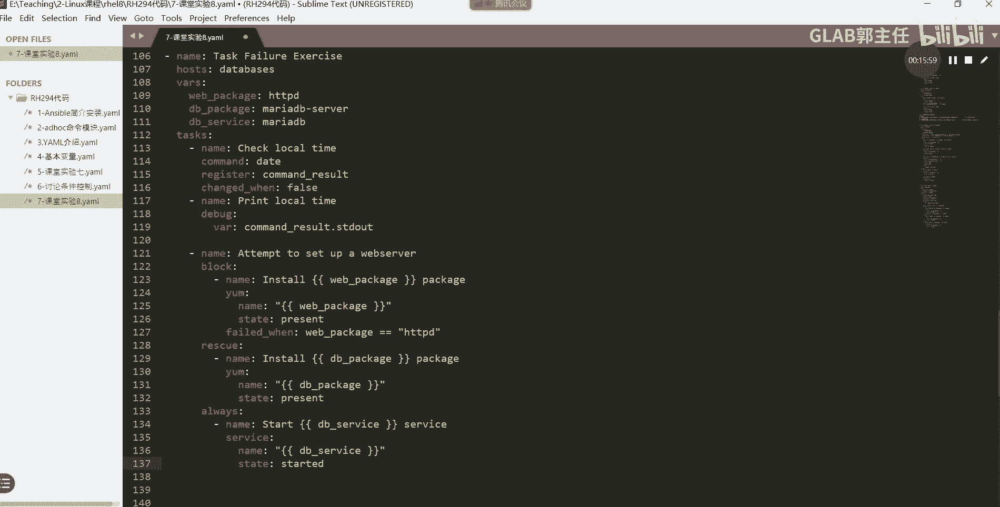

先把这个执行结果给大家看一眼啊，脚本语法应该没错，获取事实变量没问题，是不是变绿色了，时间啊，他帮你打印出来的时间已经显示出来了，如果不用的win force的话，这边显示应该是黄色的，对不对好。

然后呢。

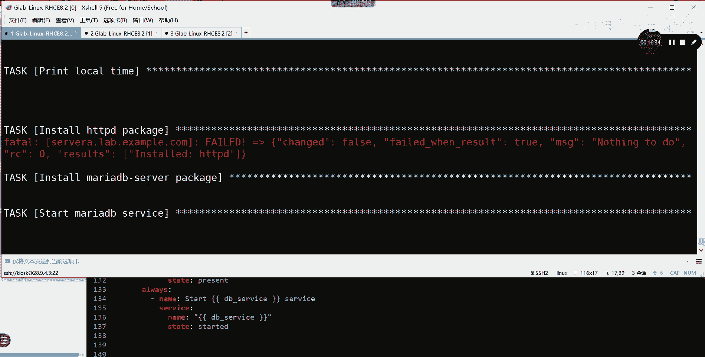

接下来我们用了failed when，如果不加fire win，把这句去掉的话，它下面是不是应该都是绿色的，没有任何报错吧，因为你的这个写法跟上面第四个play，写法是一模一样的。

如果没有fire的味道啊。

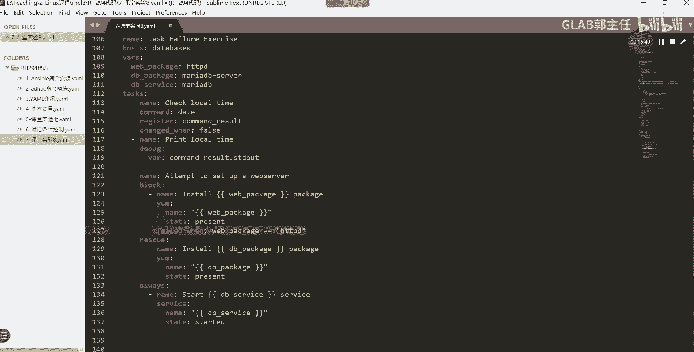

是不是应该都能正常跑完并且安装，但是你写了field win之后，是不是会判断哦，你符合我FIREWIND的结果，你的安装包的名字就是HTTPT，所以他就认为这个是failed，这个就是failed。

明白吗，但是你有没有发现这边fire是什么零。

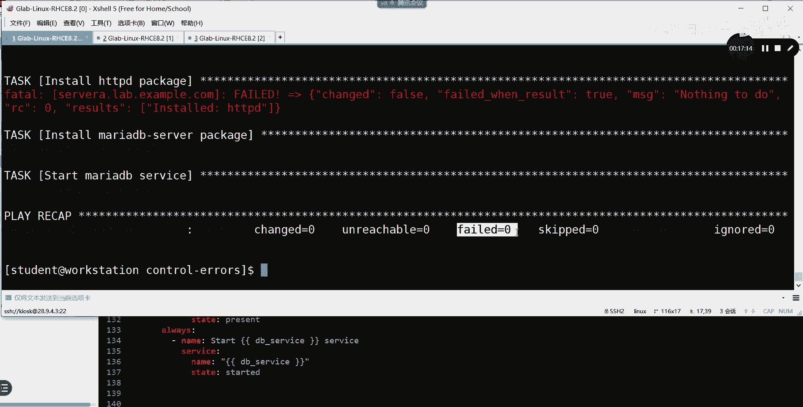

你不是field吗，为什么这里的field还是零呢，好结论来了，切记的win和field win，结论在这，大家看fid win他只是标记了失败，但实际上这个任务还是正常运行的吧，对你要装的HTTPD。

而且这个package的变量名就叫HTTD，而且真正实际上要装的软件名也叫HTTPD，听懂了吗，所以他是成功执行了HTTP的第一个安装，但是我在条件里写了bell way，它仅仅只是标记了你的条件。

判断失败的结果，但是没有影响我后台处理这个任务的过程，听懂我意思吗，OK他仅仅只是标记了，有人会问标记有什么用啊，它会影响你的这个标记，会可能会影响到后边的逻辑判断。

你可以用这个切field win标记出来的结果和输出，让register变量注册收集，收集到之后，我可以再进一步的用handle进行处理，对，就相当于给了你一个更灵活控制，整个流程的一个方法，听懂了吗。

OK所以大家一定要记住，failed win它仅仅只是一种标记行为，它没有影响真正实际的结果，OK吧，前进的win也可以一样理解啊，它仅仅只是标记。

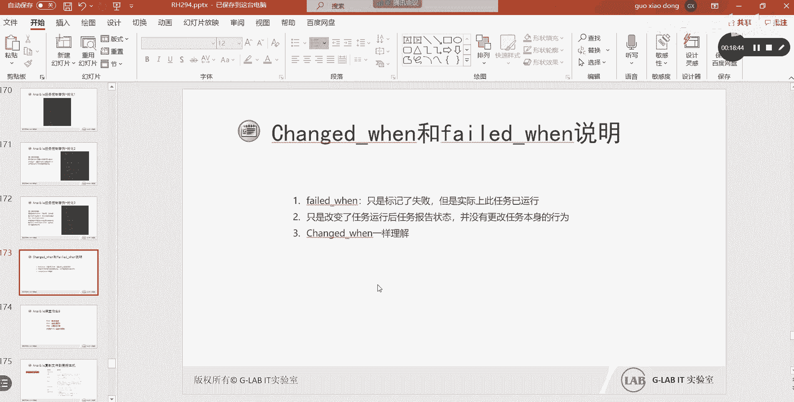

只是做一个标记，所以在这里你会发现没有fire的，没有file的对吧，没有file来，OK它是成功安装的。

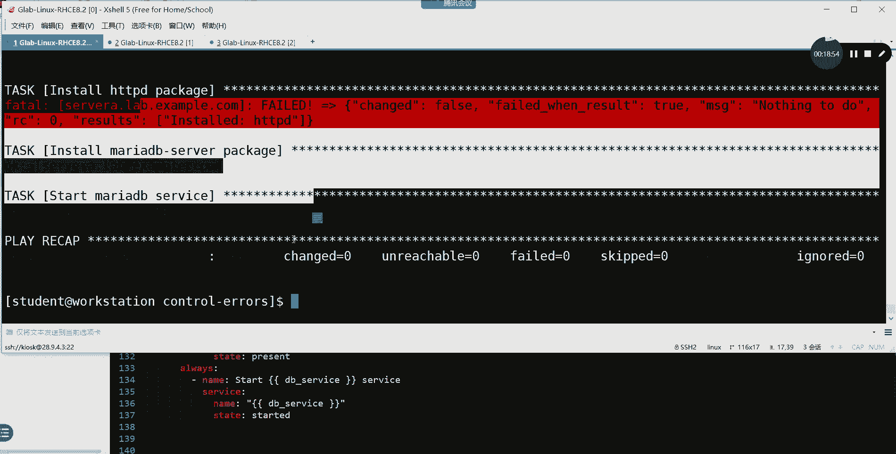

这个说明白了，说明白了以后来我们做一下最后的综合练习题，174页，这个是大家中午要做的练习，174页，我把需求贴给你们，你们先看会不会做，这个内容很复杂，他有六个需求，但是我觉得他的代码量也挺大的。

先看看会不会做，我们来一个过一下啊，我给你过一下，你接下来敲那个练习就会快一些，因为不用去理解它的题目的意思，直接看他的代码就可以往下写了，大概要实现什么，首先呢我们要去判断这个节点。

就是我们的受控节点是不是满足最低要求，就是我们硬件的最低要求，就会存在一个条件判断对吧，他最低的要求是内存一定要大于256，并且要运行红包的企业版，如果不满足的需要提示好，这个就用到我们新的模块。

这个模块叫file模块。

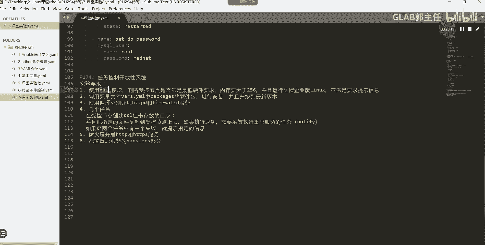

file模块没讲吗，FID模块没讲，没关系，我们可以通过esport dog去看一下FID，然后通过example去看一下它的用法，它的用法其实很简单，看到了吗，他就是去帮你判断这个条件是否满足。

如果不满足，给你提示一个信息，如果满足也给你提示一个什么信息，就这么个意思啊，就是条件信息，买条件判断信息，这是不是满足我们现在的需求啊。

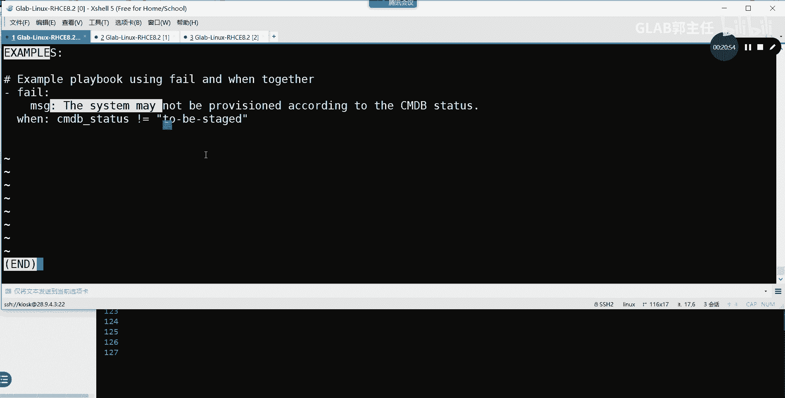

我们现在是不是让大家去判断，如果不满足硬件要求，它就提示啊，说错了不是更正一下，满足是不提示的，fire是主要是判断不满足，对不对，只要判断不满足，其实你只要去判断不满足就可以，也能做到满足嘛。

你做满足的对立面提示消息，不也可以来有消息弹出来嘛，对不对，所以这个时候我们要判断它的内存是否满足，256，这个就可以用它来实现第二个调用变量，这个文件默认是有的，这个变量默认是有的。

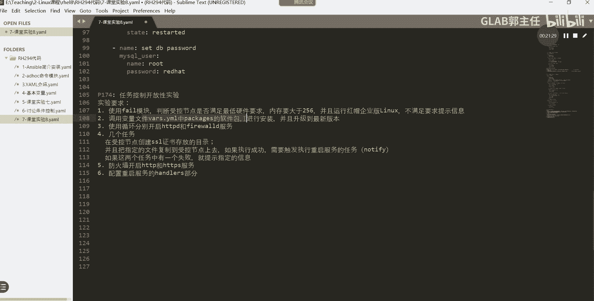

来我给大家看一眼，嗯应该在在这啊，这个时候应该用用用用student CD出来，我们lab control是control review吧对吧，应该是review s t RT最后的最后的这个是的。

应该是用review，就这个吧，Control review，OK那么这个里面做完以后，它会生成了review的一个目录CD到control review下面去看啊，变量一大堆东西啊。

它的变量也帮你做好了变量，变量变量在这有一个变量的yo，大家可以去看一下这个变量，他定义了很多东西啊，这个要会读啊，因为你这边不看一下，你根本不知道他会在写什么，他的名字你可能都不知道是什么意思。

到变量文件里面来找他，一会儿会调用它，其实就是在调用的这个package，看得懂吗啊，这边就是在这是一个变量文件，我们可以把变量写在文件里面，然后呢通过playbook调用文件里面的变量名。

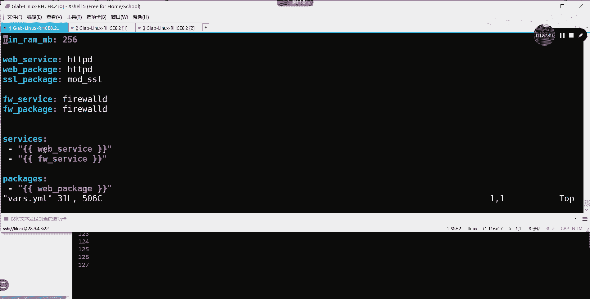

这也是可以的啊，好不好好来，我们继续看啊，就是变量的文件在这里，然后要安装这个里边的软件包，然后并且升级到最新版本啊，使用循环分别去开启服务，你看到开服务是可以是要用循环的安装软件包。

它没有说一定要用循环吧，直接调用就可以了，对不对好，然后呢有几个任务在受控节点上创建SSL证书，然后放到指定的目录，这个用什么模块啊，创建这个证书的存放的目录，创建目录用什么有用file模块对吧。

然后呢并且把指定的文件复制到控制节点，用什么copy模块，只要文件复制过去就要重启服务，要用notify handle对吧，然后呢，如果这两个任务当中有一个失败，就提示指指定的信息，如果有一个任务失败。

就要提供信息，这里要用到条件判断，还得用到register，还得用到when，对不对，这些都要用到啊，然后最后开启防火墙配置HTTP handle的部分，所以这里头应该是。

我们涉及到我们前面讲的所有内容，来，我把代码贴你，大家再把代码过一遍，嗯现在啊你不要想着，不要指望着自己看着看着需求，就能把playbook写出来，你的想法有点天真，对不对，现在是你一定要做的事情。

就是把playbook看懂，然后自己最好能够脱稿把它打出来对吧，到后面你再看到需求啊，比如说工作当中有什么需求要实现，需求提出来了，你脑子里代码就出来了对吧，那是最好的，现在没有，你肯定达不到。

那我们看那个playbook control这个名字，不管host啊，指定是什么，就是什么好，要调用变量文件名，我写了一个直接定义变量是verse，如果要调用变量名叫vs files，这个没问题吧。

区别在这啊，然后呢第一个任务要干嘛，是不是要判断最低标准啊，对不对，最低标准是哎这边有一个大于号，这个大于号就是问下面要写多行，如果没有这个大于号，这个不是说什么条件上的判断啊，这不是判断。

这个代表的是下面我的条件，要以多行的形式显示，听明白了，OK好来看第一，第一块应该很容易懂的，就是当你的硬件不满足最小的，这边都没有写数字，这肯定是在变量里面能听懂吗，这是在变量里面。

当你的这个是什么nb m e m total MB，这是什么变量，事实变量，对不对，这是这也是事实变量，所以很明显啊，第一个条件就是当你的条件，这个内存小于256，并且发行版不是red hat。

它就会提示不满足最低要求，听懂了吗，这个太简单了，第二个当去确定它的这个包有没有安装，用样本模块调用F变量file里面的package，直接调用package。

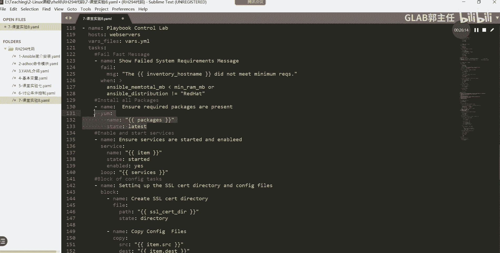

没有用循环吗，对吧，这个package里面怎么写的，刚才有看是不是这些啊，在哪来着，在这在这啊，package调用，这也是变量，这个变量在web package是调用了它上面定义变量。

然后写了下面这个组理解吧。

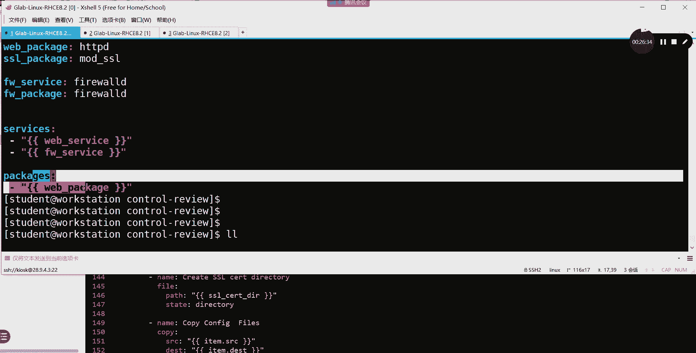

OK没有用循环啊，装拍给直接就可以了，然后接下来服务服务有没有循环用了吗，service items是不是用了循环，这些都是变量，自己到变量文件里面去找对应关系，请把它对应起来好吧。

写一遍你就有印象了好第三个要创建，要创建目录，是不是用file模块，file模块，state写directory，那就是创新，那就是目录了，然后把文件弄过去，copy模块吧，把文件copy过去。

这里也用到了循环，这个循环怎么理解。

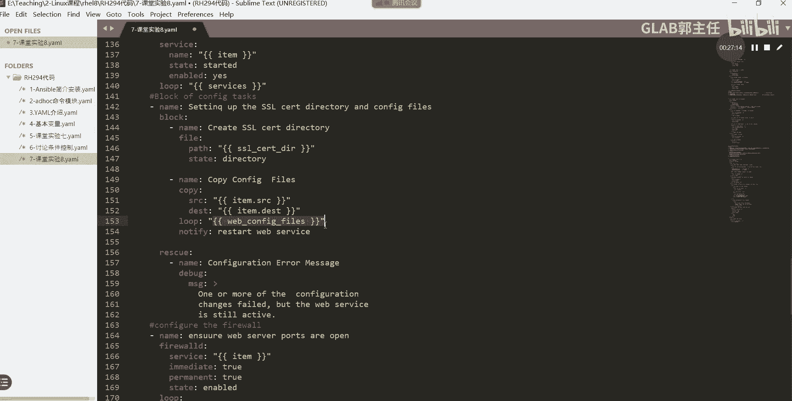

还是看这个，在这啊，那他有一堆文件要拷拷过去，所以我在这个变量文件里定义了原目标，原目标原目标是不是都定义好啊。

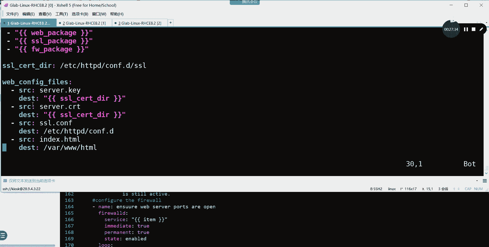

定义好了以后，我在前端调用用循环来一个一个调用，也就是copy，如果不用循环，这里要写四个copy，不用循环，用一个copy，用调用循环调用变量就可以了啊，我到web config files去找。

是不是这个web fire files好。

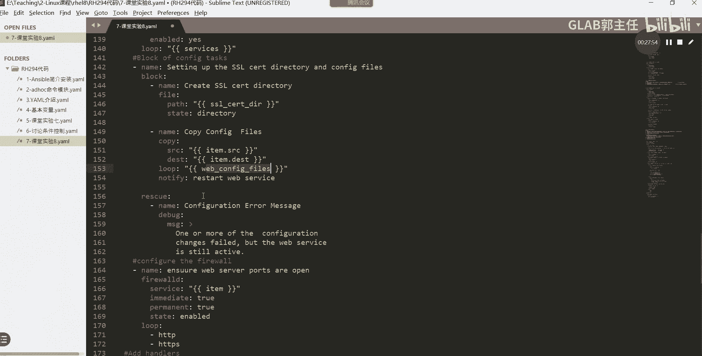

我的圆是不是items的SRC，items的SRC，是不是他他一个一个去找他下面的SRC作为圆。

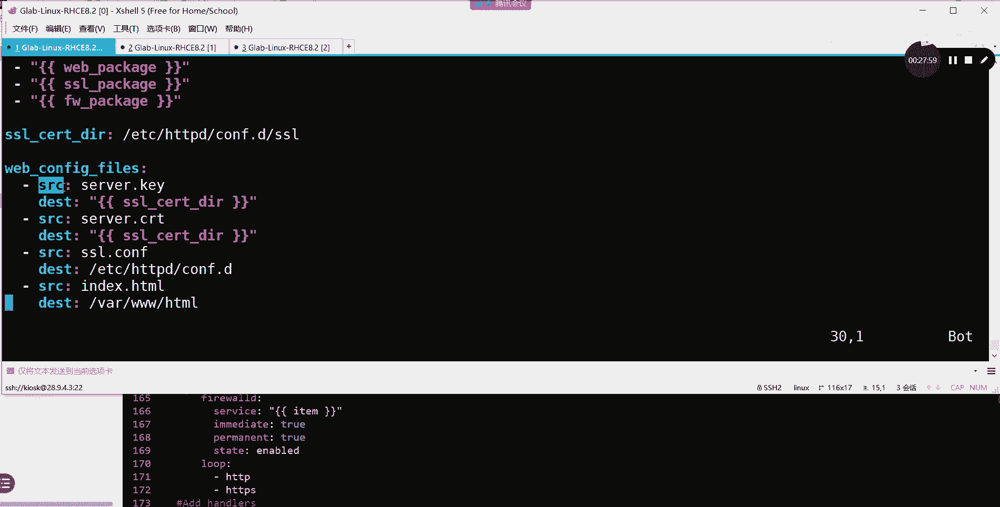

复制到目标目标是items d e t s d s t。

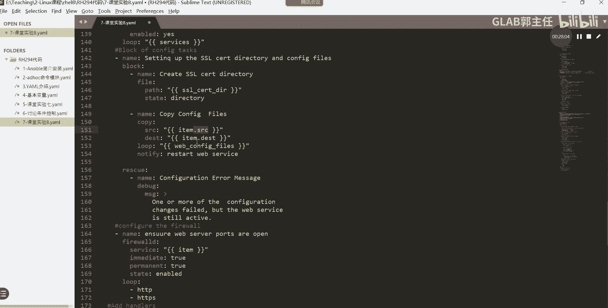

是不是它下面的DT啊，这是循环明白吗，当你的变量下面的这个这个内容，它有很多个的时候，你的items后面就要跟对应的SRC或者。

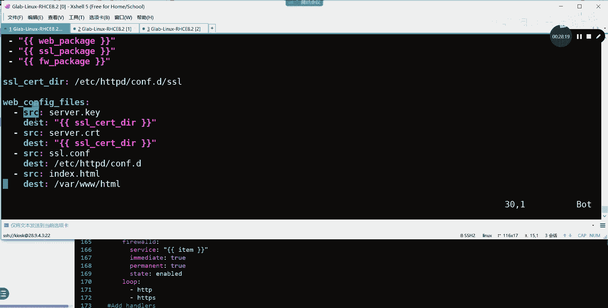

DST的，明白我意思吗，如果只有一个，大家看到的就只有一个items吧，你下面可以有多个items啊，听明白这样区分的这样区分的好文件，只要被改立刻触发，Notify。

notify会触发下面的handle，handle是什么，重启服务，这个没问题吧，OK所以这个是关联的啊，这个是关联的，大家要一起看啊，好接下来这个是放在block里面。

这个一旦执行就不去执行rescue吧，好如果上面的某一个重要的功能，如果有一个功能没有执行，它就会触发rescue，rescue会给大家提示说，你上面的有一个或者多个的配置文件有问题。

是不是在判断配置文件，如果有问题的话，立刻弹出信息啊，嗯明白吗，配置文件有问题，立刻弹出信息，所以我们可以用block rescue来替代，我们前面所做的说那个用那个when的一些场景吧，啊是吧。

他执行不了，那就就就就就让他弹出log，可以用block rescue这种方式考试就会考，这个考试会让你创建硬盘，如果硬盘的空间不够，然后让你弹出硬盘不够的提示，所以我们用的就是block加risk。

如果可以全在主要任务都写在block里面，只要里边有一个任务失败，它就会弹出硬盘空间不足，听懂我意思吗，就用它来做，所以不一定要存在，但是也可以写，写了的话就是上面两个不管哪个执行。

always都会执行，听明白了吗，好那么这个这个这个最后一个是写什么，这个是开启开启服务呗，这个叫放行防火墙端口，用的是FIREWORD版，有没有问题啊，没问题啊，好不好。

所以把这个过程大家自己理一下啊。

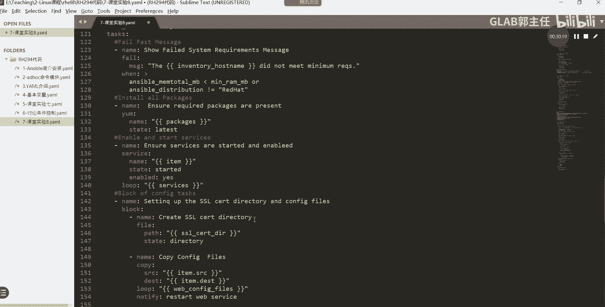

大家自己理一下啊，我的配置导上去了，来我们看一下怎么去做啊，配置应该在这里，在这里，我已经刚才已经打上去了，呃，我把它复制到control review，我们去跑一遍，好在这应该就看到了，看到了是吧。

然后把它切过来，这个名字叫，playbook点押宝好，我把这个改一下，里边有一堆东西，我来看一下啊，这个是还比较多，前面到281呀，看看281dd好，都删掉了，然后后面的也有一大堆东西，好了，好。

然后我们来测一下playbook，叫playbook s y n t a s c h e c k，我希望我把这个时间敲代码，节省下来的时间留给你们，你们今天把我刚才跟你讲的几个都敲一遍，再走好吧。

够肯定够，我给你们腾时间的啊，其实真的内容的难度没有多少，FID检测是不是跳过了，说明满足要求的满足要求，如果不满足要求，在file的这个环节就down掉了，就不会再往下执行了。

明白吗啊fire就断掉了，所以这个下面他给你去创建啊，那是不是四个四块文件copy过去了，用循环来实现的好，这个就搞定了，对不对，搞定来我们测一下，我们这个题最终的需求是搭建了一个HTTP服务。

对吧我们可以通过CIL去测一下嗯，杠K杠三个VHTTPS，我们搭建的是一个HTTPS啊，嗯server b点lab点example com，就这个，然后能够看到嗯。

看到看到一个在这start that excel就行了，主要看这个，就是你你你要最后最后的教材上也有啊，最后会让你用这个命令去测一下杠V4，显示详细信息，K的话是忽略这个HDPS的这个这个证书。

明白意思吧，所以这个要去显示啊，这个时候就看到有这么样一个输出，就说明是OK的，明白意思吧，OK好这就是这一题，Lab，我给它关掉啊，Review，啊最后都是pass就OK了，好吧好。

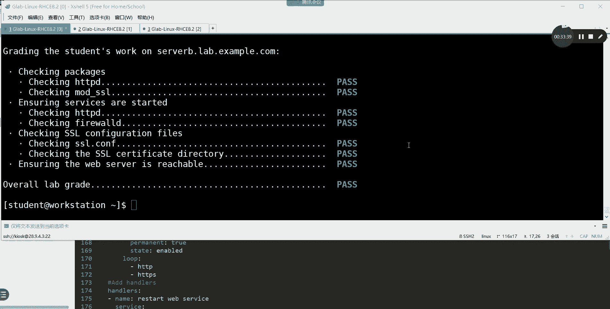

那么这个就是我们上午讲的一个，非常核心的东西，叫条件的一些处理和条件的判断，最后我们来总结一下，我把总结写在上面，作为大家的笔记啊，跟我一起回忆其真正的内容真的不多很少好吧，那总结一下。

首先我们是通过一个实际的例子，给大家引出，他流程控制当中可能会遇到一些问题，所以告诉大家循环是其实挺重要的对吧，在写脚本的时候一定要用到循环，如果没有循环，你的脚本就太烂了。

所以我们刚开始写到的就是循环，循环啊，循环的配置这个非常重要，其实也很简单，你可以定义在有有两种方式啊，循环它一定要结合什么变量吧，一定要结合变量，一般的循环都要结合变量。

那就涉及到变量一般会在哪里定义呢，一般可以定义在三个地方是吧，三个地方定义变量，还可以把变量写在变量文件里面吗，可以把变量写在变量文件里面，然后在play里面调用，这个都是前面讲的内容，听懂了吗。

因为循环不可能单独使用，一般都会用变量好，这第一个第一个第二个内容我们说到了条件，条件判断，我们叫win win，它包含有很多逻辑关系，and or啊，and or啊，对不对。

这些都是条件里面所判断的东西，那么条件大家发现没有，一般条件里用的最多的是什么变量，事实变量吧，对不对，条件里面，一般比如说我们要去判断这个机器的内存，一定要不能低于256。

我们是不是用的s sport下杠memory tord b，是不是，一般条件里头会跟一般和事实电量用的比较多，用的比较多，大家要会直接用事实变量，所以又用到变量条件里头，跟变量也有关系，听明白吗。

各位好，然后呢在这个条件里头又引出了，我们最后给大家讲到的HANG，EG的下横杠还是什么下横杠是吧，一个叫change的win，一个叫field win，这两个他们只是用来判断，或者说他们只是用来呃。

来更改费尔或者限制提示的条件而已，它并没有影响最终实现的playbook的脚本吗，OK所以这两个要注意我放在条件里面，一个叫change的，问，一个叫field way，大家一定要注意，我们是可以改的。

明白吗，好然后呢，接下来第三个内容说到了什么，收到了三个比较重要的block b o c k block和阿瑞斯，cu瑞瑞斯怎么写来着啊，啊RESCUERESCUE好，还有一个是always。

这三个这三个的逻辑关系大家应该知道吧，啊这个啊这个block rescue和always。

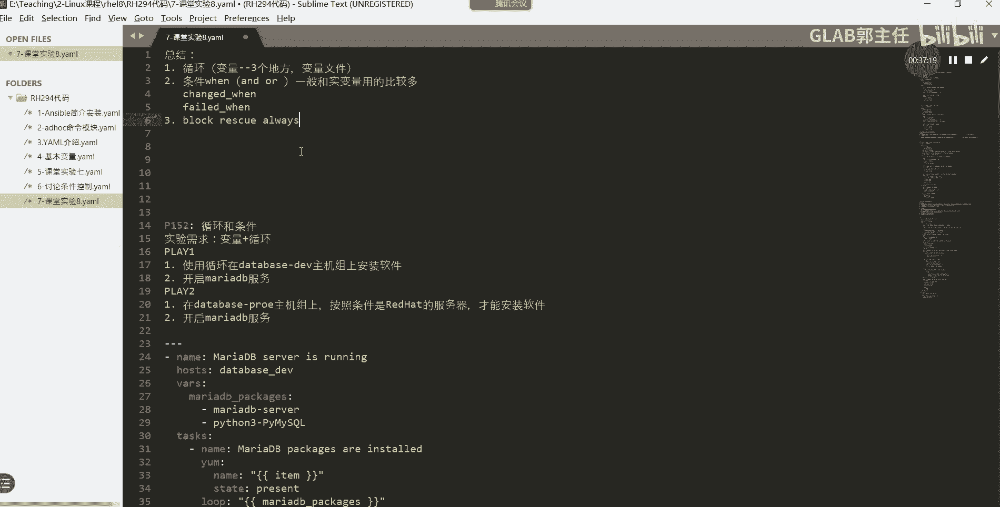

还有吗。

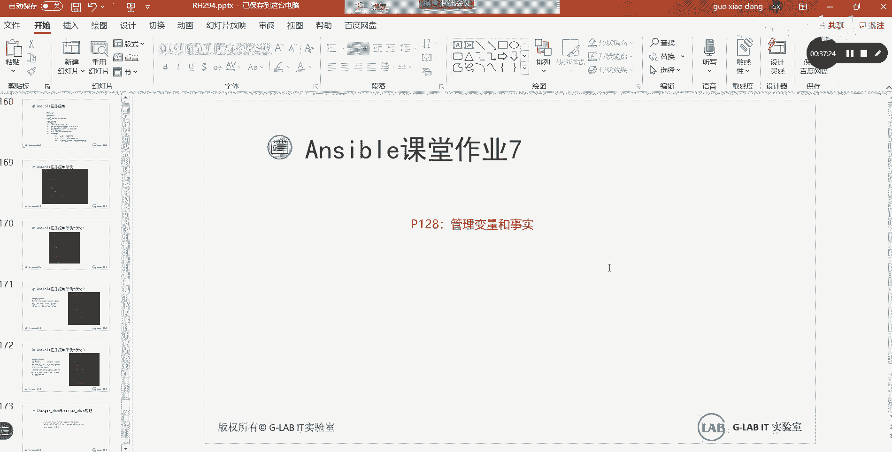

还有还有一个什么对，还有一个是fy t fy notify加handle，Handles，这个是notify内容执行，触发它就会触发handle的内容，立刻执行吧对吧。

也就是说只要有notify立刻会触发handle，明白吗，能听明白意思吧，OK好像不像block和always像像吗，笑笑吗，有区别吗，当然有区别对，肯定有区别啊，对感觉上像是像的。

但是block rescue，always要比notify handle要他要多处理一个，就是如果notify处理失败的时候，他是不处理handle的，但是block来实现的话，block处理失败。

他还会处理rescue，然后还会处理啊，区别看到了吗，嗯嗯有区别的，还是有区别的，好不好，然后呢第五个还有一个是什么帽子，叫叫ignore ignore error吗，还记得吗，一个nor error。

这个是忽略忽略这个任务的错误对吧，忽略任务的错误啊，因为在脚本里头只要出现失败，就是这个是真的失败啊，就是安装不成功的，真正失败的时候，他就会卡在这个任务这边，下边的任务都执行不了。

所以我们可以通过equal error忽略掉，有可能执行失败的任务，让他继续往下跑对吧，这个叫ignore error，这叫ignore error，好，没问题啊，好，没问题啊，没问题。

OK其实还有一个给大家补充一下，还有一个在教材里头有，但是在我刚刚实验的可能没有涉及到叫force，Forth handle，猜一下是什么意思，For handle，强制执行handle。

我们的handle一般跟notify去匹配是吧，也就是只要执行notify成功的会触发notify，那么触发了notify就会立刻去执行handle吧，那么也会出现我刚才讲的，上面执行不成功。

是不是不会触发notify，handle是不是也不会执行是吧，所以如果用false handle的话，上面就算执行失败，也会触发执行handle，理解吗，所以这个叫任务失败后。

强制实行处理handle的任务，强制执行处理，看到这个这个作为一个补充啊，啊虽然没有提到，但是但是也有可能会用到它，就这些吧，我们我们今天上午讲的就这些东西吧，其实变量其实很重要。

你会发现条件跟循环都会用到变量对吧，下边只是在处理流程当中，会用到的一些大的大的框架啊，这个做做了不成功怎么办，这个做成功了怎么办，对不对，处理它，处理它再处理它，这是一个流程上的控制。

我们做脚本关心的就是这些东西，处理流程该怎么处理，运维就关心这些东西啊，好吧好，那么这个就是总结完之后，我们这个条件处理这一块的内容啊，就这么多吧，好不好，然后呢。

我们这个接下来大家把170就是几个作业，152，157和一百七十四三个作业。

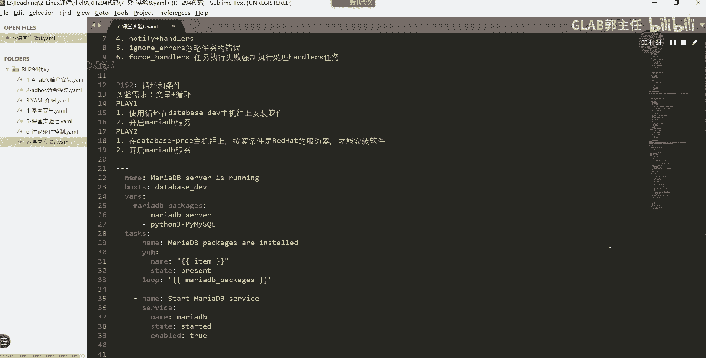