# 【Linux／RHCE／RHCSA】零基础入门Linux／红帽认证！Linux运维工程师的升职加薪宝典！RHCSA+RHCE／45-Ansible大项目管理 - P1 - GLAB郭主任 - BV1bw411H7ak

好下面第二个内容。

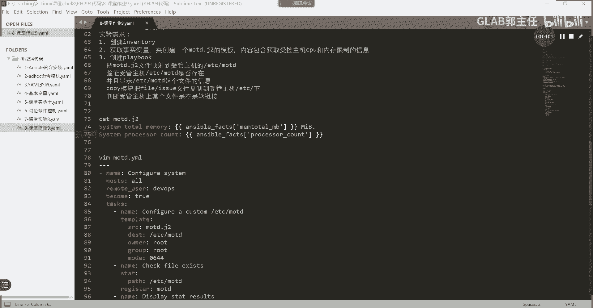

你看先看PPT啊，到哪了，到这了，叫管理大项目，好洋气啊对吧，接下来我们如果在处理大项目的时候，我们能对我的脚本能做哪些优化呢，这一块的内容我跟大家先提个醒，就是跟我们写学Python的时候。

Python是不是可以你们在写大项目，用Python应用开发写项目的时候，常规的做法是怎么做的呢，是把所有的内容都写在一个Python的文件里面吗，我们不写了，是不写Python，知道Python吗。

不知道听说过了解，我们一般是不会把所有的功能实现，都放在一个组的Python的文件里面去实现的，它分分块的明白吗，比如说你写前端，你写的web，你写你写这个一个部门的，你写一套软件啊，你写嗯。

跟财务相关的这个模块，我写跟这个开班信息相关的模块，我在写跟那个课后的这个反馈调查相关的模块，也就是他把一个软件分成，拆分成很多功能的模块，然后把这些模块再分给不同的人去写，写好了以后。

我把这些模块把它全部组装在一起，就形成了我们一个大项目的软件，听懂这意思吗，都是这么干的，那playbook也是的，我们会发现普雷布它也可以做成这种模块化的，跟不同，根据不同的功能做成模块化的。

然后一个人负责一个模块，然后把模块都写好了以后，我来把它组装起来，来，实现我们整个大架构的运维的管理，套路是一样的，思路也是一样的，明白吗，所以这个这个其实就是，把前面的东西做的更更优化一些。

我们来看它是如何实现模块化的，我们来举个例子，256页，这个实验是要大家做的。

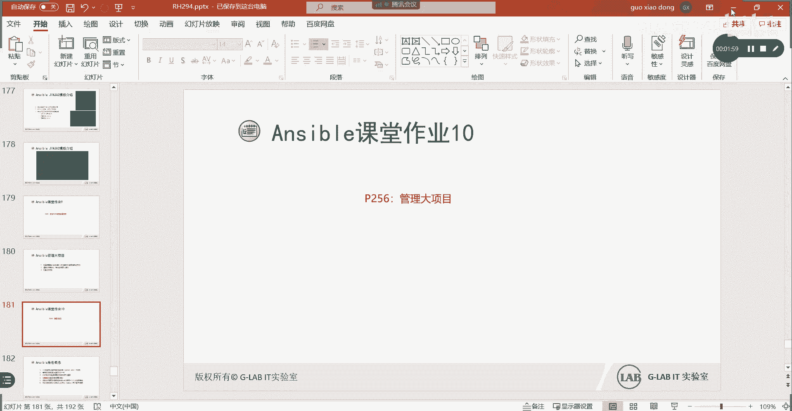

九这个应该是课堂实验，十就实现大项目来吧，我们来看啊，管理大项目的思路，对吧，叫模块化，我们一定要模块化，然后呢就是有些代码写一次就可以了，不要重复写，然后不停的去调用这一个模块。

这样的话我们能够精简代码量吗，模块的话，然后呢进程的并发，我们要考虑进程的并发，就是我们会发现他在处理playbook的时候，一定是一个任务，一个任务去处理的对吧。

我们可以在playbook里面配置一些参数，让它一次性去处理多个playbook的任务，这个叫什么并行对吧，我们可以配置它的并发，就是并行在程序里面，这个叫多进程，多进程，多线程，多携程对吧。

这个就比较复杂了，多进程进程线程和携程，但是在安波里面我们只考虑它的并发，只考虑它的平方，也就是一次性能帮我处理多少个任务，这都是可以调的，默认是一个好吧，所以这个大项目的思路，一个模块化。

一个要进程的并发，或者叫任务的并发，更容易理解啊，任务的并发，任务的并发对于我们来讲，我们考虑的就是任务一起执行，但是在底层操作系统方面，还是以多进程的方式来做。

好吧好那么接下来我们来看一下我们这个需求，需求我就没有列，大家我先把这个这个需求我就没有列，为什么没有列，因为它是让你去改，他很多东西都写好了。

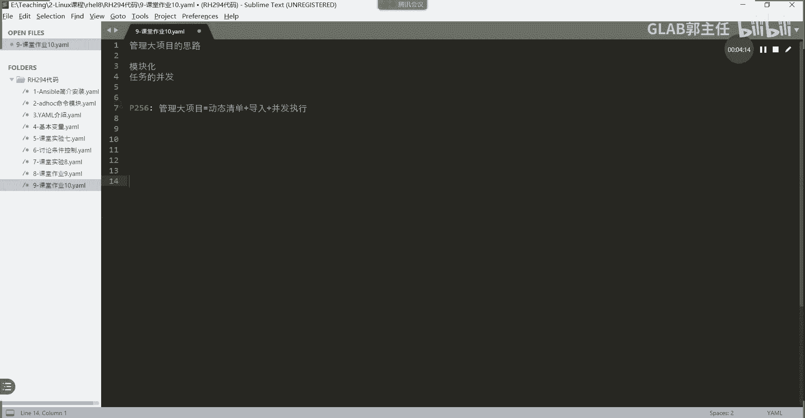

来吧，我们来仔细看一下啊，有点卡住了，student at w wk s t a t I/O n workstation好，然后呢，在这里诶，刚才那个那个有没有有没有结束掉啊，view是吧。

这个叫fire review，Lab，Fire review，要接finish，把前面的要要先结束掉清掉，然后我们来开个新的叫lab project，叫project reviews吧。

看一下有了一个CD project review，我们看里边东西看啊，And sport，大家可以自己去看一下sport cfg啊，没有任何问题，主要来看一下它的playbook。

它的playbook都帮我们写好了，那都写好了，就是让你把这一个playbook来进行优化，做成模块化，看它怎么用好不好，我们先来做第一个，首先他这里头用到的就是我们的动态清单。

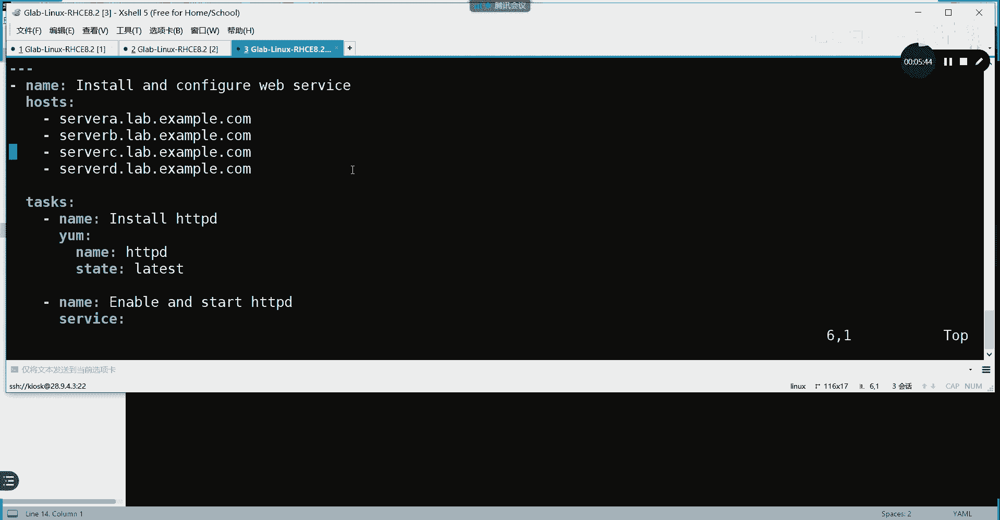

这里要再加一个大项目，一般不会用静态清单，我们一般用的是动态清单，动态清单就是它的清单不是像静态一样写死了，它是用也是用类似于金家兔的模板一样，用代码的方式，也就在每次在要调用清单的时候。

它会用代码自动去跑一遍，跑一遍，现在主机有哪些，那它就是它现在的list，过一段时间再跑一遍，有可能主机列表发生了变化，他动态清单是实时更新的，你明白吗。

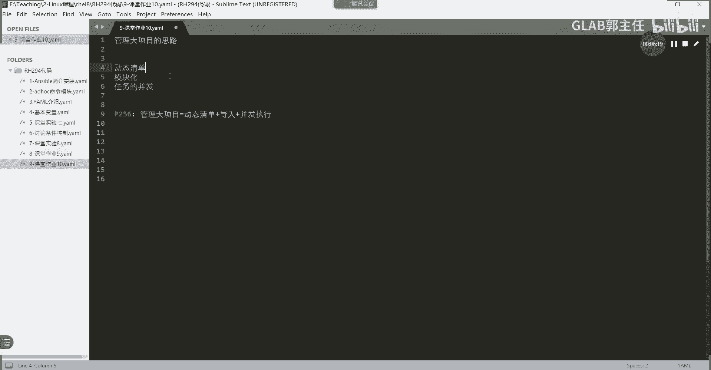

实时更新的，OK那么它的动态的清单是怎么实现的呢，你看啊，嗯首先在这里他动态清单放在了eventually，它是一个目录啊，是一个inventory，点py Python的文件能听懂吗。

我们看一下这个Python文件，大家有兴趣自己去看，这个也不是很难，他就是用Python的两个system和JASON的模块，还有一个嗯这个这个pi的模块在这边去写出来。

然后帮你去动态的生成我们需要的主机清单，好这个不重要，也不是，毕竟不是拍摄的课对吧，他已经帮你写好了，写好了之后呢，我们需要给这个文件有一些执行权限，给Python加一些执行权限，所以CHMOD755。

我们把EVA下面的啊，这个inventory下面的inventor点Python加一个执行权限，那么有了执行权限之后，我们再inventory上面的eventually。

点Python加一个杠杠l s st叫杠杠list，这时候他就把你列出来，我当前的主机，这就是动态生成了一个主机清单，看到了吗，Python文件写好了，给他执行权限，直接执行了以后就会列出来当前的清单。

听懂了，这个阶段不是一成不变的，有可能变取决于它检测出来有没有server还存在，如果不存在，那就没有明白吗，好现在环境当中应该都有啊，所以这个时候我们还可以通过这个这个呃。

我们可以通过asp来检测一下，之前学的server s e r v e r server星号后边不管是吧，点lab点example，杠杠l s t h s t host。

所以这个方式列出来动态清单里面被SB识别，并且认识到的主机有哪些，听清楚了吗，是不是这样，这个执行的结果是当前Python的动态文件，动态程序检测出来的主机数量，这个结果是通过ASSB识别到的。

动态清单里面的主机数量，听懂了吗，不是一个东西啊对吧，一个是文件执行的结果，一个是ANSPORT识别的结果，明白不OK，所以我们可以通过动态清单啊，拉出来一堆东西，那么我们在这里就可以对它进行修改了。

看这个地方他写了四台主机，我们应该把它改成动态清单，是不是好改成动态，现在这个动态阶段应该怎么写啊，Host，server信号点那边点是不是可以加嗯，动态静态都是以server打头的。

后边不知道是啥对吧，他是啥，你这边用星号替掉就行了，它检测出来什么我这里都能匹配，这个能听明白，所以这就是第一个优化，用动态清单的结果来替换原有的静态的list，保存好了，这是第一个需求。

第二个需求我们来看啊，这个代码我觉得我应该把它复制出来，Cat playbook，我们可以简单的优化一下。

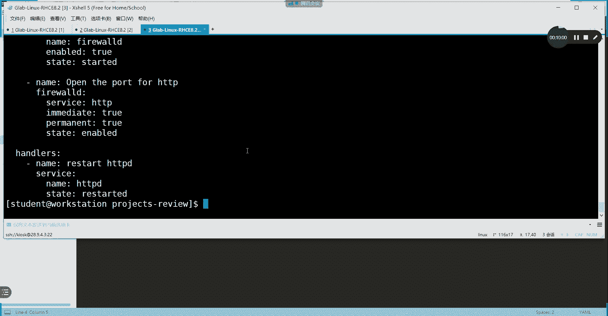

我把它复制出来。

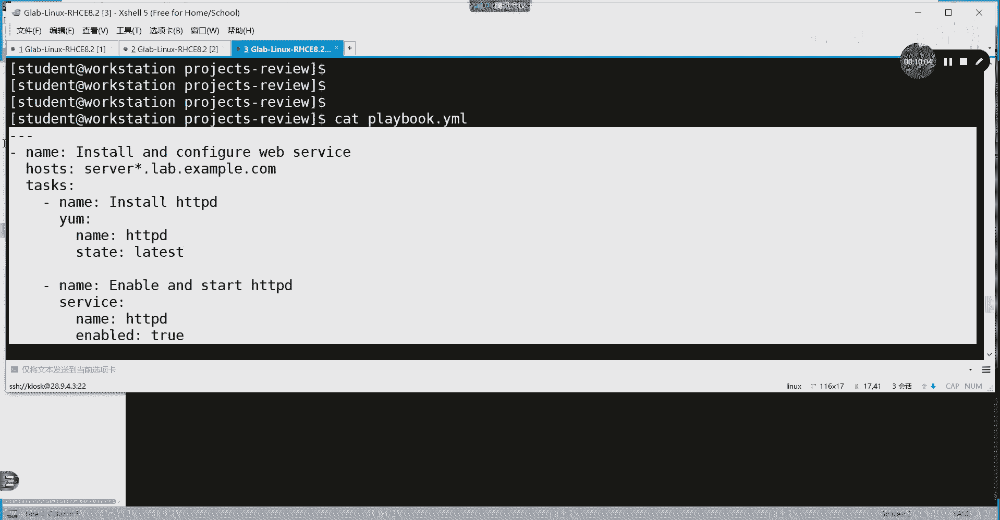

这个他是他帮你写好的啊，这个地方是我优化的，已经OK了是吧，大家来看我们的这个代码，看能怎么优化看啊，呃样本模块安装了HTTPD没问题，然后呢开启了HTTPD没问题，然后copy一个文件。

copy这个文件送到这个etc下的HTTPT里面，这个是复制文件过去，并且要触发一个notify，让他去restart httt，没问题吧，好然后呢又用亚膜安装了一个FIREWORD这个东西。

FIREWORD这个这个软件，然后服务又开启了FIREWOR，然后forever里面又放行相应的端口，Handle，就是重启HTTPDD对吧，这个我们可以怎么写呢，我们是不是可以把专门做一个模块。

这个模块就是用来安装的安装软件的，是不是可以啊，我们可以专门做一个install package，我们可以专门做一个install package，在安装package的同时。

然后去enable这个service，能听明白吗，所以我们可以做一个install package，然后单独的一个文件作为一个单独的YM文件，OK好，那么应该怎么做呢，我们把所有的功能都模块化了。

看一下这个代码，Yo install package service，开启这个service，用变量的方式，我们把所有的东西，把那个安装的软件包放在package变量里面，然后开启这个服务的时候。

也是放在这个，这个是服务吧，然后放在这儿没问题吧，好那这个是用来做专门这个模块以后，不管是安装HTTP还是安装这个模块，我只要调用这个模块不就可以了吗，因为这个模块的功能就是用来安装服务。

安装软件和开启服务用的，各位听明白了明白啊，然后呢我们现在把这个模块可以通过一个，一个属性就在这啊，看上面的这个，我们给它起一个名字叫叫in store and enab。

这这就是这个这个这个这个功能的名字叫install in，然后他做好了以后呢，我们在新的这个文件里面，这个文件叫，这是这是web tasks，好在这里呢，我们看啊，导入刚才的那个功能。

然后把我要写的package软件都写在这，package写在service，看这一段和上面的这一段结合在一起，看是不是HTTPD安装的同时也被激活了，Service，仔细看是不是。

如果我现在要让你再去安装mary dB，你是不是也写过这一段，把package这边改成MDB，service改成MDB上面的这一段是不是不用写啊，直接把上面的这一段。

通过这里有一个重要的属性叫import tasks，看得清楚吗，就是把上面的功能通过import方式导入进来，然后呢，变量里面写你要安装的软件包和你要开启的service，是名字，听明白了吗。

OK这样写的好处有没有发现啊，是什么，关于install enable这个功能，我不需要在每一个软件安装的时候都要去写，他把这个功能单独写出来了，后面要用的话，我只要通过import导入进来就可以了。

听明白了吗，嗯清楚了吧，好下面那个呢下面这个没有任何变化，还是还是去还是去copy copy，然后restart好，这个没问题吧，各位没有啊，好再来继续，然后forever是不是也是可以做这样的方式啊。

现在我要让你去安装FIREVER，看一下firework，firework这个名字叫firework task yo，是不是一个道理啊，我只要导入install in yo。

然后把下面的package和service变量改成FIREWORD，安装，同时开启了服务吧，听得懂吗，所以这样的话就分成了一个最基本的模块，最基本的模块和，然后呢分成了按。

再按这个web功能和防火墙功能，分成了两个主功能模块，一个是做web相关的功能模块，一个是做FIREVER相关的功能模块，是不是都单独独立出来了，都都独立出来了，那就简单了，最后看啊。

最后我们最终的那个组的，最终的那个组的我就可以这样写了，主的名字叫playbook yo，看清楚，这叫playbook啊，名字啊，不管host对谁啊，刚优化过了，对不对，这就是我所说的并发SIRI。

就是同时执行两个playbook的任务，默认是一个，这里不光写二，你可以写，你可以写五可以写六，这样可以去观察，一会去观察，执行一个它是一个一个的跳，执行两个是两个一起跳，听懂了吗。

好然后下面呢下面tasks就简单了呀，第一个跟web相关的，我直接import刚才web的这个脚本，第二个跟FIREVER相关的，我直接import firework相关的。

然后handle还是handle放在最下面，没有任何问题，听清楚了，所以组的啊，由原先的最前面一大串写在一个文件里面，现在我给它拆分成了四个文件，一个install enable来看啊。

一个专门做安装和体服务的这个功能模块，第二个是web相关的功能模块，第三个是firework相关的沟通模块好，第四个就是我的组的文件，主文件，把前面的东西都组装起来，这就是主文件看得懂吗。

所以这样做的好处特别明显，逻辑架构更清晰，这是他第一个特点，第二个如果你要增加web功能模块的内容，你是不是只要把这个web的这一块的东西，丢给其他人，让他去改不就好了吗，改好了之后。

他能影响firework吗，不会影响的，对不对，因为FIREVER模块是单独独立的，不会影响，所以第二个好处就是，任何功能的扩展都不会影响其他的功能模块，听明白吗啊第三个模块第三个好处更明显。

就是它的代码量会减少很多，就随着你的开发项目越来越大，你的代码量明显的看到有减少，因为如果不做这个第一个功能模块化的，这个细区分的话，你每安装一个软件，每起一个服务是不是都要写。

都要写一串YM装进去service再开起来，对不对，那接下来你就直接调用这个功能，基础的功能性模块就可以了呀，明白我意思吗，所以为什么叫大项目，建议大家这样搞，小项目看不出它的优势啊。

OK就这么一个概念，听明白了好，那我们按照需求来改，我们按照我们的需求来改，就是按照这种方式来猜呀。

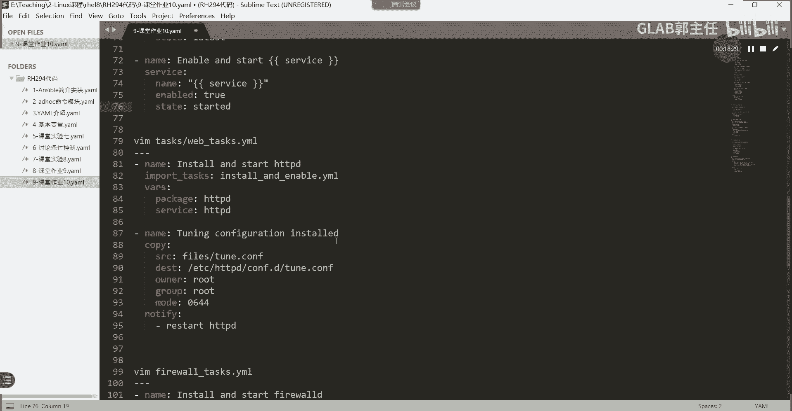

来吧，我们把这个文件拆下来，就是playbook，我们是不是要拆成四个是吧，我们要拆成四个。

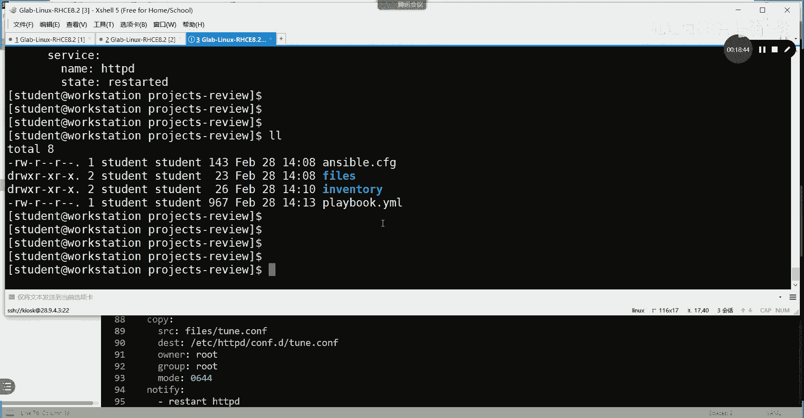

算了再导进去哇，这个导进去啊。

我写了好几个嗯，把它导进去确定。

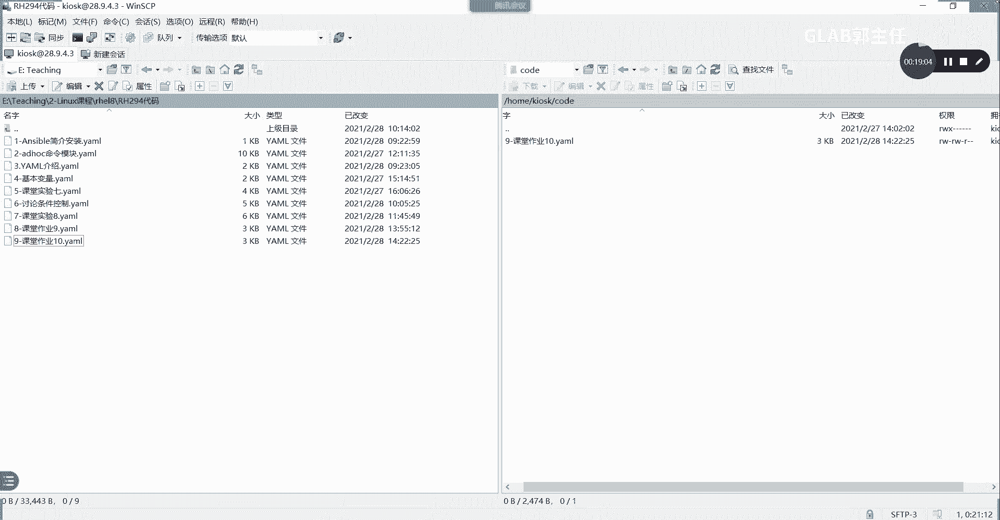

哎出来进来了是吧，然后呢是九，应该是九，然后应该是project吧，看看能不能补全的project review好，然后这个是什么，这是不是他过来了是吧，过来的话。

那么我们把原来的playbook覆盖掉了，9playbook原来的就给它覆盖掉了，然后我们来看一下，把这个playbook简单的处理一下，它有一大堆的内容，前面有一大堆的内容。

我们是不需要我们来看一下到第几行。

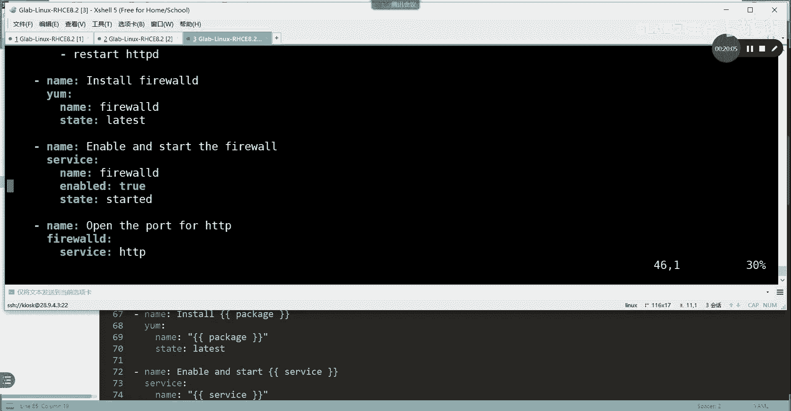

到第几行，我是不需要的，这个到第64行我是不需要的是吧。

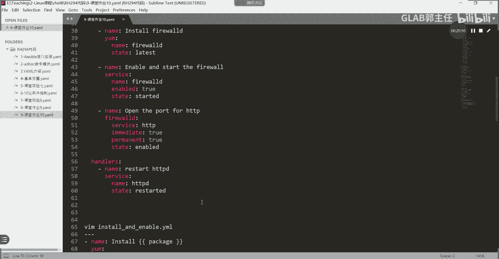

嗯好这个是install install234，OK好，我把这几个文件都复制一下，Cp playbook，第一个是什么。

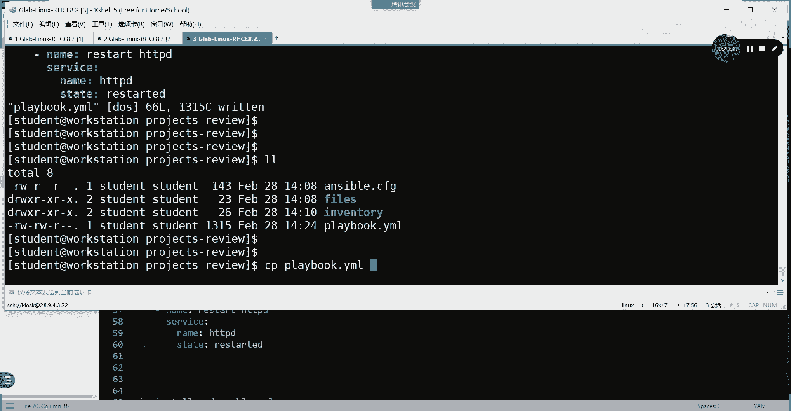

第一个叫它的文件名叫什么，就这个，第一个是这个吧。

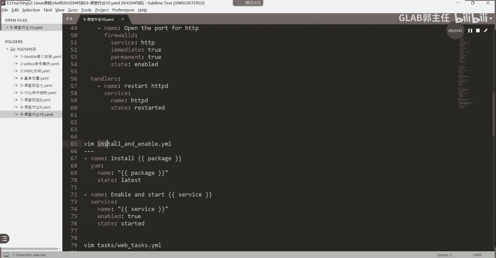

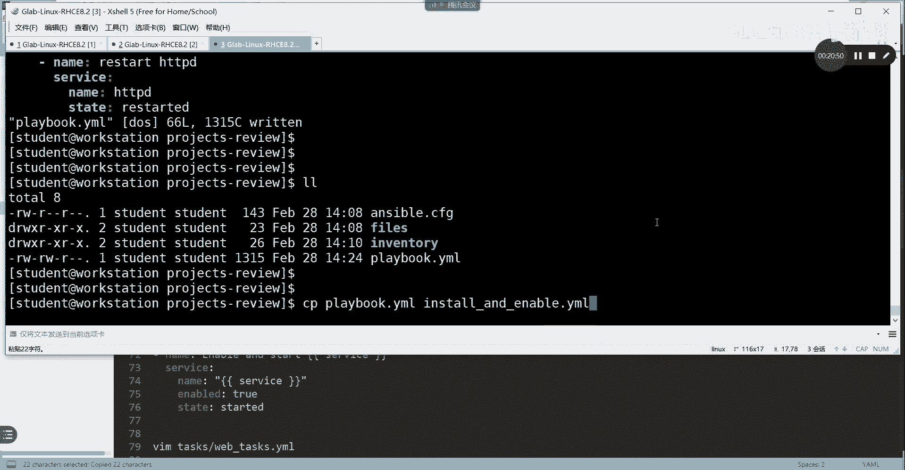

好这是第一个，第二个呢。

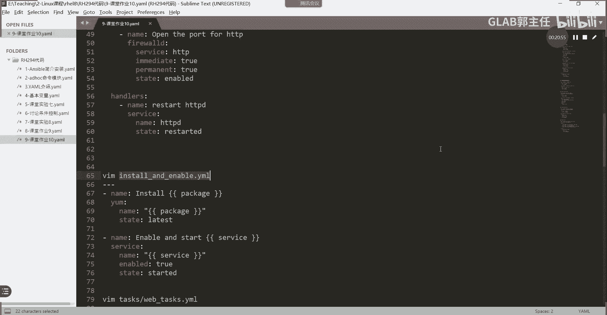

第二个文件名还要建一个tasks，就是你把所有的功能啊都放到tasks里面对吧，嗯tasks mk dr t sk tsks吗。

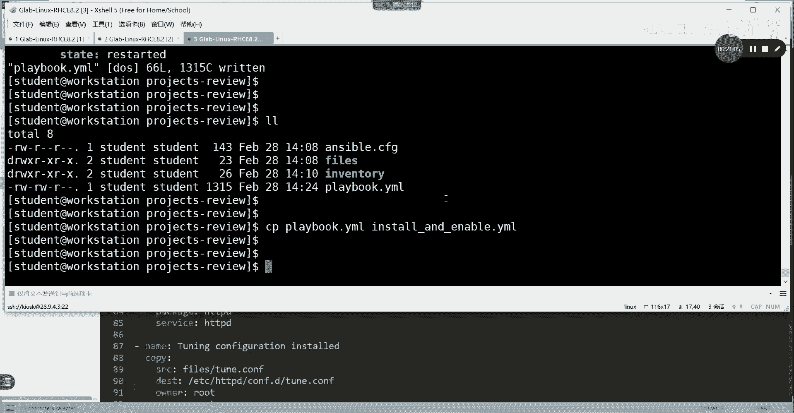

好建一个这个，然后呢我们把cp playbook送到tasks下面。

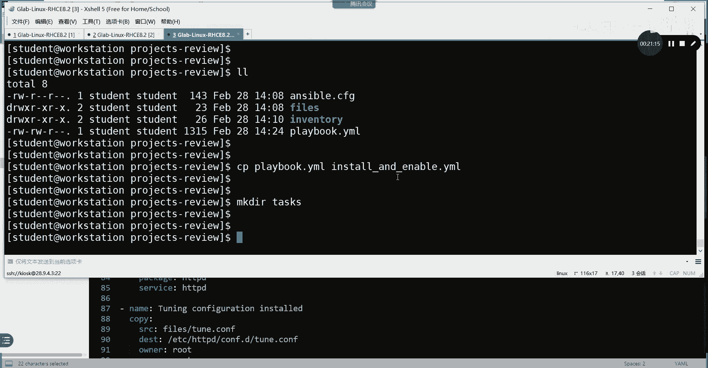

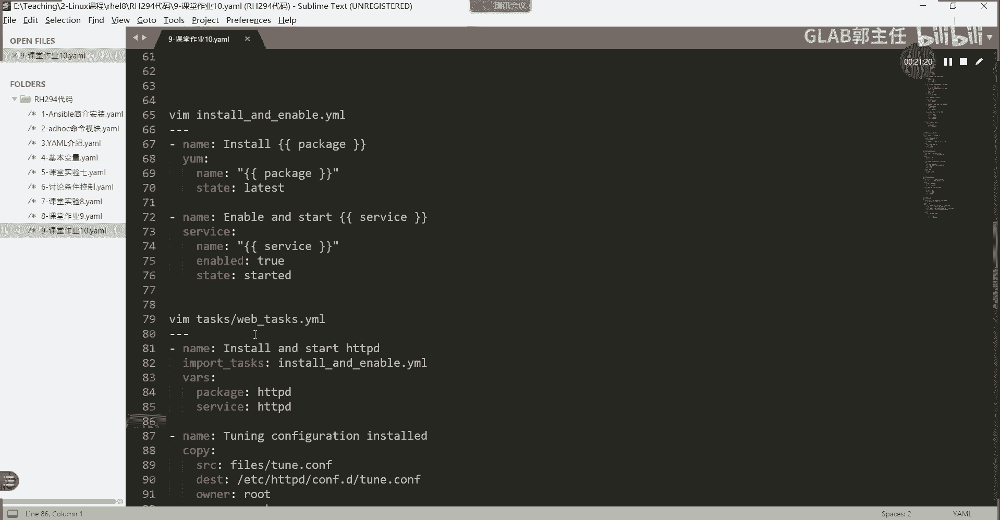

有一个web相关功能的模块。

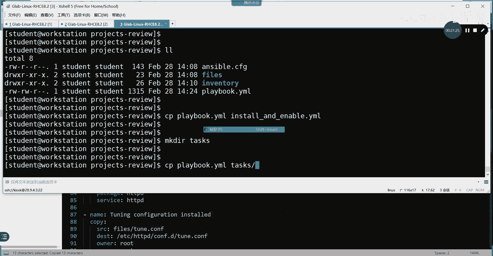

好再来一个tasks，下面有一个fire相关的是吧。

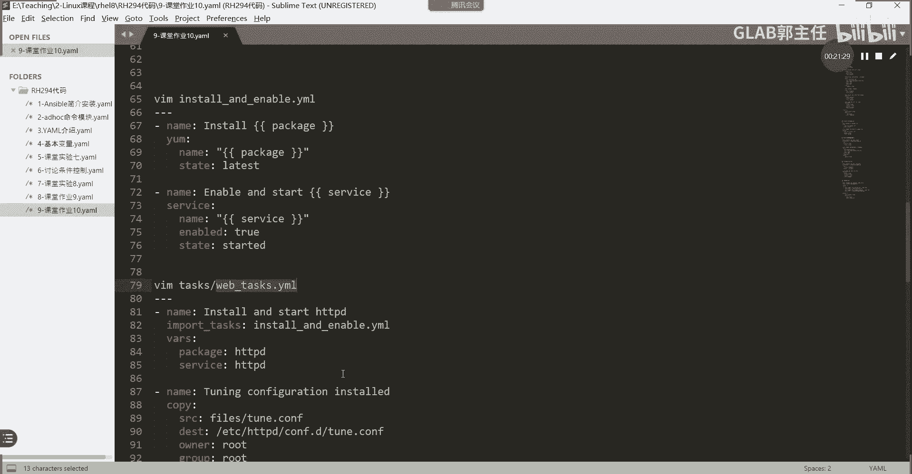

好了好看啊，两个功能性的模块放在task里面，然后一个install这个最基础的安装软件包的模块，放在最外面，然后playbook就是用来做主文件的，好不好，我们一个来修改啊。

先看install v m install这个enable文件，这个删掉应该就在前面的这些吧，好就这么说吧，这个应该没有问题，好这就是install，第二个是web相关的，把它删掉就是web吧。

好web相关的好就这么多吧，好，第三个是firework相关的，firework相关的，哎这个是这个是什么web相关的是吧，好然后呢firework相关的没了，OK好。

最后一个是调用就主的play就playbook对吧，哎这个这是最后了，最后的话让我看看是，firework快到了，就这个地方，好了这好了，就这么多，这个最后啊，然后包括这个并发。

我们用的是两个大区别一下，我刚才前面所有的playbook都是默认是一，大家看到的是一条一条再跳啊，现在改成二，大家可以看一下它的区别在哪里，好了这些都OK了，OK了之后我们来跑一下，再来跑一下啊。

嗯先确认一下esport playbook play，没有问题来吧，事实变量是要先预先要获取的，是不是两个一跳啊，对不对，那这每一个任务里面都是两个一跳，看清楚啊，这个就是并发导致的。

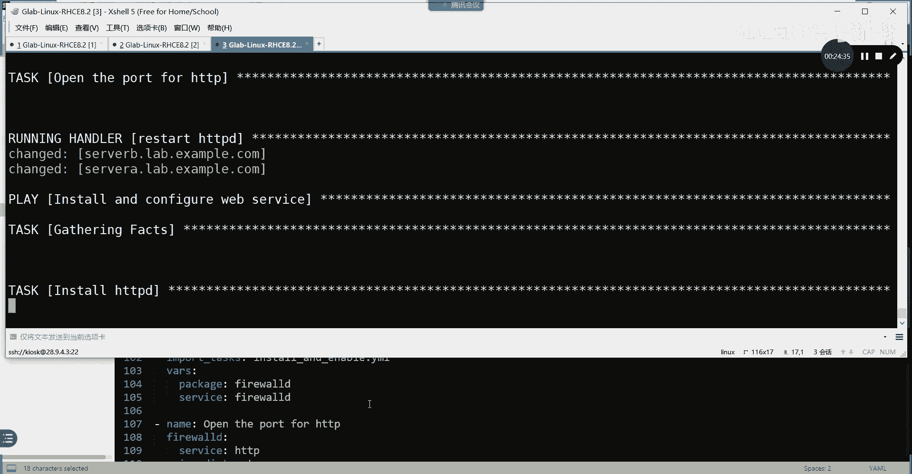

所以呢大家一定要把这整个的这个，这个这个路子先搞清楚啊，我们其实可以把很多的功能可以单独开来，跟写代码是一样的，是一样的好吧。

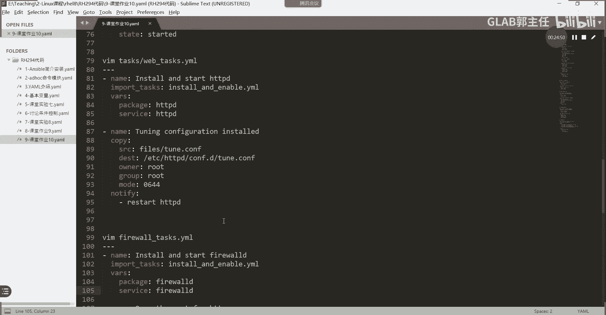

这是一种开发的思维，就这样搞更方便一些吧。

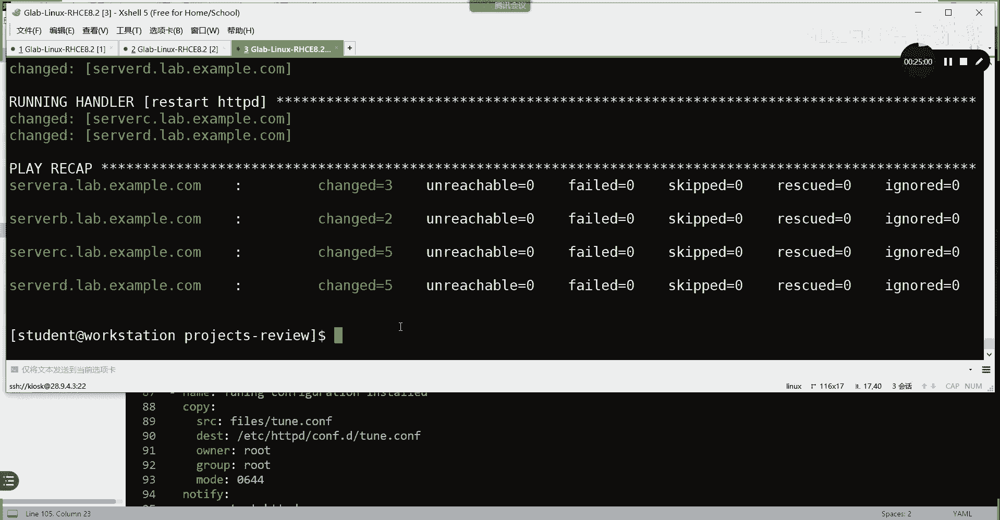

好现在都OK了吧，全部OK了，就按照我们的要求实现了我们的需求，其实这个代码这个这个呃实验，他把所有的代码都给到你了，需要你单独的把它拆开，然后做成几个，然后往里倒，所以在这里其实就讲了两个新加的命令。

一个是并发，还有一个是，就这俩太简单了，没毛没什么好讲的，明白吗，你知道它是干嘛用的就行了，Input，就是把你写好的功能模块，直接导入进来就可以了，各位能听明白我意思吗，可以啊，好不好。

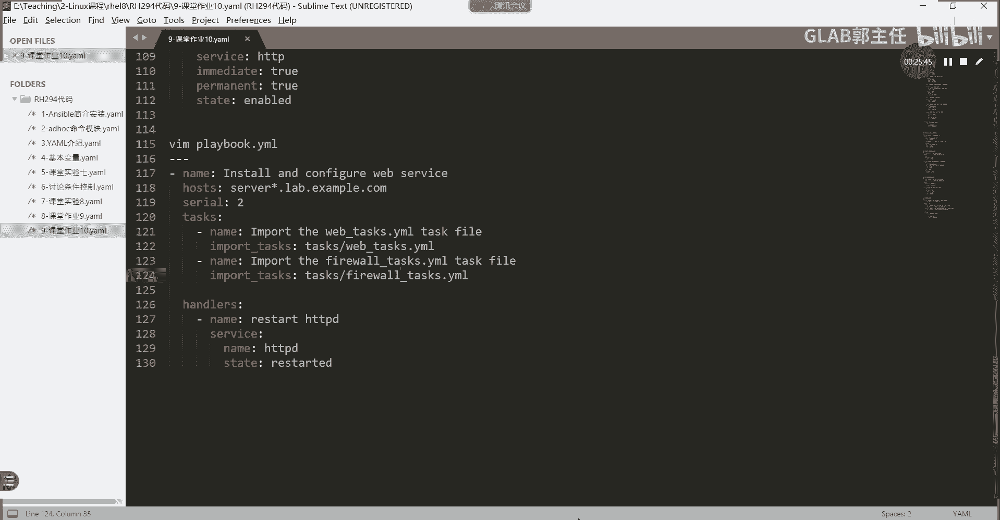