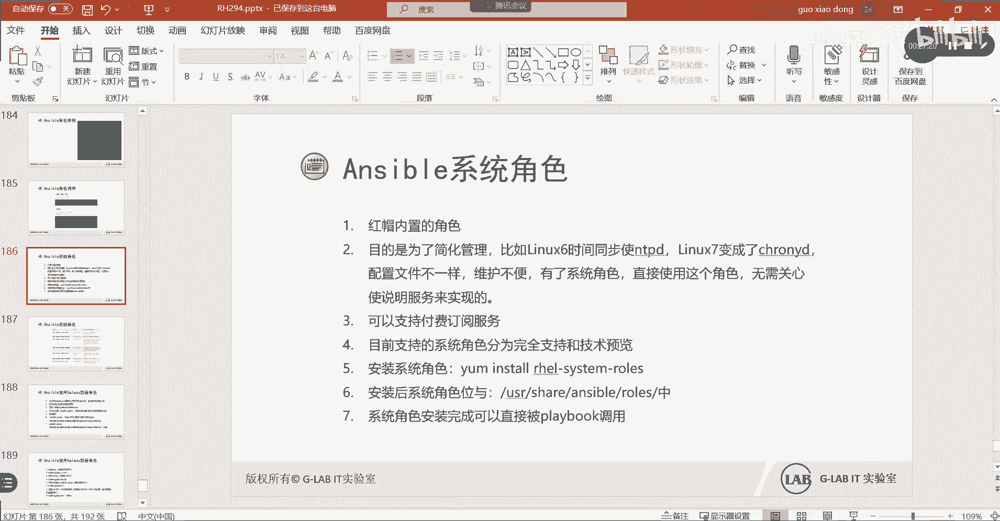
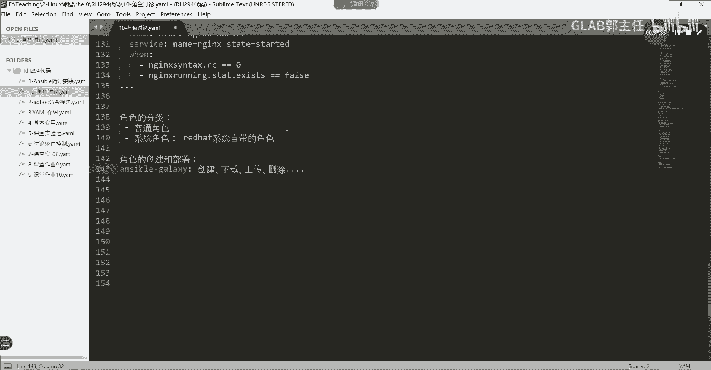

# 【Linux／RHCE／RHCSA】零基础入门Linux／红帽认证！Linux运维工程师的升职加薪宝典！RHCSA+RHCE／46-Ansible角色讲解 - P1 - GLAB郭主任 - BV1BH4y1i74J

多了好，那我们开始今天的内容啊，那今天内容之前，我们回忆一下，我相信那个C的题，大家练看一遍视频，就算不练，你看一遍就知道他考的大部分的内容，就是我们课上讲的是吧，我们现在讲到ESPORT的角色。

好在S波角色前面我们讲了哪些东西，来给大家看一下。

刚好把题的再给大家再简单的说一下好不好，题目。

应该是嗯这个。

那个C应该是这个我们看C啊，cc就不看了，看一下我们前面讲的东西，他基本上都考到了，首先第一个第一个内容就是我们第一节课讲的，第一个知识点就是如何去部署ANSPORT环境对吧。

他要去配这个BCFG的这个主配置文件，再加这个文件，按照他的要求去配置这些内容啊，这第一题第二题就是AD hook，还记得吧，他只不过把AD hoc的命令，放在了白希儿的脚本里面。

然后通过白希儿的脚本去执行AD hook，所以第二题讲的就是AD hook好，用白线的脚本去执行，第三题对对，去安装软件包，这个是非常简单的一个安装软件包的，这这可以理解为。

我们在学员第一个简单的playbook的脚本，他用到的模块就是项目模块，就是项目模块，用样模块去安装，这里写了两个play，看到了吗，为什么要写两个play，是因为他的host主机目标不是同一个吧。

第一个安装的内容，要在dev test pro的这个这个组里面，第二个仅仅只是对DEV里边的去安装吧，所以他写了两个play啊，这个第三题就是最简单的一个play，第四题好，这第四题就到角色了。

就是我们今天要讲的内容，我们今天会讲角色，角色会讲两块，第一块是普通的角色，第二块叫系统角色，所以第四题他考到了系统角色，第五题还是角色用usbt galaxy去产生一个角色。

还有从我的后台去用assable galaxy，下载一个已经已经做好的角色，这就是属于普通角色的范畴，是我们今天要讲的内容好，然后第六题创建一个新的角色。

也是通过ESPORGALAXY去初始化一个新的角色，所以角色你会发现4563题都在考角色，为什么角色会放在最前面，那是因为后边的很多的应用，都要用到前面所定义的角色，所以456考角色啊。

第七题第七题也是啊，你看啊用前面定义的角色去执行我的要求对吧，要用到前面的角色，所以角色这一部分的内容是，其实是为后边的服务去服务的对吧，是为后边要用到这个角色的，然后第八个管理分区。

管理分区要用到一些模块啊，就讲过中间用到一些逻辑架构，循环变量全部用到了对吧，这些都是前面讲的东西啊，前面讲的呃，这个条件对吧，条件判断通过win去条件判断，OK然后呢。

通过这个这个这个叫什么block rescue和always，去做这个这个这个叫什么流程的控制，制作流程的控制明白，然后中间夹杂着一些模块，夹杂着一些变量。

比如说用这个register变量去获取输出的结果，明白意思吗，然后呢我们还可以通过handle，notify handle去处理流程，去进一步的去处理流程啊，NNP是吧，NP在隔壁，在隔壁，在隔壁。

OK好，然后这就是我们前面讲的一个内容的综合，所以大家一定要仔细看，第八题是C当中最难的一题，所以大家一定要认真看啊，好不好，然后第八题的第二个部分是分区，分区的逻辑，和上面的逻辑卷的这个逻辑是一样的。

所以大家一定要一定要仔细看好，再接下来看这个讲过了第九题，讲了一个gj two的模板，上次嗯昨天还是谁问的是吧，这个你要仔细看，这不是有ansport fest吗，这里头他要遍历这个你要读懂。

其实很简单的语法老师我是问题是这样的，PV4和他分开是吧，因为你可以看到他的那个事实变量里面，它其实是一个列表，就是你们学过Python应该知道列表取值的时候，就是用这种方式来取的。

但是我获取实时变量的时候，他是嗯，他是一起来后，他就四个下划线，你可以一起写，也可以分开写，就这里可以连在一起写，也可以分开写，如果分开写，就用这种方式，用中括号的方式，我上次在课上是不是有讲过。

事实变量获取两种写法吗，对不对，你可以，当然这种是更容易理解的，经常写Python的习惯性的会这样写，明白吧，这样写更有逻辑性，就是我要获取它的这个列表里面的，第一个什么的对吧，这是这样来取值的。

字典也是这样的，取字典也是这样来取值的对吧，所以这个就是你可以这样写，你可以这样写，你也可以用点的方式去写，这个没有任何问题的，都可以明白吧，这个没问题啊，这个语法很简单。

其实就是获取了IP地址和FQD，还有他的house name对吧，这个这个要背下来了，考场上没有的，要自己写的好，这个金家具的模板，然后在本地弄好，然后去到目标主机上查，查可以查到。

你用你用setup去查，查完之后拿完整的复制出来就可以了，export点儿什么什么的对吧，下杠这个feat什么点什么的是吧，都可以，然后那个第十题这个修改文件内容，这也是考模块的啊，用copy没问题。

在前面讲过，11题也是前面去搭建一个什么什么服务器，做什么东西，你看没有什么难的，都是模块把模块组合在一起，那逻辑上再做一些，这一题还没有考到逻辑啊，第一题还没有考到逻辑。

这一题考的主要是用copy去设置它的S1LINUX，这个我在视频当中有讲过，大家认真去看好吧，这一题的难点不是逻辑，是模块，然后第12题是能硬件报告，这个题要用到的是呃，这个也是也是模块的使用吧。

啊也是模块的使用模块，去如何更改文件当中的某一行内容，用的是lon fire这个模块好，还有人问我这个问题，这是什么意思啊，他问我这是什么意思啊，看不懂啊，怎么怎么前面还有尖括号啊，这是什么。

首先这是这是什么，先说这是什么，这是一个正则表达式是吧，对不对，这是一个正则表达式，尖括号代表是以什么开头，明白吗，所以这是一个正则表达式，然后这就是一个正则表达式的，关键的一个一个属性。

就是你用lin fire要用正则表达式匹配某一行，锚定到某一行，一定要写正则表达式的，听懂了吗，所以这个就是匹配锚定某一行，然后line用它去修改，听懂了吗，就在看到问题不大的，我以为没有什么问题啊。

大家都对吧，都是稍微有点基础的智能表达式，这个单词应该看得懂吧，还问我见过二是什么意思啊，挺尴尬的是吧，嗯好这个编号是以什么开始啊，那么你用刚才你说的就是这种写法，用这种写法也可以懂吧。

点什么什么或者中括号都一样的好，然后呢下边所以这一题考的也是模块，如何去用lin fire这个模块，13题考的是password的，就是那个ansport word对吧。

创建一个insport word，然后把这部分内容放进这个文件里面，这个这个内容在下面要用到的对吧，所以这也是做一些准备工作了，14题啊，最后一个难的题，后边题都不难。

14题是用前面的创建的这个这个内容，再加上他给你的user的一些YM的，这个预先做好的user的变量文件对吧，然后来创建用户好，这不是简单的创建用户啊，他要有条件都对吧，然后还要用到前面的变量文件。

还要用到这两个do，前面的变量的文件如何去调用它，然后通过user去调用循环调用变量文件，通过条件来控制，在适当的主机组上创建适当的用户，并且把它送到适当的组里面，听起来就很复杂明白。

其实从技术上来讲没有难度，这题考的是逻辑，大家要理解，如何通过逻辑上来来确定我们的应用需求，然后来实现user的创建，这题考的是逻辑啊，所以这两个题大家都要仔细看，第15题，这个是直接改密码。

这个没有任何难点，直接用他原来的密码解密，decode decorate解密，然后INCREPT加密就好了呀，用它的最低双分解15题，大家一定要拿到这个题，明白了吗，好所以这就是我们整个的纵观这几个题。

从考试层面来讲的话，我们学的内容要远远多于考试的，我们还学的东西要比他多啊对吧，所以呢嗯对照着考试，大家会发现，其实考试里头的内容还剩一个一大块没有讲，就是今天要讲的角色，4563个题是不是都在讲角色。

对不对，所以我们通过一个简单的呃我们的C1的题本，我们通过题本来给大家回顾了一下。

我们A嗯嗯他这方面比例相对通过题本，我们回顾了一下我们整个学习的内容，大概前面的一些重点内容好吧，然后呢这个嗯还有一个重要的内容，就是今天上午讲的角色，角色好，当然我们的剩下的内容不仅仅只有角色。

我我把这个重要的内容给大家说完以后，我更希望多留点时间让大家练一练，因为毕竟是一个要写很多代码的，这样的一个考试，需要大家让他不停的去熟练这个代码好吧，还有两周的时间，我相信时间是够的好吧。

OK来我们先看角色，首先我们来理解角色是个什么东西啊，角色啊，看看PPT，一个数据中心他有这样的一个角色，产生的应用背景是这样的，他说一个数据中心有多种服务器的类型，比如说有dB mia dB。

大家记得我们装mia dB要装什么Python啊，要装mia dB的软件，还要配很多mia dB的这个账户，用账户名密码是吧，这些是我们前面做过的，比如说web web，我们要部署阿帕奇。

还要改很多配置文件，还要改改很多的SLINUX，所以不同的服务器它的部署的时候，它有不同的类型，那么这些类型我们如何给它统一起来呢，每一种服务器的类型的运维方式，其实是不一样的。

如何高效地去管理这些服务器极为重要，如何高效地去管理这些服务器极为重要，听懂我意思吗，然后呢功能模块化就是角色管理的概念，就功能模块化好，那么角色是允许管理员将复杂的playbook。

拆成一个个小的逻辑单元，然后呢，放在类似于GITHUB上的这样一个公有的平台上，这是一个公网平台啊，叫galaxy放在这样一个平台上跟大家一起去共享，共享了以后，如果你要实现某一个服务器的角色啊。

某一个服务器的应用，你就可以在galaxy这个平台上去找，有没有这个服务器的角色，如果有的话，直接登录下来，你改一改就可以了，听懂了吗，所以角色用一句话来总结，它其实就是把我们的功能模块化了。

把功能模块化，把一个复杂的playbook拆得很细，然后放在不同的角色的模块里面，然后把整个角色打包共享在galaxy这个供云平台上，然后供所有人去参考，去分享，去交流，能听懂我的意思吗，各位啊。

能明白好，所以我们先理解了角色的概念了啊，那么来看角色他是怎么样去组织，我们的PLAYBOX，怎么去组织的，从表面上看，角色其实就是一个目录，比如说我创建了一个web server的角色。

在web server角色下面就会有这么一大堆的目录，所以他的角色的本质是一个目录，听得懂吗，那么目录的名字也就是角色的名字啊，例如角色当中说的web server，它其实就是一个角色名。

那里边会发现有好多的子目录，那么这每个子目录分别有什么作用呢，使用的时候每个目录必须包含一个may点压宝，你看may点yo在哪啊，是不是每一个目录下面都有一个main点，要么看到了吗。

OK那么这个时候我们就会给下边买不同的目录，子目录啊，定义它的功能，比如说在tasks这个目录里面，存放的应该是角色主要执行的任务，也就是主任务列表，他都算在task main yo里面。

然后handle是不是要放被NT被notify检测到的，要处理的这些这些程序吧，能听懂吗，所以你把所有的handle都放在handle，这个子目录的yo这个文件里面。

我们然后default主要放的是默认的变量，default在这放的是主要的变量，变量放在defaults，然后角色的其他变量放在worse，worse放角色，其他变量file是用来放部署给服务器。

我们是不是经常要向服务器，就是受控节点传递一些文件对吧，你要把传过去的一些文件放在都放在files里面，然后template里面主要放的是模板文件，主要是什么，先加to的一个模板是吧。

主要是增加to的一个模板，然后mt这个主要是为角色定义一些原数据，我没有标红，说明他不是很重要理解吗，所以上面我标红的都是相对来说比较重要的，听得懂吗，所以你会发现通过角色的概念。

他就把很多我的playbook，很多的内容全部打散，放在不同的子目录里面看得懂吗，好来我们看一个实际的例子看啊。

这个是什么角色，角色。

王永婷。

杨某，好我们来看角色的一个讨论，我们假设啊，嗯我们来讨论一个没有角色的playbook，没有角色的playbook，这个大家应该很容易理解，我把它复制过来来，仔细一看能不能读懂这个我们前面讨论过的。

这是一个没有角色的playbook，大家能不能读懂前面讲的看啊，首先这是一个大的play，这个只有一个play，举一个play，然后名字不说了，HOUSTON就是指定指定主机组变量。

变量之前用的是列表的形式吧，说明有三个变量对吧，tom cat3W和MYSQL3个，然后呢task主任务，主任务大概分为几个子任务，太多了，好几个子任务，然后第一个我们用user来创建创建来创建用户。

来创建这些用户，通过循环，这个可以改成loop，啊改成loop，大家就理解了，通过循环user模块来创建用户，第二个去安装这些软件，第三个通过JJC的模板复制过去，然后只要复制过去。

改了文件就触发notify，notify就会被handle接受，handle接受就会执行handle下面的任务，任务就是重启NGINX的服务吧，听懂了吗，OK然后呢接下来做了tag。

也就是下边这一堆东西，就是我们前面讲的，首先我们要check一下有没有发生改变，然后被register变量注册，然后去看看对面的这个文件pad，就是这个进程是不是已经运行了对吧。

然后呢通过debug把这些信息都打印出来，然后当检测到上面两个都同时存在的时候，我再去restart一下NGINX，这是我们前面讲的一大堆复杂的逻辑控制，加我们的应用需求，这就是一个没有角色的plan。

那如果我接下来要用角色，把这个play拆成有角色状态下的，那怎么做，对吧，使用角色要把这个playbook拆成有角色，有角色的这样的一个playbook，使用使用角色来实现需求，所以接下来你就要拆了。

对不对，首先NGX角色它是以目录的形式呈现的，所以我们一定会生成一个NGINX，角色名为目录名字的这样一个目录，听懂吗，好这个目录里头有什么files，files里面是不是放的文件，用来拷过去的文件。

handle是不是用来存放这种handle的任务啊，对不对，task是不是主文件系统，就是你的所有的主流程都应该在task，main yo里面，template是不是放在你的进价兔的模板。

在这个在这个例子当中有没有进价图模板，有吧，因为要去改NGINX的文件，所以JITO的模板应该会放在template里面，然后vs主要放变量的，这里头有没有变量，有啊，变量在哪，是不是在这啊。

这是不是有的变量，OK所以当角色被确定了以后，它的整个的目录的和子目录的框架就决定了，决定了之后，我们可以把我们的内容，根据它的功能开始往里放好，比如说第一个我们files的目录里面有没有文件。

有没有files的文件，由我们把这个配置文件，因为我们刚才有用到那个要要copy过去的，是不是要把这个文件copy过去啊，这个要从控制节点copy到数控节点的时候，要用到这个文件。

所以这个文件可以被放在files的这个，目录文件里面，这个能听懂吗，明白吗，好那么handles与handle里面有没有脚本，由对吧，应该是在我playbook当中。

他把handle相关的任务是不是就这一段啊，把这一段内容复制过来，放在这一段，各位能听懂我意思吗，OK把handle就放在对应的handle，功能目录的子目录里面好，然后verse有吗。

变量是不是也有啊，好把变量放进去，那么在VERS目录下面就会放变量，OK继续，那么template有没有也有template，是不是我的金家兔的模板，这个金家兔模板也放在里面吗，对不对好。

接下来重点来了，到了指的就是我们的主目录，Task，里面的主目录组的main的样貌的文件该怎么写好，来给大家看一下，这个应该这样写，大家看清楚了，这是主的任务目录，在tasks main yo里面好。

前面一大堆东西都不用写了啊，都都都都不用去说了啊，然后呢创建用户不用讲，然后呢yo不用讲template啊，不用讲，我看看角色tasks组的啊，主的任务，这些内容也就剩下的所有的内容都放的。

都变成组的内容，对不对好，我们这些组的内容都放在这个组的yo里面，那接下来怎么用呢，这个角色怎么用，这个角色就被定义好了，这个角色就被定义好了，那这个角色的名字就叫就叫NGX，听懂我意思吗。

好那么这个角色怎么用，他不是说你角色创建好了，他就是这个这个创建好了，他就能用了，不是的，他要调用的调用角色的方式很简单。

来我们看P，你看在这有没有看清楚他怎么调用呢，好在外边创建一个playbook样的脚本，然后指定名字，指定针对哪一个web server的主机组，然后通过rose是不是下面调用web server。

就写这么多就可以了，这么多你只要调用了web server，它就会自动加载。

自动加载这个NGINX角色下的所有子目录的压模，压模脚本和所有对应的文件，理解我意思吗，嗯明白吗。

好那么如果这样实现了以后，这是实现方法，调用角色就这样调用的，我们用第一种方式，我们不要考虑下面的第二，下面是一种新的方式，不管我们现在主要调用角色，就通过，调用web server这个角色就可以了。

接下来去执行这个脚本就可以了，理解吗，然后把这个角色打包，你拿到你的电脑上去，我也只要在我在你的电脑上写这三句话，四句话就可以直接调用web server了，我把这个角色共享到galaxy的网站上。

大家直接登录下来，把对应的文件改改，比如说我可能copy过去的文件，不是51GLAB点com，可能是其他文件，你只需要去改，在这个file目录下面去改一下就可以了，听懂了吗，明白。

如果我的JITO的模板也不对。

那我只要在template下面去修改，这个JITO的模板就可以了吧，主的这些东西都不用改，听得懂吗，所以是不是很方便去维护，我们执行export playbook脚本，很方便，明白了吗，OK好。

所以这个就是我们现在要讲的角色。

角色就是这个概念，听明白了吗，好这角色概念说明白了啊，搞清楚，然后我们来看一下他的这个galaxy，galaxy官网的这个这个这个这个这个类似于GITHUB啊，我们来看一下。

就是你的这些东西可以托管在什么地方，叫galaxy点com，这是一个专门用来大家共享角色，你在这里可以找到很多角色对吧，比如说我们想找系统相关的网络相关的，他都帮你分好类了，数据库相关的。

我们举一个例子，我们找系统相关的网络在这里嗯，系统相关的有很多啊，嗯command，你看cooper nest fork，这个也可以，大家去登录下来改改，就是你可以在这里搜啊，你可以在这里搜索。

比如说有没有换发型的，有啊SB阿帕奇的，这些都有，你可以自己去登录下来，然后去改改，这里头有他的浏览量和使用人数，下载量都有，明白了，明白我意思吗，然后我们再找一个我们网络相关的ANSPORT。

是可以把所有的网络设备都关起来的啊，我最近正在正在开发一门新课，就是用用我们的系统的自动化运维的东西，把所有的东西都关起来，把网络的系统的虚拟化的，这些所有的东西都用这一套系统把它关起来啊。

还是非常有意思的啊，所以就是用的这些现成的东西，这些东西都是现成的，不用自己开发，不用自己开发，download下来改改，你只要对整个S架构都理解都了解，包括对网络的技术一定要懂。

然后系统的整个原理也要懂，虚拟化也要懂，那你接下来对这些东西搞起来特别简单好不好，来看看JS3的，这是一款模拟器啊，然后收集的template e x e x o s。

这是一个应该是juniper的一个一个系统吧，你看思科的S看到没，我可以把这个角色登录下来，AAAA是无限吧，robot是无线，可以管ERROBOT，无线还有很多啊，后面大家自己去翻对吧。

那思科的C你可以登录下来，去改改他的角色，他就可以把SI所有的监控全部抓到，并且还可以对SI进行修改，去改这个SA批量的去做这些事情好吧，所以这个galaxy大家呃。

这个网站大家可以去去去了解一下啊，这是asp的一个专门放角色，还有代码共享的一个地方好，那么这个是角色角色说明白了，接下来我们说两个概念。

第一个叫普通角色，第二个叫系统角色，自己角色的分类啊，这算是笔记了，角色分类，第一个叫普通角色，第二个叫系统角色，嗯这就系统就算了，那么嗯普通角色就是我们自己创建的，我们可以根据自己去创建一个普通角色。

比如说我刚刚讲的，你可以根据自己的playbook脚本，去创建一个NGINX的角色，那么这个NGINX创建好了以后，他就是一个普通角色，听明白了吗啊，这就是一个普通角色啊。

那么你拿着这个普通角色你就能用了，理解吗，OK好第二个叫系统角色，系统角色是什么意思呢，是红帽，啊叫叫REDHAT系统自带的，系统自带的角色，这个角色不需要做任何的定义。

你只要安装了red hat的操作系统，然后把系统角色的软件包ym install以后，就可以用它自带的系统角色，那么他把里面所有的变量啊，所有的main的playbook，所有东西都定义好了。

你直接用它就可以了，理解吗，好现在主要的系统角色有哪几个啊。

这就是我们现在主流的系统角色，就现在红帽系统上支持的系统角色，大家看一下，要看他的state state状态，就是full support，就是可以支持的，这是可以支持的，也就是可以用的。

第一个是叫key dump，就是用来对系统的内存进行诊断的啊，这个也一般用的不多，一般系统要crush的时候，我们可以用这个角色去对系统来进行，进一步的诊断，第二个是network。

是不是也是for support，对吧好，这是一个网络配置的系统角色，说讲到这儿，是不是还没有考虑到，我们之前是不是一直没有讲，如何通过脚本，对我的操作系统来进行网卡的更改啊，有讲过吗。

网卡更还有哪个模块改IP地址，有没有讲用哪个模块去修改它的IP地址，没有吧对吧好，红帽官方建议用他的系统角色，用network这个系统角色来对我们的网络，进行IP地址的更改，写在脚本里啊。

执行一下批量的把所有的东西都改了，100台机器，所有的IP全部给你刷掉，OK就是用这个角色，这是要考的，这个是要理解的啊，这个C没有考，但是我觉得是一个非常重要的模块，就是这个角色非常重要的一个角色。

第二个叫S10UXSALINUX，是改这个sea linux tape类型啊，这个SLINUX的状态啊，默认是enforcing是吧，我们可以把SLINUX把它干掉，这个也是也是也是要理解的。

这个比较重要，可以通过这个角色来做这个SLINUX的修改，好第三个是我们考的，我们考的角色是用time time叫时间同步，通过系统角色来同步时间，做过一遍的人应该知道的吧。

是不是通过这个角色来同步时间，好在这次考题考题考的是他好，然后呢这个是正在技术预览版，叫post fix邮件相关的吧，post post邮件相关也就还没有能用，正在测正在测好。

然后呢下面这两个也是没有在用，正在开发阶段叫firework，还有这个这个叫什么TNEDCCA，大家应该都敲过吧，这个是在做什么TVAD，看到这个词眼熟吗，是不是优化呀对吧，做内核的优化到以后。

大家做内核的优化，也可以用他的系统角色来执行理解吗，所以真正现在比较在用到的就是network s，LINUX和时间同步，这三个是需要大家要去掌握的，好不好，那么系统角色该怎么去用。

也就这个角色已经定义好了，该怎么去用，一会通过例子我们来做这个习题来理解，大家就知道了，好不好，好，这个叫系统角色，系统角色我们再把概念再过一遍，红帽内置的角色目的是为了简化管理。

比如说LINUX6的时间同步使用的是NTPD，LINUX7又变成了chrome d，那么配置文件不一样，维护就不方便了，有了系统角色直接使用这个角色，不需要去关心这个服务对应的文件是什么。

这段话它的本质表达的意思，就是告诉你，用了它统一的角色这个概念来集体运维的话，我不需要在意你是LINUX6还是LINUX7还是LINUX8，我直接用户通过它去执行整个时间同步的更改。

我不关心你的每一个对应的文件是什么，我只要调用角色就可以了，听懂我意思吗，嗯然后可以支持付费订阅，说白了这个你想用免费的可以，但是如果有了问题对吧，这个红包不提供支持，需要你自己解决。

所以企业用户一般建议去买他的付费版，他就靠这个赚钱吧，所以这个是红帽上面的一个系统角色啊，OK目前支持的角色的分类分为，完全版和技术预览版，刚刚讲过了，那么角色如何安装呢，啊这个是要装的。

装了以后才会有这些角色出现啊，当做一个软件包放在仓库里面，大家到仓库里面去下载去安装就可以了，安装后系统角色在什么地方，系统角色在这个地方，usr sheer esport rose里面。

这就是为什么我们在考试当中。

大家在考试做第一题的时候，有没有看到写ANSPORTCFG文件，写角色啊，是不是还记得吗，在这是不是role pass有吗，在这里写了两个，知道为什么了吗，现在你至少冒号啊。

冒号隔开代表的是两个角色路径啊，前面一个后面一个明白吗，至少你有一个能看懂了吧，这个是什么角色的路径啊，系统吗，不在这里指定ANSIBLECFG是读不到你的角色的，听得懂吗，你要用系统角色。

必须在ESPORTCFG里面去指定系统角色的路径，在什么地方，他才能用到系统角色，它的路径必须是指这个必须是什么，必须是默认系统角色，你只要样本install安装好了，系统角色就是这个路径。

就这个默认的默认就是这个，明白吗，然后前面呢前面是我普通角色定义的路径吗，还记得我们在后边创建，是不是ANSPORT下面创建了一个rose啊，在rose下面把远端的角色登录下来。

然后自己一个角色也是在这个rose上面了吧，所以普通角色的路径你在哪，你这里就写什么，系统角色的路径默认就是它，所以你应该写它不要改不要改改，可能有问题啊，系统角色路径不要动，普通角色的路径是可以的。

就是但是在题目当中指定的也是这个路径，只不过我是说可以，它是可以变的理解吗，OK好到了USB2。9以后，系统角色的路径，大家都不用在INSPORTCFG里面去指定了，你觉得累赘吗，既然是一个系统角色。

我要去指定它的系统路径是吧，太烦了，所以到了2。9以后，这部分不用指定它自动在执行ASSA脚本的时候，自动帮你去读到，默认的这个这个这个这个路径啊，那只是在2。9以后，现在我们考的是2。8，不应该是2。

8吧对吧，没到2。9啊。

2。9做了改进啊，嗯注意清楚了，系统角色安装之后可以被playbook调用，一定要调用，这个就跟我们写C二一样，S2写完了放在那没有用的，你必须要调用它才能生效，角色写完放在那里没有用的。

你一定要被调用好吧，不要搞清楚啊，好那么接下来我们来讨论如何去部署我的角色，这个这个题讲的是这个地方讲的是什么意思呢。

你看啊，普通角色我可以创建好啊，就是就是就是什么意思啊，角色的分类，角色的创建和部署，用的是ansport galaxy g l a。

叫GGALAXGLAXY。

通过ESPORGALAXY这个命令，来执行所有角色的创建，它可以执行角色的，创建啊，可以创建角色，可以下载角色，比如说你你是不是做了一个角色提供，提供给其他人去分享。

那么我可以通过esport galaxy去下载你提供的角色，明白吗，好我还可以去这个，我还可以上传，我可以通过BGALAXY去把你的角色上传，并且打包的打包上传，我还可以删除，所以这一系列所有的东西。

都是通过这个命令来实现的，叫esport galaxy，听懂了吗，这是一个前端对角色进行创建和部署的命令。

叫ALAXY，主要就是用它没什么难的，其他的啊，来我们看usbore the galaxy的工具，类似于这个GITHUB，通过其进行角色的分享，也可以通过它进行角色的获取是吧。

官网就这个命令就是PGALAXY了，然后呢嗯可以不去访问这个网站，直接通过这个命令就可以自动访问到这个网站，下载或者干嘛都可以，常用的指令是ansport galaxy的杠杠help。

那大家可以看到后边的这些参数，就是他们干的事情是吧，删除导入信息，创建安装下载啊，这是下载列出来登录登录登录的是哪个网站，就是你可以登录galaxy的那个网站，三移除查找对吧，设定是不是都可以啊。

都可以，都是用它来实现的，理解这意思吗，OK那么前端的命令就一个enable galaxy，那么我们这边举了几个例子，比如说我想搜索对应的这个galaxy网站上有没有，我想要的角色。

就用asp search，我想从galaxy上下载一个，我就用esport store，我想列出上面有哪些角色，就用ESPLIST，我想创建一个属于自己，我自己要新建一个角色。

我一定要通过escort int i n i t，通过他如果不加任何东西自己创建的时候，其实你他都会帮你生成一个生成一个什么木偶，如果是自己创建啊，这时候还没法，如果是自己创建。

它会帮你生成，自动生成一个类似于这样的目录，理解吗，目录里边所有的内容都是空的，然后你在这个目录里面把一些内容补充全，明白了吗，补全了以后，这个角色就做好了，做好你就可以共享出去了，共享出去以后。

别人需要获取你的角色，就要通过怎么下载吧。

下载的话通过什么命令install吧，就通过store去下载了，听得懂吗，所以你可以自己创建一个把这些东西都补全，然后通过install安装，但如果是任意的好，来我们看一下，通过一个例子。

我们来简单的来理解一下317页。

317页，利用角色来简化playbook，然后我们先看一下他的需求。

