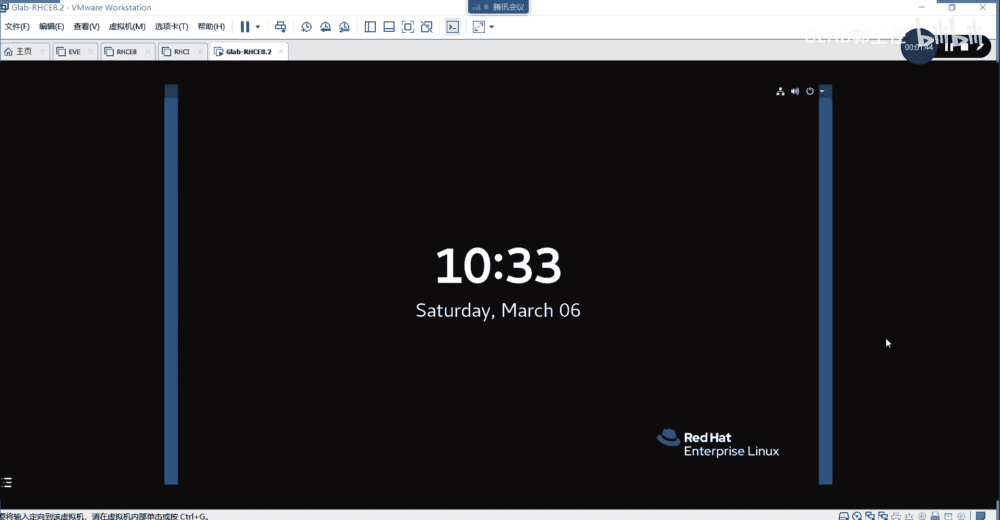
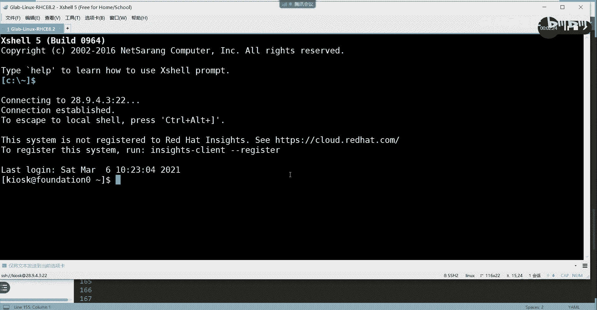
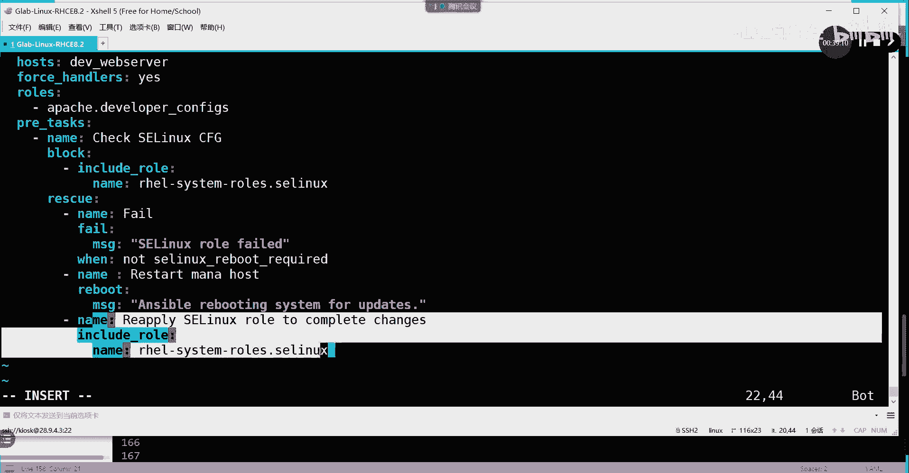
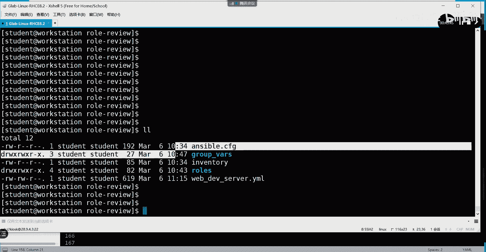

# 【Linux／RHCE／RHCSA】零基础入门Linux／红帽认证！Linux运维工程师的升职加薪宝典！RHCSA+RHCE／47-Ansible角色实验 - P1 - GLAB郭主任 - BV1he411Q7JW

来我们看一下这个这一题的内容啊，先看一下他的需求，他说要部署一台web服务器，来托管web开发人员的开发代码，这是它的组成一个一个任务吧，然后说每一个开发人员，在服务器上要拥有一个目录啊。

每一个人有一个目录，然后来存放各自的代码，每一位开发人员的内容，都使用分配的非标准端口来进行访问，存在存存在角色就是意思，就是每一个人都要用非标准的端口，来访问这个web服务器。

非标准端口啊来访问这个web服务器，然后每个人都有对应自己的一个目录，然后自己把自己的代码放在这个目录里面，然后环境中要有一个角色的依赖关系，一会儿给大家解释角色依赖啊，所以这个题。

其实大部分的任务都是靠角色来执行的，你看这个任务是不是很复杂，要要你创建用户，还要对应每一个目录，每一个目录里头推对应的不同的端口，就是非标准端口来访问，其实很复杂。

但是呢我们的代码实现起来一点都不复杂，比较简单好吧，来我们来看啊，怎么做，首先第一步我们要要去考虑到这个，这个这个先写最外边的组的，也可以不先写，这个不重要，没关系，我们首先要创建角色。

看首先要创建角色，在我们把这个环境开一下。

有机器还没开开，都来来来，我们继续啊。

环境应该开好了，开好了以后，我们我习惯用用外边的这个擦线来。

连考试都在里面编辑啊。

你别指望说考试说弄个插线连进去考试，大家模拟测就模拟考到这来就知道了，模拟考就跟考场上的差别，环境很小啊，只不过是一个是红帽定制的一套东西对吧，我们自己练，没有他一套定制的东西在里面。

但是大部分的环境都跟考场差不多了，所以再说一遍模拟考，大家一定要来现场好吧，下周开始啊，下周六开始模拟考。

模拟考试不用带电脑，用我这边的电脑，好那我们看嗯，现在呢我们先SSH到，然后再在这个地方，我们把我们的环境打开，叫lab row review，Review on start，不会啊，我没有网上看。

这个我给大家手敲一下吧，手枪有点慢，但是它里头有一些东西，角色这块怎么调用呢，还有角色的依赖，我跟大家说清楚，所以打的慢一点啊，好然后呢就看到角色了，CD到肉，这个角色里面在里头有用到一大堆文件。

就实现了那些所有的功能，不需要大家去讨论怎么去建的，用户怎么去跟目录对应起来的，怎么去用不同的叫非非标准端口，去访问的这些东西，角色都有定义，我们现在这个这个模块可讨论的，就是怎么去使用这个角色。

理解这意思吗，好首先第一步我们在在这里，我们在这个里面去创建创建角色目录肉，我们在这里创建一个肉啊，make dr在这里创建一个rose，然后我们CD到rose里面去，在角色目录下面去做这个事情。

好吧好，在这里呢我们首先要创建一个呃呃依赖叫什么，去到远端要去下载这个，这个已经做好了，一个叫阿帕奇的这样的一个角色好，所以我们要写一个写一个叫这个名字，叫requirements。

REQUIREQUIREMENTS点y ml，创建一个样貌，杠杠杠，OK好，然后呢杠name这只是一个名字，叫RAFRA点这个APACHE，这只是一个名字，而已接下来呢SRC告诉他。

我到远的哪个地方去下载，叫git，workstation点lb点example，点com在哪里呢，有一个叫in fro info a p AC h e，这是一个阿帕奇，这个要看得懂。

就是我要我要到哪去下载这个角色，就是这个路径通过GITHUB登到这个这个上面去，因为是免密的嘛，所以不需要输密码，然后呢SCM告诉他，这只是指定我是用什么样的模式，GITHUB的模式去下载的。

按v dio s I/O n version，冒号V1。4，好，指定它的版本，这一套东西就是你要到远端，通过GITHUB的方式去下载我的这个角色，一定要写一个这样的一个叫requirements的脚本。

就这个明白意思吗，好那么接下来我们就可以用它来下载了，我们CD到上级目录，在整个操作过程当中，大家包括考试，大家一定要看清楚操作的目录，因为操作的目录，对你的产生的结果可能不太一样，明白我意思吗。

有些有些地方去执行asp不能执行的，只能在有INSPORTCFG里面才能执行，明白不，OK然后呢还有一个就是后边要讲的容器，容器的东西，它对他对这个呃以什么样的方式登上来，操作容器非常关键。

上次有人在群里问，都看到了吗，一定要用SSH加普通用户的方式登进去，当然这个我在容器也会重点给大家强调，好不好好，有些东西一定要注意什么，大家自己要总结啊，自己要总结好了。

接下来我们创建了这样的一个登录的，或者说获取角色的方法，我们接下来要安装角色了，记得安装角色用的是什么样的方式吗，是不是用USB杠galaxy吧，对不对。

通过sport galaxy的install s t a l l好，Install，第一个参数叫杠杆，我要用什么样的脚本，我要用rose下面的request这个脚本，然后把它安装到哪里。

通过GP去指定安装到哪里，这句话能看懂吗，我用request的这个刚刚写的那个脚本去获取安装，我这个角色好，这个角色是长什么样子，就是这个，然后安装到哪里，安装到肉上面去，嗯好只要安安装成功了以后。

我们通过LS杠L去看一下，rose上面是不是多了一个in FA点，阿帕奇的这个脚本，这个角色这就是角色听懂了吗，好然后我们CD到rose下面，我们再CD到in france，阿帕奇这个角色我们先不看。

我们通过一个命令叫tree in fra，阿帕奇去看，是不是我们刚刚讲的是一个目录的格式啊，目录下面都有default handle match啊。

Tasks，这是从我远端获取下来的一个角色。

也就这个角色是别人做好的，各位能听明白吗啊，知道了，所以通过install的方式把它安装进来了吧，听懂了，OK所以这是我们获取角色的方法，获取角色的方法好获取下来了以后，这个角色就有了，这个角色就有了。

这是我们做第一步，从远端下载我们需要用到的角色O好，接下来第二步，因为这一题我们还要用到去修改相应的一些，这个S1LINUX的一些一些文件，我们需要安装一下系统角色，所以我们把系统角色也安装一下。

ym install安装系统通过ym install，但是我是普通用户，安装的话要通过速度，样本install，这个叫RH，等会儿叫rh e l r h e l system，可以按tab键补全的好。

然后输密码，STUDENT好安装吗，是的，好这时候系统决策就做完了，系统角色安装完了以后，我们就可以在它默认的目录里面，看到这些系统角色在哪个目录，还记得刚才的目录吗，是不是在usr share。

诶share什么passport passport role是吧，在这儿吧，看来我看一下好，只要安装好了以后，在这里就看到这些系统角色，这些系统角色正在用的network s linux时间同步。

能看懂我意思吗，各位啊，这些角色就已经都装都装好了，都有了都有了，好不好，这是第三步，安装系统决策，后面要用到啊，后面要用到好，接下来第四步我们要做一个自己的角色，然后自己的角色里面要调用到。

刚才下载下来阿帕奇的角色，然后呢通过自己的角色在职在本地集呃，最后被调用，所以在这里我们还要去安装一下，就是初始化一下，创建一个新的角色。

通过s sport gun galaxy i r n i t应该在rose上面要搞，搞清楚角色，所有的角色都放在这啊，所以通过for galaxy r i t初始化一个新的角色。

这个新的角色叫IPACHE叫阿帕奇，他给的一个名字啊，阿帕奇DEVDEVIDEVELOPD，EVELPER吧，Developer d e v e l o p r。

阿帕奇点developer c o n f i g s好，创建一个新的角色好，这个时候你再去看，是不是多了一个阿帕奇的这个角色名，你后边写的这就是他角色名，听得明白，我再去一下阿帕奇的。

这个是不是它自动帮你生成角色对应的目录啊，所以INIT是创建角色，但是里边这些东西都没有内容啊，都是空的，都是空的，理解吧，大家可以自己去看，都是空的，因为你是用RNIT的方式给它生成的啊。

IIT里面是新的角色，里面啥都没有，但是install下来的里面就是有内容的，是别人创建好的，听懂了好，那么继续好，那么我们退出来CD啊，退出来退到最外面，推到最外面以后，接下来我们要配置这个角色了。

好我们首先配置这个依赖关系啊，这个依赖关系放在哪呢，放在角色上面的阿帕奇的这个里面，一个叫MATTMATT，还记得mt这个目录是不是主要放原数据的是吧，我们角色的依赖也是放在这里，写错了。

在mate下面是不是有一个main点，yo好，主要是这个在这个里边的话，放的是一些原数据，我们需要去修改，去写一个depends，有没有depends啊，就是要修改一下它的依赖关系。

在这就这个我们要写一下，Depends，Depends，下面我们新建一局，对吧，空两行在depends上面，depends还是depends啊，在depends，删掉一二好，在这里我们要写几个东西。

第一个name name的名字叫RA点APACHE好，第二个SRC它依赖什么角色啊，是不是刚才写的那个角色啊，GIT那个角色在哪啊，在workstation lab点example，点com冒号对吧。

在这里面有一个斜杠，APACHE就是依赖远端的这个角色，然后SCM就是用的是什么方式呢，用的是GITHUB的方式，然后的版本，用的是V1。4，用的是V1。4去download这个角色，这一步一定要写。

因为呃我的这个创建的角色还是要依赖，我在远端登录下来的那个角色，所以这里的依赖关系要写在我新创建的这个角，色的mate里面的这个may yo里面，好这是第一步编辑的是这个文件啊。

是在新创建的这个角色下面，去指定我的依赖关系，去指定我的依赖关系，好，这个依赖关系好了以后，接下来我们把嗯这里所用到的一些文件，全部放到对应的角色里面去好。

第一个我们把develop developer的task，也就是组的样本文件放到rose下面的阿帕奇CONFIG，下面的tasks，下面的win点yo，这个能看懂吗，这个组的所有的功能实现都不用写。

你可以自己去VRM看一下这个desk怎么写的，放进去了吧，只要放进去就行了，这第一个要放的第二个MV，我们把developer的JITO的文件，这是一个显然是一个模板文件。

放在阿帕奇的template上面，是不是放进去了，500文件放进去能听懂吗，各位好，然后呢，我们还要创建一些变量，make a dr g r o呃，这叫什么g r o u group VR s。

然后呢DEV嗯，DEV下面的一个叫空白本，Server s e r s e r v e r gp，我们创建一个用来专门给主放电量的文件啊，目录创建一个这样的一个目录啊，创建一个专门用来给主放变量的目录。

然后把变量专门放在这个组里面，好来吧，我们通过mv web的方式送到group war上面的develop web，这个里面好，那我解释一下，很多人说为什么你不把变量放在呃，不把变量放在这个。

这里不是有专门放变量的地方吗，是不是有vs啊，对不对，我们为什么不把变量放在这呢，好在这里可以，这里只是放在我们的主机变量，如果我有一堆组的变量，我可以在这里去创建，当然你把变量往这里丢也可以。

能听明白我的意思吗，我们常规的做法是在最外面，就是在这个地方，就是在这里在这里，如果是基于DEVIP，就是主机组的变量，我们建一个叫group vs，如果是基于某个host的变量。

我们也可以建一个叫host下层杠verse，这样就会很清晰明白吗，L s l group vs，如果是主机组，这就是典型的web dv的web主机组，至于这个主机组的变量，我们把变量丢进去就可以了。

如果是主机的话，你在这里建一个host vs，它也一样是可以被ROU上面所调用的，因为你在在肉上面，大家去看组的那个playbook脚本，你写在这里，它就调用的是这个目录下面的变量，明白吗。

如果直接丢在肉上面，while里面是不需要指定路径的，它自动调用WA下面的路径，明白OK就这点区别，所以我们只是为了更直观的去区分不同的变量，为什么要定义在外边，大家想一想，想一下这个原因。

因为这个角色是不是要共享啊，你的变量和我的变量一样吗，最大的区别应该就是变量吧，比如说我这里的变量定义了，比如说定义了三个用户，我叫我叫tom1tom2tom三，tom是你这个公司的用户吧，对不对。

如果你把变量定义在最里边，他是不是随着角色一起拷给你了对吧，所以为了更小的减少这个角色的改动，我们把这个变量是肯定要改的，你考过去之后，变量是不是一定要改呀对吧，所以我们最好的方式就是。

直接把变量丢在最外面，那么角色拷给你了，我的变量还没有考给你，那你直接用你本地的变量就可以了，你在本地创建group wh就可以了，听懂我意思吗，就是减少更少的减少我们对rose这个脚本的改动。

所以把变量定义在外边，好吧好，那么把变量也丢进去了啊，变量也丢进去了，接下来我们来看一下要不要写一下，我们这个呃这个叫什么web dev server yo，有没有啊，没有是吧，那我们要写一下VIM嗯。

我们可以来调用这个角色来进行测试了，这个写在最外面的就是我们的主的playbook了，最最最外面啊，最重要执行的，我们给它定义一个名字吧，叫web d EV，我在DEV嗯，dev server吧。

server点yo好，这个脚本怎么写，杠杠杠来看啊，杠name好，这只是一个名字，我们叫CONFIGURATION，D e v，Y8server是吧，OK好，host是指哪个主机组啊。

d EV web server是吧，OK好，然后呢，我们这里可以写一个叫false handle，叫false handle，handle是这样写的，Handles。

H a n d l h a n d l e r s k forth handle，Yes，这句话handle什么意思，知道吗，false handle就是强制执行我们的handle是吧。

强制执行handle区别是什么，false handle和handle的区别是什么，handle是不是要被notify触发才会执行啊，false handle就是不去被notify触发，都需要执行。

所以这个playbook脚本里面如果有handle的话，他不管有没有notify，它都会执行，听懂我意思吧，所以叫false header，这里为什么写yes，一会再看，好吧好。

然后接下来开始调用角色叫rose，调用是怎么调用的，前面空两格啊，空两行，然后杠调用我刚刚写的角色叫这个角色很长，在哪这个吧，是不是这个自己写的啊，看得懂吗，好调用这个自己写的这个角色啊。

调用这个自己写的角色，其他什么都不用做就可以了，然后我们刚playbook直接去执行一下，我的这个叫VIP直接去执行一下，然后呢如果说你要想把接口放到，直接去执行一下，不唱歌了，不听说唱歌，看啊。

这些东西都是在调用这个playbook，脚本变量里面的文件啊，在执行啊，用的是非标准端口，9081，看到没，9082标准端口就是八零或者八零，八零或者443是吧，这些对标准端口好有报错，来看一下。

在restart阿帕奇服务的时候发现了一个报错，接下来我们就要讲s sport排错，请看一下这个报错，大概帮我分析一下什么原因，这里不能有file啊，你的脚本执行，只要file里面有有有有报错。

那就肯定不行的，肯定是有问题的，服务肯定没有部署成功，听得懂吗，看一下前面都没有问题，一直到RESTAR阿帕奇服务的时候，报错了什么错误啊，大概要读懂这个message。

Unable to restart service，Httd，Because control process exists with error code，就是控制进程跳出了，因为一个错误代码。

好那大家想一想这个过程啊，HTTP重启错误大概总结一下会有哪些常见的问题。

总结一下吧，HTTP重启我们就只是讨论重启，啊啊啊HTTPD服务重启，重启失败可能的原因，第一个，服务没安装啊，服务没有安装，服务没有安装，你连重启服务这个服务可能都没有，他不能他都没有失败。

也就是服务的那个service都没有明白，服务肯定安装了，然后呢重启服务失败，最简单的应该是它的配置文件有问题吧，是不是前面我们是不是举了一个实际的例子，一直在做NGINX。

NGINX其实跟HTTP类似啊，你的配置文件只要有问题，他重启就会失败，所以我们才会去检测配置文件有没有问题吧，对不对啊，OK所以配置文件要去看看有没有问题，第二个好，假设配置文件没有问题了。

pat文件没有问题，重启失败，重启HTTP服务的失败，对吧，权限问题，你的所有的内容都没有问题对吧，接下来你是不是有资格去重启它，对不对啊，很多如果说没有权限问题，那么那就肯定是这个权限是指普通权限。

普通权限问题，就是我们之前讲的这个文件的三个三块吧，读写执行能听懂吗，OK好，假设是普通，绝对没有问题，第三个，最重要的就是我们这里的问题点，叫还不是最重要的，还不是最重要的叫，叫想一下啊。

还不是这样叫，反正是跟SLINUX有关系，还记得吗，S s 1linux，SLINUX是不是有那个tag啊，是不是有tag，每一个文件，每一个进程它都有对应的S1linux tag。

所以如果你的文件创建的没有问题，但是你的文件的tag和我进程的tag不是一样的，那你去重启它是不是不能加载这个文件，理解我意思吗，所以上下文我们叫上下文一定要一致，上下文一定要一致。

叫S1LINUX的上下文，上下文一致的概念其实就是TG一定要一样，大家还记得tag在哪吗。

记得吗，我们看一个文件的tag通过A2SLSLZ吧，大ZR听懂我意思吗，好我们就看它，我们就看D吧，就看这个目录，L4大Z主要是看目录或者文件的tag tag在哪啊，是不是就这个这么长一串。

这个就是S1linux tag，当HTTPD的服务进程的tag，和你的这个文件的tag不一样的时候，他就认为上下文不一致，文件不能够被进程读取，所以重启服务失败，听得懂吗。

这前面讲过讲的CLINUX有讲过，OK好。

还有最后一个就是我们这里的问题，第四个还是跟SLINUX有关系，但是就不是跟TK了，SLINUX除了控制他还能控制什么，回忆一下RHCSA第三题，做过的人应该知道吧，是不是叫port吧。

它除了可以管tag之外，它还可以管某个服务监听的端口，默认HTTPD监听的端口是标准端口，但是现在我们的需求，是不是，所有的代码都应该要用非标准端口来访问，听得懂吗，对不对。

所以你不是应该要把非标准端口加到SLINUX，port里面才可以吧，这就是我们RGCSA第三题的原题，二区ZC第三题是不是把82号端口加进来，HTTPT监听82号端口，82不是标准端口吧。

啊我们怎么看SLINUX监听的标准打法，是不是这个啊，通过这个命令port杠L22诶，叫a segment port，我看一下吧，不是pot杠L吗。

呃呃叫叫叫叫port杠杠对杠A2，是的呀，哦我没有权限是吧。

这个是不是要用管理员进来看，The ending policy is not manager or stop cannot be exist，我是没有权限对吧，应该是pot杠二可以看啊。

在我这是在student上是吧，Ssh root sorry，然后用，Hot gul，我们过滤一下叫HTTPT，没有哦，他没有装，管他呢，就这样看所有这是有权限的，看到了吗。

前面就是tag，后面就是他真听的端口号，这个端口号这个不是防火墙啊。

啊防火墙放行没有用啊，一定要SLINUX，要把这些端口加进来。

听得懂我意思吗，所以啊在系统里面对文件的访问，尤其是对进程，对文件的访问，它有很多很多很多道门，有很多道坎要过，先过普通权限，再过SP的权限，听明白了吗，SLINUX还分两种呢，分tag和port。

好所以在这里的问题应该很明显了，是因为我们把一些非标准端口，用来进行服务的访问，但是非标准的端口没有加进我们的s linux port，理解吗啊所以接下来就是在脚本里面改。

我们如何才能够实现我退出来好，我们退出来，如何才能在我的这个里面，把这些东西都加进来啊，是不是在下面要加，是不是要写一个东西呀，那继续往下写，写这么多不行吧，这么多不行，还要再加额外加哦，还要额外加好。

来吧好，所以我们要写一个叫task，是不是要写task，那么在这里我们写的叫pt，T i s k s task，我们知道PTK也知道的，就是预执行，他叫预先执行，听懂了吗，他跟task之间来比较的话。

他先执行，因为它叫先执行，PRE就代表在什么什么之前嘛，所以这个叫预先执行的意思好，Name，这个叫check check s1LINUX啊，Configuration。

我们要去check一下SLINUX的配置，是不是正确，理解我意思吗，OK好，接下来我们来想一下他接下来的逻辑，去check s linux的话是不是有问题的话，我们应该用什么呀。

脚本里面用什么东西去check对方的CLINUX啊，回忆前面讲的叫系统角色吧，系统角色里面是不是有一个专门的SLINUX的角色，用来做这个事情的，对不对，所以前提是要安装系统角色吧，理解我意思吗。

所以刚刚我们已经安装了系统角色，这个没有问题，但是我们在脚本执行的时候，你不能认为它就已经安装了系统角色，所以我们在这里要做一个前面讲的流程控制，叫block，想起来了吗，通过block来控制，对吧。

通过block来控制，通过名字我就不写了，直接写是吧，block里面要告诉他，你要cloud叫INCLUNCLUDE叫include，肉调用是吧，我们要调用我们的系统角色，断网了吗，都能看见吗。

来来我们继续，接下来我们要导入这个系统角色对吧，这个系统角色的名字，这个格式大家一定要写对啊，格式不对，肯定不行的，叫叫什么，我把它贴过来吧，这个格式比较长，这个角色，这个名字大家不记得怎么办。

刚才是不是角色装完有一个路径啊，大家自己到路径里面去贴名字啊，好吧，不要说的啊，自己到路径里面去贴名字啊，这个是block rescue呢，后面几个，RESRESCUERESCUE是吧。

在这里我们要写一些什么东西啊，这个主要是如果导入导你block是要执行的，block不执行，执行不成功，是不是要执行rescue对吧，所以RISCO应该是提醒了一个报错信息吧，对不对。

所以rescue我们要提醒是一个报错的信息，我们给他叫嗯FAIL，我们就假设是错误吧，就是报的一些错误，那么这个错误，我们可以用什么样的方式来提醒错误，我们可以用用debug，可以用fail吧对吧。

我们在这里用的是file模块，file里面有message对吧，message里面写我们的这个叫什么cc linux role是吧，fire失败嘛，对不对，SLINUX失败好到什么时候写一个条件。

我们用一个条件来控制这个失败，当not这个LINUX这个不是瞎写的，这个条件一定要这样写，因为他会他会去判断他失败的log，这个log就叫nose linux的，嗯还有一个叫require。

R e q u i r e d，就是这个当检测的s linux robot失败，就是没有SLINUX这个角色导入的时候，他就调用file模块，然后呢提示失败，这是第一个，第二个除了这个条件失败了以后。

还有什么条件，应该这样讲，叫，R1，我先写啊，写完了再解释host，然后然后呢这个用reboot模块来重启一下，重启的时候呢，MSG也做一个message，好那么这个里边的话，我们写的是EBR。

听一下叫assorted system for update，当重启的时候再写一个name，最后一个name是，这只是一个名字，描述的更清楚一些，他会，这样写好就写完了。

那我们把最后几行的话来给大家理解一下。

首先到rescue rescue ii，当你检测不到SLINUX的角色存在的时候，你重启肯定失败的是吧，当你检测不到的时候，就报一个直接就fail，就报错，报错了以后就重启，重启一下。

就reboot重启，说ensable reboot system for update，那么重启了以后直接在，重启，然后又导入了角色，这啥意思啊，在这里啊它没有那么复杂。

就是说嗯它还是默认你的角色是系统，角色是安装好的，原先我们要做更进一步控制，就是在block里面要要去控制，要去判断系统角色有没有，如果没有的话，要去安装，明白，要要么store对吧。

那么在这里没有做这个控制，他就默认认为系统角色已经都安装好了，所以这个我们就顺着他这个教材上写的，这个来理解，角色应该都安装好了，假设如果说你要去判断，先去判断它系统角色有没有没有的话。

去安装在这里的逻辑关系，我相信大家应该会写吧，去判断，然后有没有没有的话去安装，是不是跟我们C考题的第八题，逻辑关系是一样的吧，先去判断，然后判断没有安装触发，Notify。

notify被handle捕获，handle里面再去，要么install吗，理解吗，就用这种方式来做，但在这里没有做的那么复杂，他说嗯先直接导入这个角色，如果能够直接导入，也就这个能直接导入成功的话。

下面跟他一点关系没有，但是如果导入角色不成功的时候，再去重启，发现不成功的时候，那么就会被RASCO匹配，rascal匹配里面它会有几个报错，第一个报错就是当SLINUX的重启，没有被用到的时候。

它就会被它有一个message提提示，这是说明这个魔怪，这个角色没有成功的被用起来，所以说要被提示说CLINUX的角色失败了好，如果一旦提示的失败，他就会执行第二个任务怎么做，他把系统重启了，对不对。

通过reboot模块把系统重启了，那么重启好了以后又重又把这个角色导进来。

所以成功导入没关系，不成功导入提示有问题。

然后重启，然后再导入，理解我意思吗，最终是不是把这个角色也都导进来了，就不管怎样，用这两个方式都把这个角色重新导入了对吧，再导入再导入一下，所以走上面和走下面，他最终结果都是把角色导进来，好来我们把嗯。

我们把这个保存一下，我们来检测一下ansport playbook呃，我们用的是什么web杠杆，SYNTAX杠CHECK，我们检测一下有没有问题，好没有任何问题，接下来我们去执行一下嗯，还没完。

还有一个东西没没好，你的这个S1LINUX的，要么就怎么改，去把这个端口放进来，它写在这个S1LINUX的yo里面，你看是不是把这个port放到HTTP对应的type类型里面，就是你是调用了系统决策。

但是怎么去改，还是要自己写的，自己没有写，所以在这里我们应该写好了，所以还要把这个写好的SLINUX的tab，放到对应的目录里面去，好好SLINUX的YAO送到这数据算是一个变量吧。

放在DEV的主变量里面放过去好，那这时候就是干净了，ANSPORT主文件eventually是你的目录，然后角色组的变量，然后是你的主的playbook好。

接下来开始执行asp gun playbook dev叫web，前面刚才执行成功的应该都不会执行了是吧，都是绿色的，主要就是看最后能不能restart阿帕奇，好接下来说下关于最近的数据的错误。

他如果说出现了这种变化之后，好比如说不用飞啊，发现下一步啊，安徽有上上上个，好都成功了是吧，最后啊，最后最后这一块有没有重启成功就可以了，这是刚刚卡在哪呢哈。

cat firework create a在哪呢，不看了，刚刚是A在这哈帕奇的Rest是吧，star这边启重启失败，启动失败了，现在都OK了，所以我们再来看一下我们这里的脚本，这就是最后一个脚本。

在这里我们补充了前面没讲的几个属性，第一个叫false，Handle for handle for handle，在这里好像yes没有什么用是吧，我没有看到有什么用啊，然后角色调用了我们的两个角色。

一个是普通角色，一个是系统角色，在调用系统角色的时候，我们写了两个条件判断，还写了对两种流程处理，一种是正常情况，一种是不正常情况，不正常情况要触发重启，然后再导入系统角色对吧。

然后呢这个讲了protest，protest就是预先执行，在这里，你写protest和task其实应该是一样的，在这里应该是一样的。

只不过应该前置了，top test应该是前置了，然后其他的没有什么可以像其他前面都讲过。

今天都讲过K，还好吧，那么这个就是这个练习题，这个练习题要做，大家要做好不好，角色在考试当中连考了三题，系统角色和普通角色都有啊，他是后边实现服务比较重要的，比较重要的一个一个呃，要预先要做的一个事情。

所以大家先把角色要搞定，上午还有点时间。

