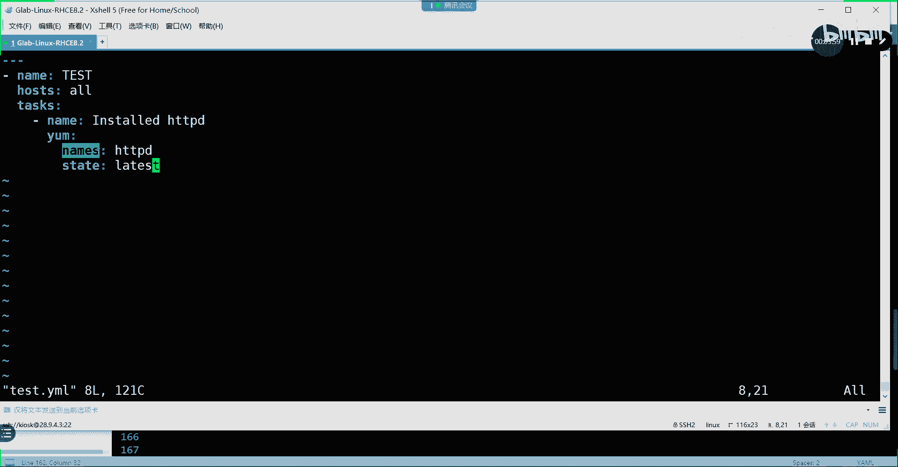

# 【Linux／RHCE／RHCSA】零基础入门Linux／红帽认证！Linux运维工程师的升职加薪宝典！RHCSA+RHCE／48-Ansible排错 - P1 - GLAB郭主任 - BV1CH4y1i75x

没事干嘛，你干嘛，OK好，所以呢下午第一第一个内容，我们是跟大家来聊一下playbook该如何排错啊，playboy该如何排错，好，我们一起来想一下吧。

一起来总结一下playbook该如何排错，我就想着写在这了啊，或者叫INSP，ESPORT排错思路，asp的排错思路啊，我们来简单的给大家列一列好，大家认为在就就拿你们最近在写playbook。

写SB的时候遇到的一些问题，你觉得嗯他的问题应该从几个方面来进行排查，我觉得应该从两个方面，第一个叫就是playbook本身，就你写的playbook本身有没有问题，playbook本身有没有问题。

你写的这个脚本有没有符合yo的规范，其实说白了就是是不是格式问题啊，明白我意思吗，格式问题还有什么问题啊，还有模块的使用的方法，不如比如说你用要安装一个软件，你应该用YYM模块模块指定要安装的软件包。

是不是用name来指定你安装什么软件对吧，对不对，OK那如果你用其他的呢，比如说你写了一个其他的叫names。

举个例子，我们就拿这个来举例，我们这也是这是一个在角色里面对吧，好我们就用它来举例子，因为有现成的ANSPORTCFG，我们拿它来举例子，比如说我们写了一个test点，NEO好，我们做一个测试name。

你看啊，杠杠杠杠，Name，冒号啊，比如说叫test好，那么比如说我们要安装一个软件包，我们hosts就用or吧，其他都不写了，T a s k s tasks，Tasks，第一个我们写的是name。

比如说我们要install，要安装，我现在在再举一个例子啊，install HTTP t吧，好不好，这时候我们应该用YM模块，项目模块下面要指定一个名字叫name name，叫HTTPD。

是不是把name改写成names，是不是也不行啊，这是不是属于playbook本身的问题啊，OK好，我们就写个SPSTAT状态是怎么写的啊，TTETTE好，我们写如果是用安装最新的版本。

要latest吧，对了l latest怎么写的，LATEST是吧啊，这说明是latest好，我们就写这么多，那我们这个时候用esport playbook去检测一下test，Yammo。

USYNTAX杠CHECK，诶有没有问题没有问题，所以我想说的是，如果你写的时候啊，发现如果写的是这种错误，这种错误，这个不属于语法错误，但是它属于playbook本身的错误，能听懂我意思吗，各位嗯。

语法它会帮你严格按照压缩的格式，它主要考虑的是缩进，缩进问题理解吗，好，那你playbook本身的问题，不不仅仅只包含缩进的这种语法问题吧，它还包含你的属性用的对不对的问题吧。

能听明白，所以要记清楚啊，第一个playbook本身的问题有格式问题，这个格式问题我们可以用SYNTAX，CHECK是不是通过这个参数去检查，理解吧，那么模块本身的方法使用有问题。

我该怎么去检查呢，怎么去检查，怎么去简单，还记得我们在之前有讲过一个命令叫杠大C，还记得吗，那个102130，然后呢这个端口设置杠大C还记得吗。

我们模拟运行，对不对，好报错了吧，所以杠大C这个叫在内存当中模拟运行，这个命令，可以来帮助我们检查当前的playbook本身，有没有问题，听懂了吗，OKOK这个一定要搞清楚啊，这个一定要搞清楚。

用杠大C啊，它是模拟在内存当中去运行，说清楚了吗，OK那么它是模拟内存当中去运行，它并没有直接把脚本，部署到受控节点的服务器上，还是在本地的吧，好所以这个属于第一部分排出的内容，第二部分呢。

是不是到受控主机上是不受控主机的问题对吧，第二部分export拍摄思路，第二部分啊，好playbook没有问题了，接下来playbook是不是要要向目标阻击去去控制啊，去下发控制指令。

所以接下来第二步要操控的就是受控主机上了，在数控主机上遇到的问题，第一个第一个什么问题啊，网络对不对，你是要通过网络把他送过去的呀，啊明白吗。

所以你一定要把网络搞通啊，啊网络要搞通啊，所以网络怎么搞的，懂了是不是sensible ping啊，ping是用来测网络最好的方式，我们用AD hook模块对吧，用，Com pin。

是不是可以通过ping来测试它的网络连通的吧，所以如果你用这个命令没有办法说明网络不通。

网络不通怎么通过，啊各位能明白不好，第二个呢，网络通了，网络通了，还有什么东西要要要考虑啊。

是不是是不是权限明白我意思吗，是不是权限问题，这个权限问题，一般在CFG里面会给大家写明白了，我们要通过s sport去远程部署受控节点，他要不要提前，然后提成什么权限，理解我的意思不啊，要不要提前。

他提成什么权限，然后有没有相关的提权的配置，在这里，我是用的是student，Student，有没有相关的提前配置，我们应该在受控节点的主机上去看看，我们的受控节点对100。30秒，Sorry。

我们到受控节点上主要看的是哪个命令，是不是VI速度啊，对不对，VI速度有没有，Student，student应该在while，应该在while这个组里面，while这个组有没有被提权，有没有放权。

有的吧，对不对，应该有的，你看啊，id student是不是属于while组，while是它的附加组，能理解吗，所以如果你远程去部署的普通用户，在目标的受控节点主机上没有提前这个操作。

那他就不能够去运行的脚本理解吗。

所以其实这部分属于我们环境部署的内容，在所有的SP运行之前，都应该要把环境部署正确，环境一定要部署正确，这个环境部署正确，就两个内容，我们讲SB就开始在讲这个，一个叫提前，还有一个是提前加什么免疫。

是不是免密啊对吧，我们讲环境，环境就大环境就是在刚开始的时候，部署环境的时候，就就就要讲两个内容，一个是如何去做普通用户的提前，一个是实现普通用户的免密登录吧，是不是就这俩OK。

所以现在跟这个受控节点主机上有关的，就是提权权限的问题，就是它权限的问题，好听得懂吗，OK那当然了，还有什么其他的问题了，还有很多很多很多其他的问题，比如说配置文件的问题啊。

刚才是不是有刚才我们上面是不是有总结，这个是吧，配置文件的问题啊，这个属于数控节点上啊，好权限说了，还有什么问题啊，还有SLINUX的问题吧，SLINUX有两个问题，我这边就写一个吧。

还有什么呢等等等等等，所有跟服务相关，在数控节点上起不起来的问题，这都属于第二大类的问题范畴，这都属于第二大类，各位能听明白吗，听懂吧，所以这部分内容我们只是列一些主要的问题啊，那么还有一些啊。

大家平时遇到的问题可以往里加，所以大部分问题一般会出在，数控节点的主机上啊，可能跑不成功，那你就要去看，本身就需要对你部署的这个服务的原理要了解，要了解，所以啊其实它只是一个工具，知道吗。

为什么这个工具非常流行，它只是一个工具，它是一个自动化运维的工具，大家想想我们在部署阿帕奇服务的时候，包括部署NGINK的时候，NGINX的服务对于ensable playbook脚本来讲的话。

其实就那几个模块吧，对不对啊，但是你要能够把NGINX，在目标服务器能够成功跑起来，你本身对NGINX这个服务是不是要了解啊，对它的原理是不是要懂啊，再举个例子，如果我用SB来配置思科路由器的BGP。

在ESPORT里面，它跟它相关的，就是跟BGB相关的几个模块有关系，但是如果你不懂BGP的选路原则对吧，不懂BGP的相关的一些核心原理黑洞对吧，BGP的反射这些所有东西你都不会，你的脚本估计也写不出来。

模块虽然我告诉你，但是你不知道怎么用理解我意思吗，说明我举这两个例子是告诉你，ANSPORT它只是一个工具，它只是一个工具，那么技术本身的核心原理，还是需要大家去掌握的，听懂听明白我意思吗。

OK好说到这，不得不无缝无缝对接一个，我们rh ca的标准课程。

好吧啊，这不来波广告啊，ca当中有一门专门的课是叫RH358新，我们最近新新加的新开的一门课，这个里面会有很多这个嗯什么阿帕奇的服务啊，看一下前两天的天参加了一个查一下，给大家看一眼，嗯我看看不在这。

ca新加了哎，我在这放，诶跑哪去了，不要加工模拟学校啊，这不是那个吗，那个不4475，对于自大了，你怎么叫做不是这个哎呦，我去这大，哦在这358就这啊，来看一眼。

这个就是2003个数量。

并没有对，我们讲师，前两天刚参加了一个一本红帽的一门新课，新科的培训，这就专门讲原理啊，第一个是网络，第二个是聚合DISDHCP，然后呢这个管理打印机邮件嗯，marry dB的数据库。

然后管理web主web主要讲的是这个NGINX，主要讲NGINX，然后这个web server啊，web server主要讲web，然后文件服务器主要讲NFS。

就大家刚刚在在CSI当中用到的那个第八题嘛，做那个NFS网络的storage，然后这个是这个叫什么呃，网络存储i sci i sci就在讲这些东西，就是我们的一门课三四天四天的内容，OK如果有兴趣。

可以到时候咨询一下我们的这个班主任好吧。

因为我们sport本身主要局限讲的是sport。

讲的是ANSPORT，本身他的这个工具该怎么用，它一点难度都没有，我觉得没有什么难度，但大家会在写的时候会有些难度是吧，就你对HTTP服务不了解，你写不出复杂的SP脚本出来的，只能够安装重启服务。

建文件，包括刚才我在刚才在上午给大家演示的时候，是不是演示的是利用角色部署，很复杂的这个这个这个这个任务，这个任务也是帮你写好的，为什么不需要大家做，因为不会让你写，写不出来。

你只需要把我给你写的这个任务都调用好，放到角色里就可以了，你听得懂我意思吗，各位对吧，所以其实还有很多的东西要学啊，同志们先甭管啊，我们先把C1考过再说啊，把C1考过再说好。

